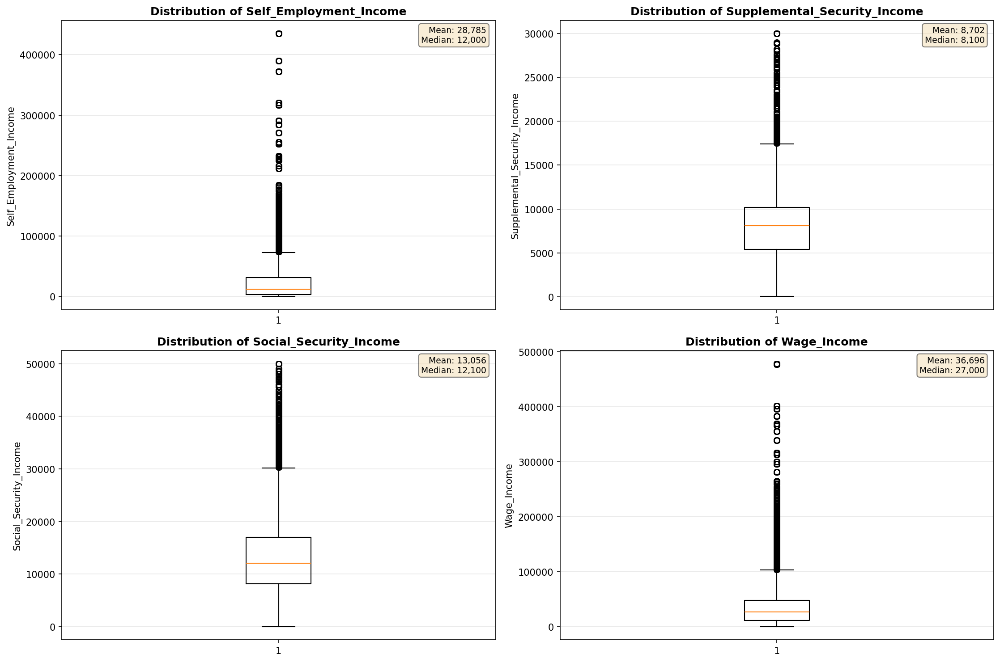
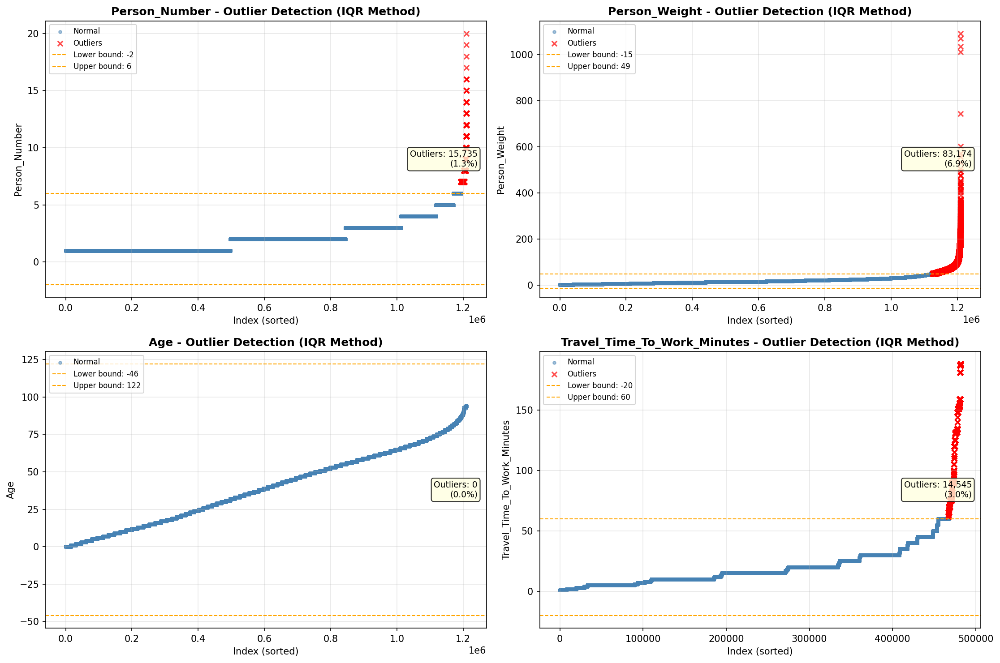

# Outlier Detection

> Statistical outlier detection using IQR (Interquartile Range) method. Outliers are values falling outside Q1 - 1.5×IQR or Q3 + 1.5×IQR bounds.

## Detection Methodology

| Parameter | Value | Description |
| :--- | :--- | :--- |
| Method | IQR | Outlier detection algorithm |
| Lower Bound | Q1 - 1.5 × IQR | Values below are outliers |
| Upper Bound | Q3 + 1.5 × IQR | Values above are outliers |
| IQR Definition | Q3 - Q1 | Interquartile Range |

> **Note**: The IQR method is robust to extreme values and works well for approximately symmetric distributions.

## Outlier Summary

_No outlier summary available._
## High Outlier Rate Variables

> Variables with outlier rate > 5% may indicate data quality issues, non-normal distributions, or genuinely extreme values.

- **('Total_Annual_Hours', 13.343844999627539)**: 0 outliers (0.00%)

- **('Interest_Dividend_Rental_Income', 11.743198277549423)**: 0 outliers (0.00%)

- **('Flag_Wage_Income', 10.75442938363083)**: 0 outliers (0.00%)

- **('Other_Income', 9.652329366561716)**: 0 outliers (0.00%)

- **('Public_Assistance_Income', 9.415543519334928)**: 0 outliers (0.00%)

- **('Flag_Interest_Dividend_Income', 9.28934782213361)**: 0 outliers (0.00%)

- **('Hours_Worked_Per_Week', 9.257514632072715)**: 0 outliers (0.00%)

- **('Flag_Social_Security_Income', 9.03847203003566)**: 0 outliers (0.00%)

- **('Self_Employment_Income', 8.371714608786785)**: 0 outliers (0.00%)

- **('Flag_Retirement_Income', 8.32535655773615)**: 0 outliers (0.00%)

- **('Flag_Other_Income', 7.9242859339275)**: 0 outliers (0.00%)

- **('Flag_Supplemental_Security_Income', 7.557932882666177)**: 0 outliers (0.00%)

- **('Supplemental_Security_Income', 7.203179334326876)**: 0 outliers (0.00%)

- **('Income_Per_Hour', 6.667291175687535)**: 0 outliers (0.00%)

- **('Flag_Self_Employment_Income', 6.316283698777115)**: 0 outliers (0.00%)

> *Consider investigating these variables for data entry errors, applying transformations, or using robust statistical methods.*

## Visualizations

