# Statistical Analysis

> Comprehensive descriptive statistics including central tendency, dispersion, distribution characteristics, and weighted statistics using ACS sample weights.

## Summary Statistics

- **Variables Analyzed**: 37

### Income_Adjustment_Factor

| Statistic | Unweighted | Weighted (ACS) |
| :--- | :--- | :--- |
| Mean | 1,058,094.27 | 1,058,097.15 |
| Median | 1,051,849.00 | 1,059,677.73 |
| Std Deviation | 45,717.21 | — |
| Minimum | 999,480.00 | — |
| Maximum | 1,207,712.00 | — |
| Count | 4,340,468 | — |

> *Distribution is highly right-skewed (skewness: 1.25), light-tailed/platykurtic (kurtosis: 1.45).*

- **Coefficient of Variation**: 4.3 % (low variability)

### Property_Value

| Statistic | Unweighted | Weighted (ACS) |
| :--- | :--- | :--- |
| Mean | 15.74 | 16.39 |
| Median | 17.00 | 17.67 |
| Std Deviation | 4.89 | — |
| Minimum | 1.00 | — |
| Maximum | 24.00 | — |
| Count | 571,308 | — |

> *Distribution is moderately left-skewed (skewness: -0.84), light-tailed/platykurtic (kurtosis: 0.39).*

- **Coefficient of Variation**: 31.1 % (moderate variability)

#### Weighted Statistics by Year

| Year | Weighted Mean | Weighted Median |
| :--- | :--- | :--- |
| 2009 | 16.39 | 18.00 |
| 2010 | 16.44 | 18.00 |
| 2011 | 16.34 | 17.00 |

### Electricity_Cost_Monthly

| Statistic | Unweighted | Weighted (ACS) |
| :--- | :--- | :--- |
| Mean | 120.03 | 114.55 |
| Median | 100.00 | 92.67 |
| Std Deviation | 91.46 | — |
| Minimum | 1.00 | — |
| Maximum | 2,600.00 | — |
| Count | 3,677,706 | — |

> *Distribution is highly right-skewed (skewness: 6.54), heavy-tailed/leptokurtic (kurtosis: 145.01).*

- **Coefficient of Variation**: 76.2 % (high variability)

### Fuel_Cost_Monthly

| Statistic | Unweighted | Weighted (ACS) |
| :--- | :--- | :--- |
| Mean | 56.99 | 305.40 |
| Median | 2.00 | 171.87 |
| Std Deviation | 305.60 | — |
| Minimum | 1.00 | — |
| Maximum | 5,700.00 | — |
| Count | 2,275,275 | — |

> *Distribution is highly right-skewed (skewness: 7.99), heavy-tailed/leptokurtic (kurtosis: 80.42).*

- **Coefficient of Variation**: 536.2 % (very high variability)

### Gas_Cost_Monthly

| Statistic | Unweighted | Weighted (ACS) |
| :--- | :--- | :--- |
| Mean | 84.39 | 84.16 |
| Median | 60.00 | 61.33 |
| Std Deviation | 90.37 | — |
| Minimum | 1.00 | — |
| Maximum | 2,100.00 | — |
| Count | 3,304,532 | — |

> *Distribution is highly right-skewed (skewness: 4.58), heavy-tailed/leptokurtic (kurtosis: 67.85).*

- **Coefficient of Variation**: 107.1 % (very high variability)

### Insurance_Cost_Yearly

| Statistic | Unweighted | Weighted (ACS) |
| :--- | :--- | :--- |
| Mean | 939.66 | 945.52 |
| Median | 800.00 | 814.00 |
| Std Deviation | 722.42 | — |
| Minimum | 4.00 | — |
| Maximum | 9,600.00 | — |
| Count | 2,480,400 | — |

> *Distribution is highly right-skewed (skewness: 3.41), heavy-tailed/leptokurtic (kurtosis: 19.01).*

- **Coefficient of Variation**: 76.9 % (high variability)

### Water_Cost_Yearly

| Statistic | Unweighted | Weighted (ACS) |
| :--- | :--- | :--- |
| Mean | 426.33 | 448.39 |
| Median | 340.00 | 335.33 |
| Std Deviation | 461.84 | — |
| Minimum | 1.00 | — |
| Maximum | 4,000.00 | — |
| Count | 3,301,414 | — |

> *Distribution is highly right-skewed (skewness: 1.97), heavy-tailed/leptokurtic (kurtosis: 6.96).*

- **Coefficient of Variation**: 108.3 % (very high variability)

### Mobile_Home_Costs_Monthly

| Statistic | Unweighted | Weighted (ACS) |
| :--- | :--- | :--- |
| Mean | 1,809.39 | 2,443.55 |
| Median | 470.00 | 844.67 |
| Std Deviation | 2,624.63 | — |
| Minimum | 4.00 | — |
| Maximum | 24,600.00 | — |
| Count | 69,610 | — |

> *Distribution is highly right-skewed (skewness: 2.46), heavy-tailed/leptokurtic (kurtosis: 10.50).*

- **Coefficient of Variation**: 145.1 % (very high variability)

### First_Mortgage_Payment_Monthly

| Statistic | Unweighted | Weighted (ACS) |
| :--- | :--- | :--- |
| Mean | 1,219.22 | 1,301.96 |
| Median | 1,000.00 | 1,133.33 |
| Std Deviation | 873.60 | — |
| Minimum | 4.00 | — |
| Maximum | 6,700.00 | — |
| Count | 1,692,899 | — |

> *Distribution is highly right-skewed (skewness: 1.94), heavy-tailed/leptokurtic (kurtosis: 6.04).*

- **Coefficient of Variation**: 71.7 % (high variability)

### First_Mortgage_Includes_Taxes

| Statistic | Unweighted | Weighted (ACS) |
| :--- | :--- | :--- |
| Mean | 1.41 | 1.37 |
| Median | 1.00 | 1.00 |
| Std Deviation | 0.49 | — |
| Minimum | 1.00 | — |
| Maximum | 2.00 | — |
| Count | 1,692,899 | — |

> *Distribution is approximately symmetric (skewness: 0.38), light-tailed/platykurtic (kurtosis: -1.85).*

- **Coefficient of Variation**: 34.9 % (moderate variability)

### Second_Mortgage_Payment_Monthly

| Statistic | Unweighted | Weighted (ACS) |
| :--- | :--- | :--- |
| Mean | 384.24 | 394.46 |
| Median | 270.00 | 277.33 |
| Std Deviation | 412.82 | — |
| Minimum | 4.00 | — |
| Maximum | 4,800.00 | — |
| Count | 315,546 | — |

> *Distribution is highly right-skewed (skewness: 3.67), heavy-tailed/leptokurtic (kurtosis: 20.12).*

- **Coefficient of Variation**: 107.4 % (very high variability)

### Property_Taxes_Yearly

| Statistic | Unweighted | Weighted (ACS) |
| :--- | :--- | :--- |
| Mean | 41.78 | 44.57 |
| Median | 42.00 | 47.44 |
| Std Deviation | 19.97 | — |
| Minimum | 1.00 | — |
| Maximum | 68.00 | — |
| Count | 1,653,303 | — |

> *Distribution is approximately symmetric (skewness: -0.32), light-tailed/platykurtic (kurtosis: -1.05).*

- **Coefficient of Variation**: 47.8 % (moderate variability)

### Meals_Included_in_Rent

| Statistic | Unweighted | Weighted (ACS) |
| :--- | :--- | :--- |
| Mean | 1.97 | 1.97 |
| Median | 2.00 | 2.00 |
| Std Deviation | 0.16 | — |
| Minimum | 1.00 | — |
| Maximum | 2.00 | — |
| Count | 970,948 | — |

> *Distribution is highly left-skewed (skewness: -6.02), heavy-tailed/leptokurtic (kurtosis: 34.20).*

- **Coefficient of Variation**: 8.0 % (low variability)

### Rent_Amount_Monthly

| Statistic | Unweighted | Weighted (ACS) |
| :--- | :--- | :--- |
| Mean | 848.73 | 887.09 |
| Median | 740.00 | 786.00 |
| Std Deviation | 557.43 | — |
| Minimum | 4.00 | — |
| Maximum | 4,900.00 | — |
| Count | 970,948 | — |

> *Distribution is highly right-skewed (skewness: 1.89), heavy-tailed/leptokurtic (kurtosis: 6.13).*

- **Coefficient of Variation**: 65.7 % (high variability)

### Gross_Rent

| Statistic | Unweighted | Weighted (ACS) |
| :--- | :--- | :--- |
| Mean | 994.11 | 1,024.76 |
| Median | 880.00 | 922.07 |
| Std Deviation | 573.64 | — |
| Minimum | 4.00 | — |
| Maximum | 9,400.00 | — |
| Count | 917,021 | — |

> *Distribution is highly right-skewed (skewness: 1.75), heavy-tailed/leptokurtic (kurtosis: 5.71).*

- **Coefficient of Variation**: 57.7 % (high variability)

### Gross_Rent_Percentage_Income

| Statistic | Unweighted | Weighted (ACS) |
| :--- | :--- | :--- |
| Mean | 38.50 | 39.25 |
| Median | 29.00 | 29.27 |
| Std Deviation | 27.72 | — |
| Minimum | 1.00 | — |
| Maximum | 101.00 | — |
| Count | 893,442 | — |

> *Distribution is highly right-skewed (skewness: 1.16), light-tailed/platykurtic (kurtosis: 0.22).*

- **Coefficient of Variation**: 72.0 % (high variability)

### Selected_Monthly_Owner_Costs

| Statistic | Unweighted | Weighted (ACS) |
| :--- | :--- | :--- |
| Mean | 1,348.77 | 1,463.53 |
| Median | 1,061.00 | 1,217.87 |
| Std Deviation | 1,071.32 | — |
| Minimum | 2.00 | — |
| Maximum | 16,976.00 | — |
| Count | 2,755,331 | — |

> *Distribution is highly right-skewed (skewness: 2.20), heavy-tailed/leptokurtic (kurtosis: 8.19).*

- **Coefficient of Variation**: 79.4 % (high variability)

### Owner_Costs_Percentage_Income

| Statistic | Unweighted | Weighted (ACS) |
| :--- | :--- | :--- |
| Mean | 24.30 | 25.76 |
| Median | 18.00 | 19.47 |
| Std Deviation | 20.87 | — |
| Minimum | 1.00 | — |
| Maximum | 101.00 | — |
| Count | 2,738,142 | — |

> *Distribution is highly right-skewed (skewness: 2.09), heavy-tailed/leptokurtic (kurtosis: 4.56).*

- **Coefficient of Variation**: 85.9 % (high variability)

### Family_Income

| Statistic | Unweighted | Weighted (ACS) |
| :--- | :--- | :--- |
| Mean | 99,551.01 | 98,438.50 |
| Median | 75,000.00 | 74,790.27 |
| Std Deviation | 98,963.21 | — |
| Minimum | 1.00 | — |
| Maximum | 1,923,000.00 | — |
| Count | 2,443,234 | — |

> *Distribution is highly right-skewed (skewness: 3.58), heavy-tailed/leptokurtic (kurtosis: 20.49).*

- **Coefficient of Variation**: 99.4 % (high variability)

### Household_Income

| Statistic | Unweighted | Weighted (ACS) |
| :--- | :--- | :--- |
| Mean | 84,090.71 | 83,423.94 |
| Median | 60,100.00 | 60,560.00 |
| Std Deviation | 90,772.03 | — |
| Minimum | 1.00 | — |
| Maximum | 1,923,000.00 | — |
| Count | 3,685,320 | — |

> *Distribution is highly right-skewed (skewness: 3.79), heavy-tailed/leptokurtic (kurtosis: 23.53).*

- **Coefficient of Variation**: 107.9 % (very high variability)

### Specified_Rent_Unit

| Statistic | Unweighted | Weighted (ACS) |
| :--- | :--- | :--- |
| Mean | 0.26 | 0.32 |
| Median | 0.00 | 0.00 |
| Std Deviation | 0.44 | — |
| Minimum | 0.00 | — |
| Maximum | 1.00 | — |
| Count | 3,973,843 | — |

> *Distribution is highly right-skewed (skewness: 1.12), light-tailed/platykurtic (kurtosis: -0.75).*

- **Coefficient of Variation**: 170.4 % (very high variability)

### Specified_Value_Unit

| Statistic | Unweighted | Weighted (ACS) |
| :--- | :--- | :--- |
| Mean | 0.59 | 0.52 |
| Median | 1.00 | 1.00 |
| Std Deviation | 0.49 | — |
| Minimum | 0.00 | — |
| Maximum | 1.00 | — |
| Count | 3,973,843 | — |

> *Distribution is approximately symmetric (skewness: -0.38), light-tailed/platykurtic (kurtosis: -1.86).*

- **Coefficient of Variation**: 83.0 % (high variability)

### Flag_First_Mortgage_Payment

| Statistic | Unweighted | Weighted (ACS) |
| :--- | :--- | :--- |
| Mean | 0.04 | 0.04 |
| Median | 0.00 | 0.00 |
| Std Deviation | 0.19 | — |
| Minimum | 0.00 | — |
| Maximum | 1.00 | — |
| Count | 3,973,843 | — |

> *Distribution is highly right-skewed (skewness: 4.76), heavy-tailed/leptokurtic (kurtosis: 20.70).*

- **Coefficient of Variation**: 496.6 % (very high variability)

### Flag_First_Mortgage_Taxes

| Statistic | Unweighted | Weighted (ACS) |
| :--- | :--- | :--- |
| Mean | 0.03 | 0.03 |
| Median | 0.00 | 0.00 |
| Std Deviation | 0.18 | — |
| Minimum | 0.00 | — |
| Maximum | 1.00 | — |
| Count | 3,973,843 | — |

> *Distribution is highly right-skewed (skewness: 5.31), heavy-tailed/leptokurtic (kurtosis: 26.20).*

- **Coefficient of Variation**: 549.3 % (very high variability)

### Flag_Meals_Included_Rent

| Statistic | Unweighted | Weighted (ACS) |
| :--- | :--- | :--- |
| Mean | 0.01 | 0.01 |
| Median | 0.00 | 0.00 |
| Std Deviation | 0.08 | — |
| Minimum | 0.00 | — |
| Maximum | 1.00 | — |
| Count | 3,973,843 | — |

> *Distribution is highly right-skewed (skewness: 12.07), heavy-tailed/leptokurtic (kurtosis: 143.57).*

- **Coefficient of Variation**: 1,214.7 % (very high variability)

### Flag_Rent_Amount

| Statistic | Unweighted | Weighted (ACS) |
| :--- | :--- | :--- |
| Mean | 0.02 | 0.03 |
| Median | 0.00 | 0.00 |
| Std Deviation | 0.15 | — |
| Minimum | 0.00 | — |
| Maximum | 1.00 | — |
| Count | 3,973,843 | — |

> *Distribution is highly right-skewed (skewness: 6.46), heavy-tailed/leptokurtic (kurtosis: 39.76).*

- **Coefficient of Variation**: 661.3 % (very high variability)

### Flag_Second_Mortgage_Payment

| Statistic | Unweighted | Weighted (ACS) |
| :--- | :--- | :--- |
| Mean | 0.04 | 0.04 |
| Median | 0.00 | 0.00 |
| Std Deviation | 0.18 | — |
| Minimum | 0.00 | — |
| Maximum | 1.00 | — |
| Count | 3,973,843 | — |

> *Distribution is highly right-skewed (skewness: 5.06), heavy-tailed/leptokurtic (kurtosis: 23.58).*

- **Coefficient of Variation**: 524.8 % (very high variability)

### Flag_Property_Taxes

| Statistic | Unweighted | Weighted (ACS) |
| :--- | :--- | :--- |
| Mean | 0.08 | 0.08 |
| Median | 0.00 | 0.00 |
| Std Deviation | 0.27 | — |
| Minimum | 0.00 | — |
| Maximum | 1.00 | — |
| Count | 3,973,843 | — |

> *Distribution is highly right-skewed (skewness: 3.13), heavy-tailed/leptokurtic (kurtosis: 7.78).*

- **Coefficient of Variation**: 342.0 % (very high variability)

### Flag_Property_Value

| Statistic | Unweighted | Weighted (ACS) |
| :--- | :--- | :--- |
| Mean | 0.07 | 0.07 |
| Median | 0.00 | 0.00 |
| Std Deviation | 0.26 | — |
| Minimum | 0.00 | — |
| Maximum | 1.00 | — |
| Count | 3,973,843 | — |

> *Distribution is highly right-skewed (skewness: 3.30), heavy-tailed/leptokurtic (kurtosis: 8.89).*

- **Coefficient of Variation**: 357.9 % (very high variability)

### Flag_Water_Cost

| Statistic | Unweighted | Weighted (ACS) |
| :--- | :--- | :--- |
| Mean | 0.06 | 0.07 |
| Median | 0.00 | 0.00 |
| Std Deviation | 0.24 | — |
| Minimum | 0.00 | — |
| Maximum | 1.00 | — |
| Count | 3,973,843 | — |

> *Distribution is highly right-skewed (skewness: 3.64), heavy-tailed/leptokurtic (kurtosis: 11.23).*

- **Coefficient of Variation**: 389.4 % (very high variability)

### Annual_Rent_to_Value_Ratio

### Total_Monthly_Utility_Cost

| Statistic | Unweighted | Weighted (ACS) |
| :--- | :--- | :--- |
| Mean | 195.24 | 187.76 |
| Median | 170.00 | 163.27 |
| Std Deviation | 137.71 | — |
| Minimum | 2.00 | — |
| Maximum | 4,700.00 | — |
| Count | 3,689,463 | — |

> *Distribution is highly right-skewed (skewness: 5.87), heavy-tailed/leptokurtic (kurtosis: 128.01).*

- **Coefficient of Variation**: 70.5 % (high variability)

### Property_Tax_Rate

| Statistic | Unweighted | Weighted (ACS) |
| :--- | :--- | :--- |
| Mean | 251.01 | 255.99 |
| Median | 262.50 | 270.63 |
| Std Deviation | 93.64 | — |
| Minimum | 4.17 | — |
| Maximum | 2,300.00 | — |
| Count | 562,278 | — |

> *Distribution is highly right-skewed (skewness: 1.74), heavy-tailed/leptokurtic (kurtosis: 29.95).*

- **Coefficient of Variation**: 37.3 % (moderate variability)

#### Weighted Statistics by Year

| Year | Weighted Mean | Weighted Median |
| :--- | :--- | :--- |
| 2009 | 250.23 | 261.90 |
| 2010 | 255.64 | 270.00 |
| 2011 | 262.11 | 280.00 |

### Structure_Age

| Statistic | Unweighted | Weighted (ACS) |
| :--- | :--- | :--- |
| Mean | 2,019.27 | 2,019.17 |
| Median | 2,019.00 | 2,019.50 |
| Std Deviation | 2.90 | — |
| Minimum | 2,000.00 | — |
| Maximum | 2,023.00 | — |
| Count | 3,177,382 | — |

> *Distribution is moderately left-skewed (skewness: -0.85), light-tailed/platykurtic (kurtosis: 1.84).*

- **Coefficient of Variation**: 0.1 % (low variability)

### Structure_Age_Score

| Statistic | Unweighted | Weighted (ACS) |
| :--- | :--- | :--- |
| Mean | 0.00 | 0.00 |
| Median | 0.00 | 0.00 |
| Std Deviation | 0.00 | — |
| Minimum | 0.00 | — |
| Maximum | 0.00 | — |
| Count | 3,177,382 | — |

> *Distribution is approximately symmetric (skewness: nan).*

### Working_Age_Persons

| Statistic | Unweighted | Weighted (ACS) |
| :--- | :--- | :--- |
| Mean | 1.73 | 1.82 |
| Median | 2.00 | 2.00 |
| Std Deviation | 1.38 | — |
| Minimum | 0.00 | — |
| Maximum | 20.00 | — |
| Count | 3,730,016 | — |

> *Distribution is moderately right-skewed (skewness: 0.88), light-tailed/platykurtic (kurtosis: 1.76).*

- **Coefficient of Variation**: 79.7 % (high variability)

### Income_to_FPL_Ratio

| Statistic | Unweighted | Weighted (ACS) |
| :--- | :--- | :--- |
| Mean | 3.79 | 3.73 |
| Median | 2.80 | 2.78 |
| Std Deviation | 4.01 | — |
| Minimum | -1.12 | — |
| Maximum | 97.52 | — |
| Count | 3,730,016 | — |

> *Distribution is highly right-skewed (skewness: 4.07), heavy-tailed/leptokurtic (kurtosis: 28.42).*

- **Coefficient of Variation**: 105.8 % (very high variability)

## Distribution Analysis

### Skewed Distributions

> Variables with skewness > |0.5| indicate non-normal distributions. Consider log transformations for highly skewed variables in modeling.

| Variable | Skewness | Direction | Severity |
| :--- | :--- | :--- | :--- |
| Flag_Meals_Included_Rent | 12.065 | Right-skewed | High |
| Fuel_Cost_Monthly | 7.991 | Right-skewed | High |
| Electricity_Cost_Monthly | 6.538 | Right-skewed | High |
| Flag_Rent_Amount | 6.462 | Right-skewed | High |
| Meals_Included_in_Rent | -6.017 | Left-skewed | High |
| Total_Monthly_Utility_Cost | 5.868 | Right-skewed | High |
| Flag_First_Mortgage_Taxes | 5.311 | Right-skewed | High |
| Flag_Second_Mortgage_Payment | 5.058 | Right-skewed | High |
| Flag_First_Mortgage_Payment | 4.764 | Right-skewed | High |
| Gas_Cost_Monthly | 4.576 | Right-skewed | High |
| Income_to_FPL_Ratio | 4.070 | Right-skewed | High |
| Household_Income | 3.793 | Right-skewed | High |
| Second_Mortgage_Payment_Monthly | 3.669 | Right-skewed | High |
| Flag_Water_Cost | 3.637 | Right-skewed | High |
| Family_Income | 3.581 | Right-skewed | High |
| Insurance_Cost_Yearly | 3.410 | Right-skewed | High |
| Flag_Property_Value | 3.300 | Right-skewed | High |
| Flag_Property_Taxes | 3.128 | Right-skewed | High |
| Mobile_Home_Costs_Monthly | 2.461 | Right-skewed | High |
| Selected_Monthly_Owner_Costs | 2.204 | Right-skewed | High |

- **Total Skewed Variables**: 32

- **Right-skewed**: 29

- **Left-skewed**: 3

## Variance Analysis

### Coefficient of Variation Ranking

> CV (Coefficient of Variation) = (Std Dev / Mean) × 100%. Higher CV indicates greater relative variability.

| Variable | CV (%) | Std Dev | Mean | Variability |
| :--- | :--- | :--- | :--- | :--- |
| Flag_Meals_Included_Rent | 1214.7% | 0.08 | 0.01 | Very High |
| Flag_Rent_Amount | 661.3% | 0.15 | 0.02 | Very High |
| Flag_First_Mortgage_Taxes | 549.3% | 0.18 | 0.03 | Very High |
| Fuel_Cost_Monthly | 536.2% | 305.60 | 56.99 | Very High |
| Flag_Second_Mortgage_Payment | 524.8% | 0.18 | 0.04 | Very High |
| Flag_First_Mortgage_Payment | 496.6% | 0.19 | 0.04 | Very High |
| Flag_Water_Cost | 389.4% | 0.24 | 0.06 | Very High |
| Flag_Property_Value | 357.9% | 0.26 | 0.07 | Very High |
| Flag_Property_Taxes | 342.0% | 0.27 | 0.08 | Very High |
| Specified_Rent_Unit | 170.4% | 0.44 | 0.26 | Very High |
| Mobile_Home_Costs_Monthly | 145.1% | 2,624.63 | 1,809.39 | Very High |
| Water_Cost_Yearly | 108.3% | 461.84 | 426.33 | Very High |
| Household_Income | 107.9% | 90,772.03 | 84,090.71 | Very High |
| Second_Mortgage_Payment_Monthly | 107.4% | 412.82 | 384.24 | Very High |
| Gas_Cost_Monthly | 107.1% | 90.37 | 84.39 | Very High |
| Income_to_FPL_Ratio | 105.8% | 4.01 | 3.79 | Very High |
| Family_Income | 99.4% | 98,963.21 | 99,551.01 | High |
| Owner_Costs_Percentage_Income | 85.9% | 20.87 | 24.30 | High |
| Specified_Value_Unit | 83.0% | 0.49 | 0.59 | High |
| Working_Age_Persons | 79.7% | 1.38 | 1.73 | High |

- **Average CV**: 200.2 %

- **High Variance Variables (CV > 50%)**: 28

## Visualizations

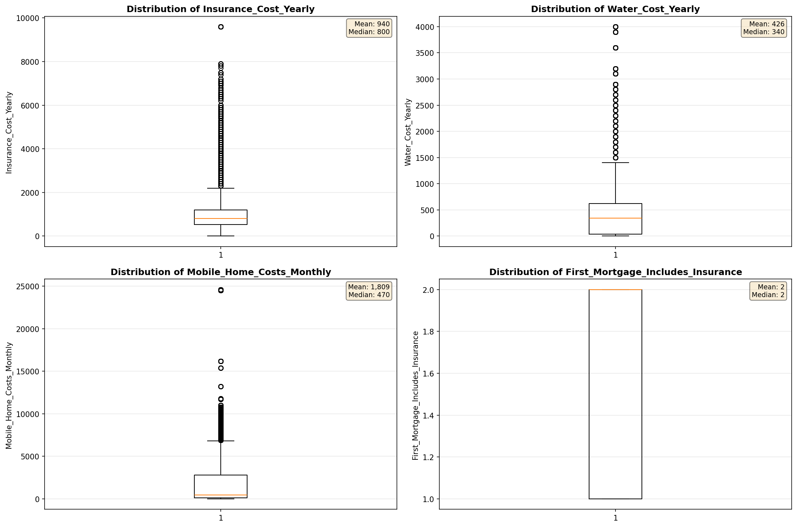

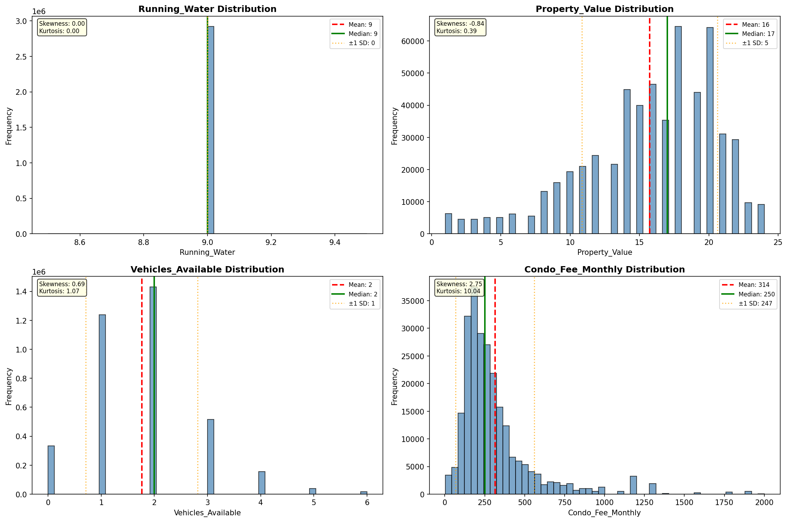

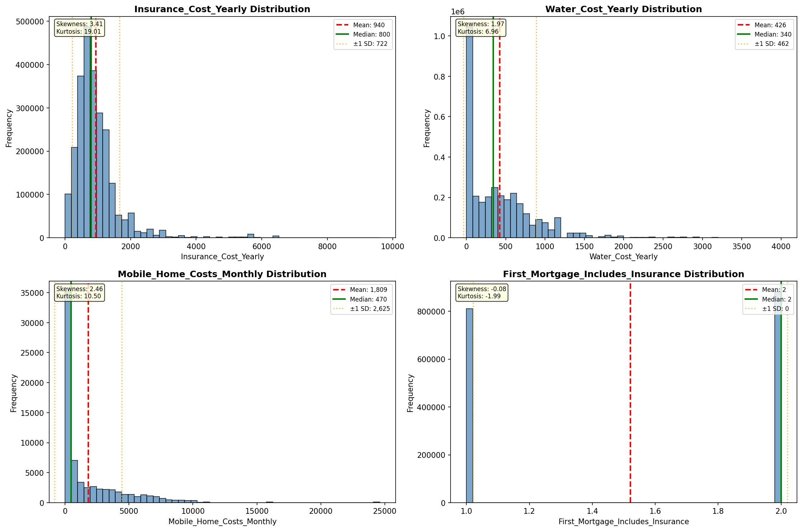

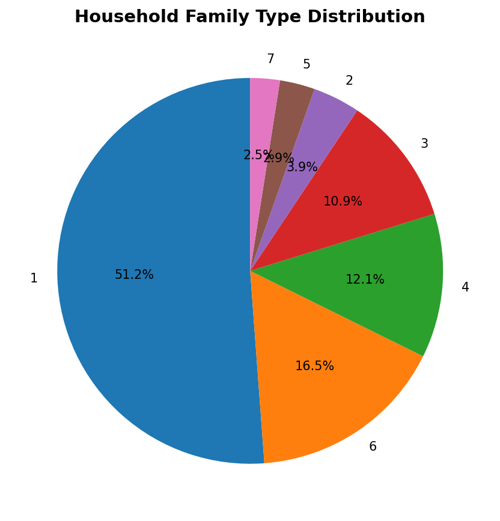

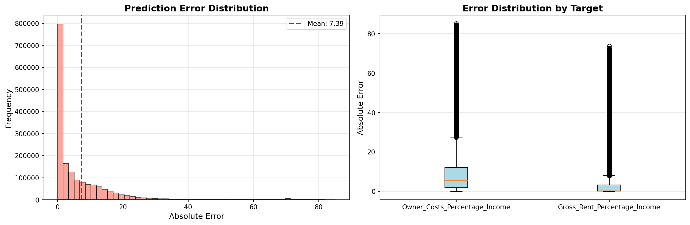

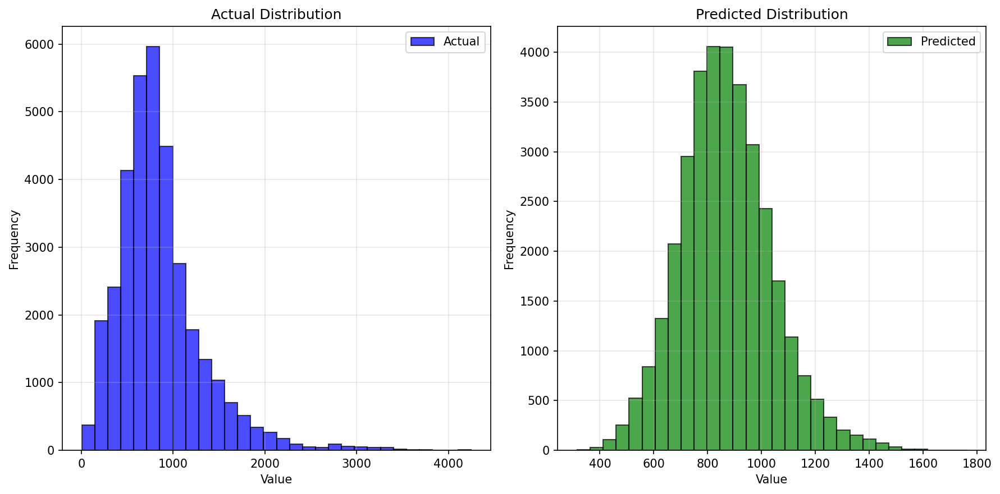

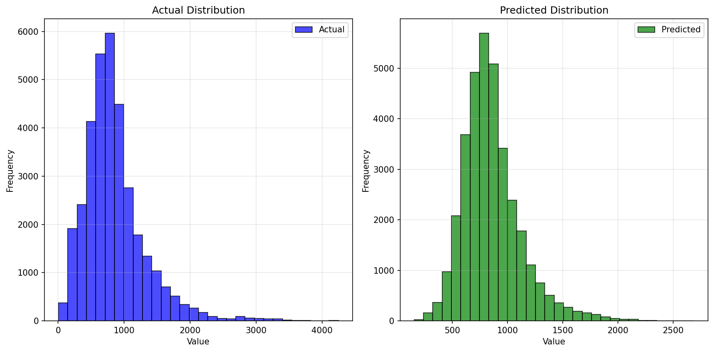

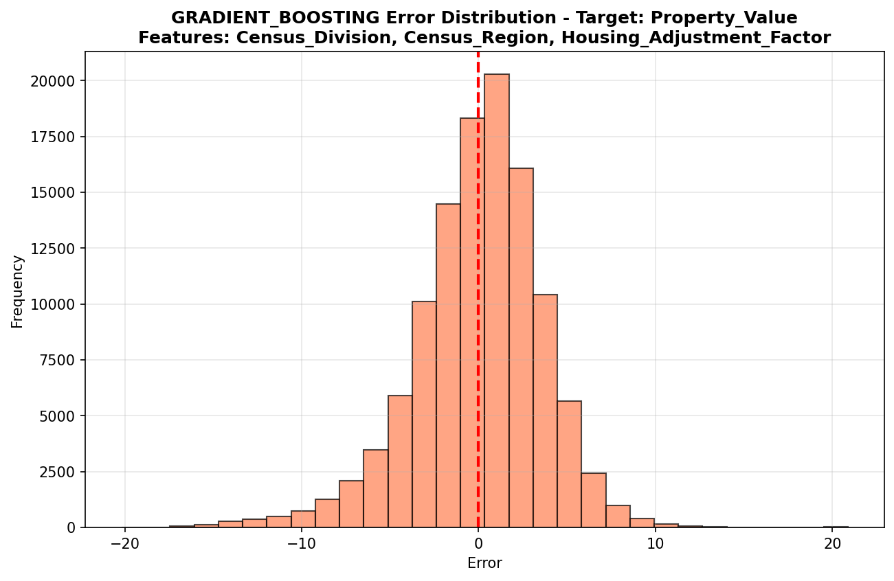

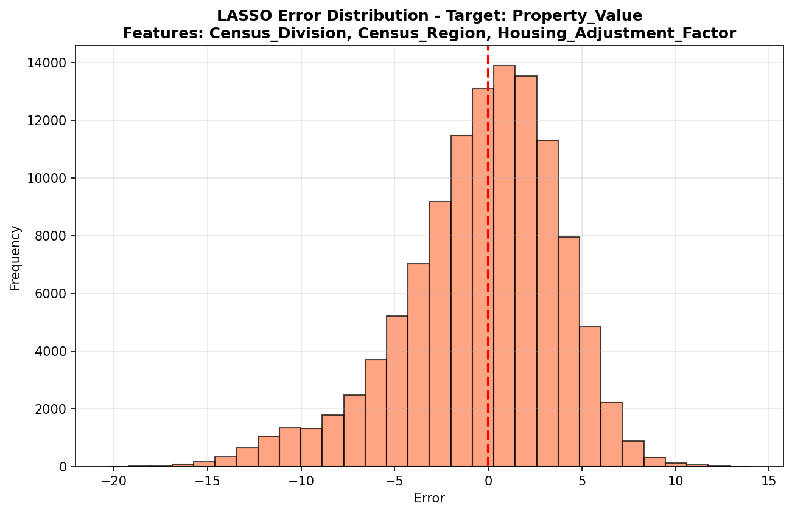

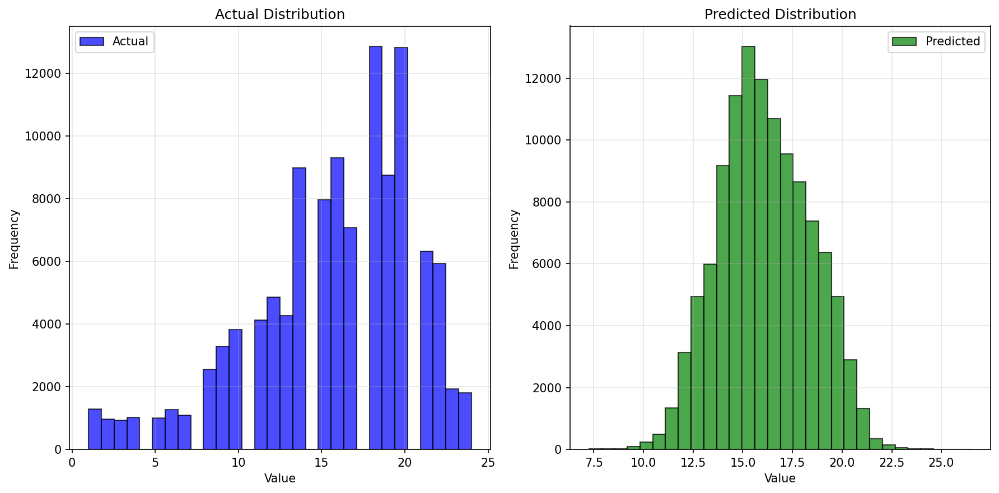

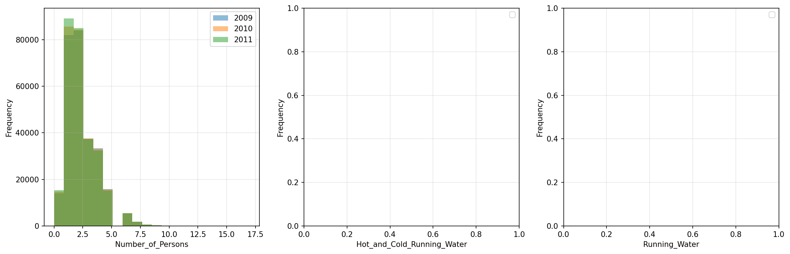

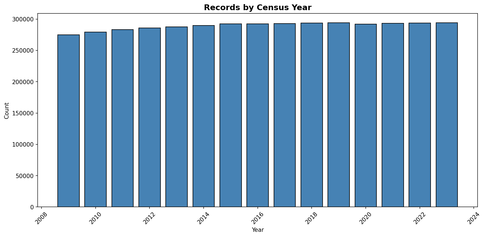
