# Statistical Analysis

> Comprehensive descriptive statistics including central tendency, dispersion, distribution characteristics, and weighted statistics using ACS sample weights.

## Summary Statistics

- **Variables Analyzed**: 37

### Income_Adjustment_Factor

| Statistic | Unweighted | Weighted (ACS) |
| :--- | :--- | :--- |
| Mean | 1,058,039.16 | 1,058,045.99 |
| Median | 1,051,849.00 | 1,059,677.73 |
| Std Deviation | 45,710.43 | — |
| Minimum | 999,480.00 | — |
| Maximum | 1,207,712.00 | — |
| Count | 2,342,642 | — |

> *Distribution is highly right-skewed (skewness: 1.25), light-tailed/platykurtic (kurtosis: 1.46).*

- **Coefficient of Variation**: 4.3 % (low variability)

### Property_Value

| Statistic | Unweighted | Weighted (ACS) |
| :--- | :--- | :--- |
| Mean | 13.74 | 13.87 |
| Median | 14.00 | 14.00 |
| Std Deviation | 4.36 | — |
| Minimum | 1.00 | — |
| Maximum | 24.00 | — |
| Count | 303,971 | — |

> *Distribution is moderately left-skewed (skewness: -0.66), light-tailed/platykurtic (kurtosis: 0.73).*

- **Coefficient of Variation**: 31.7 % (moderate variability)

#### Weighted Statistics by Year

| Year | Weighted Mean | Weighted Median |
| :--- | :--- | :--- |
| 2009 | 13.78 | 14.00 |
| 2010 | 13.90 | 14.00 |
| 2011 | 13.92 | 14.00 |

### Electricity_Cost_Monthly

| Statistic | Unweighted | Weighted (ACS) |
| :--- | :--- | :--- |
| Mean | 138.40 | 138.69 |
| Median | 120.00 | 119.33 |
| Std Deviation | 99.33 | — |
| Minimum | 1.00 | — |
| Maximum | 3,100.00 | — |
| Count | 1,941,083 | — |

> *Distribution is highly right-skewed (skewness: 6.43), heavy-tailed/leptokurtic (kurtosis: 146.72).*

- **Coefficient of Variation**: 71.8 % (high variability)

### Fuel_Cost_Monthly

| Statistic | Unweighted | Weighted (ACS) |
| :--- | :--- | :--- |
| Mean | 102.27 | 340.89 |
| Median | 2.00 | 201.20 |
| Std Deviation | 394.41 | — |
| Minimum | 1.00 | — |
| Maximum | 5,800.00 | — |
| Count | 1,220,597 | — |

> *Distribution is highly right-skewed (skewness: 5.54), heavy-tailed/leptokurtic (kurtosis: 38.16).*

- **Coefficient of Variation**: 385.7 % (very high variability)

### Gas_Cost_Monthly

| Statistic | Unweighted | Weighted (ACS) |
| :--- | :--- | :--- |
| Mean | 75.89 | 76.08 |
| Median | 50.00 | 50.00 |
| Std Deviation | 90.11 | — |
| Minimum | 1.00 | — |
| Maximum | 2,100.00 | — |
| Count | 1,677,628 | — |

> *Distribution is highly right-skewed (skewness: 4.92), heavy-tailed/leptokurtic (kurtosis: 74.38).*

- **Coefficient of Variation**: 118.7 % (very high variability)

### Insurance_Cost_Yearly

| Statistic | Unweighted | Weighted (ACS) |
| :--- | :--- | :--- |
| Mean | 912.23 | 931.27 |
| Median | 800.00 | 836.67 |
| Std Deviation | 596.16 | — |
| Minimum | 4.00 | — |
| Maximum | 8,200.00 | — |
| Count | 1,290,710 | — |

> *Distribution is highly right-skewed (skewness: 2.79), heavy-tailed/leptokurtic (kurtosis: 14.83).*

- **Coefficient of Variation**: 65.4 % (high variability)

### Water_Cost_Yearly

| Statistic | Unweighted | Weighted (ACS) |
| :--- | :--- | :--- |
| Mean | 432.60 | 438.20 |
| Median | 340.00 | 323.33 |
| Std Deviation | 469.96 | — |
| Minimum | 1.00 | — |
| Maximum | 4,200.00 | — |
| Count | 1,737,652 | — |

> *Distribution is highly right-skewed (skewness: 1.63), heavy-tailed/leptokurtic (kurtosis: 4.52).*

- **Coefficient of Variation**: 108.6 % (very high variability)

### Mobile_Home_Costs_Monthly

| Statistic | Unweighted | Weighted (ACS) |
| :--- | :--- | :--- |
| Mean | 1,803.63 | 1,982.41 |
| Median | 850.00 | 1,236.00 |
| Std Deviation | 2,017.96 | — |
| Minimum | 4.00 | — |
| Maximum | 26,000.00 | — |
| Count | 52,578 | — |

> *Distribution is highly right-skewed (skewness: 2.47), heavy-tailed/leptokurtic (kurtosis: 16.50).*

- **Coefficient of Variation**: 111.9 % (very high variability)

### First_Mortgage_Payment_Monthly

| Statistic | Unweighted | Weighted (ACS) |
| :--- | :--- | :--- |
| Mean | 822.70 | 869.50 |
| Median | 700.00 | 751.33 |
| Std Deviation | 535.17 | — |
| Minimum | 4.00 | — |
| Maximum | 4,900.00 | — |
| Count | 944,582 | — |

> *Distribution is highly right-skewed (skewness: 2.27), heavy-tailed/leptokurtic (kurtosis: 8.72).*

- **Coefficient of Variation**: 65.1 % (high variability)

### First_Mortgage_Includes_Taxes

| Statistic | Unweighted | Weighted (ACS) |
| :--- | :--- | :--- |
| Mean | 1.34 | 1.31 |
| Median | 1.00 | 1.00 |
| Std Deviation | 0.47 | — |
| Minimum | 1.00 | — |
| Maximum | 2.00 | — |
| Count | 944,582 | — |

> *Distribution is moderately right-skewed (skewness: 0.70), light-tailed/platykurtic (kurtosis: -1.51).*

- **Coefficient of Variation**: 35.4 % (moderate variability)

### Second_Mortgage_Payment_Monthly

| Statistic | Unweighted | Weighted (ACS) |
| :--- | :--- | :--- |
| Mean | 295.85 | 302.77 |
| Median | 210.00 | 212.00 |
| Std Deviation | 298.63 | — |
| Minimum | 4.00 | — |
| Maximum | 3,000.00 | — |
| Count | 172,361 | — |

> *Distribution is highly right-skewed (skewness: 3.51), heavy-tailed/leptokurtic (kurtosis: 17.54).*

- **Coefficient of Variation**: 100.9 % (very high variability)

### Property_Taxes_Yearly

| Statistic | Unweighted | Weighted (ACS) |
| :--- | :--- | :--- |
| Mean | 21.65 | 22.76 |
| Median | 20.00 | 22.22 |
| Std Deviation | 13.64 | — |
| Minimum | 1.00 | — |
| Maximum | 68.00 | — |
| Count | 882,521 | — |

> *Distribution is moderately right-skewed (skewness: 0.98), light-tailed/platykurtic (kurtosis: 1.10).*

- **Coefficient of Variation**: 63.0 % (high variability)

### Meals_Included_in_Rent

| Statistic | Unweighted | Weighted (ACS) |
| :--- | :--- | :--- |
| Mean | 1.98 | 1.98 |
| Median | 2.00 | 2.00 |
| Std Deviation | 0.14 | — |
| Minimum | 1.00 | — |
| Maximum | 2.00 | — |
| Count | 492,059 | — |

> *Distribution is highly left-skewed (skewness: -6.72), heavy-tailed/leptokurtic (kurtosis: 43.17).*

- **Coefficient of Variation**: 7.2 % (low variability)

### Rent_Amount_Monthly

| Statistic | Unweighted | Weighted (ACS) |
| :--- | :--- | :--- |
| Mean | 616.66 | 649.62 |
| Median | 570.00 | 598.67 |
| Std Deviation | 347.06 | — |
| Minimum | 4.00 | — |
| Maximum | 3,300.00 | — |
| Count | 492,059 | — |

> *Distribution is highly right-skewed (skewness: 2.56), heavy-tailed/leptokurtic (kurtosis: 11.88).*

- **Coefficient of Variation**: 56.3 % (high variability)

### Gross_Rent

| Statistic | Unweighted | Weighted (ACS) |
| :--- | :--- | :--- |
| Mean | 780.16 | 807.03 |
| Median | 730.00 | 757.73 |
| Std Deviation | 376.49 | — |
| Minimum | 4.00 | — |
| Maximum | 6,492.00 | — |
| Count | 460,146 | — |

> *Distribution is highly right-skewed (skewness: 1.92), heavy-tailed/leptokurtic (kurtosis: 8.34).*

- **Coefficient of Variation**: 48.3 % (moderate variability)

### Gross_Rent_Percentage_Income

| Statistic | Unweighted | Weighted (ACS) |
| :--- | :--- | :--- |
| Mean | 37.78 | 38.25 |
| Median | 28.00 | 28.80 |
| Std Deviation | 27.08 | — |
| Minimum | 1.00 | — |
| Maximum | 101.00 | — |
| Count | 449,540 | — |

> *Distribution is highly right-skewed (skewness: 1.21), light-tailed/platykurtic (kurtosis: 0.41).*

- **Coefficient of Variation**: 71.7 % (high variability)

### Selected_Monthly_Owner_Costs

| Statistic | Unweighted | Weighted (ACS) |
| :--- | :--- | :--- |
| Mean | 934.01 | 987.79 |
| Median | 805.00 | 866.53 |
| Std Deviation | 670.16 | — |
| Minimum | 2.00 | — |
| Maximum | 11,783.00 | — |
| Count | 1,477,543 | — |

> *Distribution is highly right-skewed (skewness: 2.25), heavy-tailed/leptokurtic (kurtosis: 9.69).*

- **Coefficient of Variation**: 71.8 % (high variability)

### Owner_Costs_Percentage_Income

| Statistic | Unweighted | Weighted (ACS) |
| :--- | :--- | :--- |
| Mean | 21.14 | 21.56 |
| Median | 16.00 | 16.60 |
| Std Deviation | 18.54 | — |
| Minimum | 1.00 | — |
| Maximum | 101.00 | — |
| Count | 1,469,032 | — |

> *Distribution is highly right-skewed (skewness: 2.44), heavy-tailed/leptokurtic (kurtosis: 6.93).*

- **Coefficient of Variation**: 87.7 % (high variability)

### Family_Income

| Statistic | Unweighted | Weighted (ACS) |
| :--- | :--- | :--- |
| Mean | 79,585.75 | 79,971.65 |
| Median | 63,200.00 | 63,920.00 |
| Std Deviation | 71,689.98 | — |
| Minimum | 1.00 | — |
| Maximum | 1,468,000.00 | — |
| Count | 1,296,245 | — |

> *Distribution is highly right-skewed (skewness: 3.63), heavy-tailed/leptokurtic (kurtosis: 23.24).*

- **Coefficient of Variation**: 90.1 % (high variability)

### Household_Income

| Statistic | Unweighted | Weighted (ACS) |
| :--- | :--- | :--- |
| Mean | 67,305.91 | 67,690.28 |
| Median | 51,000.00 | 51,498.67 |
| Std Deviation | 66,359.60 | — |
| Minimum | 1.00 | — |
| Maximum | 1,468,000.00 | — |
| Count | 1,951,223 | — |

> *Distribution is highly right-skewed (skewness: 3.78), heavy-tailed/leptokurtic (kurtosis: 25.62).*

- **Coefficient of Variation**: 98.6 % (high variability)

### Specified_Rent_Unit

| Statistic | Unweighted | Weighted (ACS) |
| :--- | :--- | :--- |
| Mean | 0.25 | 0.29 |
| Median | 0.00 | 0.00 |
| Std Deviation | 0.43 | — |
| Minimum | 0.00 | — |
| Maximum | 1.00 | — |
| Count | 2,115,221 | — |

> *Distribution is highly right-skewed (skewness: 1.18), light-tailed/platykurtic (kurtosis: -0.60).*

- **Coefficient of Variation**: 175.4 % (very high variability)

### Specified_Value_Unit

| Statistic | Unweighted | Weighted (ACS) |
| :--- | :--- | :--- |
| Mean | 0.62 | 0.56 |
| Median | 1.00 | 1.00 |
| Std Deviation | 0.48 | — |
| Minimum | 0.00 | — |
| Maximum | 1.00 | — |
| Count | 2,115,221 | — |

> *Distribution is moderately left-skewed (skewness: -0.52), light-tailed/platykurtic (kurtosis: -1.73).*

- **Coefficient of Variation**: 77.5 % (high variability)

### Flag_First_Mortgage_Payment

| Statistic | Unweighted | Weighted (ACS) |
| :--- | :--- | :--- |
| Mean | 0.04 | 0.04 |
| Median | 0.00 | 0.00 |
| Std Deviation | 0.18 | — |
| Minimum | 0.00 | — |
| Maximum | 1.00 | — |
| Count | 2,115,221 | — |

> *Distribution is highly right-skewed (skewness: 5.05), heavy-tailed/leptokurtic (kurtosis: 23.54).*

- **Coefficient of Variation**: 524.5 % (very high variability)

### Flag_First_Mortgage_Taxes

| Statistic | Unweighted | Weighted (ACS) |
| :--- | :--- | :--- |
| Mean | 0.03 | 0.03 |
| Median | 0.00 | 0.00 |
| Std Deviation | 0.18 | — |
| Minimum | 0.00 | — |
| Maximum | 1.00 | — |
| Count | 2,115,221 | — |

> *Distribution is highly right-skewed (skewness: 5.12), heavy-tailed/leptokurtic (kurtosis: 24.25).*

- **Coefficient of Variation**: 531.2 % (very high variability)

### Flag_Meals_Included_Rent

| Statistic | Unweighted | Weighted (ACS) |
| :--- | :--- | :--- |
| Mean | 0.01 | 0.01 |
| Median | 0.00 | 0.00 |
| Std Deviation | 0.08 | — |
| Minimum | 0.00 | — |
| Maximum | 1.00 | — |
| Count | 2,115,221 | — |

> *Distribution is highly right-skewed (skewness: 12.70), heavy-tailed/leptokurtic (kurtosis: 159.17).*

- **Coefficient of Variation**: 1,277.3 % (very high variability)

### Flag_Rent_Amount

| Statistic | Unweighted | Weighted (ACS) |
| :--- | :--- | :--- |
| Mean | 0.02 | 0.02 |
| Median | 0.00 | 0.00 |
| Std Deviation | 0.13 | — |
| Minimum | 0.00 | — |
| Maximum | 1.00 | — |
| Count | 2,115,221 | — |

> *Distribution is highly right-skewed (skewness: 7.32), heavy-tailed/leptokurtic (kurtosis: 51.63).*

- **Coefficient of Variation**: 745.8 % (very high variability)

### Flag_Second_Mortgage_Payment

| Statistic | Unweighted | Weighted (ACS) |
| :--- | :--- | :--- |
| Mean | 0.03 | 0.03 |
| Median | 0.00 | 0.00 |
| Std Deviation | 0.17 | — |
| Minimum | 0.00 | — |
| Maximum | 1.00 | — |
| Count | 2,115,221 | — |

> *Distribution is highly right-skewed (skewness: 5.40), heavy-tailed/leptokurtic (kurtosis: 27.16).*

- **Coefficient of Variation**: 558.0 % (very high variability)

### Flag_Property_Taxes

| Statistic | Unweighted | Weighted (ACS) |
| :--- | :--- | :--- |
| Mean | 0.10 | 0.10 |
| Median | 0.00 | 0.00 |
| Std Deviation | 0.29 | — |
| Minimum | 0.00 | — |
| Maximum | 1.00 | — |
| Count | 2,115,221 | — |

> *Distribution is highly right-skewed (skewness: 2.74), heavy-tailed/leptokurtic (kurtosis: 5.52).*

- **Coefficient of Variation**: 306.9 % (very high variability)

### Flag_Property_Value

| Statistic | Unweighted | Weighted (ACS) |
| :--- | :--- | :--- |
| Mean | 0.06 | 0.06 |
| Median | 0.00 | 0.00 |
| Std Deviation | 0.25 | — |
| Minimum | 0.00 | — |
| Maximum | 1.00 | — |
| Count | 2,115,221 | — |

> *Distribution is highly right-skewed (skewness: 3.54), heavy-tailed/leptokurtic (kurtosis: 10.56).*

- **Coefficient of Variation**: 380.7 % (very high variability)

### Flag_Water_Cost

| Statistic | Unweighted | Weighted (ACS) |
| :--- | :--- | :--- |
| Mean | 0.06 | 0.07 |
| Median | 0.00 | 0.00 |
| Std Deviation | 0.24 | — |
| Minimum | 0.00 | — |
| Maximum | 1.00 | — |
| Count | 2,115,221 | — |

> *Distribution is highly right-skewed (skewness: 3.57), heavy-tailed/leptokurtic (kurtosis: 10.72).*

- **Coefficient of Variation**: 382.7 % (very high variability)

### Annual_Rent_to_Value_Ratio

### Total_Monthly_Utility_Cost

| Statistic | Unweighted | Weighted (ACS) |
| :--- | :--- | :--- |
| Mean | 203.28 | 199.64 |
| Median | 180.00 | 176.73 |
| Std Deviation | 135.17 | — |
| Minimum | 2.00 | — |
| Maximum | 5,000.00 | — |
| Count | 1,947,844 | — |

> *Distribution is highly right-skewed (skewness: 6.21), heavy-tailed/leptokurtic (kurtosis: 141.30).*

- **Coefficient of Variation**: 66.5 % (high variability)

### Property_Tax_Rate

| Statistic | Unweighted | Weighted (ACS) |
| :--- | :--- | :--- |
| Mean | 167.12 | 170.43 |
| Median | 157.14 | 159.98 |
| Std Deviation | 96.25 | — |
| Minimum | 4.17 | — |
| Maximum | 2,000.00 | — |
| Count | 298,443 | — |

> *Distribution is highly right-skewed (skewness: 3.69), heavy-tailed/leptokurtic (kurtosis: 35.67).*

- **Coefficient of Variation**: 57.6 % (high variability)

#### Weighted Statistics by Year

| Year | Weighted Mean | Weighted Median |
| :--- | :--- | :--- |
| 2009 | 171.89 | 161.11 |
| 2010 | 170.42 | 160.00 |
| 2011 | 168.99 | 158.82 |

### Structure_Age

| Statistic | Unweighted | Weighted (ACS) |
| :--- | :--- | :--- |
| Mean | 2,019.10 | 2,018.89 |
| Median | 2,019.00 | 2,018.92 |
| Std Deviation | 3.01 | — |
| Minimum | 2,000.00 | — |
| Maximum | 2,023.00 | — |
| Count | 1,690,157 | — |

> *Distribution is highly left-skewed (skewness: -1.05), light-tailed/platykurtic (kurtosis: 2.73).*

- **Coefficient of Variation**: 0.1 % (low variability)

### Structure_Age_Score

| Statistic | Unweighted | Weighted (ACS) |
| :--- | :--- | :--- |
| Mean | 0.00 | 0.00 |
| Median | 0.00 | 0.00 |
| Std Deviation | 0.00 | — |
| Minimum | 0.00 | — |
| Maximum | 0.00 | — |
| Count | 1,690,157 | — |

> *Distribution is approximately symmetric (skewness: nan).*

### Working_Age_Persons

| Statistic | Unweighted | Weighted (ACS) |
| :--- | :--- | :--- |
| Mean | 1.69 | 1.78 |
| Median | 2.00 | 2.00 |
| Std Deviation | 1.36 | — |
| Minimum | 0.00 | — |
| Maximum | 20.00 | — |
| Count | 1,972,283 | — |

> *Distribution is moderately right-skewed (skewness: 0.94), light-tailed/platykurtic (kurtosis: 2.15).*

- **Coefficient of Variation**: 80.5 % (high variability)

### Income_to_FPL_Ratio

| Statistic | Unweighted | Weighted (ACS) |
| :--- | :--- | :--- |
| Mean | 3.07 | 3.05 |
| Median | 2.40 | 2.39 |
| Std Deviation | 2.98 | — |
| Minimum | -1.01 | — |
| Maximum | 74.44 | — |
| Count | 1,972,283 | — |

> *Distribution is highly right-skewed (skewness: 4.18), heavy-tailed/leptokurtic (kurtosis: 32.11).*

- **Coefficient of Variation**: 97.1 % (high variability)

## Distribution Analysis

### Skewed Distributions

> Variables with skewness > |0.5| indicate non-normal distributions. Consider log transformations for highly skewed variables in modeling.

| Variable | Skewness | Direction | Severity |
| :--- | :--- | :--- | :--- |
| Flag_Meals_Included_Rent | 12.695 | Right-skewed | High |
| Flag_Rent_Amount | 7.324 | Right-skewed | High |
| Meals_Included_in_Rent | -6.721 | Left-skewed | High |
| Electricity_Cost_Monthly | 6.430 | Right-skewed | High |
| Total_Monthly_Utility_Cost | 6.209 | Right-skewed | High |
| Fuel_Cost_Monthly | 5.542 | Right-skewed | High |
| Flag_Second_Mortgage_Payment | 5.400 | Right-skewed | High |
| Flag_First_Mortgage_Taxes | 5.124 | Right-skewed | High |
| Flag_First_Mortgage_Payment | 5.054 | Right-skewed | High |
| Gas_Cost_Monthly | 4.919 | Right-skewed | High |
| Income_to_FPL_Ratio | 4.178 | Right-skewed | High |
| Household_Income | 3.781 | Right-skewed | High |
| Property_Tax_Rate | 3.694 | Right-skewed | High |
| Family_Income | 3.634 | Right-skewed | High |
| Flag_Water_Cost | 3.566 | Right-skewed | High |
| Flag_Property_Value | 3.544 | Right-skewed | High |
| Second_Mortgage_Payment_Monthly | 3.506 | Right-skewed | High |
| Insurance_Cost_Yearly | 2.792 | Right-skewed | High |
| Flag_Property_Taxes | 2.743 | Right-skewed | High |
| Rent_Amount_Monthly | 2.564 | Right-skewed | High |

- **Total Skewed Variables**: 35

- **Right-skewed**: 31

- **Left-skewed**: 4

## Variance Analysis

### Coefficient of Variation Ranking

> CV (Coefficient of Variation) = (Std Dev / Mean) × 100%. Higher CV indicates greater relative variability.

| Variable | CV (%) | Std Dev | Mean | Variability |
| :--- | :--- | :--- | :--- | :--- |
| Flag_Meals_Included_Rent | 1277.3% | 0.08 | 0.01 | Very High |
| Flag_Rent_Amount | 745.8% | 0.13 | 0.02 | Very High |
| Flag_Second_Mortgage_Payment | 558.0% | 0.17 | 0.03 | Very High |
| Flag_First_Mortgage_Taxes | 531.2% | 0.18 | 0.03 | Very High |
| Flag_First_Mortgage_Payment | 524.5% | 0.18 | 0.04 | Very High |
| Fuel_Cost_Monthly | 385.7% | 394.41 | 102.27 | Very High |
| Flag_Water_Cost | 382.7% | 0.24 | 0.06 | Very High |
| Flag_Property_Value | 380.7% | 0.25 | 0.06 | Very High |
| Flag_Property_Taxes | 306.9% | 0.29 | 0.10 | Very High |
| Specified_Rent_Unit | 175.4% | 0.43 | 0.25 | Very High |
| Gas_Cost_Monthly | 118.7% | 90.11 | 75.89 | Very High |
| Mobile_Home_Costs_Monthly | 111.9% | 2,017.96 | 1,803.63 | Very High |
| Water_Cost_Yearly | 108.6% | 469.96 | 432.60 | Very High |
| Second_Mortgage_Payment_Monthly | 100.9% | 298.63 | 295.85 | Very High |
| Household_Income | 98.6% | 66,359.60 | 67,305.91 | High |
| Income_to_FPL_Ratio | 97.1% | 2.98 | 3.07 | High |
| Family_Income | 90.1% | 71,689.98 | 79,585.75 | High |
| Owner_Costs_Percentage_Income | 87.7% | 18.54 | 21.14 | High |
| Working_Age_Persons | 80.5% | 1.36 | 1.69 | High |
| Specified_Value_Unit | 77.5% | 0.48 | 0.62 | High |

- **Average CV**: 198.7 %

- **High Variance Variables (CV > 50%)**: 29

## Visualizations

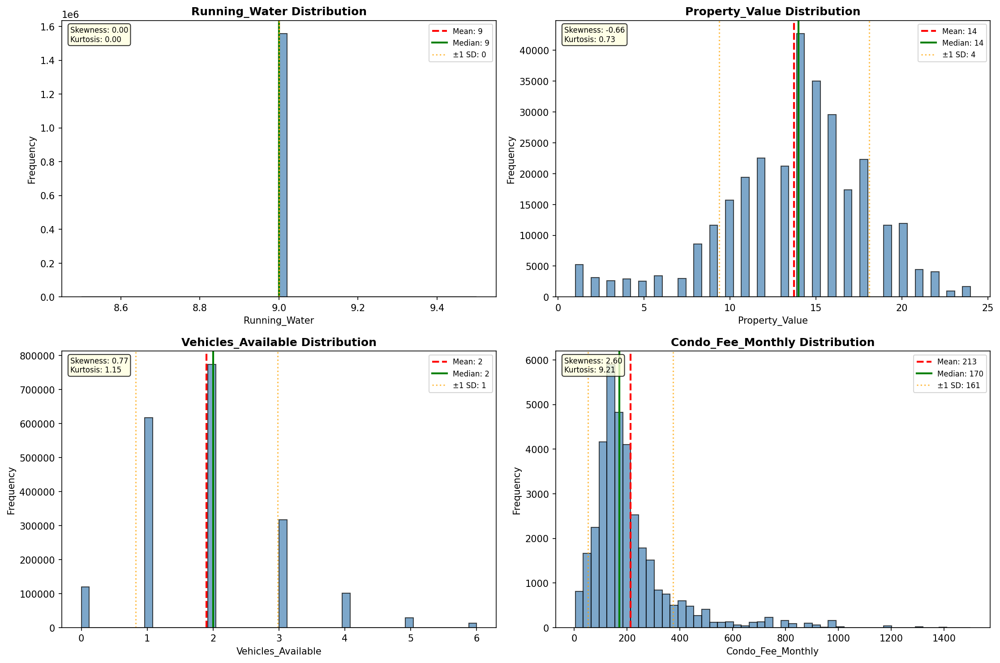

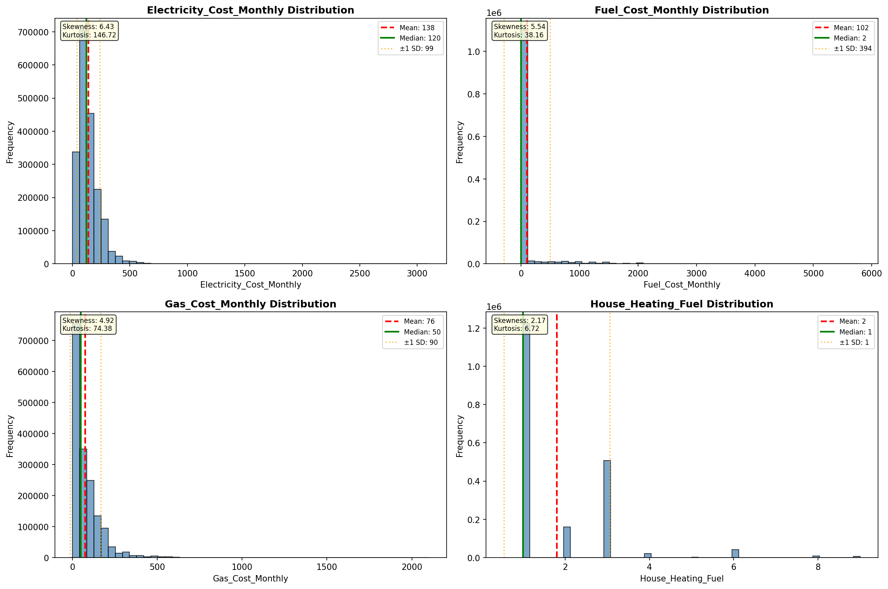

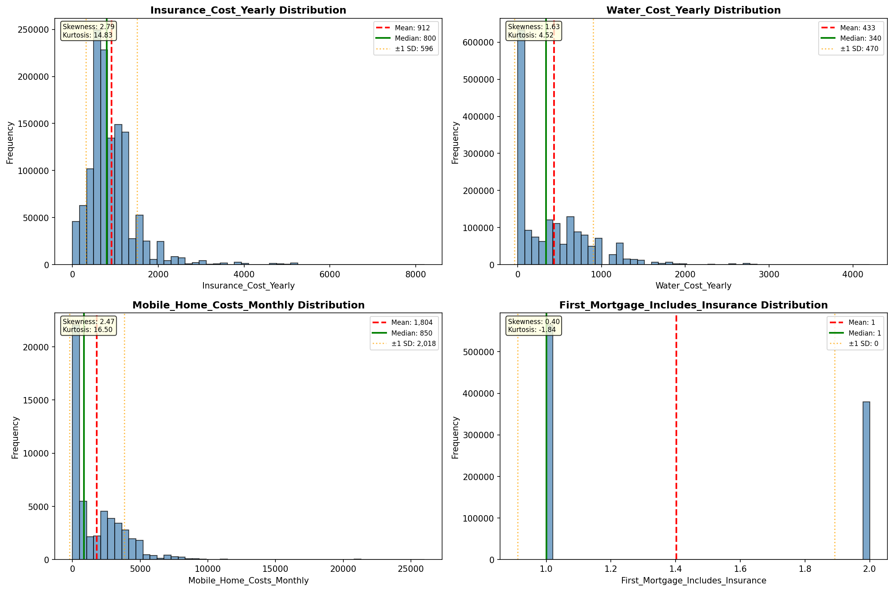

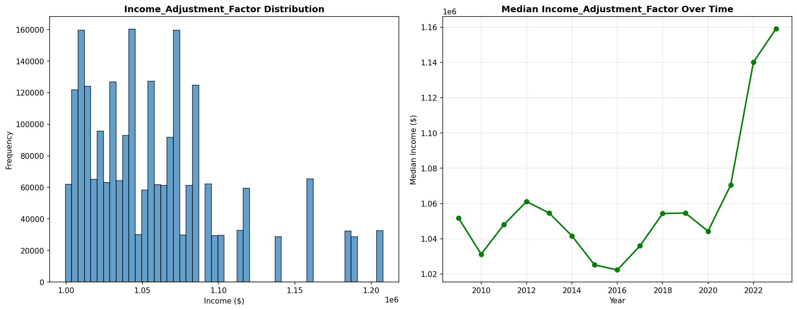

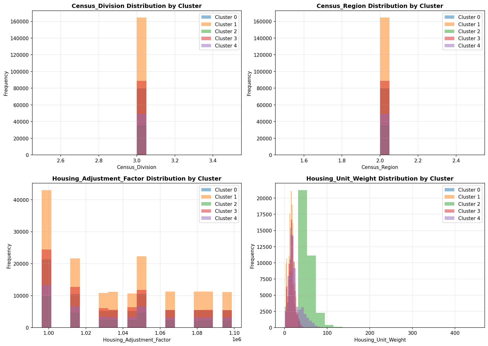

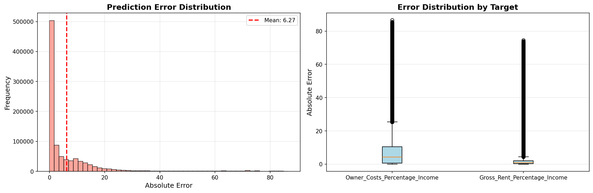

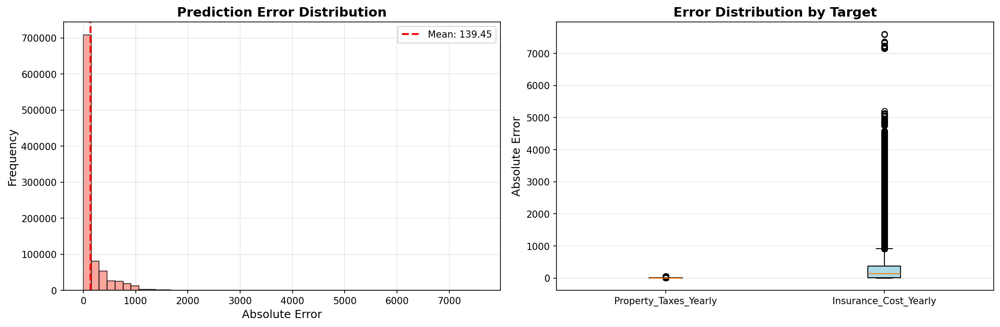

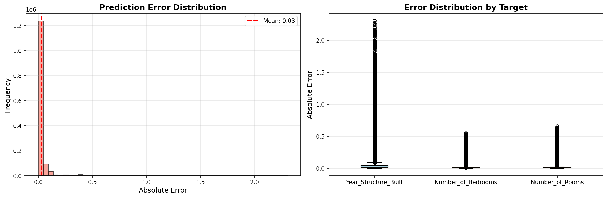

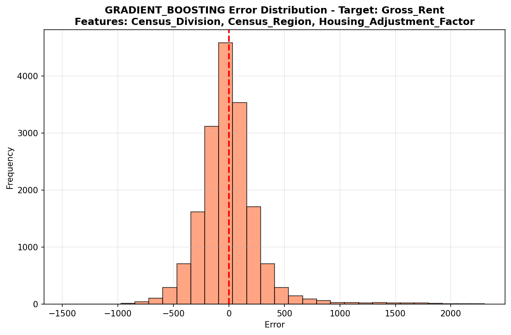

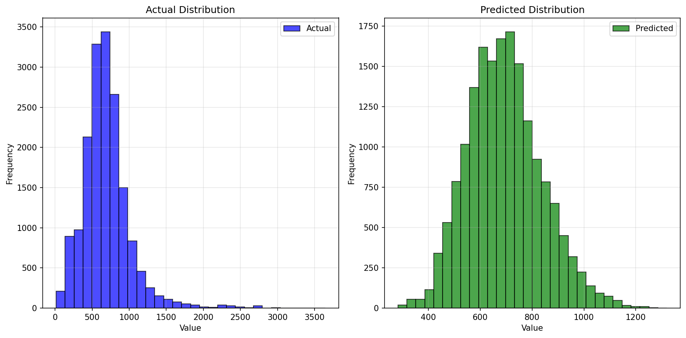

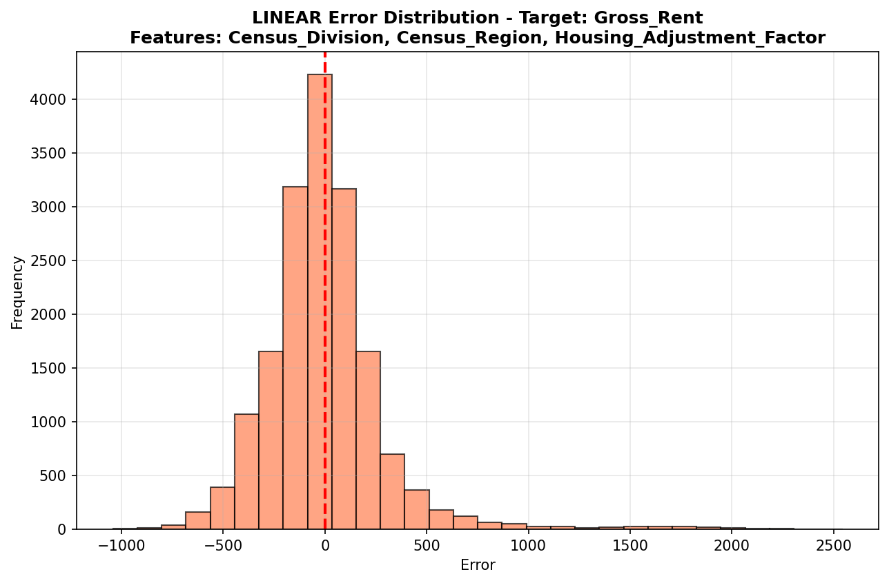

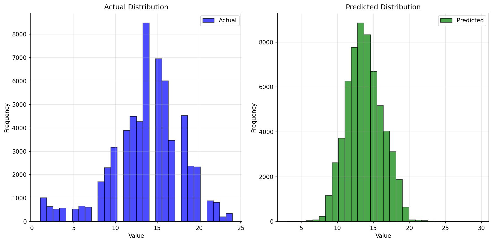

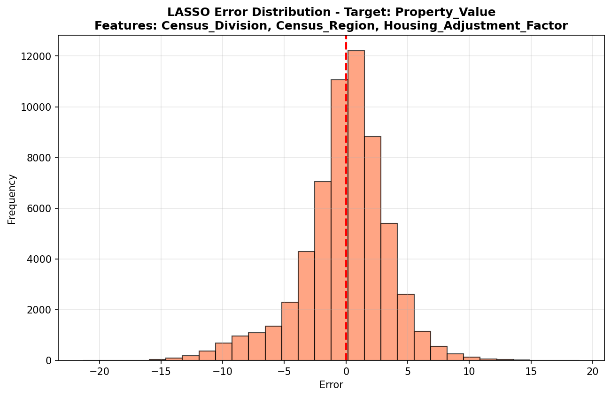

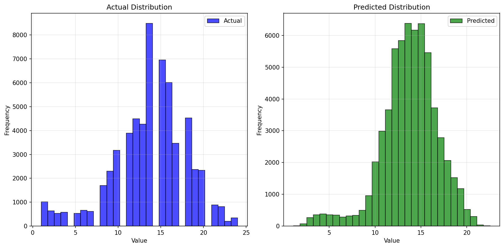

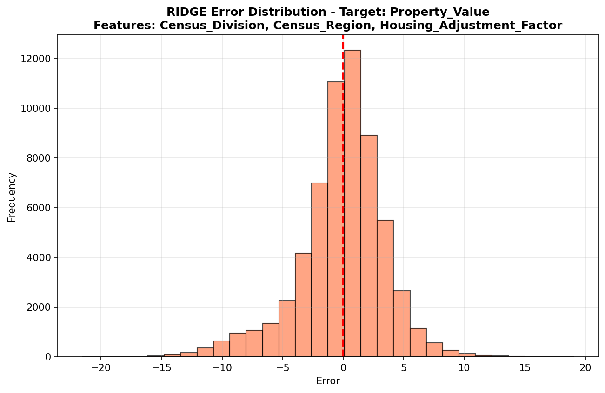

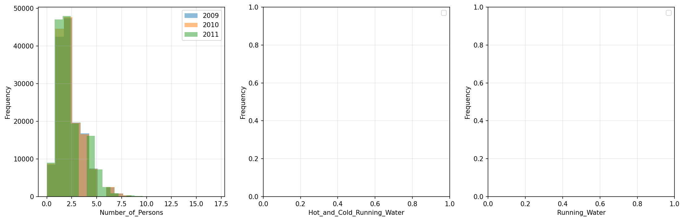

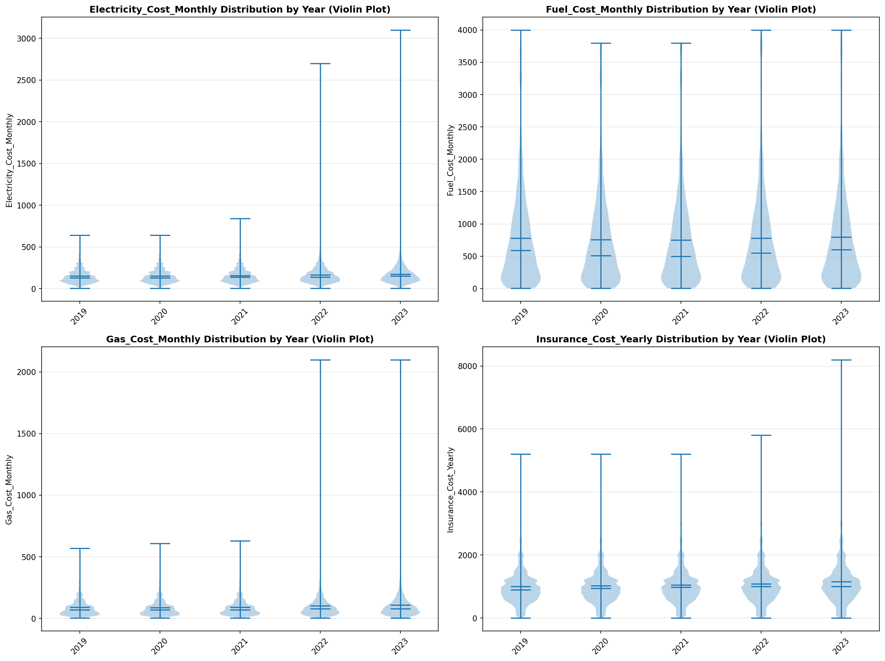

