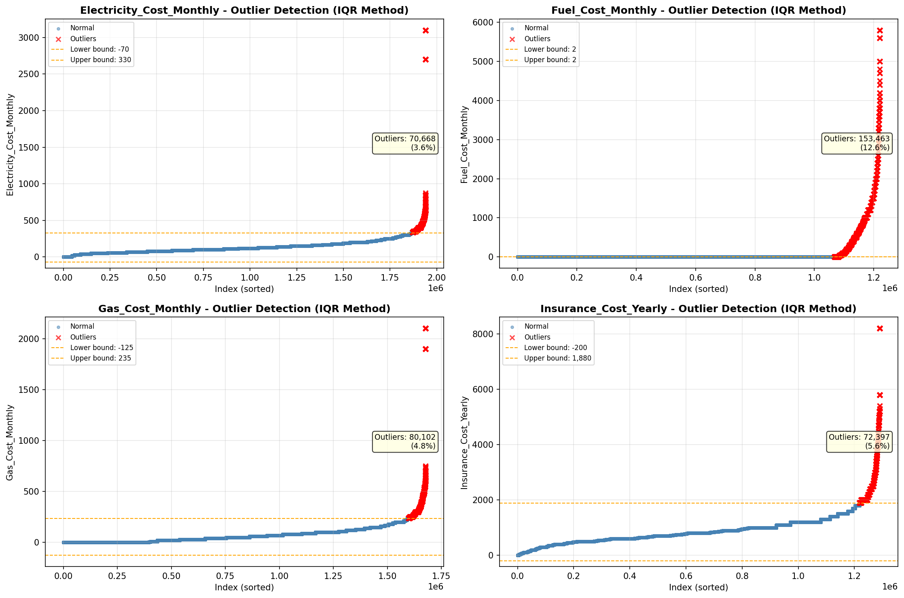

# Outlier Detection

> Statistical outlier detection using IQR (Interquartile Range) method. Outliers are values falling outside Q1 - 1.5×IQR or Q3 + 1.5×IQR bounds.

## Detection Methodology

| Parameter | Value | Description |
| :--- | :--- | :--- |
| Method | IQR | Outlier detection algorithm |
| Lower Bound | Q1 - 1.5 × IQR | Values below are outliers |
| Upper Bound | Q3 + 1.5 × IQR | Values above are outliers |
| IQR Definition | Q3 - Q1 | Interquartile Range |

> **Note**: The IQR method is robust to extreme values and works well for approximately symmetric distributions.

## Outlier Summary

_No outlier summary available._
## High Outlier Rate Variables

> Variables with outlier rate > 5% may indicate data quality issues, non-normal distributions, or genuinely extreme values.

- **('Specified_Rent_Unit', 24.534930392616186)**: 0 outliers (0.00%)

- **('Fuel_Cost_Monthly', 12.572782007493055)**: 0 outliers (0.00%)

- **('Gross_Rent_Percentage_Income', 9.617164212305914)**: 0 outliers (0.00%)

- **('Flag_Property_Taxes', 9.598476944016724)**: 0 outliers (0.00%)

- **('Working_Age_Persons', 9.135301576903517)**: 0 outliers (0.00%)

- **('Owner_Costs_Percentage_Income', 7.27642420314874)**: 0 outliers (0.00%)

- **('Flag_Property_Value', 6.455590219650807)**: 0 outliers (0.00%)

- **('Flag_Water_Cost', 6.390868850110698)**: 0 outliers (0.00%)

- **('Insurance_Cost_Yearly', 5.6090833727173415)**: 0 outliers (0.00%)

- **('Rent_Amount_Monthly', 5.541002196891023)**: 0 outliers (0.00%)

- **('Income_to_FPL_Ratio', 5.2764233124759485)**: 0 outliers (0.00%)

- **('Family_Income', 5.0187271696322835)**: 0 outliers (0.00%)

> *Consider investigating these variables for data entry errors, applying transformations, or using robust statistical methods.*

## Visualizations

