# Statistical Analysis

> Comprehensive descriptive statistics including central tendency, dispersion, distribution characteristics, and weighted statistics using ACS sample weights.

## Summary Statistics

- **Variables Analyzed**: 30

### Income_Adjustment_Factor

| Statistic | Unweighted | Weighted (ACS) |
| :--- | :--- | :--- |
| Mean | 1,014,998.43 | 1,014,834.00 |
| Median | 1,011,189.00 | 1,014,834.00 |
| Std Deviation | 10,897.85 | — |
| Minimum | 1,001,264.00 | — |
| Maximum | 1,042,311.00 | — |
| Count | 807,603 | — |

> *Distribution is highly right-skewed (skewness: 1.33), light-tailed/platykurtic (kurtosis: 0.97).*

- **Coefficient of Variation**: 1.1 % (low variability)

### Age

| Statistic | Unweighted | Weighted (ACS) |
| :--- | :--- | :--- |
| Mean | 40.44 | 37.88 |
| Median | 41.00 | 37.00 |
| Std Deviation | 23.73 | — |
| Minimum | 0.00 | — |
| Maximum | 95.00 | — |
| Count | 1,070,752 | — |

> *Distribution is approximately symmetric (skewness: 0.09), light-tailed/platykurtic (kurtosis: -1.03).*

- **Coefficient of Variation**: 58.7 % (high variability)

### Interest_Dividend_Rental_Income

| Statistic | Unweighted | Weighted (ACS) |
| :--- | :--- | :--- |
| Mean | 12,157.16 | 12,543.31 |
| Median | 1,700.00 | 1,750.00 |
| Std Deviation | 34,790.43 | — |
| Minimum | 1.00 | — |
| Maximum | 309,000.00 | — |
| Count | 108,367 | — |

> *Distribution is highly right-skewed (skewness: 5.00), heavy-tailed/leptokurtic (kurtosis: 27.30).*

- **Coefficient of Variation**: 286.2 % (very high variability)

### Other_Income

| Statistic | Unweighted | Weighted (ACS) |
| :--- | :--- | :--- |
| Mean | 9,122.53 | 8,989.71 |
| Median | 4,800.00 | 4,687.50 |
| Std Deviation | 12,215.25 | — |
| Minimum | 4.00 | — |
| Maximum | 72,000.00 | — |
| Count | 57,869 | — |

> *Distribution is highly right-skewed (skewness: 2.58), heavy-tailed/leptokurtic (kurtosis: 7.19).*

- **Coefficient of Variation**: 133.9 % (very high variability)

### Public_Assistance_Income

| Statistic | Unweighted | Weighted (ACS) |
| :--- | :--- | :--- |
| Mean | 2,743.60 | 2,733.25 |
| Median | 1,500.00 | 1,515.62 |
| Std Deviation | 3,744.85 | — |
| Minimum | 4.00 | — |
| Maximum | 30,000.00 | — |
| Count | 9,800 | — |

> *Distribution is highly right-skewed (skewness: 2.99), heavy-tailed/leptokurtic (kurtosis: 11.52).*

- **Coefficient of Variation**: 136.5 % (very high variability)

### Retirement_Income

| Statistic | Unweighted | Weighted (ACS) |
| :--- | :--- | :--- |
| Mean | 15,945.88 | 15,861.00 |
| Median | 10,500.00 | 10,700.00 |
| Std Deviation | 19,143.62 | — |
| Minimum | 4.00 | — |
| Maximum | 140,000.00 | — |
| Count | 119,400 | — |

> *Distribution is highly right-skewed (skewness: 3.31), heavy-tailed/leptokurtic (kurtosis: 14.26).*

- **Coefficient of Variation**: 120.1 % (very high variability)

### Self_Employment_Income

| Statistic | Unweighted | Weighted (ACS) |
| :--- | :--- | :--- |
| Mean | 29,129.51 | 29,776.16 |
| Median | 11,000.00 | 12,250.00 |
| Std Deviation | 54,910.70 | — |
| Minimum | 1.00 | — |
| Maximum | 387,000.00 | — |
| Count | 43,350 | — |

> *Distribution is highly right-skewed (skewness: 4.04), heavy-tailed/leptokurtic (kurtosis: 18.07).*

- **Coefficient of Variation**: 188.5 % (very high variability)

### Supplemental_Security_Income

| Statistic | Unweighted | Weighted (ACS) |
| :--- | :--- | :--- |
| Mean | 8,907.98 | 8,734.15 |
| Median | 8,400.00 | 8,475.00 |
| Std Deviation | 5,244.98 | — |
| Minimum | 10.00 | — |
| Maximum | 30,000.00 | — |
| Count | 24,924 | — |

> *Distribution is highly right-skewed (skewness: 1.14), light-tailed/platykurtic (kurtosis: 1.60).*

- **Coefficient of Variation**: 58.9 % (high variability)

### Social_Security_Income

| Statistic | Unweighted | Weighted (ACS) |
| :--- | :--- | :--- |
| Mean | 13,881.38 | 13,774.66 |
| Median | 13,200.00 | 13,537.50 |
| Std Deviation | 7,170.33 | — |
| Minimum | 4.00 | — |
| Maximum | 50,000.00 | — |
| Count | 216,148 | — |

> *Distribution is moderately right-skewed (skewness: 0.67), light-tailed/platykurtic (kurtosis: 1.17).*

- **Coefficient of Variation**: 51.7 % (high variability)

### Wage_Income

| Statistic | Unweighted | Weighted (ACS) |
| :--- | :--- | :--- |
| Mean | 40,199.99 | 40,442.14 |
| Median | 30,000.00 | 31,062.50 |
| Std Deviation | 45,980.93 | — |
| Minimum | 4.00 | — |
| Maximum | 483,000.00 | — |
| Count | 532,403 | — |

> *Distribution is highly right-skewed (skewness: 4.38), heavy-tailed/leptokurtic (kurtosis: 29.63).*

- **Coefficient of Variation**: 114.4 % (very high variability)

### Hours_Worked_Per_Week

| Statistic | Unweighted | Weighted (ACS) |
| :--- | :--- | :--- |
| Mean | 37.81 | 38.11 |
| Median | 40.00 | 40.00 |
| Std Deviation | 12.97 | — |
| Minimum | 1.00 | — |
| Maximum | 99.00 | — |
| Count | 558,123 | — |

> *Distribution is approximately symmetric (skewness: -0.23), light-tailed/platykurtic (kurtosis: 1.49).*

- **Coefficient of Variation**: 34.3 % (moderate variability)

### Presence_And_Age_Own_Children

| Statistic | Unweighted | Weighted (ACS) |
| :--- | :--- | :--- |
| Mean | 3.49 | 3.44 |
| Median | 4.00 | 4.00 |
| Std Deviation | 0.94 | — |
| Minimum | 1.00 | — |
| Maximum | 4.00 | — |
| Count | 425,310 | — |

> *Distribution is highly left-skewed (skewness: -1.53), light-tailed/platykurtic (kurtosis: 0.83).*

- **Coefficient of Variation**: 26.8 % (moderate variability)

### Total_Person_Earnings

| Statistic | Unweighted | Weighted (ACS) |
| :--- | :--- | :--- |
| Mean | 40,647.12 | 40,859.37 |
| Median | 30,000.00 | 30,712.50 |
| Std Deviation | 48,593.94 | — |
| Minimum | 1.00 | — |
| Maximum | 847,000.00 | — |
| Count | 557,405 | — |

> *Distribution is highly right-skewed (skewness: 4.65), heavy-tailed/leptokurtic (kurtosis: 34.13).*

- **Coefficient of Variation**: 119.6 % (very high variability)

### Total_Person_Income

| Statistic | Unweighted | Weighted (ACS) |
| :--- | :--- | :--- |
| Mean | 38,111.63 | 38,479.07 |
| Median | 27,000.00 | 27,562.50 |
| Std Deviation | 47,072.94 | — |
| Minimum | 1.00 | — |
| Maximum | 1,057,000.00 | — |
| Count | 777,887 | — |

> *Distribution is highly right-skewed (skewness: 5.04), heavy-tailed/leptokurtic (kurtosis: 41.57).*

- **Coefficient of Variation**: 123.5 % (very high variability)

### Poverty_Status

| Statistic | Unweighted | Weighted (ACS) |
| :--- | :--- | :--- |
| Mean | 301.91 | 296.58 |
| Median | 301.00 | 293.88 |
| Std Deviation | 158.21 | — |
| Minimum | 0.00 | — |
| Maximum | 501.00 | — |
| Count | 1,023,789 | — |

> *Distribution is approximately symmetric (skewness: -0.16), light-tailed/platykurtic (kurtosis: -1.25).*

- **Coefficient of Variation**: 52.4 % (high variability)

### Flag_Age

| Statistic | Unweighted | Weighted (ACS) |
| :--- | :--- | :--- |
| Mean | 0.01 | 0.01 |
| Median | 0.00 | 0.00 |
| Std Deviation | 0.09 | — |
| Minimum | 0.00 | — |
| Maximum | 1.00 | — |
| Count | 1,070,752 | — |

> *Distribution is highly right-skewed (skewness: 10.78), heavy-tailed/leptokurtic (kurtosis: 114.25).*

- **Coefficient of Variation**: 1,087.4 % (very high variability)

### Flag_Interest_Dividend_Income

| Statistic | Unweighted | Weighted (ACS) |
| :--- | :--- | :--- |
| Mean | 0.11 | 0.10 |
| Median | 0.00 | 0.00 |
| Std Deviation | 0.31 | — |
| Minimum | 0.00 | — |
| Maximum | 1.00 | — |
| Count | 1,070,752 | — |

> *Distribution is highly right-skewed (skewness: 2.53), heavy-tailed/leptokurtic (kurtosis: 4.39).*

- **Coefficient of Variation**: 287.5 % (very high variability)

### Flag_Other_Income

| Statistic | Unweighted | Weighted (ACS) |
| :--- | :--- | :--- |
| Mean | 0.09 | 0.09 |
| Median | 0.00 | 0.00 |
| Std Deviation | 0.29 | — |
| Minimum | 0.00 | — |
| Maximum | 1.00 | — |
| Count | 1,070,752 | — |

> *Distribution is highly right-skewed (skewness: 2.80), heavy-tailed/leptokurtic (kurtosis: 5.82).*

- **Coefficient of Variation**: 311.7 % (very high variability)

### Flag_Retirement_Income

| Statistic | Unweighted | Weighted (ACS) |
| :--- | :--- | :--- |
| Mean | 0.10 | 0.09 |
| Median | 0.00 | 0.00 |
| Std Deviation | 0.30 | — |
| Minimum | 0.00 | — |
| Maximum | 1.00 | — |
| Count | 1,070,752 | — |

> *Distribution is highly right-skewed (skewness: 2.70), heavy-tailed/leptokurtic (kurtosis: 5.28).*

- **Coefficient of Variation**: 302.8 % (very high variability)

### Flag_Self_Employment_Income

| Statistic | Unweighted | Weighted (ACS) |
| :--- | :--- | :--- |
| Mean | 0.07 | 0.07 |
| Median | 0.00 | 0.00 |
| Std Deviation | 0.26 | — |
| Minimum | 0.00 | — |
| Maximum | 1.00 | — |
| Count | 1,070,752 | — |

> *Distribution is highly right-skewed (skewness: 3.31), heavy-tailed/leptokurtic (kurtosis: 8.95).*

- **Coefficient of Variation**: 358.7 % (very high variability)

### Flag_Social_Security_Income

| Statistic | Unweighted | Weighted (ACS) |
| :--- | :--- | :--- |
| Mean | 0.11 | 0.10 |
| Median | 0.00 | 0.00 |
| Std Deviation | 0.31 | — |
| Minimum | 0.00 | — |
| Maximum | 1.00 | — |
| Count | 1,070,752 | — |

> *Distribution is highly right-skewed (skewness: 2.56), heavy-tailed/leptokurtic (kurtosis: 4.55).*

- **Coefficient of Variation**: 290.4 % (very high variability)

### Flag_Supplemental_Security_Income

| Statistic | Unweighted | Weighted (ACS) |
| :--- | :--- | :--- |
| Mean | 0.09 | 0.08 |
| Median | 0.00 | 0.00 |
| Std Deviation | 0.29 | — |
| Minimum | 0.00 | — |
| Maximum | 1.00 | — |
| Count | 1,070,752 | — |

> *Distribution is highly right-skewed (skewness: 2.86), heavy-tailed/leptokurtic (kurtosis: 6.20).*

- **Coefficient of Variation**: 317.8 % (very high variability)

### Flag_Wage_Income

| Statistic | Unweighted | Weighted (ACS) |
| :--- | :--- | :--- |
| Mean | 0.12 | 0.13 |
| Median | 0.00 | 0.00 |
| Std Deviation | 0.33 | — |
| Minimum | 0.00 | — |
| Maximum | 1.00 | — |
| Count | 1,070,752 | — |

> *Distribution is highly right-skewed (skewness: 2.32), heavy-tailed/leptokurtic (kurtosis: 3.36).*

- **Coefficient of Variation**: 268.7 % (very high variability)

### Flag_Hours_Worked

| Statistic | Unweighted | Weighted (ACS) |
| :--- | :--- | :--- |
| Mean | 0.05 | 0.05 |
| Median | 0.00 | 0.00 |
| Std Deviation | 0.22 | — |
| Minimum | 0.00 | — |
| Maximum | 1.00 | — |
| Count | 1,070,752 | — |

> *Distribution is highly right-skewed (skewness: 4.10), heavy-tailed/leptokurtic (kurtosis: 14.81).*

- **Coefficient of Variation**: 433.1 % (very high variability)

### Income_Per_Hour

| Statistic | Unweighted | Weighted (ACS) |
| :--- | :--- | :--- |
| Mean | 23.03 | 22.46 |
| Median | 16.48 | 16.22 |
| Std Deviation | 47.42 | — |
| Minimum | 0.00 | — |
| Maximum | 11,278.85 | — |
| Count | 557,733 | — |

> *Distribution is highly right-skewed (skewness: 71.94), heavy-tailed/leptokurtic (kurtosis: 12149.60).*

- **Coefficient of Variation**: 205.9 % (very high variability)

### Income_Per_Week_Worked

| Statistic | Unweighted | Weighted (ACS) |
| :--- | :--- | :--- |
| Mean | 31,296.12 | 31,597.24 |
| Median | 20,000.00 | 23,120.41 |
| Std Deviation | 44,854.59 | — |
| Minimum | 0.02 | — |
| Maximum | 935,500.00 | — |
| Count | 450,973 | — |

> *Distribution is highly right-skewed (skewness: 4.54), heavy-tailed/leptokurtic (kurtosis: 34.51).*

- **Coefficient of Variation**: 143.3 % (very high variability)

### Total_Annual_Hours

| Statistic | Unweighted | Weighted (ACS) |
| :--- | :--- | :--- |
| Mean | 339.13 | 331.08 |
| Median | 48.00 | 353.85 |
| Std Deviation | 709.88 | — |
| Minimum | 1.00 | — |
| Maximum | 5,148.00 | — |
| Count | 451,303 | — |

> *Distribution is highly right-skewed (skewness: 2.48), heavy-tailed/leptokurtic (kurtosis: 5.11).*

- **Coefficient of Variation**: 209.3 % (very high variability)

### In_Poverty

| Statistic | Unweighted | Weighted (ACS) |
| :--- | :--- | :--- |
| Mean | 0.31 | 0.30 |
| Median | 0.00 | 0.00 |
| Std Deviation | 0.46 | — |
| Minimum | 0.00 | — |
| Maximum | 1.00 | — |
| Count | 1,070,752 | — |

> *Distribution is moderately right-skewed (skewness: 0.82), light-tailed/platykurtic (kurtosis: -1.33).*

- **Coefficient of Variation**: 149.0 % (very high variability)

### Poverty_Gap

| Statistic | Unweighted | Weighted (ACS) |
| :--- | :--- | :--- |
| Mean | 0.25 | 0.25 |
| Median | 0.00 | 0.00 |
| Std Deviation | 0.38 | — |
| Minimum | 0.00 | — |
| Maximum | 2.33 | — |
| Count | 878,299 | — |

> *Distribution is highly right-skewed (skewness: 1.13), light-tailed/platykurtic (kurtosis: -0.42).*

- **Coefficient of Variation**: 151.7 % (very high variability)

### Poverty_Severity

| Statistic | Unweighted | Weighted (ACS) |
| :--- | :--- | :--- |
| Mean | 0.21 | 0.21 |
| Median | 0.00 | 0.00 |
| Std Deviation | 0.36 | — |
| Minimum | 0.00 | — |
| Maximum | 5.44 | — |
| Count | 878,299 | — |

> *Distribution is highly right-skewed (skewness: 1.51), light-tailed/platykurtic (kurtosis: 0.75).*

- **Coefficient of Variation**: 175.0 % (very high variability)

## Distribution Analysis

### Skewed Distributions

> Variables with skewness > |0.5| indicate non-normal distributions. Consider log transformations for highly skewed variables in modeling.

| Variable | Skewness | Direction | Severity |
| :--- | :--- | :--- | :--- |
| Income_Per_Hour | 71.937 | Right-skewed | High |
| Flag_Age | 10.782 | Right-skewed | High |
| Total_Person_Income | 5.040 | Right-skewed | High |
| Interest_Dividend_Rental_Income | 5.000 | Right-skewed | High |
| Total_Person_Earnings | 4.652 | Right-skewed | High |
| Income_Per_Week_Worked | 4.544 | Right-skewed | High |
| Wage_Income | 4.376 | Right-skewed | High |
| Flag_Hours_Worked | 4.100 | Right-skewed | High |
| Self_Employment_Income | 4.037 | Right-skewed | High |
| Retirement_Income | 3.315 | Right-skewed | High |
| Flag_Self_Employment_Income | 3.309 | Right-skewed | High |
| Public_Assistance_Income | 2.986 | Right-skewed | High |
| Flag_Supplemental_Security_Income | 2.863 | Right-skewed | High |
| Flag_Other_Income | 2.796 | Right-skewed | High |
| Flag_Retirement_Income | 2.698 | Right-skewed | High |
| Other_Income | 2.581 | Right-skewed | High |
| Flag_Social_Security_Income | 2.560 | Right-skewed | High |
| Flag_Interest_Dividend_Income | 2.528 | Right-skewed | High |
| Total_Annual_Hours | 2.478 | Right-skewed | High |
| Flag_Wage_Income | 2.315 | Right-skewed | High |

- **Total Skewed Variables**: 27

- **Right-skewed**: 26

- **Left-skewed**: 1

## Variance Analysis

### Coefficient of Variation Ranking

> CV (Coefficient of Variation) = (Std Dev / Mean) × 100%. Higher CV indicates greater relative variability.

| Variable | CV (%) | Std Dev | Mean | Variability |
| :--- | :--- | :--- | :--- | :--- |
| Flag_Age | 1087.4% | 0.09 | 0.01 | Very High |
| Flag_Hours_Worked | 433.1% | 0.22 | 0.05 | Very High |
| Flag_Self_Employment_Income | 358.7% | 0.26 | 0.07 | Very High |
| Flag_Supplemental_Security_Income | 317.8% | 0.29 | 0.09 | Very High |
| Flag_Other_Income | 311.7% | 0.29 | 0.09 | Very High |
| Flag_Retirement_Income | 302.8% | 0.30 | 0.10 | Very High |
| Flag_Social_Security_Income | 290.4% | 0.31 | 0.11 | Very High |
| Flag_Interest_Dividend_Income | 287.5% | 0.31 | 0.11 | Very High |
| Interest_Dividend_Rental_Income | 286.2% | 34,790.43 | 12,157.16 | Very High |
| Flag_Wage_Income | 268.7% | 0.33 | 0.12 | Very High |
| Total_Annual_Hours | 209.3% | 709.88 | 339.13 | Very High |
| Income_Per_Hour | 205.9% | 47.42 | 23.03 | Very High |
| Self_Employment_Income | 188.5% | 54,910.70 | 29,129.51 | Very High |
| Poverty_Severity | 175.0% | 0.36 | 0.21 | Very High |
| Poverty_Gap | 151.7% | 0.38 | 0.25 | Very High |
| In_Poverty | 149.0% | 0.46 | 0.31 | Very High |
| Income_Per_Week_Worked | 143.3% | 44,854.59 | 31,296.12 | Very High |
| Public_Assistance_Income | 136.5% | 3,744.85 | 2,743.60 | Very High |
| Other_Income | 133.9% | 12,215.25 | 9,122.53 | Very High |
| Total_Person_Income | 123.5% | 47,072.94 | 38,111.63 | Very High |

- **Average CV**: 206.6 %

- **High Variance Variables (CV > 50%)**: 27

## Visualizations

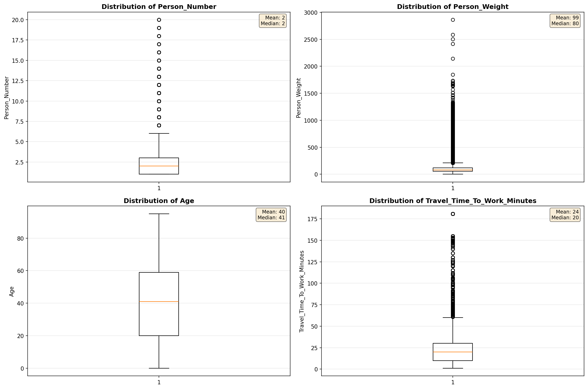

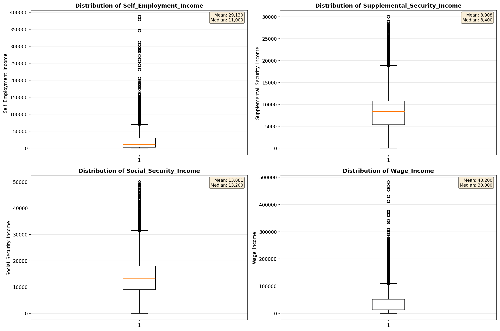

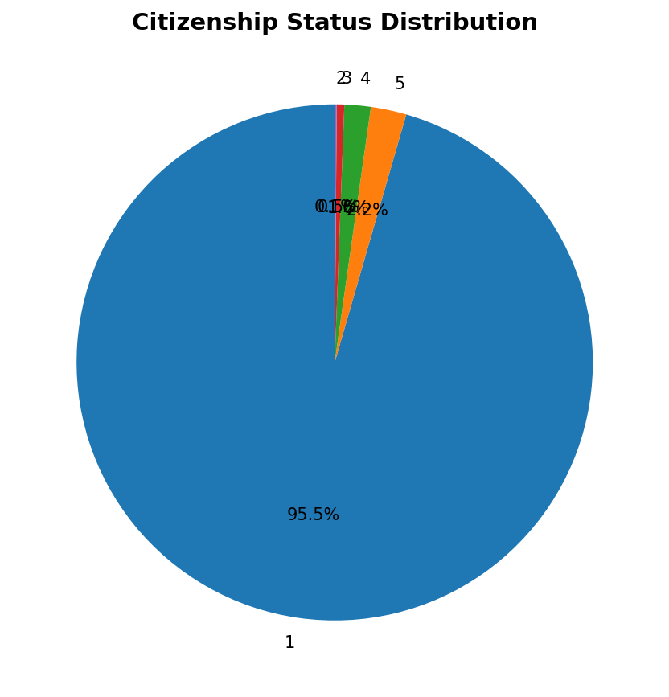

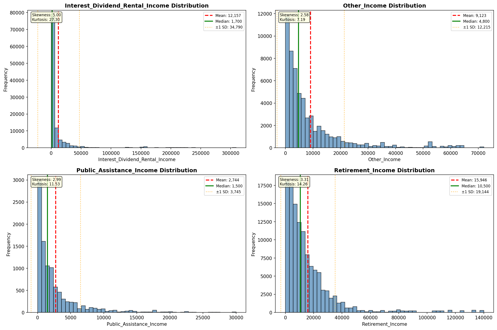

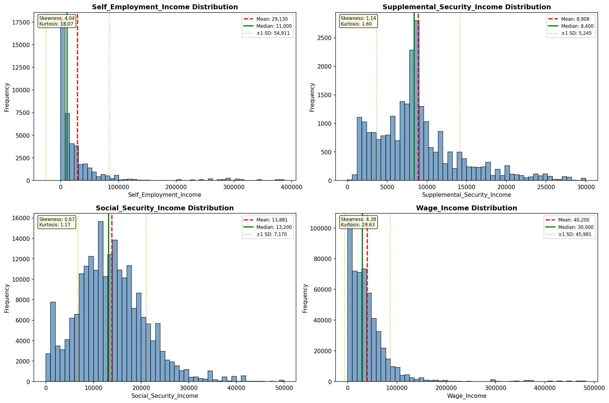

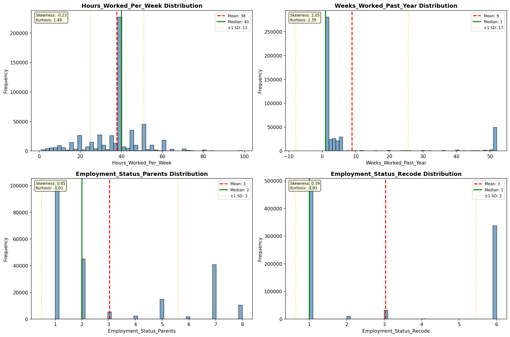

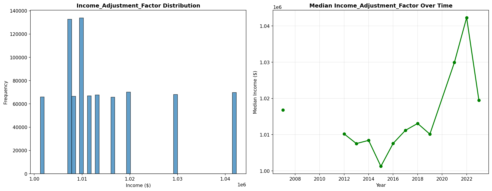

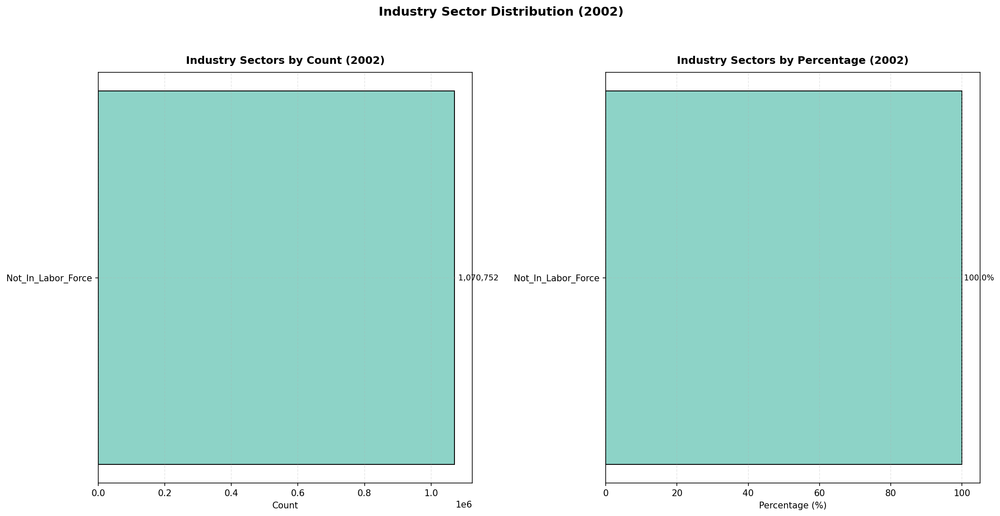

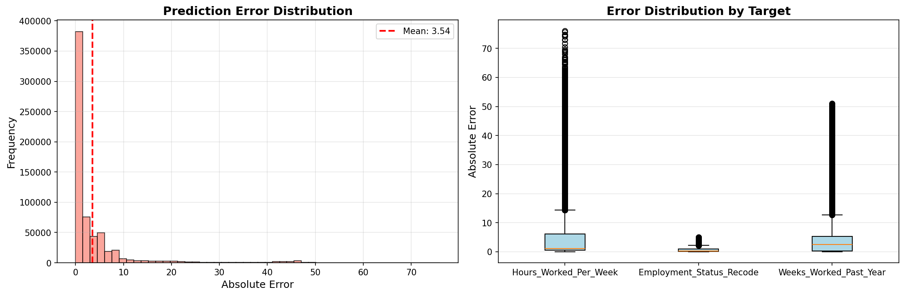

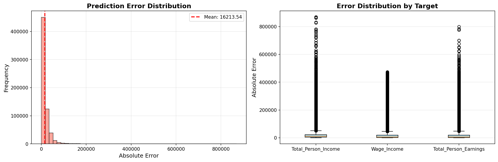

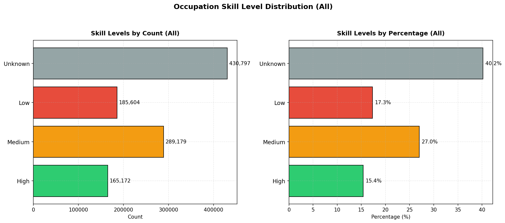

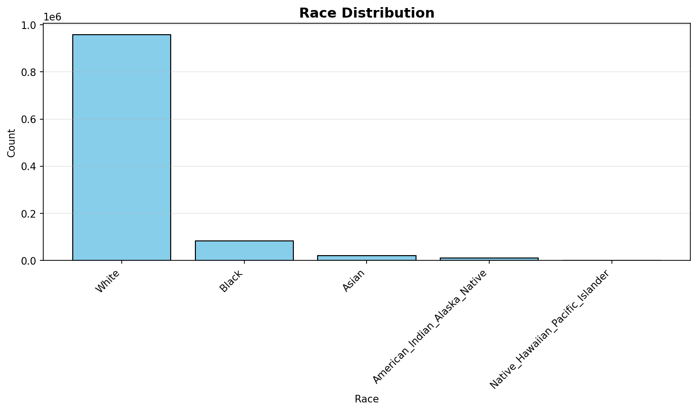

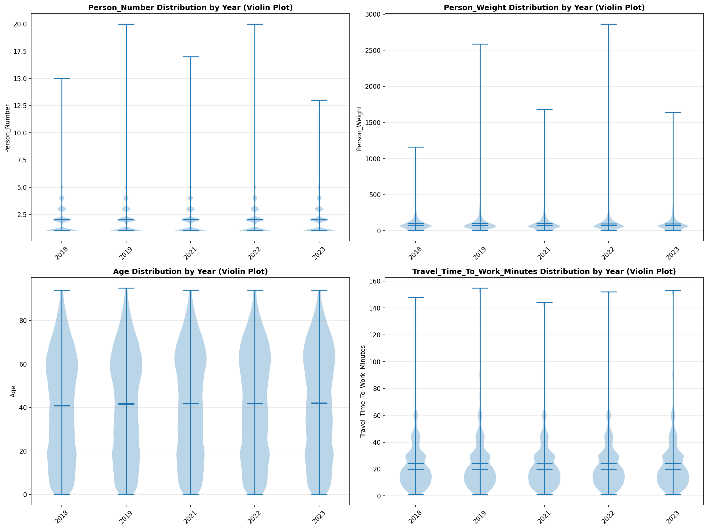

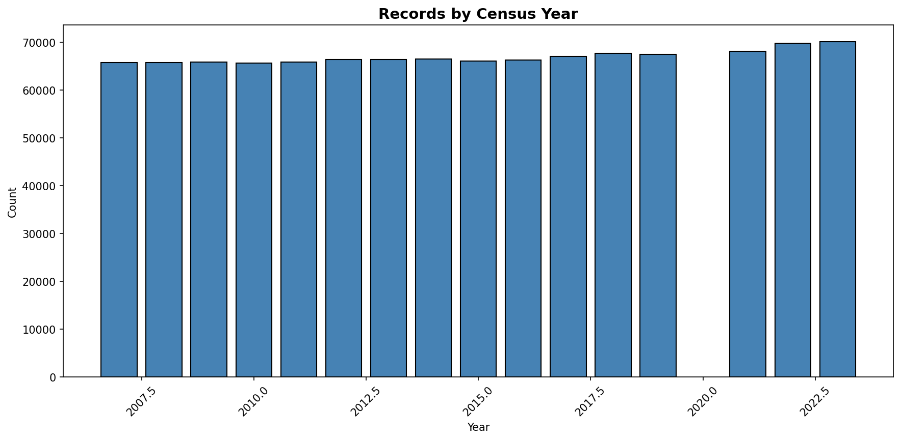
