# Statistical Analysis

> Comprehensive descriptive statistics including central tendency, dispersion, distribution characteristics, and weighted statistics using ACS sample weights.

## Summary Statistics

- **Variables Analyzed**: 41

### Income_Adjustment_Factor

| Statistic | Unweighted | Weighted (ACS) |
| :--- | :--- | :--- |
| Mean | 1,014,882.73 | 1,014,656.45 |
| Median | 1,010,207.00 | 1,014,656.45 |
| Std Deviation | 11,380.59 | — |
| Minimum | 1,001,264.00 | — |
| Maximum | 1,042,311.00 | — |
| Count | 174,761 | — |

> *Distribution is highly right-skewed (skewness: 1.32), light-tailed/platykurtic (kurtosis: 0.71).*

- **Coefficient of Variation**: 1.1 % (low variability)

### Property_Value

| Statistic | Unweighted | Weighted (ACS) |
| :--- | :--- | :--- |
| Mean | 154,129.67 | 172,408.91 |
| Median | 120,000.00 | 137,334.50 |
| Std Deviation | 185,838.78 | — |
| Minimum | 1.00 | — |
| Maximum | 3,145,000.00 | — |
| Count | 125,460 | — |

> *Distribution is highly right-skewed (skewness: 6.25), heavy-tailed/leptokurtic (kurtosis: 65.97).*

- **Coefficient of Variation**: 120.6 % (very high variability)

### Electricity_Cost_Monthly

| Statistic | Unweighted | Weighted (ACS) |
| :--- | :--- | :--- |
| Mean | 134.90 | 130.95 |
| Median | 120.00 | 114.38 |
| Std Deviation | 113.69 | — |
| Minimum | 1.00 | — |
| Maximum | 2,800.00 | — |
| Count | 206,180 | — |

> *Distribution is highly right-skewed (skewness: 10.74), heavy-tailed/leptokurtic (kurtosis: 236.47).*

- **Coefficient of Variation**: 84.3 % (high variability)

### Fuel_Cost_Monthly

| Statistic | Unweighted | Weighted (ACS) |
| :--- | :--- | :--- |
| Mean | 104.70 | 304.82 |
| Median | 2.00 | 201.38 |
| Std Deviation | 399.09 | — |
| Minimum | 1.00 | — |
| Maximum | 6,100.00 | — |
| Count | 144,406 | — |

> *Distribution is highly right-skewed (skewness: 5.39), heavy-tailed/leptokurtic (kurtosis: 37.24).*

- **Coefficient of Variation**: 381.2 % (very high variability)

### Gas_Cost_Monthly

| Statistic | Unweighted | Weighted (ACS) |
| :--- | :--- | :--- |
| Mean | 74.16 | 72.05 |
| Median | 50.00 | 45.00 |
| Std Deviation | 102.03 | — |
| Minimum | 1.00 | — |
| Maximum | 1,800.00 | — |
| Count | 180,889 | — |

> *Distribution is highly right-skewed (skewness: 6.09), heavy-tailed/leptokurtic (kurtosis: 82.04).*

- **Coefficient of Variation**: 137.6 % (very high variability)

### Insurance_Cost_Yearly

| Statistic | Unweighted | Weighted (ACS) |
| :--- | :--- | :--- |
| Mean | 923.64 | 942.47 |
| Median | 800.00 | 818.12 |
| Std Deviation | 678.14 | — |
| Minimum | 4.00 | — |
| Maximum | 9,000.00 | — |
| Count | 142,352 | — |

> *Distribution is highly right-skewed (skewness: 3.24), heavy-tailed/leptokurtic (kurtosis: 20.40).*

- **Coefficient of Variation**: 73.4 % (high variability)

### Water_Cost_Yearly

| Statistic | Unweighted | Weighted (ACS) |
| :--- | :--- | :--- |
| Mean | 477.59 | 469.92 |
| Median | 420.00 | 420.00 |
| Std Deviation | 477.14 | — |
| Minimum | 1.00 | — |
| Maximum | 4,500.00 | — |
| Count | 195,494 | — |

> *Distribution is highly right-skewed (skewness: 1.81), heavy-tailed/leptokurtic (kurtosis: 7.32).*

- **Coefficient of Variation**: 99.9 % (high variability)

### Mobile_Home_Costs_Monthly

| Statistic | Unweighted | Weighted (ACS) |
| :--- | :--- | :--- |
| Mean | 2,022.00 | 2,554.26 |
| Median | 1,300.00 | 2,412.50 |
| Std Deviation | 2,263.48 | — |
| Minimum | 4.00 | — |
| Maximum | 22,900.00 | — |
| Count | 4,237 | — |

> *Distribution is highly right-skewed (skewness: 3.18), heavy-tailed/leptokurtic (kurtosis: 21.08).*

- **Coefficient of Variation**: 111.9 % (very high variability)

### First_Mortgage_Payment_Monthly

| Statistic | Unweighted | Weighted (ACS) |
| :--- | :--- | :--- |
| Mean | 737.62 | 864.07 |
| Median | 650.00 | 701.75 |
| Std Deviation | 588.73 | — |
| Minimum | 4.00 | — |
| Maximum | 4,900.00 | — |
| Count | 105,532 | — |

> *Distribution is highly right-skewed (skewness: 1.58), heavy-tailed/leptokurtic (kurtosis: 5.05).*

- **Coefficient of Variation**: 79.8 % (high variability)

### First_Mortgage_Includes_Taxes

| Statistic | Unweighted | Weighted (ACS) |
| :--- | :--- | :--- |
| Mean | 1.35 | 1.31 |
| Median | 1.00 | 1.00 |
| Std Deviation | 0.48 | — |
| Minimum | 1.00 | — |
| Maximum | 2.00 | — |
| Count | 90,912 | — |

> *Distribution is moderately right-skewed (skewness: 0.62), light-tailed/platykurtic (kurtosis: -1.61).*

- **Coefficient of Variation**: 35.3 % (moderate variability)

### Second_Mortgage_Payment_Monthly

| Statistic | Unweighted | Weighted (ACS) |
| :--- | :--- | :--- |
| Mean | 319.21 | 327.15 |
| Median | 250.00 | 246.25 |
| Std Deviation | 294.32 | — |
| Minimum | 4.00 | — |
| Maximum | 2,600.00 | — |
| Count | 15,298 | — |

> *Distribution is highly right-skewed (skewness: 3.30), heavy-tailed/leptokurtic (kurtosis: 15.94).*

- **Coefficient of Variation**: 92.2 % (high variability)

### Property_Taxes_Yearly

| Statistic | Unweighted | Weighted (ACS) |
| :--- | :--- | :--- |
| Mean | 288.21 | 310.38 |
| Median | 28.00 | 247.67 |
| Std Deviation | 1,133.40 | — |
| Minimum | 1.00 | — |
| Maximum | 21,500.00 | — |
| Count | 121,578 | — |

> *Distribution is highly right-skewed (skewness: 7.57), heavy-tailed/leptokurtic (kurtosis: 91.04).*

- **Coefficient of Variation**: 393.3 % (very high variability)

### Meals_Included_in_Rent

| Statistic | Unweighted | Weighted (ACS) |
| :--- | :--- | :--- |
| Mean | 1.96 | 1.96 |
| Median | 2.00 | 2.00 |
| Std Deviation | 0.19 | — |
| Minimum | 1.00 | — |
| Maximum | 2.00 | — |
| Count | 42,378 | — |

> *Distribution is highly left-skewed (skewness: -5.00), heavy-tailed/leptokurtic (kurtosis: 22.95).*

- **Coefficient of Variation**: 9.5 % (low variability)

### Rent_Amount_Monthly

| Statistic | Unweighted | Weighted (ACS) |
| :--- | :--- | :--- |
| Mean | 595.13 | 653.49 |
| Median | 500.00 | 582.50 |
| Std Deviation | 404.90 | — |
| Minimum | 4.00 | — |
| Maximum | 3,800.00 | — |
| Count | 42,378 | — |

> *Distribution is highly right-skewed (skewness: 3.13), heavy-tailed/leptokurtic (kurtosis: 15.51).*

- **Coefficient of Variation**: 68.0 % (high variability)

### Gross_Rent

| Statistic | Unweighted | Weighted (ACS) |
| :--- | :--- | :--- |
| Mean | 745.05 | 788.62 |
| Median | 670.00 | 724.25 |
| Std Deviation | 425.12 | — |
| Minimum | 4.00 | — |
| Maximum | 6,842.00 | — |
| Count | 40,338 | — |

> *Distribution is highly right-skewed (skewness: 2.71), heavy-tailed/leptokurtic (kurtosis: 14.12).*

- **Coefficient of Variation**: 57.1 % (high variability)

### Gross_Rent_Percentage_Income

| Statistic | Unweighted | Weighted (ACS) |
| :--- | :--- | :--- |
| Mean | 34.96 | 36.32 |
| Median | 26.00 | 26.69 |
| Std Deviation | 26.55 | — |
| Minimum | 1.00 | — |
| Maximum | 101.00 | — |
| Count | 39,694 | — |

> *Distribution is highly right-skewed (skewness: 1.36), light-tailed/platykurtic (kurtosis: 0.86).*

- **Coefficient of Variation**: 75.9 % (high variability)

### Selected_Monthly_Owner_Costs

| Statistic | Unweighted | Weighted (ACS) |
| :--- | :--- | :--- |
| Mean | 921.44 | 1,025.33 |
| Median | 760.00 | 874.50 |
| Std Deviation | 661.15 | — |
| Minimum | 1.00 | — |
| Maximum | 8,236.00 | — |
| Count | 164,269 | — |

> *Distribution is highly right-skewed (skewness: 2.09), heavy-tailed/leptokurtic (kurtosis: 7.88).*

- **Coefficient of Variation**: 71.8 % (high variability)

### Owner_Costs_Percentage_Income

| Statistic | Unweighted | Weighted (ACS) |
| :--- | :--- | :--- |
| Mean | 20.29 | 21.02 |
| Median | 16.00 | 16.31 |
| Std Deviation | 17.81 | — |
| Minimum | 1.00 | — |
| Maximum | 101.00 | — |
| Count | 163,434 | — |

> *Distribution is highly right-skewed (skewness: 2.56), heavy-tailed/leptokurtic (kurtosis: 7.86).*

- **Coefficient of Variation**: 87.8 % (high variability)

### Family_Income

| Statistic | Unweighted | Weighted (ACS) |
| :--- | :--- | :--- |
| Mean | 84,352.27 | 87,155.87 |
| Median | 69,000.00 | 71,137.75 |
| Std Deviation | 72,004.21 | — |
| Minimum | 1.00 | — |
| Maximum | 1,377,000.00 | — |
| Count | 135,774 | — |

> *Distribution is highly right-skewed (skewness: 3.56), heavy-tailed/leptokurtic (kurtosis: 22.62).*

- **Coefficient of Variation**: 85.4 % (high variability)

### Household_Income

| Statistic | Unweighted | Weighted (ACS) |
| :--- | :--- | :--- |
| Mean | 70,303.48 | 72,100.33 |
| Median | 54,700.00 | 55,810.62 |
| Std Deviation | 67,053.25 | — |
| Minimum | 1.00 | — |
| Maximum | 1,377,000.00 | — |
| Count | 207,319 | — |

> *Distribution is highly right-skewed (skewness: 3.66), heavy-tailed/leptokurtic (kurtosis: 24.32).*

- **Coefficient of Variation**: 95.4 % (high variability)

### Specified_Rent_Unit

| Statistic | Unweighted | Weighted (ACS) |
| :--- | :--- | :--- |
| Mean | 0.21 | 0.27 |
| Median | 0.00 | 0.00 |
| Std Deviation | 0.40 | — |
| Minimum | 0.00 | — |
| Maximum | 1.00 | — |
| Count | 220,297 | — |

> *Distribution is highly right-skewed (skewness: 1.46), light-tailed/platykurtic (kurtosis: 0.13).*

- **Coefficient of Variation**: 196.7 % (very high variability)

### Specified_Value_Unit

| Statistic | Unweighted | Weighted (ACS) |
| :--- | :--- | :--- |
| Mean | 0.66 | 0.58 |
| Median | 1.00 | 1.00 |
| Std Deviation | 0.48 | — |
| Minimum | 0.00 | — |
| Maximum | 1.00 | — |
| Count | 220,297 | — |

> *Distribution is moderately left-skewed (skewness: -0.66), light-tailed/platykurtic (kurtosis: -1.57).*

- **Coefficient of Variation**: 72.5 % (high variability)

### Flag_Family_Income

| Statistic | Unweighted | Weighted (ACS) |
| :--- | :--- | :--- |
| Mean | 0.18 | 0.18 |
| Median | 0.00 | 0.00 |
| Std Deviation | 0.38 | — |
| Minimum | 0.00 | — |
| Maximum | 1.00 | — |
| Count | 166,886 | — |

> *Distribution is highly right-skewed (skewness: 1.67), light-tailed/platykurtic (kurtosis: 0.78).*

- **Coefficient of Variation**: 213.5 % (very high variability)

### Flag_Gross_Rent

| Statistic | Unweighted | Weighted (ACS) |
| :--- | :--- | :--- |
| Mean | 0.06 | 0.12 |
| Median | 0.00 | 0.00 |
| Std Deviation | 0.24 | — |
| Minimum | 0.00 | — |
| Maximum | 1.00 | — |
| Count | 102,984 | — |

> *Distribution is highly right-skewed (skewness: 3.64), heavy-tailed/leptokurtic (kurtosis: 11.23).*

- **Coefficient of Variation**: 389.5 % (very high variability)

### Flag_Household_Income

| Statistic | Unweighted | Weighted (ACS) |
| :--- | :--- | :--- |
| Mean | 0.28 | 0.28 |
| Median | 0.00 | 0.00 |
| Std Deviation | 0.45 | — |
| Minimum | 0.00 | — |
| Maximum | 1.00 | — |
| Count | 166,886 | — |

> *Distribution is moderately right-skewed (skewness: 0.97), light-tailed/platykurtic (kurtosis: -1.06).*

- **Coefficient of Variation**: 159.5 % (very high variability)

### Flag_First_Mortgage_Payment

| Statistic | Unweighted | Weighted (ACS) |
| :--- | :--- | :--- |
| Mean | 0.03 | 0.03 |
| Median | 0.00 | 0.00 |
| Std Deviation | 0.18 | — |
| Minimum | 0.00 | — |
| Maximum | 1.00 | — |
| Count | 220,297 | — |

> *Distribution is highly right-skewed (skewness: 5.32), heavy-tailed/leptokurtic (kurtosis: 26.34).*

- **Coefficient of Variation**: 550.5 % (very high variability)

### Flag_First_Mortgage_Taxes

| Statistic | Unweighted | Weighted (ACS) |
| :--- | :--- | :--- |
| Mean | 0.03 | 0.03 |
| Median | 0.00 | 0.00 |
| Std Deviation | 0.17 | — |
| Minimum | 0.00 | — |
| Maximum | 1.00 | — |
| Count | 220,297 | — |

> *Distribution is highly right-skewed (skewness: 5.63), heavy-tailed/leptokurtic (kurtosis: 29.73).*

- **Coefficient of Variation**: 580.5 % (very high variability)

### Flag_Meals_Included_Rent

| Statistic | Unweighted | Weighted (ACS) |
| :--- | :--- | :--- |
| Mean | 0.01 | 0.01 |
| Median | 0.00 | 0.00 |
| Std Deviation | 0.07 | — |
| Minimum | 0.00 | — |
| Maximum | 1.00 | — |
| Count | 220,297 | — |

> *Distribution is highly right-skewed (skewness: 13.82), heavy-tailed/leptokurtic (kurtosis: 189.10).*

- **Coefficient of Variation**: 1,389.6 % (very high variability)

### Flag_Rent_Amount

| Statistic | Unweighted | Weighted (ACS) |
| :--- | :--- | :--- |
| Mean | 0.01 | 0.02 |
| Median | 0.00 | 0.00 |
| Std Deviation | 0.12 | — |
| Minimum | 0.00 | — |
| Maximum | 1.00 | — |
| Count | 220,297 | — |

> *Distribution is highly right-skewed (skewness: 8.09), heavy-tailed/leptokurtic (kurtosis: 63.39).*

- **Coefficient of Variation**: 820.8 % (very high variability)

### Flag_Selected_Monthly_Owner_Costs

| Statistic | Unweighted | Weighted (ACS) |
| :--- | :--- | :--- |
| Mean | 0.24 | 0.24 |
| Median | 0.00 | 0.00 |
| Std Deviation | 0.43 | — |
| Minimum | 0.00 | — |
| Maximum | 1.00 | — |
| Count | 147,893 | — |

> *Distribution is highly right-skewed (skewness: 1.19), light-tailed/platykurtic (kurtosis: -0.59).*

- **Coefficient of Variation**: 175.6 % (very high variability)

### Flag_Second_Mortgage_Payment

| Statistic | Unweighted | Weighted (ACS) |
| :--- | :--- | :--- |
| Mean | 0.03 | 0.03 |
| Median | 0.00 | 0.00 |
| Std Deviation | 0.16 | — |
| Minimum | 0.00 | — |
| Maximum | 1.00 | — |
| Count | 220,297 | — |

> *Distribution is highly right-skewed (skewness: 5.84), heavy-tailed/leptokurtic (kurtosis: 32.06).*

- **Coefficient of Variation**: 600.3 % (very high variability)

### Flag_Property_Taxes

| Statistic | Unweighted | Weighted (ACS) |
| :--- | :--- | :--- |
| Mean | 0.09 | 0.09 |
| Median | 0.00 | 0.00 |
| Std Deviation | 0.29 | — |
| Minimum | 0.00 | — |
| Maximum | 1.00 | — |
| Count | 205,803 | — |

> *Distribution is highly right-skewed (skewness: 2.87), heavy-tailed/leptokurtic (kurtosis: 6.22).*

- **Coefficient of Variation**: 318.2 % (very high variability)

### Flag_Property_Value

| Statistic | Unweighted | Weighted (ACS) |
| :--- | :--- | :--- |
| Mean | 0.07 | 0.06 |
| Median | 0.00 | 0.00 |
| Std Deviation | 0.25 | — |
| Minimum | 0.00 | — |
| Maximum | 1.00 | — |
| Count | 220,297 | — |

> *Distribution is highly right-skewed (skewness: 3.51), heavy-tailed/leptokurtic (kurtosis: 10.33).*

- **Coefficient of Variation**: 377.6 % (very high variability)

### Flag_Water_Cost

| Statistic | Unweighted | Weighted (ACS) |
| :--- | :--- | :--- |
| Mean | 0.08 | 0.08 |
| Median | 0.00 | 0.00 |
| Std Deviation | 0.26 | — |
| Minimum | 0.00 | — |
| Maximum | 1.00 | — |
| Count | 14,494 | — |

> *Distribution is highly right-skewed (skewness: 3.22), heavy-tailed/leptokurtic (kurtosis: 8.39).*

- **Coefficient of Variation**: 350.9 % (very high variability)

### Annual_Rent_to_Value_Ratio

### Total_Monthly_Utility_Cost

| Statistic | Unweighted | Weighted (ACS) |
| :--- | :--- | :--- |
| Mean | 199.55 | 188.21 |
| Median | 170.00 | 164.50 |
| Std Deviation | 159.81 | — |
| Minimum | 2.00 | — |
| Maximum | 4,600.00 | — |
| Count | 206,607 | — |

> *Distribution is highly right-skewed (skewness: 8.75), heavy-tailed/leptokurtic (kurtosis: 175.25).*

- **Coefficient of Variation**: 80.1 % (high variability)

### Property_Tax_Rate

| Statistic | Unweighted | Weighted (ACS) |
| :--- | :--- | :--- |
| Mean | 23.93 | 24.90 |
| Median | 0.03 | 25.20 |
| Std Deviation | 67.88 | — |
| Minimum | 0.00 | — |
| Maximum | 1,200.00 | — |
| Count | 81,430 | — |

> *Distribution is highly right-skewed (skewness: 3.19), heavy-tailed/leptokurtic (kurtosis: 13.12).*

- **Coefficient of Variation**: 283.6 % (very high variability)

#### Weighted Statistics by Year

| Year | Weighted Mean | Weighted Median |
| :--- | :--- | :--- |
| 2007 | 197.36 | 200.00 |
| 2012 | 0.03 | 0.02 |
| 2013 | 0.05 | 0.02 |
| 2014 | 0.05 | 0.02 |
| 2015 | 0.03 | 0.02 |
| 2016 | 0.03 | 0.02 |
| 2017 | 0.03 | 0.02 |
| 2023 | 1.59 | 1.44 |

### Structure_Age

| Statistic | Unweighted | Weighted (ACS) |
| :--- | :--- | :--- |
| Mean | 1,870.98 | 1,878.63 |
| Median | 2,019.00 | 1,879.00 |
| Std Deviation | 518.58 | — |
| Minimum | 1.00 | — |
| Maximum | 2,023.00 | — |
| Count | 191,649 | — |

> *Distribution is highly left-skewed (skewness: -3.21), heavy-tailed/leptokurtic (kurtosis: 8.31).*

- **Coefficient of Variation**: 27.7 % (moderate variability)

### Structure_Age_Score

| Statistic | Unweighted | Weighted (ACS) |
| :--- | :--- | :--- |
| Mean | 0.03 | 0.03 |
| Median | 0.00 | 0.03 |
| Std Deviation | 0.13 | — |
| Minimum | 0.00 | — |
| Maximum | 0.99 | — |
| Count | 191,649 | — |

> *Distribution is highly right-skewed (skewness: 4.70), heavy-tailed/leptokurtic (kurtosis: 22.53).*

- **Coefficient of Variation**: 411.3 % (very high variability)

### Working_Age_Persons

| Statistic | Unweighted | Weighted (ACS) |
| :--- | :--- | :--- |
| Mean | 1.58 | 1.70 |
| Median | 2.00 | 2.00 |
| Std Deviation | 1.35 | — |
| Minimum | 0.00 | — |
| Maximum | 18.00 | — |
| Count | 208,942 | — |

> *Distribution is moderately right-skewed (skewness: 0.90), light-tailed/platykurtic (kurtosis: 1.73).*

- **Coefficient of Variation**: 85.2 % (high variability)

### Income_to_FPL_Ratio

| Statistic | Unweighted | Weighted (ACS) |
| :--- | :--- | :--- |
| Mean | 3.26 | 3.30 |
| Median | 2.59 | 2.62 |
| Std Deviation | 3.07 | — |
| Minimum | -1.52 | — |
| Maximum | 69.83 | — |
| Count | 208,942 | — |

> *Distribution is highly right-skewed (skewness: 4.16), heavy-tailed/leptokurtic (kurtosis: 31.57).*

- **Coefficient of Variation**: 94.2 % (high variability)

## Distribution Analysis

### Skewed Distributions

> Variables with skewness > |0.5| indicate non-normal distributions. Consider log transformations for highly skewed variables in modeling.

| Variable | Skewness | Direction | Severity |
| :--- | :--- | :--- | :--- |
| Flag_Meals_Included_Rent | 13.824 | Right-skewed | High |
| Electricity_Cost_Monthly | 10.736 | Right-skewed | High |
| Total_Monthly_Utility_Cost | 8.747 | Right-skewed | High |
| Flag_Rent_Amount | 8.086 | Right-skewed | High |
| Property_Taxes_Yearly | 7.575 | Right-skewed | High |
| Property_Value | 6.254 | Right-skewed | High |
| Gas_Cost_Monthly | 6.086 | Right-skewed | High |
| Flag_Second_Mortgage_Payment | 5.836 | Right-skewed | High |
| Flag_First_Mortgage_Taxes | 5.633 | Right-skewed | High |
| Fuel_Cost_Monthly | 5.393 | Right-skewed | High |
| Flag_First_Mortgage_Payment | 5.323 | Right-skewed | High |
| Meals_Included_in_Rent | -4.995 | Left-skewed | High |
| Structure_Age_Score | 4.695 | Right-skewed | High |
| Income_to_FPL_Ratio | 4.156 | Right-skewed | High |
| Household_Income | 3.662 | Right-skewed | High |
| Flag_Gross_Rent | 3.638 | Right-skewed | High |
| Family_Income | 3.565 | Right-skewed | High |
| Flag_Property_Value | 3.511 | Right-skewed | High |
| Second_Mortgage_Payment_Monthly | 3.296 | Right-skewed | High |
| Insurance_Cost_Yearly | 3.237 | Right-skewed | High |

- **Total Skewed Variables**: 40

- **Right-skewed**: 37

- **Left-skewed**: 3

## Variance Analysis

### Coefficient of Variation Ranking

> CV (Coefficient of Variation) = (Std Dev / Mean) × 100%. Higher CV indicates greater relative variability.

| Variable | CV (%) | Std Dev | Mean | Variability |
| :--- | :--- | :--- | :--- | :--- |
| Flag_Meals_Included_Rent | 1389.6% | 0.07 | 0.01 | Very High |
| Flag_Rent_Amount | 820.8% | 0.12 | 0.01 | Very High |
| Flag_Second_Mortgage_Payment | 600.3% | 0.16 | 0.03 | Very High |
| Flag_First_Mortgage_Taxes | 580.5% | 0.17 | 0.03 | Very High |
| Flag_First_Mortgage_Payment | 550.5% | 0.18 | 0.03 | Very High |
| Structure_Age_Score | 411.3% | 0.13 | 0.03 | Very High |
| Property_Taxes_Yearly | 393.3% | 1,133.40 | 288.21 | Very High |
| Flag_Gross_Rent | 389.5% | 0.24 | 0.06 | Very High |
| Fuel_Cost_Monthly | 381.2% | 399.09 | 104.70 | Very High |
| Flag_Property_Value | 377.6% | 0.25 | 0.07 | Very High |
| Flag_Water_Cost | 350.9% | 0.26 | 0.08 | Very High |
| Flag_Property_Taxes | 318.2% | 0.29 | 0.09 | Very High |
| Property_Tax_Rate | 283.6% | 67.88 | 23.93 | Very High |
| Flag_Family_Income | 213.5% | 0.38 | 0.18 | Very High |
| Specified_Rent_Unit | 196.7% | 0.40 | 0.21 | Very High |
| Flag_Selected_Monthly_Owner_Costs | 175.6% | 0.43 | 0.24 | Very High |
| Flag_Household_Income | 159.5% | 0.45 | 0.28 | Very High |
| Gas_Cost_Monthly | 137.6% | 102.03 | 74.16 | Very High |
| Property_Value | 120.6% | 185,838.78 | 154,129.67 | Very High |
| Mobile_Home_Costs_Monthly | 111.9% | 2,263.48 | 2,022.00 | Very High |

- **Average CV**: 233.5 %

- **High Variance Variables (CV > 50%)**: 36

## Visualizations

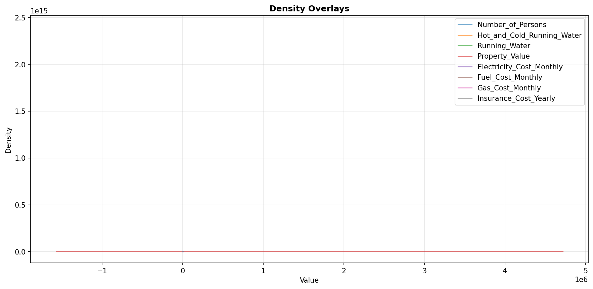

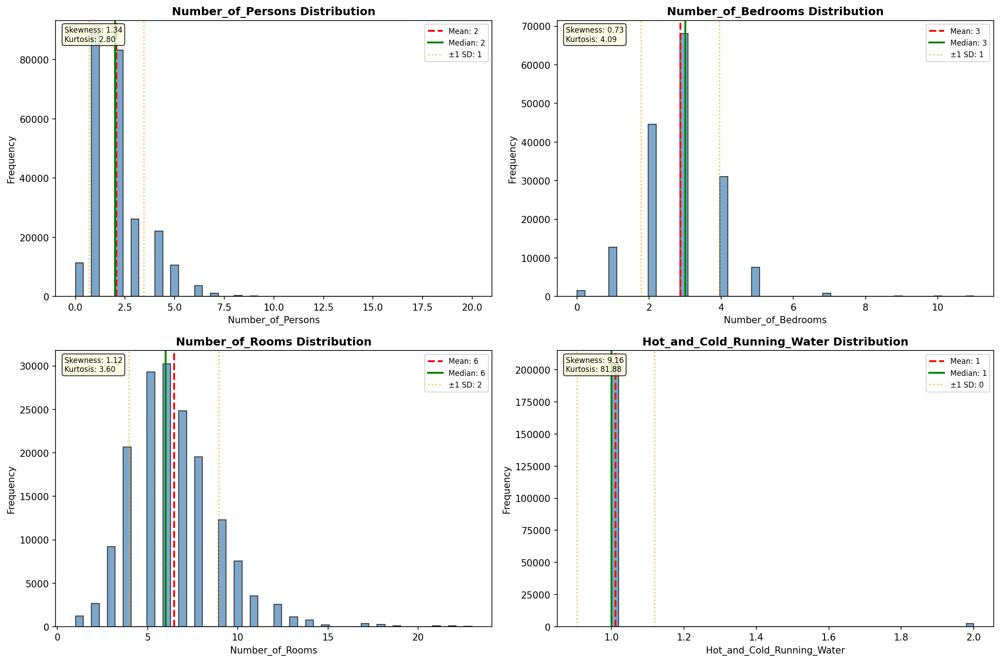

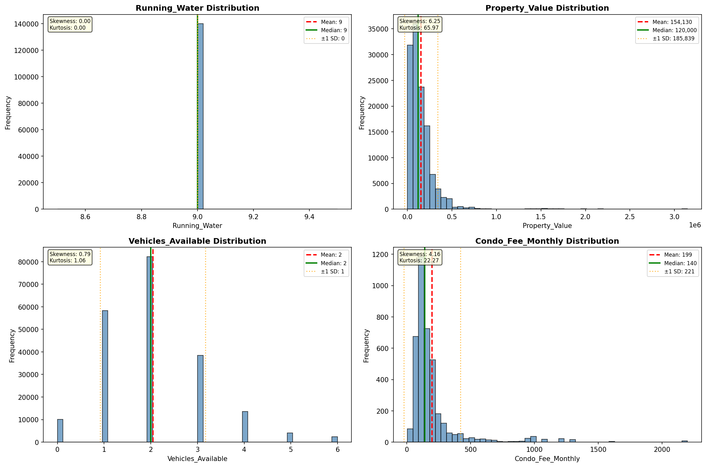

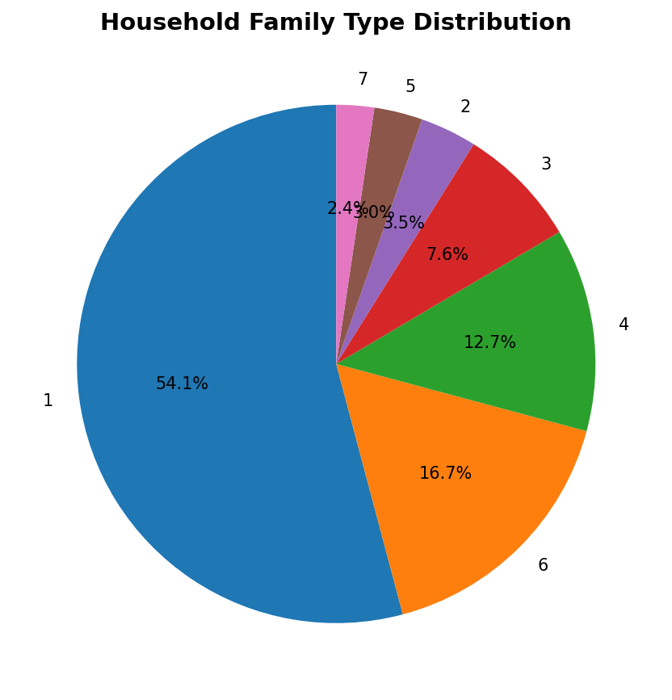

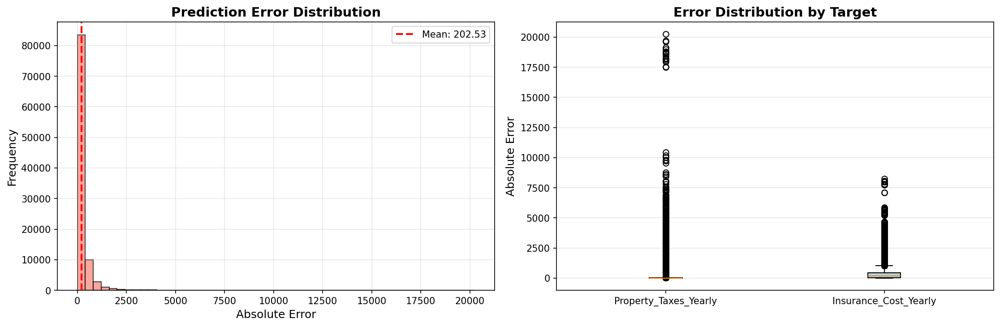

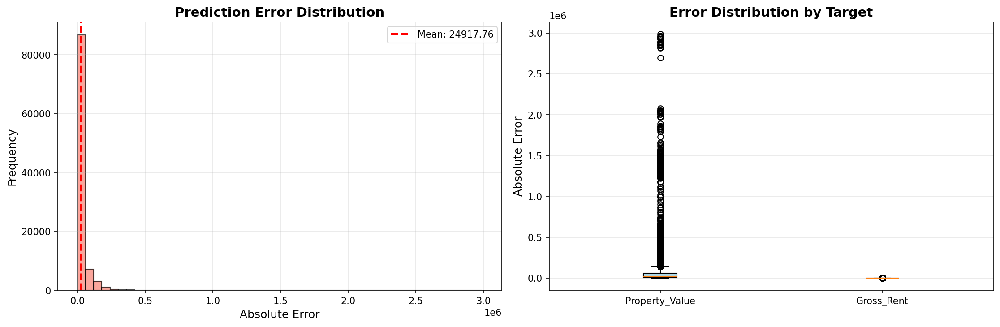

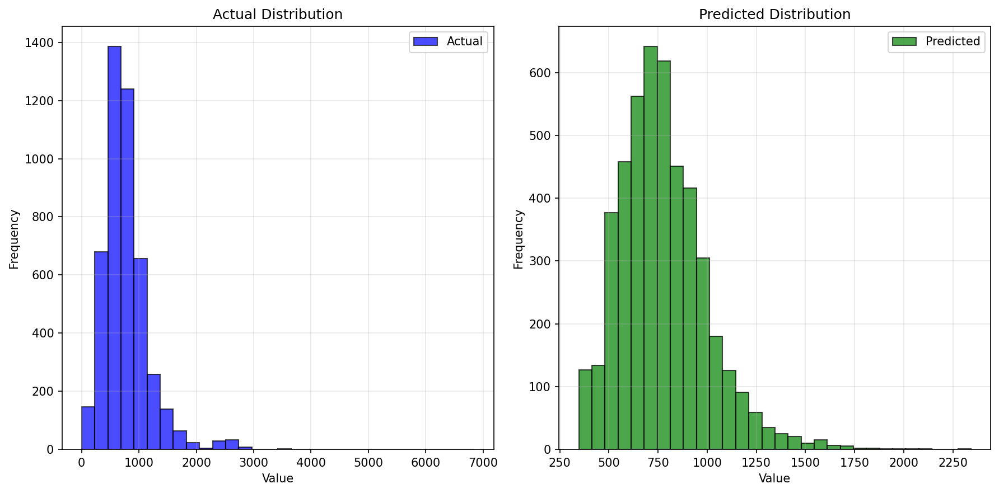

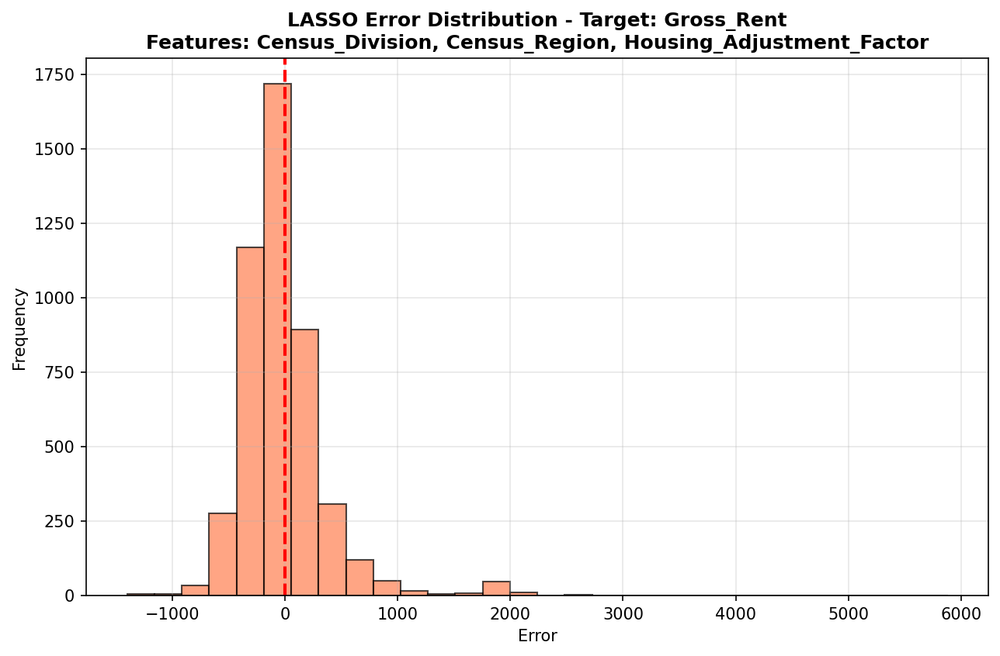

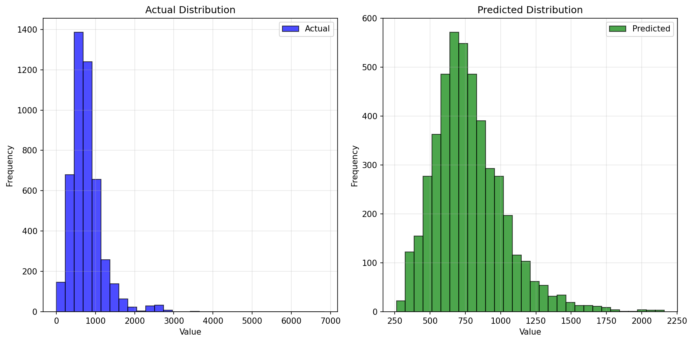

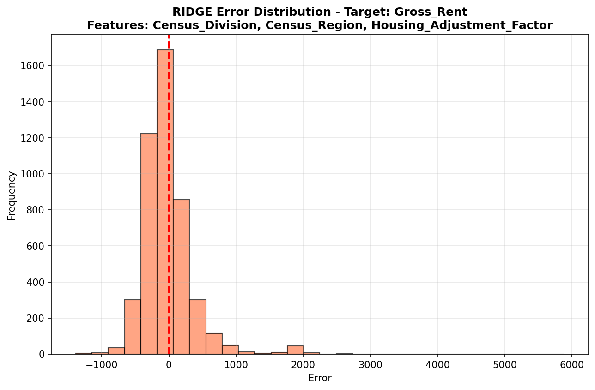

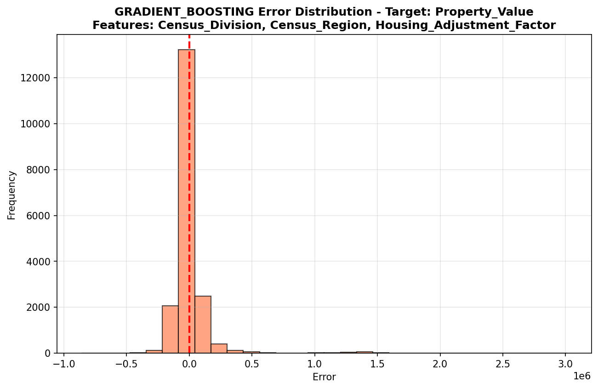

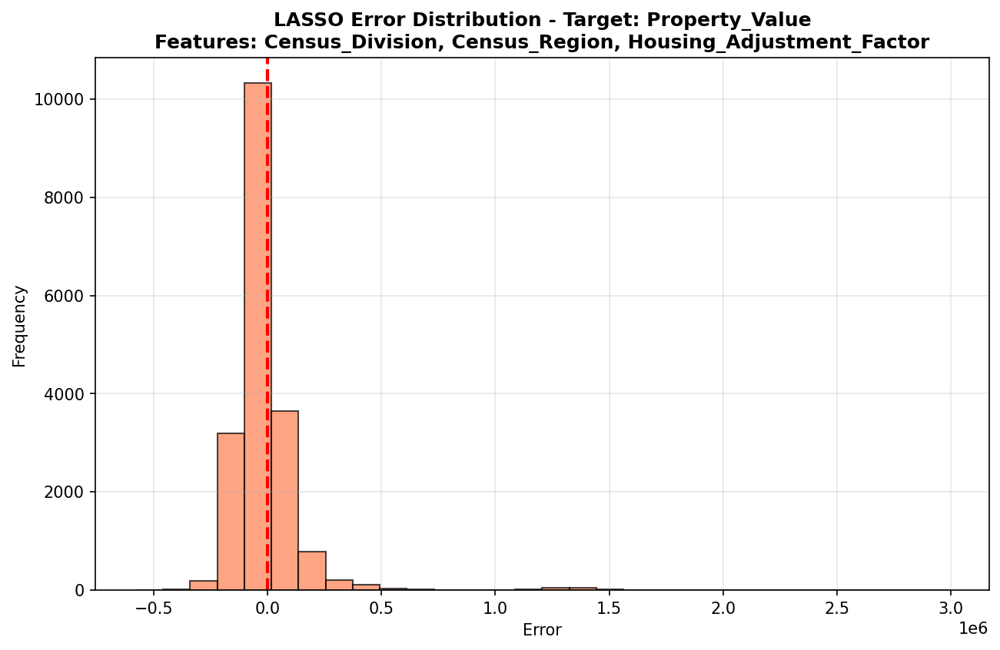

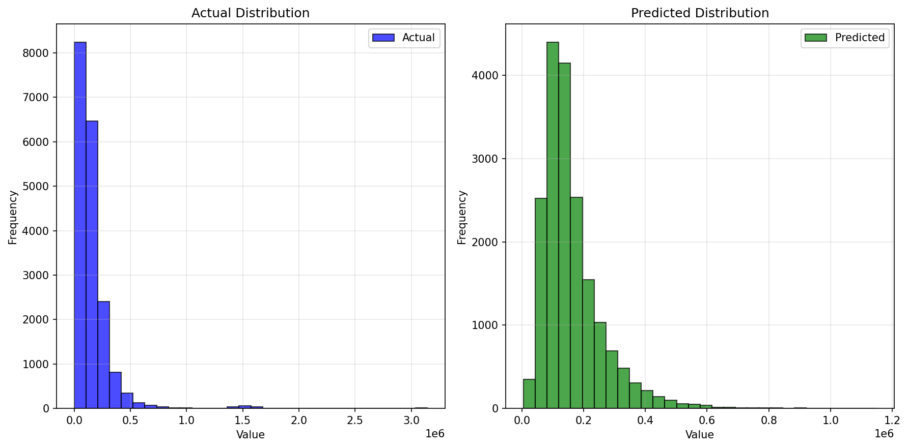

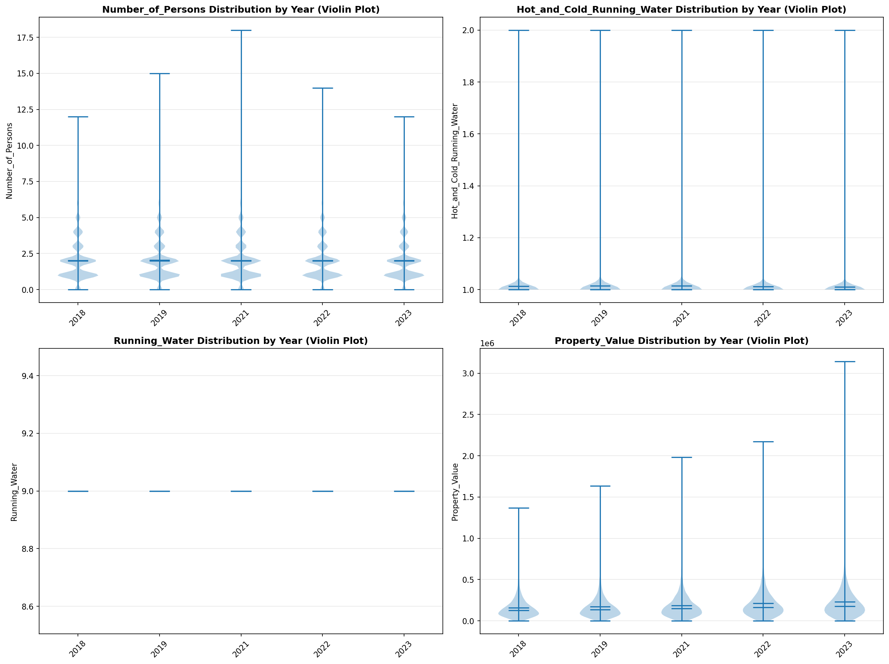

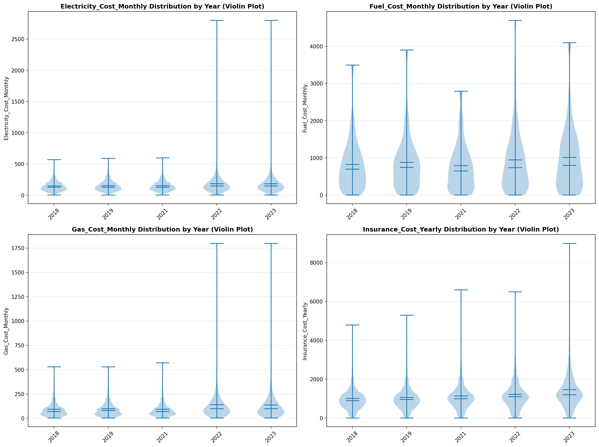

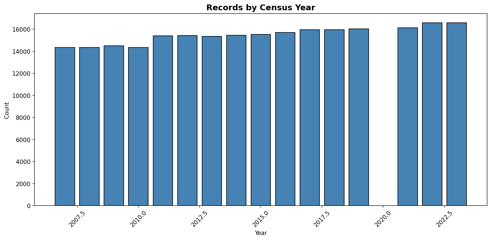
