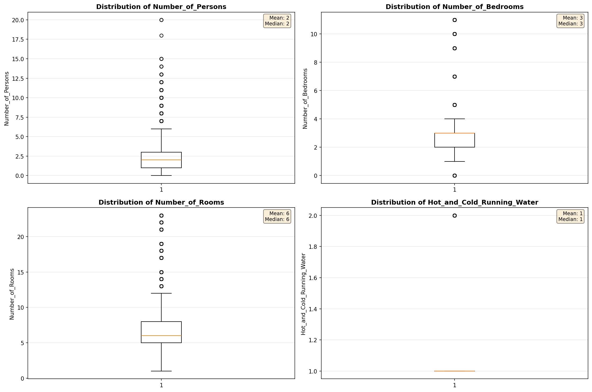
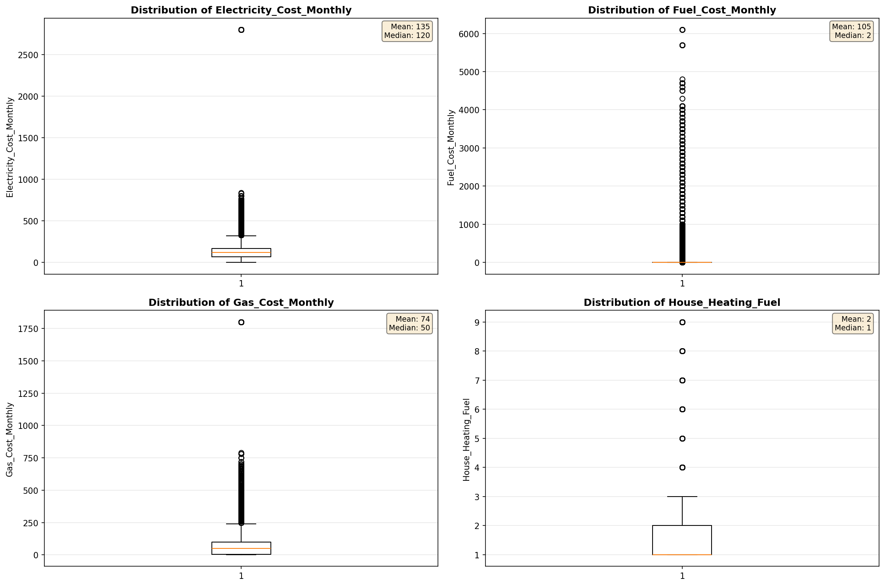
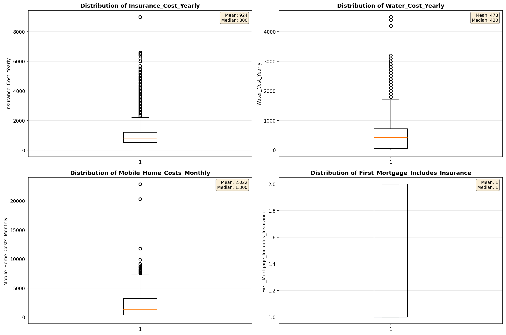
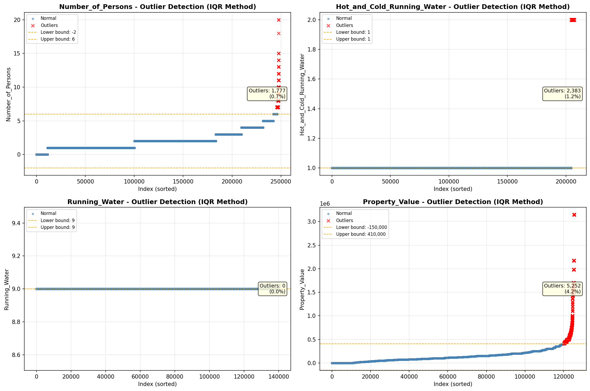
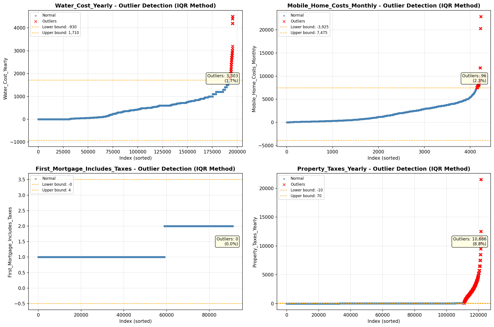

# Outlier Detection

> Statistical outlier detection using IQR (Interquartile Range) method. Outliers are values falling outside Q1 - 1.5×IQR or Q3 + 1.5×IQR bounds.

## Detection Methodology

| Parameter | Value | Description |
| :--- | :--- | :--- |
| Method | IQR | Outlier detection algorithm |
| Lower Bound | Q1 - 1.5 × IQR | Values below are outliers |
| Upper Bound | Q3 + 1.5 × IQR | Values above are outliers |
| IQR Definition | Q3 - Q1 | Interquartile Range |

> **Note**: The IQR method is robust to extreme values and works well for approximately symmetric distributions.

## Outlier Summary

_No outlier summary available._
## High Outlier Rate Variables

> Variables with outlier rate > 5% may indicate data quality issues, non-normal distributions, or genuinely extreme values.

- **('Flag_Selected_Monthly_Owner_Costs', 24.49879304632403)**: 0 outliers (0.00%)

- **('Specified_Rent_Unit', 20.529557824210045)**: 0 outliers (0.00%)

- **('Property_Tax_Rate', 18.80756477956527)**: 0 outliers (0.00%)

- **('Flag_Family_Income', 17.99072420694366)**: 0 outliers (0.00%)

- **('Fuel_Cost_Monthly', 12.037588465853219)**: 0 outliers (0.00%)

- **('Gross_Rent_Percentage_Income', 10.180379906283065)**: 0 outliers (0.00%)

- **('Income_Adjustment_Factor', 9.48781478705203)**: 0 outliers (0.00%)

- **('Flag_Property_Taxes', 8.988693070557767)**: 0 outliers (0.00%)

- **('Structure_Age', 8.837510240074302)**: 0 outliers (0.00%)

- **('Property_Taxes_Yearly', 8.789419138330947)**: 0 outliers (0.00%)

- **('Structure_Age_Score', 7.562784047920938)**: 0 outliers (0.00%)

- **('Flag_Water_Cost', 7.513453842969504)**: 0 outliers (0.00%)

- **('Owner_Costs_Percentage_Income', 7.054223723337862)**: 0 outliers (0.00%)

- **('Flag_Property_Value', 6.55342560270907)**: 0 outliers (0.00%)

- **('Rent_Amount_Monthly', 6.477417527962621)**: 0 outliers (0.00%)

> *Consider investigating these variables for data entry errors, applying transformations, or using robust statistical methods.*

## Visualizations

