# Statistical Analysis

> Comprehensive descriptive statistics including central tendency, dispersion, distribution characteristics, and weighted statistics using ACS sample weights.

## Summary Statistics

- **Variables Analyzed**: 41

### Income_Adjustment_Factor

| Statistic | Unweighted | Weighted (ACS) |
| :--- | :--- | :--- |
| Mean | 1,014,761.72 | 1,014,656.45 |
| Median | 1,010,207.00 | 1,014,656.45 |
| Std Deviation | 11,304.81 | — |
| Minimum | 1,001,264.00 | — |
| Maximum | 1,042,311.00 | — |
| Count | 243,539 | — |

> *Distribution is highly right-skewed (skewness: 1.33), light-tailed/platykurtic (kurtosis: 0.78).*

- **Coefficient of Variation**: 1.1 % (low variability)

### Property_Value

| Statistic | Unweighted | Weighted (ACS) |
| :--- | :--- | :--- |
| Mean | 175,931.98 | 171,106.20 |
| Median | 130,000.00 | 133,751.17 |
| Std Deviation | 225,952.08 | — |
| Minimum | 1.00 | — |
| Maximum | 3,174,000.00 | — |
| Count | 163,920 | — |

> *Distribution is highly right-skewed (skewness: 5.82), heavy-tailed/leptokurtic (kurtosis: 52.34).*

- **Coefficient of Variation**: 128.4 % (very high variability)

### Electricity_Cost_Monthly

| Statistic | Unweighted | Weighted (ACS) |
| :--- | :--- | :--- |
| Mean | 150.13 | 149.23 |
| Median | 130.00 | 131.25 |
| Std Deviation | 116.29 | — |
| Minimum | 1.00 | — |
| Maximum | 2,600.00 | — |
| Count | 287,072 | — |

> *Distribution is highly right-skewed (skewness: 8.15), heavy-tailed/leptokurtic (kurtosis: 151.69).*

- **Coefficient of Variation**: 77.5 % (high variability)

### Fuel_Cost_Monthly

| Statistic | Unweighted | Weighted (ACS) |
| :--- | :--- | :--- |
| Mean | 81.52 | 224.67 |
| Median | 2.00 | 126.38 |
| Std Deviation | 326.35 | — |
| Minimum | 1.00 | — |
| Maximum | 4,900.00 | — |
| Count | 202,974 | — |

> *Distribution is highly right-skewed (skewness: 6.09), heavy-tailed/leptokurtic (kurtosis: 46.14).*

- **Coefficient of Variation**: 400.3 % (very high variability)

### Gas_Cost_Monthly

| Statistic | Unweighted | Weighted (ACS) |
| :--- | :--- | :--- |
| Mean | 52.91 | 60.54 |
| Median | 20.00 | 25.19 |
| Std Deviation | 94.55 | — |
| Minimum | 1.00 | — |
| Maximum | 1,700.00 | — |
| Count | 235,415 | — |

> *Distribution is highly right-skewed (skewness: 6.98), heavy-tailed/leptokurtic (kurtosis: 93.70).*

- **Coefficient of Variation**: 178.7 % (very high variability)

### Insurance_Cost_Yearly

| Statistic | Unweighted | Weighted (ACS) |
| :--- | :--- | :--- |
| Mean | 1,044.47 | 1,023.75 |
| Median | 900.00 | 899.38 |
| Std Deviation | 784.47 | — |
| Minimum | 4.00 | — |
| Maximum | 8,200.00 | — |
| Count | 182,251 | — |

> *Distribution is highly right-skewed (skewness: 2.86), heavy-tailed/leptokurtic (kurtosis: 14.15).*

- **Coefficient of Variation**: 75.1 % (high variability)

### Water_Cost_Yearly

| Statistic | Unweighted | Weighted (ACS) |
| :--- | :--- | :--- |
| Mean | 455.80 | 444.56 |
| Median | 360.00 | 371.25 |
| Std Deviation | 470.70 | — |
| Minimum | 1.00 | — |
| Maximum | 4,200.00 | — |
| Count | 277,023 | — |

> *Distribution is highly right-skewed (skewness: 2.24), heavy-tailed/leptokurtic (kurtosis: 9.15).*

- **Coefficient of Variation**: 103.3 % (very high variability)

### Mobile_Home_Costs_Monthly

| Statistic | Unweighted | Weighted (ACS) |
| :--- | :--- | :--- |
| Mean | 969.34 | 1,021.87 |
| Median | 400.00 | 395.00 |
| Std Deviation | 1,913.77 | — |
| Minimum | 4.00 | — |
| Maximum | 26,500.00 | — |
| Count | 12,530 | — |

> *Distribution is highly right-skewed (skewness: 6.92), heavy-tailed/leptokurtic (kurtosis: 73.14).*

- **Coefficient of Variation**: 197.4 % (very high variability)

### First_Mortgage_Payment_Monthly

| Statistic | Unweighted | Weighted (ACS) |
| :--- | :--- | :--- |
| Mean | 758.68 | 815.29 |
| Median | 660.00 | 660.50 |
| Std Deviation | 648.06 | — |
| Minimum | 4.00 | — |
| Maximum | 4,800.00 | — |
| Count | 143,285 | — |

> *Distribution is highly right-skewed (skewness: 1.76), heavy-tailed/leptokurtic (kurtosis: 5.57).*

- **Coefficient of Variation**: 85.4 % (high variability)

### First_Mortgage_Includes_Taxes

| Statistic | Unweighted | Weighted (ACS) |
| :--- | :--- | :--- |
| Mean | 1.39 | 1.37 |
| Median | 1.00 | 1.00 |
| Std Deviation | 0.49 | — |
| Minimum | 1.00 | — |
| Maximum | 2.00 | — |
| Count | 121,091 | — |

> *Distribution is approximately symmetric (skewness: 0.45), light-tailed/platykurtic (kurtosis: -1.80).*

- **Coefficient of Variation**: 35.1 % (moderate variability)

### Second_Mortgage_Payment_Monthly

| Statistic | Unweighted | Weighted (ACS) |
| :--- | :--- | :--- |
| Mean | 325.90 | 320.64 |
| Median | 230.00 | 223.12 |
| Std Deviation | 349.66 | — |
| Minimum | 4.00 | — |
| Maximum | 2,900.00 | — |
| Count | 22,750 | — |

> *Distribution is highly right-skewed (skewness: 3.42), heavy-tailed/leptokurtic (kurtosis: 15.44).*

- **Coefficient of Variation**: 107.3 % (very high variability)

### Property_Taxes_Yearly

| Statistic | Unweighted | Weighted (ACS) |
| :--- | :--- | :--- |
| Mean | 196.06 | 189.82 |
| Median | 22.00 | 147.42 |
| Std Deviation | 886.89 | — |
| Minimum | 1.00 | — |
| Maximum | 18,500.00 | — |
| Count | 158,609 | — |

> *Distribution is highly right-skewed (skewness: 10.64), heavy-tailed/leptokurtic (kurtosis: 171.55).*

- **Coefficient of Variation**: 452.4 % (very high variability)

### Meals_Included_in_Rent

| Statistic | Unweighted | Weighted (ACS) |
| :--- | :--- | :--- |
| Mean | 1.98 | 1.98 |
| Median | 2.00 | 2.00 |
| Std Deviation | 0.12 | — |
| Minimum | 1.00 | — |
| Maximum | 2.00 | — |
| Count | 71,897 | — |

> *Distribution is highly left-skewed (skewness: -7.80), heavy-tailed/leptokurtic (kurtosis: 58.87).*

- **Coefficient of Variation**: 6.3 % (low variability)

### Rent_Amount_Monthly

| Statistic | Unweighted | Weighted (ACS) |
| :--- | :--- | :--- |
| Mean | 580.68 | 596.46 |
| Median | 500.00 | 547.50 |
| Std Deviation | 363.82 | — |
| Minimum | 4.00 | — |
| Maximum | 2,700.00 | — |
| Count | 71,897 | — |

> *Distribution is highly right-skewed (skewness: 2.07), heavy-tailed/leptokurtic (kurtosis: 7.16).*

- **Coefficient of Variation**: 62.7 % (high variability)

### Gross_Rent

| Statistic | Unweighted | Weighted (ACS) |
| :--- | :--- | :--- |
| Mean | 744.18 | 755.68 |
| Median | 680.00 | 706.50 |
| Std Deviation | 404.25 | — |
| Minimum | 4.00 | — |
| Maximum | 5,650.00 | — |
| Count | 67,751 | — |

> *Distribution is highly right-skewed (skewness: 1.84), heavy-tailed/leptokurtic (kurtosis: 7.23).*

- **Coefficient of Variation**: 54.3 % (high variability)

### Gross_Rent_Percentage_Income

| Statistic | Unweighted | Weighted (ACS) |
| :--- | :--- | :--- |
| Mean | 37.02 | 37.43 |
| Median | 28.00 | 28.25 |
| Std Deviation | 26.75 | — |
| Minimum | 1.00 | — |
| Maximum | 101.00 | — |
| Count | 66,117 | — |

> *Distribution is highly right-skewed (skewness: 1.23), light-tailed/platykurtic (kurtosis: 0.51).*

- **Coefficient of Variation**: 72.3 % (high variability)

### Selected_Monthly_Owner_Costs

| Statistic | Unweighted | Weighted (ACS) |
| :--- | :--- | :--- |
| Mean | 918.78 | 926.26 |
| Median | 738.00 | 769.38 |
| Std Deviation | 746.79 | — |
| Minimum | 2.00 | — |
| Maximum | 10,750.00 | — |
| Count | 214,464 | — |

> *Distribution is highly right-skewed (skewness: 2.32), heavy-tailed/leptokurtic (kurtosis: 9.60).*

- **Coefficient of Variation**: 81.3 % (high variability)

### Owner_Costs_Percentage_Income

| Statistic | Unweighted | Weighted (ACS) |
| :--- | :--- | :--- |
| Mean | 21.24 | 21.70 |
| Median | 16.00 | 16.12 |
| Std Deviation | 19.49 | — |
| Minimum | 1.00 | — |
| Maximum | 101.00 | — |
| Count | 212,682 | — |

> *Distribution is highly right-skewed (skewness: 2.35), heavy-tailed/leptokurtic (kurtosis: 6.17).*

- **Coefficient of Variation**: 91.8 % (high variability)

### Family_Income

| Statistic | Unweighted | Weighted (ACS) |
| :--- | :--- | :--- |
| Mean | 80,160.74 | 76,214.40 |
| Median | 60,700.00 | 58,836.88 |
| Std Deviation | 78,739.86 | — |
| Minimum | 1.00 | — |
| Maximum | 1,920,000.00 | — |
| Count | 191,837 | — |

> *Distribution is highly right-skewed (skewness: 3.55), heavy-tailed/leptokurtic (kurtosis: 21.60).*

- **Coefficient of Variation**: 98.2 % (high variability)

### Household_Income

| Statistic | Unweighted | Weighted (ACS) |
| :--- | :--- | :--- |
| Mean | 67,475.97 | 64,400.94 |
| Median | 48,500.00 | 47,001.25 |
| Std Deviation | 72,642.31 | — |
| Minimum | 1.00 | — |
| Maximum | 1,920,000.00 | — |
| Count | 286,575 | — |

> *Distribution is highly right-skewed (skewness: 3.76), heavy-tailed/leptokurtic (kurtosis: 24.38).*

- **Coefficient of Variation**: 107.7 % (very high variability)

### Specified_Rent_Unit

| Statistic | Unweighted | Weighted (ACS) |
| :--- | :--- | :--- |
| Mean | 0.25 | 0.30 |
| Median | 0.00 | 0.00 |
| Std Deviation | 0.43 | — |
| Minimum | 0.00 | — |
| Maximum | 1.00 | — |
| Count | 314,247 | — |

> *Distribution is highly right-skewed (skewness: 1.17), light-tailed/platykurtic (kurtosis: -0.64).*

- **Coefficient of Variation**: 174.0 % (very high variability)

### Specified_Value_Unit

| Statistic | Unweighted | Weighted (ACS) |
| :--- | :--- | :--- |
| Mean | 0.55 | 0.48 |
| Median | 1.00 | 0.12 |
| Std Deviation | 0.50 | — |
| Minimum | 0.00 | — |
| Maximum | 1.00 | — |
| Count | 314,247 | — |

> *Distribution is approximately symmetric (skewness: -0.19), light-tailed/platykurtic (kurtosis: -1.96).*

- **Coefficient of Variation**: 91.1 % (high variability)

### Flag_Family_Income

| Statistic | Unweighted | Weighted (ACS) |
| :--- | :--- | :--- |
| Mean | 0.20 | 0.19 |
| Median | 0.00 | 0.00 |
| Std Deviation | 0.40 | — |
| Minimum | 0.00 | — |
| Maximum | 1.00 | — |
| Count | 237,344 | — |

> *Distribution is highly right-skewed (skewness: 1.53), light-tailed/platykurtic (kurtosis: 0.35).*

- **Coefficient of Variation**: 202.7 % (very high variability)

### Flag_Gross_Rent

| Statistic | Unweighted | Weighted (ACS) |
| :--- | :--- | :--- |
| Mean | 0.07 | 0.11 |
| Median | 0.00 | 0.00 |
| Std Deviation | 0.25 | — |
| Minimum | 0.00 | — |
| Maximum | 1.00 | — |
| Count | 151,074 | — |

> *Distribution is highly right-skewed (skewness: 3.38), heavy-tailed/leptokurtic (kurtosis: 9.45).*

- **Coefficient of Variation**: 365.7 % (very high variability)

### Flag_Household_Income

| Statistic | Unweighted | Weighted (ACS) |
| :--- | :--- | :--- |
| Mean | 0.29 | 0.28 |
| Median | 0.00 | 0.00 |
| Std Deviation | 0.46 | — |
| Minimum | 0.00 | — |
| Maximum | 1.00 | — |
| Count | 237,344 | — |

> *Distribution is moderately right-skewed (skewness: 0.91), light-tailed/platykurtic (kurtosis: -1.18).*

- **Coefficient of Variation**: 155.2 % (very high variability)

### Flag_First_Mortgage_Payment

| Statistic | Unweighted | Weighted (ACS) |
| :--- | :--- | :--- |
| Mean | 0.03 | 0.03 |
| Median | 0.00 | 0.00 |
| Std Deviation | 0.18 | — |
| Minimum | 0.00 | — |
| Maximum | 1.00 | — |
| Count | 314,247 | — |

> *Distribution is highly right-skewed (skewness: 5.32), heavy-tailed/leptokurtic (kurtosis: 26.33).*

- **Coefficient of Variation**: 550.5 % (very high variability)

### Flag_First_Mortgage_Taxes

| Statistic | Unweighted | Weighted (ACS) |
| :--- | :--- | :--- |
| Mean | 0.03 | 0.03 |
| Median | 0.00 | 0.00 |
| Std Deviation | 0.18 | — |
| Minimum | 0.00 | — |
| Maximum | 1.00 | — |
| Count | 314,247 | — |

> *Distribution is highly right-skewed (skewness: 5.28), heavy-tailed/leptokurtic (kurtosis: 25.90).*

- **Coefficient of Variation**: 546.5 % (very high variability)

### Flag_Meals_Included_Rent

| Statistic | Unweighted | Weighted (ACS) |
| :--- | :--- | :--- |
| Mean | 0.01 | 0.01 |
| Median | 0.00 | 0.00 |
| Std Deviation | 0.08 | — |
| Minimum | 0.00 | — |
| Maximum | 1.00 | — |
| Count | 314,247 | — |

> *Distribution is highly right-skewed (skewness: 12.82), heavy-tailed/leptokurtic (kurtosis: 162.43).*

- **Coefficient of Variation**: 1,290.0 % (very high variability)

### Flag_Rent_Amount

| Statistic | Unweighted | Weighted (ACS) |
| :--- | :--- | :--- |
| Mean | 0.02 | 0.02 |
| Median | 0.00 | 0.00 |
| Std Deviation | 0.13 | — |
| Minimum | 0.00 | — |
| Maximum | 1.00 | — |
| Count | 314,247 | — |

> *Distribution is highly right-skewed (skewness: 7.49), heavy-tailed/leptokurtic (kurtosis: 54.09).*

- **Coefficient of Variation**: 762.0 % (very high variability)

### Flag_Selected_Monthly_Owner_Costs

| Statistic | Unweighted | Weighted (ACS) |
| :--- | :--- | :--- |
| Mean | 0.25 | 0.24 |
| Median | 0.00 | 0.00 |
| Std Deviation | 0.43 | — |
| Minimum | 0.00 | — |
| Maximum | 1.00 | — |
| Count | 203,838 | — |

> *Distribution is highly right-skewed (skewness: 1.16), light-tailed/platykurtic (kurtosis: -0.65).*

- **Coefficient of Variation**: 173.9 % (very high variability)

### Flag_Second_Mortgage_Payment

| Statistic | Unweighted | Weighted (ACS) |
| :--- | :--- | :--- |
| Mean | 0.03 | 0.03 |
| Median | 0.00 | 0.00 |
| Std Deviation | 0.17 | — |
| Minimum | 0.00 | — |
| Maximum | 1.00 | — |
| Count | 314,247 | — |

> *Distribution is highly right-skewed (skewness: 5.69), heavy-tailed/leptokurtic (kurtosis: 30.41).*

- **Coefficient of Variation**: 586.3 % (very high variability)

### Flag_Property_Taxes

| Statistic | Unweighted | Weighted (ACS) |
| :--- | :--- | :--- |
| Mean | 0.11 | 0.11 |
| Median | 0.00 | 0.00 |
| Std Deviation | 0.31 | — |
| Minimum | 0.00 | — |
| Maximum | 1.00 | — |
| Count | 293,879 | — |

> *Distribution is highly right-skewed (skewness: 2.54), heavy-tailed/leptokurtic (kurtosis: 4.47).*

- **Coefficient of Variation**: 289.0 % (very high variability)

### Flag_Property_Value

| Statistic | Unweighted | Weighted (ACS) |
| :--- | :--- | :--- |
| Mean | 0.08 | 0.08 |
| Median | 0.00 | 0.00 |
| Std Deviation | 0.27 | — |
| Minimum | 0.00 | — |
| Maximum | 1.00 | — |
| Count | 314,247 | — |

> *Distribution is highly right-skewed (skewness: 3.17), heavy-tailed/leptokurtic (kurtosis: 8.03).*

- **Coefficient of Variation**: 345.6 % (very high variability)

### Flag_Water_Cost

| Statistic | Unweighted | Weighted (ACS) |
| :--- | :--- | :--- |
| Mean | 0.07 | 0.07 |
| Median | 0.00 | 0.00 |
| Std Deviation | 0.25 | — |
| Minimum | 0.00 | — |
| Maximum | 1.00 | — |
| Count | 20,368 | — |

> *Distribution is highly right-skewed (skewness: 3.44), heavy-tailed/leptokurtic (kurtosis: 9.85).*

- **Coefficient of Variation**: 371.2 % (very high variability)

### Annual_Rent_to_Value_Ratio

### Total_Monthly_Utility_Cost

| Statistic | Unweighted | Weighted (ACS) |
| :--- | :--- | :--- |
| Mean | 193.25 | 189.42 |
| Median | 170.00 | 165.06 |
| Std Deviation | 150.28 | — |
| Minimum | 2.00 | — |
| Maximum | 4,100.00 | — |
| Count | 287,471 | — |

> *Distribution is highly right-skewed (skewness: 7.81), heavy-tailed/leptokurtic (kurtosis: 139.25).*

- **Coefficient of Variation**: 77.8 % (high variability)

### Property_Tax_Rate

| Statistic | Unweighted | Weighted (ACS) |
| :--- | :--- | :--- |
| Mean | 17.14 | 16.69 |
| Median | 0.02 | 16.51 |
| Std Deviation | 51.24 | — |
| Minimum | 0.00 | — |
| Maximum | 1,200.00 | — |
| Count | 105,574 | — |

> *Distribution is highly right-skewed (skewness: 4.07), heavy-tailed/leptokurtic (kurtosis: 29.79).*

- **Coefficient of Variation**: 299.0 % (very high variability)

#### Weighted Statistics by Year

| Year | Weighted Mean | Weighted Median |
| :--- | :--- | :--- |
| 2007 | 132.37 | 131.25 |
| 2012 | 0.02 | 0.02 |
| 2013 | 0.05 | 0.02 |
| 2014 | 0.05 | 0.02 |
| 2015 | 0.02 | 0.01 |
| 2016 | 0.02 | 0.01 |
| 2017 | 0.02 | 0.01 |
| 2023 | 0.97 | 0.76 |

### Structure_Age

| Statistic | Unweighted | Weighted (ACS) |
| :--- | :--- | :--- |
| Mean | 1,871.98 | 1,877.50 |
| Median | 2,018.00 | 1,877.71 |
| Std Deviation | 516.83 | — |
| Minimum | 1.00 | — |
| Maximum | 2,023.00 | — |
| Count | 273,926 | — |

> *Distribution is highly left-skewed (skewness: -3.25), heavy-tailed/leptokurtic (kurtosis: 8.54).*

- **Coefficient of Variation**: 27.6 % (moderate variability)

### Structure_Age_Score

| Statistic | Unweighted | Weighted (ACS) |
| :--- | :--- | :--- |
| Mean | 0.04 | 0.04 |
| Median | 0.00 | 0.04 |
| Std Deviation | 0.15 | — |
| Minimum | 0.00 | — |
| Maximum | 0.99 | — |
| Count | 273,926 | — |

> *Distribution is highly right-skewed (skewness: 4.12), heavy-tailed/leptokurtic (kurtosis: 16.42).*

- **Coefficient of Variation**: 389.4 % (very high variability)

### Working_Age_Persons

| Statistic | Unweighted | Weighted (ACS) |
| :--- | :--- | :--- |
| Mean | 1.64 | 1.73 |
| Median | 2.00 | 2.00 |
| Std Deviation | 1.31 | — |
| Minimum | 0.00 | — |
| Maximum | 18.00 | — |
| Count | 290,512 | — |

> *Distribution is moderately right-skewed (skewness: 0.89), light-tailed/platykurtic (kurtosis: 1.93).*

- **Coefficient of Variation**: 80.3 % (high variability)

### Income_to_FPL_Ratio

| Statistic | Unweighted | Weighted (ACS) |
| :--- | :--- | :--- |
| Mean | 3.07 | 2.91 |
| Median | 2.28 | 2.20 |
| Std Deviation | 3.27 | — |
| Minimum | -0.91 | — |
| Maximum | 77.23 | — |
| Count | 290,512 | — |

> *Distribution is highly right-skewed (skewness: 4.13), heavy-tailed/leptokurtic (kurtosis: 29.54).*

- **Coefficient of Variation**: 106.4 % (very high variability)

## Distribution Analysis

### Skewed Distributions

> Variables with skewness > |0.5| indicate non-normal distributions. Consider log transformations for highly skewed variables in modeling.

| Variable | Skewness | Direction | Severity |
| :--- | :--- | :--- | :--- |
| Flag_Meals_Included_Rent | 12.823 | Right-skewed | High |
| Property_Taxes_Yearly | 10.644 | Right-skewed | High |
| Electricity_Cost_Monthly | 8.148 | Right-skewed | High |
| Total_Monthly_Utility_Cost | 7.808 | Right-skewed | High |
| Meals_Included_in_Rent | -7.802 | Left-skewed | High |
| Flag_Rent_Amount | 7.489 | Right-skewed | High |
| Gas_Cost_Monthly | 6.975 | Right-skewed | High |
| Mobile_Home_Costs_Monthly | 6.924 | Right-skewed | High |
| Fuel_Cost_Monthly | 6.094 | Right-skewed | High |
| Property_Value | 5.822 | Right-skewed | High |
| Flag_Second_Mortgage_Payment | 5.693 | Right-skewed | High |
| Flag_First_Mortgage_Payment | 5.323 | Right-skewed | High |
| Flag_First_Mortgage_Taxes | 5.282 | Right-skewed | High |
| Income_to_FPL_Ratio | 4.130 | Right-skewed | High |
| Structure_Age_Score | 4.118 | Right-skewed | High |
| Property_Tax_Rate | 4.073 | Right-skewed | High |
| Household_Income | 3.761 | Right-skewed | High |
| Family_Income | 3.550 | Right-skewed | High |
| Flag_Water_Cost | 3.443 | Right-skewed | High |
| Second_Mortgage_Payment_Monthly | 3.424 | Right-skewed | High |

- **Total Skewed Variables**: 38

- **Right-skewed**: 36

- **Left-skewed**: 2

## Variance Analysis

### Coefficient of Variation Ranking

> CV (Coefficient of Variation) = (Std Dev / Mean) × 100%. Higher CV indicates greater relative variability.

| Variable | CV (%) | Std Dev | Mean | Variability |
| :--- | :--- | :--- | :--- | :--- |
| Flag_Meals_Included_Rent | 1290.0% | 0.08 | 0.01 | Very High |
| Flag_Rent_Amount | 762.0% | 0.13 | 0.02 | Very High |
| Flag_Second_Mortgage_Payment | 586.3% | 0.17 | 0.03 | Very High |
| Flag_First_Mortgage_Payment | 550.5% | 0.18 | 0.03 | Very High |
| Flag_First_Mortgage_Taxes | 546.5% | 0.18 | 0.03 | Very High |
| Property_Taxes_Yearly | 452.4% | 886.89 | 196.06 | Very High |
| Fuel_Cost_Monthly | 400.3% | 326.35 | 81.52 | Very High |
| Structure_Age_Score | 389.4% | 0.15 | 0.04 | Very High |
| Flag_Water_Cost | 371.2% | 0.25 | 0.07 | Very High |
| Flag_Gross_Rent | 365.7% | 0.25 | 0.07 | Very High |
| Flag_Property_Value | 345.6% | 0.27 | 0.08 | Very High |
| Property_Tax_Rate | 299.0% | 51.24 | 17.14 | Very High |
| Flag_Property_Taxes | 289.0% | 0.31 | 0.11 | Very High |
| Flag_Family_Income | 202.7% | 0.40 | 0.20 | Very High |
| Mobile_Home_Costs_Monthly | 197.4% | 1,913.77 | 969.34 | Very High |
| Gas_Cost_Monthly | 178.7% | 94.55 | 52.91 | Very High |
| Specified_Rent_Unit | 174.0% | 0.43 | 0.25 | Very High |
| Flag_Selected_Monthly_Owner_Costs | 173.9% | 0.43 | 0.25 | Very High |
| Flag_Household_Income | 155.2% | 0.46 | 0.29 | Very High |
| Property_Value | 128.4% | 225,952.08 | 175,931.98 | Very High |

- **Average CV**: 232.5 %

- **High Variance Variables (CV > 50%)**: 36

## Visualizations

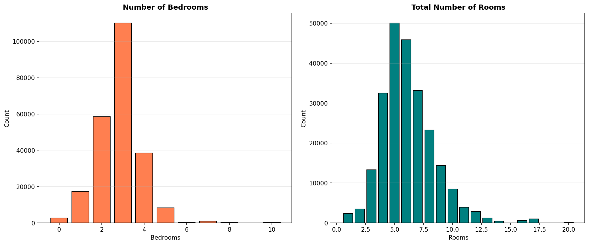

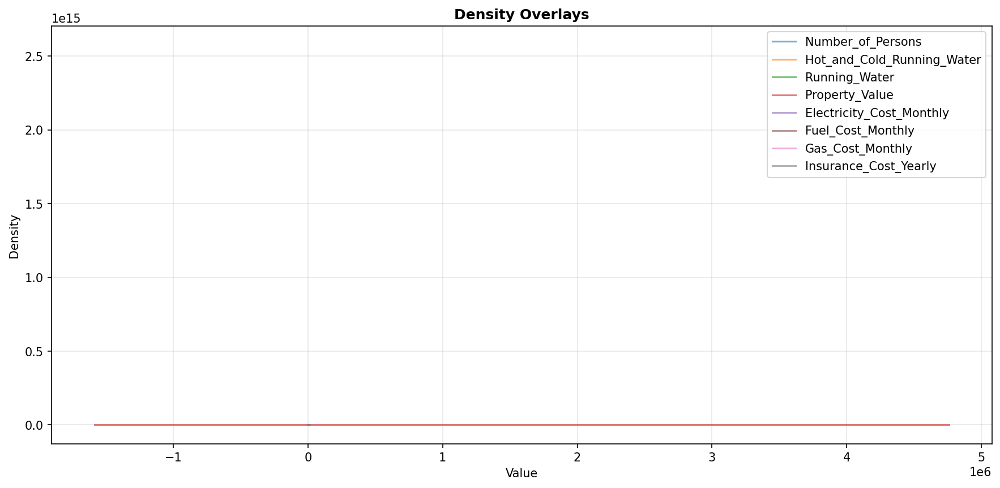

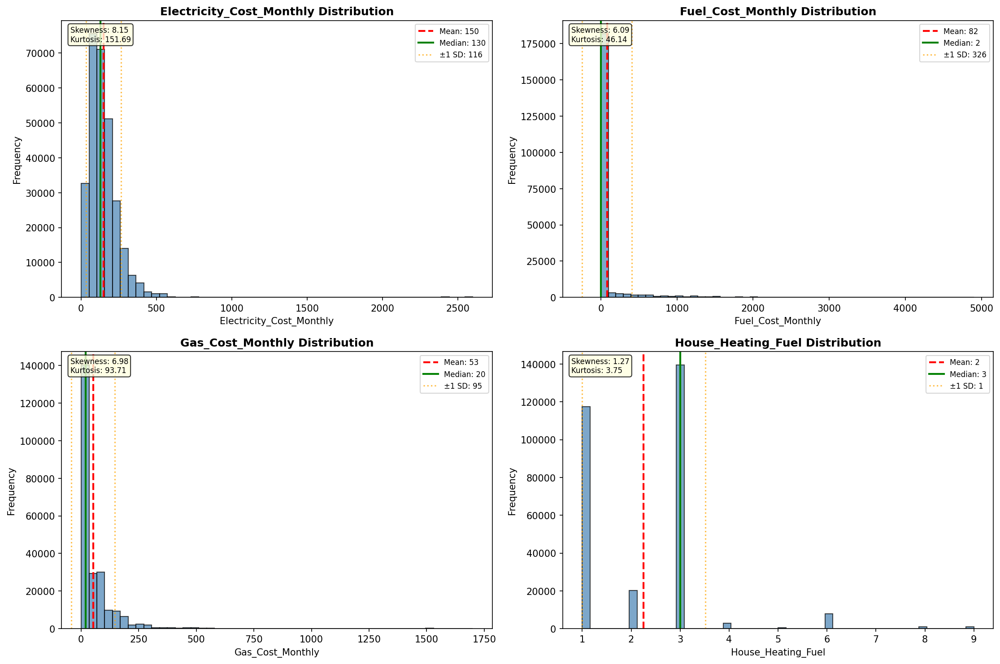

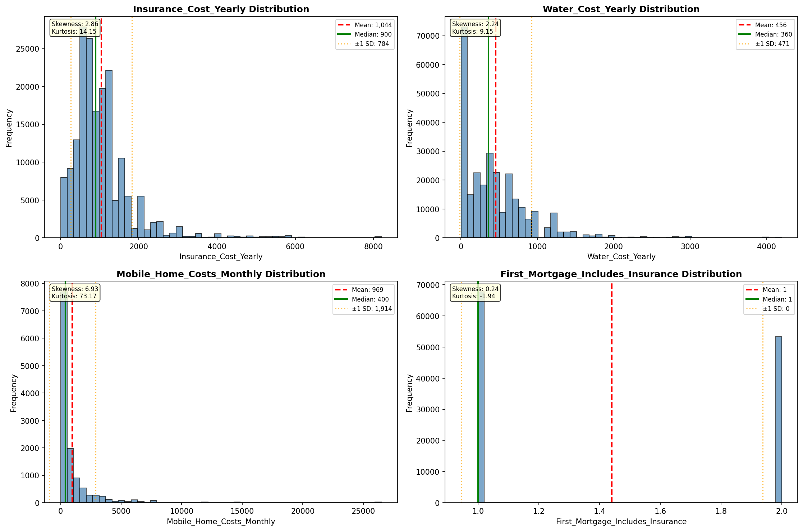

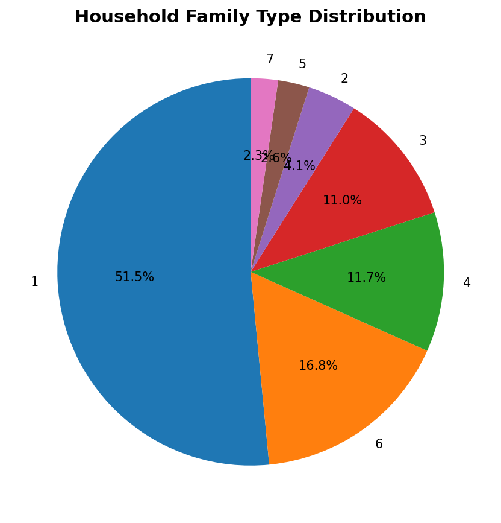

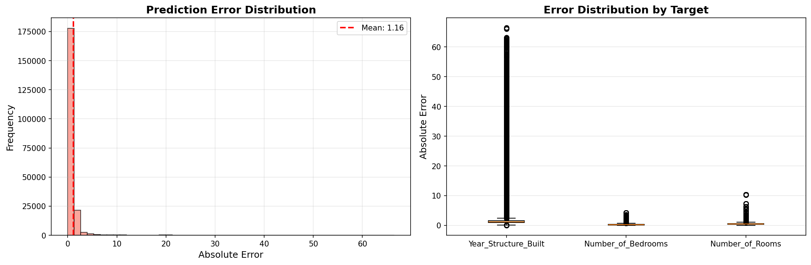

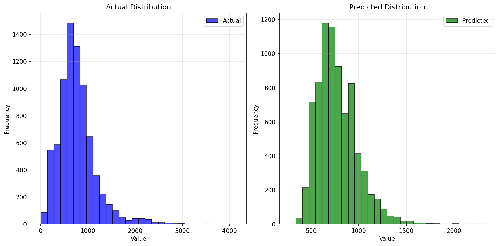

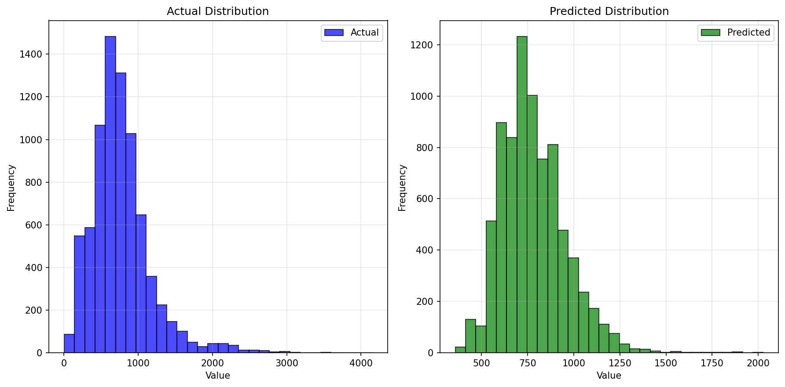

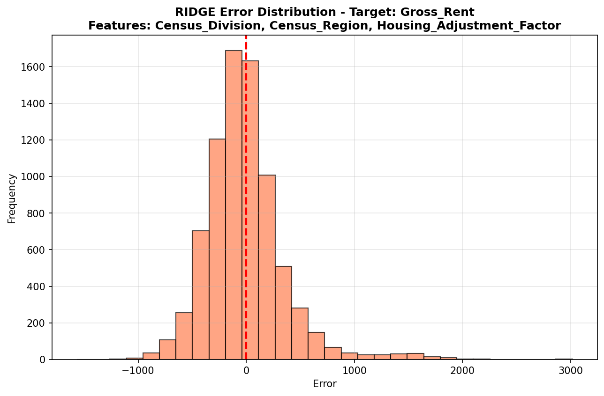

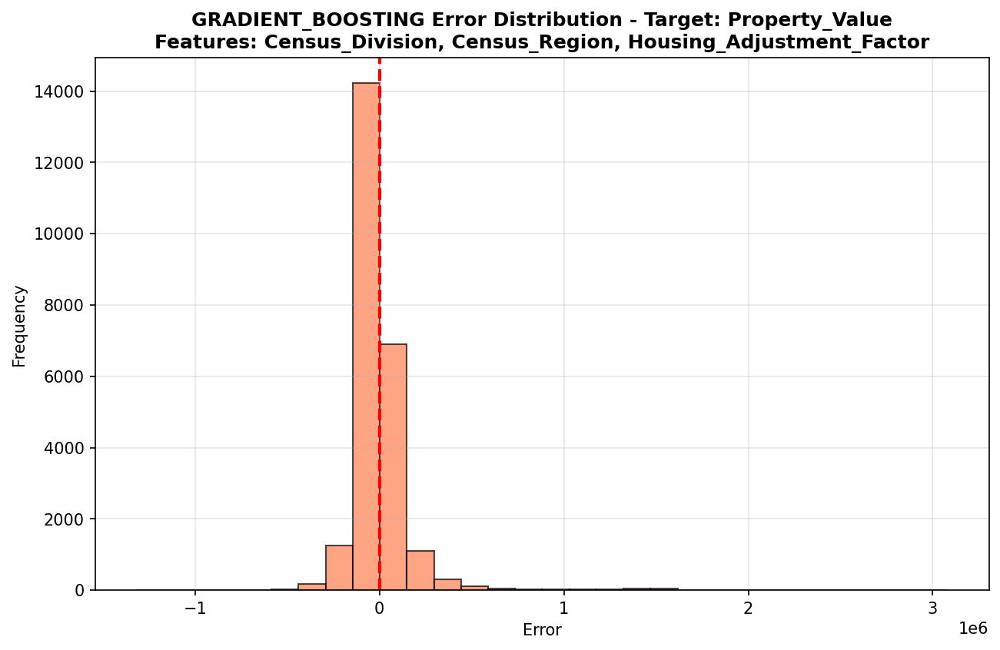

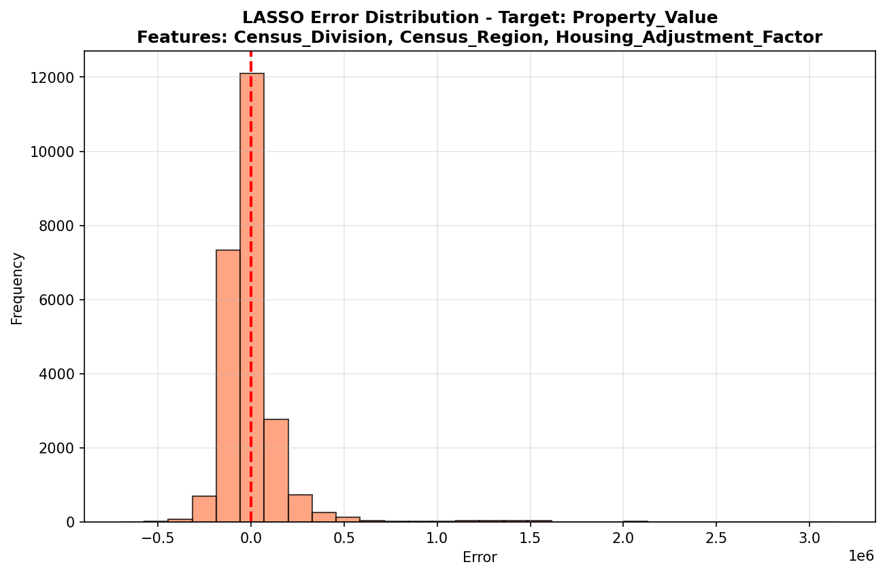

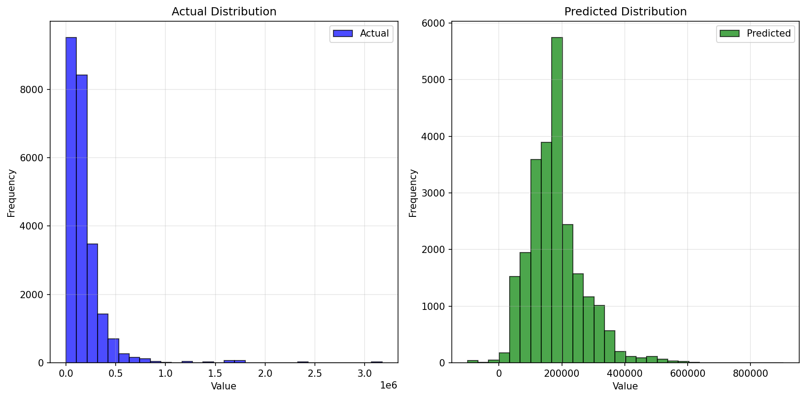

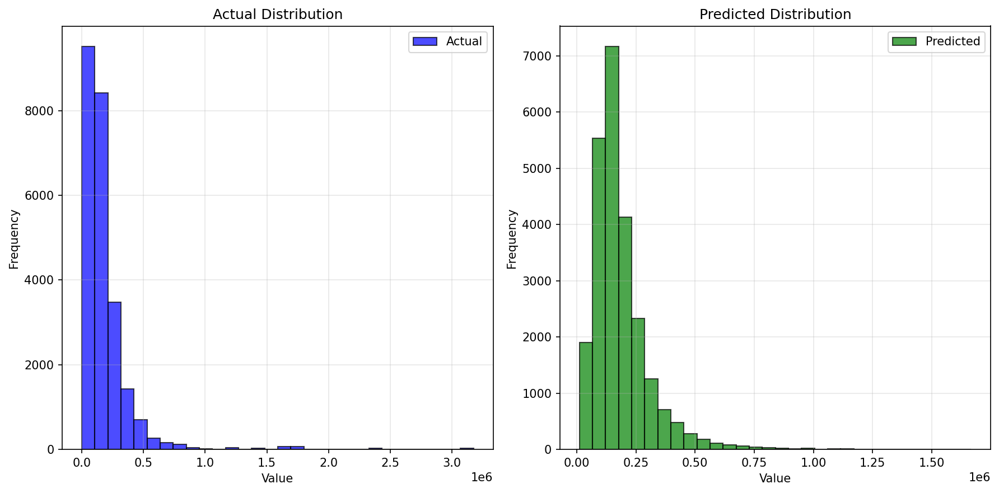

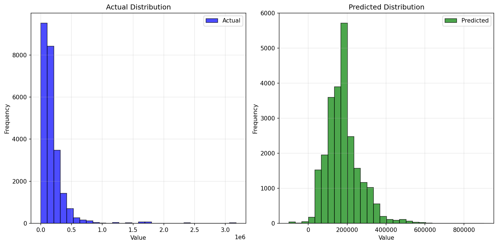

