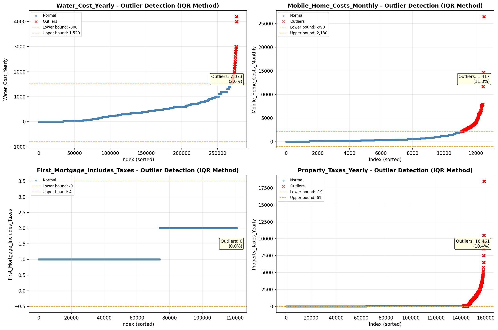

# Outlier Detection

> Statistical outlier detection using IQR (Interquartile Range) method. Outliers are values falling outside Q1 - 1.5×IQR or Q3 + 1.5×IQR bounds.

## Detection Methodology

| Parameter | Value | Description |
| :--- | :--- | :--- |
| Method | IQR | Outlier detection algorithm |
| Lower Bound | Q1 - 1.5 × IQR | Values below are outliers |
| Upper Bound | Q3 + 1.5 × IQR | Values above are outliers |
| IQR Definition | Q3 - Q1 | Interquartile Range |

> **Note**: The IQR method is robust to extreme values and works well for approximately symmetric distributions.

## Outlier Summary

_No outlier summary available._
## High Outlier Rate Variables

> Variables with outlier rate > 5% may indicate data quality issues, non-normal distributions, or genuinely extreme values.

- **('Flag_Selected_Monthly_Owner_Costs', 24.856503694110028)**: 0 outliers (0.00%)

- **('Specified_Rent_Unit', 24.823148669677035)**: 0 outliers (0.00%)

- **('Property_Tax_Rate', 21.48066758861083)**: 0 outliers (0.00%)

- **('Flag_Family_Income', 19.581704193069974)**: 0 outliers (0.00%)

- **('Fuel_Cost_Monthly', 12.743011420181896)**: 0 outliers (0.00%)

- **('Mobile_Home_Costs_Monthly', 11.308858739026336)**: 0 outliers (0.00%)

- **('Flag_Property_Taxes', 10.691134786765982)**: 0 outliers (0.00%)

- **('Property_Taxes_Yearly', 10.37835179592583)**: 0 outliers (0.00%)

- **('Gross_Rent_Percentage_Income', 9.277492929201264)**: 0 outliers (0.00%)

- **('Income_Adjustment_Factor', 9.231375672890174)**: 0 outliers (0.00%)

- **('Structure_Age', 8.883421069923994)**: 0 outliers (0.00%)

- **('Working_Age_Persons', 7.9459712507572835)**: 0 outliers (0.00%)

- **('Flag_Property_Value', 7.725133414161471)**: 0 outliers (0.00%)

- **('Owner_Costs_Percentage_Income', 7.440686094732982)**: 0 outliers (0.00%)

- **('Structure_Age_Score', 7.435584792973285)**: 0 outliers (0.00%)

> *Consider investigating these variables for data entry errors, applying transformations, or using robust statistical methods.*

## Visualizations

