# Deep Learning Models

> Neural network analysis using TensorFlow/Keras for complex pattern recognition and multi-output prediction tasks.

## Deep Learning Summary

- **Total Tasks**: 5

- **Tasks**: Property Valuation, Affordability Analysis, Housing Quality, Cost Prediction, Occupancy Prediction

### Aggregate Statistics

| Metric | Value |
| :--- | :--- |
| Total Parameters | 78,283 |
| Average Validation Loss | 1992158603.9013 |
| Number of Tasks | 5 |

## Task: Property Valuation

### Model Configuration

| Property | Value |
| :--- | :--- |
| Model Type | HousingValuationModel |
| Task Type | Multi_Output |
| Target Variables | Property_Value, Gross_Rent |
| Number of Targets | 2 |
| Input Features | 10 |

### Network Architecture

| Component | Value | Notes |
| :--- | :--- | :--- |
| Total Layers | 7 | Including input and output |
| Total Parameters | 36,994 | Trainable weights |
| Parameters per Layer | 5,284 | Average |

### Performance Metrics

| Metric | Value | Assessment |
| :--- | :--- | :--- |
| Training Loss | 10197848064.0000 | Final epoch |
| Validation Loss | 9960530944.0000 | Final epoch |
| Loss Gap | -237317120.0000 | NONE overfitting risk |

> *Good generalization*

#### Test Set Metrics

| Metric | Value | Description |
| :--- | :--- | :--- |
| MAE | 27867.7793 | Mean Absolute Error (lower is better) |
| MSE | 10436932608.0000 | Mean Squared Error (lower is better) |
| RMSE | 102161.3068 | Root Mean Squared Error (lower is better) |
| R2 | -0.4112 | R-squared (higher is better) |

### Training Analysis

| Training Statistic | Value |
| :--- | :--- |
| Epochs Trained | 75 |
| Initial Training Loss | 20207601664.0000 |
| Final Training Loss | 10197848064.0000 |
| Loss Improvement | 49.5% |
| Initial Validation Loss | 13018548224.0000 |
| Final Validation Loss | 9960530944.0000 |
| Validation Improvement | 23.5% |

#### Convergence Assessment

- **Status**: Fully converged (< 1% change in last 10 epochs)

- **Last 10 epochs change**: 0.01%

## Task: Affordability Analysis

### Model Configuration

| Property | Value |
| :--- | :--- |
| Model Type | HousingAffordabilityModel |
| Task Type | Multi_Output |
| Target Variables | Owner_Costs_Percentage_Income, Gross_Rent_Percentage_Income |
| Number of Targets | 2 |
| Input Features | 10 |

### Network Architecture

| Component | Value | Notes |
| :--- | :--- | :--- |
| Total Layers | 6 | Including input and output |
| Total Parameters | 10,306 | Trainable weights |
| Parameters per Layer | 1,717 | Average |

### Performance Metrics

| Metric | Value | Assessment |
| :--- | :--- | :--- |
| Training Loss | 184.7795 | Final epoch |
| Validation Loss | 184.4989 | Final epoch |
| Loss Gap | -0.2806 | NONE overfitting risk |

> *Good generalization*

#### Test Set Metrics

| Metric | Value | Description |
| :--- | :--- | :--- |
| MAE | 6.5184 | Mean Absolute Error (lower is better) |
| MSE | 187.8487 | Mean Squared Error (lower is better) |
| RMSE | 13.7058 | Root Mean Squared Error (lower is better) |
| R2 | 0.0463 | R-squared (higher is better) |

### Training Analysis

| Training Statistic | Value |
| :--- | :--- |
| Epochs Trained | 75 |
| Initial Training Loss | 238.7293 |
| Final Training Loss | 184.7795 |
| Loss Improvement | 22.6% |
| Initial Validation Loss | 190.1768 |
| Final Validation Loss | 184.4989 |
| Validation Improvement | 3.0% |

#### Convergence Assessment

- **Status**: Fully converged (< 1% change in last 10 epochs)

- **Last 10 epochs change**: 0.06%

## Task: Housing Quality

### Model Configuration

| Property | Value |
| :--- | :--- |
| Model Type | HousingQualityModel |
| Task Type | Multi_Output |
| Target Variables | Year_Structure_Built, Number_of_Bedrooms, Number_of_Rooms |
| Number of Targets | 3 |
| Input Features | 10 |

### Network Architecture

| Component | Value | Notes |
| :--- | :--- | :--- |
| Total Layers | 6 | Including input and output |
| Total Parameters | 10,371 | Trainable weights |
| Parameters per Layer | 1,728 | Average |

### Performance Metrics

| Metric | Value | Assessment |
| :--- | :--- | :--- |
| Training Loss | 220.0072 | Final epoch |
| Validation Loss | 16.5659 | Final epoch |
| Loss Gap | -203.4412 | NONE overfitting risk |

> *Good generalization*

#### Test Set Metrics

| Metric | Value | Description |
| :--- | :--- | :--- |
| MAE | 1.1618 | Mean Absolute Error (lower is better) |
| MSE | 15.5892 | Mean Squared Error (lower is better) |
| RMSE | 3.9483 | Root Mean Squared Error (lower is better) |
| R2 | 0.8648 | R-squared (higher is better) |

### Training Analysis

| Training Statistic | Value |
| :--- | :--- |
| Epochs Trained | 75 |
| Initial Training Loss | 10742.2178 |
| Final Training Loss | 220.0072 |
| Loss Improvement | 98.0% |
| Initial Validation Loss | 425.1531 |
| Final Validation Loss | 16.5659 |
| Validation Improvement | 96.1% |

#### Convergence Assessment

- **Status**: Near convergence (< 5% change)

- **Last 10 epochs change**: 3.32%

## Task: Cost Prediction

### Model Configuration

| Property | Value |
| :--- | :--- |
| Model Type | HousingDefaultModel |
| Task Type | Multi_Output |
| Target Variables | Property_Taxes_Yearly, Insurance_Cost_Yearly |
| Number of Targets | 2 |
| Input Features | 10 |

### Network Architecture

| Component | Value | Notes |
| :--- | :--- | :--- |
| Total Layers | 6 | Including input and output |
| Total Parameters | 10,306 | Trainable weights |
| Parameters per Layer | 1,717 | Average |

### Performance Metrics

| Metric | Value | Assessment |
| :--- | :--- | :--- |
| Training Loss | 291857.2188 | Final epoch |
| Validation Loss | 261874.0781 | Final epoch |
| Loss Gap | -29983.1406 | NONE overfitting risk |

> *Good generalization*

#### Test Set Metrics

| Metric | Value | Description |
| :--- | :--- | :--- |
| MAE | 203.7393 | Mean Absolute Error (lower is better) |
| MSE | 284072.9062 | Mean Squared Error (lower is better) |
| RMSE | 532.9849 | Root Mean Squared Error (lower is better) |
| R2 | 0.2785 | R-squared (higher is better) |

### Training Analysis

| Training Statistic | Value |
| :--- | :--- |
| Epochs Trained | 75 |
| Initial Training Loss | 424210.1562 |
| Final Training Loss | 291857.2188 |
| Loss Improvement | 31.2% |
| Initial Validation Loss | 288480.2500 |
| Final Validation Loss | 261874.0781 |
| Validation Improvement | 9.2% |

#### Convergence Assessment

- **Status**: Fully converged (< 1% change in last 10 epochs)

- **Last 10 epochs change**: 0.10%

## Task: Occupancy Prediction

### Model Configuration

| Property | Value |
| :--- | :--- |
| Model Type | HousingDefaultModel |
| Task Type | Multi_Output |
| Target Variables | Vacancy_Status, Tenure |
| Number of Targets | 2 |
| Input Features | 10 |

### Network Architecture

| Component | Value | Notes |
| :--- | :--- | :--- |
| Total Layers | 6 | Including input and output |
| Total Parameters | 10,306 | Trainable weights |
| Parameters per Layer | 1,717 | Average |

### Performance Metrics

| Metric | Value | Assessment |
| :--- | :--- | :--- |
| Training Loss | 0.3704 | Final epoch |
| Validation Loss | 0.3637 | Final epoch |
| Loss Gap | -0.0068 | NONE overfitting risk |

> *Good generalization*

#### Test Set Metrics

| Metric | Value | Description |
| :--- | :--- | :--- |
| MAE | 0.3132 | Mean Absolute Error (lower is better) |
| MSE | 0.3634 | Mean Squared Error (lower is better) |
| RMSE | 0.6028 | Root Mean Squared Error (lower is better) |
| R2 | 0.2177 | R-squared (higher is better) |

### Training Analysis

| Training Statistic | Value |
| :--- | :--- |
| Epochs Trained | 75 |
| Initial Training Loss | 0.8460 |
| Final Training Loss | 0.3704 |
| Loss Improvement | 56.2% |
| Initial Validation Loss | 0.4060 |
| Final Validation Loss | 0.3637 |
| Validation Improvement | 10.4% |

#### Convergence Assessment

- **Status**: Fully converged (< 1% change in last 10 epochs)

- **Last 10 epochs change**: 0.13%

## Cross-Task Comparison

| Task | Model Type | Parameters | Train Loss | Val Loss | Gap |
| :--- | :--- | :--- | :--- | :--- | :--- |
| Property Valuation | HousingValuationModel | 36,994 | 10197848064.0000 | 9960530944.0000 | -237317120.0000 |
| Affordability Analysis | HousingAffordabilityModel | 10,306 | 184.7795 | 184.4989 | -0.2806 |
| Housing Quality | HousingQualityModel | 10,371 | 220.0072 | 16.5659 | -203.4412 |
| Cost Prediction | HousingDefaultModel | 10,306 | 291857.2188 | 261874.0781 | -29983.1406 |
| Occupancy Prediction | HousingDefaultModel | 10,306 | 0.3704 | 0.3637 | -0.0068 |

## Visualizations

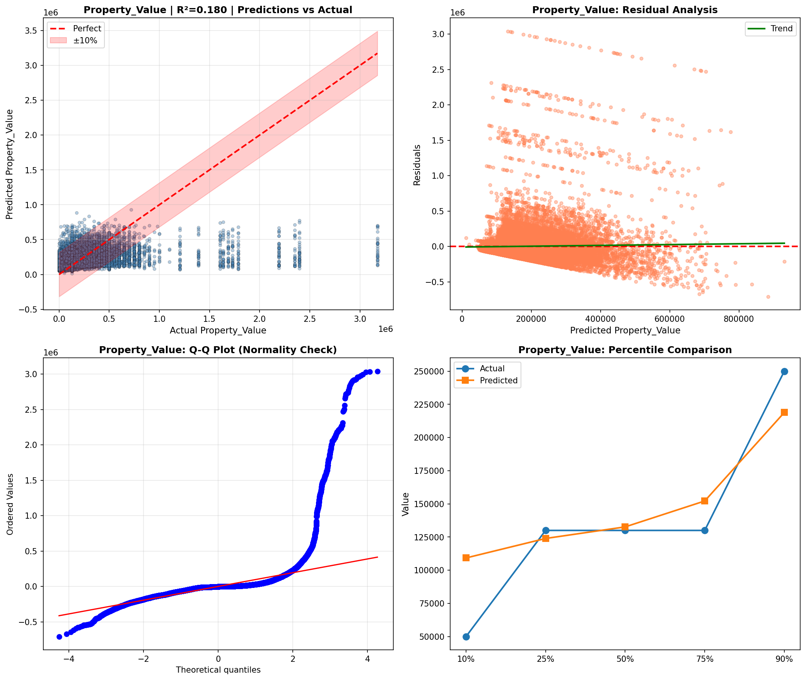

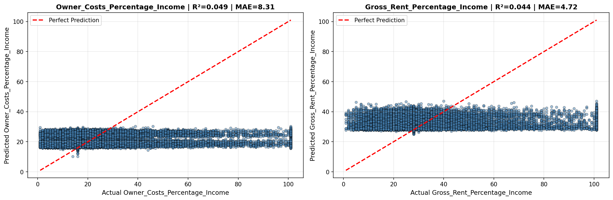

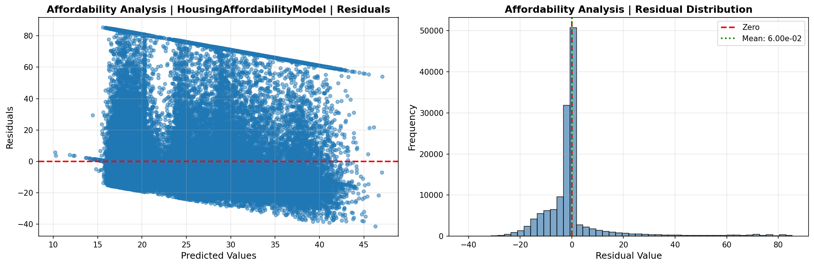

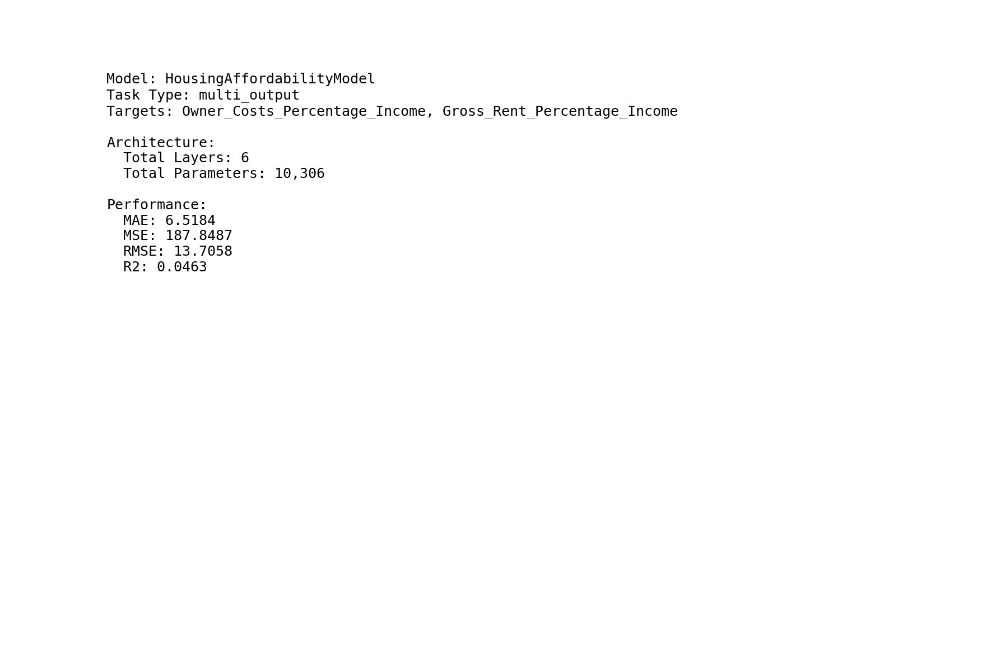

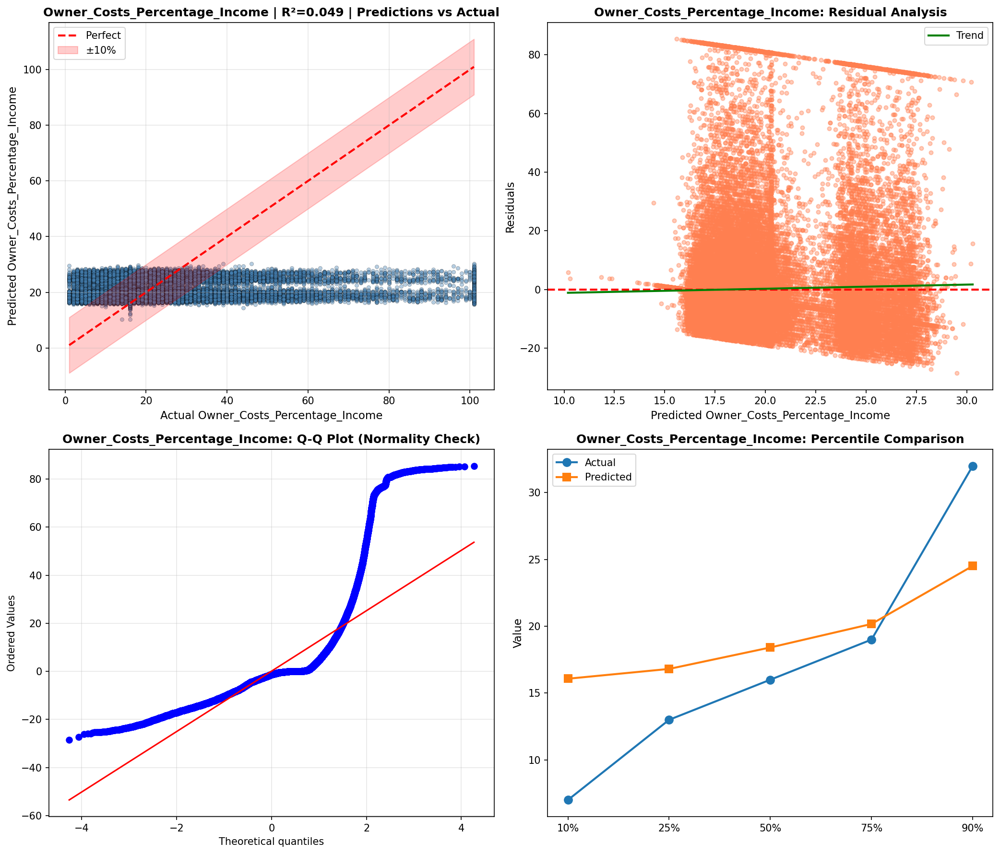

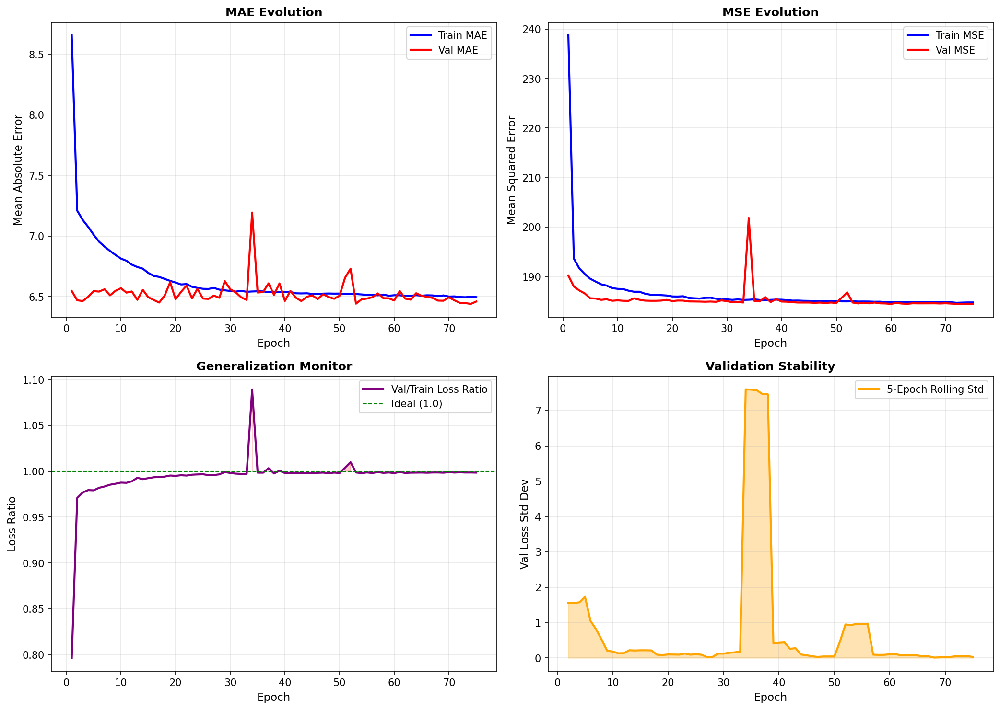

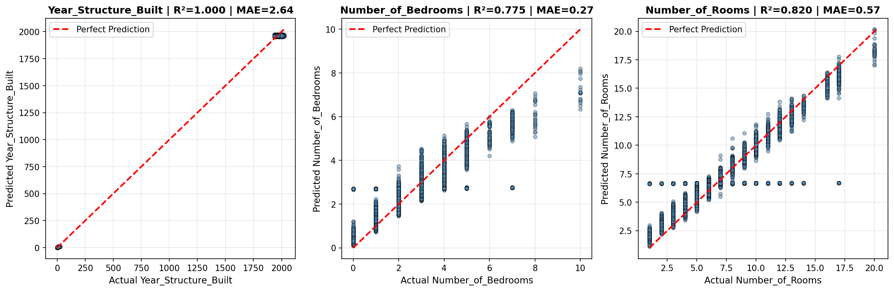

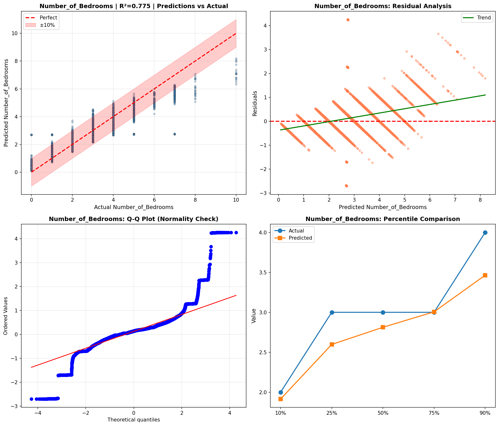

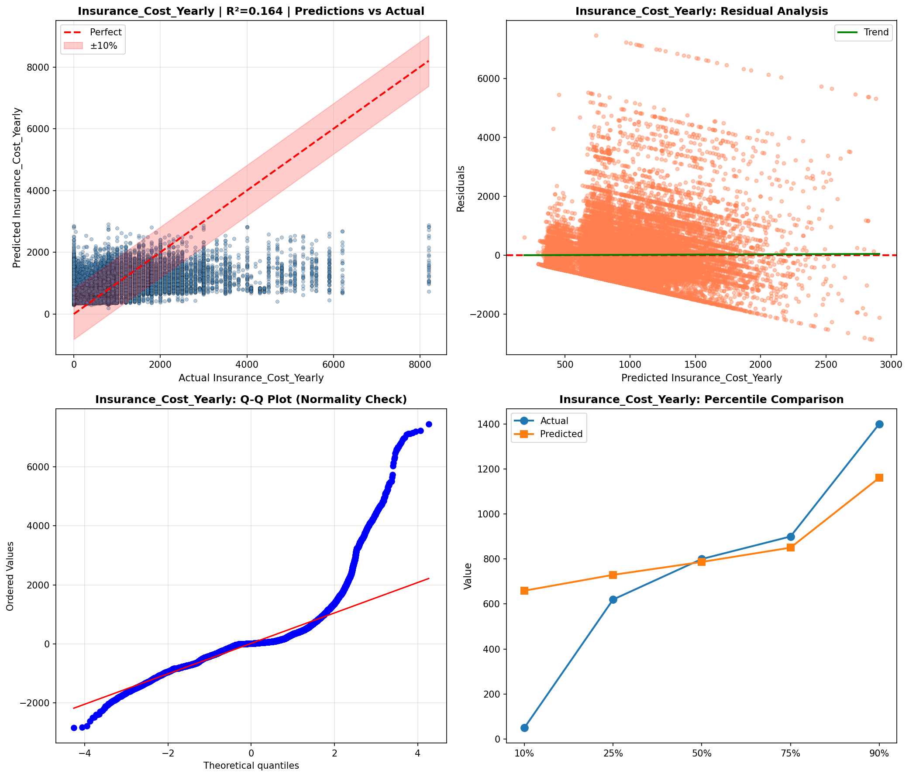

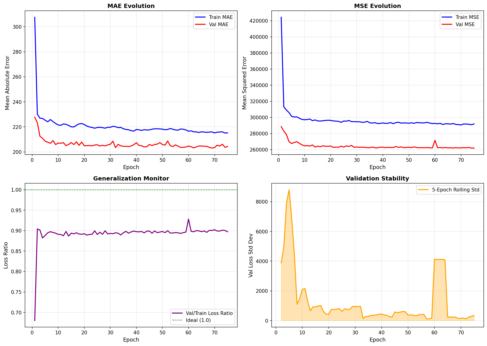

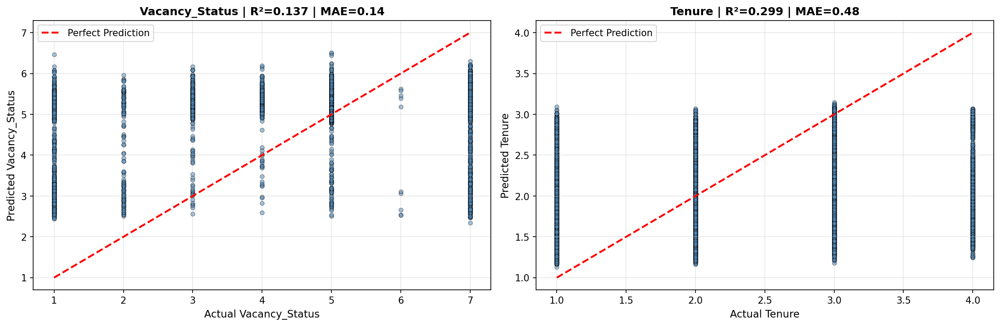

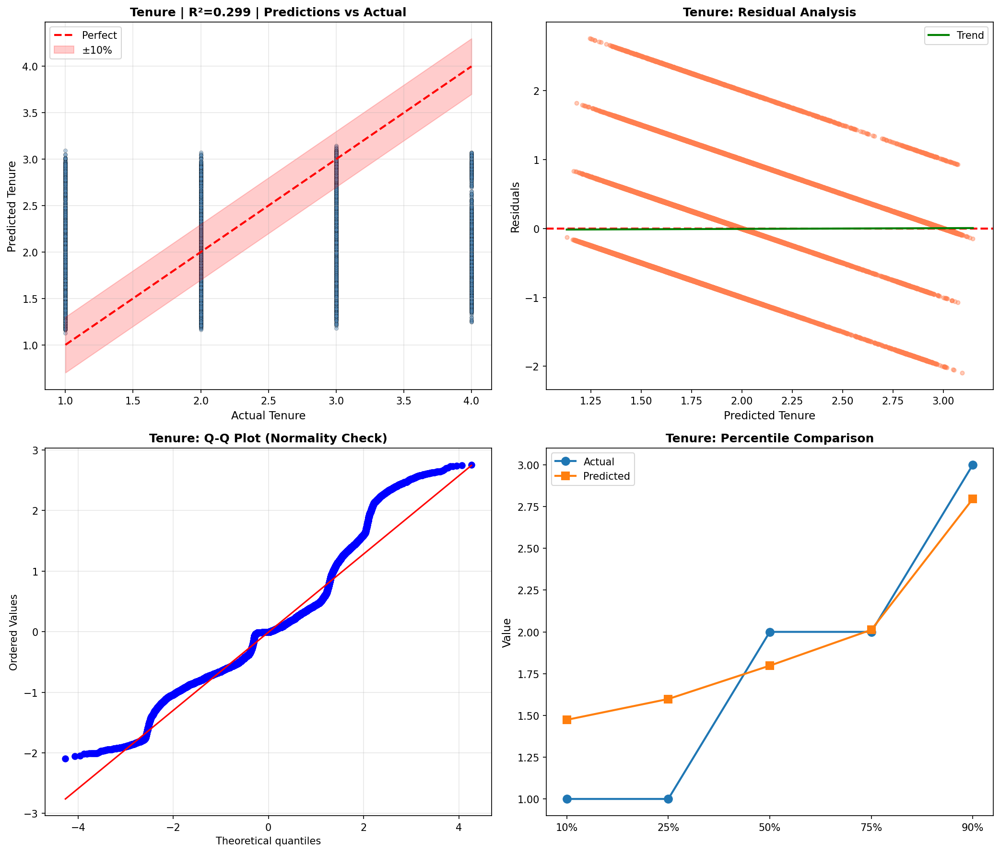

