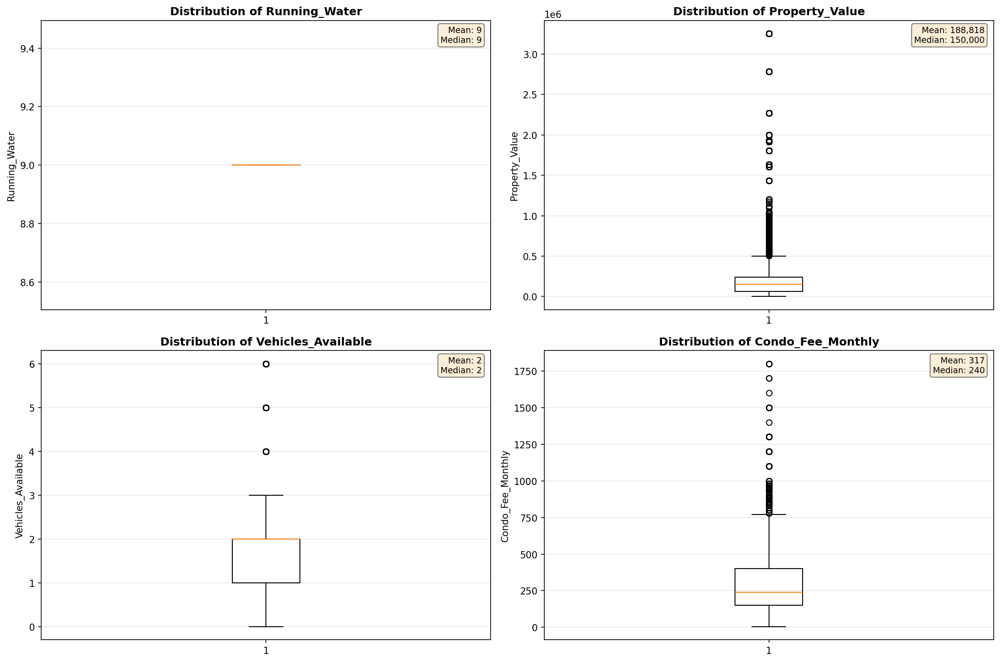
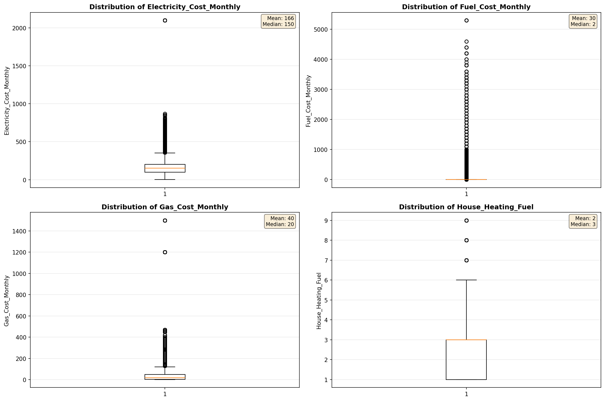
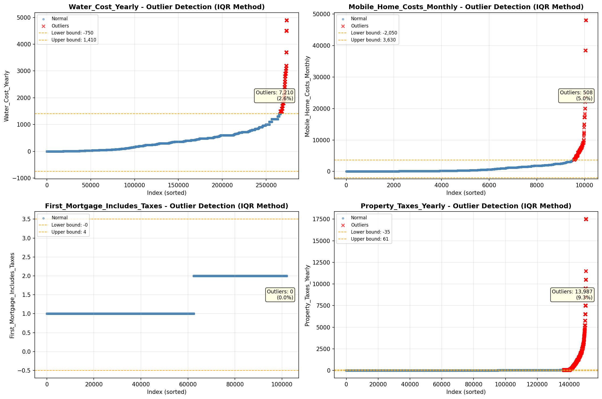

# Outlier Detection

> Statistical outlier detection using IQR (Interquartile Range) method. Outliers are values falling outside Q1 - 1.5×IQR or Q3 + 1.5×IQR bounds.

## Detection Methodology

| Parameter | Value | Description |
| :--- | :--- | :--- |
| Method | IQR | Outlier detection algorithm |
| Lower Bound | Q1 - 1.5 × IQR | Values below are outliers |
| Upper Bound | Q3 + 1.5 × IQR | Values above are outliers |
| IQR Definition | Q3 - Q1 | Interquartile Range |

> **Note**: The IQR method is robust to extreme values and works well for approximately symmetric distributions.

## Outlier Summary

_No outlier summary available._
## High Outlier Rate Variables

> Variables with outlier rate > 5% may indicate data quality issues, non-normal distributions, or genuinely extreme values.

- **('Flag_Selected_Monthly_Owner_Costs', 23.204614058821544)**: 0 outliers (0.00%)

- **('Property_Tax_Rate', 23.181607247341766)**: 0 outliers (0.00%)

- **('Flag_Family_Income', 21.780507147650326)**: 0 outliers (0.00%)

- **('Flag_Property_Taxes', 10.39542361127241)**: 0 outliers (0.00%)

- **('Flag_Property_Value', 9.660501576143051)**: 0 outliers (0.00%)

- **('Structure_Age', 9.4733315273956)**: 0 outliers (0.00%)

- **('Income_Adjustment_Factor', 9.351276466254523)**: 0 outliers (0.00%)

- **('Property_Taxes_Yearly', 9.287331593660152)**: 0 outliers (0.00%)

- **('Owner_Costs_Percentage_Income', 7.996685413367198)**: 0 outliers (0.00%)

- **('Working_Age_Persons', 7.975432416565055)**: 0 outliers (0.00%)

- **('Structure_Age_Score', 7.574245426937938)**: 0 outliers (0.00%)

- **('Flag_Water_Cost', 7.284705882352942)**: 0 outliers (0.00%)

- **('Flag_Gross_Rent', 6.84966457988475)**: 0 outliers (0.00%)

- **('Fuel_Cost_Monthly', 6.340387163070909)**: 0 outliers (0.00%)

- **('Gas_Cost_Monthly', 6.0012400287953)**: 0 outliers (0.00%)

> *Consider investigating these variables for data entry errors, applying transformations, or using robust statistical methods.*

## Visualizations

