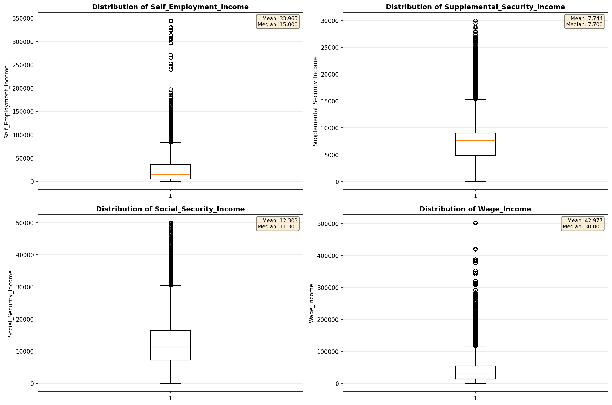
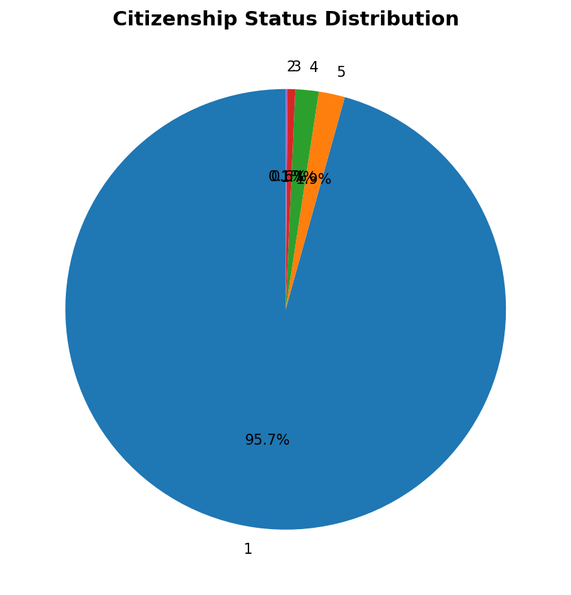
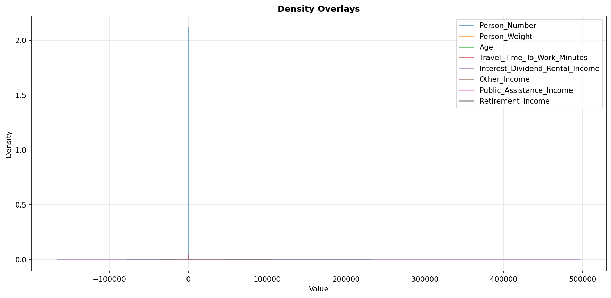
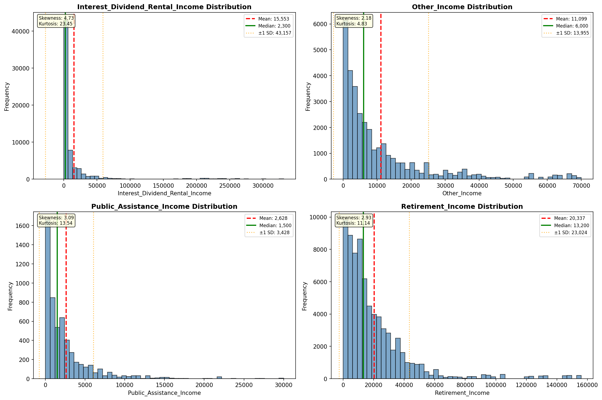
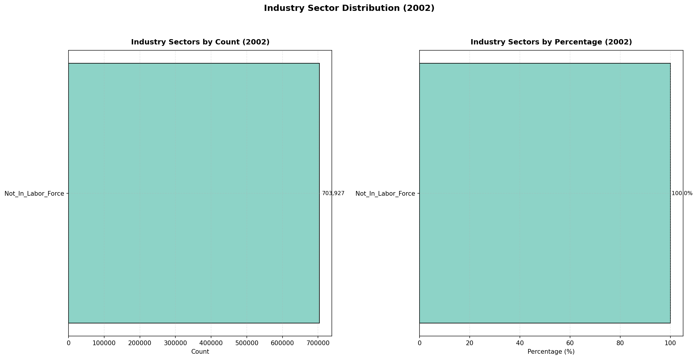
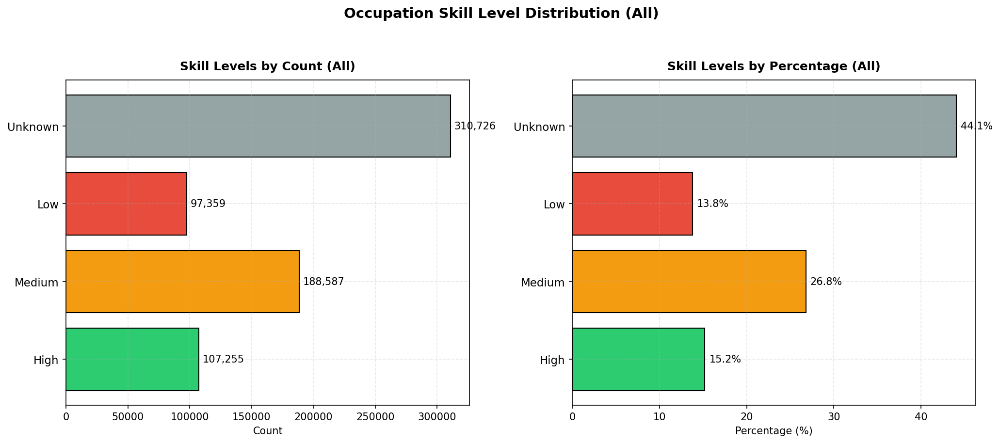
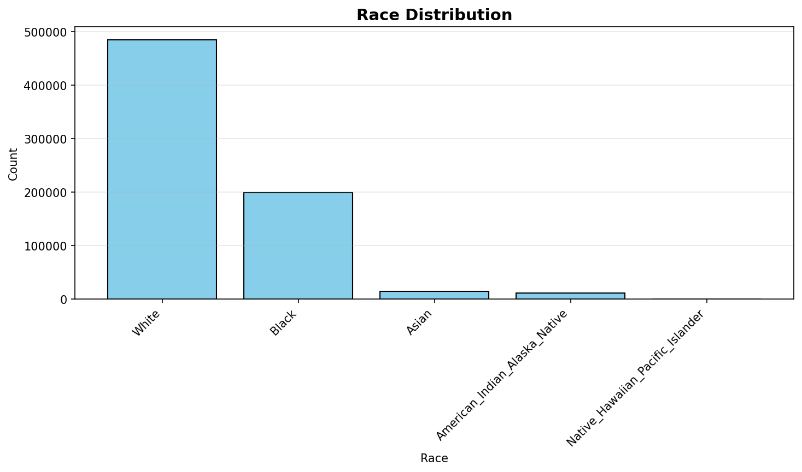
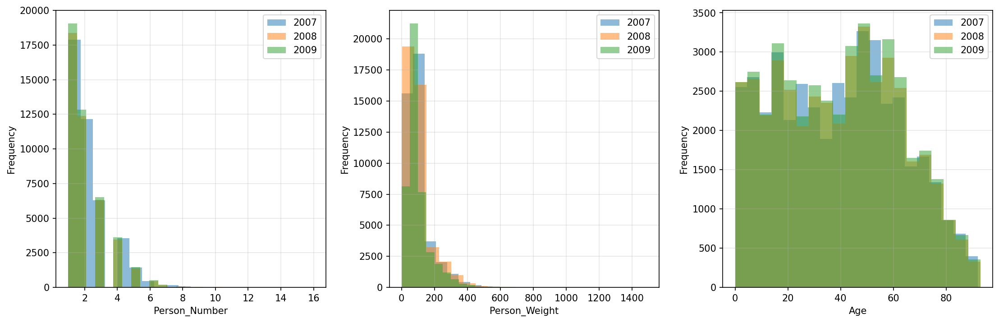
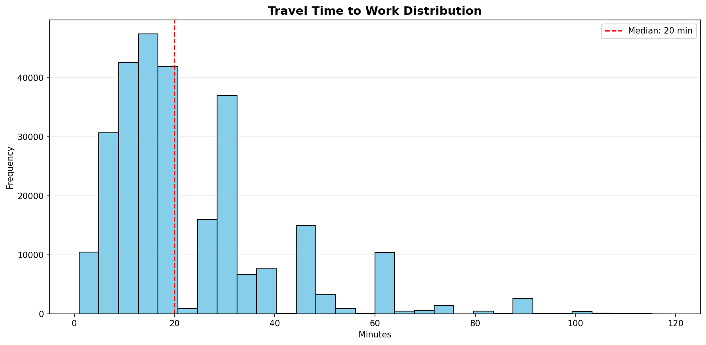
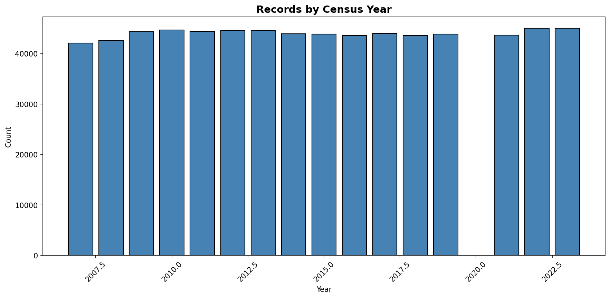

# Statistical Analysis

> Comprehensive descriptive statistics including central tendency, dispersion, distribution characteristics, and weighted statistics using ACS sample weights.

## Summary Statistics

- **Variables Analyzed**: 30

### Income_Adjustment_Factor

| Statistic | Unweighted | Weighted (ACS) |
| :--- | :--- | :--- |
| Mean | 1,014,878.01 | 1,014,834.00 |
| Median | 1,010,207.00 | 1,014,834.00 |
| Std Deviation | 10,861.24 | — |
| Minimum | 1,001,264.00 | — |
| Maximum | 1,042,311.00 | — |
| Count | 527,944 | — |

> *Distribution is highly right-skewed (skewness: 1.35), light-tailed/platykurtic (kurtosis: 1.04).*

- **Coefficient of Variation**: 1.1 % (low variability)

### Age

| Statistic | Unweighted | Weighted (ACS) |
| :--- | :--- | :--- |
| Mean | 41.20 | 37.51 |
| Median | 42.00 | 36.25 |
| Std Deviation | 23.69 | — |
| Minimum | 0.00 | — |
| Maximum | 93.00 | — |
| Count | 703,927 | — |

> *Distribution is approximately symmetric (skewness: 0.04), light-tailed/platykurtic (kurtosis: -1.04).*

- **Coefficient of Variation**: 57.5 % (high variability)

### Interest_Dividend_Rental_Income

| Statistic | Unweighted | Weighted (ACS) |
| :--- | :--- | :--- |
| Mean | 15,553.08 | 15,267.19 |
| Median | 2,300.00 | 2,381.25 |
| Std Deviation | 43,156.77 | — |
| Minimum | 1.00 | — |
| Maximum | 331,000.00 | — |
| Count | 64,082 | — |

> *Distribution is highly right-skewed (skewness: 4.73), heavy-tailed/leptokurtic (kurtosis: 23.45).*

- **Coefficient of Variation**: 277.5 % (very high variability)

### Other_Income

| Statistic | Unweighted | Weighted (ACS) |
| :--- | :--- | :--- |
| Mean | 11,099.27 | 10,563.27 |
| Median | 6,000.00 | 5,850.00 |
| Std Deviation | 13,955.11 | — |
| Minimum | 4.00 | — |
| Maximum | 70,000.00 | — |
| Count | 33,512 | — |

> *Distribution is highly right-skewed (skewness: 2.18), heavy-tailed/leptokurtic (kurtosis: 4.83).*

- **Coefficient of Variation**: 125.7 % (very high variability)

### Public_Assistance_Income

| Statistic | Unweighted | Weighted (ACS) |
| :--- | :--- | :--- |
| Mean | 2,627.80 | 2,640.29 |
| Median | 1,500.00 | 1,611.88 |
| Std Deviation | 3,428.33 | — |
| Minimum | 4.00 | — |
| Maximum | 30,000.00 | — |
| Count | 5,529 | — |

> *Distribution is highly right-skewed (skewness: 3.09), heavy-tailed/leptokurtic (kurtosis: 13.53).*

- **Coefficient of Variation**: 130.5 % (very high variability)

### Retirement_Income

| Statistic | Unweighted | Weighted (ACS) |
| :--- | :--- | :--- |
| Mean | 20,337.06 | 19,533.27 |
| Median | 13,200.00 | 13,118.75 |
| Std Deviation | 23,023.95 | — |
| Minimum | 4.00 | — |
| Maximum | 156,000.00 | — |
| Count | 73,392 | — |

> *Distribution is highly right-skewed (skewness: 2.93), heavy-tailed/leptokurtic (kurtosis: 11.14).*

- **Coefficient of Variation**: 113.2 % (very high variability)

### Self_Employment_Income

| Statistic | Unweighted | Weighted (ACS) |
| :--- | :--- | :--- |
| Mean | 33,965.44 | 34,074.11 |
| Median | 15,000.00 | 15,975.00 |
| Std Deviation | 57,761.47 | — |
| Minimum | 1.00 | — |
| Maximum | 345,000.00 | — |
| Count | 29,572 | — |

> *Distribution is highly right-skewed (skewness: 3.54), heavy-tailed/leptokurtic (kurtosis: 13.57).*

- **Coefficient of Variation**: 170.1 % (very high variability)

### Supplemental_Security_Income

| Statistic | Unweighted | Weighted (ACS) |
| :--- | :--- | :--- |
| Mean | 7,743.77 | 7,732.30 |
| Median | 7,700.00 | 8,031.25 |
| Std Deviation | 4,458.10 | — |
| Minimum | 20.00 | — |
| Maximum | 30,000.00 | — |
| Count | 25,131 | — |

> *Distribution is highly right-skewed (skewness: 1.55), heavy-tailed/leptokurtic (kurtosis: 3.95).*

- **Coefficient of Variation**: 57.6 % (high variability)

### Social_Security_Income

| Statistic | Unweighted | Weighted (ACS) |
| :--- | :--- | :--- |
| Mean | 12,302.75 | 12,166.51 |
| Median | 11,300.00 | 11,237.50 |
| Std Deviation | 7,406.80 | — |
| Minimum | 4.00 | — |
| Maximum | 50,000.00 | — |
| Count | 142,474 | — |

> *Distribution is moderately right-skewed (skewness: 0.90), light-tailed/platykurtic (kurtosis: 1.19).*

- **Coefficient of Variation**: 60.2 % (high variability)

### Wage_Income

| Statistic | Unweighted | Weighted (ACS) |
| :--- | :--- | :--- |
| Mean | 42,976.86 | 41,242.51 |
| Median | 30,000.00 | 30,081.25 |
| Std Deviation | 49,913.47 | — |
| Minimum | 4.00 | — |
| Maximum | 503,000.00 | — |
| Count | 317,831 | — |

> *Distribution is highly right-skewed (skewness: 3.93), heavy-tailed/leptokurtic (kurtosis: 22.71).*

- **Coefficient of Variation**: 116.1 % (very high variability)

### Hours_Worked_Per_Week

| Statistic | Unweighted | Weighted (ACS) |
| :--- | :--- | :--- |
| Mean | 39.41 | 39.53 |
| Median | 40.00 | 40.00 |
| Std Deviation | 14.04 | — |
| Minimum | 1.00 | — |
| Maximum | 99.00 | — |
| Count | 337,803 | — |

> *Distribution is approximately symmetric (skewness: 0.41), light-tailed/platykurtic (kurtosis: 2.52).*

- **Coefficient of Variation**: 35.6 % (moderate variability)

### Presence_And_Age_Own_Children

| Statistic | Unweighted | Weighted (ACS) |
| :--- | :--- | :--- |
| Mean | 3.51 | 3.45 |
| Median | 4.00 | 4.00 |
| Std Deviation | 0.93 | — |
| Minimum | 1.00 | — |
| Maximum | 4.00 | — |
| Count | 291,159 | — |

> *Distribution is highly left-skewed (skewness: -1.61), light-tailed/platykurtic (kurtosis: 1.06).*

- **Coefficient of Variation**: 26.4 % (moderate variability)

### Total_Person_Earnings

| Statistic | Unweighted | Weighted (ACS) |
| :--- | :--- | :--- |
| Mean | 43,451.39 | 41,681.73 |
| Median | 30,000.00 | 29,631.25 |
| Std Deviation | 52,614.53 | — |
| Minimum | 1.00 | — |
| Maximum | 848,000.00 | — |
| Count | 337,363 | — |

> *Distribution is highly right-skewed (skewness: 4.16), heavy-tailed/leptokurtic (kurtosis: 25.98).*

- **Coefficient of Variation**: 121.1 % (very high variability)

### Total_Person_Income

| Statistic | Unweighted | Weighted (ACS) |
| :--- | :--- | :--- |
| Mean | 39,013.24 | 37,865.11 |
| Median | 25,000.00 | 24,537.50 |
| Std Deviation | 51,193.83 | — |
| Minimum | 1.00 | — |
| Maximum | 1,216,500.00 | — |
| Count | 499,226 | — |

> *Distribution is highly right-skewed (skewness: 4.66), heavy-tailed/leptokurtic (kurtosis: 34.32).*

- **Coefficient of Variation**: 131.2 % (very high variability)

### Poverty_Status

| Statistic | Unweighted | Weighted (ACS) |
| :--- | :--- | :--- |
| Mean | 287.72 | 277.65 |
| Median | 280.00 | 263.25 |
| Std Deviation | 167.97 | — |
| Minimum | 0.00 | — |
| Maximum | 501.00 | — |
| Count | 675,569 | — |

> *Distribution is approximately symmetric (skewness: -0.05), light-tailed/platykurtic (kurtosis: -1.40).*

- **Coefficient of Variation**: 58.4 % (high variability)

### Flag_Age

| Statistic | Unweighted | Weighted (ACS) |
| :--- | :--- | :--- |
| Mean | 0.01 | 0.02 |
| Median | 0.00 | 0.00 |
| Std Deviation | 0.11 | — |
| Minimum | 0.00 | — |
| Maximum | 1.00 | — |
| Count | 703,927 | — |

> *Distribution is highly right-skewed (skewness: 8.70), heavy-tailed/leptokurtic (kurtosis: 73.70).*

- **Coefficient of Variation**: 881.4 % (very high variability)

### Flag_Interest_Dividend_Income

| Statistic | Unweighted | Weighted (ACS) |
| :--- | :--- | :--- |
| Mean | 0.12 | 0.11 |
| Median | 0.00 | 0.00 |
| Std Deviation | 0.33 | — |
| Minimum | 0.00 | — |
| Maximum | 1.00 | — |
| Count | 703,927 | — |

> *Distribution is highly right-skewed (skewness: 2.33), heavy-tailed/leptokurtic (kurtosis: 3.44).*

- **Coefficient of Variation**: 270.2 % (very high variability)

### Flag_Other_Income

| Statistic | Unweighted | Weighted (ACS) |
| :--- | :--- | :--- |
| Mean | 0.11 | 0.09 |
| Median | 0.00 | 0.00 |
| Std Deviation | 0.31 | — |
| Minimum | 0.00 | — |
| Maximum | 1.00 | — |
| Count | 703,927 | — |

> *Distribution is highly right-skewed (skewness: 2.57), heavy-tailed/leptokurtic (kurtosis: 4.62).*

- **Coefficient of Variation**: 291.6 % (very high variability)

### Flag_Retirement_Income

| Statistic | Unweighted | Weighted (ACS) |
| :--- | :--- | :--- |
| Mean | 0.11 | 0.10 |
| Median | 0.00 | 0.00 |
| Std Deviation | 0.31 | — |
| Minimum | 0.00 | — |
| Maximum | 1.00 | — |
| Count | 703,927 | — |

> *Distribution is highly right-skewed (skewness: 2.49), heavy-tailed/leptokurtic (kurtosis: 4.20).*

- **Coefficient of Variation**: 284.2 % (very high variability)

### Flag_Self_Employment_Income

| Statistic | Unweighted | Weighted (ACS) |
| :--- | :--- | :--- |
| Mean | 0.09 | 0.08 |
| Median | 0.00 | 0.00 |
| Std Deviation | 0.28 | — |
| Minimum | 0.00 | — |
| Maximum | 1.00 | — |
| Count | 703,927 | — |

> *Distribution is highly right-skewed (skewness: 2.97), heavy-tailed/leptokurtic (kurtosis: 6.79).*

- **Coefficient of Variation**: 327.1 % (very high variability)

### Flag_Social_Security_Income

| Statistic | Unweighted | Weighted (ACS) |
| :--- | :--- | :--- |
| Mean | 0.12 | 0.11 |
| Median | 0.00 | 0.00 |
| Std Deviation | 0.33 | — |
| Minimum | 0.00 | — |
| Maximum | 1.00 | — |
| Count | 703,927 | — |

> *Distribution is highly right-skewed (skewness: 2.34), heavy-tailed/leptokurtic (kurtosis: 3.46).*

- **Coefficient of Variation**: 270.6 % (very high variability)

### Flag_Supplemental_Security_Income

| Statistic | Unweighted | Weighted (ACS) |
| :--- | :--- | :--- |
| Mean | 0.10 | 0.09 |
| Median | 0.00 | 0.00 |
| Std Deviation | 0.30 | — |
| Minimum | 0.00 | — |
| Maximum | 1.00 | — |
| Count | 703,927 | — |

> *Distribution is highly right-skewed (skewness: 2.63), heavy-tailed/leptokurtic (kurtosis: 4.92).*

- **Coefficient of Variation**: 296.8 % (very high variability)

### Flag_Wage_Income

| Statistic | Unweighted | Weighted (ACS) |
| :--- | :--- | :--- |
| Mean | 0.15 | 0.16 |
| Median | 0.00 | 0.00 |
| Std Deviation | 0.36 | — |
| Minimum | 0.00 | — |
| Maximum | 1.00 | — |
| Count | 703,927 | — |

> *Distribution is highly right-skewed (skewness: 1.92), light-tailed/platykurtic (kurtosis: 1.69).*

- **Coefficient of Variation**: 234.7 % (very high variability)

### Flag_Hours_Worked

| Statistic | Unweighted | Weighted (ACS) |
| :--- | :--- | :--- |
| Mean | 0.06 | 0.06 |
| Median | 0.00 | 0.00 |
| Std Deviation | 0.23 | — |
| Minimum | 0.00 | — |
| Maximum | 1.00 | — |
| Count | 703,927 | — |

> *Distribution is highly right-skewed (skewness: 3.79), heavy-tailed/leptokurtic (kurtosis: 12.39).*

- **Coefficient of Variation**: 404.0 % (very high variability)

### Income_Per_Hour

| Statistic | Unweighted | Weighted (ACS) |
| :--- | :--- | :--- |
| Mean | 24.50 | 22.65 |
| Median | 16.24 | 15.39 |
| Std Deviation | 57.98 | — |
| Minimum | 0.00 | — |
| Maximum | 11,697.12 | — |
| Count | 337,579 | — |

> *Distribution is highly right-skewed (skewness: 62.41), heavy-tailed/leptokurtic (kurtosis: 8269.77).*

- **Coefficient of Variation**: 236.6 % (very high variability)

### Income_Per_Week_Worked

| Statistic | Unweighted | Weighted (ACS) |
| :--- | :--- | :--- |
| Mean | 34,473.93 | 32,853.14 |
| Median | 20,800.00 | 22,524.41 |
| Std Deviation | 49,914.35 | — |
| Minimum | 0.02 | — |
| Maximum | 989,000.00 | — |
| Count | 275,628 | — |

> *Distribution is highly right-skewed (skewness: 4.30), heavy-tailed/leptokurtic (kurtosis: 29.70).*

- **Coefficient of Variation**: 144.8 % (very high variability)

### Total_Annual_Hours

| Statistic | Unweighted | Weighted (ACS) |
| :--- | :--- | :--- |
| Mean | 336.28 | 339.71 |
| Median | 45.00 | 353.85 |
| Std Deviation | 720.94 | — |
| Minimum | 1.00 | — |
| Maximum | 5,148.00 | — |
| Count | 275,808 | — |

> *Distribution is highly right-skewed (skewness: 2.66), heavy-tailed/leptokurtic (kurtosis: 6.49).*

- **Coefficient of Variation**: 214.4 % (very high variability)

### In_Poverty

| Statistic | Unweighted | Weighted (ACS) |
| :--- | :--- | :--- |
| Mean | 0.35 | 0.35 |
| Median | 0.00 | 0.00 |
| Std Deviation | 0.48 | — |
| Minimum | 0.00 | — |
| Maximum | 1.00 | — |
| Count | 703,927 | — |

> *Distribution is moderately right-skewed (skewness: 0.61), light-tailed/platykurtic (kurtosis: -1.63).*

- **Coefficient of Variation**: 135.0 % (very high variability)

### Poverty_Gap

| Statistic | Unweighted | Weighted (ACS) |
| :--- | :--- | :--- |
| Mean | 0.28 | 0.29 |
| Median | 0.00 | 0.00 |
| Std Deviation | 0.39 | — |
| Minimum | 0.00 | — |
| Maximum | 2.33 | — |
| Count | 582,622 | — |

> *Distribution is moderately right-skewed (skewness: 0.96), light-tailed/platykurtic (kurtosis: -0.78).*

- **Coefficient of Variation**: 138.7 % (very high variability)

### Poverty_Severity

| Statistic | Unweighted | Weighted (ACS) |
| :--- | :--- | :--- |
| Mean | 0.23 | 0.24 |
| Median | 0.00 | 0.00 |
| Std Deviation | 0.38 | — |
| Minimum | 0.00 | — |
| Maximum | 5.44 | — |
| Count | 582,622 | — |

> *Distribution is highly right-skewed (skewness: 1.34), light-tailed/platykurtic (kurtosis: 0.26).*

- **Coefficient of Variation**: 161.9 % (very high variability)

## Distribution Analysis

### Skewed Distributions

> Variables with skewness > |0.5| indicate non-normal distributions. Consider log transformations for highly skewed variables in modeling.

| Variable | Skewness | Direction | Severity |
| :--- | :--- | :--- | :--- |
| Income_Per_Hour | 62.409 | Right-skewed | High |
| Flag_Age | 8.701 | Right-skewed | High |
| Interest_Dividend_Rental_Income | 4.732 | Right-skewed | High |
| Total_Person_Income | 4.665 | Right-skewed | High |
| Income_Per_Week_Worked | 4.301 | Right-skewed | High |
| Total_Person_Earnings | 4.156 | Right-skewed | High |
| Wage_Income | 3.934 | Right-skewed | High |
| Flag_Hours_Worked | 3.793 | Right-skewed | High |
| Self_Employment_Income | 3.542 | Right-skewed | High |
| Public_Assistance_Income | 3.091 | Right-skewed | High |
| Flag_Self_Employment_Income | 2.966 | Right-skewed | High |
| Retirement_Income | 2.926 | Right-skewed | High |
| Total_Annual_Hours | 2.657 | Right-skewed | High |
| Flag_Supplemental_Security_Income | 2.631 | Right-skewed | High |
| Flag_Other_Income | 2.573 | Right-skewed | High |
| Flag_Retirement_Income | 2.490 | Right-skewed | High |
| Flag_Social_Security_Income | 2.337 | Right-skewed | High |
| Flag_Interest_Dividend_Income | 2.332 | Right-skewed | High |
| Other_Income | 2.177 | Right-skewed | High |
| Flag_Wage_Income | 1.921 | Right-skewed | High |

- **Total Skewed Variables**: 27

- **Right-skewed**: 26

- **Left-skewed**: 1

## Variance Analysis

### Coefficient of Variation Ranking

> CV (Coefficient of Variation) = (Std Dev / Mean) × 100%. Higher CV indicates greater relative variability.

| Variable | CV (%) | Std Dev | Mean | Variability |
| :--- | :--- | :--- | :--- | :--- |
| Flag_Age | 881.4% | 0.11 | 0.01 | Very High |
| Flag_Hours_Worked | 404.0% | 0.23 | 0.06 | Very High |
| Flag_Self_Employment_Income | 327.1% | 0.28 | 0.09 | Very High |
| Flag_Supplemental_Security_Income | 296.8% | 0.30 | 0.10 | Very High |
| Flag_Other_Income | 291.6% | 0.31 | 0.11 | Very High |
| Flag_Retirement_Income | 284.2% | 0.31 | 0.11 | Very High |
| Interest_Dividend_Rental_Income | 277.5% | 43,156.77 | 15,553.08 | Very High |
| Flag_Social_Security_Income | 270.6% | 0.33 | 0.12 | Very High |
| Flag_Interest_Dividend_Income | 270.2% | 0.33 | 0.12 | Very High |
| Income_Per_Hour | 236.6% | 57.98 | 24.50 | Very High |
| Flag_Wage_Income | 234.7% | 0.36 | 0.15 | Very High |
| Total_Annual_Hours | 214.4% | 720.94 | 336.28 | Very High |
| Self_Employment_Income | 170.1% | 57,761.47 | 33,965.44 | Very High |
| Poverty_Severity | 161.9% | 0.38 | 0.23 | Very High |
| Income_Per_Week_Worked | 144.8% | 49,914.35 | 34,473.93 | Very High |
| Poverty_Gap | 138.7% | 0.39 | 0.28 | Very High |
| In_Poverty | 135.0% | 0.48 | 0.35 | Very High |
| Total_Person_Income | 131.2% | 51,193.83 | 39,013.24 | Very High |
| Public_Assistance_Income | 130.5% | 3,428.33 | 2,627.80 | Very High |
| Other_Income | 125.7% | 13,955.11 | 11,099.27 | Very High |

- **Average CV**: 192.5 %

- **High Variance Variables (CV > 50%)**: 27

## Visualizations

