# Deep Learning Models

> Neural network analysis using TensorFlow/Keras for complex pattern recognition and multi-output prediction tasks.

## Deep Learning Summary

- **Total Tasks**: 5

- **Tasks**: Property Valuation, Affordability Analysis, Housing Quality, Cost Prediction, Occupancy Prediction

### Aggregate Statistics

| Metric | Value |
| :--- | :--- |
| Total Parameters | 78,283 |
| Average Validation Loss | 2904153989.6523 |
| Number of Tasks | 5 |

## Task: Property Valuation

### Model Configuration

| Property | Value |
| :--- | :--- |
| Model Type | HousingValuationModel |
| Task Type | Multi_Output |
| Target Variables | Property_Value, Gross_Rent |
| Number of Targets | 2 |
| Input Features | 10 |

### Network Architecture

| Component | Value | Notes |
| :--- | :--- | :--- |
| Total Layers | 7 | Including input and output |
| Total Parameters | 36,994 | Trainable weights |
| Parameters per Layer | 5,284 | Average |

### Performance Metrics

| Metric | Value | Assessment |
| :--- | :--- | :--- |
| Training Loss | 15618156544.0000 | Final epoch |
| Validation Loss | 14520493056.0000 | Final epoch |
| Loss Gap | -1097663488.0000 | NONE overfitting risk |

> *Good generalization*

#### Test Set Metrics

| Metric | Value | Description |
| :--- | :--- | :--- |
| MAE | 33039.4453 | Mean Absolute Error (lower is better) |
| MSE | 13344413696.0000 | Mean Squared Error (lower is better) |
| RMSE | 115518.0233 | Root Mean Squared Error (lower is better) |
| R2 | -0.2774 | R-squared (higher is better) |

### Training Analysis

| Training Statistic | Value |
| :--- | :--- |
| Epochs Trained | 75 |
| Initial Training Loss | 35389345792.0000 |
| Final Training Loss | 15618156544.0000 |
| Loss Improvement | 55.9% |
| Initial Validation Loss | 33840828416.0000 |
| Final Validation Loss | 14520493056.0000 |
| Validation Improvement | 57.1% |

#### Convergence Assessment

- **Status**: Fully converged (< 1% change in last 10 epochs)

- **Last 10 epochs change**: 0.03%

## Task: Affordability Analysis

### Model Configuration

| Property | Value |
| :--- | :--- |
| Model Type | HousingAffordabilityModel |
| Task Type | Multi_Output |
| Target Variables | Owner_Costs_Percentage_Income, Gross_Rent_Percentage_Income |
| Number of Targets | 2 |
| Input Features | 10 |

### Network Architecture

| Component | Value | Notes |
| :--- | :--- | :--- |
| Total Layers | 6 | Including input and output |
| Total Parameters | 10,306 | Trainable weights |
| Parameters per Layer | 1,717 | Average |

### Performance Metrics

| Metric | Value | Assessment |
| :--- | :--- | :--- |
| Training Loss | 159.2643 | Final epoch |
| Validation Loss | 158.6299 | Final epoch |
| Loss Gap | -0.6343 | NONE overfitting risk |

> *Good generalization*

#### Test Set Metrics

| Metric | Value | Description |
| :--- | :--- | :--- |
| MAE | 5.5021 | Mean Absolute Error (lower is better) |
| MSE | 160.1762 | Mean Squared Error (lower is better) |
| RMSE | 12.6561 | Root Mean Squared Error (lower is better) |
| R2 | 0.0701 | R-squared (higher is better) |

### Training Analysis

| Training Statistic | Value |
| :--- | :--- |
| Epochs Trained | 75 |
| Initial Training Loss | 304.8125 |
| Final Training Loss | 159.2643 |
| Loss Improvement | 47.8% |
| Initial Validation Loss | 176.4764 |
| Final Validation Loss | 158.6299 |
| Validation Improvement | 10.1% |

#### Convergence Assessment

- **Status**: Fully converged (< 1% change in last 10 epochs)

- **Last 10 epochs change**: 0.20%

## Task: Housing Quality

### Model Configuration

| Property | Value |
| :--- | :--- |
| Model Type | HousingQualityModel |
| Task Type | Multi_Output |
| Target Variables | Year_Structure_Built, Number_of_Bedrooms, Number_of_Rooms |
| Number of Targets | 3 |
| Input Features | 10 |

### Network Architecture

| Component | Value | Notes |
| :--- | :--- | :--- |
| Total Layers | 6 | Including input and output |
| Total Parameters | 10,371 | Trainable weights |
| Parameters per Layer | 1,728 | Average |

### Performance Metrics

| Metric | Value | Assessment |
| :--- | :--- | :--- |
| Training Loss | 284.9974 | Final epoch |
| Validation Loss | 16.9142 | Final epoch |
| Loss Gap | -268.0832 | NONE overfitting risk |

> *Good generalization*

#### Test Set Metrics

| Metric | Value | Description |
| :--- | :--- | :--- |
| MAE | 1.9474 | Mean Absolute Error (lower is better) |
| MSE | 16.9493 | Mean Squared Error (lower is better) |
| RMSE | 4.1170 | Root Mean Squared Error (lower is better) |
| R2 | 0.6457 | R-squared (higher is better) |

### Training Analysis

| Training Statistic | Value |
| :--- | :--- |
| Epochs Trained | 75 |
| Initial Training Loss | 28555.5508 |
| Final Training Loss | 284.9974 |
| Loss Improvement | 99.0% |
| Initial Validation Loss | 21099.1465 |
| Final Validation Loss | 16.9142 |
| Validation Improvement | 99.9% |

#### Convergence Assessment

- **Status**: Still improving (> 5% change)

- **Last 10 epochs change**: 5.20%

## Task: Cost Prediction

### Model Configuration

| Property | Value |
| :--- | :--- |
| Model Type | HousingDefaultModel |
| Task Type | Multi_Output |
| Target Variables | Property_Taxes_Yearly, Insurance_Cost_Yearly |
| Number of Targets | 2 |
| Input Features | 10 |

### Network Architecture

| Component | Value | Notes |
| :--- | :--- | :--- |
| Total Layers | 6 | Including input and output |
| Total Parameters | 10,306 | Trainable weights |
| Parameters per Layer | 1,717 | Average |

### Performance Metrics

| Metric | Value | Assessment |
| :--- | :--- | :--- |
| Training Loss | 311911.3125 | Final epoch |
| Validation Loss | 276716.4375 | Final epoch |
| Loss Gap | -35194.8750 | NONE overfitting risk |

> *Good generalization*

#### Test Set Metrics

| Metric | Value | Description |
| :--- | :--- | :--- |
| MAE | 171.4577 | Mean Absolute Error (lower is better) |
| MSE | 306246.6562 | Mean Squared Error (lower is better) |
| RMSE | 553.3956 | Root Mean Squared Error (lower is better) |
| R2 | 0.2756 | R-squared (higher is better) |

### Training Analysis

| Training Statistic | Value |
| :--- | :--- |
| Epochs Trained | 75 |
| Initial Training Loss | 562636.5625 |
| Final Training Loss | 311911.3125 |
| Loss Improvement | 44.6% |
| Initial Validation Loss | 408918.5000 |
| Final Validation Loss | 276716.4375 |
| Validation Improvement | 32.3% |

#### Convergence Assessment

- **Status**: Fully converged (< 1% change in last 10 epochs)

- **Last 10 epochs change**: 0.87%

## Task: Occupancy Prediction

### Model Configuration

| Property | Value |
| :--- | :--- |
| Model Type | HousingDefaultModel |
| Task Type | Multi_Output |
| Target Variables | Vacancy_Status, Tenure |
| Number of Targets | 2 |
| Input Features | 10 |

### Network Architecture

| Component | Value | Notes |
| :--- | :--- | :--- |
| Total Layers | 6 | Including input and output |
| Total Parameters | 10,306 | Trainable weights |
| Parameters per Layer | 1,717 | Average |

### Performance Metrics

| Metric | Value | Assessment |
| :--- | :--- | :--- |
| Training Loss | 0.2787 | Final epoch |
| Validation Loss | 0.2797 | Final epoch |
| Loss Gap | 0.0009 | NONE overfitting risk |

> *Good generalization*

#### Test Set Metrics

| Metric | Value | Description |
| :--- | :--- | :--- |
| MAE | 0.2632 | Mean Absolute Error (lower is better) |
| MSE | 0.2755 | Mean Squared Error (lower is better) |
| RMSE | 0.5248 | Root Mean Squared Error (lower is better) |
| R2 | 0.1825 | R-squared (higher is better) |

### Training Analysis

| Training Statistic | Value |
| :--- | :--- |
| Epochs Trained | 75 |
| Initial Training Loss | 1.2283 |
| Final Training Loss | 0.2787 |
| Loss Improvement | 77.3% |
| Initial Validation Loss | 0.7704 |
| Final Validation Loss | 0.2797 |
| Validation Improvement | 63.7% |

#### Convergence Assessment

- **Status**: Fully converged (< 1% change in last 10 epochs)

- **Last 10 epochs change**: 0.10%

## Cross-Task Comparison

| Task | Model Type | Parameters | Train Loss | Val Loss | Gap |
| :--- | :--- | :--- | :--- | :--- | :--- |
| Property Valuation | HousingValuationModel | 36,994 | 15618156544.0000 | 14520493056.0000 | -1097663488.0000 |
| Affordability Analysis | HousingAffordabilityModel | 10,306 | 159.2643 | 158.6299 | -0.6343 |
| Housing Quality | HousingQualityModel | 10,371 | 284.9974 | 16.9142 | -268.0832 |
| Cost Prediction | HousingDefaultModel | 10,306 | 311911.3125 | 276716.4375 | -35194.8750 |
| Occupancy Prediction | HousingDefaultModel | 10,306 | 0.2787 | 0.2797 | 0.0009 |

## Visualizations

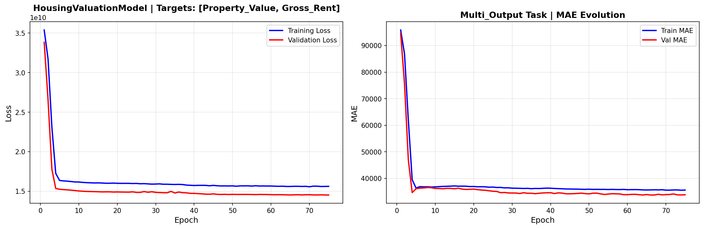

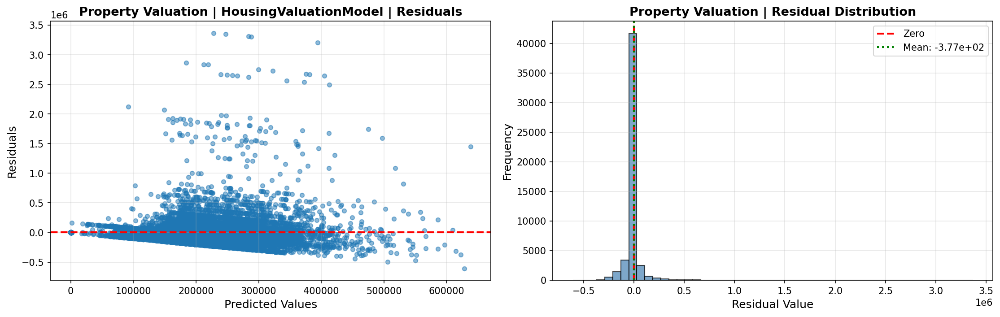

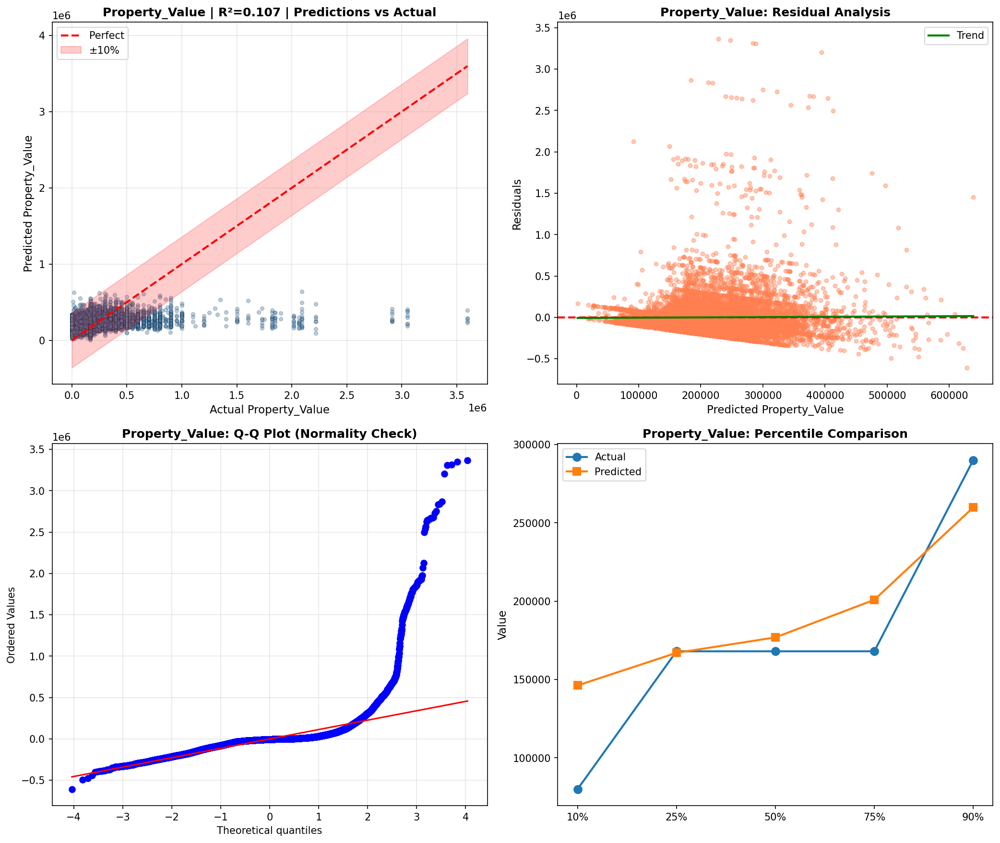

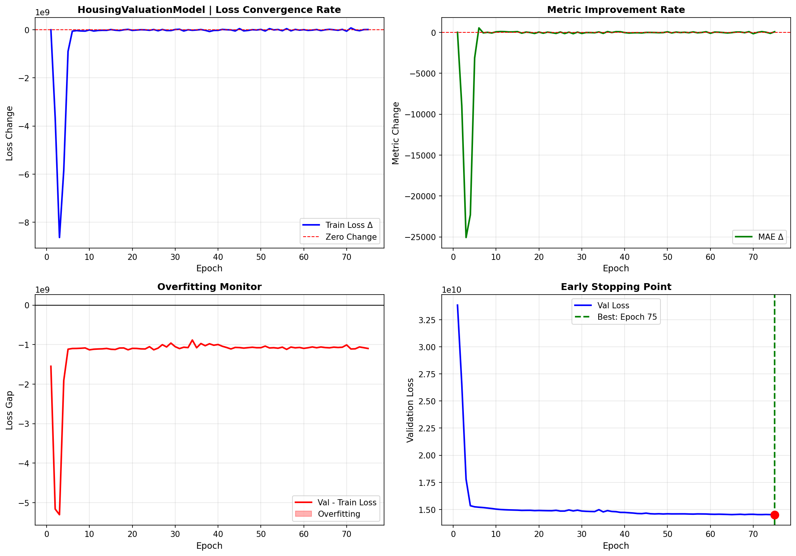

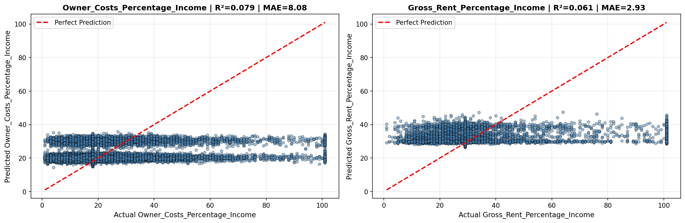

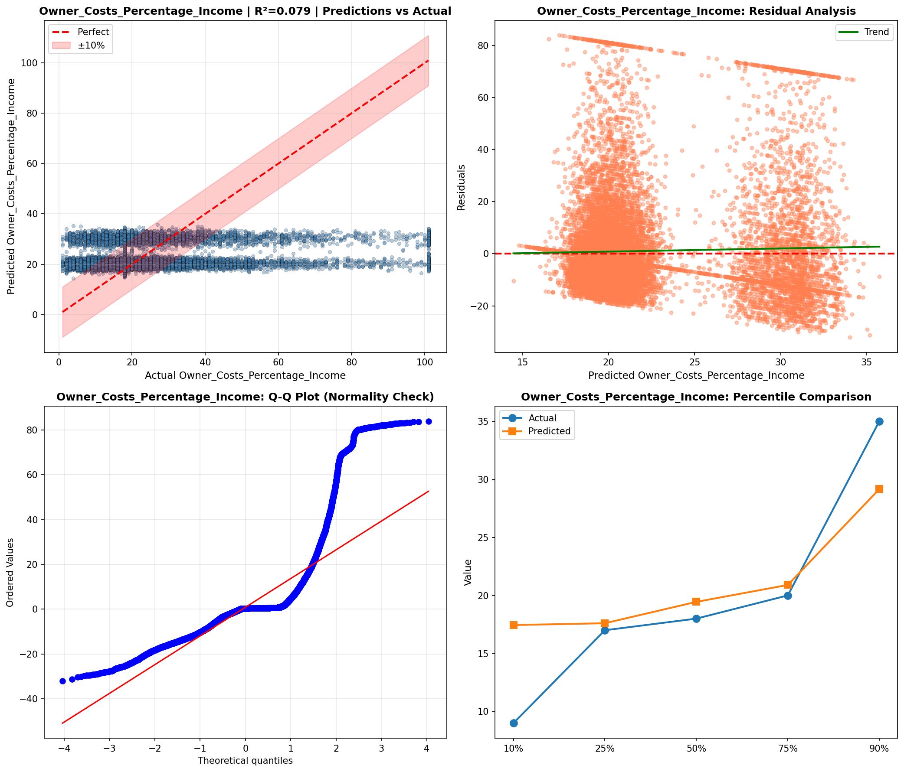

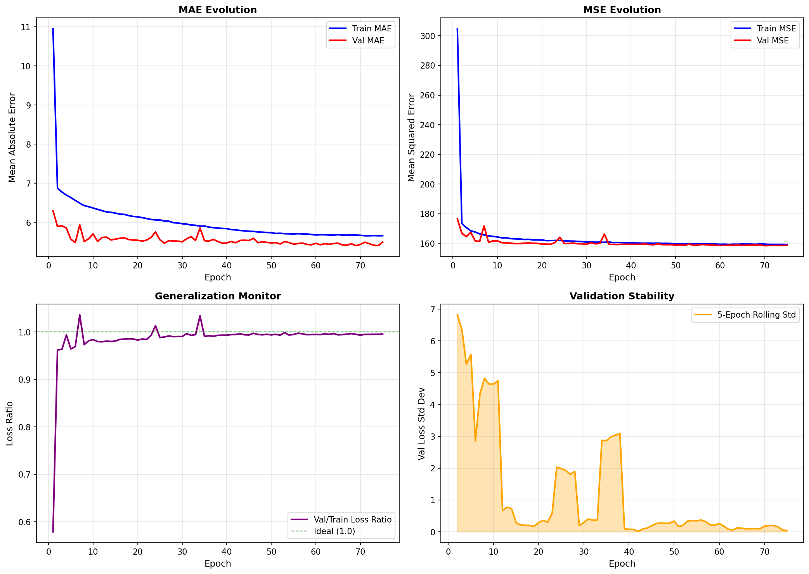

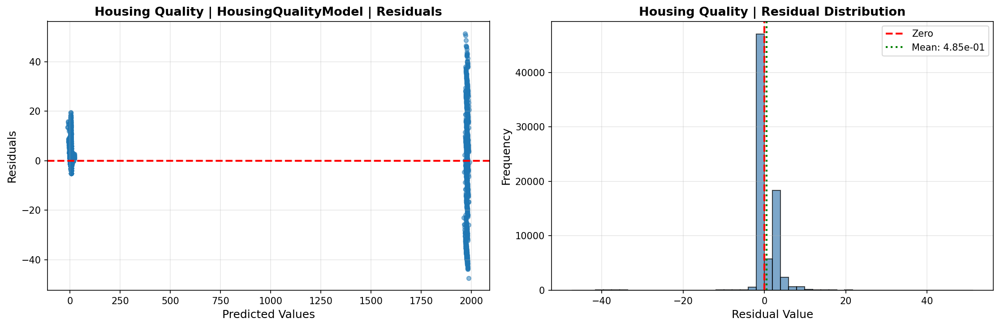

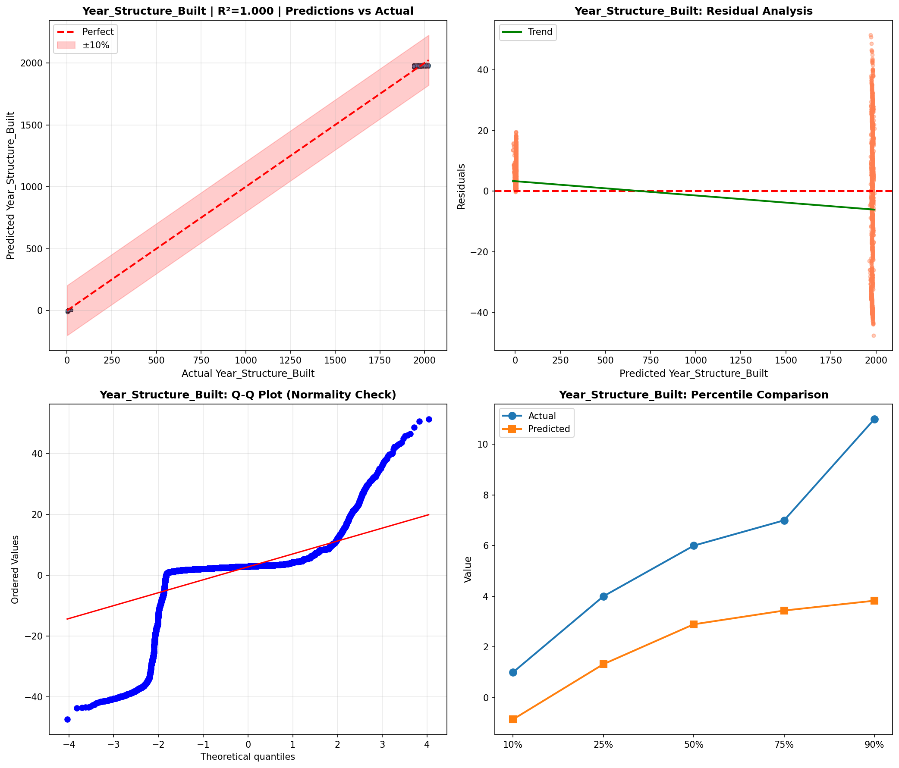

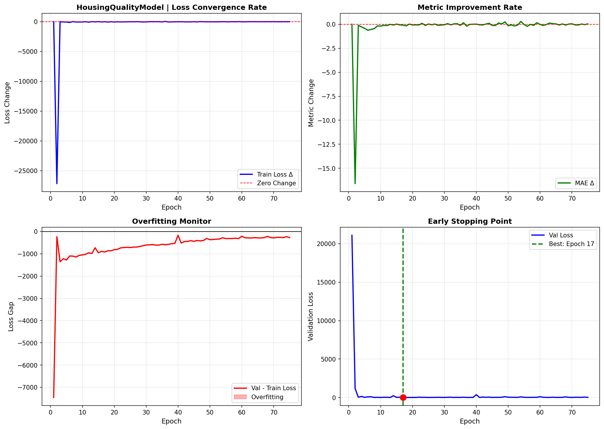

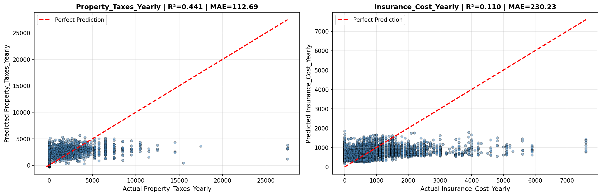

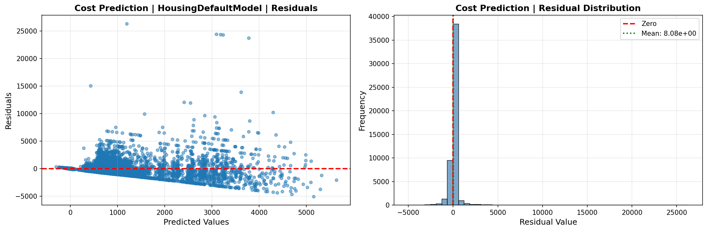

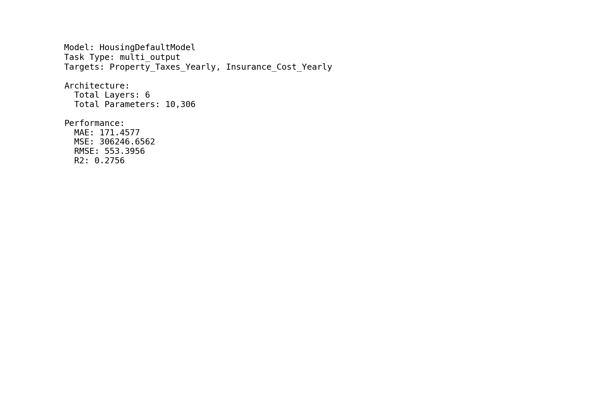

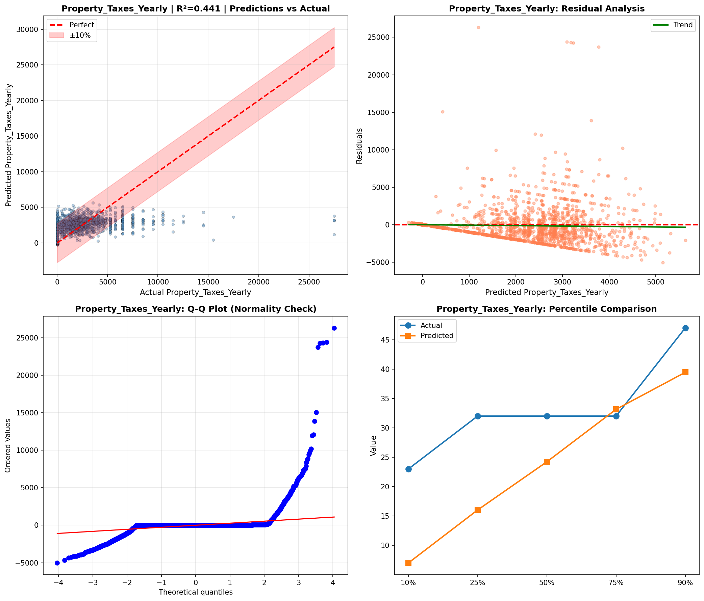

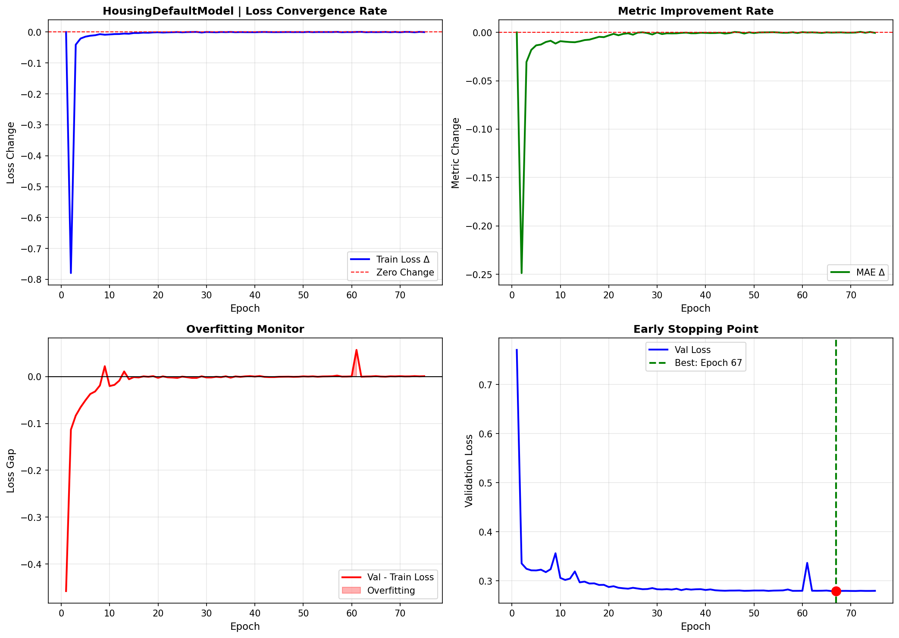

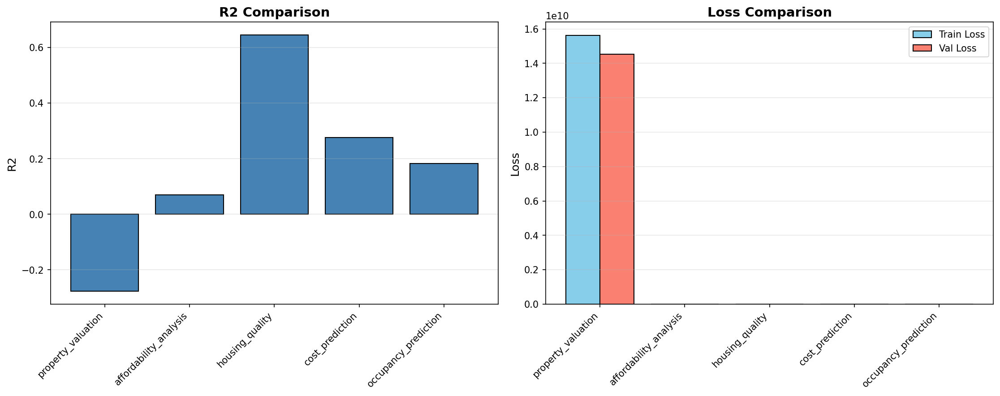

