# Deep Learning Models

> Neural network analysis using TensorFlow/Keras for complex pattern recognition and multi-output prediction tasks.

## Deep Learning Summary

- **Total Tasks**: 3

- **Tasks**: Income Prediction, Employment Analysis, Demographic Profile

### Aggregate Statistics

| Metric | Value |
| :--- | :--- |
| Total Parameters | 57,930 |
| Average Validation Loss | 425732607.0653 |
| Number of Tasks | 3 |

## Task: Income Prediction

### Model Configuration

| Property | Value |
| :--- | :--- |
| Model Type | PopulationIncomeModel |
| Task Type | Multi_Output |
| Target Variables | Total_Person_Income, Wage_Income, Total_Person_Earnings |
| Number of Targets | 3 |
| Input Features | 10 |

### Network Architecture

| Component | Value | Notes |
| :--- | :--- | :--- |
| Total Layers | 7 | Including input and output |
| Total Parameters | 37,123 | Trainable weights |
| Parameters per Layer | 5,303 | Average |

### Performance Metrics

| Metric | Value | Assessment |
| :--- | :--- | :--- |
| Training Loss | 1219155200.0000 | Final epoch |
| Validation Loss | 1277197056.0000 | Final epoch |
| Loss Gap | 58041856.0000 | HIGH overfitting risk |

> *Model may be overfitting significantly*

#### Test Set Metrics

| Metric | Value | Description |
| :--- | :--- | :--- |
| MAE | 16997.4922 | Mean Absolute Error (lower is better) |
| MSE | 1238232704.0000 | Mean Squared Error (lower is better) |
| RMSE | 35188.5309 | Root Mean Squared Error (lower is better) |
| R2 | 0.1997 | R-squared (higher is better) |

### Training Analysis

| Training Statistic | Value |
| :--- | :--- |
| Epochs Trained | 75 |
| Initial Training Loss | 1912197888.0000 |
| Final Training Loss | 1219155200.0000 |
| Loss Improvement | 36.2% |
| Initial Validation Loss | 1578100352.0000 |
| Final Validation Loss | 1277197056.0000 |
| Validation Improvement | 19.1% |

#### Convergence Assessment

- **Status**: Fully converged (< 1% change in last 10 epochs)

- **Last 10 epochs change**: 0.17%

## Task: Employment Analysis

### Model Configuration

| Property | Value |
| :--- | :--- |
| Model Type | PopulationEmploymentModel |
| Task Type | Multi_Output |
| Target Variables | Hours_Worked_Per_Week, Employment_Status_Recode, Weeks_Worked_Past_Year |
| Number of Targets | 3 |
| Input Features | 10 |

### Network Architecture

| Component | Value | Notes |
| :--- | :--- | :--- |
| Total Layers | 6 | Including input and output |
| Total Parameters | 10,371 | Trainable weights |
| Parameters per Layer | 1,728 | Average |

### Performance Metrics

| Metric | Value | Assessment |
| :--- | :--- | :--- |
| Training Loss | 72.5529 | Final epoch |
| Validation Loss | 70.7001 | Final epoch |
| Loss Gap | -1.8529 | NONE overfitting risk |

> *Good generalization*

#### Test Set Metrics

| Metric | Value | Description |
| :--- | :--- | :--- |
| MAE | 3.7899 | Mean Absolute Error (lower is better) |
| MSE | 72.6128 | Mean Squared Error (lower is better) |
| RMSE | 8.5213 | Root Mean Squared Error (lower is better) |
| R2 | 0.3139 | R-squared (higher is better) |

### Training Analysis

| Training Statistic | Value |
| :--- | :--- |
| Epochs Trained | 75 |
| Initial Training Loss | 133.2054 |
| Final Training Loss | 72.5529 |
| Loss Improvement | 45.5% |
| Initial Validation Loss | 76.6873 |
| Final Validation Loss | 70.7001 |
| Validation Improvement | 7.8% |

#### Convergence Assessment

- **Status**: Fully converged (< 1% change in last 10 epochs)

- **Last 10 epochs change**: 0.07%

## Task: Demographic Profile

### Model Configuration

| Property | Value |
| :--- | :--- |
| Model Type | PopulationDemographicModel |
| Task Type | Multi_Output |
| Target Variables | Educational_Attainment, Age, Sex, Marital_Status |
| Number of Targets | 4 |
| Input Features | 10 |

### Network Architecture

| Component | Value | Notes |
| :--- | :--- | :--- |
| Total Layers | 7 | Including input and output |
| Total Parameters | 10,436 | Trainable weights |
| Parameters per Layer | 1,490 | Average |

### Performance Metrics

| Metric | Value | Assessment |
| :--- | :--- | :--- |
| Training Loss | 693.4257 | Final epoch |
| Validation Loss | 694.4957 | Final epoch |
| Loss Gap | 1.0701 | HIGH overfitting risk |

> *Model may be overfitting significantly*

#### Test Set Metrics

| Metric | Value | Description |
| :--- | :--- | :--- |
| MAE | 16.0269 | Mean Absolute Error (lower is better) |
| MSE | 695.0637 | Mean Squared Error (lower is better) |
| RMSE | 26.3641 | Root Mean Squared Error (lower is better) |
| R2 | -5.9829 | R-squared (higher is better) |

### Training Analysis

| Training Statistic | Value |
| :--- | :--- |
| Epochs Trained | 75 |
| Initial Training Loss | 694.2396 |
| Final Training Loss | 693.4257 |
| Loss Improvement | 0.1% |
| Initial Validation Loss | 694.6808 |
| Final Validation Loss | 694.4957 |
| Validation Improvement | 0.0% |

#### Convergence Assessment

- **Status**: Fully converged (< 1% change in last 10 epochs)

- **Last 10 epochs change**: 0.00%

## Cross-Task Comparison

| Task | Model Type | Parameters | Train Loss | Val Loss | Gap |
| :--- | :--- | :--- | :--- | :--- | :--- |
| Income Prediction | PopulationIncomeModel | 37,123 | 1219155200.0000 | 1277197056.0000 | 58041856.0000 |
| Employment Analysis | PopulationEmploymentModel | 10,371 | 72.5529 | 70.7001 | -1.8529 |
| Demographic Profile | PopulationDemographicModel | 10,436 | 693.4257 | 694.4957 | 1.0701 |

## Visualizations

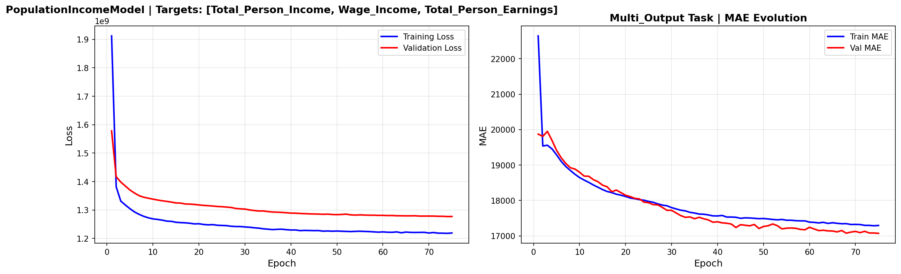

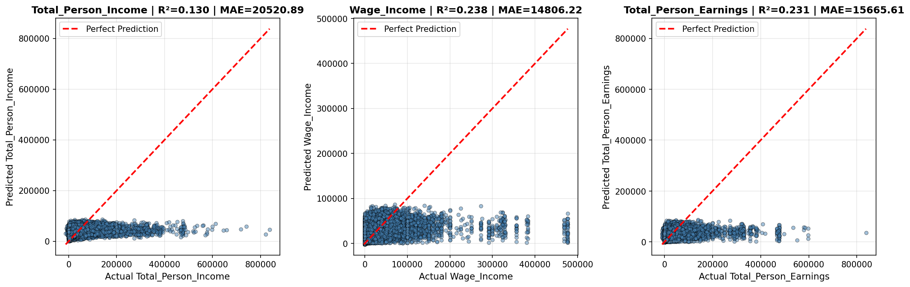

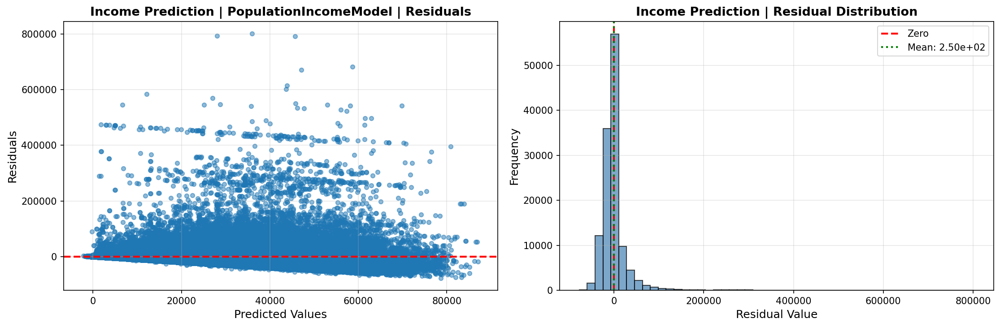

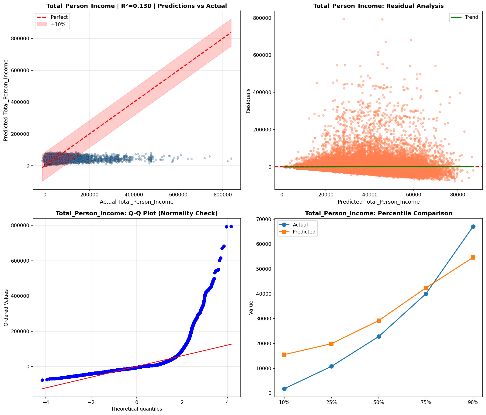

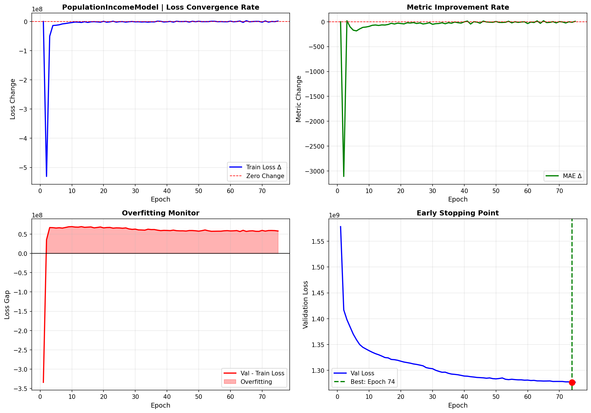

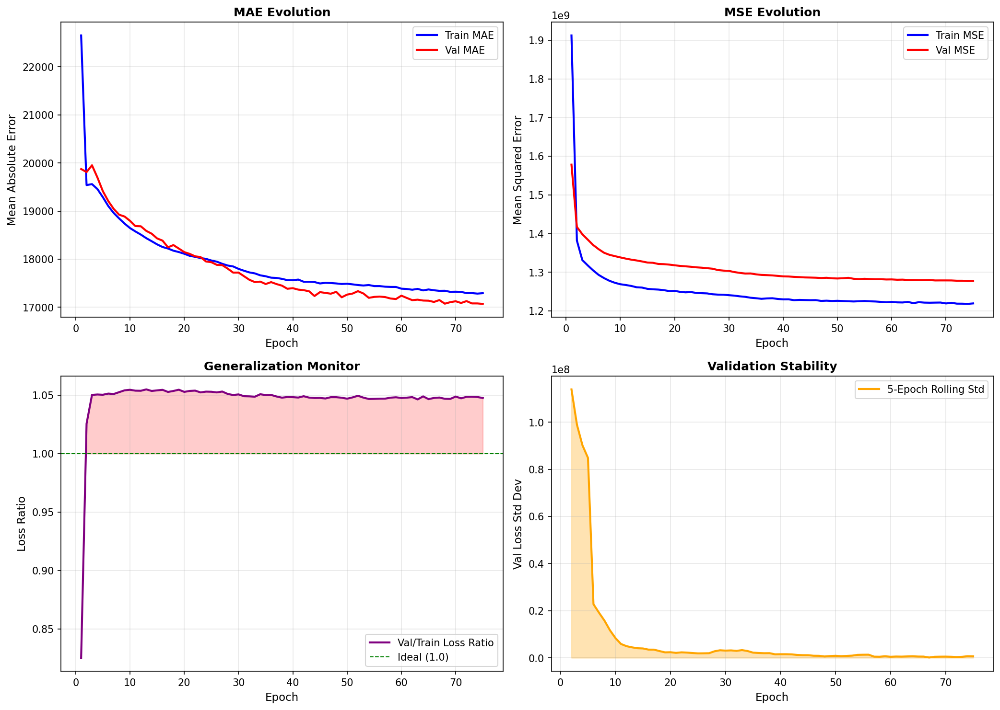

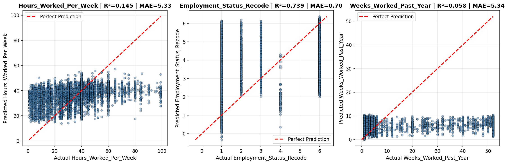

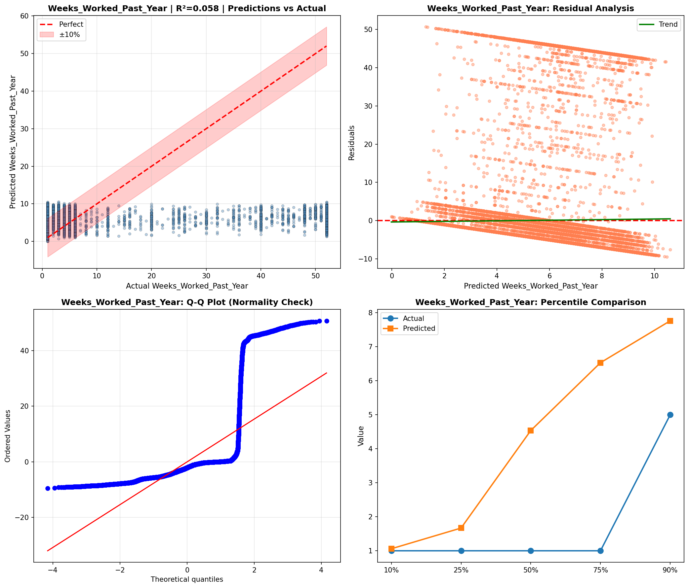

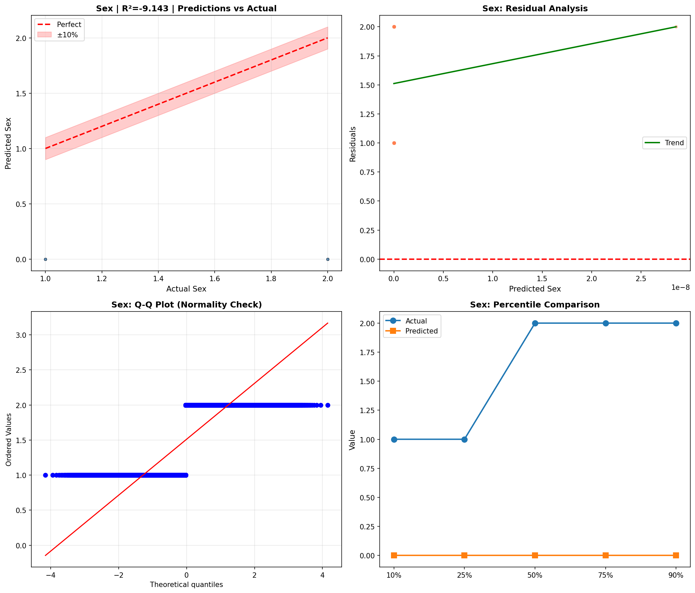

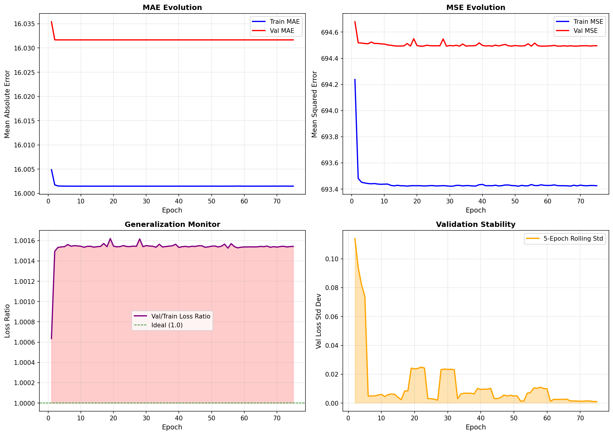

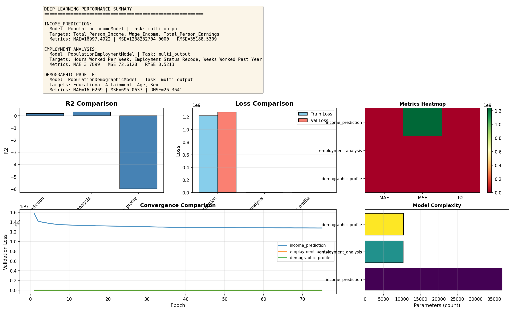

