# Statistical Analysis

> Comprehensive descriptive statistics including central tendency, dispersion, distribution characteristics, and weighted statistics using ACS sample weights.

## Summary Statistics

- **Variables Analyzed**: 41

### Income_Adjustment_Factor

| Statistic | Unweighted | Weighted (ACS) |
| :--- | :--- | :--- |
| Mean | 1,014,904.57 | 1,014,656.45 |
| Median | 1,010,207.00 | 1,014,656.45 |
| Std Deviation | 11,391.07 | — |
| Minimum | 1,001,264.00 | — |
| Maximum | 1,042,311.00 | — |
| Count | 375,491 | — |

> *Distribution is highly right-skewed (skewness: 1.31), light-tailed/platykurtic (kurtosis: 0.69).*

- **Coefficient of Variation**: 1.1 % (low variability)

### Property_Value

| Statistic | Unweighted | Weighted (ACS) |
| :--- | :--- | :--- |
| Mean | 462,208.17 | 452,750.30 |
| Median | 350,000.00 | 357,751.67 |
| Std Deviation | 523,979.65 | — |
| Minimum | 1.00 | — |
| Maximum | 6,889,000.00 | — |
| Count | 223,158 | — |

> *Distribution is highly right-skewed (skewness: 5.35), heavy-tailed/leptokurtic (kurtosis: 43.43).*

- **Coefficient of Variation**: 113.4 % (very high variability)

### Electricity_Cost_Monthly

| Statistic | Unweighted | Weighted (ACS) |
| :--- | :--- | :--- |
| Mean | 130.03 | 128.00 |
| Median | 100.00 | 101.88 |
| Std Deviation | 126.66 | — |
| Minimum | 1.00 | — |
| Maximum | 2,800.00 | — |
| Count | 419,780 | — |

> *Distribution is highly right-skewed (skewness: 7.45), heavy-tailed/leptokurtic (kurtosis: 124.91).*

- **Coefficient of Variation**: 97.4 % (high variability)

### Fuel_Cost_Monthly

| Statistic | Unweighted | Weighted (ACS) |
| :--- | :--- | :--- |
| Mean | 743.19 | 940.97 |
| Median | 2.00 | 495.12 |
| Std Deviation | 1,207.36 | — |
| Minimum | 1.00 | — |
| Maximum | 6,900.00 | — |
| Count | 323,394 | — |

> *Distribution is highly right-skewed (skewness: 1.89), heavy-tailed/leptokurtic (kurtosis: 3.61).*

- **Coefficient of Variation**: 162.5 % (very high variability)

### Gas_Cost_Monthly

| Statistic | Unweighted | Weighted (ACS) |
| :--- | :--- | :--- |
| Mean | 83.86 | 89.91 |
| Median | 40.00 | 46.25 |
| Std Deviation | 118.51 | — |
| Minimum | 1.00 | — |
| Maximum | 1,700.00 | — |
| Count | 368,068 | — |

> *Distribution is highly right-skewed (skewness: 3.42), heavy-tailed/leptokurtic (kurtosis: 26.26).*

- **Coefficient of Variation**: 141.3 % (very high variability)

### Insurance_Cost_Yearly

| Statistic | Unweighted | Weighted (ACS) |
| :--- | :--- | :--- |
| Mean | 1,318.75 | 1,306.95 |
| Median | 1,000.00 | 1,072.50 |
| Std Deviation | 1,076.57 | — |
| Minimum | 4.00 | — |
| Maximum | 10,000.00 | — |
| Count | 269,285 | — |

> *Distribution is highly right-skewed (skewness: 3.19), heavy-tailed/leptokurtic (kurtosis: 15.34).*

- **Coefficient of Variation**: 81.6 % (high variability)

### Water_Cost_Yearly

| Statistic | Unweighted | Weighted (ACS) |
| :--- | :--- | :--- |
| Mean | 420.38 | 454.03 |
| Median | 220.00 | 230.00 |
| Std Deviation | 565.77 | — |
| Minimum | 1.00 | — |
| Maximum | 5,000.00 | — |
| Count | 369,295 | — |

> *Distribution is highly right-skewed (skewness: 2.46), heavy-tailed/leptokurtic (kurtosis: 9.56).*

- **Coefficient of Variation**: 134.6 % (very high variability)

### Mobile_Home_Costs_Monthly

| Statistic | Unweighted | Weighted (ACS) |
| :--- | :--- | :--- |
| Mean | 3,488.13 | 3,617.71 |
| Median | 3,600.00 | 3,731.25 |
| Std Deviation | 2,794.48 | — |
| Minimum | 4.00 | — |
| Maximum | 31,200.00 | — |
| Count | 2,459 | — |

> *Distribution is highly right-skewed (skewness: 2.90), heavy-tailed/leptokurtic (kurtosis: 23.01).*

- **Coefficient of Variation**: 80.1 % (high variability)

### First_Mortgage_Payment_Monthly

| Statistic | Unweighted | Weighted (ACS) |
| :--- | :--- | :--- |
| Mean | 1,457.03 | 1,569.38 |
| Median | 1,400.00 | 1,363.00 |
| Std Deviation | 1,133.94 | — |
| Minimum | 4.00 | — |
| Maximum | 8,000.00 | — |
| Count | 229,249 | — |

> *Distribution is highly right-skewed (skewness: 1.26), heavy-tailed/leptokurtic (kurtosis: 3.39).*

- **Coefficient of Variation**: 77.8 % (high variability)

### First_Mortgage_Includes_Taxes

| Statistic | Unweighted | Weighted (ACS) |
| :--- | :--- | :--- |
| Mean | 1.28 | 1.27 |
| Median | 1.00 | 1.00 |
| Std Deviation | 0.45 | — |
| Minimum | 1.00 | — |
| Maximum | 2.00 | — |
| Count | 196,609 | — |

> *Distribution is moderately right-skewed (skewness: 0.97), light-tailed/platykurtic (kurtosis: -1.07).*

- **Coefficient of Variation**: 35.1 % (moderate variability)

### Second_Mortgage_Payment_Monthly

| Statistic | Unweighted | Weighted (ACS) |
| :--- | :--- | :--- |
| Mean | 441.03 | 444.63 |
| Median | 300.00 | 301.88 |
| Std Deviation | 502.25 | — |
| Minimum | 4.00 | — |
| Maximum | 5,700.00 | — |
| Count | 47,778 | — |

> *Distribution is highly right-skewed (skewness: 3.72), heavy-tailed/leptokurtic (kurtosis: 19.71).*

- **Coefficient of Variation**: 113.9 % (very high variability)

### Property_Taxes_Yearly

| Statistic | Unweighted | Weighted (ACS) |
| :--- | :--- | :--- |
| Mean | 672.17 | 619.69 |
| Median | 52.00 | 524.00 |
| Std Deviation | 2,566.83 | — |
| Minimum | 1.00 | — |
| Maximum | 37,500.00 | — |
| Count | 216,568 | — |

> *Distribution is highly right-skewed (skewness: 6.68), heavy-tailed/leptokurtic (kurtosis: 65.16).*

- **Coefficient of Variation**: 381.9 % (very high variability)

### Meals_Included_in_Rent

| Statistic | Unweighted | Weighted (ACS) |
| :--- | :--- | :--- |
| Mean | 1.98 | 1.98 |
| Median | 2.00 | 2.00 |
| Std Deviation | 0.15 | — |
| Minimum | 1.00 | — |
| Maximum | 2.00 | — |
| Count | 136,188 | — |

> *Distribution is highly left-skewed (skewness: -6.60), heavy-tailed/leptokurtic (kurtosis: 41.50).*

- **Coefficient of Variation**: 7.3 % (low variability)

### Rent_Amount_Monthly

| Statistic | Unweighted | Weighted (ACS) |
| :--- | :--- | :--- |
| Mean | 1,185.12 | 1,156.68 |
| Median | 1,000.00 | 1,048.12 |
| Std Deviation | 806.03 | — |
| Minimum | 4.00 | — |
| Maximum | 6,300.00 | — |
| Count | 136,188 | — |

> *Distribution is highly right-skewed (skewness: 1.57), heavy-tailed/leptokurtic (kurtosis: 4.48).*

- **Coefficient of Variation**: 68.0 % (high variability)

### Gross_Rent

| Statistic | Unweighted | Weighted (ACS) |
| :--- | :--- | :--- |
| Mean | 1,317.68 | 1,284.36 |
| Median | 1,170.00 | 1,199.25 |
| Std Deviation | 840.58 | — |
| Minimum | 4.00 | — |
| Maximum | 9,100.00 | — |
| Count | 131,055 | — |

> *Distribution is highly right-skewed (skewness: 1.43), heavy-tailed/leptokurtic (kurtosis: 3.95).*

- **Coefficient of Variation**: 63.8 % (high variability)

### Gross_Rent_Percentage_Income

| Statistic | Unweighted | Weighted (ACS) |
| :--- | :--- | :--- |
| Mean | 39.25 | 39.64 |
| Median | 29.00 | 29.88 |
| Std Deviation | 27.74 | — |
| Minimum | 1.00 | — |
| Maximum | 101.00 | — |
| Count | 128,350 | — |

> *Distribution is highly right-skewed (skewness: 1.16), light-tailed/platykurtic (kurtosis: 0.20).*

- **Coefficient of Variation**: 70.7 % (high variability)

### Selected_Monthly_Owner_Costs

| Statistic | Unweighted | Weighted (ACS) |
| :--- | :--- | :--- |
| Mean | 1,887.53 | 1,922.31 |
| Median | 1,653.00 | 1,721.06 |
| Std Deviation | 1,280.17 | — |
| Minimum | 2.00 | — |
| Maximum | 15,650.00 | — |
| Count | 292,765 | — |

> *Distribution is highly right-skewed (skewness: 1.77), heavy-tailed/leptokurtic (kurtosis: 5.72).*

- **Coefficient of Variation**: 67.8 % (high variability)

### Owner_Costs_Percentage_Income

| Statistic | Unweighted | Weighted (ACS) |
| :--- | :--- | :--- |
| Mean | 26.74 | 27.45 |
| Median | 20.00 | 21.12 |
| Std Deviation | 21.98 | — |
| Minimum | 1.00 | — |
| Maximum | 101.00 | — |
| Count | 291,302 | — |

> *Distribution is highly right-skewed (skewness: 1.88), heavy-tailed/leptokurtic (kurtosis: 3.45).*

- **Coefficient of Variation**: 82.2 % (high variability)

### Family_Income

| Statistic | Unweighted | Weighted (ACS) |
| :--- | :--- | :--- |
| Mean | 129,017.22 | 122,078.40 |
| Median | 97,200.00 | 93,737.50 |
| Std Deviation | 125,786.69 | — |
| Minimum | 1.00 | — |
| Maximum | 2,907,600.00 | — |
| Count | 273,436 | — |

> *Distribution is highly right-skewed (skewness: 3.21), heavy-tailed/leptokurtic (kurtosis: 17.11).*

- **Coefficient of Variation**: 97.5 % (high variability)

### Household_Income

| Statistic | Unweighted | Weighted (ACS) |
| :--- | :--- | :--- |
| Mean | 107,479.99 | 101,853.68 |
| Median | 77,000.00 | 74,406.25 |
| Std Deviation | 115,427.39 | — |
| Minimum | 1.00 | — |
| Maximum | 3,209,000.00 | — |
| Count | 425,046 | — |

> *Distribution is highly right-skewed (skewness: 3.47), heavy-tailed/leptokurtic (kurtosis: 21.12).*

- **Coefficient of Variation**: 107.4 % (very high variability)

### Specified_Rent_Unit

| Statistic | Unweighted | Weighted (ACS) |
| :--- | :--- | :--- |
| Mean | 0.31 | 0.36 |
| Median | 0.00 | 0.00 |
| Std Deviation | 0.46 | — |
| Minimum | 0.00 | — |
| Maximum | 1.00 | — |
| Count | 458,288 | — |

> *Distribution is moderately right-skewed (skewness: 0.83), light-tailed/platykurtic (kurtosis: -1.31).*

- **Coefficient of Variation**: 149.9 % (very high variability)

### Specified_Value_Unit

| Statistic | Unweighted | Weighted (ACS) |
| :--- | :--- | :--- |
| Mean | 0.52 | 0.46 |
| Median | 1.00 | 0.00 |
| Std Deviation | 0.50 | — |
| Minimum | 0.00 | — |
| Maximum | 1.00 | — |
| Count | 458,288 | — |

> *Distribution is approximately symmetric (skewness: -0.09), light-tailed/platykurtic (kurtosis: -1.99).*

- **Coefficient of Variation**: 95.4 % (high variability)

### Flag_Family_Income

| Statistic | Unweighted | Weighted (ACS) |
| :--- | :--- | :--- |
| Mean | 0.21 | 0.21 |
| Median | 0.00 | 0.00 |
| Std Deviation | 0.41 | — |
| Minimum | 0.00 | — |
| Maximum | 1.00 | — |
| Count | 348,139 | — |

> *Distribution is highly right-skewed (skewness: 1.42), light-tailed/platykurtic (kurtosis: 0.01).*

- **Coefficient of Variation**: 193.6 % (very high variability)

### Flag_Gross_Rent

| Statistic | Unweighted | Weighted (ACS) |
| :--- | :--- | :--- |
| Mean | 0.09 | 0.13 |
| Median | 0.00 | 0.00 |
| Std Deviation | 0.29 | — |
| Minimum | 0.00 | — |
| Maximum | 1.00 | — |
| Count | 233,643 | — |

> *Distribution is highly right-skewed (skewness: 2.81), heavy-tailed/leptokurtic (kurtosis: 5.92).*

- **Coefficient of Variation**: 313.3 % (very high variability)

### Flag_Household_Income

| Statistic | Unweighted | Weighted (ACS) |
| :--- | :--- | :--- |
| Mean | 0.32 | 0.33 |
| Median | 0.00 | 0.00 |
| Std Deviation | 0.47 | — |
| Minimum | 0.00 | — |
| Maximum | 1.00 | — |
| Count | 348,139 | — |

> *Distribution is moderately right-skewed (skewness: 0.77), light-tailed/platykurtic (kurtosis: -1.40).*

- **Coefficient of Variation**: 145.8 % (very high variability)

### Flag_First_Mortgage_Payment

| Statistic | Unweighted | Weighted (ACS) |
| :--- | :--- | :--- |
| Mean | 0.04 | 0.05 |
| Median | 0.00 | 0.00 |
| Std Deviation | 0.21 | — |
| Minimum | 0.00 | — |
| Maximum | 1.00 | — |
| Count | 458,288 | — |

> *Distribution is highly right-skewed (skewness: 4.39), heavy-tailed/leptokurtic (kurtosis: 17.31).*

- **Coefficient of Variation**: 461.1 % (very high variability)

### Flag_First_Mortgage_Taxes

| Statistic | Unweighted | Weighted (ACS) |
| :--- | :--- | :--- |
| Mean | 0.04 | 0.04 |
| Median | 0.00 | 0.00 |
| Std Deviation | 0.19 | — |
| Minimum | 0.00 | — |
| Maximum | 1.00 | — |
| Count | 458,288 | — |

> *Distribution is highly right-skewed (skewness: 4.90), heavy-tailed/leptokurtic (kurtosis: 22.03).*

- **Coefficient of Variation**: 509.8 % (very high variability)

### Flag_Meals_Included_Rent

| Statistic | Unweighted | Weighted (ACS) |
| :--- | :--- | :--- |
| Mean | 0.01 | 0.01 |
| Median | 0.00 | 0.00 |
| Std Deviation | 0.10 | — |
| Minimum | 0.00 | — |
| Maximum | 1.00 | — |
| Count | 458,288 | — |

> *Distribution is highly right-skewed (skewness: 10.16), heavy-tailed/leptokurtic (kurtosis: 101.32).*

- **Coefficient of Variation**: 1,026.2 % (very high variability)

### Flag_Rent_Amount

| Statistic | Unweighted | Weighted (ACS) |
| :--- | :--- | :--- |
| Mean | 0.03 | 0.04 |
| Median | 0.00 | 0.00 |
| Std Deviation | 0.18 | — |
| Minimum | 0.00 | — |
| Maximum | 1.00 | — |
| Count | 458,288 | — |

> *Distribution is highly right-skewed (skewness: 5.20), heavy-tailed/leptokurtic (kurtosis: 25.09).*

- **Coefficient of Variation**: 539.0 % (very high variability)

### Flag_Selected_Monthly_Owner_Costs

| Statistic | Unweighted | Weighted (ACS) |
| :--- | :--- | :--- |
| Mean | 0.24 | 0.24 |
| Median | 0.00 | 0.00 |
| Std Deviation | 0.42 | — |
| Minimum | 0.00 | — |
| Maximum | 1.00 | — |
| Count | 290,887 | — |

> *Distribution is highly right-skewed (skewness: 1.25), light-tailed/platykurtic (kurtosis: -0.45).*

- **Coefficient of Variation**: 180.2 % (very high variability)

### Flag_Second_Mortgage_Payment

| Statistic | Unweighted | Weighted (ACS) |
| :--- | :--- | :--- |
| Mean | 0.04 | 0.04 |
| Median | 0.00 | 0.00 |
| Std Deviation | 0.20 | — |
| Minimum | 0.00 | — |
| Maximum | 1.00 | — |
| Count | 458,288 | — |

> *Distribution is highly right-skewed (skewness: 4.61), heavy-tailed/leptokurtic (kurtosis: 19.28).*

- **Coefficient of Variation**: 482.0 % (very high variability)

### Flag_Property_Taxes

| Statistic | Unweighted | Weighted (ACS) |
| :--- | :--- | :--- |
| Mean | 0.08 | 0.08 |
| Median | 0.00 | 0.00 |
| Std Deviation | 0.27 | — |
| Minimum | 0.00 | — |
| Maximum | 1.00 | — |
| Count | 427,828 | — |

> *Distribution is highly right-skewed (skewness: 3.16), heavy-tailed/leptokurtic (kurtosis: 7.96).*

- **Coefficient of Variation**: 344.5 % (very high variability)

### Flag_Property_Value

| Statistic | Unweighted | Weighted (ACS) |
| :--- | :--- | :--- |
| Mean | 0.06 | 0.06 |
| Median | 0.00 | 0.00 |
| Std Deviation | 0.24 | — |
| Minimum | 0.00 | — |
| Maximum | 1.00 | — |
| Count | 458,288 | — |

> *Distribution is highly right-skewed (skewness: 3.58), heavy-tailed/leptokurtic (kurtosis: 10.79).*

- **Coefficient of Variation**: 383.7 % (very high variability)

### Flag_Water_Cost

| Statistic | Unweighted | Weighted (ACS) |
| :--- | :--- | :--- |
| Mean | 0.09 | 0.09 |
| Median | 0.00 | 0.00 |
| Std Deviation | 0.29 | — |
| Minimum | 0.00 | — |
| Maximum | 1.00 | — |
| Count | 30,460 | — |

> *Distribution is highly right-skewed (skewness: 2.85), heavy-tailed/leptokurtic (kurtosis: 6.10).*

- **Coefficient of Variation**: 316.2 % (very high variability)

### Annual_Rent_to_Value_Ratio

### Total_Monthly_Utility_Cost

| Statistic | Unweighted | Weighted (ACS) |
| :--- | :--- | :--- |
| Mean | 202.97 | 199.52 |
| Median | 160.00 | 159.00 |
| Std Deviation | 184.44 | — |
| Minimum | 2.00 | — |
| Maximum | 4,500.00 | — |
| Count | 421,003 | — |

> *Distribution is highly right-skewed (skewness: 4.65), heavy-tailed/leptokurtic (kurtosis: 55.80).*

- **Coefficient of Variation**: 90.9 % (high variability)

### Property_Tax_Rate

| Statistic | Unweighted | Weighted (ACS) |
| :--- | :--- | :--- |
| Mean | 28.23 | 28.02 |
| Median | 0.02 | 28.12 |
| Std Deviation | 77.24 | — |
| Minimum | 0.00 | — |
| Maximum | 800.00 | — |
| Count | 144,835 | — |

> *Distribution is highly right-skewed (skewness: 2.59), heavy-tailed/leptokurtic (kurtosis: 5.38).*

- **Coefficient of Variation**: 273.6 % (very high variability)

#### Weighted Statistics by Year

| Year | Weighted Mean | Weighted Median |
| :--- | :--- | :--- |
| 2007 | 222.71 | 223.81 |
| 2012 | 0.02 | 0.02 |
| 2013 | 0.06 | 0.02 |
| 2014 | 0.03 | 0.01 |
| 2015 | 0.03 | 0.01 |
| 2016 | 0.02 | 0.01 |
| 2017 | 0.02 | 0.01 |
| 2023 | 1.26 | 1.08 |

### Structure_Age

| Statistic | Unweighted | Weighted (ACS) |
| :--- | :--- | :--- |
| Mean | 1,869.38 | 1,879.49 |
| Median | 2,019.00 | 1,880.21 |
| Std Deviation | 521.16 | — |
| Minimum | 1.00 | — |
| Maximum | 2,023.00 | — |
| Count | 397,744 | — |

> *Distribution is highly left-skewed (skewness: -3.19), heavy-tailed/leptokurtic (kurtosis: 8.15).*

- **Coefficient of Variation**: 27.9 % (moderate variability)

### Structure_Age_Score

| Statistic | Unweighted | Weighted (ACS) |
| :--- | :--- | :--- |
| Mean | 0.03 | 0.03 |
| Median | 0.00 | 0.03 |
| Std Deviation | 0.13 | — |
| Minimum | 0.00 | — |
| Maximum | 0.99 | — |
| Count | 397,744 | — |

> *Distribution is highly right-skewed (skewness: 4.74), heavy-tailed/leptokurtic (kurtosis: 23.24).*

- **Coefficient of Variation**: 410.5 % (very high variability)

### Working_Age_Persons

| Statistic | Unweighted | Weighted (ACS) |
| :--- | :--- | :--- |
| Mean | 1.69 | 1.75 |
| Median | 2.00 | 2.00 |
| Std Deviation | 1.32 | — |
| Minimum | 0.00 | — |
| Maximum | 18.00 | — |
| Count | 429,522 | — |

> *Distribution is moderately right-skewed (skewness: 0.71), light-tailed/platykurtic (kurtosis: 1.13).*

- **Coefficient of Variation**: 78.1 % (high variability)

### Income_to_FPL_Ratio

| Statistic | Unweighted | Weighted (ACS) |
| :--- | :--- | :--- |
| Mean | 4.81 | 4.54 |
| Median | 3.57 | 3.44 |
| Std Deviation | 5.06 | — |
| Minimum | -0.69 | — |
| Maximum | 112.07 | — |
| Count | 429,522 | — |

> *Distribution is highly right-skewed (skewness: 3.80), heavy-tailed/leptokurtic (kurtosis: 25.39).*

- **Coefficient of Variation**: 105.2 % (very high variability)

## Distribution Analysis

### Skewed Distributions

> Variables with skewness > |0.5| indicate non-normal distributions. Consider log transformations for highly skewed variables in modeling.

| Variable | Skewness | Direction | Severity |
| :--- | :--- | :--- | :--- |
| Flag_Meals_Included_Rent | 10.164 | Right-skewed | High |
| Electricity_Cost_Monthly | 7.454 | Right-skewed | High |
| Property_Taxes_Yearly | 6.676 | Right-skewed | High |
| Meals_Included_in_Rent | -6.596 | Left-skewed | High |
| Property_Value | 5.350 | Right-skewed | High |
| Flag_Rent_Amount | 5.205 | Right-skewed | High |
| Flag_First_Mortgage_Taxes | 4.902 | Right-skewed | High |
| Structure_Age_Score | 4.742 | Right-skewed | High |
| Total_Monthly_Utility_Cost | 4.646 | Right-skewed | High |
| Flag_Second_Mortgage_Payment | 4.613 | Right-skewed | High |
| Flag_First_Mortgage_Payment | 4.394 | Right-skewed | High |
| Income_to_FPL_Ratio | 3.796 | Right-skewed | High |
| Second_Mortgage_Payment_Monthly | 3.718 | Right-skewed | High |
| Flag_Property_Value | 3.576 | Right-skewed | High |
| Household_Income | 3.468 | Right-skewed | High |
| Gas_Cost_Monthly | 3.422 | Right-skewed | High |
| Family_Income | 3.212 | Right-skewed | High |
| Insurance_Cost_Yearly | 3.194 | Right-skewed | High |
| Structure_Age | -3.185 | Left-skewed | High |
| Flag_Property_Taxes | 3.155 | Right-skewed | High |

- **Total Skewed Variables**: 39

- **Right-skewed**: 37

- **Left-skewed**: 2

## Variance Analysis

### Coefficient of Variation Ranking

> CV (Coefficient of Variation) = (Std Dev / Mean) × 100%. Higher CV indicates greater relative variability.

| Variable | CV (%) | Std Dev | Mean | Variability |
| :--- | :--- | :--- | :--- | :--- |
| Flag_Meals_Included_Rent | 1026.2% | 0.10 | 0.01 | Very High |
| Flag_Rent_Amount | 539.0% | 0.18 | 0.03 | Very High |
| Flag_First_Mortgage_Taxes | 509.8% | 0.19 | 0.04 | Very High |
| Flag_Second_Mortgage_Payment | 482.0% | 0.20 | 0.04 | Very High |
| Flag_First_Mortgage_Payment | 461.1% | 0.21 | 0.04 | Very High |
| Structure_Age_Score | 410.5% | 0.13 | 0.03 | Very High |
| Flag_Property_Value | 383.7% | 0.24 | 0.06 | Very High |
| Property_Taxes_Yearly | 381.9% | 2,566.83 | 672.17 | Very High |
| Flag_Property_Taxes | 344.5% | 0.27 | 0.08 | Very High |
| Flag_Water_Cost | 316.2% | 0.29 | 0.09 | Very High |
| Flag_Gross_Rent | 313.3% | 0.29 | 0.09 | Very High |
| Property_Tax_Rate | 273.6% | 77.24 | 28.23 | Very High |
| Flag_Family_Income | 193.6% | 0.41 | 0.21 | Very High |
| Flag_Selected_Monthly_Owner_Costs | 180.2% | 0.42 | 0.24 | Very High |
| Fuel_Cost_Monthly | 162.5% | 1,207.36 | 743.19 | Very High |
| Specified_Rent_Unit | 149.9% | 0.46 | 0.31 | Very High |
| Flag_Household_Income | 145.8% | 0.47 | 0.32 | Very High |
| Gas_Cost_Monthly | 141.3% | 118.51 | 83.86 | Very High |
| Water_Cost_Yearly | 134.6% | 565.77 | 420.38 | Very High |
| Second_Mortgage_Payment_Monthly | 113.9% | 502.25 | 441.03 | Very High |

- **Average CV**: 202.8 %

- **High Variance Variables (CV > 50%)**: 36

## Visualizations

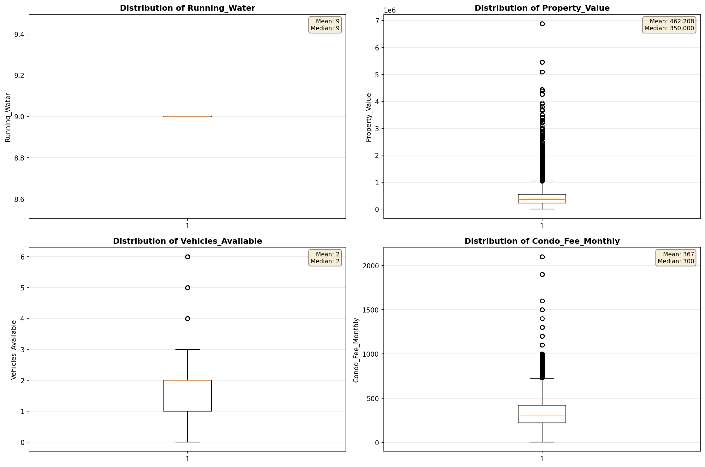

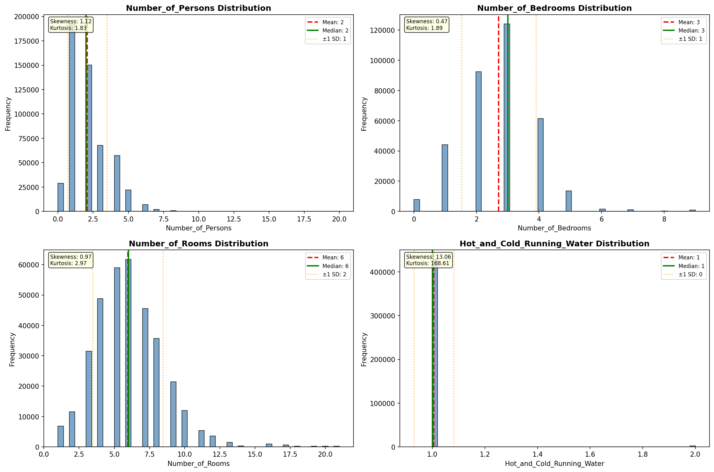

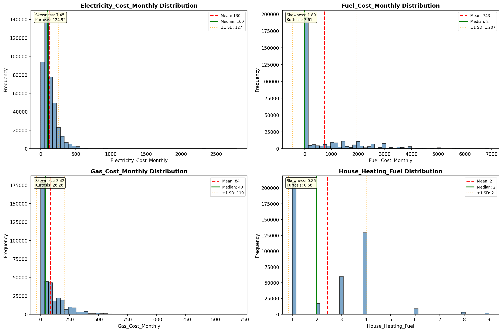

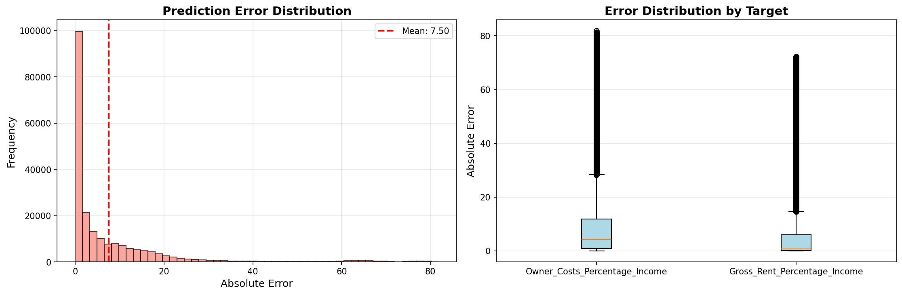

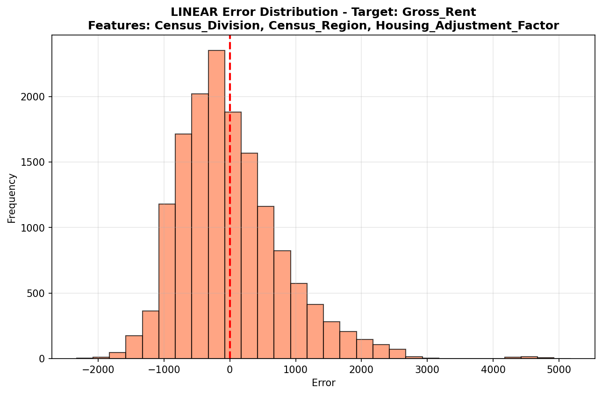

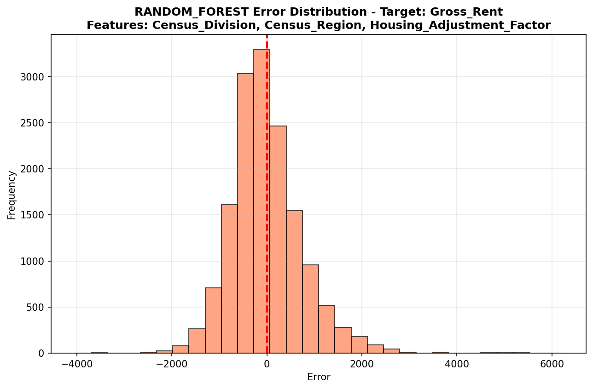

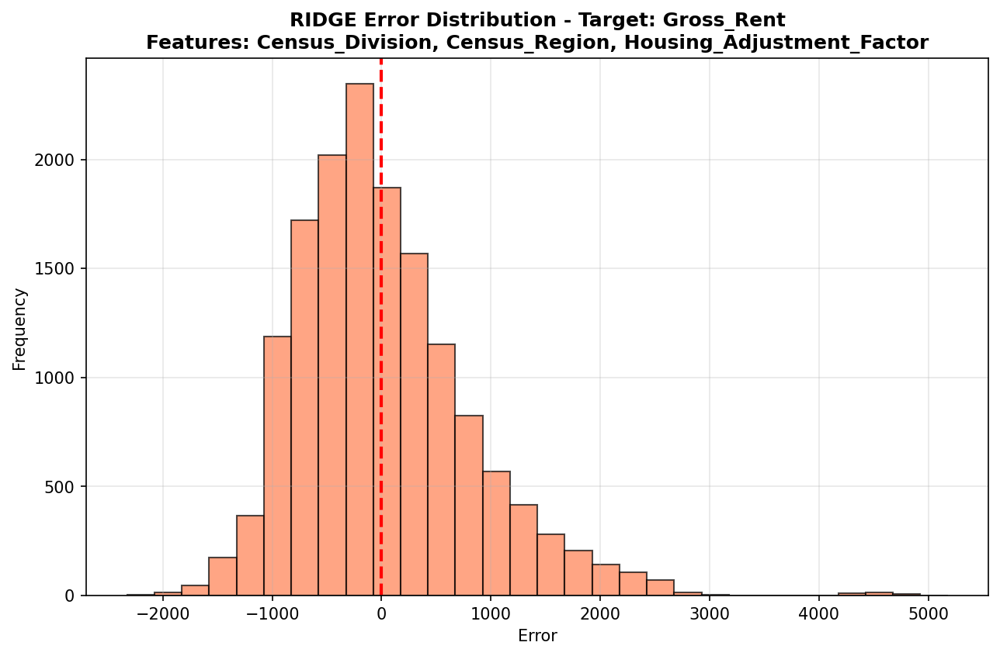

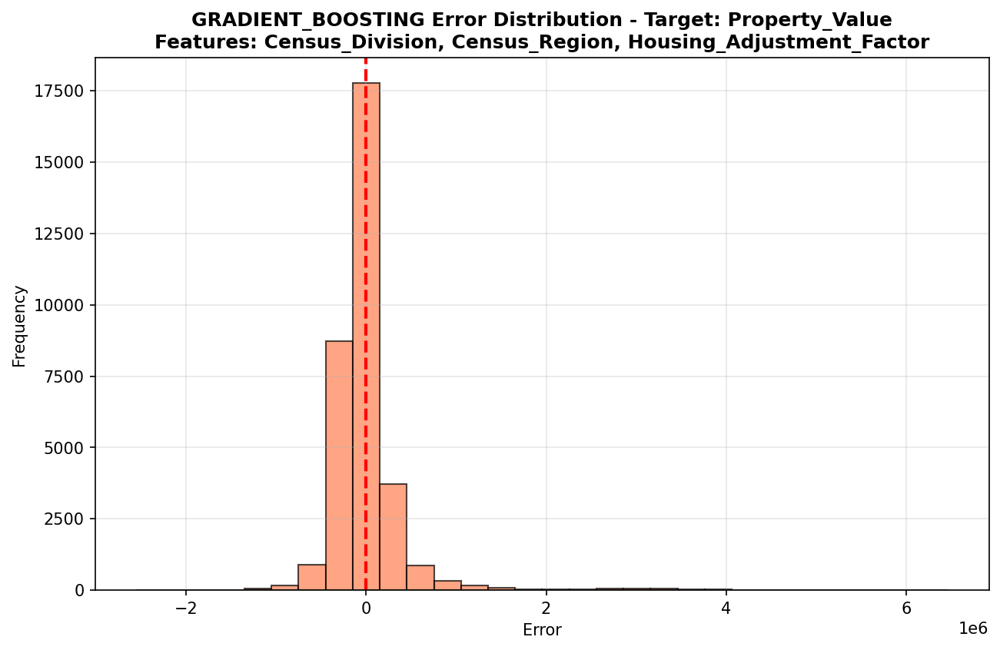

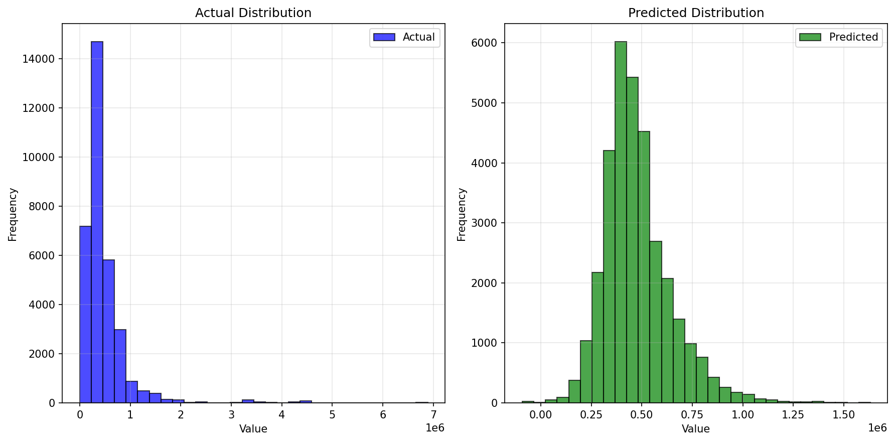

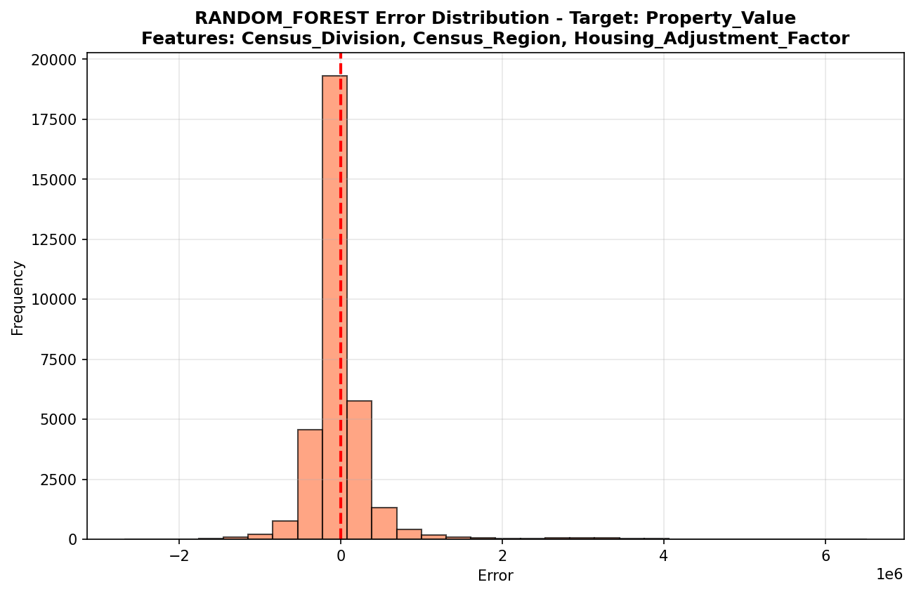

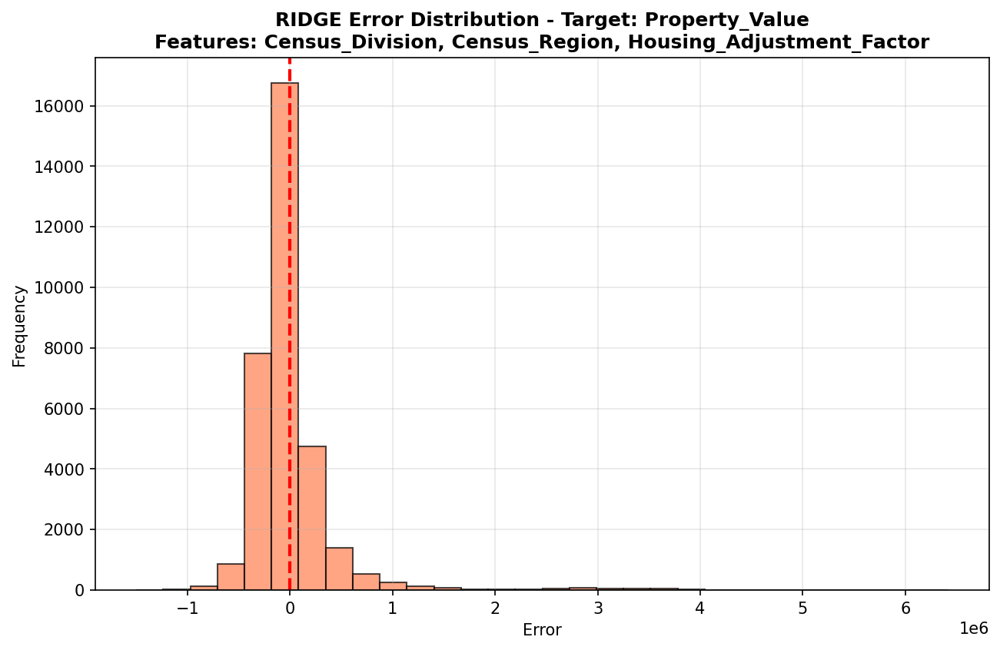

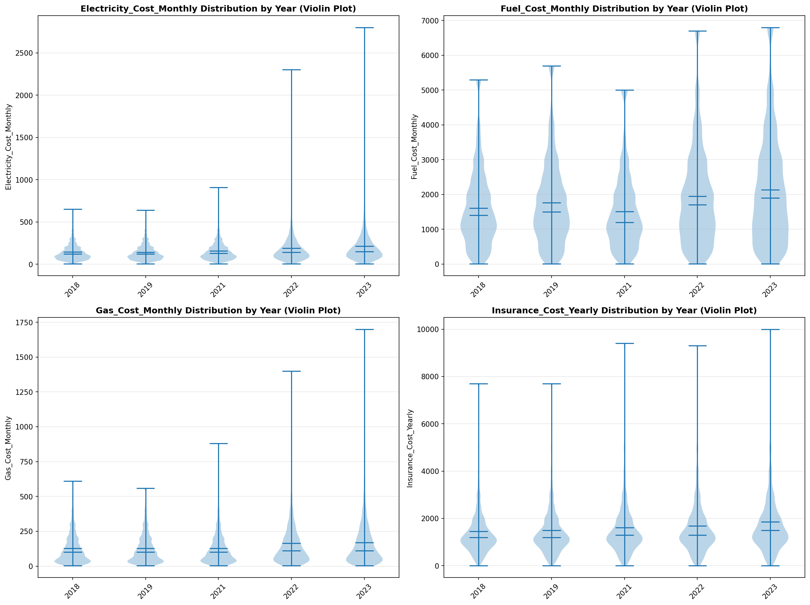

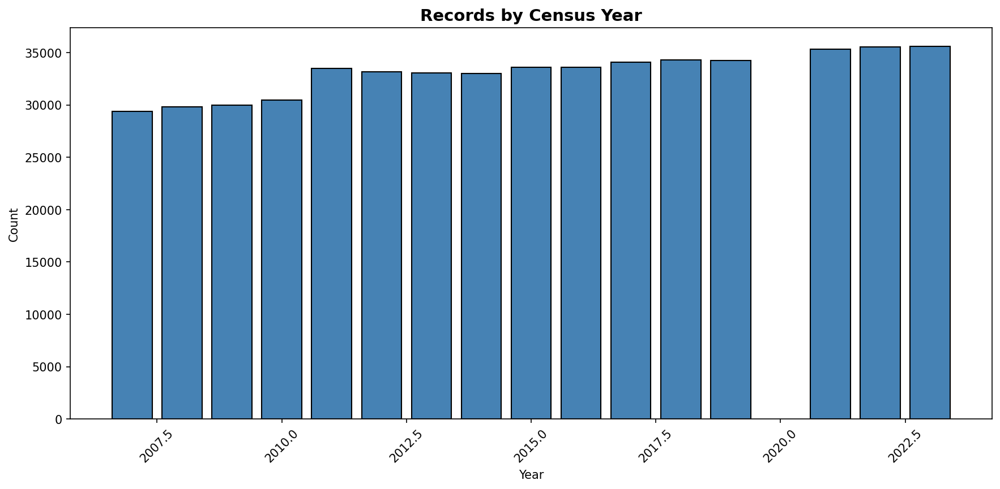
