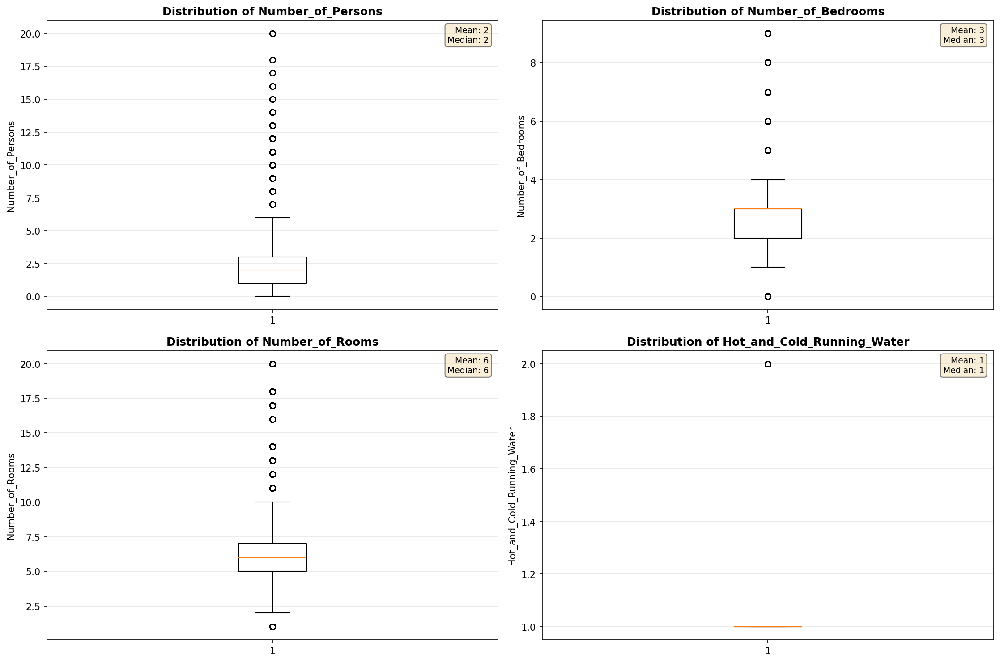
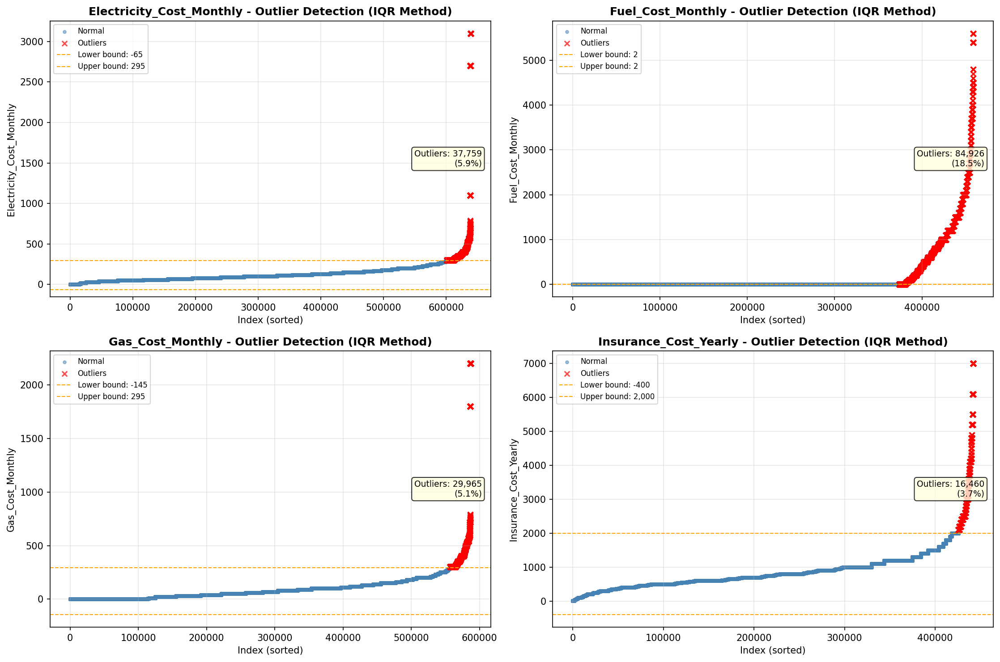

# Outlier Detection

> Statistical outlier detection using IQR (Interquartile Range) method. Outliers are values falling outside Q1 - 1.5×IQR or Q3 + 1.5×IQR bounds.

## Detection Methodology

| Parameter | Value | Description |
| :--- | :--- | :--- |
| Method | IQR | Outlier detection algorithm |
| Lower Bound | Q1 - 1.5 × IQR | Values below are outliers |
| Upper Bound | Q3 + 1.5 × IQR | Values above are outliers |
| IQR Definition | Q3 - Q1 | Interquartile Range |

> **Note**: The IQR method is robust to extreme values and works well for approximately symmetric distributions.

## Outlier Summary

_No outlier summary available._
## High Outlier Rate Variables

> Variables with outlier rate > 5% may indicate data quality issues, non-normal distributions, or genuinely extreme values.

- **('Flag_Selected_Monthly_Owner_Costs', 23.083915165439066)**: 0 outliers (0.00%)

- **('Specified_Rent_Unit', 18.88699209140404)**: 0 outliers (0.00%)

- **('Fuel_Cost_Monthly', 18.507839996513137)**: 0 outliers (0.00%)

- **('Flag_Family_Income', 18.468181354623464)**: 0 outliers (0.00%)

- **('Property_Tax_Rate', 17.876555187537026)**: 0 outliers (0.00%)

- **('Flag_Property_Taxes', 10.140109584875649)**: 0 outliers (0.00%)

- **('Income_Adjustment_Factor', 9.265070699806406)**: 0 outliers (0.00%)

- **('Working_Age_Persons', 8.928264581536942)**: 0 outliers (0.00%)

- **('Property_Taxes_Yearly', 8.523838727755278)**: 0 outliers (0.00%)

- **('Structure_Age', 8.211475327669598)**: 0 outliers (0.00%)

- **('Owner_Costs_Percentage_Income', 8.011116100620013)**: 0 outliers (0.00%)

- **('Flag_Water_Cost', 7.9939700656832136)**: 0 outliers (0.00%)

- **('Flag_Property_Value', 7.709409408450164)**: 0 outliers (0.00%)

- **('Structure_Age_Score', 7.27310603212791)**: 0 outliers (0.00%)

- **('Electricity_Cost_Monthly', 5.906507028241235)**: 0 outliers (0.00%)

> *Consider investigating these variables for data entry errors, applying transformations, or using robust statistical methods.*

## Visualizations

