# Deep Learning Models

> Neural network analysis using TensorFlow/Keras for complex pattern recognition and multi-output prediction tasks.

## Deep Learning Summary

- **Total Tasks**: 5

- **Tasks**: Property Valuation, Affordability Analysis, Housing Quality, Cost Prediction, Occupancy Prediction

### Aggregate Statistics

| Metric | Value |
| :--- | :--- |
| Total Parameters | 78,283 |
| Average Validation Loss | 2337537426.2882 |
| Number of Tasks | 5 |

## Task: Property Valuation

### Model Configuration

| Property | Value |
| :--- | :--- |
| Model Type | HousingValuationModel |
| Task Type | Multi_Output |
| Target Variables | Property_Value, Gross_Rent |
| Number of Targets | 2 |
| Input Features | 10 |

### Network Architecture

| Component | Value | Notes |
| :--- | :--- | :--- |
| Total Layers | 7 | Including input and output |
| Total Parameters | 36,994 | Trainable weights |
| Parameters per Layer | 5,284 | Average |

### Performance Metrics

| Metric | Value | Assessment |
| :--- | :--- | :--- |
| Training Loss | 10968836096.0000 | Final epoch |
| Validation Loss | 11687317504.0000 | Final epoch |
| Loss Gap | 718481408.0000 | HIGH overfitting risk |

> *Model may be overfitting significantly*

#### Test Set Metrics

| Metric | Value | Description |
| :--- | :--- | :--- |
| MAE | 30186.2285 | Mean Absolute Error (lower is better) |
| MSE | 11204814848.0000 | Mean Squared Error (lower is better) |
| RMSE | 105852.7980 | Root Mean Squared Error (lower is better) |
| R2 | -0.0032 | R-squared (higher is better) |

### Training Analysis

| Training Statistic | Value |
| :--- | :--- |
| Epochs Trained | 75 |
| Initial Training Loss | 16461727744.0000 |
| Final Training Loss | 10968836096.0000 |
| Loss Improvement | 33.4% |
| Initial Validation Loss | 12609715200.0000 |
| Final Validation Loss | 11687317504.0000 |
| Validation Improvement | 7.3% |

#### Convergence Assessment

- **Status**: Fully converged (< 1% change in last 10 epochs)

- **Last 10 epochs change**: 0.20%

## Task: Affordability Analysis

### Model Configuration

| Property | Value |
| :--- | :--- |
| Model Type | HousingAffordabilityModel |
| Task Type | Multi_Output |
| Target Variables | Owner_Costs_Percentage_Income, Gross_Rent_Percentage_Income |
| Number of Targets | 2 |
| Input Features | 10 |

### Network Architecture

| Component | Value | Notes |
| :--- | :--- | :--- |
| Total Layers | 6 | Including input and output |
| Total Parameters | 10,306 | Trainable weights |
| Parameters per Layer | 1,717 | Average |

### Performance Metrics

| Metric | Value | Assessment |
| :--- | :--- | :--- |
| Training Loss | 197.2819 | Final epoch |
| Validation Loss | 199.2151 | Final epoch |
| Loss Gap | 1.9332 | HIGH overfitting risk |

> *Model may be overfitting significantly*

#### Test Set Metrics

| Metric | Value | Description |
| :--- | :--- | :--- |
| MAE | 6.5880 | Mean Absolute Error (lower is better) |
| MSE | 196.7392 | Mean Squared Error (lower is better) |
| RMSE | 14.0264 | Root Mean Squared Error (lower is better) |
| R2 | 0.0531 | R-squared (higher is better) |

### Training Analysis

| Training Statistic | Value |
| :--- | :--- |
| Epochs Trained | 75 |
| Initial Training Loss | 231.1614 |
| Final Training Loss | 197.2819 |
| Loss Improvement | 14.7% |
| Initial Validation Loss | 202.2711 |
| Final Validation Loss | 199.2151 |
| Validation Improvement | 1.5% |

#### Convergence Assessment

- **Status**: Fully converged (< 1% change in last 10 epochs)

- **Last 10 epochs change**: 0.04%

## Task: Housing Quality

### Model Configuration

| Property | Value |
| :--- | :--- |
| Model Type | HousingQualityModel |
| Task Type | Multi_Output |
| Target Variables | Year_Structure_Built, Number_of_Bedrooms, Number_of_Rooms |
| Number of Targets | 3 |
| Input Features | 10 |

### Network Architecture

| Component | Value | Notes |
| :--- | :--- | :--- |
| Total Layers | 6 | Including input and output |
| Total Parameters | 10,371 | Trainable weights |
| Parameters per Layer | 1,728 | Average |

### Performance Metrics

| Metric | Value | Assessment |
| :--- | :--- | :--- |
| Training Loss | 77.2676 | Final epoch |
| Validation Loss | 12.2312 | Final epoch |
| Loss Gap | -65.0364 | NONE overfitting risk |

> *Good generalization*

#### Test Set Metrics

| Metric | Value | Description |
| :--- | :--- | :--- |
| MAE | 1.0996 | Mean Absolute Error (lower is better) |
| MSE | 12.2643 | Mean Squared Error (lower is better) |
| RMSE | 3.5020 | Root Mean Squared Error (lower is better) |
| R2 | 0.9113 | R-squared (higher is better) |

### Training Analysis

| Training Statistic | Value |
| :--- | :--- |
| Epochs Trained | 75 |
| Initial Training Loss | 5606.2246 |
| Final Training Loss | 77.2676 |
| Loss Improvement | 98.6% |
| Initial Validation Loss | 590.5054 |
| Final Validation Loss | 12.2312 |
| Validation Improvement | 97.9% |

#### Convergence Assessment

- **Status**: Still improving (> 5% change)

- **Last 10 epochs change**: 31.47%

## Task: Cost Prediction

### Model Configuration

| Property | Value |
| :--- | :--- |
| Model Type | HousingDefaultModel |
| Task Type | Multi_Output |
| Target Variables | Property_Taxes_Yearly, Insurance_Cost_Yearly |
| Number of Targets | 2 |
| Input Features | 10 |

### Network Architecture

| Component | Value | Notes |
| :--- | :--- | :--- |
| Total Layers | 6 | Including input and output |
| Total Parameters | 10,306 | Trainable weights |
| Parameters per Layer | 1,717 | Average |

### Performance Metrics

| Metric | Value | Assessment |
| :--- | :--- | :--- |
| Training Loss | 368779.0625 | Final epoch |
| Validation Loss | 369415.6875 | Final epoch |
| Loss Gap | 636.6250 | HIGH overfitting risk |

> *Model may be overfitting significantly*

#### Test Set Metrics

| Metric | Value | Description |
| :--- | :--- | :--- |
| MAE | 195.7852 | Mean Absolute Error (lower is better) |
| MSE | 357968.7500 | Mean Squared Error (lower is better) |
| RMSE | 598.3049 | Root Mean Squared Error (lower is better) |
| R2 | 0.2897 | R-squared (higher is better) |

### Training Analysis

| Training Statistic | Value |
| :--- | :--- |
| Epochs Trained | 75 |
| Initial Training Loss | 448330.0938 |
| Final Training Loss | 368779.0625 |
| Loss Improvement | 17.7% |
| Initial Validation Loss | 401817.3750 |
| Final Validation Loss | 369415.6875 |
| Validation Improvement | 8.1% |

#### Convergence Assessment

- **Status**: Fully converged (< 1% change in last 10 epochs)

- **Last 10 epochs change**: 0.48%

## Task: Occupancy Prediction

### Model Configuration

| Property | Value |
| :--- | :--- |
| Model Type | HousingDefaultModel |
| Task Type | Multi_Output |
| Target Variables | Vacancy_Status, Tenure |
| Number of Targets | 2 |
| Input Features | 10 |

### Network Architecture

| Component | Value | Notes |
| :--- | :--- | :--- |
| Total Layers | 6 | Including input and output |
| Total Parameters | 10,306 | Trainable weights |
| Parameters per Layer | 1,717 | Average |

### Performance Metrics

| Metric | Value | Assessment |
| :--- | :--- | :--- |
| Training Loss | 0.3080 | Final epoch |
| Validation Loss | 0.3074 | Final epoch |
| Loss Gap | -0.0006 | NONE overfitting risk |

> *Good generalization*

#### Test Set Metrics

| Metric | Value | Description |
| :--- | :--- | :--- |
| MAE | 0.2871 | Mean Absolute Error (lower is better) |
| MSE | 0.3052 | Mean Squared Error (lower is better) |
| RMSE | 0.5524 | Root Mean Squared Error (lower is better) |
| R2 | 0.2074 | R-squared (higher is better) |

### Training Analysis

| Training Statistic | Value |
| :--- | :--- |
| Epochs Trained | 75 |
| Initial Training Loss | 0.6021 |
| Final Training Loss | 0.3080 |
| Loss Improvement | 48.9% |
| Initial Validation Loss | 0.3306 |
| Final Validation Loss | 0.3074 |
| Validation Improvement | 7.0% |

#### Convergence Assessment

- **Status**: Fully converged (< 1% change in last 10 epochs)

- **Last 10 epochs change**: 0.09%

## Cross-Task Comparison

| Task | Model Type | Parameters | Train Loss | Val Loss | Gap |
| :--- | :--- | :--- | :--- | :--- | :--- |
| Property Valuation | HousingValuationModel | 36,994 | 10968836096.0000 | 11687317504.0000 | 718481408.0000 |
| Affordability Analysis | HousingAffordabilityModel | 10,306 | 197.2819 | 199.2151 | 1.9332 |
| Housing Quality | HousingQualityModel | 10,371 | 77.2676 | 12.2312 | -65.0364 |
| Cost Prediction | HousingDefaultModel | 10,306 | 368779.0625 | 369415.6875 | 636.6250 |
| Occupancy Prediction | HousingDefaultModel | 10,306 | 0.3080 | 0.3074 | -0.0006 |

## Visualizations

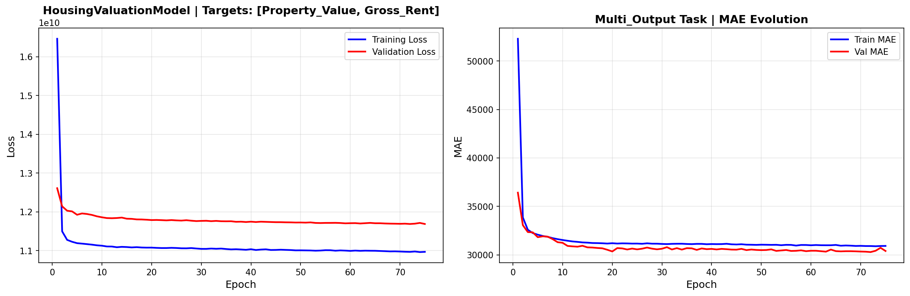

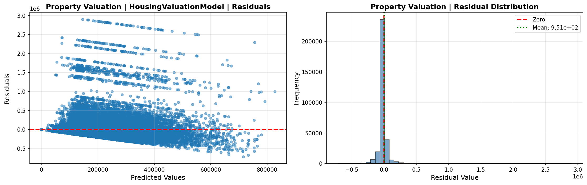

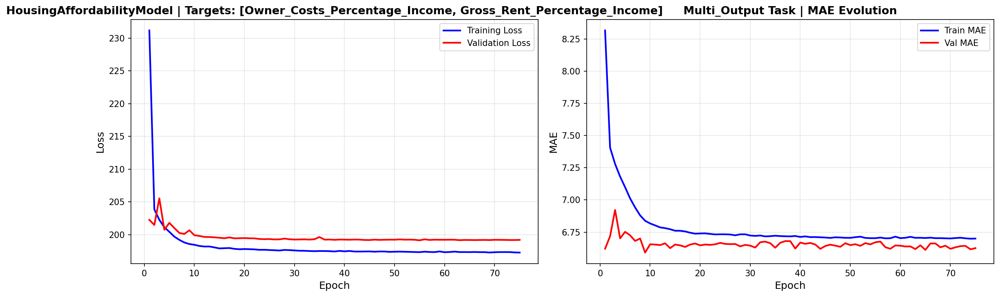

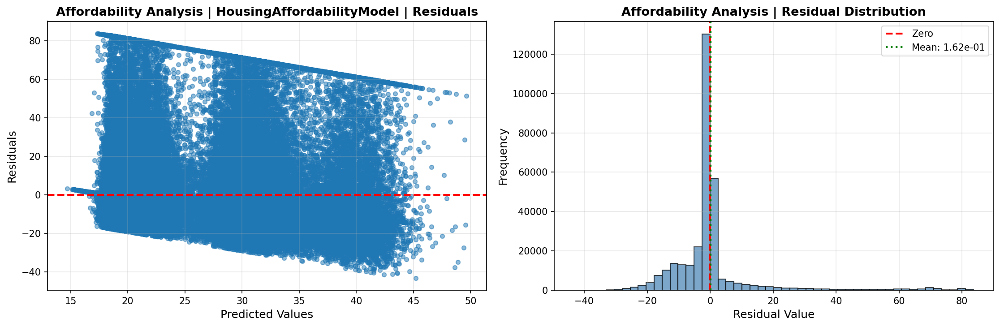

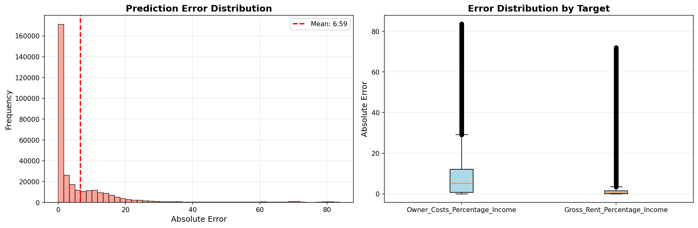

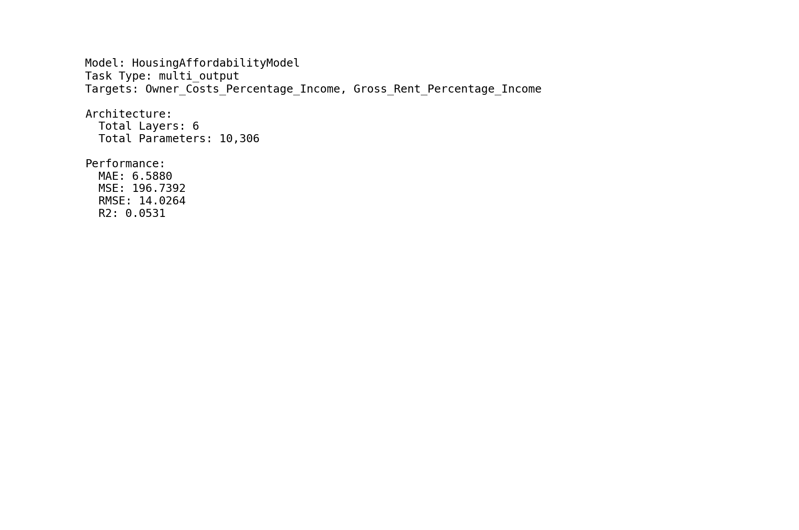

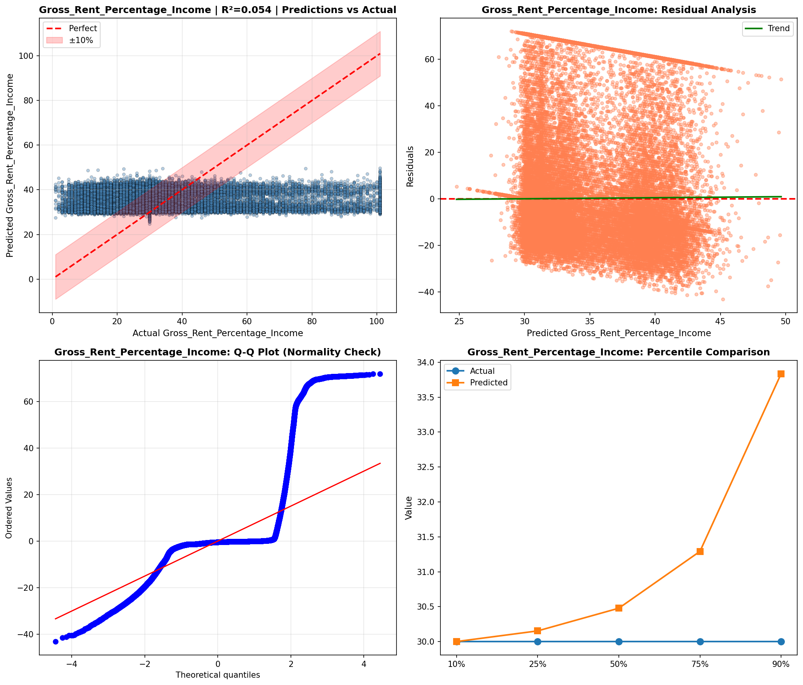

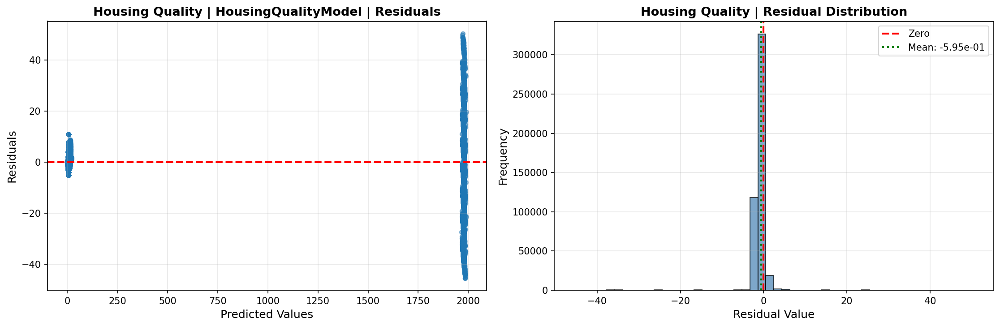

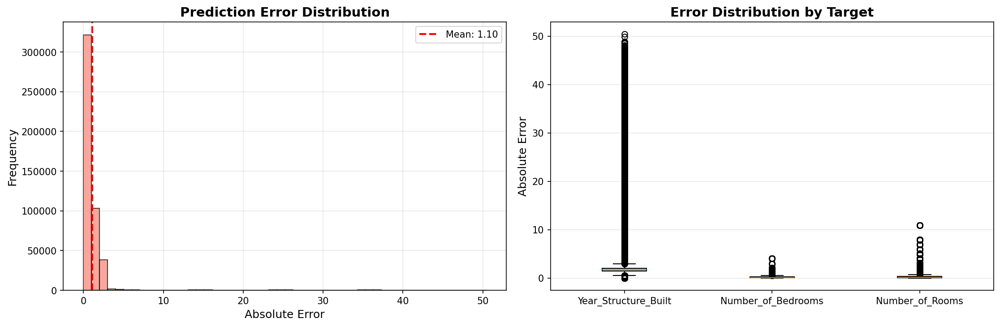

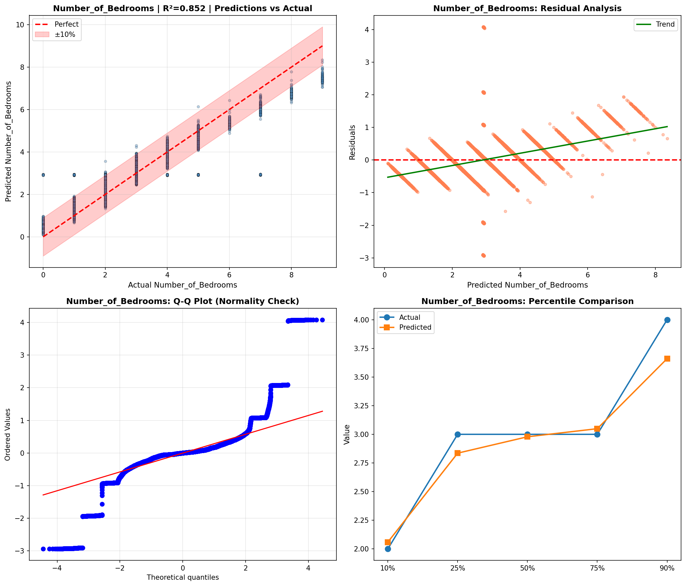

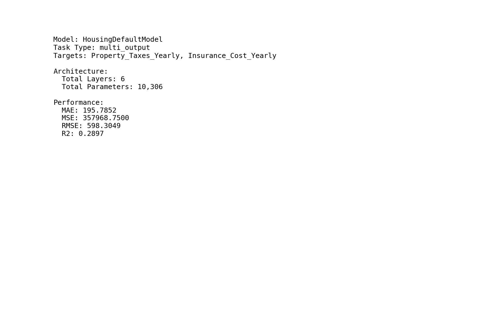

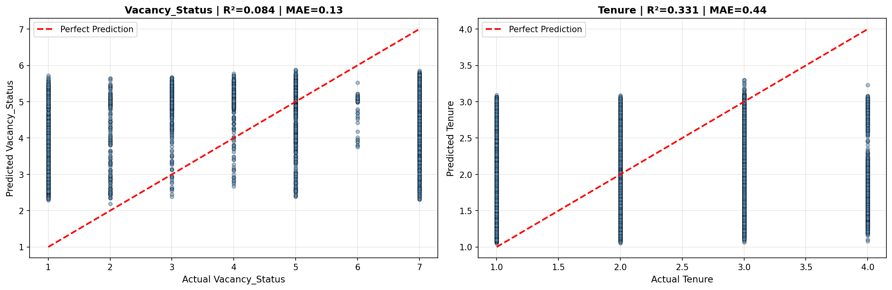

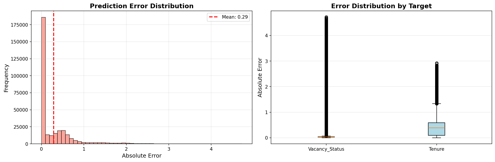

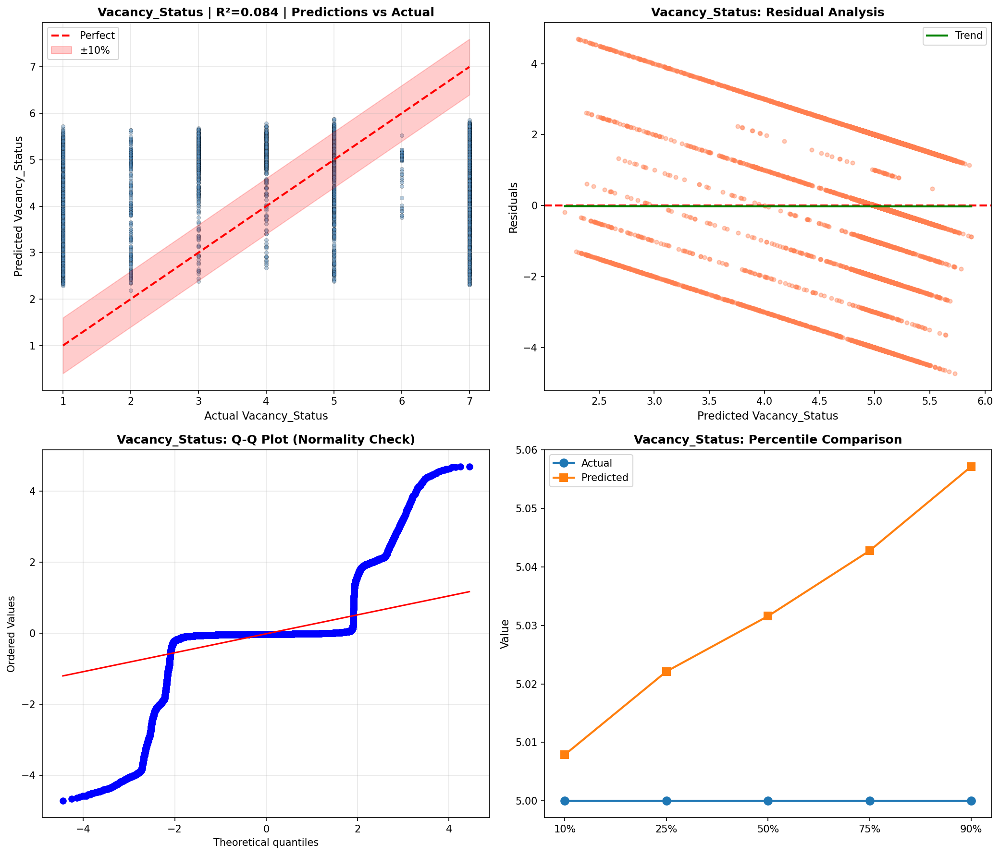

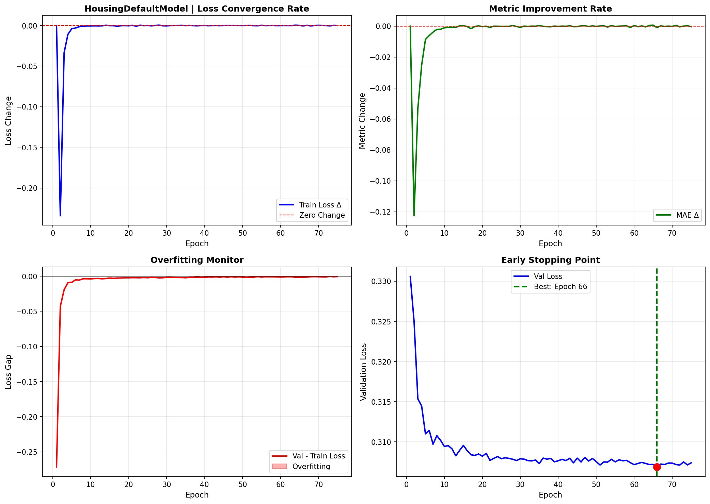

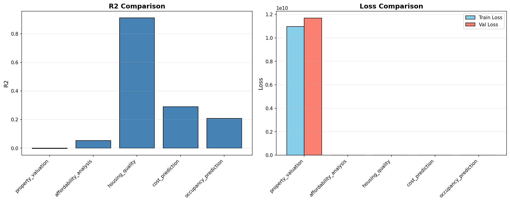

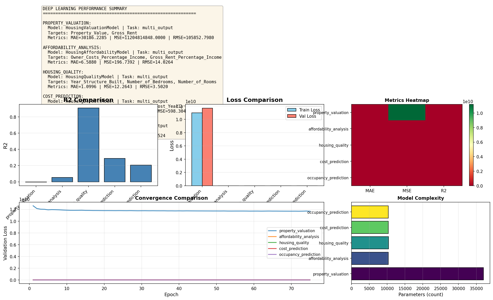

