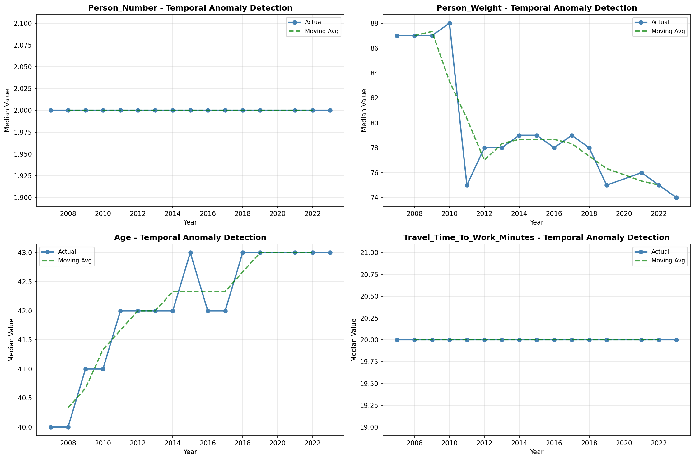
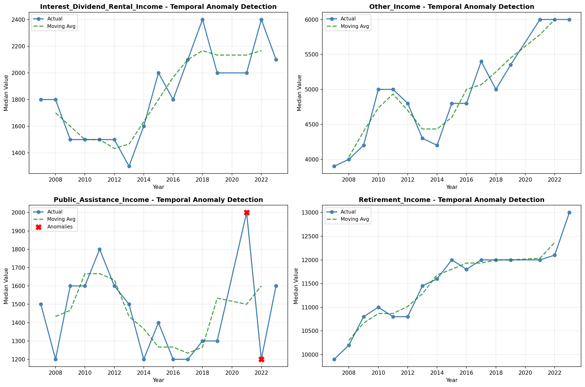

# Anomaly Detection

> Detection of unusual patterns and anomalies in temporal data, identifying values that deviate significantly from expected trends.

## Detection Methodology

| Parameter | Description |
| :--- | :--- |
| Method | Z-Score / Moving Average Deviation |
| Baseline | Moving average or trend line |
| Threshold | Values exceeding 2-3 standard deviations |
| Scope | Year-over-year and within-year patterns |

## Temporal Anomalies by Variable

_No temporal anomalies detected._
## Overall Statistics

| Statistic | Value |
| :--- | :--- |
| Total Anomalies Detected | 2 |
| Variables with Anomalies | 0 |
| Variables Analyzed | 0 |

## Visualizations

