# Statistical Analysis

> Comprehensive descriptive statistics including central tendency, dispersion, distribution characteristics, and weighted statistics using ACS sample weights.

## Summary Statistics

- **Variables Analyzed**: 41

### Income_Adjustment_Factor

| Statistic | Unweighted | Weighted (ACS) |
| :--- | :--- | :--- |
| Mean | 1,014,945.49 | 1,014,656.45 |
| Median | 1,010,207.00 | 1,014,656.45 |
| Std Deviation | 11,408.30 | — |
| Minimum | 1,001,264.00 | — |
| Maximum | 1,042,311.00 | — |
| Count | 61,036 | — |

> *Distribution is highly right-skewed (skewness: 1.31), light-tailed/platykurtic (kurtosis: 0.68).*

- **Coefficient of Variation**: 1.1 % (low variability)

### Property_Value

| Statistic | Unweighted | Weighted (ACS) |
| :--- | :--- | :--- |
| Mean | 295,968.15 | 291,252.74 |
| Median | 200,000.00 | 224,584.67 |
| Std Deviation | 428,683.04 | — |
| Minimum | 1.00 | — |
| Maximum | 6,031,000.00 | — |
| Count | 38,543 | — |

> *Distribution is highly right-skewed (skewness: 6.17), heavy-tailed/leptokurtic (kurtosis: 55.94).*

- **Coefficient of Variation**: 144.8 % (very high variability)

### Electricity_Cost_Monthly

| Statistic | Unweighted | Weighted (ACS) |
| :--- | :--- | :--- |
| Mean | 119.69 | 110.93 |
| Median | 100.00 | 93.12 |
| Std Deviation | 114.56 | — |
| Minimum | 1.00 | — |
| Maximum | 2,800.00 | — |
| Count | 65,382 | — |

> *Distribution is highly right-skewed (skewness: 9.55), heavy-tailed/leptokurtic (kurtosis: 185.41).*

- **Coefficient of Variation**: 95.7 % (high variability)

### Fuel_Cost_Monthly

| Statistic | Unweighted | Weighted (ACS) |
| :--- | :--- | :--- |
| Mean | 180.61 | 304.23 |
| Median | 2.00 | 170.12 |
| Std Deviation | 487.22 | — |
| Minimum | 1.00 | — |
| Maximum | 5,500.00 | — |
| Count | 47,922 | — |

> *Distribution is highly right-skewed (skewness: 4.33), heavy-tailed/leptokurtic (kurtosis: 25.09).*

- **Coefficient of Variation**: 269.8 % (very high variability)

### Gas_Cost_Monthly

| Statistic | Unweighted | Weighted (ACS) |
| :--- | :--- | :--- |
| Mean | 70.43 | 67.40 |
| Median | 40.00 | 39.38 |
| Std Deviation | 112.51 | — |
| Minimum | 1.00 | — |
| Maximum | 2,100.00 | — |
| Count | 56,816 | — |

> *Distribution is highly right-skewed (skewness: 7.54), heavy-tailed/leptokurtic (kurtosis: 107.02).*

- **Coefficient of Variation**: 159.8 % (very high variability)

### Insurance_Cost_Yearly

| Statistic | Unweighted | Weighted (ACS) |
| :--- | :--- | :--- |
| Mean | 1,138.06 | 1,089.85 |
| Median | 900.00 | 929.38 |
| Std Deviation | 921.80 | — |
| Minimum | 4.00 | — |
| Maximum | 8,700.00 | — |
| Count | 41,858 | — |

> *Distribution is highly right-skewed (skewness: 2.92), heavy-tailed/leptokurtic (kurtosis: 13.39).*

- **Coefficient of Variation**: 81.0 % (high variability)

### Water_Cost_Yearly

| Statistic | Unweighted | Weighted (ACS) |
| :--- | :--- | :--- |
| Mean | 336.13 | 373.25 |
| Median | 70.00 | 183.88 |
| Std Deviation | 449.07 | — |
| Minimum | 1.00 | — |
| Maximum | 3,200.00 | — |
| Count | 54,932 | — |

> *Distribution is highly right-skewed (skewness: 1.72), heavy-tailed/leptokurtic (kurtosis: 4.30).*

- **Coefficient of Variation**: 133.6 % (very high variability)

### Mobile_Home_Costs_Monthly

| Statistic | Unweighted | Weighted (ACS) |
| :--- | :--- | :--- |
| Mean | 1,524.18 | 1,903.50 |
| Median | 600.00 | 838.12 |
| Std Deviation | 2,267.56 | — |
| Minimum | 4.00 | — |
| Maximum | 30,900.00 | — |
| Count | 4,005 | — |

> *Distribution is highly right-skewed (skewness: 5.34), heavy-tailed/leptokurtic (kurtosis: 53.51).*

- **Coefficient of Variation**: 148.8 % (very high variability)

### First_Mortgage_Payment_Monthly

| Statistic | Unweighted | Weighted (ACS) |
| :--- | :--- | :--- |
| Mean | 898.24 | 1,037.34 |
| Median | 820.00 | 887.38 |
| Std Deviation | 771.44 | — |
| Minimum | 4.00 | — |
| Maximum | 5,800.00 | — |
| Count | 31,269 | — |

> *Distribution is highly right-skewed (skewness: 1.43), heavy-tailed/leptokurtic (kurtosis: 4.15).*

- **Coefficient of Variation**: 85.9 % (high variability)

### First_Mortgage_Includes_Taxes

| Statistic | Unweighted | Weighted (ACS) |
| :--- | :--- | :--- |
| Mean | 1.27 | 1.24 |
| Median | 1.00 | 1.00 |
| Std Deviation | 0.45 | — |
| Minimum | 1.00 | — |
| Maximum | 2.00 | — |
| Count | 24,965 | — |

> *Distribution is highly right-skewed (skewness: 1.02), light-tailed/platykurtic (kurtosis: -0.95).*

- **Coefficient of Variation**: 35.0 % (moderate variability)

### Second_Mortgage_Payment_Monthly

| Statistic | Unweighted | Weighted (ACS) |
| :--- | :--- | :--- |
| Mean | 421.35 | 427.13 |
| Median | 300.00 | 293.75 |
| Std Deviation | 442.49 | — |
| Minimum | 4.00 | — |
| Maximum | 8,000.00 | — |
| Count | 3,407 | — |

> *Distribution is highly right-skewed (skewness: 4.17), heavy-tailed/leptokurtic (kurtosis: 35.87).*

- **Coefficient of Variation**: 105.0 % (very high variability)

### Property_Taxes_Yearly

| Statistic | Unweighted | Weighted (ACS) |
| :--- | :--- | :--- |
| Mean | 299.99 | 285.00 |
| Median | 27.00 | 237.33 |
| Std Deviation | 1,186.19 | — |
| Minimum | 1.00 | — |
| Maximum | 23,500.00 | — |
| Count | 36,278 | — |

> *Distribution is highly right-skewed (skewness: 8.63), heavy-tailed/leptokurtic (kurtosis: 122.27).*

- **Coefficient of Variation**: 395.4 % (very high variability)

### Meals_Included_in_Rent

| Statistic | Unweighted | Weighted (ACS) |
| :--- | :--- | :--- |
| Mean | 1.97 | 1.96 |
| Median | 2.00 | 2.00 |
| Std Deviation | 0.17 | — |
| Minimum | 1.00 | — |
| Maximum | 2.00 | — |
| Count | 15,344 | — |

> *Distribution is highly left-skewed (skewness: -5.46), heavy-tailed/leptokurtic (kurtosis: 27.82).*

- **Coefficient of Variation**: 8.7 % (low variability)

### Rent_Amount_Monthly

| Statistic | Unweighted | Weighted (ACS) |
| :--- | :--- | :--- |
| Mean | 674.35 | 728.94 |
| Median | 590.00 | 639.38 |
| Std Deviation | 483.02 | — |
| Minimum | 4.00 | — |
| Maximum | 4,500.00 | — |
| Count | 15,344 | — |

> *Distribution is highly right-skewed (skewness: 2.76), heavy-tailed/leptokurtic (kurtosis: 13.55).*

- **Coefficient of Variation**: 71.6 % (high variability)

### Gross_Rent

| Statistic | Unweighted | Weighted (ACS) |
| :--- | :--- | :--- |
| Mean | 803.18 | 836.46 |
| Median | 707.00 | 750.19 |
| Std Deviation | 494.18 | — |
| Minimum | 4.00 | — |
| Maximum | 5,170.00 | — |
| Count | 14,383 | — |

> *Distribution is highly right-skewed (skewness: 2.40), heavy-tailed/leptokurtic (kurtosis: 10.77).*

- **Coefficient of Variation**: 61.5 % (high variability)

### Gross_Rent_Percentage_Income

| Statistic | Unweighted | Weighted (ACS) |
| :--- | :--- | :--- |
| Mean | 34.31 | 35.97 |
| Median | 26.00 | 27.44 |
| Std Deviation | 25.79 | — |
| Minimum | 1.00 | — |
| Maximum | 101.00 | — |
| Count | 14,172 | — |

> *Distribution is highly right-skewed (skewness: 1.35), light-tailed/platykurtic (kurtosis: 0.99).*

- **Coefficient of Variation**: 75.2 % (high variability)

### Selected_Monthly_Owner_Costs

| Statistic | Unweighted | Weighted (ACS) |
| :--- | :--- | :--- |
| Mean | 987.05 | 1,053.02 |
| Median | 746.00 | 861.75 |
| Std Deviation | 814.17 | — |
| Minimum | 2.00 | — |
| Maximum | 8,998.00 | — |
| Count | 49,734 | — |

> *Distribution is highly right-skewed (skewness: 2.17), heavy-tailed/leptokurtic (kurtosis: 8.11).*

- **Coefficient of Variation**: 82.5 % (high variability)

### Owner_Costs_Percentage_Income

| Statistic | Unweighted | Weighted (ACS) |
| :--- | :--- | :--- |
| Mean | 22.53 | 23.41 |
| Median | 16.00 | 17.31 |
| Std Deviation | 21.04 | — |
| Minimum | 1.00 | — |
| Maximum | 101.00 | — |
| Count | 49,408 | — |

> *Distribution is highly right-skewed (skewness: 2.13), heavy-tailed/leptokurtic (kurtosis: 4.78).*

- **Coefficient of Variation**: 93.4 % (high variability)

### Family_Income

| Statistic | Unweighted | Weighted (ACS) |
| :--- | :--- | :--- |
| Mean | 82,927.55 | 82,584.87 |
| Median | 64,510.00 | 65,090.25 |
| Std Deviation | 77,661.57 | — |
| Minimum | 1.00 | — |
| Maximum | 1,903,400.00 | — |
| Count | 43,422 | — |

> *Distribution is highly right-skewed (skewness: 3.94), heavy-tailed/leptokurtic (kurtosis: 30.49).*

- **Coefficient of Variation**: 93.6 % (high variability)

### Household_Income

| Statistic | Unweighted | Weighted (ACS) |
| :--- | :--- | :--- |
| Mean | 69,827.99 | 68,301.99 |
| Median | 51,400.00 | 51,054.38 |
| Std Deviation | 72,256.10 | — |
| Minimum | 1.00 | — |
| Maximum | 1,903,400.00 | — |
| Count | 66,326 | — |

> *Distribution is highly right-skewed (skewness: 4.11), heavy-tailed/leptokurtic (kurtosis: 33.53).*

- **Coefficient of Variation**: 103.5 % (very high variability)

### Specified_Rent_Unit

| Statistic | Unweighted | Weighted (ACS) |
| :--- | :--- | :--- |
| Mean | 0.21 | 0.28 |
| Median | 0.00 | 0.00 |
| Std Deviation | 0.41 | — |
| Minimum | 0.00 | — |
| Maximum | 1.00 | — |
| Count | 78,752 | — |

> *Distribution is highly right-skewed (skewness: 1.43), light-tailed/platykurtic (kurtosis: 0.04).*

- **Coefficient of Variation**: 194.2 % (very high variability)

### Specified_Value_Unit

| Statistic | Unweighted | Weighted (ACS) |
| :--- | :--- | :--- |
| Mean | 0.44 | 0.44 |
| Median | 0.00 | 0.00 |
| Std Deviation | 0.50 | — |
| Minimum | 0.00 | — |
| Maximum | 1.00 | — |
| Count | 78,752 | — |

> *Distribution is approximately symmetric (skewness: 0.25), light-tailed/platykurtic (kurtosis: -1.94).*

- **Coefficient of Variation**: 113.1 % (very high variability)

### Flag_Family_Income

| Statistic | Unweighted | Weighted (ACS) |
| :--- | :--- | :--- |
| Mean | 0.19 | 0.17 |
| Median | 0.00 | 0.00 |
| Std Deviation | 0.39 | — |
| Minimum | 0.00 | — |
| Maximum | 1.00 | — |
| Count | 60,770 | — |

> *Distribution is highly right-skewed (skewness: 1.59), light-tailed/platykurtic (kurtosis: 0.52).*

- **Coefficient of Variation**: 207.1 % (very high variability)

### Flag_Gross_Rent

| Statistic | Unweighted | Weighted (ACS) |
| :--- | :--- | :--- |
| Mean | 0.05 | 0.09 |
| Median | 0.00 | 0.00 |
| Std Deviation | 0.22 | — |
| Minimum | 0.00 | — |
| Maximum | 1.00 | — |
| Count | 39,198 | — |

> *Distribution is highly right-skewed (skewness: 4.00), heavy-tailed/leptokurtic (kurtosis: 13.97).*

- **Coefficient of Variation**: 423.3 % (very high variability)

### Flag_Household_Income

| Statistic | Unweighted | Weighted (ACS) |
| :--- | :--- | :--- |
| Mean | 0.28 | 0.28 |
| Median | 0.00 | 0.00 |
| Std Deviation | 0.45 | — |
| Minimum | 0.00 | — |
| Maximum | 1.00 | — |
| Count | 60,770 | — |

> *Distribution is moderately right-skewed (skewness: 0.96), light-tailed/platykurtic (kurtosis: -1.08).*

- **Coefficient of Variation**: 158.7 % (very high variability)

### Flag_First_Mortgage_Payment

| Statistic | Unweighted | Weighted (ACS) |
| :--- | :--- | :--- |
| Mean | 0.03 | 0.03 |
| Median | 0.00 | 0.00 |
| Std Deviation | 0.18 | — |
| Minimum | 0.00 | — |
| Maximum | 1.00 | — |
| Count | 78,752 | — |

> *Distribution is highly right-skewed (skewness: 5.25), heavy-tailed/leptokurtic (kurtosis: 25.52).*

- **Coefficient of Variation**: 543.0 % (very high variability)

### Flag_First_Mortgage_Taxes

| Statistic | Unweighted | Weighted (ACS) |
| :--- | :--- | :--- |
| Mean | 0.03 | 0.03 |
| Median | 0.00 | 0.00 |
| Std Deviation | 0.17 | — |
| Minimum | 0.00 | — |
| Maximum | 1.00 | — |
| Count | 78,752 | — |

> *Distribution is highly right-skewed (skewness: 5.69), heavy-tailed/leptokurtic (kurtosis: 30.38).*

- **Coefficient of Variation**: 586.1 % (very high variability)

### Flag_Meals_Included_Rent

| Statistic | Unweighted | Weighted (ACS) |
| :--- | :--- | :--- |
| Mean | 0.00 | 0.01 |
| Median | 0.00 | 0.00 |
| Std Deviation | 0.07 | — |
| Minimum | 0.00 | — |
| Maximum | 1.00 | — |
| Count | 78,752 | — |

> *Distribution is highly right-skewed (skewness: 14.07), heavy-tailed/leptokurtic (kurtosis: 195.90).*

- **Coefficient of Variation**: 1,413.9 % (very high variability)

### Flag_Rent_Amount

| Statistic | Unweighted | Weighted (ACS) |
| :--- | :--- | :--- |
| Mean | 0.02 | 0.02 |
| Median | 0.00 | 0.00 |
| Std Deviation | 0.13 | — |
| Minimum | 0.00 | — |
| Maximum | 1.00 | — |
| Count | 78,752 | — |

> *Distribution is highly right-skewed (skewness: 7.22), heavy-tailed/leptokurtic (kurtosis: 50.13).*

- **Coefficient of Variation**: 735.6 % (very high variability)

### Flag_Selected_Monthly_Owner_Costs

| Statistic | Unweighted | Weighted (ACS) |
| :--- | :--- | :--- |
| Mean | 0.22 | 0.22 |
| Median | 0.00 | 0.00 |
| Std Deviation | 0.41 | — |
| Minimum | 0.00 | — |
| Maximum | 1.00 | — |
| Count | 51,952 | — |

> *Distribution is highly right-skewed (skewness: 1.36), light-tailed/platykurtic (kurtosis: -0.16).*

- **Coefficient of Variation**: 188.8 % (very high variability)

### Flag_Second_Mortgage_Payment

| Statistic | Unweighted | Weighted (ACS) |
| :--- | :--- | :--- |
| Mean | 0.03 | 0.03 |
| Median | 0.00 | 0.00 |
| Std Deviation | 0.16 | — |
| Minimum | 0.00 | — |
| Maximum | 1.00 | — |
| Count | 78,752 | — |

> *Distribution is highly right-skewed (skewness: 5.89), heavy-tailed/leptokurtic (kurtosis: 32.67).*

- **Coefficient of Variation**: 605.3 % (very high variability)

### Flag_Property_Taxes

| Statistic | Unweighted | Weighted (ACS) |
| :--- | :--- | :--- |
| Mean | 0.10 | 0.09 |
| Median | 0.00 | 0.00 |
| Std Deviation | 0.30 | — |
| Minimum | 0.00 | — |
| Maximum | 1.00 | — |
| Count | 73,397 | — |

> *Distribution is highly right-skewed (skewness: 2.74), heavy-tailed/leptokurtic (kurtosis: 5.48).*

- **Coefficient of Variation**: 306.2 % (very high variability)

### Flag_Property_Value

| Statistic | Unweighted | Weighted (ACS) |
| :--- | :--- | :--- |
| Mean | 0.09 | 0.08 |
| Median | 0.00 | 0.00 |
| Std Deviation | 0.29 | — |
| Minimum | 0.00 | — |
| Maximum | 1.00 | — |
| Count | 78,752 | — |

> *Distribution is highly right-skewed (skewness: 2.84), heavy-tailed/leptokurtic (kurtosis: 6.06).*

- **Coefficient of Variation**: 315.5 % (very high variability)

### Flag_Water_Cost

| Statistic | Unweighted | Weighted (ACS) |
| :--- | :--- | :--- |
| Mean | 0.08 | 0.07 |
| Median | 0.00 | 0.00 |
| Std Deviation | 0.27 | — |
| Minimum | 0.00 | — |
| Maximum | 1.00 | — |
| Count | 5,355 | — |

> *Distribution is highly right-skewed (skewness: 3.08), heavy-tailed/leptokurtic (kurtosis: 7.48).*

- **Coefficient of Variation**: 337.6 % (very high variability)

### Annual_Rent_to_Value_Ratio

### Total_Monthly_Utility_Cost

| Statistic | Unweighted | Weighted (ACS) |
| :--- | :--- | :--- |
| Mean | 180.26 | 164.16 |
| Median | 150.00 | 137.00 |
| Std Deviation | 168.80 | — |
| Minimum | 2.00 | — |
| Maximum | 4,500.00 | — |
| Count | 65,611 | — |

> *Distribution is highly right-skewed (skewness: 7.80), heavy-tailed/leptokurtic (kurtosis: 128.64).*

- **Coefficient of Variation**: 93.6 % (high variability)

### Property_Tax_Rate

| Statistic | Unweighted | Weighted (ACS) |
| :--- | :--- | :--- |
| Mean | 19.76 | 21.55 |
| Median | 0.02 | 20.68 |
| Std Deviation | 63.11 | — |
| Minimum | 0.00 | — |
| Maximum | 1,300.00 | — |
| Count | 24,503 | — |

> *Distribution is highly right-skewed (skewness: 5.15), heavy-tailed/leptokurtic (kurtosis: 50.82).*

- **Coefficient of Variation**: 319.4 % (very high variability)

#### Weighted Statistics by Year

| Year | Weighted Mean | Weighted Median |
| :--- | :--- | :--- |
| 2007 | 171.30 | 164.71 |
| 2012 | 0.02 | 0.01 |
| 2013 | 0.06 | 0.01 |
| 2014 | 0.06 | 0.01 |
| 2015 | 0.02 | 0.01 |
| 2016 | 0.02 | 0.01 |
| 2017 | 0.02 | 0.01 |
| 2023 | 0.89 | 0.68 |

### Structure_Age

| Statistic | Unweighted | Weighted (ACS) |
| :--- | :--- | :--- |
| Mean | 1,863.98 | 1,877.58 |
| Median | 2,019.00 | 1,877.71 |
| Std Deviation | 529.66 | — |
| Minimum | 1.00 | — |
| Maximum | 2,023.00 | — |
| Count | 68,241 | — |

> *Distribution is highly left-skewed (skewness: -3.14), heavy-tailed/leptokurtic (kurtosis: 7.84).*

- **Coefficient of Variation**: 28.4 % (moderate variability)

### Structure_Age_Score

| Statistic | Unweighted | Weighted (ACS) |
| :--- | :--- | :--- |
| Mean | 0.04 | 0.04 |
| Median | 0.00 | 0.04 |
| Std Deviation | 0.15 | — |
| Minimum | 0.00 | — |
| Maximum | 0.99 | — |
| Count | 68,241 | — |

> *Distribution is highly right-skewed (skewness: 4.08), heavy-tailed/leptokurtic (kurtosis: 16.09).*

- **Coefficient of Variation**: 384.2 % (very high variability)

### Working_Age_Persons

| Statistic | Unweighted | Weighted (ACS) |
| :--- | :--- | :--- |
| Mean | 1.57 | 1.63 |
| Median | 1.00 | 1.69 |
| Std Deviation | 1.36 | — |
| Minimum | 0.00 | — |
| Maximum | 18.00 | — |
| Count | 66,959 | — |

> *Distribution is highly right-skewed (skewness: 1.14), heavy-tailed/leptokurtic (kurtosis: 3.04).*

- **Coefficient of Variation**: 87.0 % (high variability)

### Income_to_FPL_Ratio

| Statistic | Unweighted | Weighted (ACS) |
| :--- | :--- | :--- |
| Mean | 3.26 | 3.18 |
| Median | 2.47 | 2.44 |
| Std Deviation | 3.37 | — |
| Minimum | -1.00 | — |
| Maximum | 96.52 | — |
| Count | 66,959 | — |

> *Distribution is highly right-skewed (skewness: 4.54), heavy-tailed/leptokurtic (kurtosis: 41.16).*

- **Coefficient of Variation**: 103.3 % (very high variability)

## Distribution Analysis

### Skewed Distributions

> Variables with skewness > |0.5| indicate non-normal distributions. Consider log transformations for highly skewed variables in modeling.

| Variable | Skewness | Direction | Severity |
| :--- | :--- | :--- | :--- |
| Flag_Meals_Included_Rent | 14.068 | Right-skewed | High |
| Electricity_Cost_Monthly | 9.547 | Right-skewed | High |
| Property_Taxes_Yearly | 8.632 | Right-skewed | High |
| Total_Monthly_Utility_Cost | 7.802 | Right-skewed | High |
| Gas_Cost_Monthly | 7.540 | Right-skewed | High |
| Flag_Rent_Amount | 7.220 | Right-skewed | High |
| Property_Value | 6.169 | Right-skewed | High |
| Flag_Second_Mortgage_Payment | 5.888 | Right-skewed | High |
| Flag_First_Mortgage_Taxes | 5.690 | Right-skewed | High |
| Meals_Included_in_Rent | -5.461 | Left-skewed | High |
| Mobile_Home_Costs_Monthly | 5.343 | Right-skewed | High |
| Flag_First_Mortgage_Payment | 5.246 | Right-skewed | High |
| Property_Tax_Rate | 5.150 | Right-skewed | High |
| Income_to_FPL_Ratio | 4.535 | Right-skewed | High |
| Fuel_Cost_Monthly | 4.330 | Right-skewed | High |
| Second_Mortgage_Payment_Monthly | 4.165 | Right-skewed | High |
| Household_Income | 4.106 | Right-skewed | High |
| Structure_Age_Score | 4.084 | Right-skewed | High |
| Flag_Gross_Rent | 3.997 | Right-skewed | High |
| Family_Income | 3.938 | Right-skewed | High |

- **Total Skewed Variables**: 39

- **Right-skewed**: 37

- **Left-skewed**: 2

## Variance Analysis

### Coefficient of Variation Ranking

> CV (Coefficient of Variation) = (Std Dev / Mean) × 100%. Higher CV indicates greater relative variability.

| Variable | CV (%) | Std Dev | Mean | Variability |
| :--- | :--- | :--- | :--- | :--- |
| Flag_Meals_Included_Rent | 1413.9% | 0.07 | 0.00 | Very High |
| Flag_Rent_Amount | 735.6% | 0.13 | 0.02 | Very High |
| Flag_Second_Mortgage_Payment | 605.3% | 0.16 | 0.03 | Very High |
| Flag_First_Mortgage_Taxes | 586.1% | 0.17 | 0.03 | Very High |
| Flag_First_Mortgage_Payment | 543.0% | 0.18 | 0.03 | Very High |
| Flag_Gross_Rent | 423.3% | 0.22 | 0.05 | Very High |
| Property_Taxes_Yearly | 395.4% | 1,186.19 | 299.99 | Very High |
| Structure_Age_Score | 384.2% | 0.15 | 0.04 | Very High |
| Flag_Water_Cost | 337.6% | 0.27 | 0.08 | Very High |
| Property_Tax_Rate | 319.4% | 63.11 | 19.76 | Very High |
| Flag_Property_Value | 315.5% | 0.29 | 0.09 | Very High |
| Flag_Property_Taxes | 306.2% | 0.30 | 0.10 | Very High |
| Fuel_Cost_Monthly | 269.8% | 487.22 | 180.61 | Very High |
| Flag_Family_Income | 207.1% | 0.39 | 0.19 | Very High |
| Specified_Rent_Unit | 194.2% | 0.41 | 0.21 | Very High |
| Flag_Selected_Monthly_Owner_Costs | 188.8% | 0.41 | 0.22 | Very High |
| Gas_Cost_Monthly | 159.8% | 112.51 | 70.43 | Very High |
| Flag_Household_Income | 158.7% | 0.45 | 0.28 | Very High |
| Mobile_Home_Costs_Monthly | 148.8% | 2,267.56 | 1,524.18 | Very High |
| Property_Value | 144.8% | 428,683.04 | 295,968.15 | Very High |

- **Average CV**: 234.8 %

- **High Variance Variables (CV > 50%)**: 36

## Visualizations

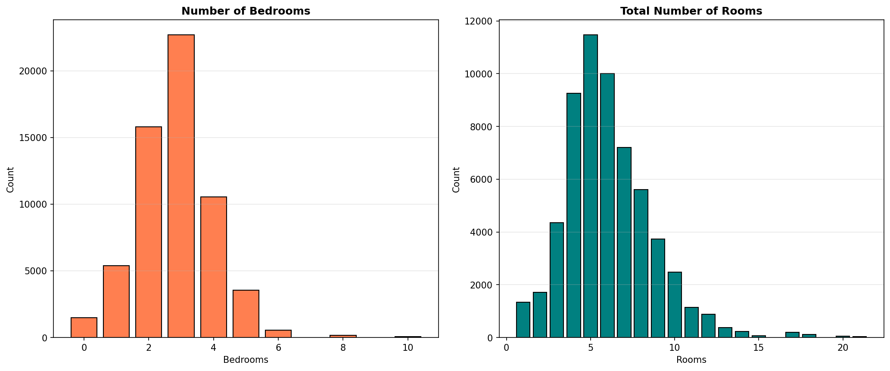

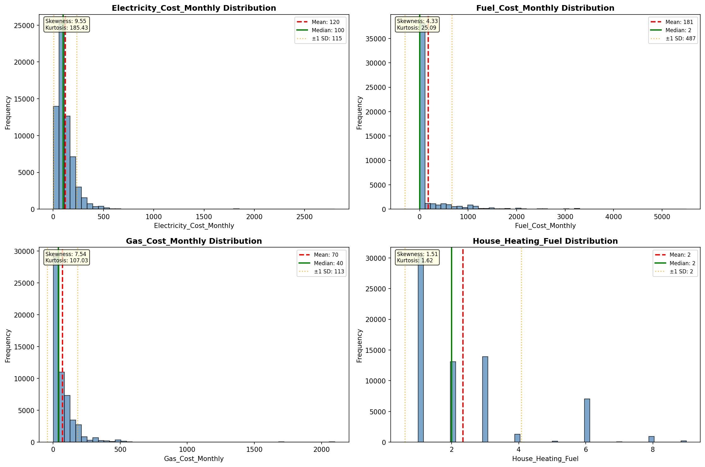

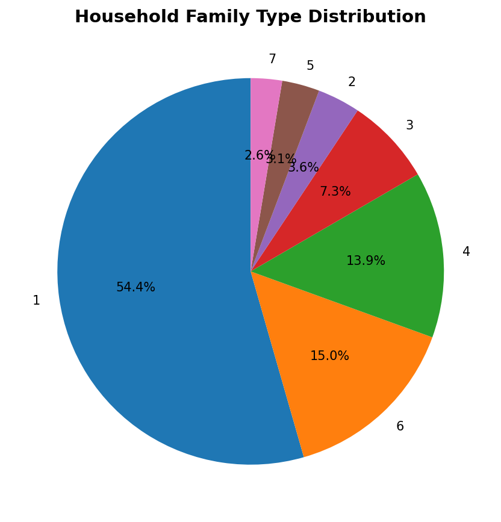

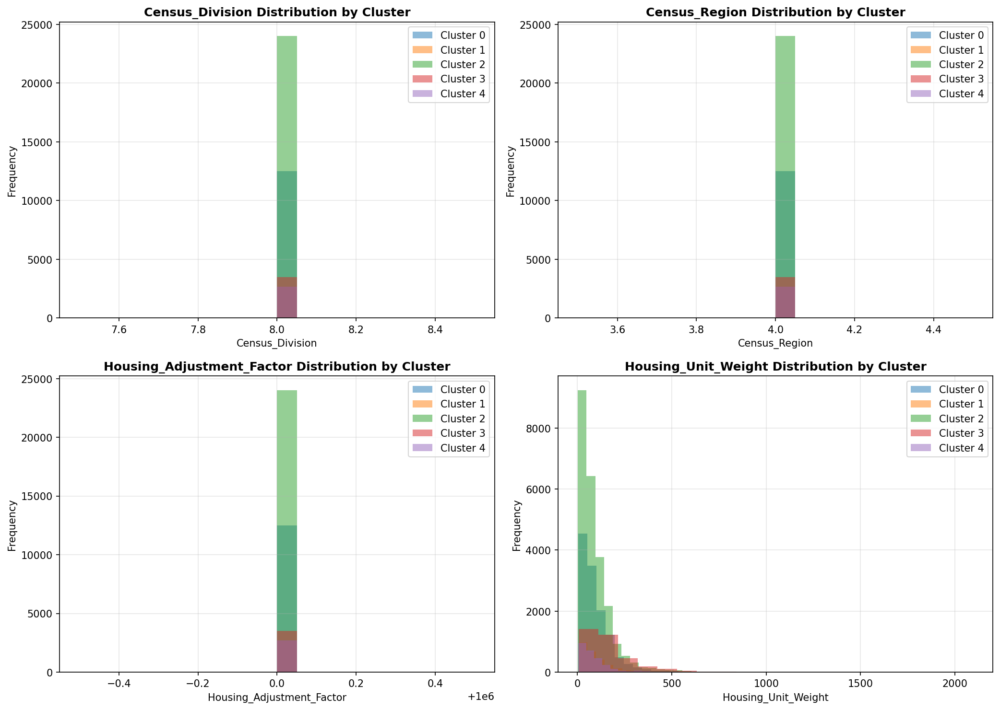

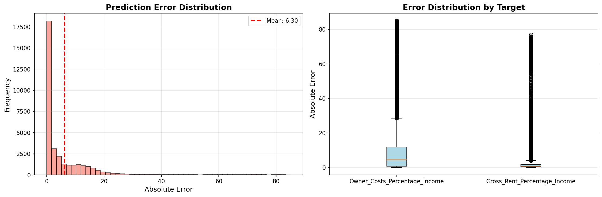

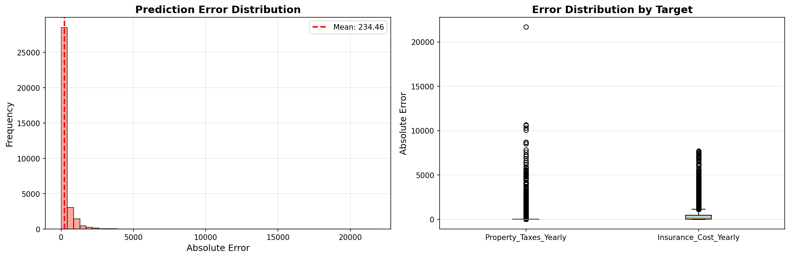

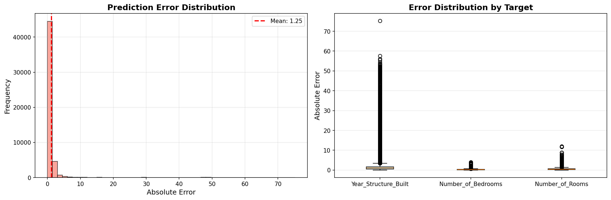

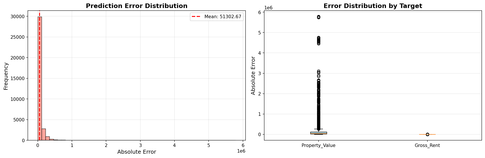

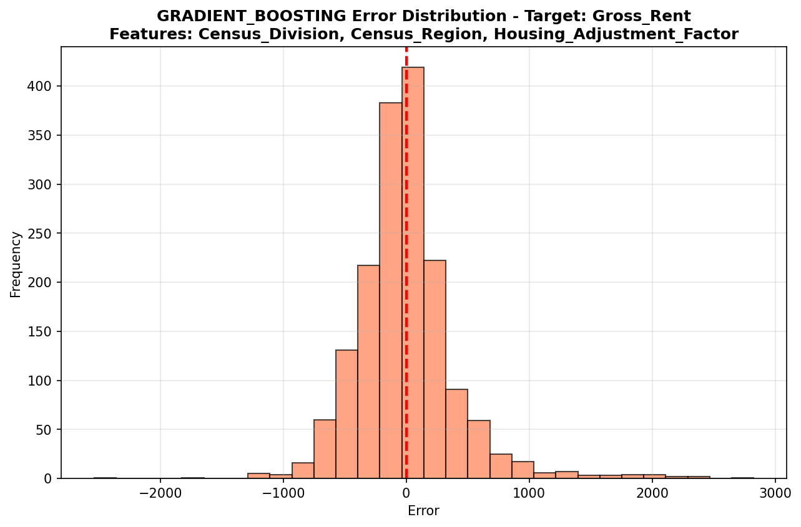

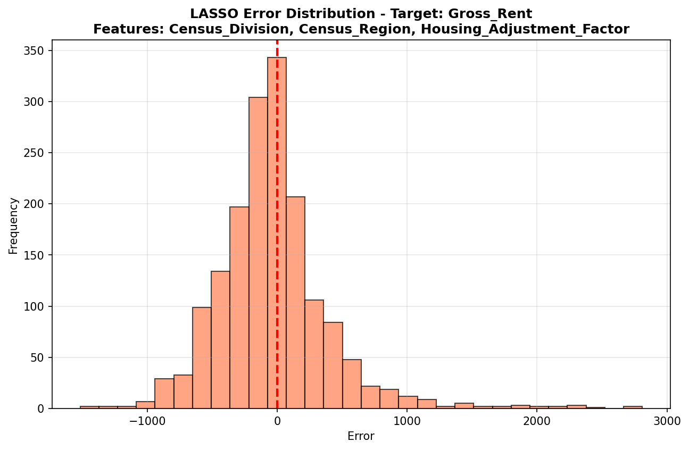

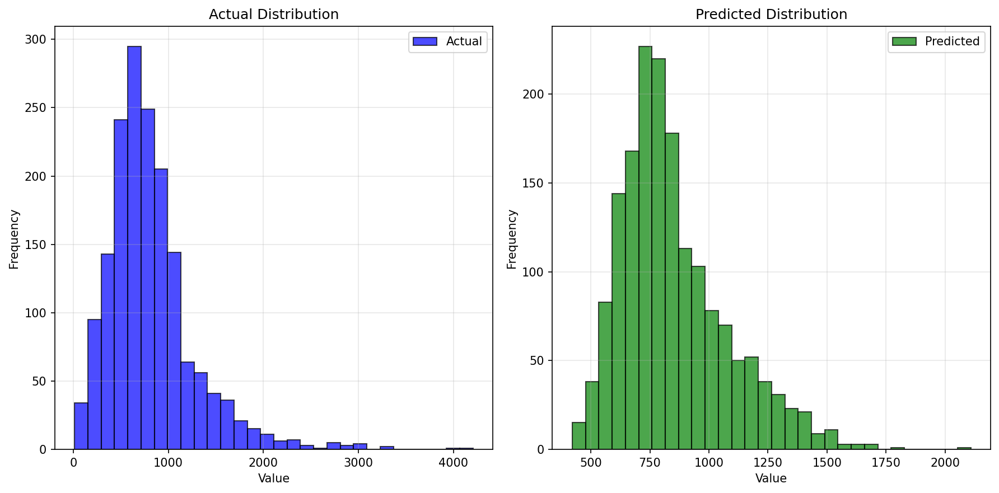

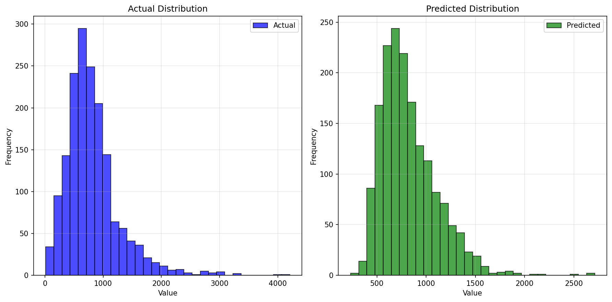

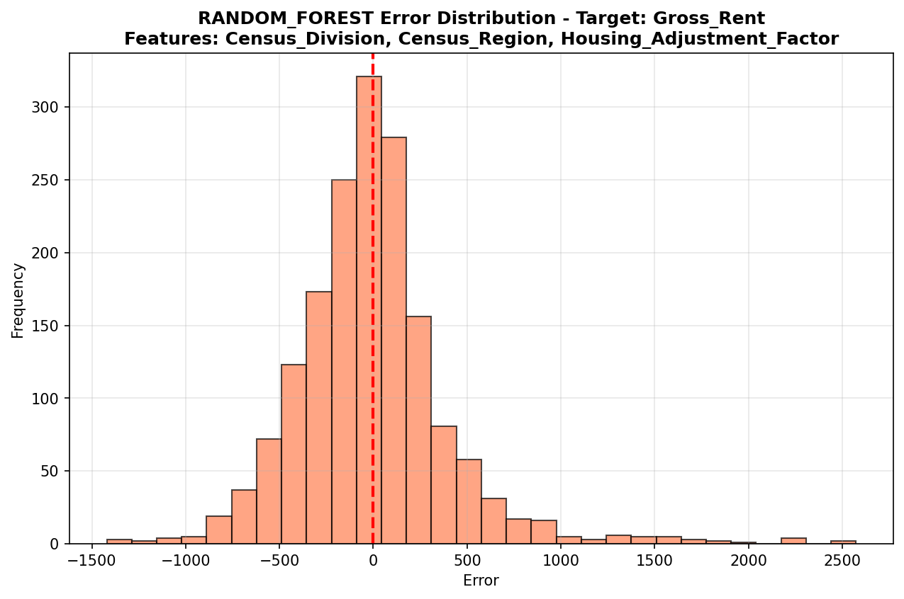

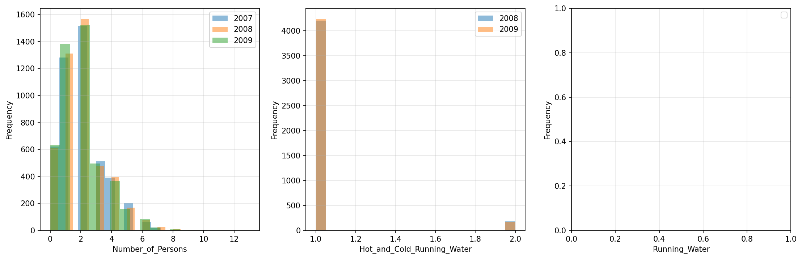

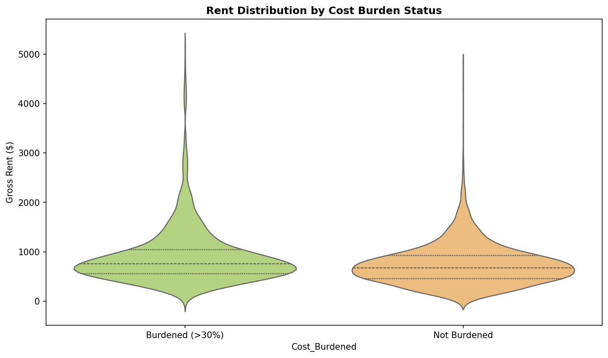

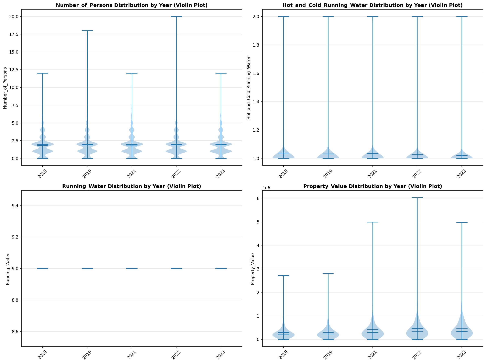

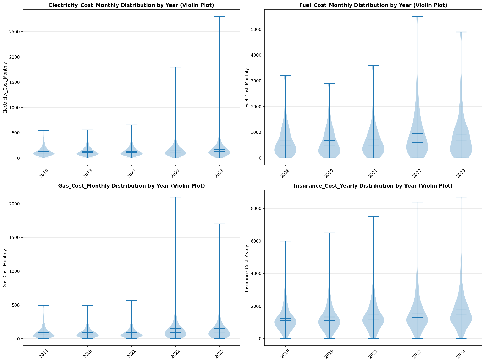

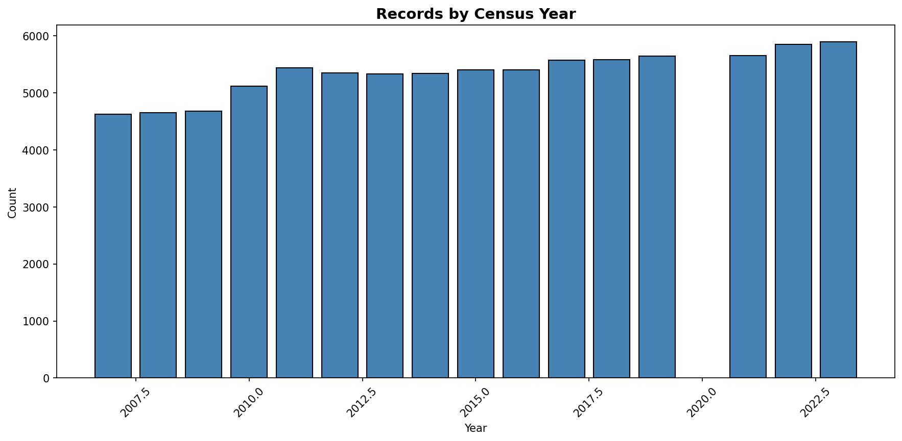
