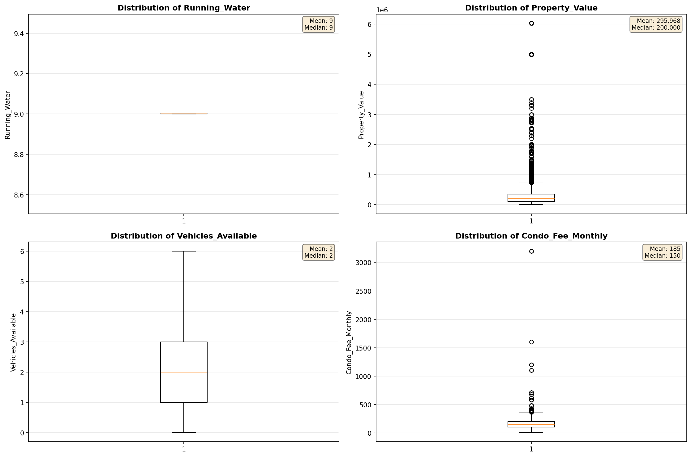
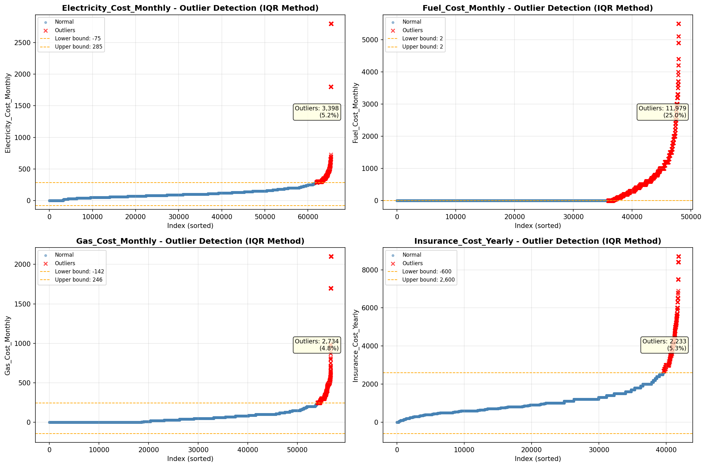

# Outlier Detection

> Statistical outlier detection using IQR (Interquartile Range) method. Outliers are values falling outside Q1 - 1.5×IQR or Q3 + 1.5×IQR bounds.

## Detection Methodology

| Parameter | Value | Description |
| :--- | :--- | :--- |
| Method | IQR | Outlier detection algorithm |
| Lower Bound | Q1 - 1.5 × IQR | Values below are outliers |
| Upper Bound | Q3 + 1.5 × IQR | Values above are outliers |
| IQR Definition | Q3 - Q1 | Interquartile Range |

> **Note**: The IQR method is robust to extreme values and works well for approximately symmetric distributions.

## Outlier Summary

_No outlier summary available._
## High Outlier Rate Variables

> Variables with outlier rate > 5% may indicate data quality issues, non-normal distributions, or genuinely extreme values.

- **('Fuel_Cost_Monthly', 24.996869913609615)**: 0 outliers (0.00%)

- **('Flag_Selected_Monthly_Owner_Costs', 21.912534647366797)**: 0 outliers (0.00%)

- **('Specified_Rent_Unit', 20.951848841934172)**: 0 outliers (0.00%)

- **('Property_Tax_Rate', 19.866955066726526)**: 0 outliers (0.00%)

- **('Flag_Family_Income', 18.90735560309363)**: 0 outliers (0.00%)

- **('Property_Taxes_Yearly', 10.086002535972215)**: 0 outliers (0.00%)

- **('Flag_Property_Taxes', 9.63799610338297)**: 0 outliers (0.00%)

- **('Income_Adjustment_Factor', 9.584507503768268)**: 0 outliers (0.00%)

- **('Structure_Age', 9.271552292610014)**: 0 outliers (0.00%)

- **('Flag_Property_Value', 9.12738724095896)**: 0 outliers (0.00%)

- **('Gross_Rent_Percentage_Income', 8.799040361275754)**: 0 outliers (0.00%)

- **('Flag_Water_Cost', 8.067226890756302)**: 0 outliers (0.00%)

- **('Structure_Age_Score', 7.847188640260254)**: 0 outliers (0.00%)

- **('Owner_Costs_Percentage_Income', 7.597959844559586)**: 0 outliers (0.00%)

- **('Property_Value', 6.789819163012739)**: 0 outliers (0.00%)

> *Consider investigating these variables for data entry errors, applying transformations, or using robust statistical methods.*

## Visualizations

