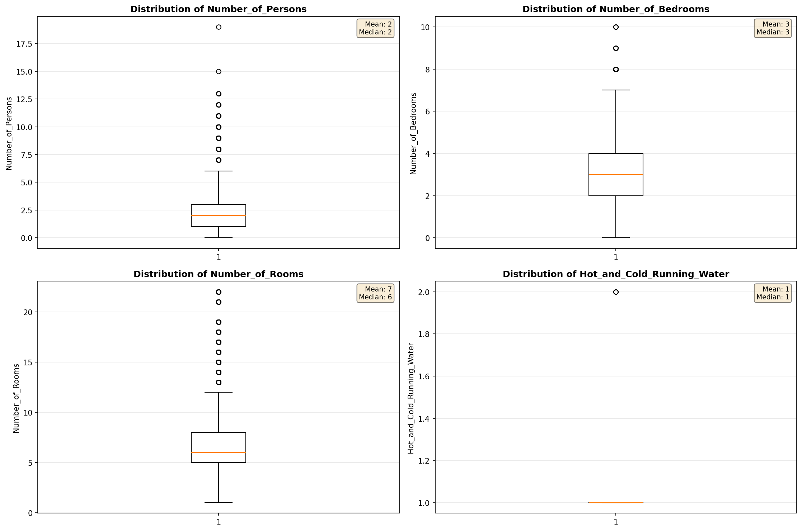
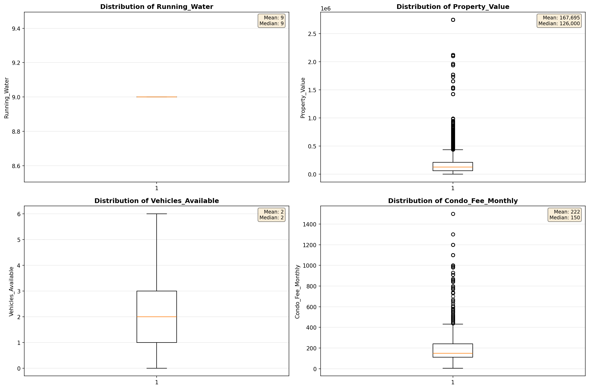
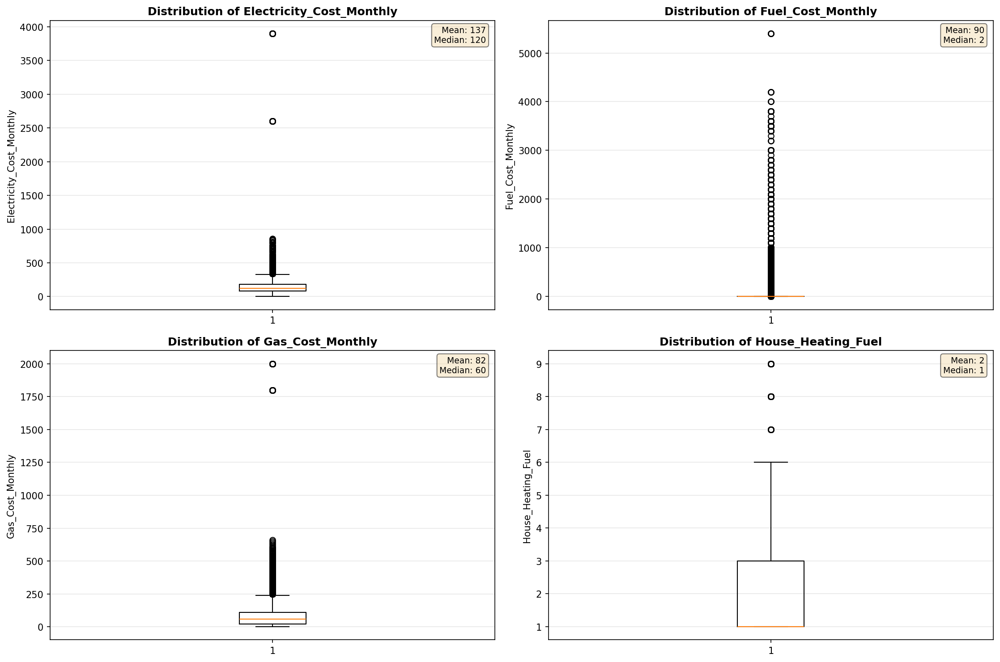
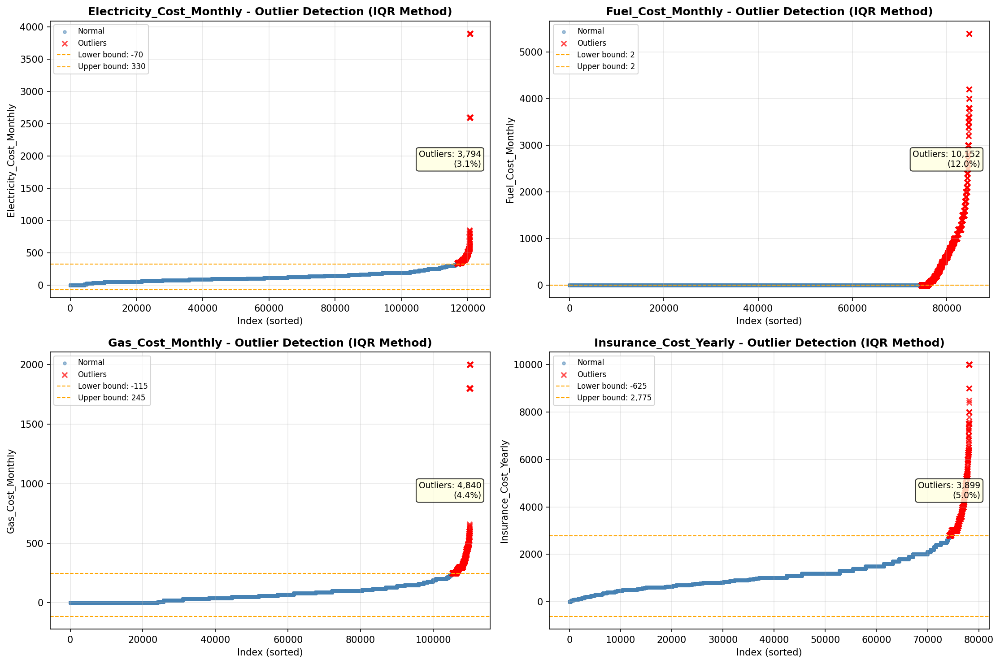

# Outlier Detection

> Statistical outlier detection using IQR (Interquartile Range) method. Outliers are values falling outside Q1 - 1.5×IQR or Q3 + 1.5×IQR bounds.

## Detection Methodology

| Parameter | Value | Description |
| :--- | :--- | :--- |
| Method | IQR | Outlier detection algorithm |
| Lower Bound | Q1 - 1.5 × IQR | Values below are outliers |
| Upper Bound | Q3 + 1.5 × IQR | Values above are outliers |
| IQR Definition | Q3 - Q1 | Interquartile Range |

> **Note**: The IQR method is robust to extreme values and works well for approximately symmetric distributions.

## Outlier Summary

_No outlier summary available._
## High Outlier Rate Variables

> Variables with outlier rate > 5% may indicate data quality issues, non-normal distributions, or genuinely extreme values.

- **('Flag_Selected_Monthly_Owner_Costs', 24.01724078321098)**: 0 outliers (0.00%)

- **('Specified_Rent_Unit', 23.254400097273308)**: 0 outliers (0.00%)

- **('Property_Tax_Rate', 20.62954740289715)**: 0 outliers (0.00%)

- **('Flag_Family_Income', 18.838420700066987)**: 0 outliers (0.00%)

- **('Fuel_Cost_Monthly', 11.97635872450364)**: 0 outliers (0.00%)

- **('Flag_Property_Taxes', 10.062596153063467)**: 0 outliers (0.00%)

- **('Flag_Water_Cost', 9.602838502918623)**: 0 outliers (0.00%)

- **('Gross_Rent_Percentage_Income', 9.41943564429382)**: 0 outliers (0.00%)

- **('Income_Adjustment_Factor', 9.346652215094082)**: 0 outliers (0.00%)

- **('Structure_Age', 9.011922660046851)**: 0 outliers (0.00%)

- **('Property_Taxes_Yearly', 8.702060548890135)**: 0 outliers (0.00%)

- **('Structure_Age_Score', 7.636970735288975)**: 0 outliers (0.00%)

- **('Flag_Gross_Rent', 7.243752263672583)**: 0 outliers (0.00%)

- **('Owner_Costs_Percentage_Income', 7.031795946890286)**: 0 outliers (0.00%)

- **('Flag_Property_Value', 6.758215034805605)**: 0 outliers (0.00%)

> *Consider investigating these variables for data entry errors, applying transformations, or using robust statistical methods.*

## Visualizations

