# Deep Learning Models

> Neural network analysis using TensorFlow/Keras for complex pattern recognition and multi-output prediction tasks.

## Deep Learning Summary

- **Total Tasks**: 5

- **Tasks**: Property Valuation, Affordability Analysis, Housing Quality, Cost Prediction, Occupancy Prediction

### Aggregate Statistics

| Metric | Value |
| :--- | :--- |
| Total Parameters | 78,283 |
| Average Validation Loss | 1874634116.2201 |
| Number of Tasks | 5 |

## Task: Property Valuation

### Model Configuration

| Property | Value |
| :--- | :--- |
| Model Type | HousingValuationModel |
| Task Type | Multi_Output |
| Target Variables | Property_Value, Gross_Rent |
| Number of Targets | 2 |
| Input Features | 10 |

### Network Architecture

| Component | Value | Notes |
| :--- | :--- | :--- |
| Total Layers | 7 | Including input and output |
| Total Parameters | 36,994 | Trainable weights |
| Parameters per Layer | 5,284 | Average |

### Performance Metrics

| Metric | Value | Assessment |
| :--- | :--- | :--- |
| Training Loss | 9361314816.0000 | Final epoch |
| Validation Loss | 9372610560.0000 | Final epoch |
| Loss Gap | 11295744.0000 | HIGH overfitting risk |

> *Model may be overfitting significantly*

#### Test Set Metrics

| Metric | Value | Description |
| :--- | :--- | :--- |
| MAE | 26719.0742 | Mean Absolute Error (lower is better) |
| MSE | 8551740416.0000 | Mean Squared Error (lower is better) |
| RMSE | 92475.6207 | Root Mean Squared Error (lower is better) |
| R2 | -0.3877 | R-squared (higher is better) |

### Training Analysis

| Training Statistic | Value |
| :--- | :--- |
| Epochs Trained | 75 |
| Initial Training Loss | 21076043776.0000 |
| Final Training Loss | 9361314816.0000 |
| Loss Improvement | 55.6% |
| Initial Validation Loss | 20615507968.0000 |
| Final Validation Loss | 9372610560.0000 |
| Validation Improvement | 54.5% |

#### Convergence Assessment

- **Status**: Fully converged (< 1% change in last 10 epochs)

- **Last 10 epochs change**: 0.08%

## Task: Affordability Analysis

### Model Configuration

| Property | Value |
| :--- | :--- |
| Model Type | HousingAffordabilityModel |
| Task Type | Multi_Output |
| Target Variables | Owner_Costs_Percentage_Income, Gross_Rent_Percentage_Income |
| Number of Targets | 2 |
| Input Features | 10 |

### Network Architecture

| Component | Value | Notes |
| :--- | :--- | :--- |
| Total Layers | 6 | Including input and output |
| Total Parameters | 10,306 | Trainable weights |
| Parameters per Layer | 1,717 | Average |

### Performance Metrics

| Metric | Value | Assessment |
| :--- | :--- | :--- |
| Training Loss | 164.0176 | Final epoch |
| Validation Loss | 163.7546 | Final epoch |
| Loss Gap | -0.2630 | NONE overfitting risk |

> *Good generalization*

#### Test Set Metrics

| Metric | Value | Description |
| :--- | :--- | :--- |
| MAE | 6.0098 | Mean Absolute Error (lower is better) |
| MSE | 169.7414 | Mean Squared Error (lower is better) |
| RMSE | 13.0285 | Root Mean Squared Error (lower is better) |
| R2 | 0.0778 | R-squared (higher is better) |

### Training Analysis

| Training Statistic | Value |
| :--- | :--- |
| Epochs Trained | 75 |
| Initial Training Loss | 256.1208 |
| Final Training Loss | 164.0176 |
| Loss Improvement | 36.0% |
| Initial Validation Loss | 187.8720 |
| Final Validation Loss | 163.7546 |
| Validation Improvement | 12.8% |

#### Convergence Assessment

- **Status**: Fully converged (< 1% change in last 10 epochs)

- **Last 10 epochs change**: 0.00%

## Task: Housing Quality

### Model Configuration

| Property | Value |
| :--- | :--- |
| Model Type | HousingQualityModel |
| Task Type | Multi_Output |
| Target Variables | Year_Structure_Built, Number_of_Bedrooms, Number_of_Rooms |
| Number of Targets | 3 |
| Input Features | 10 |

### Network Architecture

| Component | Value | Notes |
| :--- | :--- | :--- |
| Total Layers | 6 | Including input and output |
| Total Parameters | 10,371 | Trainable weights |
| Parameters per Layer | 1,728 | Average |

### Performance Metrics

| Metric | Value | Assessment |
| :--- | :--- | :--- |
| Training Loss | 295.0461 | Final epoch |
| Validation Loss | 11.7710 | Final epoch |
| Loss Gap | -283.2751 | NONE overfitting risk |

> *Good generalization*

#### Test Set Metrics

| Metric | Value | Description |
| :--- | :--- | :--- |
| MAE | 1.1212 | Mean Absolute Error (lower is better) |
| MSE | 11.8672 | Mean Squared Error (lower is better) |
| RMSE | 3.4449 | Root Mean Squared Error (lower is better) |
| R2 | 0.8145 | R-squared (higher is better) |

### Training Analysis

| Training Statistic | Value |
| :--- | :--- |
| Epochs Trained | 75 |
| Initial Training Loss | 26395.8418 |
| Final Training Loss | 295.0461 |
| Loss Improvement | 98.9% |
| Initial Validation Loss | 11880.1992 |
| Final Validation Loss | 11.7710 |
| Validation Improvement | 99.9% |

#### Convergence Assessment

- **Status**: Still improving (> 5% change)

- **Last 10 epochs change**: 8.09%

## Task: Cost Prediction

### Model Configuration

| Property | Value |
| :--- | :--- |
| Model Type | HousingDefaultModel |
| Task Type | Multi_Output |
| Target Variables | Property_Taxes_Yearly, Insurance_Cost_Yearly |
| Number of Targets | 2 |
| Input Features | 10 |

### Network Architecture

| Component | Value | Notes |
| :--- | :--- | :--- |
| Total Layers | 6 | Including input and output |
| Total Parameters | 10,306 | Trainable weights |
| Parameters per Layer | 1,717 | Average |

### Performance Metrics

| Metric | Value | Assessment |
| :--- | :--- | :--- |
| Training Loss | 471511.9688 | Final epoch |
| Validation Loss | 559845.2500 | Final epoch |
| Loss Gap | 88333.2812 | HIGH overfitting risk |

> *Model may be overfitting significantly*

#### Test Set Metrics

| Metric | Value | Description |
| :--- | :--- | :--- |
| MAE | 261.4303 | Mean Absolute Error (lower is better) |
| MSE | 504707.1250 | Mean Squared Error (lower is better) |
| RMSE | 710.4274 | Root Mean Squared Error (lower is better) |
| R2 | 0.3045 | R-squared (higher is better) |

### Training Analysis

| Training Statistic | Value |
| :--- | :--- |
| Epochs Trained | 75 |
| Initial Training Loss | 890748.8750 |
| Final Training Loss | 471511.9688 |
| Loss Improvement | 47.1% |
| Initial Validation Loss | 750482.3125 |
| Final Validation Loss | 559845.2500 |
| Validation Improvement | 25.4% |

#### Convergence Assessment

- **Status**: Fully converged (< 1% change in last 10 epochs)

- **Last 10 epochs change**: 0.11%

## Task: Occupancy Prediction

### Model Configuration

| Property | Value |
| :--- | :--- |
| Model Type | HousingDefaultModel |
| Task Type | Multi_Output |
| Target Variables | Vacancy_Status, Tenure |
| Number of Targets | 2 |
| Input Features | 10 |

### Network Architecture

| Component | Value | Notes |
| :--- | :--- | :--- |
| Total Layers | 6 | Including input and output |
| Total Parameters | 10,306 | Trainable weights |
| Parameters per Layer | 1,717 | Average |

### Performance Metrics

| Metric | Value | Assessment |
| :--- | :--- | :--- |
| Training Loss | 0.3270 | Final epoch |
| Validation Loss | 0.3250 | Final epoch |
| Loss Gap | -0.0020 | NONE overfitting risk |

> *Good generalization*

#### Test Set Metrics

| Metric | Value | Description |
| :--- | :--- | :--- |
| MAE | 0.2893 | Mean Absolute Error (lower is better) |
| MSE | 0.3188 | Mean Squared Error (lower is better) |
| RMSE | 0.5646 | Root Mean Squared Error (lower is better) |
| R2 | 0.2455 | R-squared (higher is better) |

### Training Analysis

| Training Statistic | Value |
| :--- | :--- |
| Epochs Trained | 75 |
| Initial Training Loss | 1.1516 |
| Final Training Loss | 0.3270 |
| Loss Improvement | 71.6% |
| Initial Validation Loss | 0.7044 |
| Final Validation Loss | 0.3250 |
| Validation Improvement | 53.9% |

#### Convergence Assessment

- **Status**: Fully converged (< 1% change in last 10 epochs)

- **Last 10 epochs change**: 0.18%

## Cross-Task Comparison

| Task | Model Type | Parameters | Train Loss | Val Loss | Gap |
| :--- | :--- | :--- | :--- | :--- | :--- |
| Property Valuation | HousingValuationModel | 36,994 | 9361314816.0000 | 9372610560.0000 | 11295744.0000 |
| Affordability Analysis | HousingAffordabilityModel | 10,306 | 164.0176 | 163.7546 | -0.2630 |
| Housing Quality | HousingQualityModel | 10,371 | 295.0461 | 11.7710 | -283.2751 |
| Cost Prediction | HousingDefaultModel | 10,306 | 471511.9688 | 559845.2500 | 88333.2812 |
| Occupancy Prediction | HousingDefaultModel | 10,306 | 0.3270 | 0.3250 | -0.0020 |

## Visualizations

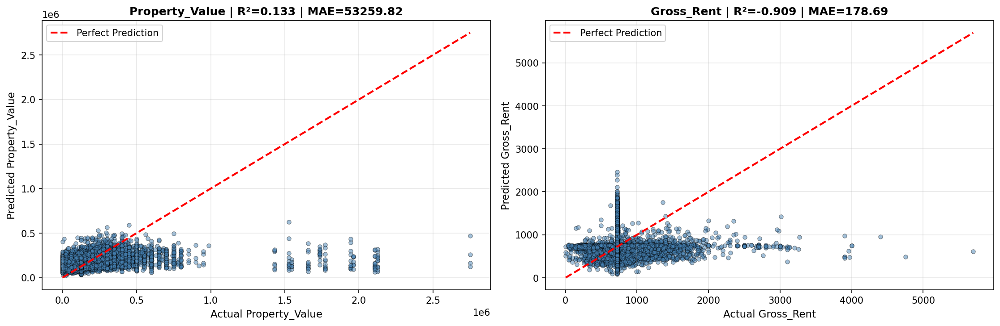

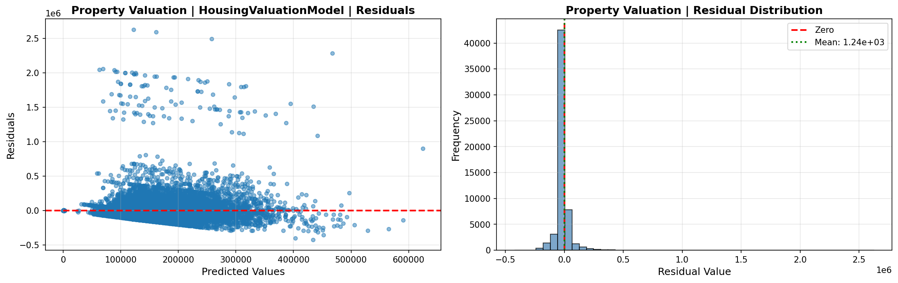

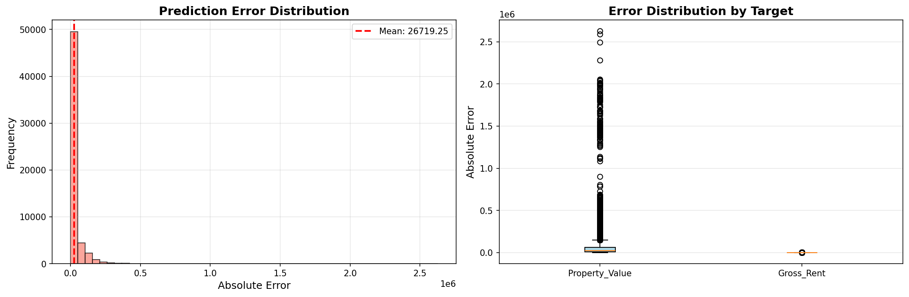

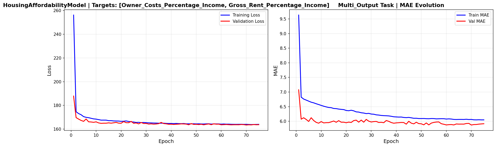

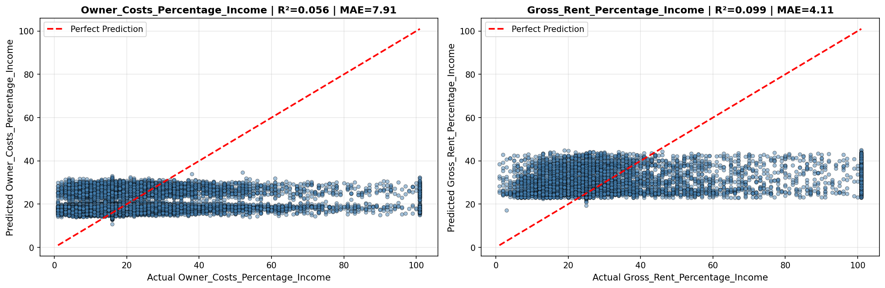

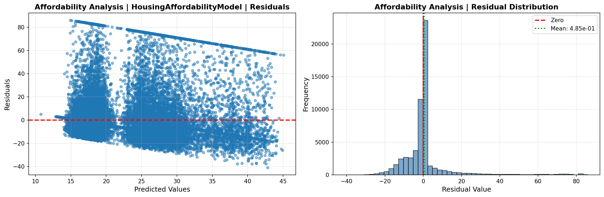

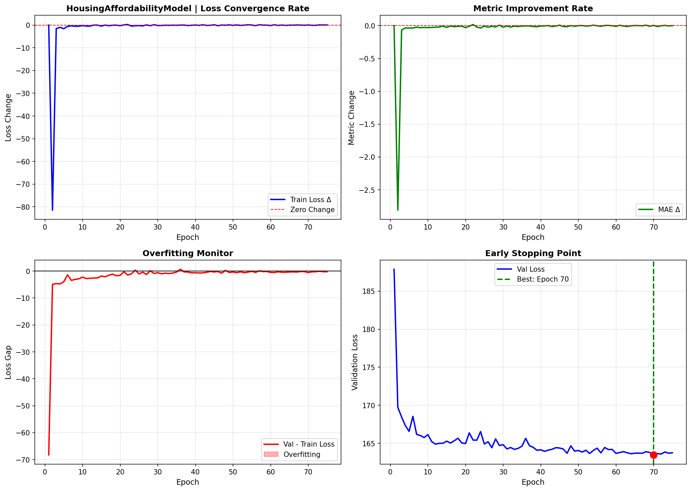

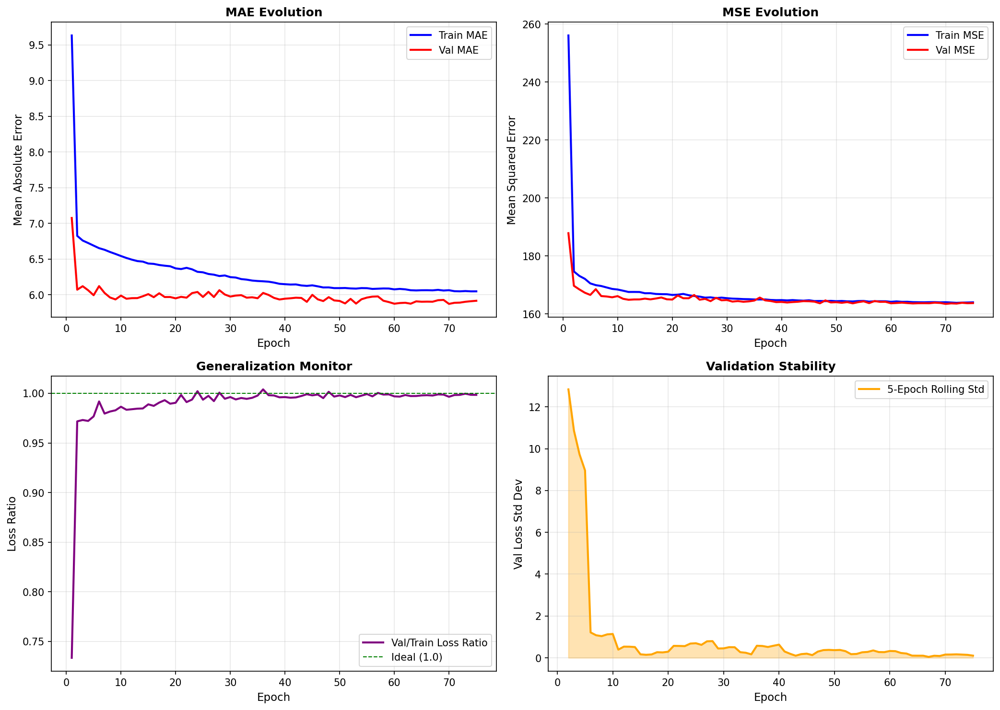

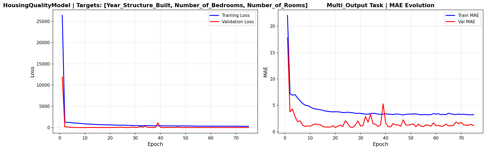

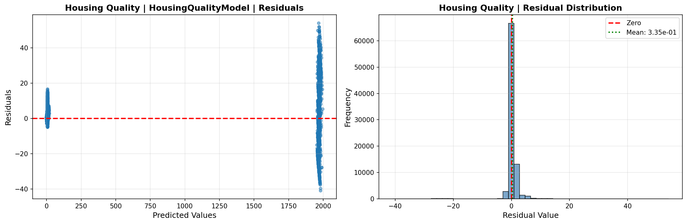

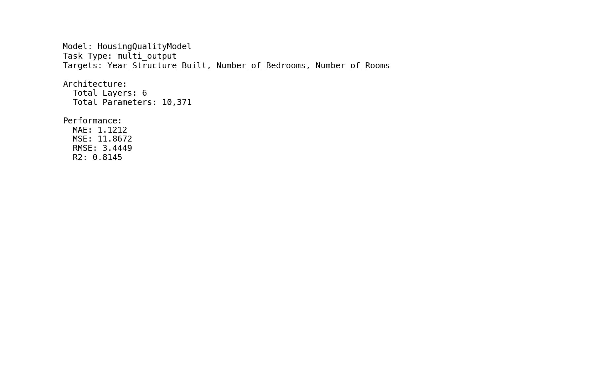

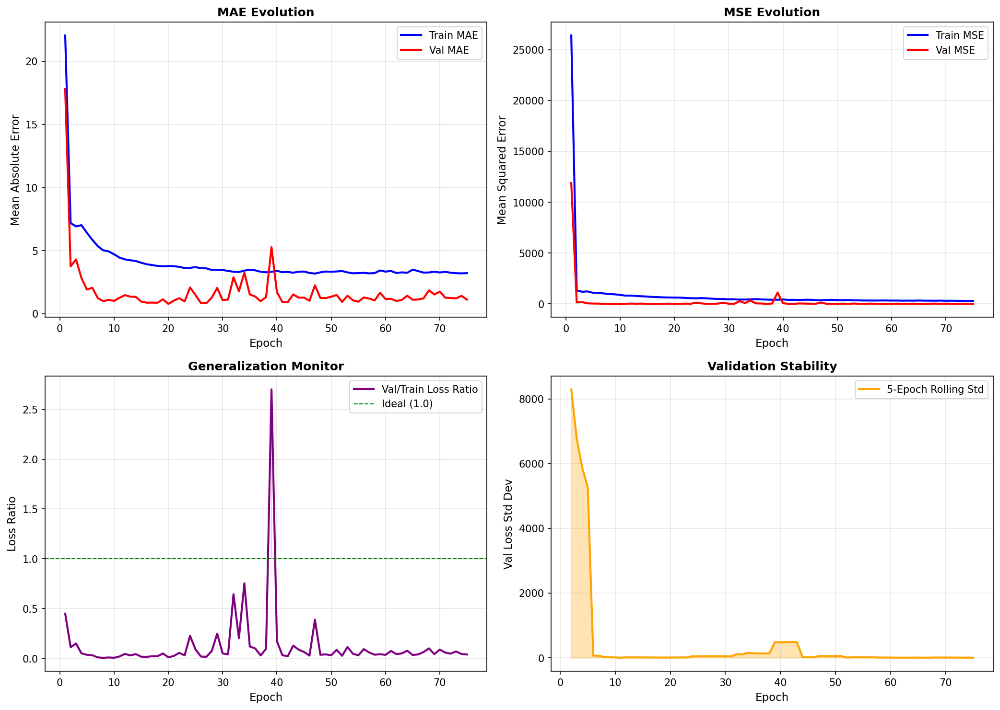

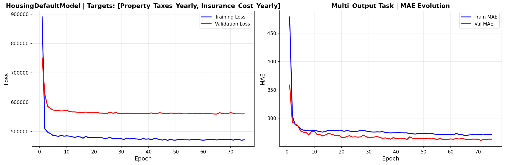

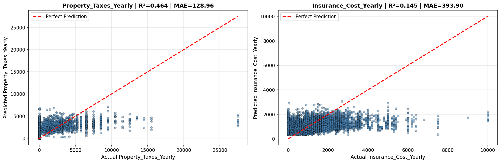

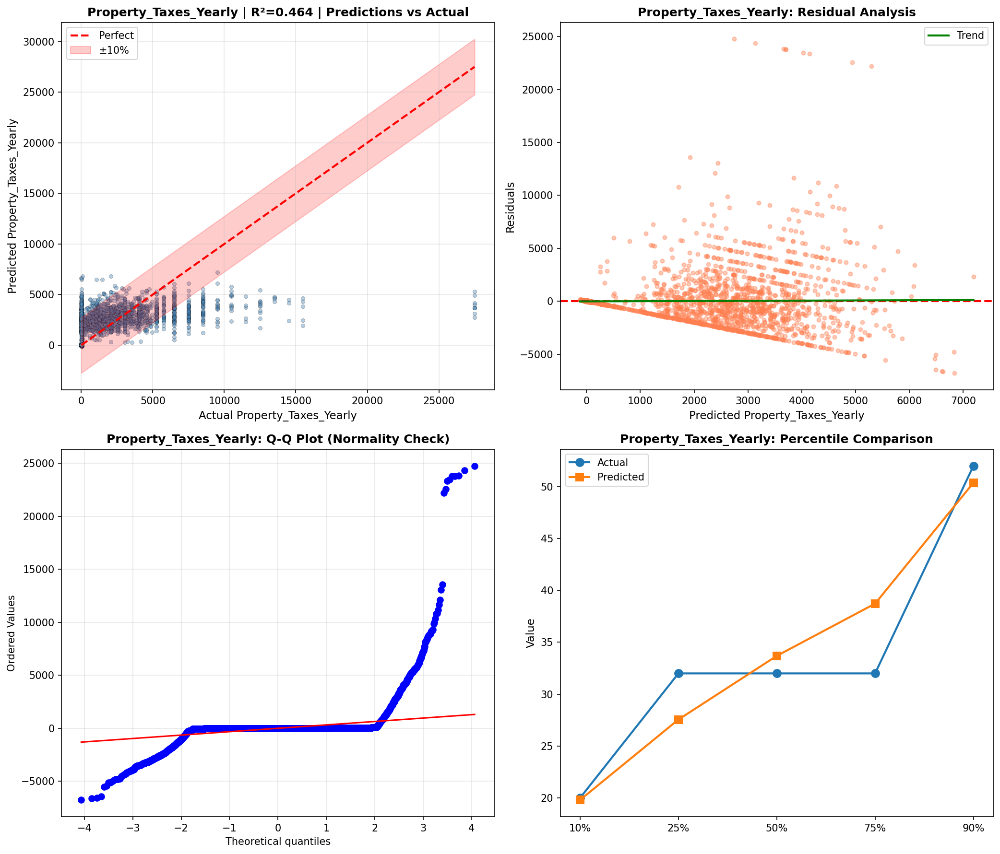

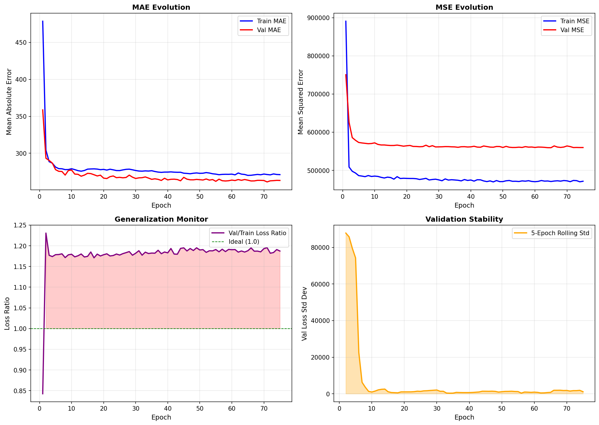

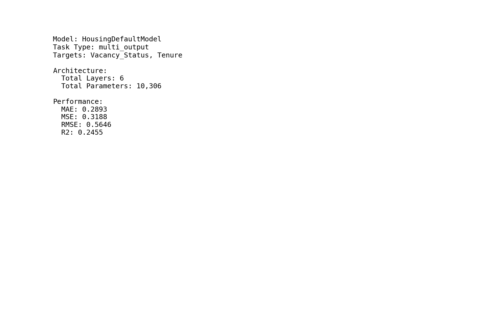

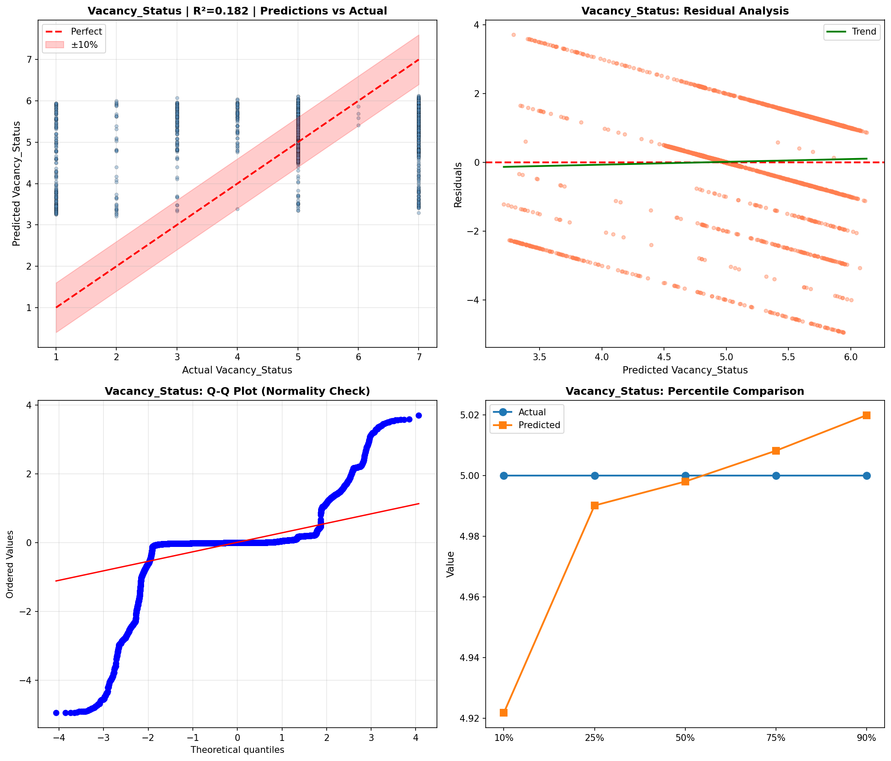

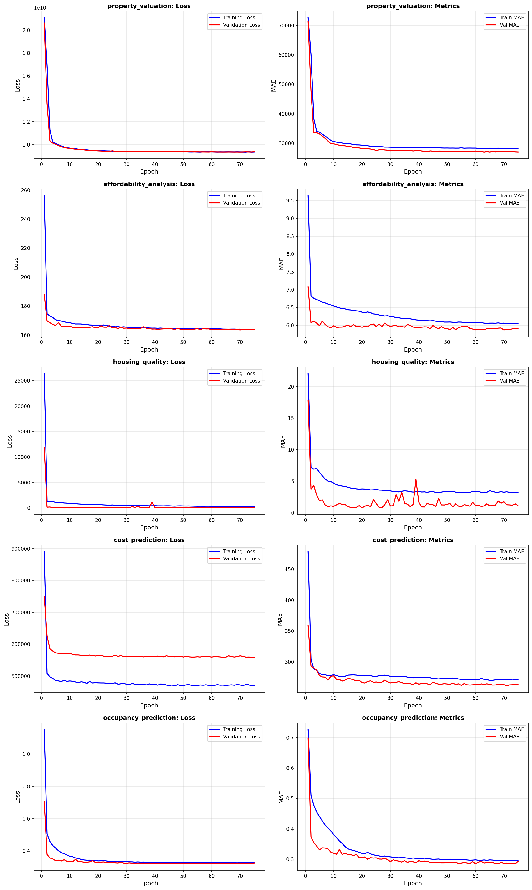

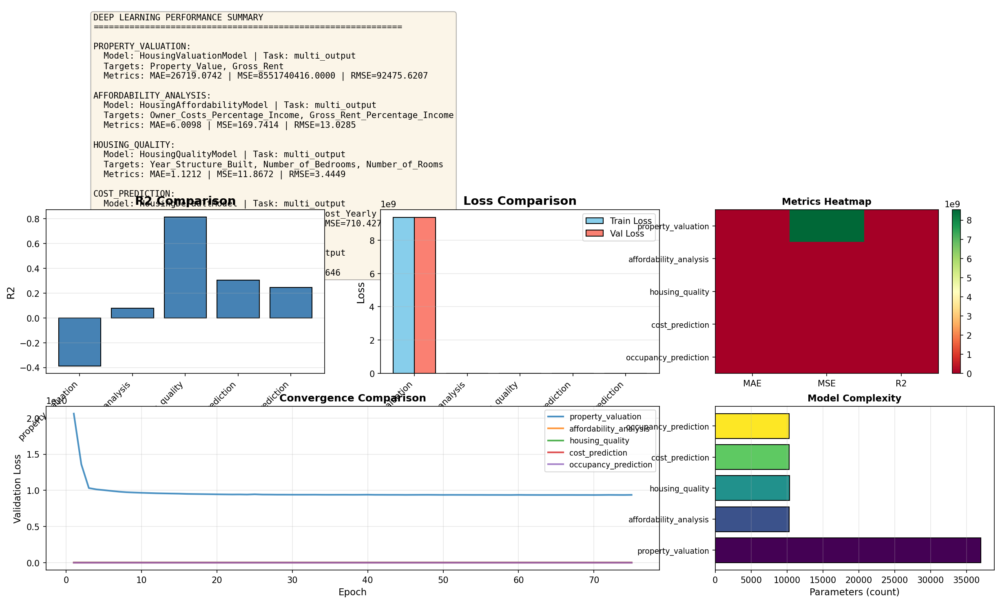

