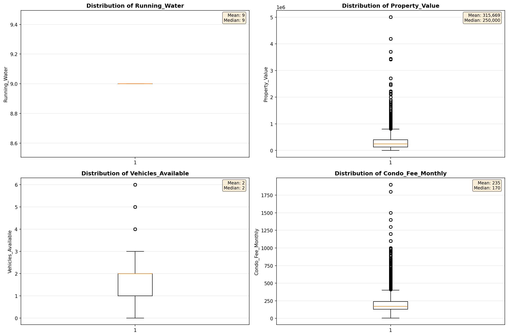
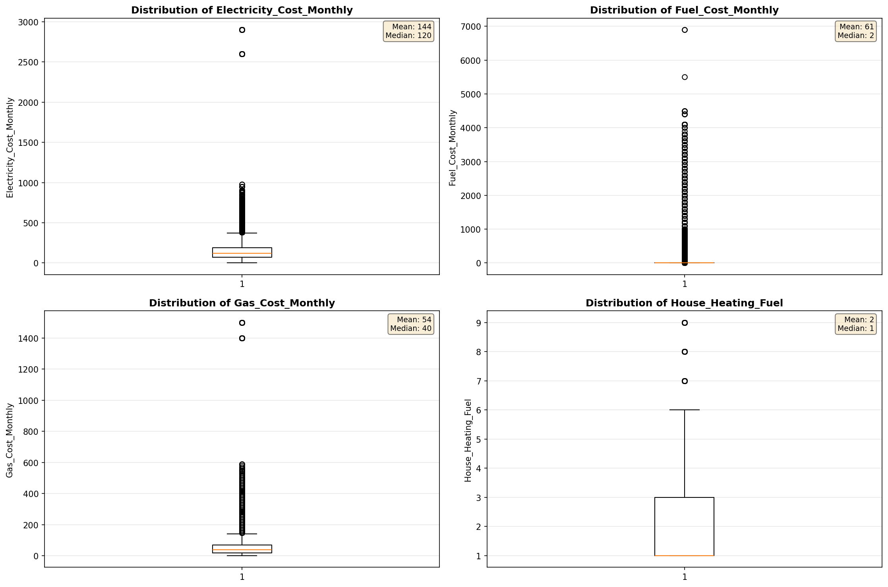
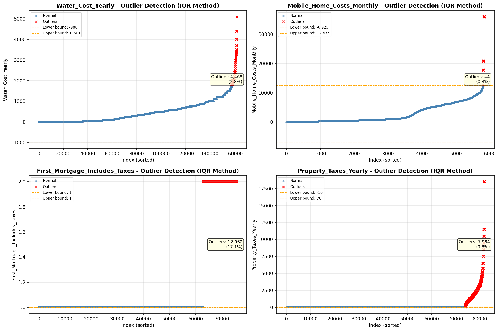

# Outlier Detection

> Statistical outlier detection using IQR (Interquartile Range) method. Outliers are values falling outside Q1 - 1.5×IQR or Q3 + 1.5×IQR bounds.

## Detection Methodology

| Parameter | Value | Description |
| :--- | :--- | :--- |
| Method | IQR | Outlier detection algorithm |
| Lower Bound | Q1 - 1.5 × IQR | Values below are outliers |
| Upper Bound | Q3 + 1.5 × IQR | Values above are outliers |
| IQR Definition | Q3 - Q1 | Interquartile Range |

> **Note**: The IQR method is robust to extreme values and works well for approximately symmetric distributions.

## Outlier Summary

_No outlier summary available._
## High Outlier Rate Variables

> Variables with outlier rate > 5% may indicate data quality issues, non-normal distributions, or genuinely extreme values.

- **('Flag_Family_Income', 20.329971277803754)**: 0 outliers (0.00%)

- **('Flag_Selected_Monthly_Owner_Costs', 19.262887492049856)**: 0 outliers (0.00%)

- **('First_Mortgage_Includes_Taxes', 17.10477698601214)**: 0 outliers (0.00%)

- **('Property_Tax_Rate', 15.614829360533827)**: 0 outliers (0.00%)

- **('Structure_Age', 11.175358875769442)**: 0 outliers (0.00%)

- **('Flag_Property_Taxes', 10.78710941800806)**: 0 outliers (0.00%)

- **('Working_Age_Persons', 10.341659715490227)**: 0 outliers (0.00%)

- **('Property_Taxes_Yearly', 9.762778185375398)**: 0 outliers (0.00%)

- **('Income_Adjustment_Factor', 9.608451762871818)**: 0 outliers (0.00%)

- **('Fuel_Cost_Monthly', 9.474247402168553)**: 0 outliers (0.00%)

- **('Gross_Rent_Percentage_Income', 9.473649397251666)**: 0 outliers (0.00%)

- **('Structure_Age_Score', 7.9879851413878695)**: 0 outliers (0.00%)

- **('Flag_Gross_Rent', 7.854809919866318)**: 0 outliers (0.00%)

- **('Flag_Water_Cost', 7.772750871467775)**: 0 outliers (0.00%)

- **('Insurance_Cost_Yearly', 7.602867582810389)**: 0 outliers (0.00%)

> *Consider investigating these variables for data entry errors, applying transformations, or using robust statistical methods.*

## Visualizations

