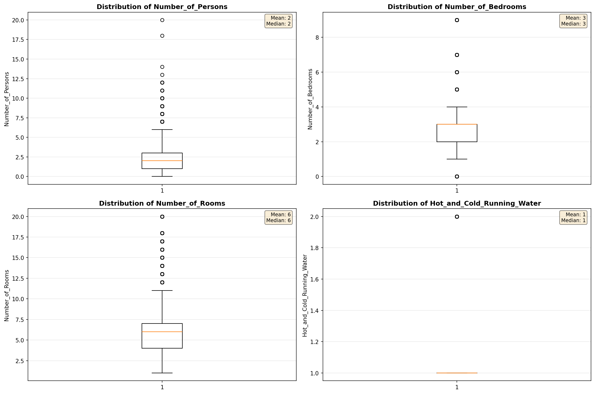
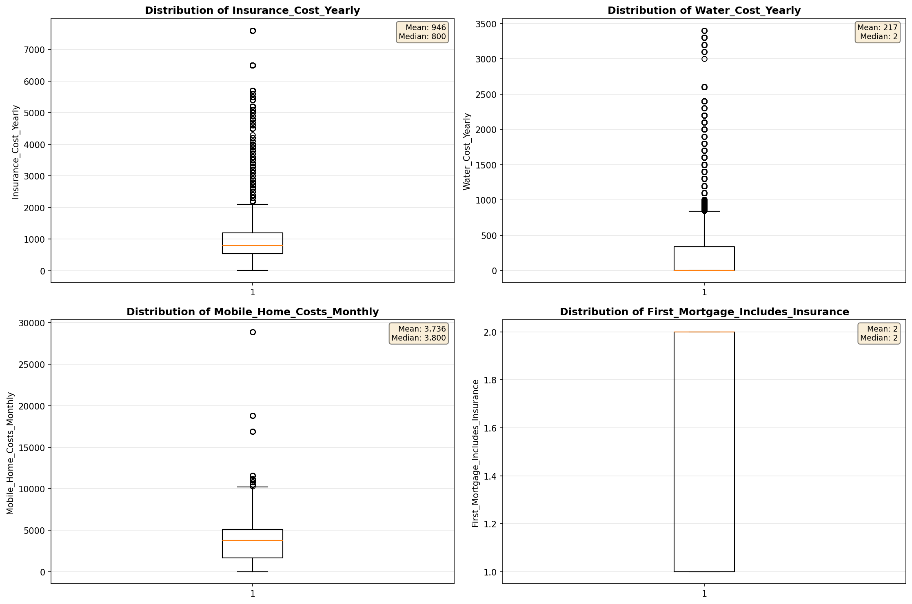
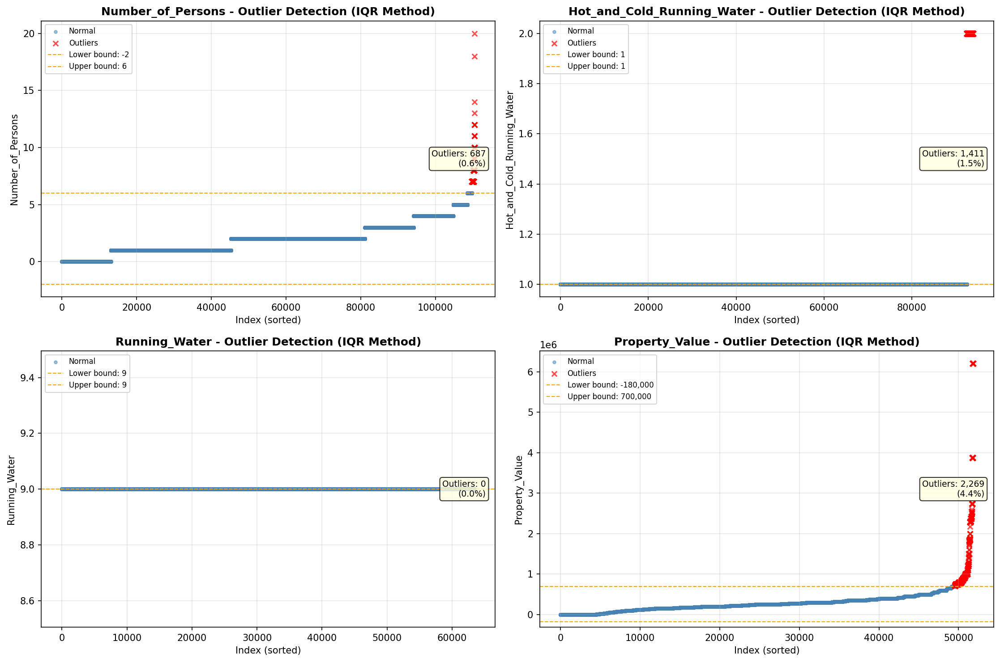
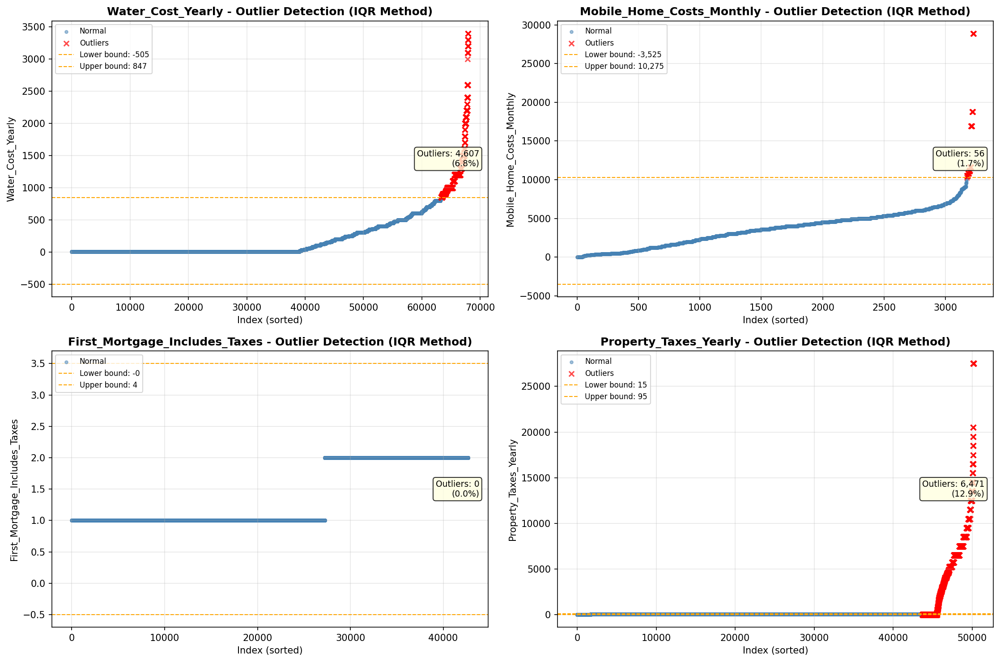

# Outlier Detection

> Statistical outlier detection using IQR (Interquartile Range) method. Outliers are values falling outside Q1 - 1.5×IQR or Q3 + 1.5×IQR bounds.

## Detection Methodology

| Parameter | Value | Description |
| :--- | :--- | :--- |
| Method | IQR | Outlier detection algorithm |
| Lower Bound | Q1 - 1.5 × IQR | Values below are outliers |
| Upper Bound | Q3 + 1.5 × IQR | Values above are outliers |
| IQR Definition | Q3 - Q1 | Interquartile Range |

> **Note**: The IQR method is robust to extreme values and works well for approximately symmetric distributions.

## Outlier Summary

_No outlier summary available._
## High Outlier Rate Variables

> Variables with outlier rate > 5% may indicate data quality issues, non-normal distributions, or genuinely extreme values.

- **('Flag_Selected_Monthly_Owner_Costs', 22.71579552155309)**: 0 outliers (0.00%)

- **('Specified_Rent_Unit', 19.092392882533773)**: 0 outliers (0.00%)

- **('Flag_Family_Income', 17.371344142052425)**: 0 outliers (0.00%)

- **('Property_Tax_Rate', 15.636233993879795)**: 0 outliers (0.00%)

- **('Property_Taxes_Yearly', 12.89531894541759)**: 0 outliers (0.00%)

- **('Gas_Cost_Monthly', 10.477113773284398)**: 0 outliers (0.00%)

- **('Gross_Rent_Percentage_Income', 9.552102376599635)**: 0 outliers (0.00%)

- **('Income_Adjustment_Factor', 9.31164212067128)**: 0 outliers (0.00%)

- **('Structure_Age', 8.97045122554376)**: 0 outliers (0.00%)

- **('Flag_Water_Cost', 7.57923748277446)**: 0 outliers (0.00%)

- **('Working_Age_Persons', 7.546647919139765)**: 0 outliers (0.00%)

- **('Structure_Age_Score', 7.511990890373932)**: 0 outliers (0.00%)

- **('Owner_Costs_Percentage_Income', 7.2026875036997575)**: 0 outliers (0.00%)

- **('Water_Cost_Yearly', 6.779486424839967)**: 0 outliers (0.00%)

- **('Total_Monthly_Utility_Cost', 6.161253754367922)**: 0 outliers (0.00%)

> *Consider investigating these variables for data entry errors, applying transformations, or using robust statistical methods.*

## Visualizations

