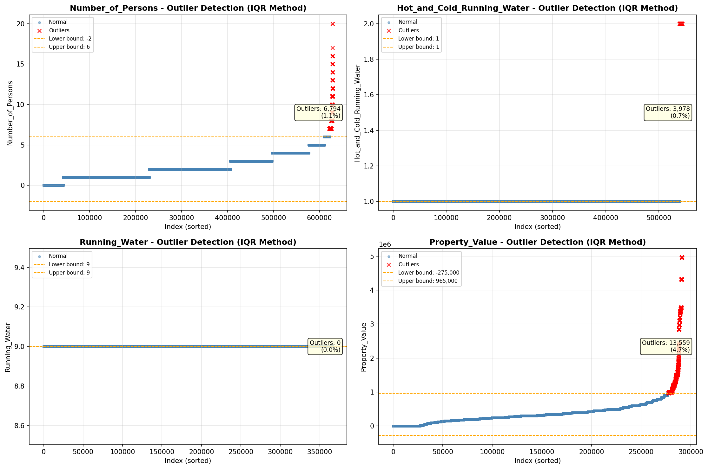
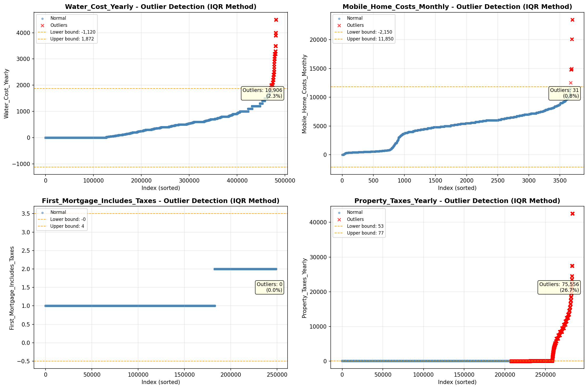

# Outlier Detection

> Statistical outlier detection using IQR (Interquartile Range) method. Outliers are values falling outside Q1 - 1.5×IQR or Q3 + 1.5×IQR bounds.

## Detection Methodology

| Parameter | Value | Description |
| :--- | :--- | :--- |
| Method | IQR | Outlier detection algorithm |
| Lower Bound | Q1 - 1.5 × IQR | Values below are outliers |
| Upper Bound | Q3 + 1.5 × IQR | Values above are outliers |
| IQR Definition | Q3 - Q1 | Interquartile Range |

> **Note**: The IQR method is robust to extreme values and works well for approximately symmetric distributions.

## Outlier Summary

_No outlier summary available._
## High Outlier Rate Variables

> Variables with outlier rate > 5% may indicate data quality issues, non-normal distributions, or genuinely extreme values.

- **('Property_Taxes_Yearly', 26.66854914141503)**: 0 outliers (0.00%)

- **('Flag_Family_Income', 22.714060464797424)**: 0 outliers (0.00%)

- **('Flag_Selected_Monthly_Owner_Costs', 21.813606367927076)**: 0 outliers (0.00%)

- **('Fuel_Cost_Monthly', 21.26442554226294)**: 0 outliers (0.00%)

- **('Property_Tax_Rate', 14.768856318387865)**: 0 outliers (0.00%)

- **('Gross_Rent_Percentage_Income', 9.863049685104148)**: 0 outliers (0.00%)

- **('Income_Adjustment_Factor', 9.455246738513896)**: 0 outliers (0.00%)

- **('Structure_Age', 8.90867046966121)**: 0 outliers (0.00%)

- **('Flag_Water_Cost', 8.406719066270602)**: 0 outliers (0.00%)

- **('Owner_Costs_Percentage_Income', 7.943797625236977)**: 0 outliers (0.00%)

- **('Flag_Gross_Rent', 7.751203807779304)**: 0 outliers (0.00%)

- **('Structure_Age_Score', 7.5637704125964085)**: 0 outliers (0.00%)

- **('Flag_Property_Taxes', 6.553683186230347)**: 0 outliers (0.00%)

- **('Flag_Property_Value', 6.122103312869863)**: 0 outliers (0.00%)

- **('Income_to_FPL_Ratio', 5.983231138760835)**: 0 outliers (0.00%)

> *Consider investigating these variables for data entry errors, applying transformations, or using robust statistical methods.*

## Visualizations

