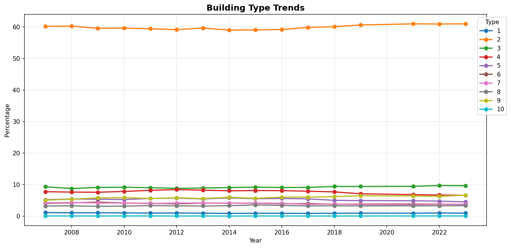
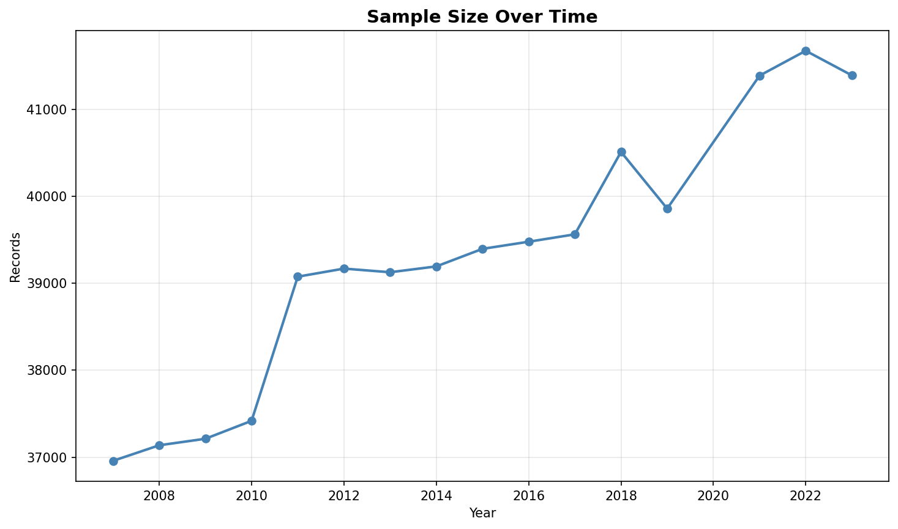

# Trend Analysis

> Analysis of long-term trends in key variables, including trend direction, strength, and statistical significance.

## Trend Summary

_No trend summary available._
## Strong Trends

> Variables showing significant long-term trends that may require attention or represent important patterns in the data.

- **('Mobile_Home_Costs_Monthly', 0.970545402207688, 'increasing')**: decreasing trend (slope: 0.0000)

- **('Insurance_Cost_Yearly', 0.9679985433917471, 'increasing')**: decreasing trend (slope: 0.0000)

- **('Owner_Costs_Percentage_Income', 0.9606772355766501, 'decreasing')**: decreasing trend (slope: 0.0000)

- **('Gross_Rent', 0.9450404579379383, 'increasing')**: decreasing trend (slope: 0.0000)

- **('Rent_Amount_Monthly', 0.9135348679695409, 'increasing')**: decreasing trend (slope: 0.0000)

- **('Family_Income', 0.8920822986437563, 'increasing')**: decreasing trend (slope: 0.0000)

- **('Income_to_FPL_Ratio', 0.884707610133646, 'increasing')**: decreasing trend (slope: 0.0000)

- **('Household_Income', 0.8789002846842675, 'increasing')**: decreasing trend (slope: 0.0000)

- **('Property_Value', 0.7961001236976711, 'increasing')**: decreasing trend (slope: 0.0000)

- **('Water_Cost_Yearly', 0.7191629734349237, 'increasing')**: decreasing trend (slope: 0.0000)

## Trend Categories

_Trend category data not available._
## Visualizations

