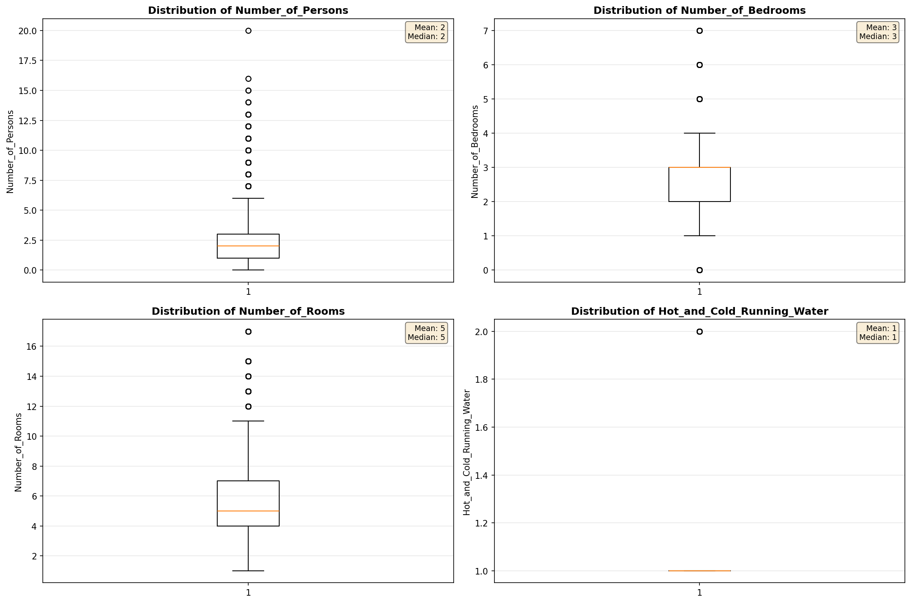
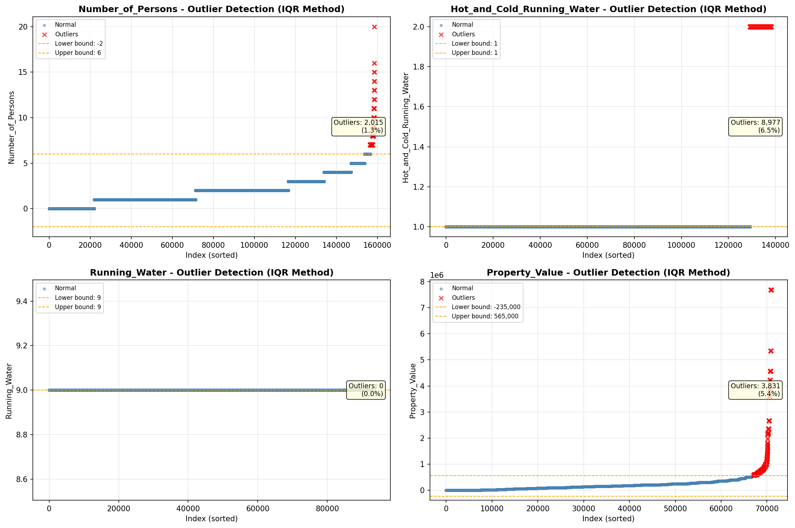
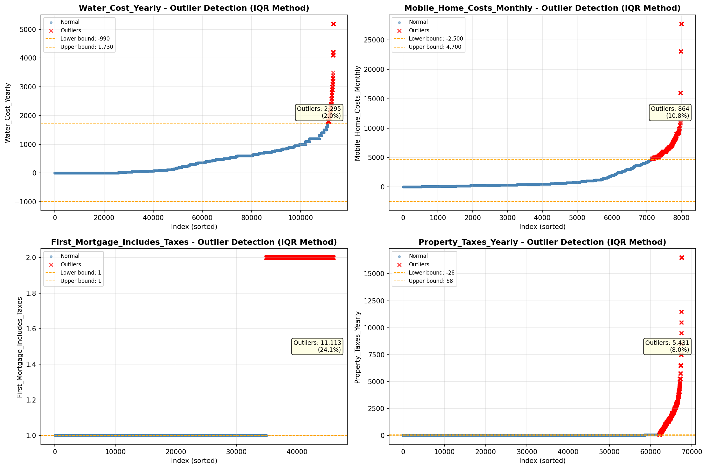

# Outlier Detection

> Statistical outlier detection using IQR (Interquartile Range) method. Outliers are values falling outside Q1 - 1.5×IQR or Q3 + 1.5×IQR bounds.

## Detection Methodology

| Parameter | Value | Description |
| :--- | :--- | :--- |
| Method | IQR | Outlier detection algorithm |
| Lower Bound | Q1 - 1.5 × IQR | Values below are outliers |
| Upper Bound | Q3 + 1.5 × IQR | Values above are outliers |
| IQR Definition | Q3 - Q1 | Interquartile Range |

> **Note**: The IQR method is robust to extreme values and works well for approximately symmetric distributions.

## Outlier Summary

_No outlier summary available._
## High Outlier Rate Variables

> Variables with outlier rate > 5% may indicate data quality issues, non-normal distributions, or genuinely extreme values.

- **('Fuel_Cost_Monthly', 24.282016107620144)**: 0 outliers (0.00%)

- **('First_Mortgage_Includes_Taxes', 24.14190128606187)**: 0 outliers (0.00%)

- **('Specified_Rent_Unit', 23.546161129692578)**: 0 outliers (0.00%)

- **('Property_Tax_Rate', 22.856951960980826)**: 0 outliers (0.00%)

- **('Flag_Selected_Monthly_Owner_Costs', 20.893751509360662)**: 0 outliers (0.00%)

- **('Flag_Family_Income', 19.27906143650367)**: 0 outliers (0.00%)

- **('Flag_Property_Value', 12.174985184024631)**: 0 outliers (0.00%)

- **('Structure_Age', 11.046488872885535)**: 0 outliers (0.00%)

- **('Mobile_Home_Costs_Monthly', 10.790558261521168)**: 0 outliers (0.00%)

- **('Flag_Property_Taxes', 9.97907354881988)**: 0 outliers (0.00%)

- **('Income_Adjustment_Factor', 9.492311272623118)**: 0 outliers (0.00%)

- **('Working_Age_Persons', 9.400243620977049)**: 0 outliers (0.00%)

- **('Gross_Rent_Percentage_Income', 8.832501884219216)**: 0 outliers (0.00%)

- **('Flag_Water_Cost', 8.411021338305366)**: 0 outliers (0.00%)

- **('Property_Taxes_Yearly', 8.041994284275836)**: 0 outliers (0.00%)

> *Consider investigating these variables for data entry errors, applying transformations, or using robust statistical methods.*

## Visualizations

