# Deep Learning Models

> Neural network analysis using TensorFlow/Keras for complex pattern recognition and multi-output prediction tasks.

## Deep Learning Summary

- **Total Tasks**: 5

- **Tasks**: Property Valuation, Affordability Analysis, Housing Quality, Cost Prediction, Occupancy Prediction

### Aggregate Statistics

| Metric | Value |
| :--- | :--- |
| Total Parameters | 78,283 |
| Average Validation Loss | 9453938117.7506 |
| Number of Tasks | 5 |

## Task: Property Valuation

### Model Configuration

| Property | Value |
| :--- | :--- |
| Model Type | HousingValuationModel |
| Task Type | Multi_Output |
| Target Variables | Property_Value, Gross_Rent |
| Number of Targets | 2 |
| Input Features | 10 |

### Network Architecture

| Component | Value | Notes |
| :--- | :--- | :--- |
| Total Layers | 7 | Including input and output |
| Total Parameters | 36,994 | Trainable weights |
| Parameters per Layer | 5,284 | Average |

### Performance Metrics

| Metric | Value | Assessment |
| :--- | :--- | :--- |
| Training Loss | 45562941440.0000 | Final epoch |
| Validation Loss | 47269404672.0000 | Final epoch |
| Loss Gap | 1706463232.0000 | HIGH overfitting risk |

> *Model may be overfitting significantly*

#### Test Set Metrics

| Metric | Value | Description |
| :--- | :--- | :--- |
| MAE | 41149.8828 | Mean Absolute Error (lower is better) |
| MSE | 39686893568.0000 | Mean Squared Error (lower is better) |
| RMSE | 199215.6961 | Root Mean Squared Error (lower is better) |
| R2 | -0.4392 | R-squared (higher is better) |

### Training Analysis

| Training Statistic | Value |
| :--- | :--- |
| Epochs Trained | 75 |
| Initial Training Loss | 64531697664.0000 |
| Final Training Loss | 45562941440.0000 |
| Loss Improvement | 29.4% |
| Initial Validation Loss | 65286361088.0000 |
| Final Validation Loss | 47269404672.0000 |
| Validation Improvement | 27.6% |

#### Convergence Assessment

- **Status**: Fully converged (< 1% change in last 10 epochs)

- **Last 10 epochs change**: 0.02%

## Task: Affordability Analysis

### Model Configuration

| Property | Value |
| :--- | :--- |
| Model Type | HousingAffordabilityModel |
| Task Type | Multi_Output |
| Target Variables | Owner_Costs_Percentage_Income, Gross_Rent_Percentage_Income |
| Number of Targets | 2 |
| Input Features | 10 |

### Network Architecture

| Component | Value | Notes |
| :--- | :--- | :--- |
| Total Layers | 6 | Including input and output |
| Total Parameters | 10,306 | Trainable weights |
| Parameters per Layer | 1,717 | Average |

### Performance Metrics

| Metric | Value | Assessment |
| :--- | :--- | :--- |
| Training Loss | 196.1526 | Final epoch |
| Validation Loss | 194.9791 | Final epoch |
| Loss Gap | -1.1735 | NONE overfitting risk |

> *Good generalization*

#### Test Set Metrics

| Metric | Value | Description |
| :--- | :--- | :--- |
| MAE | 6.8294 | Mean Absolute Error (lower is better) |
| MSE | 193.6953 | Mean Squared Error (lower is better) |
| RMSE | 13.9174 | Root Mean Squared Error (lower is better) |
| R2 | 0.0535 | R-squared (higher is better) |

### Training Analysis

| Training Statistic | Value |
| :--- | :--- |
| Epochs Trained | 75 |
| Initial Training Loss | 313.2871 |
| Final Training Loss | 196.1526 |
| Loss Improvement | 37.4% |
| Initial Validation Loss | 205.3542 |
| Final Validation Loss | 194.9791 |
| Validation Improvement | 5.1% |

#### Convergence Assessment

- **Status**: Fully converged (< 1% change in last 10 epochs)

- **Last 10 epochs change**: 0.11%

## Task: Housing Quality

### Model Configuration

| Property | Value |
| :--- | :--- |
| Model Type | HousingQualityModel |
| Task Type | Multi_Output |
| Target Variables | Year_Structure_Built, Number_of_Bedrooms, Number_of_Rooms |
| Number of Targets | 3 |
| Input Features | 10 |

### Network Architecture

| Component | Value | Notes |
| :--- | :--- | :--- |
| Total Layers | 6 | Including input and output |
| Total Parameters | 10,371 | Trainable weights |
| Parameters per Layer | 1,728 | Average |

### Performance Metrics

| Metric | Value | Assessment |
| :--- | :--- | :--- |
| Training Loss | 284.2544 | Final epoch |
| Validation Loss | 46.5988 | Final epoch |
| Loss Gap | -237.6556 | NONE overfitting risk |

> *Good generalization*

#### Test Set Metrics

| Metric | Value | Description |
| :--- | :--- | :--- |
| MAE | 1.6353 | Mean Absolute Error (lower is better) |
| MSE | 48.7654 | Mean Squared Error (lower is better) |
| RMSE | 6.9832 | Root Mean Squared Error (lower is better) |
| R2 | 0.7678 | R-squared (higher is better) |

### Training Analysis

| Training Statistic | Value |
| :--- | :--- |
| Epochs Trained | 75 |
| Initial Training Loss | 24199.8379 |
| Final Training Loss | 284.2544 |
| Loss Improvement | 98.8% |
| Initial Validation Loss | 20211.6973 |
| Final Validation Loss | 46.5988 |
| Validation Improvement | 99.8% |

#### Convergence Assessment

- **Status**: Near convergence (< 5% change)

- **Last 10 epochs change**: 4.15%

## Task: Cost Prediction

### Model Configuration

| Property | Value |
| :--- | :--- |
| Model Type | HousingDefaultModel |
| Task Type | Multi_Output |
| Target Variables | Property_Taxes_Yearly, Insurance_Cost_Yearly |
| Number of Targets | 2 |
| Input Features | 10 |

### Network Architecture

| Component | Value | Notes |
| :--- | :--- | :--- |
| Total Layers | 6 | Including input and output |
| Total Parameters | 10,306 | Trainable weights |
| Parameters per Layer | 1,717 | Average |

### Performance Metrics

| Metric | Value | Assessment |
| :--- | :--- | :--- |
| Training Loss | 276812.0938 | Final epoch |
| Validation Loss | 285674.7500 | Final epoch |
| Loss Gap | 8862.6562 | HIGH overfitting risk |

> *Model may be overfitting significantly*

#### Test Set Metrics

| Metric | Value | Description |
| :--- | :--- | :--- |
| MAE | 202.0076 | Mean Absolute Error (lower is better) |
| MSE | 290705.2188 | Mean Squared Error (lower is better) |
| RMSE | 539.1709 | Root Mean Squared Error (lower is better) |
| R2 | 0.2249 | R-squared (higher is better) |

### Training Analysis

| Training Statistic | Value |
| :--- | :--- |
| Epochs Trained | 75 |
| Initial Training Loss | 430395.3750 |
| Final Training Loss | 276812.0938 |
| Loss Improvement | 35.7% |
| Initial Validation Loss | 335103.0938 |
| Final Validation Loss | 285674.7500 |
| Validation Improvement | 14.8% |

#### Convergence Assessment

- **Status**: Fully converged (< 1% change in last 10 epochs)

- **Last 10 epochs change**: 0.20%

## Task: Occupancy Prediction

### Model Configuration

| Property | Value |
| :--- | :--- |
| Model Type | HousingDefaultModel |
| Task Type | Multi_Output |
| Target Variables | Vacancy_Status, Tenure |
| Number of Targets | 2 |
| Input Features | 10 |

### Network Architecture

| Component | Value | Notes |
| :--- | :--- | :--- |
| Total Layers | 6 | Including input and output |
| Total Parameters | 10,306 | Trainable weights |
| Parameters per Layer | 1,717 | Average |

### Performance Metrics

| Metric | Value | Assessment |
| :--- | :--- | :--- |
| Training Loss | 0.4325 | Final epoch |
| Validation Loss | 0.4250 | Final epoch |
| Loss Gap | -0.0075 | NONE overfitting risk |

> *Good generalization*

#### Test Set Metrics

| Metric | Value | Description |
| :--- | :--- | :--- |
| MAE | 0.3380 | Mean Absolute Error (lower is better) |
| MSE | 0.4268 | Mean Squared Error (lower is better) |
| RMSE | 0.6533 | Root Mean Squared Error (lower is better) |
| R2 | 0.2122 | R-squared (higher is better) |

### Training Analysis

| Training Statistic | Value |
| :--- | :--- |
| Epochs Trained | 75 |
| Initial Training Loss | 1.8549 |
| Final Training Loss | 0.4325 |
| Loss Improvement | 76.7% |
| Initial Validation Loss | 0.5541 |
| Final Validation Loss | 0.4250 |
| Validation Improvement | 23.3% |

#### Convergence Assessment

- **Status**: Fully converged (< 1% change in last 10 epochs)

- **Last 10 epochs change**: 0.29%

## Cross-Task Comparison

| Task | Model Type | Parameters | Train Loss | Val Loss | Gap |
| :--- | :--- | :--- | :--- | :--- | :--- |
| Property Valuation | HousingValuationModel | 36,994 | 45562941440.0000 | 47269404672.0000 | 1706463232.0000 |
| Affordability Analysis | HousingAffordabilityModel | 10,306 | 196.1526 | 194.9791 | -1.1735 |
| Housing Quality | HousingQualityModel | 10,371 | 284.2544 | 46.5988 | -237.6556 |
| Cost Prediction | HousingDefaultModel | 10,306 | 276812.0938 | 285674.7500 | 8862.6562 |
| Occupancy Prediction | HousingDefaultModel | 10,306 | 0.4325 | 0.4250 | -0.0075 |

## Visualizations

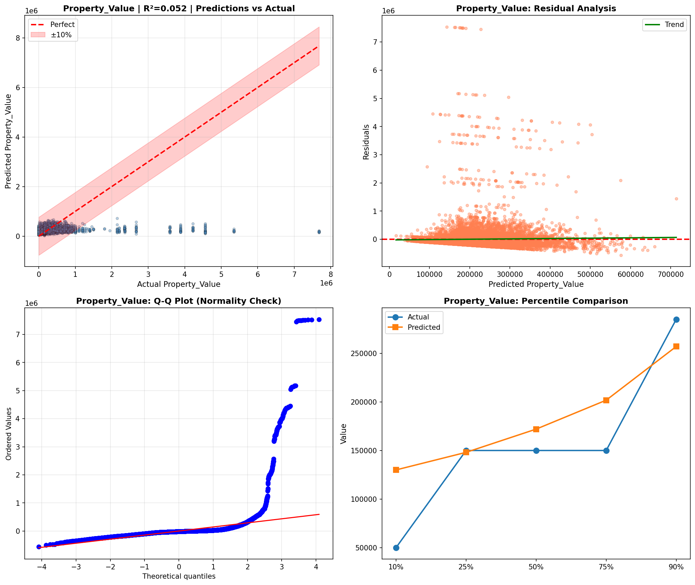

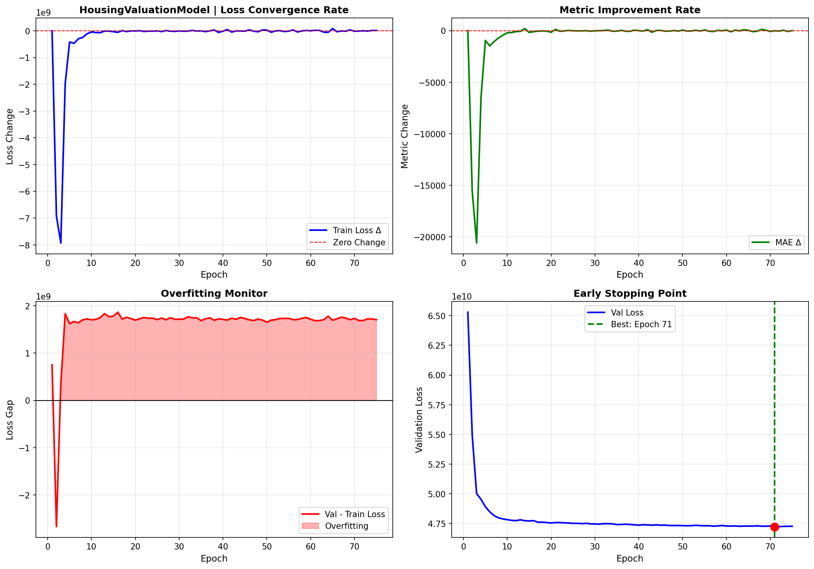

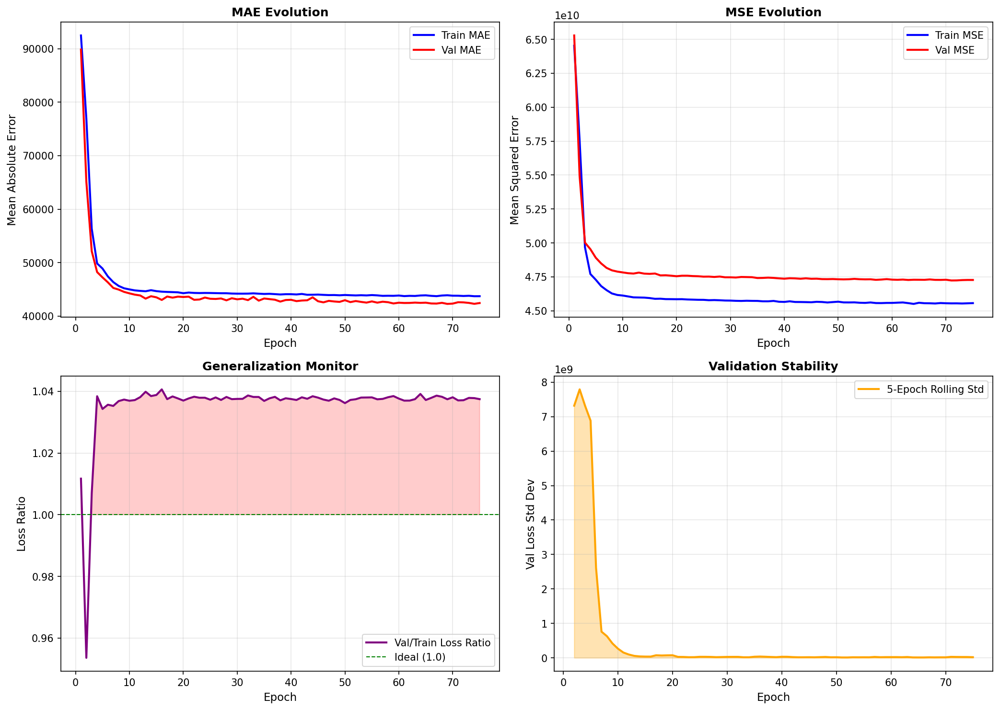

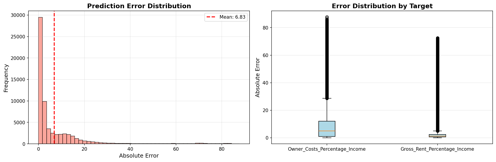

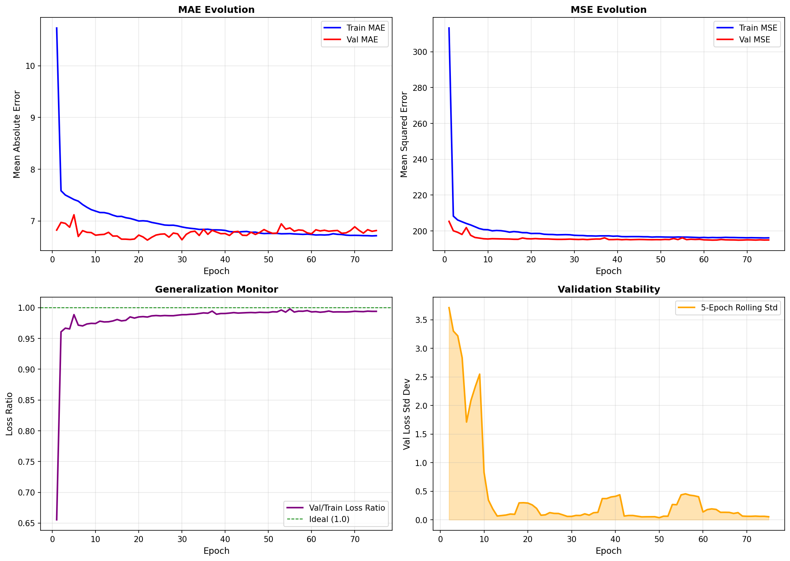

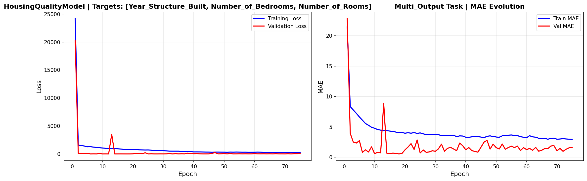

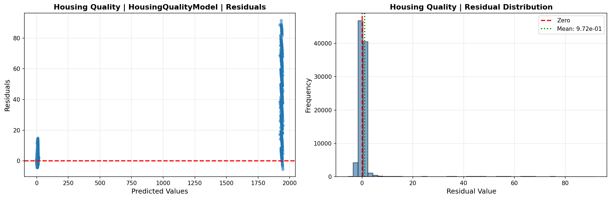

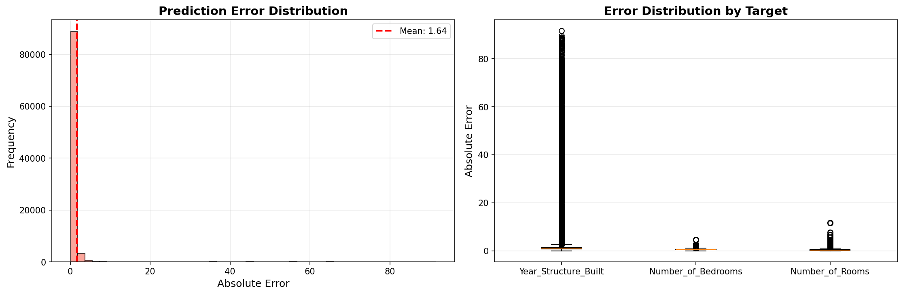

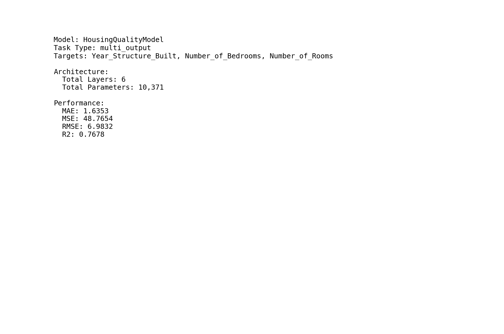

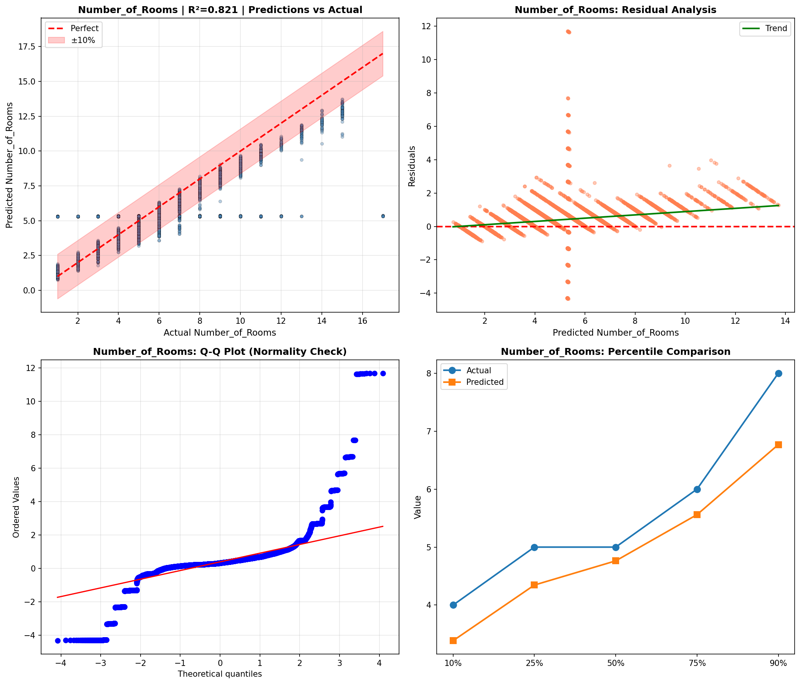

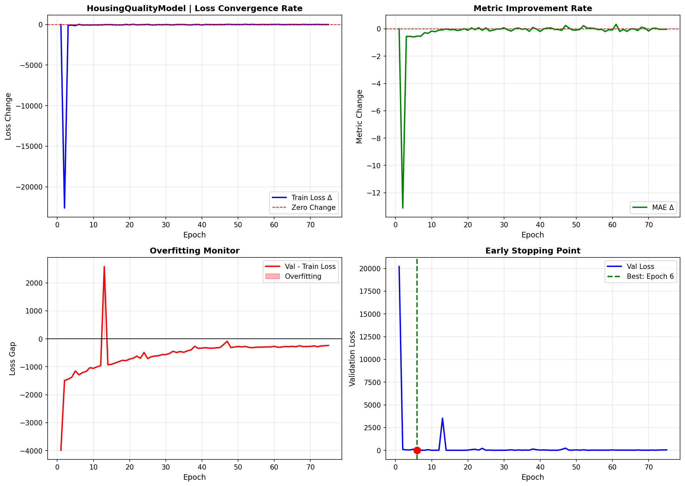

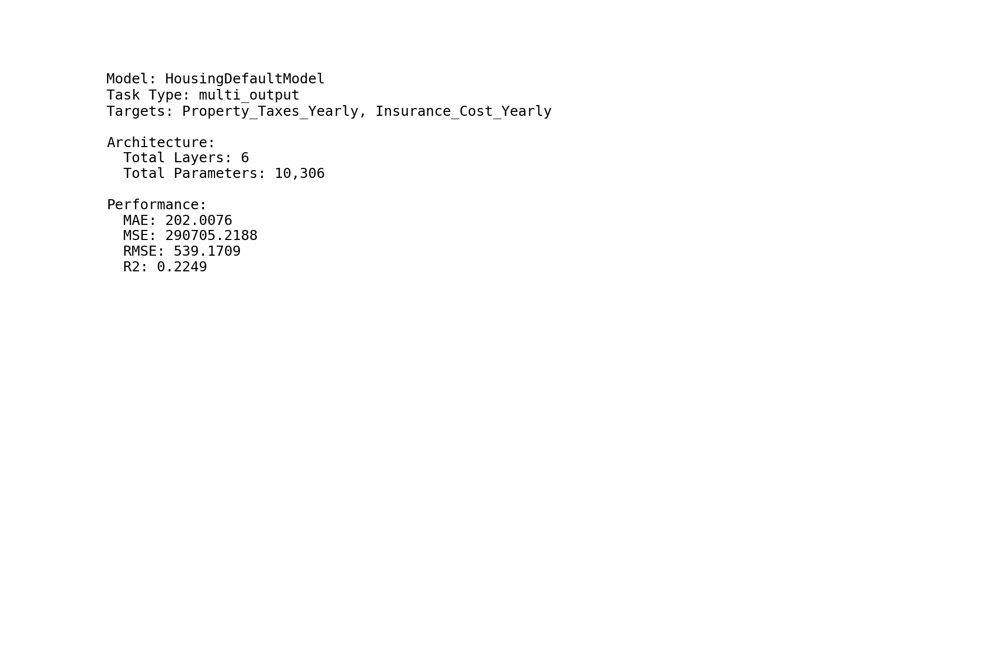

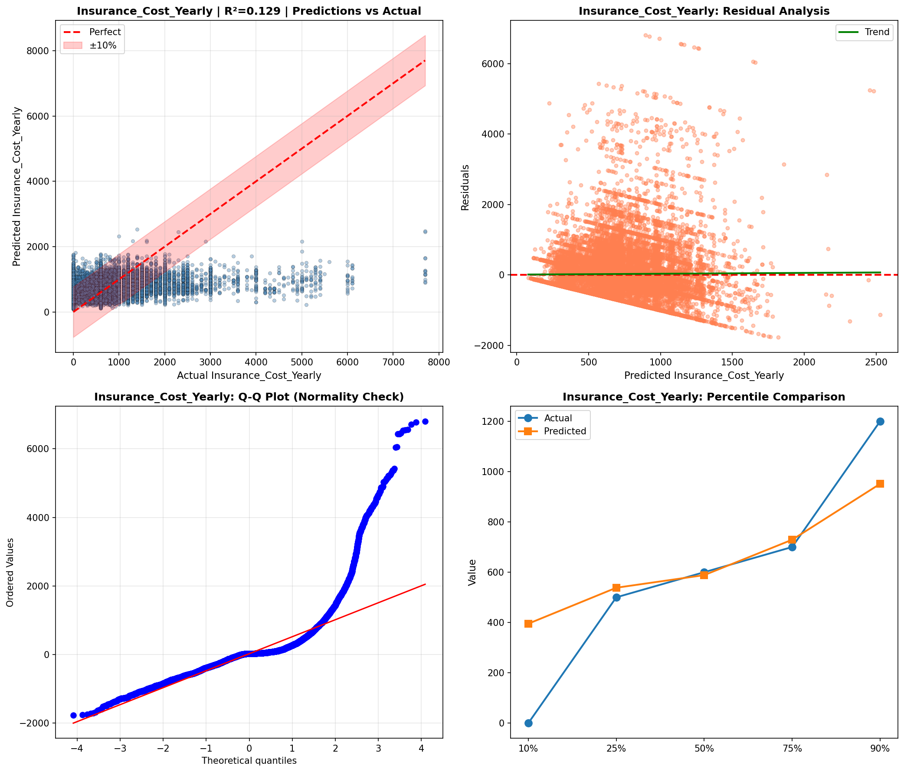

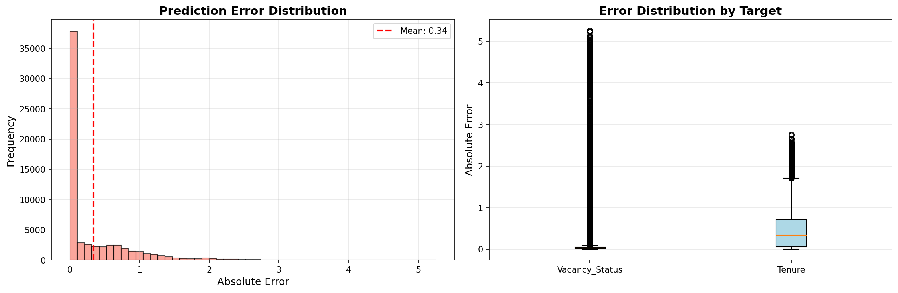

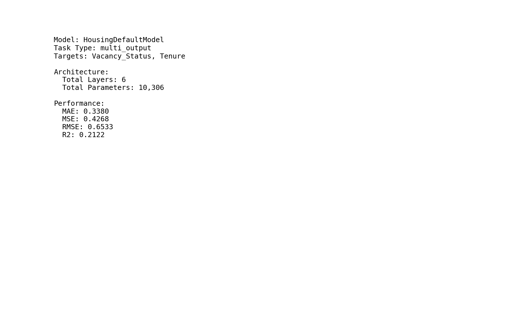

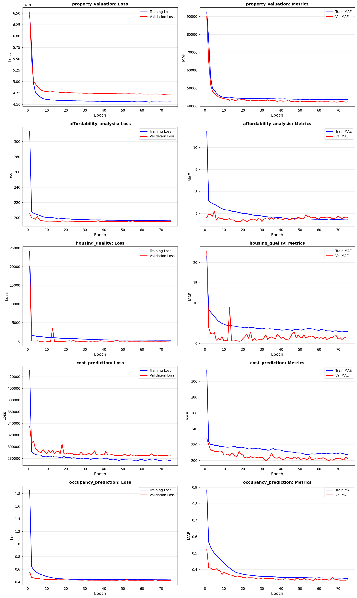

