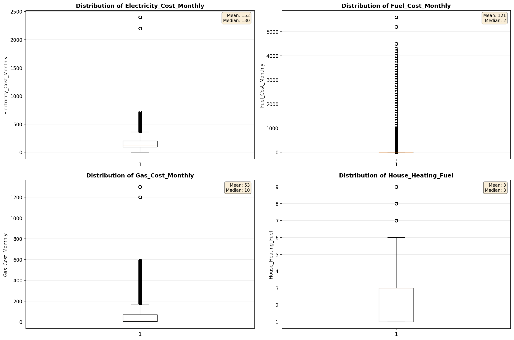
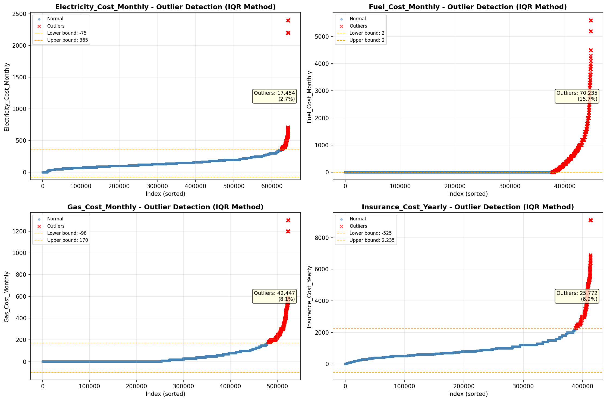

# Outlier Detection

> Statistical outlier detection using IQR (Interquartile Range) method. Outliers are values falling outside Q1 - 1.5×IQR or Q3 + 1.5×IQR bounds.

## Detection Methodology

| Parameter | Value | Description |
| :--- | :--- | :--- |
| Method | IQR | Outlier detection algorithm |
| Lower Bound | Q1 - 1.5 × IQR | Values below are outliers |
| Upper Bound | Q3 + 1.5 × IQR | Values above are outliers |
| IQR Definition | Q3 - Q1 | Interquartile Range |

> **Note**: The IQR method is robust to extreme values and works well for approximately symmetric distributions.

## Outlier Summary

_No outlier summary available._
## High Outlier Rate Variables

> Variables with outlier rate > 5% may indicate data quality issues, non-normal distributions, or genuinely extreme values.

- **('Flag_Selected_Monthly_Owner_Costs', 23.383706421235615)**: 0 outliers (0.00%)

- **('Flag_Family_Income', 19.72641004885664)**: 0 outliers (0.00%)

- **('Property_Tax_Rate', 15.979345413878065)**: 0 outliers (0.00%)

- **('Fuel_Cost_Monthly', 15.709470416272447)**: 0 outliers (0.00%)

- **('Mobile_Home_Costs_Monthly', 11.24868282402529)**: 0 outliers (0.00%)

- **('Structure_Age', 10.156784401470354)**: 0 outliers (0.00%)

- **('Property_Taxes_Yearly', 10.124384030183622)**: 0 outliers (0.00%)

- **('Income_Adjustment_Factor', 9.818443682849393)**: 0 outliers (0.00%)

- **('Flag_Property_Taxes', 9.805722506583914)**: 0 outliers (0.00%)

- **('Gross_Rent_Percentage_Income', 9.421906632054423)**: 0 outliers (0.00%)

- **('Flag_Water_Cost', 8.13969835117386)**: 0 outliers (0.00%)

- **('Gas_Cost_Monthly', 8.10979663892519)**: 0 outliers (0.00%)

- **('Structure_Age_Score', 7.957967076873901)**: 0 outliers (0.00%)

- **('Flag_Gross_Rent', 7.533217541152124)**: 0 outliers (0.00%)

- **('Working_Age_Persons', 7.438741318668446)**: 0 outliers (0.00%)

> *Consider investigating these variables for data entry errors, applying transformations, or using robust statistical methods.*

## Visualizations

