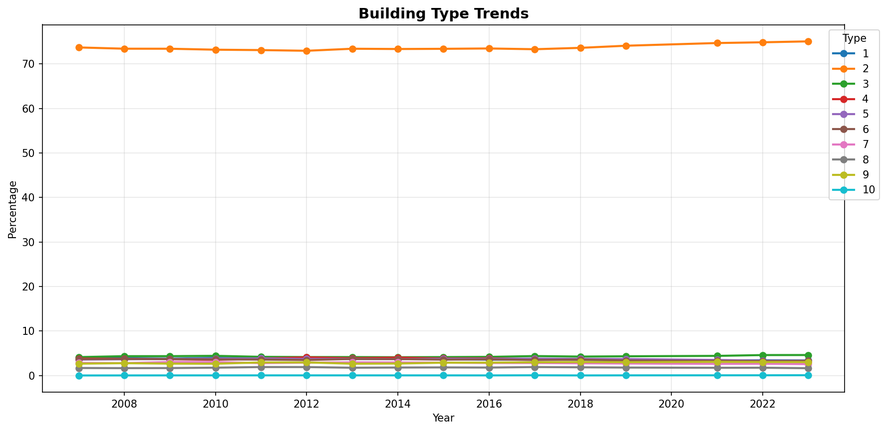
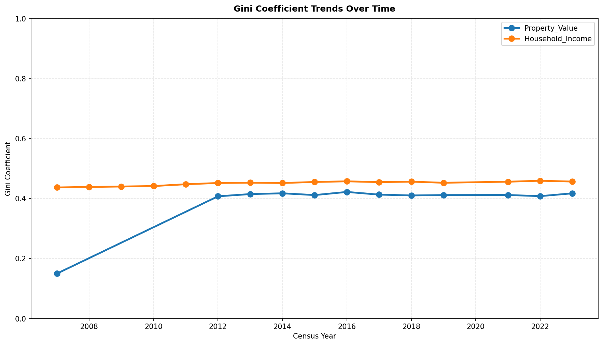
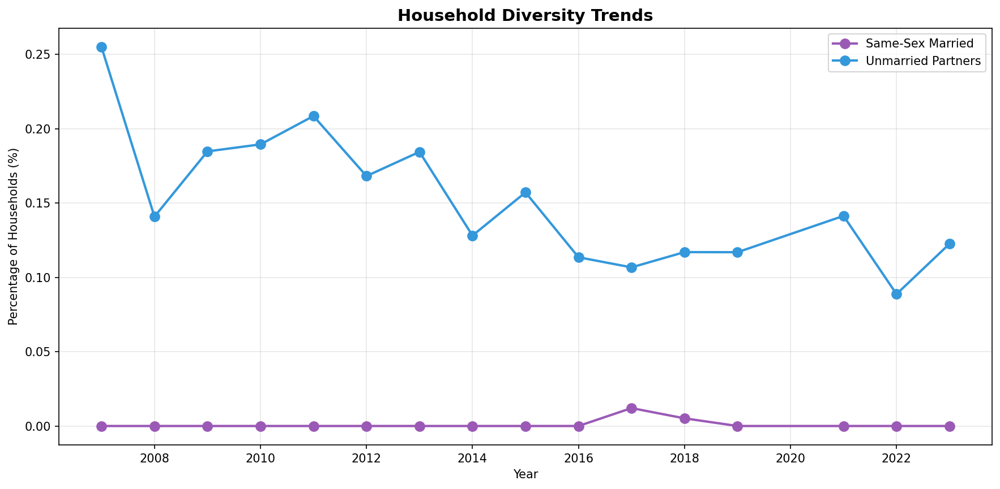
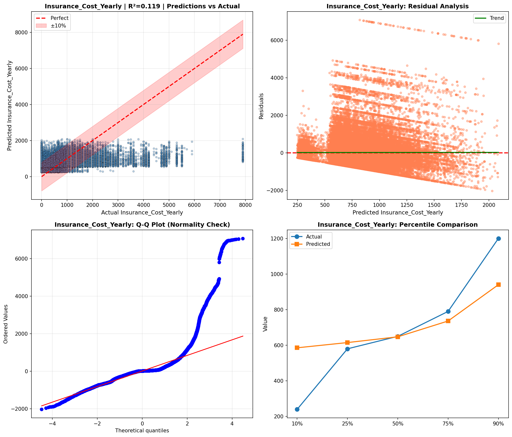
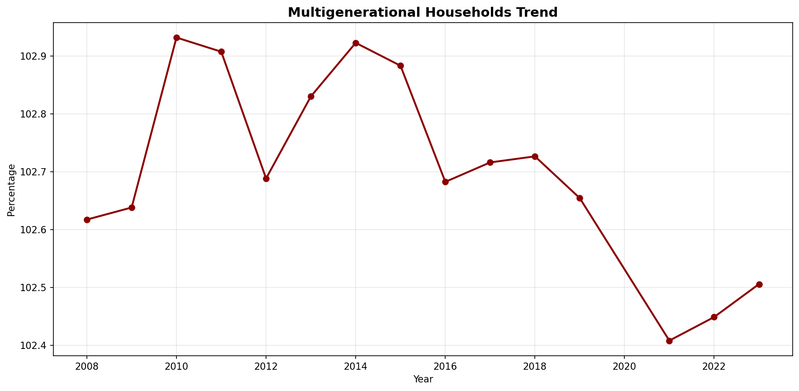
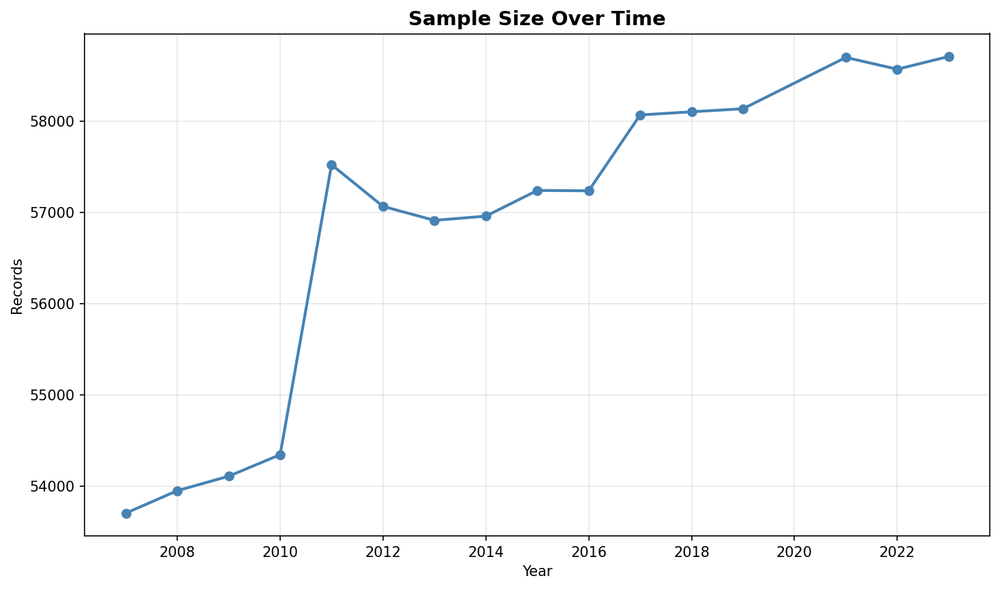
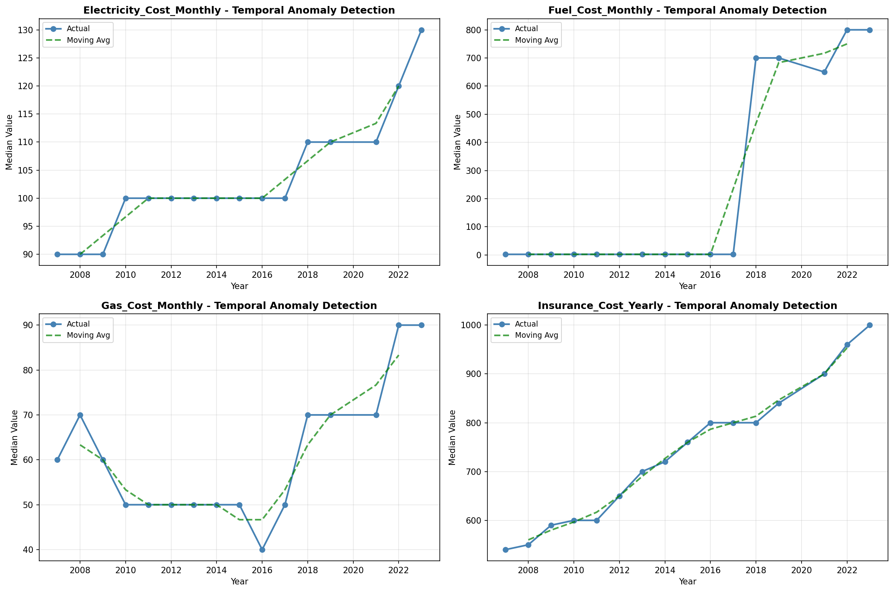
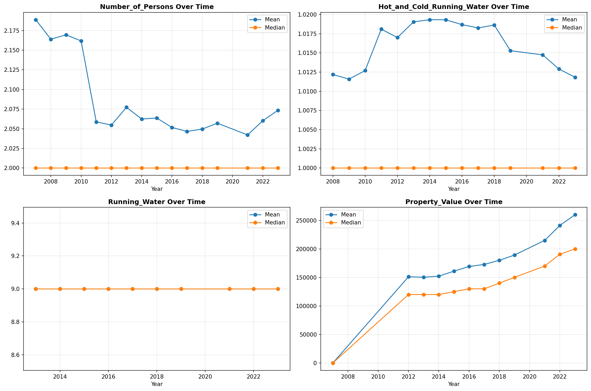
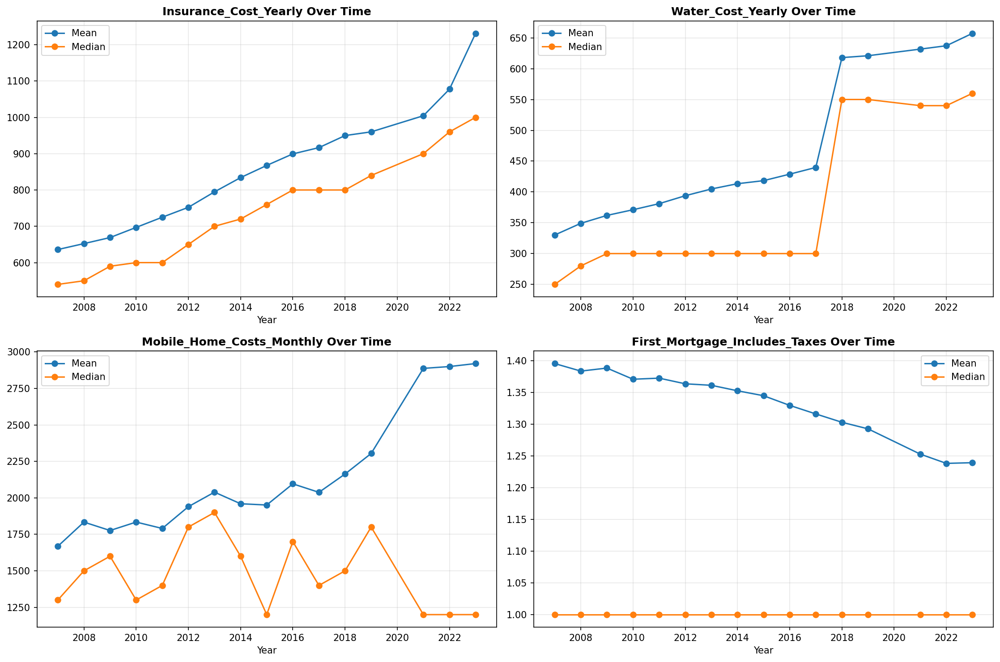

# Temporal Analysis

> Analysis of data patterns and trends over time, including year-over-year changes and growth rate calculations.

## Year Distribution

### Summary

- **Total Years**: 16

- **Year Range**: 2007 - 2023

- **Total Records**: 909,326

- **Average Records/Year**: 56,833

### Records by Year

| Year | Records | % of Total | Deviation from Avg |
| :--- | :--- | :--- | :--- |
| 2007 | 53,701 | 5.9% | -5.5% |
| 2008 | 53,947 | 5.9% | -5.1% |
| 2009 | 54,106 | 6.0% | -4.8% |
| 2010 | 54,342 | 6.0% | -4.4% |
| 2011 | 57,523 | 6.3% | +1.2% |
| 2012 | 57,066 | 6.3% | +0.4% |
| 2013 | 56,913 | 6.3% | +0.1% |
| 2014 | 56,959 | 6.3% | +0.2% |
| 2015 | 57,241 | 6.3% | +0.7% |
| 2016 | 57,237 | 6.3% | +0.7% |
| 2017 | 58,069 | 6.4% | +2.2% |
| 2018 | 58,104 | 6.4% | +2.2% |
| 2019 | 58,137 | 6.4% | +2.3% |
| 2021 | 58,700 | 6.5% | +3.3% |
| 2022 | 58,571 | 6.4% | +3.1% |
| 2023 | 58,710 | 6.5% | +3.3% |

> *Sample size increased by 9.3% from 2007 to 2023.*

## Sample Size Consistency

- **Standard Deviation**: 1,724 records

- **Coefficient of Variation**: 3.0 %

- **Consistency Rating**: highly consistent

> *Sample sizes are stable across years.*

## Temporal Trends

### Trend Summary

| Direction | Count | Percentage |
| :--- | :--- | :--- |
| Increasing | 0 | 0.0% |
| Decreasing | 0 | 0.0% |
| Stable/Other | 250 | 100.0% |

## Growth Rates

### Growth Rate Summary

- **Average Growth Rate**: 932.76 %

- **Variables with Positive Growth**: 1

- **Variables with Negative Growth**: 0

### Top Growth Rates

| Variable | Growth Rate | Direction |
| :--- | :--- | :--- |
| sample_growth | 932.76% | Increasing |

## Visualizations

