# Statistical Analysis

> Comprehensive descriptive statistics including central tendency, dispersion, distribution characteristics, and weighted statistics using ACS sample weights.

## Summary Statistics

- **Variables Analyzed**: 41

### Income_Adjustment_Factor

| Statistic | Unweighted | Weighted (ACS) |
| :--- | :--- | :--- |
| Mean | 1,014,755.30 | 1,014,656.45 |
| Median | 1,010,207.00 | 1,014,656.45 |
| Std Deviation | 11,303.99 | — |
| Minimum | 1,001,264.00 | — |
| Maximum | 1,042,311.00 | — |
| Count | 635,707 | — |

> *Distribution is highly right-skewed (skewness: 1.33), light-tailed/platykurtic (kurtosis: 0.78).*

- **Coefficient of Variation**: 1.1 % (low variability)

### Property_Value

| Statistic | Unweighted | Weighted (ACS) |
| :--- | :--- | :--- |
| Mean | 170,903.00 | 174,149.38 |
| Median | 130,000.00 | 137,834.58 |
| Std Deviation | 200,819.58 | — |
| Minimum | 1.00 | — |
| Maximum | 2,744,000.00 | — |
| Count | 428,994 | — |

> *Distribution is highly right-skewed (skewness: 5.40), heavy-tailed/leptokurtic (kurtosis: 46.25).*

- **Coefficient of Variation**: 117.5 % (very high variability)

### Electricity_Cost_Monthly

| Statistic | Unweighted | Weighted (ACS) |
| :--- | :--- | :--- |
| Mean | 126.34 | 125.94 |
| Median | 100.00 | 103.12 |
| Std Deviation | 119.25 | — |
| Minimum | 1.00 | — |
| Maximum | 3,000.00 | — |
| Count | 765,041 | — |

> *Distribution is highly right-skewed (skewness: 11.68), heavy-tailed/leptokurtic (kurtosis: 257.80).*

- **Coefficient of Variation**: 94.4 % (high variability)

### Fuel_Cost_Monthly

| Statistic | Unweighted | Weighted (ACS) |
| :--- | :--- | :--- |
| Mean | 120.63 | 345.38 |
| Median | 2.00 | 226.38 |
| Std Deviation | 441.58 | — |
| Minimum | 1.00 | — |
| Maximum | 5,700.00 | — |
| Count | 543,098 | — |

> *Distribution is highly right-skewed (skewness: 5.11), heavy-tailed/leptokurtic (kurtosis: 31.93).*

- **Coefficient of Variation**: 366.0 % (very high variability)

### Gas_Cost_Monthly

| Statistic | Unweighted | Weighted (ACS) |
| :--- | :--- | :--- |
| Mean | 80.38 | 79.60 |
| Median | 60.00 | 58.12 |
| Std Deviation | 103.80 | — |
| Minimum | 1.00 | — |
| Maximum | 2,400.00 | — |
| Count | 700,151 | — |

> *Distribution is highly right-skewed (skewness: 9.35), heavy-tailed/leptokurtic (kurtosis: 175.70).*

- **Coefficient of Variation**: 129.1 % (very high variability)

### Insurance_Cost_Yearly

| Statistic | Unweighted | Weighted (ACS) |
| :--- | :--- | :--- |
| Mean | 855.77 | 857.87 |
| Median | 710.00 | 745.62 |
| Std Deviation | 627.65 | — |
| Minimum | 4.00 | — |
| Maximum | 7,900.00 | — |
| Count | 502,163 | — |

> *Distribution is highly right-skewed (skewness: 3.41), heavy-tailed/leptokurtic (kurtosis: 20.72).*

- **Coefficient of Variation**: 73.3 % (high variability)

### Water_Cost_Yearly

| Statistic | Unweighted | Weighted (ACS) |
| :--- | :--- | :--- |
| Mean | 452.29 | 456.03 |
| Median | 360.00 | 362.50 |
| Std Deviation | 485.55 | — |
| Minimum | 1.00 | — |
| Maximum | 4,100.00 | — |
| Count | 707,759 | — |

> *Distribution is highly right-skewed (skewness: 1.85), heavy-tailed/leptokurtic (kurtosis: 6.37).*

- **Coefficient of Variation**: 107.4 % (very high variability)

### Mobile_Home_Costs_Monthly

| Statistic | Unweighted | Weighted (ACS) |
| :--- | :--- | :--- |
| Mean | 2,110.92 | 2,256.68 |
| Median | 1,500.00 | 1,831.25 |
| Std Deviation | 2,429.05 | — |
| Minimum | 4.00 | — |
| Maximum | 24,400.00 | — |
| Count | 16,622 | — |

> *Distribution is highly right-skewed (skewness: 3.61), heavy-tailed/leptokurtic (kurtosis: 26.15).*

- **Coefficient of Variation**: 115.1 % (very high variability)

### First_Mortgage_Payment_Monthly

| Statistic | Unweighted | Weighted (ACS) |
| :--- | :--- | :--- |
| Mean | 816.98 | 900.57 |
| Median | 720.00 | 731.75 |
| Std Deviation | 667.63 | — |
| Minimum | 4.00 | — |
| Maximum | 5,200.00 | — |
| Count | 401,539 | — |

> *Distribution is highly right-skewed (skewness: 1.68), heavy-tailed/leptokurtic (kurtosis: 5.40).*

- **Coefficient of Variation**: 81.7 % (high variability)

### First_Mortgage_Includes_Taxes

| Statistic | Unweighted | Weighted (ACS) |
| :--- | :--- | :--- |
| Mean | 1.33 | 1.31 |
| Median | 1.00 | 1.00 |
| Std Deviation | 0.47 | — |
| Minimum | 1.00 | — |
| Maximum | 2.00 | — |
| Count | 344,797 | — |

> *Distribution is moderately right-skewed (skewness: 0.70), light-tailed/platykurtic (kurtosis: -1.51).*

- **Coefficient of Variation**: 35.4 % (moderate variability)

### Second_Mortgage_Payment_Monthly

| Statistic | Unweighted | Weighted (ACS) |
| :--- | :--- | :--- |
| Mean | 308.30 | 311.79 |
| Median | 220.00 | 221.88 |
| Std Deviation | 302.10 | — |
| Minimum | 4.00 | — |
| Maximum | 2,800.00 | — |
| Count | 75,561 | — |

> *Distribution is highly right-skewed (skewness: 3.19), heavy-tailed/leptokurtic (kurtosis: 14.52).*

- **Coefficient of Variation**: 98.0 % (high variability)

### Property_Taxes_Yearly

| Statistic | Unweighted | Weighted (ACS) |
| :--- | :--- | :--- |
| Mean | 339.33 | 331.09 |
| Median | 31.00 | 248.92 |
| Std Deviation | 1,412.22 | — |
| Minimum | 1.00 | — |
| Maximum | 24,500.00 | — |
| Count | 418,521 | — |

> *Distribution is highly right-skewed (skewness: 7.95), heavy-tailed/leptokurtic (kurtosis: 90.99).*

- **Coefficient of Variation**: 416.2 % (very high variability)

### Meals_Included_in_Rent

| Statistic | Unweighted | Weighted (ACS) |
| :--- | :--- | :--- |
| Mean | 1.98 | 1.98 |
| Median | 2.00 | 2.00 |
| Std Deviation | 0.15 | — |
| Minimum | 1.00 | — |
| Maximum | 2.00 | — |
| Count | 209,145 | — |

> *Distribution is highly left-skewed (skewness: -6.40), heavy-tailed/leptokurtic (kurtosis: 38.98).*

- **Coefficient of Variation**: 7.5 % (low variability)

### Rent_Amount_Monthly

| Statistic | Unweighted | Weighted (ACS) |
| :--- | :--- | :--- |
| Mean | 647.35 | 666.21 |
| Median | 580.00 | 600.62 |
| Std Deviation | 396.68 | — |
| Minimum | 4.00 | — |
| Maximum | 3,500.00 | — |
| Count | 209,145 | — |

> *Distribution is highly right-skewed (skewness: 2.64), heavy-tailed/leptokurtic (kurtosis: 11.79).*

- **Coefficient of Variation**: 61.3 % (high variability)

### Gross_Rent

| Statistic | Unweighted | Weighted (ACS) |
| :--- | :--- | :--- |
| Mean | 807.95 | 821.66 |
| Median | 740.00 | 764.25 |
| Std Deviation | 438.14 | — |
| Minimum | 4.00 | — |
| Maximum | 8,842.00 | — |
| Count | 198,083 | — |

> *Distribution is highly right-skewed (skewness: 2.42), heavy-tailed/leptokurtic (kurtosis: 13.58).*

- **Coefficient of Variation**: 54.2 % (high variability)

### Gross_Rent_Percentage_Income

| Statistic | Unweighted | Weighted (ACS) |
| :--- | :--- | :--- |
| Mean | 37.80 | 38.14 |
| Median | 28.00 | 28.56 |
| Std Deviation | 27.28 | — |
| Minimum | 1.00 | — |
| Maximum | 101.00 | — |
| Count | 193,586 | — |

> *Distribution is highly right-skewed (skewness: 1.19), light-tailed/platykurtic (kurtosis: 0.34).*

- **Coefficient of Variation**: 72.2 % (high variability)

### Selected_Monthly_Owner_Costs

| Statistic | Unweighted | Weighted (ACS) |
| :--- | :--- | :--- |
| Mean | 1,067.00 | 1,109.89 |
| Median | 895.00 | 951.94 |
| Std Deviation | 780.97 | — |
| Minimum | 1.00 | — |
| Maximum | 12,167.00 | — |
| Count | 563,890 | — |

> *Distribution is highly right-skewed (skewness: 2.21), heavy-tailed/leptokurtic (kurtosis: 8.92).*

- **Coefficient of Variation**: 73.2 % (high variability)

### Owner_Costs_Percentage_Income

| Statistic | Unweighted | Weighted (ACS) |
| :--- | :--- | :--- |
| Mean | 22.30 | 22.75 |
| Median | 17.00 | 17.25 |
| Std Deviation | 19.31 | — |
| Minimum | 1.00 | — |
| Maximum | 101.00 | — |
| Count | 560,592 | — |

> *Distribution is highly right-skewed (skewness: 2.32), heavy-tailed/leptokurtic (kurtosis: 6.07).*

- **Coefficient of Variation**: 86.6 % (high variability)

### Family_Income

| Statistic | Unweighted | Weighted (ACS) |
| :--- | :--- | :--- |
| Mean | 87,012.53 | 85,488.97 |
| Median | 67,200.00 | 67,179.38 |
| Std Deviation | 81,500.87 | — |
| Minimum | 1.00 | — |
| Maximum | 1,496,000.00 | — |
| Count | 496,403 | — |

> *Distribution is highly right-skewed (skewness: 3.43), heavy-tailed/leptokurtic (kurtosis: 19.48).*

- **Coefficient of Variation**: 93.7 % (high variability)

### Household_Income

| Statistic | Unweighted | Weighted (ACS) |
| :--- | :--- | :--- |
| Mean | 72,379.56 | 71,016.62 |
| Median | 53,000.00 | 52,750.69 |
| Std Deviation | 74,531.11 | — |
| Minimum | 1.00 | — |
| Maximum | 1,496,000.00 | — |
| Count | 767,161 | — |

> *Distribution is highly right-skewed (skewness: 3.63), heavy-tailed/leptokurtic (kurtosis: 22.40).*

- **Coefficient of Variation**: 103.0 % (very high variability)

### Specified_Rent_Unit

| Statistic | Unweighted | Weighted (ACS) |
| :--- | :--- | :--- |
| Mean | 0.27 | 0.32 |
| Median | 0.00 | 0.00 |
| Std Deviation | 0.44 | — |
| Minimum | 0.00 | — |
| Maximum | 1.00 | — |
| Count | 827,532 | — |

> *Distribution is highly right-skewed (skewness: 1.06), light-tailed/platykurtic (kurtosis: -0.88).*

- **Coefficient of Variation**: 166.1 % (very high variability)

### Specified_Value_Unit

| Statistic | Unweighted | Weighted (ACS) |
| :--- | :--- | :--- |
| Mean | 0.62 | 0.55 |
| Median | 1.00 | 1.00 |
| Std Deviation | 0.49 | — |
| Minimum | 0.00 | — |
| Maximum | 1.00 | — |
| Count | 827,532 | — |

> *Distribution is approximately symmetric (skewness: -0.48), light-tailed/platykurtic (kurtosis: -1.77).*

- **Coefficient of Variation**: 78.9 % (high variability)

### Flag_Family_Income

| Statistic | Unweighted | Weighted (ACS) |
| :--- | :--- | :--- |
| Mean | 0.18 | 0.18 |
| Median | 0.00 | 0.00 |
| Std Deviation | 0.39 | — |
| Minimum | 0.00 | — |
| Maximum | 1.00 | — |
| Count | 623,863 | — |

> *Distribution is highly right-skewed (skewness: 1.63), light-tailed/platykurtic (kurtosis: 0.67).*

- **Coefficient of Variation**: 210.8 % (very high variability)

### Flag_Gross_Rent

| Statistic | Unweighted | Weighted (ACS) |
| :--- | :--- | :--- |
| Mean | 0.08 | 0.12 |
| Median | 0.00 | 0.00 |
| Std Deviation | 0.27 | — |
| Minimum | 0.00 | — |
| Maximum | 1.00 | — |
| Count | 402,568 | — |

> *Distribution is highly right-skewed (skewness: 3.19), heavy-tailed/leptokurtic (kurtosis: 8.19).*

- **Coefficient of Variation**: 347.9 % (very high variability)

### Flag_Household_Income

| Statistic | Unweighted | Weighted (ACS) |
| :--- | :--- | :--- |
| Mean | 0.28 | 0.28 |
| Median | 0.00 | 0.00 |
| Std Deviation | 0.45 | — |
| Minimum | 0.00 | — |
| Maximum | 1.00 | — |
| Count | 623,863 | — |

> *Distribution is moderately right-skewed (skewness: 0.95), light-tailed/platykurtic (kurtosis: -1.09).*

- **Coefficient of Variation**: 158.5 % (very high variability)

### Flag_First_Mortgage_Payment

| Statistic | Unweighted | Weighted (ACS) |
| :--- | :--- | :--- |
| Mean | 0.04 | 0.03 |
| Median | 0.00 | 0.00 |
| Std Deviation | 0.18 | — |
| Minimum | 0.00 | — |
| Maximum | 1.00 | — |
| Count | 827,532 | — |

> *Distribution is highly right-skewed (skewness: 5.05), heavy-tailed/leptokurtic (kurtosis: 23.48).*

- **Coefficient of Variation**: 523.8 % (very high variability)

### Flag_First_Mortgage_Taxes

| Statistic | Unweighted | Weighted (ACS) |
| :--- | :--- | :--- |
| Mean | 0.04 | 0.03 |
| Median | 0.00 | 0.00 |
| Std Deviation | 0.19 | — |
| Minimum | 0.00 | — |
| Maximum | 1.00 | — |
| Count | 827,532 | — |

> *Distribution is highly right-skewed (skewness: 5.02), heavy-tailed/leptokurtic (kurtosis: 23.20).*

- **Coefficient of Variation**: 521.2 % (very high variability)

### Flag_Meals_Included_Rent

| Statistic | Unweighted | Weighted (ACS) |
| :--- | :--- | :--- |
| Mean | 0.01 | 0.01 |
| Median | 0.00 | 0.00 |
| Std Deviation | 0.09 | — |
| Minimum | 0.00 | — |
| Maximum | 1.00 | — |
| Count | 827,532 | — |

> *Distribution is highly right-skewed (skewness: 11.40), heavy-tailed/leptokurtic (kurtosis: 127.88).*

- **Coefficient of Variation**: 1,148.4 % (very high variability)

### Flag_Rent_Amount

| Statistic | Unweighted | Weighted (ACS) |
| :--- | :--- | :--- |
| Mean | 0.02 | 0.03 |
| Median | 0.00 | 0.00 |
| Std Deviation | 0.14 | — |
| Minimum | 0.00 | — |
| Maximum | 1.00 | — |
| Count | 827,532 | — |

> *Distribution is highly right-skewed (skewness: 6.62), heavy-tailed/leptokurtic (kurtosis: 41.79).*

- **Coefficient of Variation**: 676.5 % (very high variability)

### Flag_Selected_Monthly_Owner_Costs

| Statistic | Unweighted | Weighted (ACS) |
| :--- | :--- | :--- |
| Mean | 0.23 | 0.23 |
| Median | 0.00 | 0.00 |
| Std Deviation | 0.42 | — |
| Minimum | 0.00 | — |
| Maximum | 1.00 | — |
| Count | 531,254 | — |

> *Distribution is highly right-skewed (skewness: 1.30), light-tailed/platykurtic (kurtosis: -0.32).*

- **Coefficient of Variation**: 184.0 % (very high variability)

### Flag_Second_Mortgage_Payment

| Statistic | Unweighted | Weighted (ACS) |
| :--- | :--- | :--- |
| Mean | 0.03 | 0.03 |
| Median | 0.00 | 0.00 |
| Std Deviation | 0.18 | — |
| Minimum | 0.00 | — |
| Maximum | 1.00 | — |
| Count | 827,532 | — |

> *Distribution is highly right-skewed (skewness: 5.34), heavy-tailed/leptokurtic (kurtosis: 26.54).*

- **Coefficient of Variation**: 552.4 % (very high variability)

### Flag_Property_Taxes

| Statistic | Unweighted | Weighted (ACS) |
| :--- | :--- | :--- |
| Mean | 0.10 | 0.10 |
| Median | 0.00 | 0.00 |
| Std Deviation | 0.29 | — |
| Minimum | 0.00 | — |
| Maximum | 1.00 | — |
| Count | 774,359 | — |

> *Distribution is highly right-skewed (skewness: 2.76), heavy-tailed/leptokurtic (kurtosis: 5.61).*

- **Coefficient of Variation**: 308.3 % (very high variability)

### Flag_Property_Value

| Statistic | Unweighted | Weighted (ACS) |
| :--- | :--- | :--- |
| Mean | 0.06 | 0.06 |
| Median | 0.00 | 0.00 |
| Std Deviation | 0.24 | — |
| Minimum | 0.00 | — |
| Maximum | 1.00 | — |
| Count | 827,532 | — |

> *Distribution is highly right-skewed (skewness: 3.62), heavy-tailed/leptokurtic (kurtosis: 11.10).*

- **Coefficient of Variation**: 387.8 % (very high variability)

### Flag_Water_Cost

| Statistic | Unweighted | Weighted (ACS) |
| :--- | :--- | :--- |
| Mean | 0.07 | 0.08 |
| Median | 0.00 | 0.00 |
| Std Deviation | 0.26 | — |
| Minimum | 0.00 | — |
| Maximum | 1.00 | — |
| Count | 53,173 | — |

> *Distribution is highly right-skewed (skewness: 3.29), heavy-tailed/leptokurtic (kurtosis: 8.80).*

- **Coefficient of Variation**: 356.7 % (very high variability)

### Annual_Rent_to_Value_Ratio

### Total_Monthly_Utility_Cost

| Statistic | Unweighted | Weighted (ACS) |
| :--- | :--- | :--- |
| Mean | 199.32 | 195.20 |
| Median | 173.00 | 171.25 |
| Std Deviation | 168.41 | — |
| Minimum | 2.00 | — |
| Maximum | 5,200.00 | — |
| Count | 767,317 | — |

> *Distribution is highly right-skewed (skewness: 11.31), heavy-tailed/leptokurtic (kurtosis: 256.44).*

- **Coefficient of Variation**: 84.5 % (high variability)

### Property_Tax_Rate

| Statistic | Unweighted | Weighted (ACS) |
| :--- | :--- | :--- |
| Mean | 27.05 | 26.56 |
| Median | 0.03 | 25.97 |
| Std Deviation | 74.57 | — |
| Minimum | 0.00 | — |
| Maximum | 1,300.00 | — |
| Count | 278,440 | — |

> *Distribution is highly right-skewed (skewness: 2.91), heavy-tailed/leptokurtic (kurtosis: 9.47).*

- **Coefficient of Variation**: 275.7 % (very high variability)

#### Weighted Statistics by Year

| Year | Weighted Mean | Weighted Median |
| :--- | :--- | :--- |
| 2007 | 210.64 | 206.25 |
| 2012 | 0.03 | 0.02 |
| 2013 | 0.08 | 0.02 |
| 2014 | 0.08 | 0.02 |
| 2015 | 0.03 | 0.02 |
| 2016 | 0.03 | 0.02 |
| 2017 | 0.03 | 0.02 |
| 2023 | 1.57 | 1.35 |

### Structure_Age

| Statistic | Unweighted | Weighted (ACS) |
| :--- | :--- | :--- |
| Mean | 1,874.72 | 1,878.86 |
| Median | 2,019.00 | 1,879.07 |
| Std Deviation | 512.52 | — |
| Minimum | 1.00 | — |
| Maximum | 2,023.00 | — |
| Count | 721,901 | — |

> *Distribution is highly left-skewed (skewness: -3.27), heavy-tailed/leptokurtic (kurtosis: 8.66).*

- **Coefficient of Variation**: 27.3 % (moderate variability)

### Structure_Age_Score

| Statistic | Unweighted | Weighted (ACS) |
| :--- | :--- | :--- |
| Mean | 0.03 | 0.03 |
| Median | 0.00 | 0.03 |
| Std Deviation | 0.13 | — |
| Minimum | 0.00 | — |
| Maximum | 0.99 | — |
| Count | 721,901 | — |

> *Distribution is highly right-skewed (skewness: 4.60), heavy-tailed/leptokurtic (kurtosis: 21.58).*

- **Coefficient of Variation**: 409.0 % (very high variability)

### Working_Age_Persons

| Statistic | Unweighted | Weighted (ACS) |
| :--- | :--- | :--- |
| Mean | 1.63 | 1.70 |
| Median | 2.00 | 1.88 |
| Std Deviation | 1.34 | — |
| Minimum | 0.00 | — |
| Maximum | 20.00 | — |
| Count | 775,789 | — |

> *Distribution is moderately right-skewed (skewness: 0.97), light-tailed/platykurtic (kurtosis: 2.33).*

- **Coefficient of Variation**: 82.4 % (high variability)

### Income_to_FPL_Ratio

| Statistic | Unweighted | Weighted (ACS) |
| :--- | :--- | :--- |
| Mean | 3.32 | 3.23 |
| Median | 2.54 | 2.50 |
| Std Deviation | 3.33 | — |
| Minimum | -1.01 | — |
| Maximum | 73.99 | — |
| Count | 775,789 | — |

> *Distribution is highly right-skewed (skewness: 3.93), heavy-tailed/leptokurtic (kurtosis: 26.77).*

- **Coefficient of Variation**: 100.4 % (very high variability)

## Distribution Analysis

### Skewed Distributions

> Variables with skewness > |0.5| indicate non-normal distributions. Consider log transformations for highly skewed variables in modeling.

| Variable | Skewness | Direction | Severity |
| :--- | :--- | :--- | :--- |
| Electricity_Cost_Monthly | 11.679 | Right-skewed | High |
| Flag_Meals_Included_Rent | 11.397 | Right-skewed | High |
| Total_Monthly_Utility_Cost | 11.309 | Right-skewed | High |
| Gas_Cost_Monthly | 9.355 | Right-skewed | High |
| Property_Taxes_Yearly | 7.947 | Right-skewed | High |
| Flag_Rent_Amount | 6.617 | Right-skewed | High |
| Meals_Included_in_Rent | -6.402 | Left-skewed | High |
| Property_Value | 5.396 | Right-skewed | High |
| Flag_Second_Mortgage_Payment | 5.343 | Right-skewed | High |
| Fuel_Cost_Monthly | 5.114 | Right-skewed | High |
| Flag_First_Mortgage_Payment | 5.047 | Right-skewed | High |
| Flag_First_Mortgage_Taxes | 5.020 | Right-skewed | High |
| Structure_Age_Score | 4.602 | Right-skewed | High |
| Income_to_FPL_Ratio | 3.930 | Right-skewed | High |
| Household_Income | 3.634 | Right-skewed | High |
| Flag_Property_Value | 3.620 | Right-skewed | High |
| Mobile_Home_Costs_Monthly | 3.611 | Right-skewed | High |
| Family_Income | 3.425 | Right-skewed | High |
| Insurance_Cost_Yearly | 3.410 | Right-skewed | High |
| Flag_Water_Cost | 3.287 | Right-skewed | High |

- **Total Skewed Variables**: 39

- **Right-skewed**: 37

- **Left-skewed**: 2

## Variance Analysis

### Coefficient of Variation Ranking

> CV (Coefficient of Variation) = (Std Dev / Mean) × 100%. Higher CV indicates greater relative variability.

| Variable | CV (%) | Std Dev | Mean | Variability |
| :--- | :--- | :--- | :--- | :--- |
| Flag_Meals_Included_Rent | 1148.4% | 0.09 | 0.01 | Very High |
| Flag_Rent_Amount | 676.5% | 0.14 | 0.02 | Very High |
| Flag_Second_Mortgage_Payment | 552.4% | 0.18 | 0.03 | Very High |
| Flag_First_Mortgage_Payment | 523.8% | 0.18 | 0.04 | Very High |
| Flag_First_Mortgage_Taxes | 521.2% | 0.19 | 0.04 | Very High |
| Property_Taxes_Yearly | 416.2% | 1,412.22 | 339.33 | Very High |
| Structure_Age_Score | 409.0% | 0.13 | 0.03 | Very High |
| Flag_Property_Value | 387.8% | 0.24 | 0.06 | Very High |
| Fuel_Cost_Monthly | 366.0% | 441.58 | 120.63 | Very High |
| Flag_Water_Cost | 356.7% | 0.26 | 0.07 | Very High |
| Flag_Gross_Rent | 347.9% | 0.27 | 0.08 | Very High |
| Flag_Property_Taxes | 308.3% | 0.29 | 0.10 | Very High |
| Property_Tax_Rate | 275.7% | 74.57 | 27.05 | Very High |
| Flag_Family_Income | 210.8% | 0.39 | 0.18 | Very High |
| Flag_Selected_Monthly_Owner_Costs | 184.0% | 0.42 | 0.23 | Very High |
| Specified_Rent_Unit | 166.1% | 0.44 | 0.27 | Very High |
| Flag_Household_Income | 158.5% | 0.45 | 0.28 | Very High |
| Gas_Cost_Monthly | 129.1% | 103.80 | 80.38 | Very High |
| Property_Value | 117.5% | 200,819.58 | 170,903.00 | Very High |
| Mobile_Home_Costs_Monthly | 115.1% | 2,429.05 | 2,110.92 | Very High |

- **Average CV**: 219.7 %

- **High Variance Variables (CV > 50%)**: 36

## Visualizations

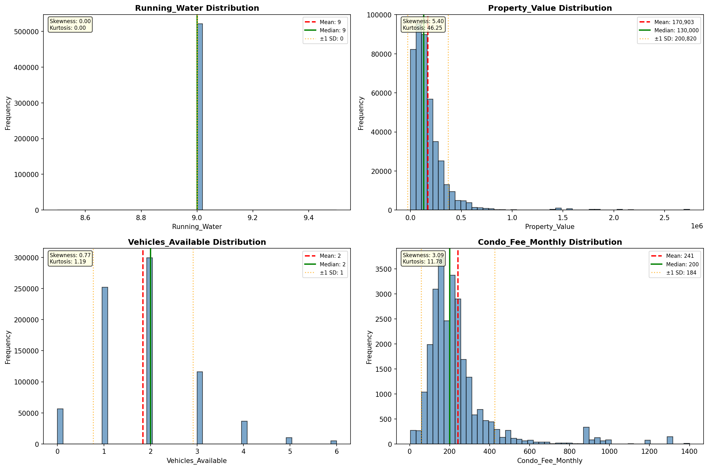

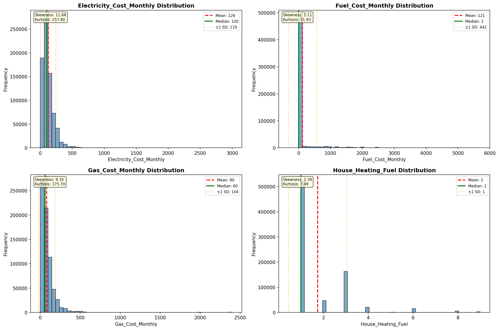

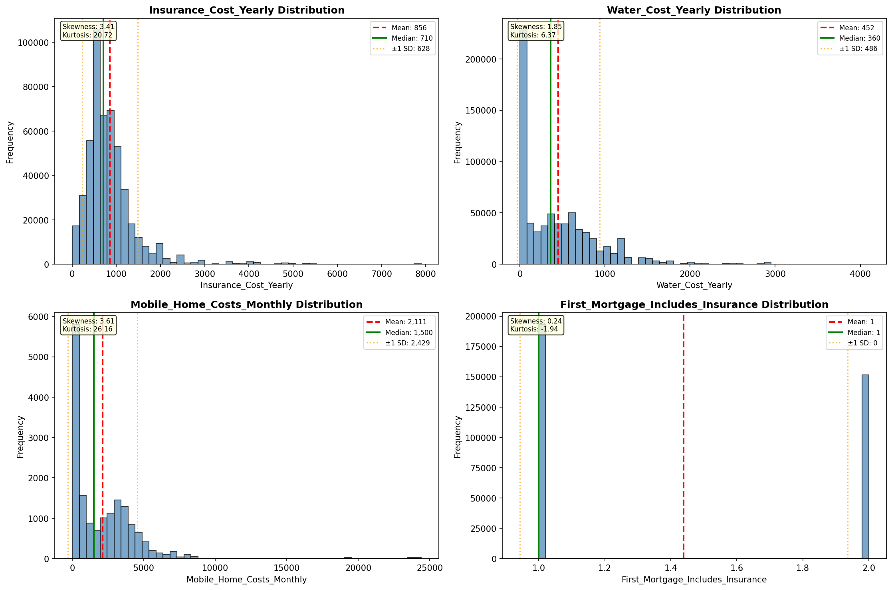

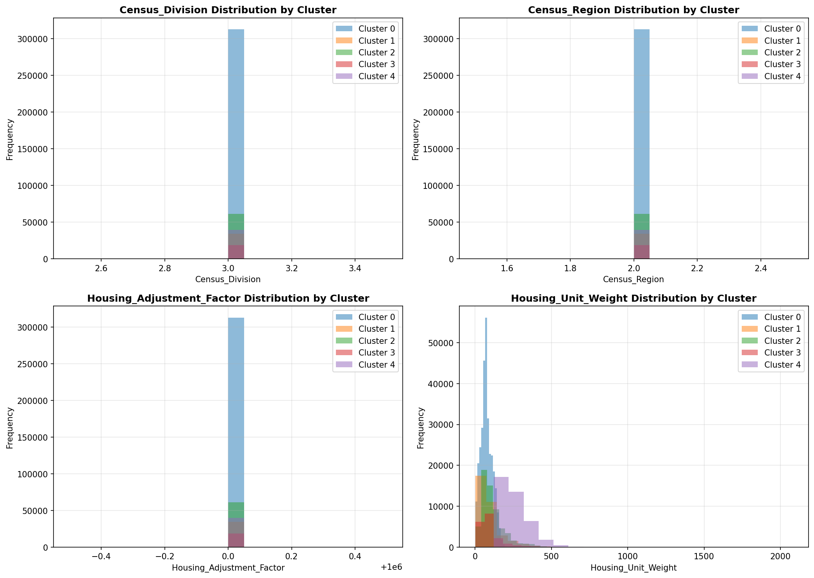

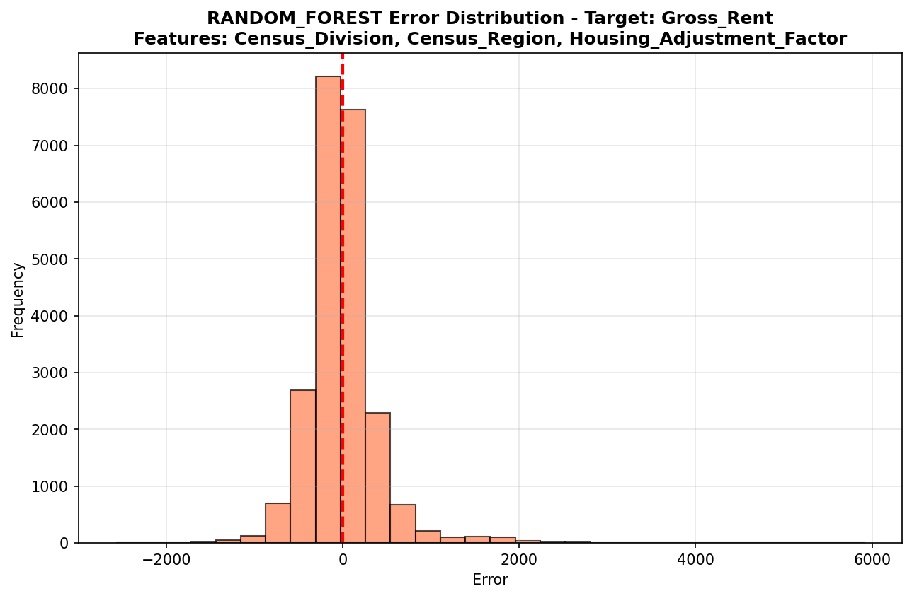

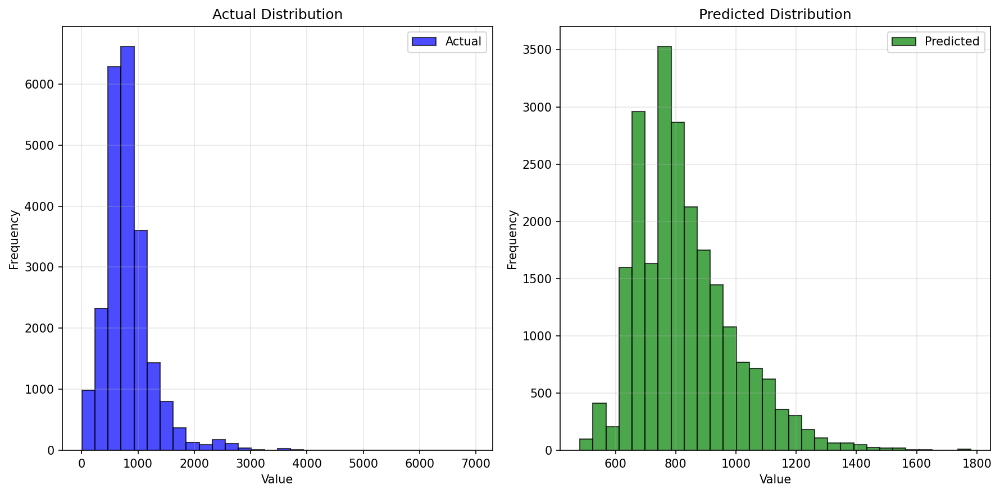

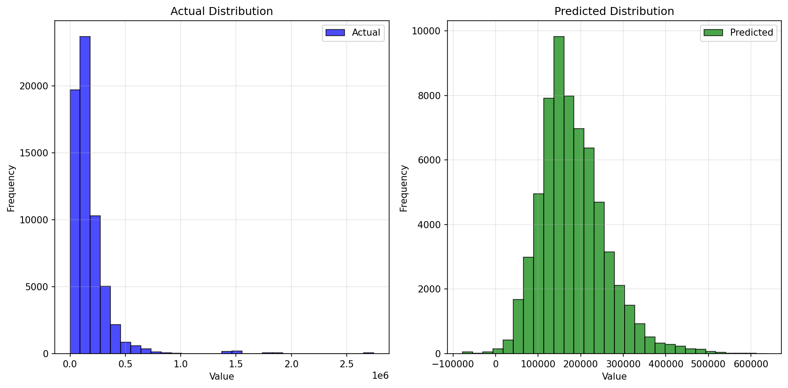

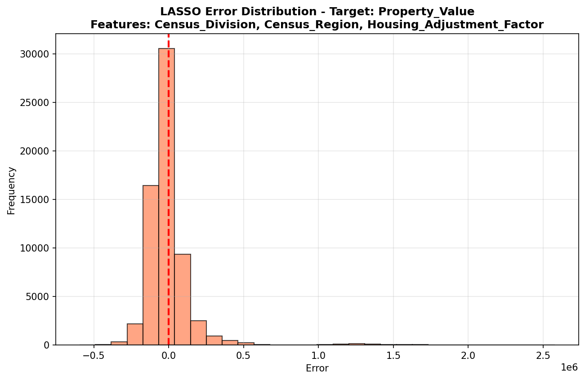

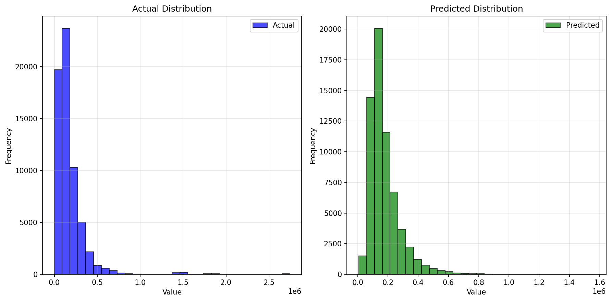

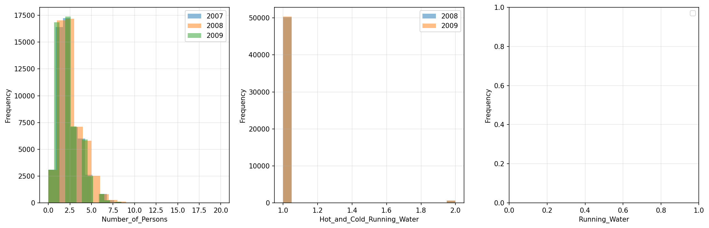

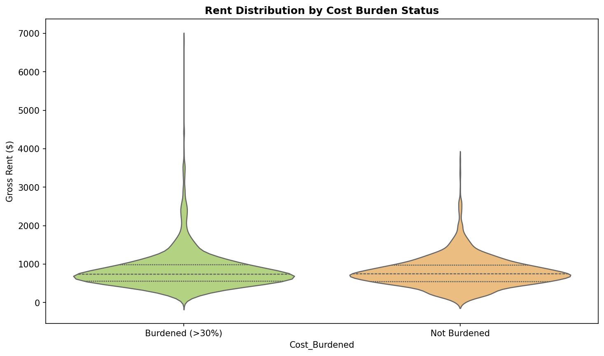

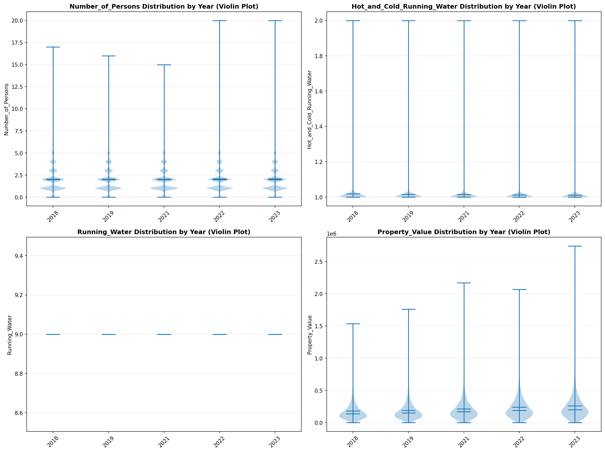

