# Statistical Analysis

> Comprehensive descriptive statistics including central tendency, dispersion, distribution characteristics, and weighted statistics using ACS sample weights.

## Summary Statistics

- **Variables Analyzed**: 30

### Income_Adjustment_Factor

| Statistic | Unweighted | Weighted (ACS) |
| :--- | :--- | :--- |
| Mean | 1,014,913.51 | 1,014,834.00 |
| Median | 1,011,189.00 | 1,014,834.00 |
| Std Deviation | 10,842.39 | — |
| Minimum | 1,001,264.00 | — |
| Maximum | 1,042,311.00 | — |
| Count | 1,425,815 | — |

> *Distribution is highly right-skewed (skewness: 1.34), light-tailed/platykurtic (kurtosis: 1.02).*

- **Coefficient of Variation**: 1.1 % (low variability)

### Age

| Statistic | Unweighted | Weighted (ACS) |
| :--- | :--- | :--- |
| Mean | 41.52 | 39.05 |
| Median | 43.00 | 38.69 |
| Std Deviation | 23.83 | — |
| Minimum | 0.00 | — |
| Maximum | 95.00 | — |
| Count | 1,895,839 | — |

> *Distribution is approximately symmetric (skewness: 0.04), light-tailed/platykurtic (kurtosis: -1.03).*

- **Coefficient of Variation**: 57.4 % (high variability)

### Interest_Dividend_Rental_Income

| Statistic | Unweighted | Weighted (ACS) |
| :--- | :--- | :--- |
| Mean | 12,689.76 | 12,853.24 |
| Median | 1,700.00 | 1,675.00 |
| Std Deviation | 37,831.58 | — |
| Minimum | 1.00 | — |
| Maximum | 330,000.00 | — |
| Count | 213,645 | — |

> *Distribution is highly right-skewed (skewness: 5.23), heavy-tailed/leptokurtic (kurtosis: 30.08).*

- **Coefficient of Variation**: 298.1 % (very high variability)

### Other_Income

| Statistic | Unweighted | Weighted (ACS) |
| :--- | :--- | :--- |
| Mean | 9,462.34 | 9,271.64 |
| Median | 4,800.00 | 4,887.50 |
| Std Deviation | 12,630.00 | — |
| Minimum | 4.00 | — |
| Maximum | 72,000.00 | — |
| Count | 103,690 | — |

> *Distribution is highly right-skewed (skewness: 2.53), heavy-tailed/leptokurtic (kurtosis: 6.89).*

- **Coefficient of Variation**: 133.5 % (very high variability)

### Public_Assistance_Income

| Statistic | Unweighted | Weighted (ACS) |
| :--- | :--- | :--- |
| Mean | 2,886.64 | 2,874.46 |
| Median | 1,800.00 | 1,806.25 |
| Std Deviation | 3,815.13 | — |
| Minimum | 4.00 | — |
| Maximum | 30,000.00 | — |
| Count | 24,761 | — |

> *Distribution is highly right-skewed (skewness: 3.33), heavy-tailed/leptokurtic (kurtosis: 15.26).*

- **Coefficient of Variation**: 132.2 % (very high variability)

### Retirement_Income

| Statistic | Unweighted | Weighted (ACS) |
| :--- | :--- | :--- |
| Mean | 20,058.69 | 19,844.39 |
| Median | 12,200.00 | 12,556.25 |
| Std Deviation | 23,578.42 | — |
| Minimum | 4.00 | — |
| Maximum | 160,000.00 | — |
| Count | 238,434 | — |

> *Distribution is highly right-skewed (skewness: 2.86), heavy-tailed/leptokurtic (kurtosis: 10.58).*

- **Coefficient of Variation**: 117.5 % (very high variability)

### Self_Employment_Income

| Statistic | Unweighted | Weighted (ACS) |
| :--- | :--- | :--- |
| Mean | 29,140.67 | 29,446.59 |
| Median | 12,000.00 | 12,431.25 |
| Std Deviation | 52,089.61 | — |
| Minimum | 1.00 | — |
| Maximum | 349,000.00 | — |
| Count | 78,932 | — |

> *Distribution is highly right-skewed (skewness: 3.82), heavy-tailed/leptokurtic (kurtosis: 16.28).*

- **Coefficient of Variation**: 178.8 % (very high variability)

### Supplemental_Security_Income

| Statistic | Unweighted | Weighted (ACS) |
| :--- | :--- | :--- |
| Mean | 8,372.13 | 8,274.13 |
| Median | 8,100.00 | 8,412.50 |
| Std Deviation | 4,756.50 | — |
| Minimum | 4.00 | — |
| Maximum | 30,000.00 | — |
| Count | 51,089 | — |

> *Distribution is highly right-skewed (skewness: 1.37), light-tailed/platykurtic (kurtosis: 2.85).*

- **Coefficient of Variation**: 56.8 % (high variability)

### Social_Security_Income

| Statistic | Unweighted | Weighted (ACS) |
| :--- | :--- | :--- |
| Mean | 13,300.22 | 13,149.88 |
| Median | 12,700.00 | 12,762.50 |
| Std Deviation | 7,364.54 | — |
| Minimum | 4.00 | — |
| Maximum | 50,000.00 | — |
| Count | 384,594 | — |

> *Distribution is moderately right-skewed (skewness: 0.73), light-tailed/platykurtic (kurtosis: 1.08).*

- **Coefficient of Variation**: 55.4 % (high variability)

### Wage_Income

| Statistic | Unweighted | Weighted (ACS) |
| :--- | :--- | :--- |
| Mean | 42,599.89 | 41,969.58 |
| Median | 31,500.00 | 31,581.25 |
| Std Deviation | 50,369.11 | — |
| Minimum | 4.00 | — |
| Maximum | 506,000.00 | — |
| Count | 936,224 | — |

> *Distribution is highly right-skewed (skewness: 4.32), heavy-tailed/leptokurtic (kurtosis: 27.83).*

- **Coefficient of Variation**: 118.2 % (very high variability)

### Hours_Worked_Per_Week

| Statistic | Unweighted | Weighted (ACS) |
| :--- | :--- | :--- |
| Mean | 37.44 | 37.73 |
| Median | 40.00 | 40.00 |
| Std Deviation | 13.09 | — |
| Minimum | 1.00 | — |
| Maximum | 99.00 | — |
| Count | 984,589 | — |

> *Distribution is approximately symmetric (skewness: -0.21), light-tailed/platykurtic (kurtosis: 1.42).*

- **Coefficient of Variation**: 35.0 % (moderate variability)

### Presence_And_Age_Own_Children

| Statistic | Unweighted | Weighted (ACS) |
| :--- | :--- | :--- |
| Mean | 3.51 | 3.47 |
| Median | 4.00 | 4.00 |
| Std Deviation | 0.92 | — |
| Minimum | 1.00 | — |
| Maximum | 4.00 | — |
| Count | 768,143 | — |

> *Distribution is highly left-skewed (skewness: -1.60), light-tailed/platykurtic (kurtosis: 1.03).*

- **Coefficient of Variation**: 26.3 % (moderate variability)

### Total_Person_Earnings

| Statistic | Unweighted | Weighted (ACS) |
| :--- | :--- | :--- |
| Mean | 42,888.77 | 42,253.98 |
| Median | 31,000.00 | 31,325.00 |
| Std Deviation | 52,259.41 | — |
| Minimum | 1.00 | — |
| Maximum | 847,000.00 | — |
| Count | 983,184 | — |

> *Distribution is highly right-skewed (skewness: 4.45), heavy-tailed/leptokurtic (kurtosis: 29.90).*

- **Coefficient of Variation**: 121.8 % (very high variability)

### Total_Person_Income

| Statistic | Unweighted | Weighted (ACS) |
| :--- | :--- | :--- |
| Mean | 39,974.16 | 39,649.15 |
| Median | 27,300.00 | 27,669.38 |
| Std Deviation | 50,609.70 | — |
| Minimum | 1.00 | — |
| Maximum | 1,166,000.00 | — |
| Count | 1,406,846 | — |

> *Distribution is highly right-skewed (skewness: 4.83), heavy-tailed/leptokurtic (kurtosis: 36.75).*

- **Coefficient of Variation**: 126.6 % (very high variability)

### Poverty_Status

| Statistic | Unweighted | Weighted (ACS) |
| :--- | :--- | :--- |
| Mean | 309.65 | 301.71 |
| Median | 315.00 | 303.94 |
| Std Deviation | 161.19 | — |
| Minimum | 0.00 | — |
| Maximum | 501.00 | — |
| Count | 1,820,250 | — |

> *Distribution is approximately symmetric (skewness: -0.24), light-tailed/platykurtic (kurtosis: -1.27).*

- **Coefficient of Variation**: 52.1 % (high variability)

### Flag_Age

| Statistic | Unweighted | Weighted (ACS) |
| :--- | :--- | :--- |
| Mean | 0.01 | 0.01 |
| Median | 0.00 | 0.00 |
| Std Deviation | 0.09 | — |
| Minimum | 0.00 | — |
| Maximum | 1.00 | — |
| Count | 1,895,839 | — |

> *Distribution is highly right-skewed (skewness: 10.72), heavy-tailed/leptokurtic (kurtosis: 113.01).*

- **Coefficient of Variation**: 1,081.7 % (very high variability)

### Flag_Interest_Dividend_Income

| Statistic | Unweighted | Weighted (ACS) |
| :--- | :--- | :--- |
| Mean | 0.11 | 0.10 |
| Median | 0.00 | 0.00 |
| Std Deviation | 0.31 | — |
| Minimum | 0.00 | — |
| Maximum | 1.00 | — |
| Count | 1,895,839 | — |

> *Distribution is highly right-skewed (skewness: 2.58), heavy-tailed/leptokurtic (kurtosis: 4.63).*

- **Coefficient of Variation**: 291.8 % (very high variability)

### Flag_Other_Income

| Statistic | Unweighted | Weighted (ACS) |
| :--- | :--- | :--- |
| Mean | 0.09 | 0.08 |
| Median | 0.00 | 0.00 |
| Std Deviation | 0.28 | — |
| Minimum | 0.00 | — |
| Maximum | 1.00 | — |
| Count | 1,895,839 | — |

> *Distribution is highly right-skewed (skewness: 2.89), heavy-tailed/leptokurtic (kurtosis: 6.34).*

- **Coefficient of Variation**: 320.1 % (very high variability)

### Flag_Retirement_Income

| Statistic | Unweighted | Weighted (ACS) |
| :--- | :--- | :--- |
| Mean | 0.09 | 0.09 |
| Median | 0.00 | 0.00 |
| Std Deviation | 0.29 | — |
| Minimum | 0.00 | — |
| Maximum | 1.00 | — |
| Count | 1,895,839 | — |

> *Distribution is highly right-skewed (skewness: 2.76), heavy-tailed/leptokurtic (kurtosis: 5.64).*

- **Coefficient of Variation**: 308.8 % (very high variability)

### Flag_Self_Employment_Income

| Statistic | Unweighted | Weighted (ACS) |
| :--- | :--- | :--- |
| Mean | 0.07 | 0.06 |
| Median | 0.00 | 0.00 |
| Std Deviation | 0.25 | — |
| Minimum | 0.00 | — |
| Maximum | 1.00 | — |
| Count | 1,895,839 | — |

> *Distribution is highly right-skewed (skewness: 3.42), heavy-tailed/leptokurtic (kurtosis: 9.72).*

- **Coefficient of Variation**: 369.4 % (very high variability)

### Flag_Social_Security_Income

| Statistic | Unweighted | Weighted (ACS) |
| :--- | :--- | :--- |
| Mean | 0.10 | 0.09 |
| Median | 0.00 | 0.00 |
| Std Deviation | 0.30 | — |
| Minimum | 0.00 | — |
| Maximum | 1.00 | — |
| Count | 1,895,839 | — |

> *Distribution is highly right-skewed (skewness: 2.63), heavy-tailed/leptokurtic (kurtosis: 4.93).*

- **Coefficient of Variation**: 297.0 % (very high variability)

### Flag_Supplemental_Security_Income

| Statistic | Unweighted | Weighted (ACS) |
| :--- | :--- | :--- |
| Mean | 0.09 | 0.08 |
| Median | 0.00 | 0.00 |
| Std Deviation | 0.28 | — |
| Minimum | 0.00 | — |
| Maximum | 1.00 | — |
| Count | 1,895,839 | — |

> *Distribution is highly right-skewed (skewness: 2.96), heavy-tailed/leptokurtic (kurtosis: 6.75).*

- **Coefficient of Variation**: 326.4 % (very high variability)

### Flag_Wage_Income

| Statistic | Unweighted | Weighted (ACS) |
| :--- | :--- | :--- |
| Mean | 0.12 | 0.13 |
| Median | 0.00 | 0.00 |
| Std Deviation | 0.32 | — |
| Minimum | 0.00 | — |
| Maximum | 1.00 | — |
| Count | 1,895,839 | — |

> *Distribution is highly right-skewed (skewness: 2.37), heavy-tailed/leptokurtic (kurtosis: 3.64).*

- **Coefficient of Variation**: 273.9 % (very high variability)

### Flag_Hours_Worked

| Statistic | Unweighted | Weighted (ACS) |
| :--- | :--- | :--- |
| Mean | 0.05 | 0.05 |
| Median | 0.00 | 0.00 |
| Std Deviation | 0.22 | — |
| Minimum | 0.00 | — |
| Maximum | 1.00 | — |
| Count | 1,895,839 | — |

> *Distribution is highly right-skewed (skewness: 4.17), heavy-tailed/leptokurtic (kurtosis: 15.37).*

- **Coefficient of Variation**: 439.5 % (very high variability)

### Income_Per_Hour

| Statistic | Unweighted | Weighted (ACS) |
| :--- | :--- | :--- |
| Mean | 24.93 | 23.85 |
| Median | 17.21 | 16.74 |
| Std Deviation | 51.65 | — |
| Minimum | 0.00 | — |
| Maximum | 9,730.77 | — |
| Count | 983,835 | — |

> *Distribution is highly right-skewed (skewness: 46.87), heavy-tailed/leptokurtic (kurtosis: 5034.76).*

- **Coefficient of Variation**: 207.2 % (very high variability)

### Income_Per_Week_Worked

| Statistic | Unweighted | Weighted (ACS) |
| :--- | :--- | :--- |
| Mean | 33,476.17 | 33,016.61 |
| Median | 21,000.00 | 23,662.12 |
| Std Deviation | 48,547.29 | — |
| Minimum | 0.02 | — |
| Maximum | 986,000.00 | — |
| Count | 797,752 | — |

> *Distribution is highly right-skewed (skewness: 4.43), heavy-tailed/leptokurtic (kurtosis: 31.37).*

- **Coefficient of Variation**: 145.0 % (very high variability)

### Total_Annual_Hours

| Statistic | Unweighted | Weighted (ACS) |
| :--- | :--- | :--- |
| Mean | 333.21 | 326.88 |
| Median | 45.00 | 353.85 |
| Std Deviation | 704.23 | — |
| Minimum | 1.00 | — |
| Maximum | 5,148.00 | — |
| Count | 798,382 | — |

> *Distribution is highly right-skewed (skewness: 2.51), heavy-tailed/leptokurtic (kurtosis: 5.28).*

- **Coefficient of Variation**: 211.3 % (very high variability)

### In_Poverty

| Statistic | Unweighted | Weighted (ACS) |
| :--- | :--- | :--- |
| Mean | 0.31 | 0.30 |
| Median | 0.00 | 0.00 |
| Std Deviation | 0.46 | — |
| Minimum | 0.00 | — |
| Maximum | 1.00 | — |
| Count | 1,895,839 | — |

> *Distribution is moderately right-skewed (skewness: 0.83), light-tailed/platykurtic (kurtosis: -1.32).*

- **Coefficient of Variation**: 149.5 % (very high variability)

### Poverty_Gap

| Statistic | Unweighted | Weighted (ACS) |
| :--- | :--- | :--- |
| Mean | 0.24 | 0.25 |
| Median | 0.00 | 0.00 |
| Std Deviation | 0.37 | — |
| Minimum | 0.00 | — |
| Maximum | 2.33 | — |
| Count | 1,572,756 | — |

> *Distribution is highly right-skewed (skewness: 1.17), light-tailed/platykurtic (kurtosis: -0.29).*

- **Coefficient of Variation**: 153.9 % (very high variability)

### Poverty_Severity

| Statistic | Unweighted | Weighted (ACS) |
| :--- | :--- | :--- |
| Mean | 0.20 | 0.20 |
| Median | 0.00 | 0.00 |
| Std Deviation | 0.35 | — |
| Minimum | 0.00 | — |
| Maximum | 5.44 | — |
| Count | 1,572,756 | — |

> *Distribution is highly right-skewed (skewness: 1.58), light-tailed/platykurtic (kurtosis: 1.05).*

- **Coefficient of Variation**: 178.5 % (very high variability)

## Distribution Analysis

### Skewed Distributions

> Variables with skewness > |0.5| indicate non-normal distributions. Consider log transformations for highly skewed variables in modeling.

| Variable | Skewness | Direction | Severity |
| :--- | :--- | :--- | :--- |
| Income_Per_Hour | 46.873 | Right-skewed | High |
| Flag_Age | 10.724 | Right-skewed | High |
| Interest_Dividend_Rental_Income | 5.234 | Right-skewed | High |
| Total_Person_Income | 4.830 | Right-skewed | High |
| Total_Person_Earnings | 4.447 | Right-skewed | High |
| Income_Per_Week_Worked | 4.431 | Right-skewed | High |
| Wage_Income | 4.318 | Right-skewed | High |
| Flag_Hours_Worked | 4.168 | Right-skewed | High |
| Self_Employment_Income | 3.823 | Right-skewed | High |
| Flag_Self_Employment_Income | 3.424 | Right-skewed | High |
| Public_Assistance_Income | 3.333 | Right-skewed | High |
| Flag_Supplemental_Security_Income | 2.958 | Right-skewed | High |
| Flag_Other_Income | 2.888 | Right-skewed | High |
| Retirement_Income | 2.863 | Right-skewed | High |
| Flag_Retirement_Income | 2.764 | Right-skewed | High |
| Flag_Social_Security_Income | 2.633 | Right-skewed | High |
| Flag_Interest_Dividend_Income | 2.576 | Right-skewed | High |
| Other_Income | 2.526 | Right-skewed | High |
| Total_Annual_Hours | 2.505 | Right-skewed | High |
| Flag_Wage_Income | 2.374 | Right-skewed | High |

- **Total Skewed Variables**: 27

- **Right-skewed**: 26

- **Left-skewed**: 1

## Variance Analysis

### Coefficient of Variation Ranking

> CV (Coefficient of Variation) = (Std Dev / Mean) × 100%. Higher CV indicates greater relative variability.

| Variable | CV (%) | Std Dev | Mean | Variability |
| :--- | :--- | :--- | :--- | :--- |
| Flag_Age | 1081.7% | 0.09 | 0.01 | Very High |
| Flag_Hours_Worked | 439.5% | 0.22 | 0.05 | Very High |
| Flag_Self_Employment_Income | 369.4% | 0.25 | 0.07 | Very High |
| Flag_Supplemental_Security_Income | 326.4% | 0.28 | 0.09 | Very High |
| Flag_Other_Income | 320.1% | 0.28 | 0.09 | Very High |
| Flag_Retirement_Income | 308.8% | 0.29 | 0.09 | Very High |
| Interest_Dividend_Rental_Income | 298.1% | 37,831.58 | 12,689.76 | Very High |
| Flag_Social_Security_Income | 297.0% | 0.30 | 0.10 | Very High |
| Flag_Interest_Dividend_Income | 291.8% | 0.31 | 0.11 | Very High |
| Flag_Wage_Income | 273.9% | 0.32 | 0.12 | Very High |
| Total_Annual_Hours | 211.3% | 704.23 | 333.21 | Very High |
| Income_Per_Hour | 207.2% | 51.65 | 24.93 | Very High |
| Self_Employment_Income | 178.8% | 52,089.61 | 29,140.67 | Very High |
| Poverty_Severity | 178.5% | 0.35 | 0.20 | Very High |
| Poverty_Gap | 153.9% | 0.37 | 0.24 | Very High |
| In_Poverty | 149.5% | 0.46 | 0.31 | Very High |
| Income_Per_Week_Worked | 145.0% | 48,547.29 | 33,476.17 | Very High |
| Other_Income | 133.5% | 12,630.00 | 9,462.34 | Very High |
| Public_Assistance_Income | 132.2% | 3,815.13 | 2,886.64 | Very High |
| Total_Person_Income | 126.6% | 50,609.70 | 39,974.16 | Very High |

- **Average CV**: 208.8 %

- **High Variance Variables (CV > 50%)**: 27

## Visualizations

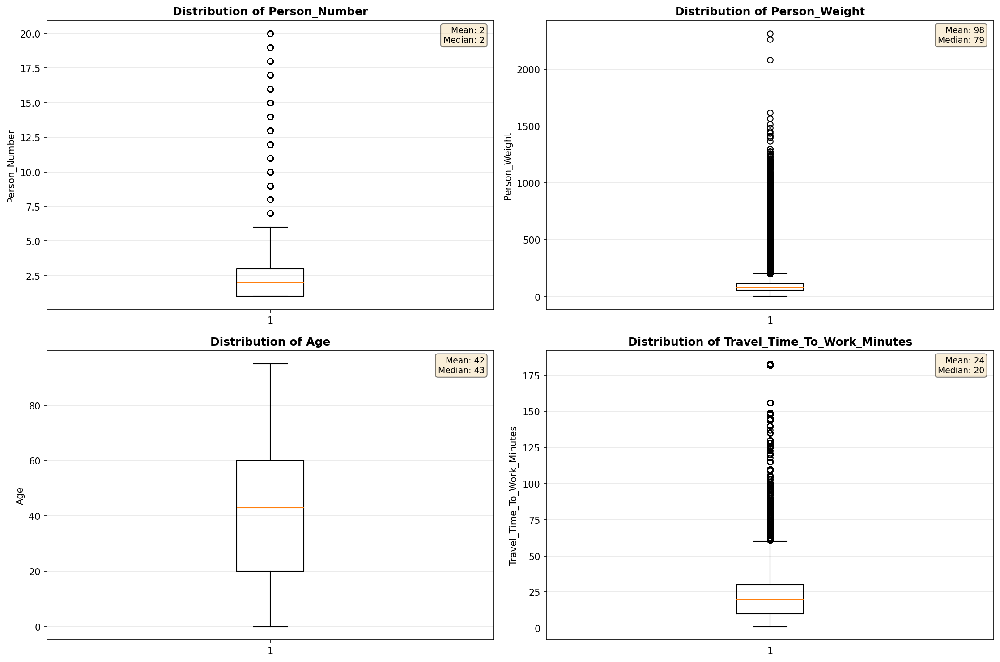

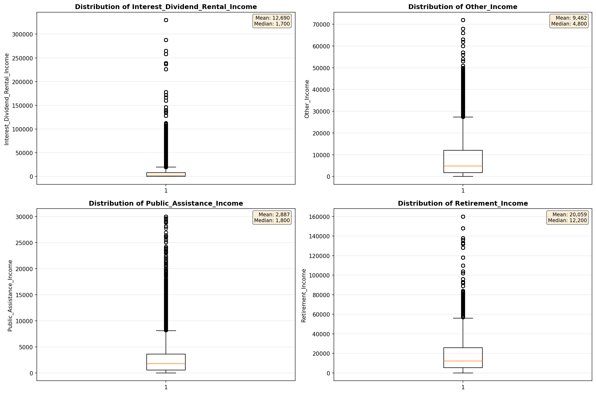

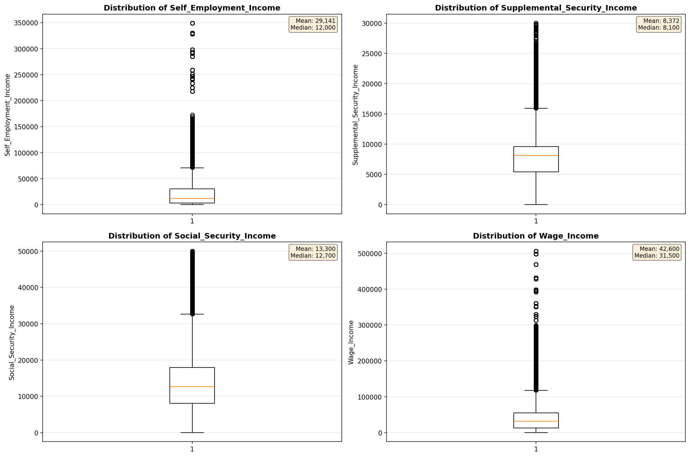

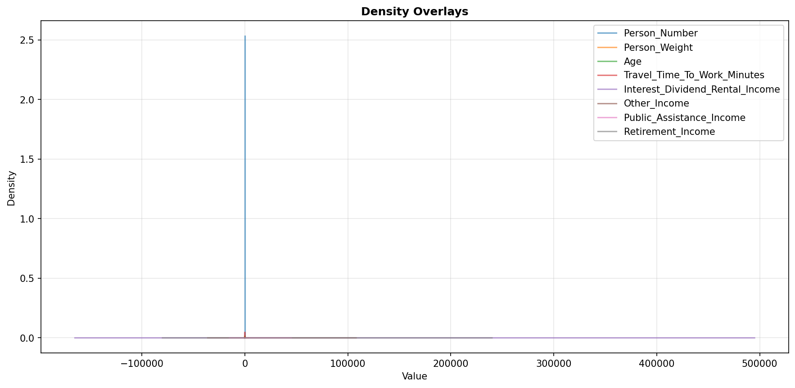

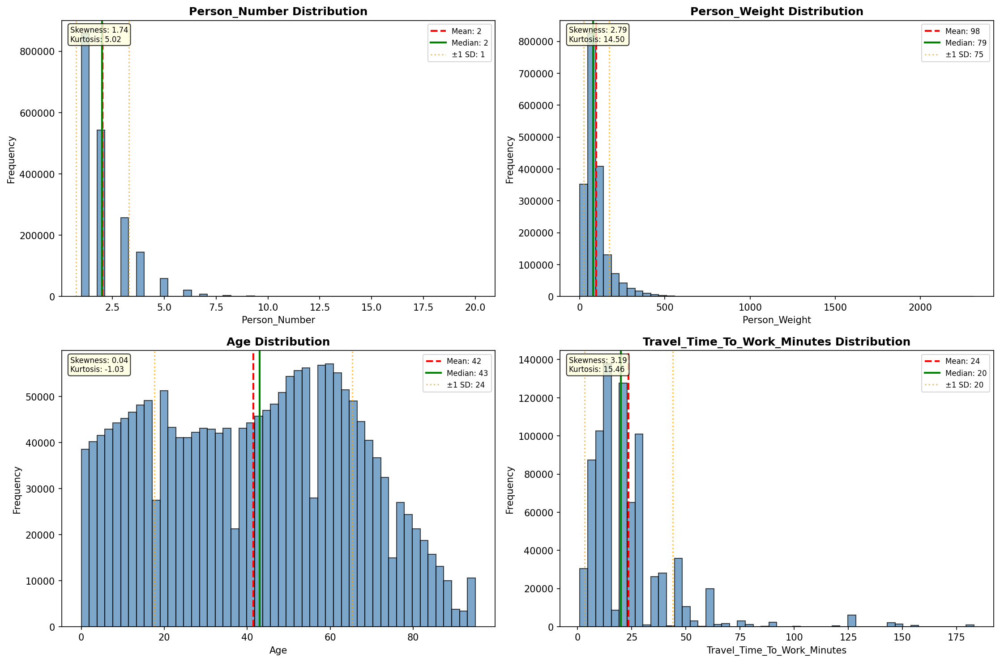

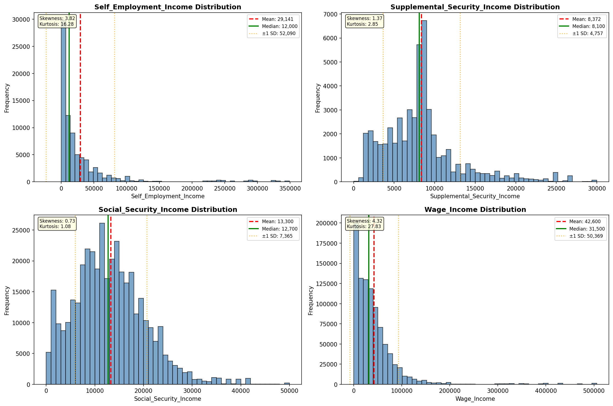

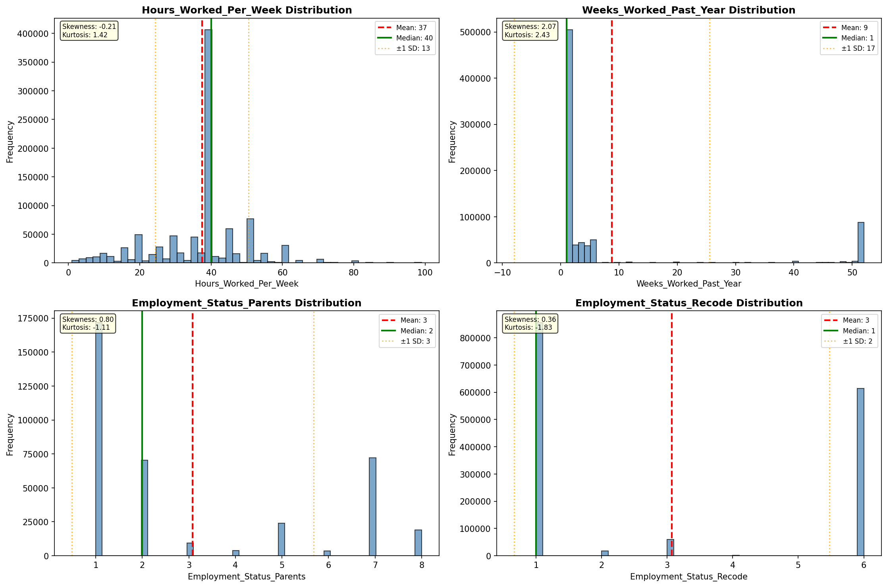

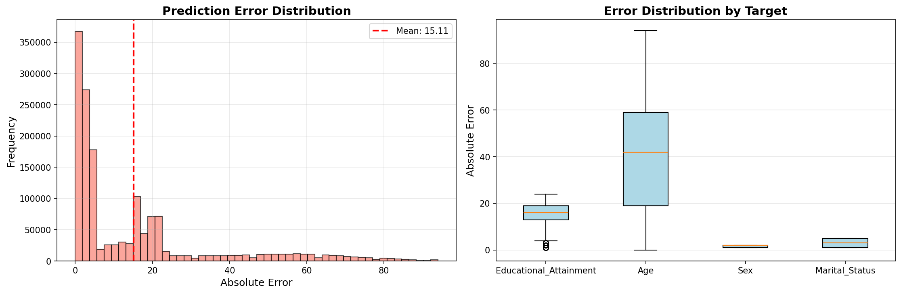

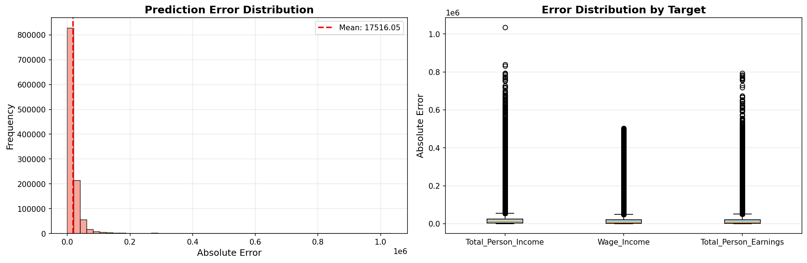

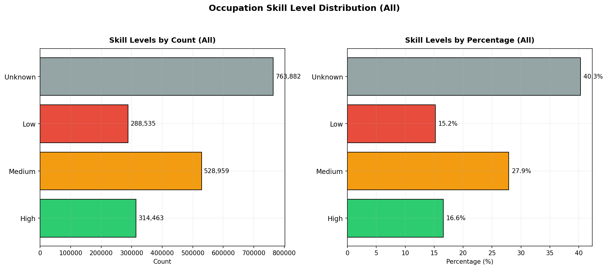

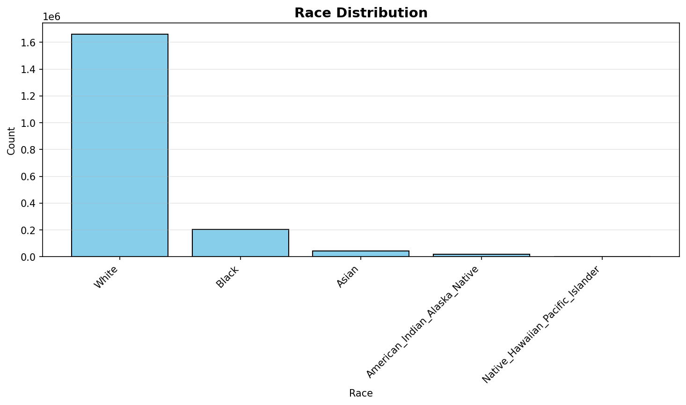

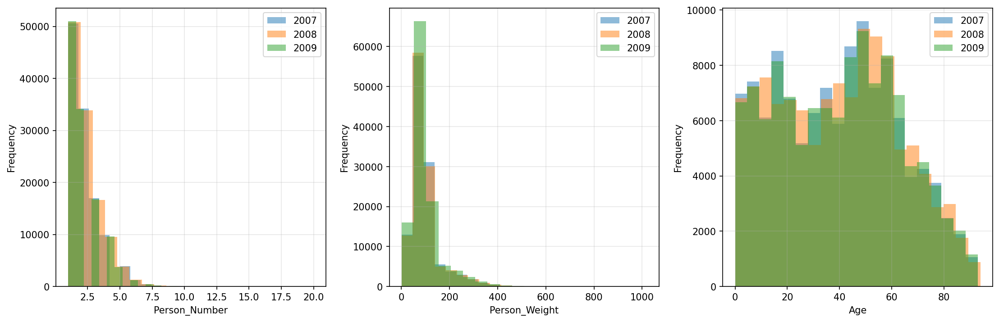

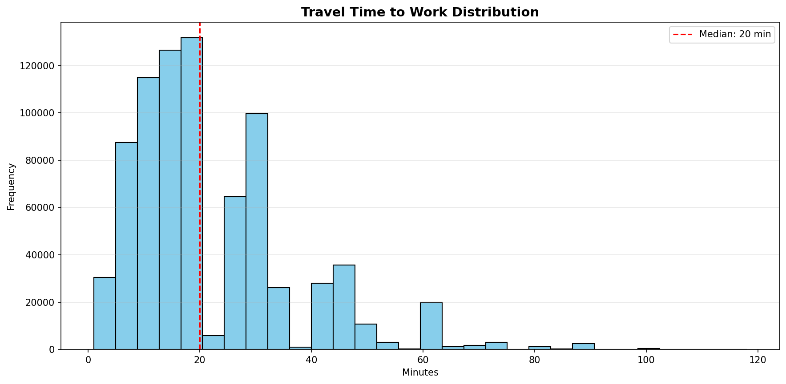

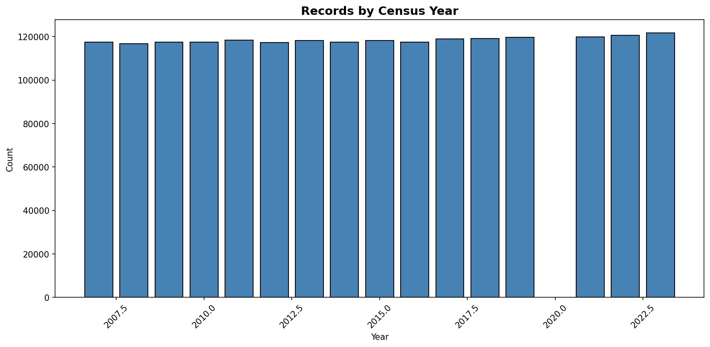
