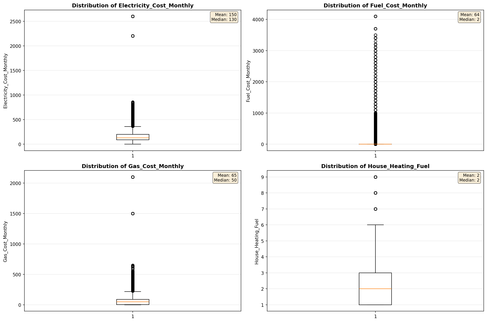
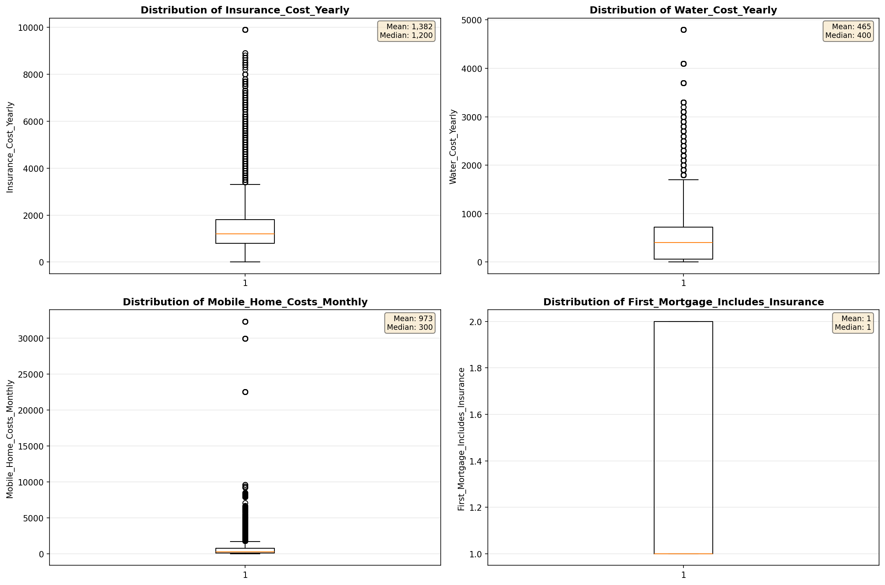

# Outlier Detection

> Statistical outlier detection using IQR (Interquartile Range) method. Outliers are values falling outside Q1 - 1.5×IQR or Q3 + 1.5×IQR bounds.

## Detection Methodology

| Parameter | Value | Description |
| :--- | :--- | :--- |
| Method | IQR | Outlier detection algorithm |
| Lower Bound | Q1 - 1.5 × IQR | Values below are outliers |
| Upper Bound | Q3 + 1.5 × IQR | Values above are outliers |
| IQR Definition | Q3 - Q1 | Interquartile Range |

> **Note**: The IQR method is robust to extreme values and works well for approximately symmetric distributions.

## Outlier Summary

_No outlier summary available._
## High Outlier Rate Variables

> Variables with outlier rate > 5% may indicate data quality issues, non-normal distributions, or genuinely extreme values.

- **('Flag_Selected_Monthly_Owner_Costs', 21.029853988726146)**: 0 outliers (0.00%)

- **('Property_Tax_Rate', 20.97202269351579)**: 0 outliers (0.00%)

- **('Flag_Family_Income', 20.224502205449436)**: 0 outliers (0.00%)

- **('Mobile_Home_Costs_Monthly', 13.667568129810693)**: 0 outliers (0.00%)

- **('Flag_Property_Taxes', 11.71259109422838)**: 0 outliers (0.00%)

- **('Fuel_Cost_Monthly', 11.574171829847305)**: 0 outliers (0.00%)

- **('Property_Taxes_Yearly', 9.784436266734344)**: 0 outliers (0.00%)

- **('Flag_Property_Value', 9.561034936241452)**: 0 outliers (0.00%)

- **('Income_Adjustment_Factor', 9.514289841700336)**: 0 outliers (0.00%)

- **('Working_Age_Persons', 9.38374458074844)**: 0 outliers (0.00%)

- **('Structure_Age', 9.276749412863962)**: 0 outliers (0.00%)

- **('Gross_Rent_Percentage_Income', 9.108459108459108)**: 0 outliers (0.00%)

- **('Flag_Water_Cost', 7.803242034656233)**: 0 outliers (0.00%)

- **('Structure_Age_Score', 7.529651422173961)**: 0 outliers (0.00%)

- **('Owner_Costs_Percentage_Income', 7.107053882413387)**: 0 outliers (0.00%)

> *Consider investigating these variables for data entry errors, applying transformations, or using robust statistical methods.*

## Visualizations

