# Deep Learning Models

> Neural network analysis using TensorFlow/Keras for complex pattern recognition and multi-output prediction tasks.

## Deep Learning Summary

- **Total Tasks**: 5

- **Tasks**: Property Valuation, Affordability Analysis, Housing Quality, Cost Prediction, Occupancy Prediction

### Aggregate Statistics

| Metric | Value |
| :--- | :--- |
| Total Parameters | 78,283 |
| Average Validation Loss | 5369167559.7307 |
| Number of Tasks | 5 |

## Task: Property Valuation

### Model Configuration

| Property | Value |
| :--- | :--- |
| Model Type | HousingValuationModel |
| Task Type | Multi_Output |
| Target Variables | Property_Value, Gross_Rent |
| Number of Targets | 2 |
| Input Features | 10 |

### Network Architecture

| Component | Value | Notes |
| :--- | :--- | :--- |
| Total Layers | 7 | Including input and output |
| Total Parameters | 36,994 | Trainable weights |
| Parameters per Layer | 5,284 | Average |

### Performance Metrics

| Metric | Value | Assessment |
| :--- | :--- | :--- |
| Training Loss | 25103452160.0000 | Final epoch |
| Validation Loss | 26845380608.0000 | Final epoch |
| Loss Gap | 1741928448.0000 | HIGH overfitting risk |

> *Model may be overfitting significantly*

#### Test Set Metrics

| Metric | Value | Description |
| :--- | :--- | :--- |
| MAE | 48258.2891 | Mean Absolute Error (lower is better) |
| MSE | 25351936000.0000 | Mean Squared Error (lower is better) |
| RMSE | 159222.9129 | Root Mean Squared Error (lower is better) |
| R2 | -0.1191 | R-squared (higher is better) |

### Training Analysis

| Training Statistic | Value |
| :--- | :--- |
| Epochs Trained | 75 |
| Initial Training Loss | 73621241856.0000 |
| Final Training Loss | 25103452160.0000 |
| Loss Improvement | 65.9% |
| Initial Validation Loss | 58361806848.0000 |
| Final Validation Loss | 26845380608.0000 |
| Validation Improvement | 54.0% |

#### Convergence Assessment

- **Status**: Fully converged (< 1% change in last 10 epochs)

- **Last 10 epochs change**: 0.09%

## Task: Affordability Analysis

### Model Configuration

| Property | Value |
| :--- | :--- |
| Model Type | HousingAffordabilityModel |
| Task Type | Multi_Output |
| Target Variables | Owner_Costs_Percentage_Income, Gross_Rent_Percentage_Income |
| Number of Targets | 2 |
| Input Features | 10 |

### Network Architecture

| Component | Value | Notes |
| :--- | :--- | :--- |
| Total Layers | 6 | Including input and output |
| Total Parameters | 10,306 | Trainable weights |
| Parameters per Layer | 1,717 | Average |

### Performance Metrics

| Metric | Value | Assessment |
| :--- | :--- | :--- |
| Training Loss | 229.1559 | Final epoch |
| Validation Loss | 225.2091 | Final epoch |
| Loss Gap | -3.9468 | NONE overfitting risk |

> *Good generalization*

#### Test Set Metrics

| Metric | Value | Description |
| :--- | :--- | :--- |
| MAE | 7.6017 | Mean Absolute Error (lower is better) |
| MSE | 227.9213 | Mean Squared Error (lower is better) |
| RMSE | 15.0971 | Root Mean Squared Error (lower is better) |
| R2 | 0.0576 | R-squared (higher is better) |

### Training Analysis

| Training Statistic | Value |
| :--- | :--- |
| Epochs Trained | 75 |
| Initial Training Loss | 306.1670 |
| Final Training Loss | 229.1559 |
| Loss Improvement | 25.2% |
| Initial Validation Loss | 232.8119 |
| Final Validation Loss | 225.2091 |
| Validation Improvement | 3.3% |

#### Convergence Assessment

- **Status**: Fully converged (< 1% change in last 10 epochs)

- **Last 10 epochs change**: 0.03%

## Task: Housing Quality

### Model Configuration

| Property | Value |
| :--- | :--- |
| Model Type | HousingQualityModel |
| Task Type | Multi_Output |
| Target Variables | Year_Structure_Built, Number_of_Bedrooms, Number_of_Rooms |
| Number of Targets | 3 |
| Input Features | 10 |

### Network Architecture

| Component | Value | Notes |
| :--- | :--- | :--- |
| Total Layers | 6 | Including input and output |
| Total Parameters | 10,371 | Trainable weights |
| Parameters per Layer | 1,728 | Average |

### Performance Metrics

| Metric | Value | Assessment |
| :--- | :--- | :--- |
| Training Loss | 239.6061 | Final epoch |
| Validation Loss | 16.3531 | Final epoch |
| Loss Gap | -223.2529 | NONE overfitting risk |

> *Good generalization*

#### Test Set Metrics

| Metric | Value | Description |
| :--- | :--- | :--- |
| MAE | 1.0757 | Mean Absolute Error (lower is better) |
| MSE | 17.3149 | Mean Squared Error (lower is better) |
| RMSE | 4.1611 | Root Mean Squared Error (lower is better) |
| R2 | 0.8842 | R-squared (higher is better) |

### Training Analysis

| Training Statistic | Value |
| :--- | :--- |
| Epochs Trained | 75 |
| Initial Training Loss | 14819.0020 |
| Final Training Loss | 239.6061 |
| Loss Improvement | 98.4% |
| Initial Validation Loss | 172.6721 |
| Final Validation Loss | 16.3531 |
| Validation Improvement | 90.5% |

#### Convergence Assessment

- **Status**: Still improving (> 5% change)

- **Last 10 epochs change**: 6.94%

## Task: Cost Prediction

### Model Configuration

| Property | Value |
| :--- | :--- |
| Model Type | HousingDefaultModel |
| Task Type | Multi_Output |
| Target Variables | Property_Taxes_Yearly, Insurance_Cost_Yearly |
| Number of Targets | 2 |
| Input Features | 10 |

### Network Architecture

| Component | Value | Notes |
| :--- | :--- | :--- |
| Total Layers | 6 | Including input and output |
| Total Parameters | 10,306 | Trainable weights |
| Parameters per Layer | 1,717 | Average |

### Performance Metrics

| Metric | Value | Assessment |
| :--- | :--- | :--- |
| Training Loss | 482939.4688 | Final epoch |
| Validation Loss | 456948.7812 | Final epoch |
| Loss Gap | -25990.6875 | NONE overfitting risk |

> *Good generalization*

#### Test Set Metrics

| Metric | Value | Description |
| :--- | :--- | :--- |
| MAE | 204.1451 | Mean Absolute Error (lower is better) |
| MSE | 480585.0625 | Mean Squared Error (lower is better) |
| RMSE | 693.2424 | Root Mean Squared Error (lower is better) |
| R2 | 0.3020 | R-squared (higher is better) |

### Training Analysis

| Training Statistic | Value |
| :--- | :--- |
| Epochs Trained | 75 |
| Initial Training Loss | 684016.3750 |
| Final Training Loss | 482939.4688 |
| Loss Improvement | 29.4% |
| Initial Validation Loss | 519719.3125 |
| Final Validation Loss | 456948.7812 |
| Validation Improvement | 12.1% |

#### Convergence Assessment

- **Status**: Fully converged (< 1% change in last 10 epochs)

- **Last 10 epochs change**: 0.48%

## Task: Occupancy Prediction

### Model Configuration

| Property | Value |
| :--- | :--- |
| Model Type | HousingDefaultModel |
| Task Type | Multi_Output |
| Target Variables | Vacancy_Status, Tenure |
| Number of Targets | 2 |
| Input Features | 10 |

### Network Architecture

| Component | Value | Notes |
| :--- | :--- | :--- |
| Total Layers | 6 | Including input and output |
| Total Parameters | 10,306 | Trainable weights |
| Parameters per Layer | 1,717 | Average |

### Performance Metrics

| Metric | Value | Assessment |
| :--- | :--- | :--- |
| Training Loss | 0.3086 | Final epoch |
| Validation Loss | 0.3102 | Final epoch |
| Loss Gap | 0.0016 | NONE overfitting risk |

> *Good generalization*

#### Test Set Metrics

| Metric | Value | Description |
| :--- | :--- | :--- |
| MAE | 0.2949 | Mean Absolute Error (lower is better) |
| MSE | 0.3131 | Mean Squared Error (lower is better) |
| RMSE | 0.5596 | Root Mean Squared Error (lower is better) |
| R2 | 0.2341 | R-squared (higher is better) |

### Training Analysis

| Training Statistic | Value |
| :--- | :--- |
| Epochs Trained | 75 |
| Initial Training Loss | 0.9653 |
| Final Training Loss | 0.3086 |
| Loss Improvement | 68.0% |
| Initial Validation Loss | 0.3586 |
| Final Validation Loss | 0.3102 |
| Validation Improvement | 13.5% |

#### Convergence Assessment

- **Status**: Fully converged (< 1% change in last 10 epochs)

- **Last 10 epochs change**: 0.27%

## Cross-Task Comparison

| Task | Model Type | Parameters | Train Loss | Val Loss | Gap |
| :--- | :--- | :--- | :--- | :--- | :--- |
| Property Valuation | HousingValuationModel | 36,994 | 25103452160.0000 | 26845380608.0000 | 1741928448.0000 |
| Affordability Analysis | HousingAffordabilityModel | 10,306 | 229.1559 | 225.2091 | -3.9468 |
| Housing Quality | HousingQualityModel | 10,371 | 239.6061 | 16.3531 | -223.2529 |
| Cost Prediction | HousingDefaultModel | 10,306 | 482939.4688 | 456948.7812 | -25990.6875 |
| Occupancy Prediction | HousingDefaultModel | 10,306 | 0.3086 | 0.3102 | 0.0016 |

## Visualizations

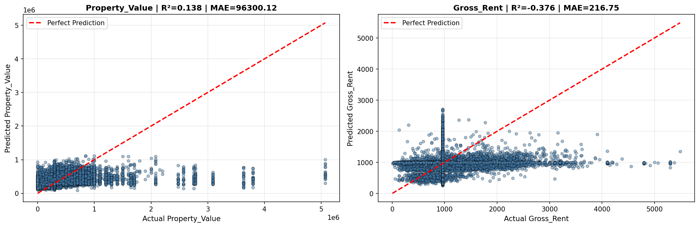

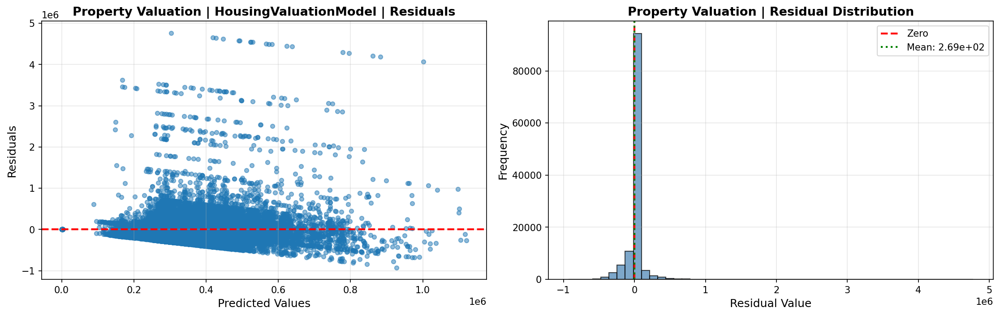

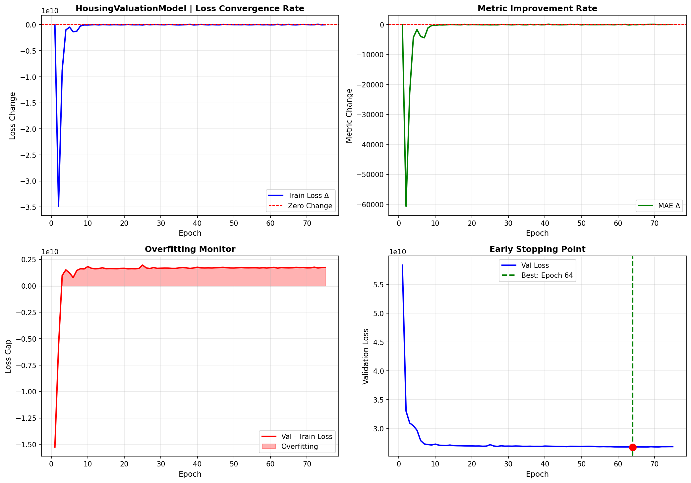

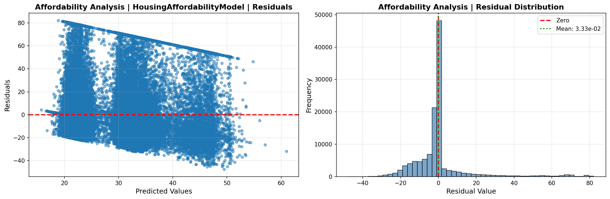

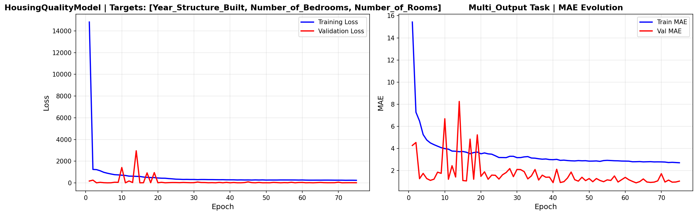

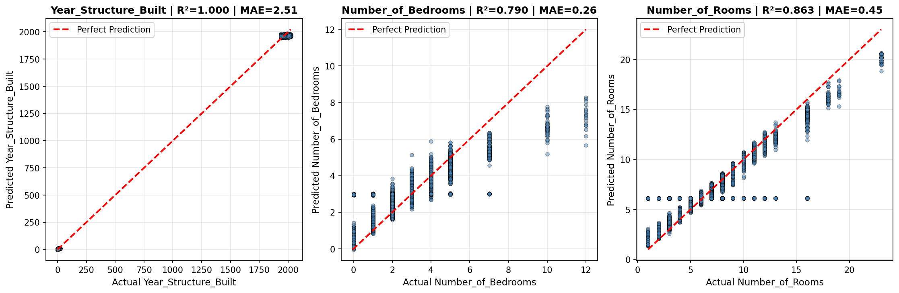

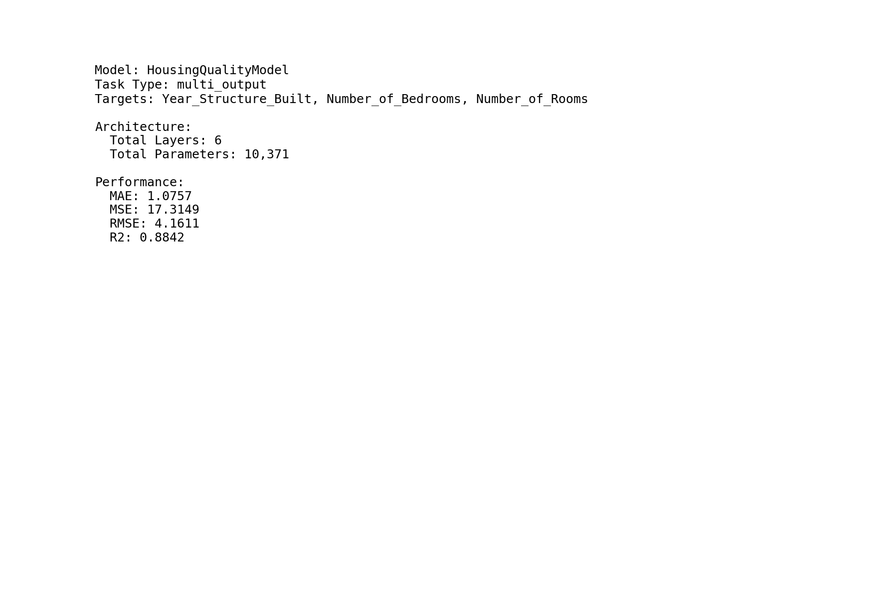

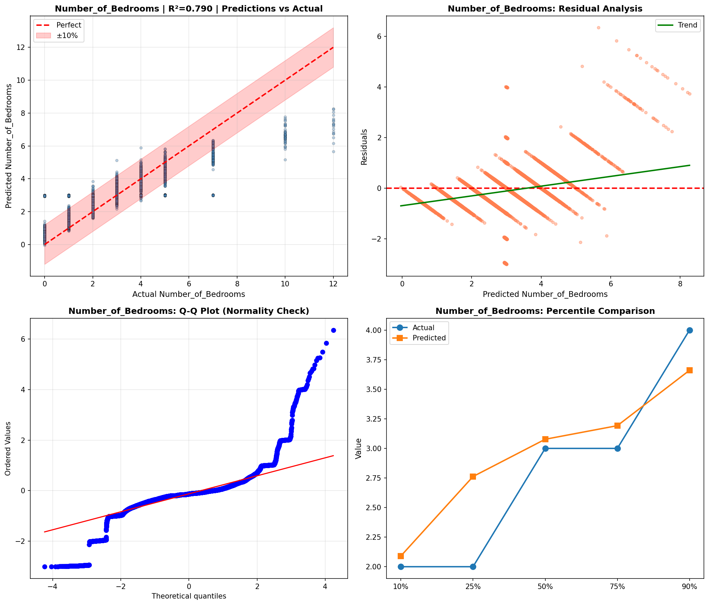

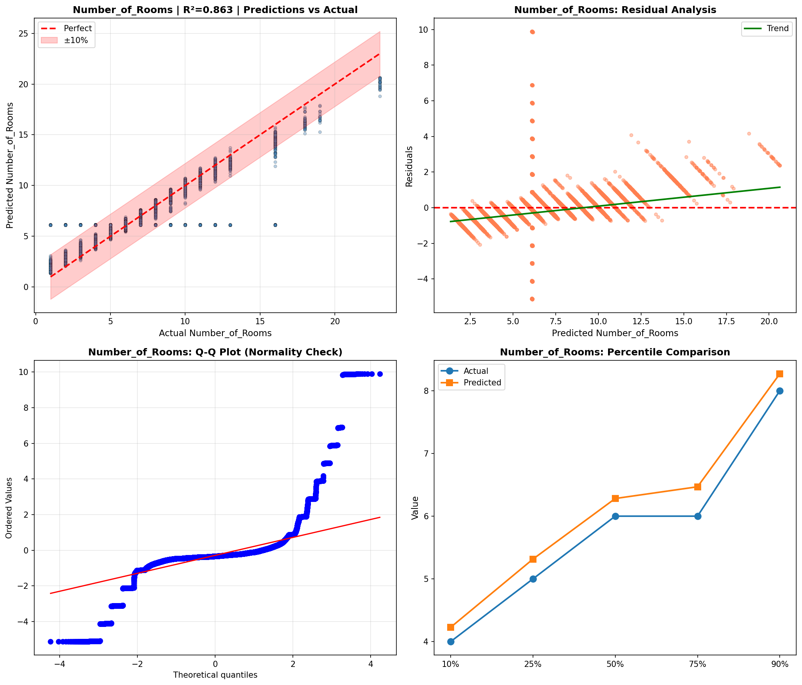

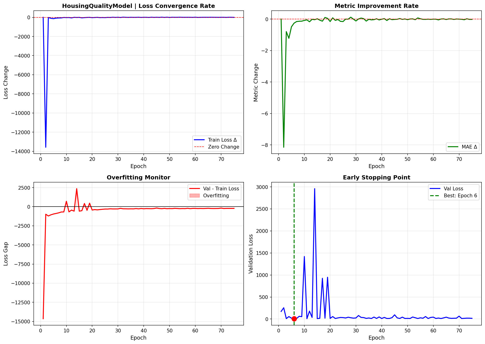

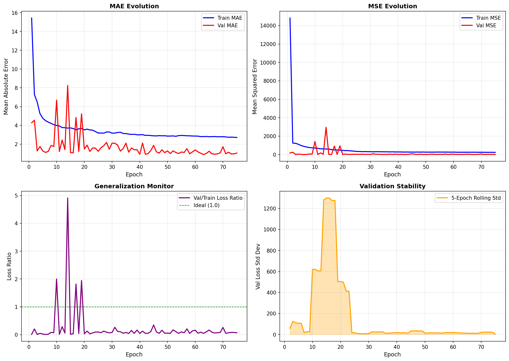

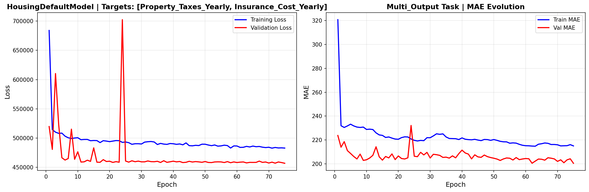

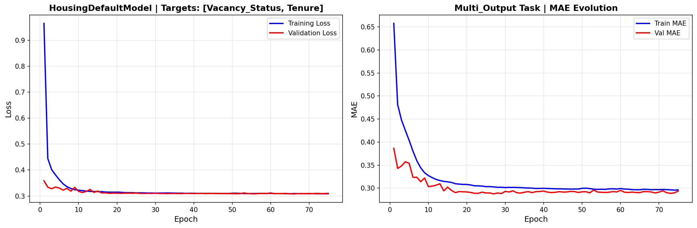

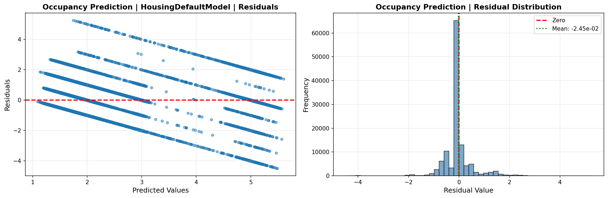

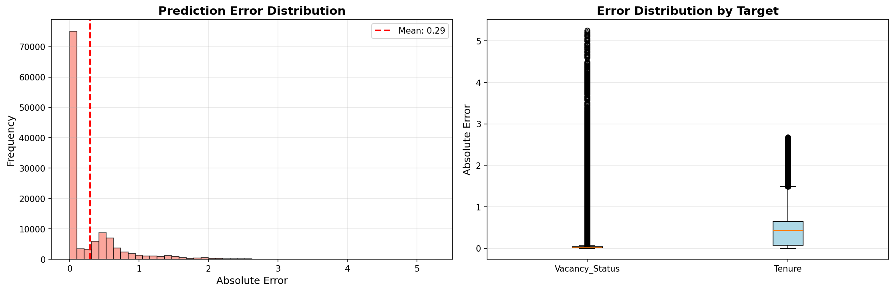

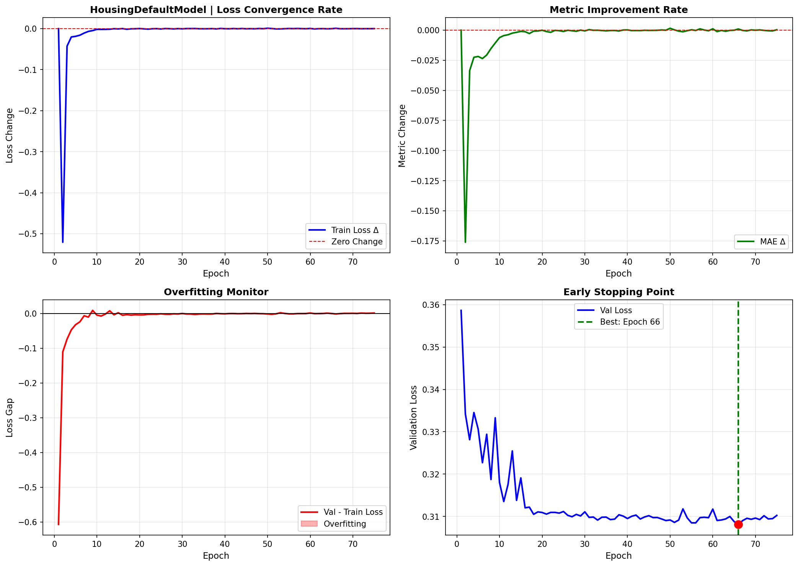

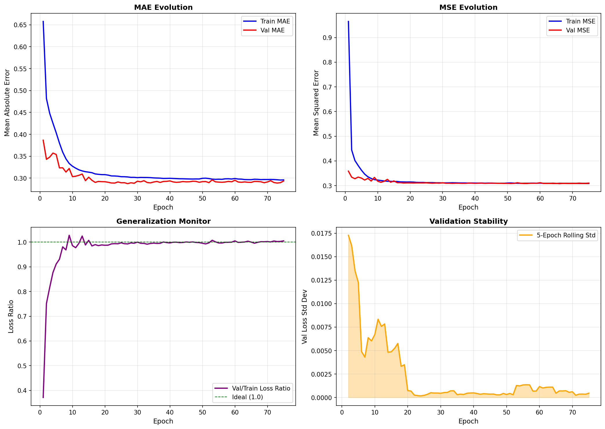

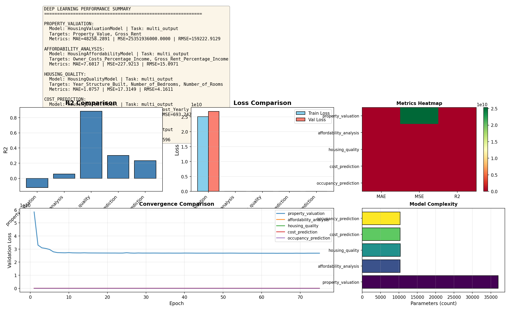

