# Deep Learning Models

> Neural network analysis using TensorFlow/Keras for complex pattern recognition and multi-output prediction tasks.

## Deep Learning Summary

- **Total Tasks**: 5

- **Tasks**: Property Valuation, Affordability Analysis, Housing Quality, Cost Prediction, Occupancy Prediction

### Aggregate Statistics

| Metric | Value |
| :--- | :--- |
| Total Parameters | 78,283 |
| Average Validation Loss | 2450068860.0359 |
| Number of Tasks | 5 |

## Task: Property Valuation

### Model Configuration

| Property | Value |
| :--- | :--- |
| Model Type | HousingValuationModel |
| Task Type | Multi_Output |
| Target Variables | Property_Value, Gross_Rent |
| Number of Targets | 2 |
| Input Features | 10 |

### Network Architecture

| Component | Value | Notes |
| :--- | :--- | :--- |
| Total Layers | 7 | Including input and output |
| Total Parameters | 36,994 | Trainable weights |
| Parameters per Layer | 5,284 | Average |

### Performance Metrics

| Metric | Value | Assessment |
| :--- | :--- | :--- |
| Training Loss | 11993791488.0000 | Final epoch |
| Validation Loss | 12249964544.0000 | Final epoch |
| Loss Gap | 256173056.0000 | HIGH overfitting risk |

> *Model may be overfitting significantly*

#### Test Set Metrics

| Metric | Value | Description |
| :--- | :--- | :--- |
| MAE | 30850.0254 | Mean Absolute Error (lower is better) |
| MSE | 11484966912.0000 | Mean Squared Error (lower is better) |
| RMSE | 107167.9379 | Root Mean Squared Error (lower is better) |
| R2 | -0.0313 | R-squared (higher is better) |

### Training Analysis

| Training Statistic | Value |
| :--- | :--- |
| Epochs Trained | 75 |
| Initial Training Loss | 18061414400.0000 |
| Final Training Loss | 11993791488.0000 |
| Loss Improvement | 33.6% |
| Initial Validation Loss | 13754699776.0000 |
| Final Validation Loss | 12249964544.0000 |
| Validation Improvement | 10.9% |

#### Convergence Assessment

- **Status**: Fully converged (< 1% change in last 10 epochs)

- **Last 10 epochs change**: 0.16%

## Task: Affordability Analysis

### Model Configuration

| Property | Value |
| :--- | :--- |
| Model Type | HousingAffordabilityModel |
| Task Type | Multi_Output |
| Target Variables | Owner_Costs_Percentage_Income, Gross_Rent_Percentage_Income |
| Number of Targets | 2 |
| Input Features | 10 |

### Network Architecture

| Component | Value | Notes |
| :--- | :--- | :--- |
| Total Layers | 6 | Including input and output |
| Total Parameters | 10,306 | Trainable weights |
| Parameters per Layer | 1,717 | Average |

### Performance Metrics

| Metric | Value | Assessment |
| :--- | :--- | :--- |
| Training Loss | 184.7300 | Final epoch |
| Validation Loss | 186.2923 | Final epoch |
| Loss Gap | 1.5624 | HIGH overfitting risk |

> *Model may be overfitting significantly*

#### Test Set Metrics

| Metric | Value | Description |
| :--- | :--- | :--- |
| MAE | 6.4034 | Mean Absolute Error (lower is better) |
| MSE | 184.5584 | Mean Squared Error (lower is better) |
| RMSE | 13.5852 | Root Mean Squared Error (lower is better) |
| R2 | 0.0634 | R-squared (higher is better) |

### Training Analysis

| Training Statistic | Value |
| :--- | :--- |
| Epochs Trained | 75 |
| Initial Training Loss | 212.1870 |
| Final Training Loss | 184.7300 |
| Loss Improvement | 12.9% |
| Initial Validation Loss | 191.2418 |
| Final Validation Loss | 186.2923 |
| Validation Improvement | 2.6% |

#### Convergence Assessment

- **Status**: Fully converged (< 1% change in last 10 epochs)

- **Last 10 epochs change**: 0.02%

## Task: Housing Quality

### Model Configuration

| Property | Value |
| :--- | :--- |
| Model Type | HousingQualityModel |
| Task Type | Multi_Output |
| Target Variables | Year_Structure_Built, Number_of_Bedrooms, Number_of_Rooms |
| Number of Targets | 3 |
| Input Features | 10 |

### Network Architecture

| Component | Value | Notes |
| :--- | :--- | :--- |
| Total Layers | 6 | Including input and output |
| Total Parameters | 10,371 | Trainable weights |
| Parameters per Layer | 1,728 | Average |

### Performance Metrics

| Metric | Value | Assessment |
| :--- | :--- | :--- |
| Training Loss | 97.1858 | Final epoch |
| Validation Loss | 12.1434 | Final epoch |
| Loss Gap | -85.0424 | NONE overfitting risk |

> *Good generalization*

#### Test Set Metrics

| Metric | Value | Description |
| :--- | :--- | :--- |
| MAE | 0.9686 | Mean Absolute Error (lower is better) |
| MSE | 12.0405 | Mean Squared Error (lower is better) |
| RMSE | 3.4699 | Root Mean Squared Error (lower is better) |
| R2 | 0.8191 | R-squared (higher is better) |

### Training Analysis

| Training Statistic | Value |
| :--- | :--- |
| Epochs Trained | 75 |
| Initial Training Loss | 4450.5928 |
| Final Training Loss | 97.1858 |
| Loss Improvement | 97.8% |
| Initial Validation Loss | 27.2806 |
| Final Validation Loss | 12.1434 |
| Validation Improvement | 55.5% |

#### Convergence Assessment

- **Status**: Still improving (> 5% change)

- **Last 10 epochs change**: 20.23%

## Task: Cost Prediction

### Model Configuration

| Property | Value |
| :--- | :--- |
| Model Type | HousingDefaultModel |
| Task Type | Multi_Output |
| Target Variables | Property_Taxes_Yearly, Insurance_Cost_Yearly |
| Number of Targets | 2 |
| Input Features | 10 |

### Network Architecture

| Component | Value | Notes |
| :--- | :--- | :--- |
| Total Layers | 6 | Including input and output |
| Total Parameters | 10,306 | Trainable weights |
| Parameters per Layer | 1,717 | Average |

### Performance Metrics

| Metric | Value | Assessment |
| :--- | :--- | :--- |
| Training Loss | 376953.9062 | Final epoch |
| Validation Loss | 379557.4375 | Final epoch |
| Loss Gap | 2603.5312 | HIGH overfitting risk |

> *Model may be overfitting significantly*

#### Test Set Metrics

| Metric | Value | Description |
| :--- | :--- | :--- |
| MAE | 191.4059 | Mean Absolute Error (lower is better) |
| MSE | 375763.2500 | Mean Squared Error (lower is better) |
| RMSE | 612.9953 | Root Mean Squared Error (lower is better) |
| R2 | 0.3083 | R-squared (higher is better) |

### Training Analysis

| Training Statistic | Value |
| :--- | :--- |
| Epochs Trained | 75 |
| Initial Training Loss | 450344.8125 |
| Final Training Loss | 376953.9062 |
| Loss Improvement | 16.3% |
| Initial Validation Loss | 423303.6562 |
| Final Validation Loss | 379557.4375 |
| Validation Improvement | 10.3% |

#### Convergence Assessment

- **Status**: Fully converged (< 1% change in last 10 epochs)

- **Last 10 epochs change**: 0.78%

## Task: Occupancy Prediction

### Model Configuration

| Property | Value |
| :--- | :--- |
| Model Type | HousingDefaultModel |
| Task Type | Multi_Output |
| Target Variables | Vacancy_Status, Tenure |
| Number of Targets | 2 |
| Input Features | 10 |

### Network Architecture

| Component | Value | Notes |
| :--- | :--- | :--- |
| Total Layers | 6 | Including input and output |
| Total Parameters | 10,306 | Trainable weights |
| Parameters per Layer | 1,717 | Average |

### Performance Metrics

| Metric | Value | Assessment |
| :--- | :--- | :--- |
| Training Loss | 0.3027 | Final epoch |
| Validation Loss | 0.3061 | Final epoch |
| Loss Gap | 0.0034 | NONE overfitting risk |

> *Good generalization*

#### Test Set Metrics

| Metric | Value | Description |
| :--- | :--- | :--- |
| MAE | 0.2740 | Mean Absolute Error (lower is better) |
| MSE | 0.3040 | Mean Squared Error (lower is better) |
| RMSE | 0.5513 | Root Mean Squared Error (lower is better) |
| R2 | 0.2218 | R-squared (higher is better) |

### Training Analysis

| Training Statistic | Value |
| :--- | :--- |
| Epochs Trained | 75 |
| Initial Training Loss | 0.5681 |
| Final Training Loss | 0.3027 |
| Loss Improvement | 46.7% |
| Initial Validation Loss | 0.3752 |
| Final Validation Loss | 0.3061 |
| Validation Improvement | 18.4% |

#### Convergence Assessment

- **Status**: Fully converged (< 1% change in last 10 epochs)

- **Last 10 epochs change**: 0.19%

## Cross-Task Comparison

| Task | Model Type | Parameters | Train Loss | Val Loss | Gap |
| :--- | :--- | :--- | :--- | :--- | :--- |
| Property Valuation | HousingValuationModel | 36,994 | 11993791488.0000 | 12249964544.0000 | 256173056.0000 |
| Affordability Analysis | HousingAffordabilityModel | 10,306 | 184.7300 | 186.2923 | 1.5624 |
| Housing Quality | HousingQualityModel | 10,371 | 97.1858 | 12.1434 | -85.0424 |
| Cost Prediction | HousingDefaultModel | 10,306 | 376953.9062 | 379557.4375 | 2603.5312 |
| Occupancy Prediction | HousingDefaultModel | 10,306 | 0.3027 | 0.3061 | 0.0034 |

## Visualizations

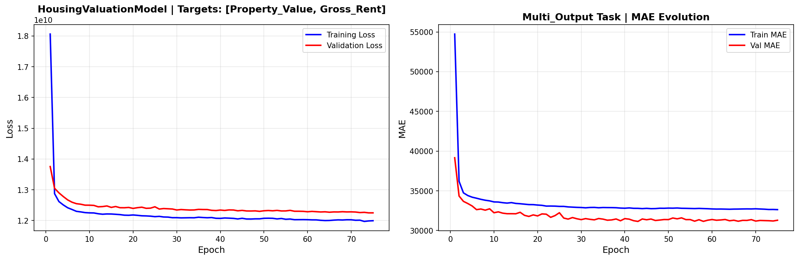

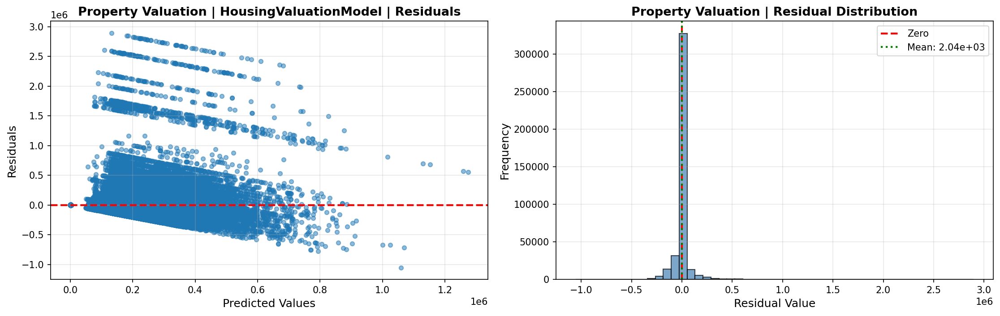

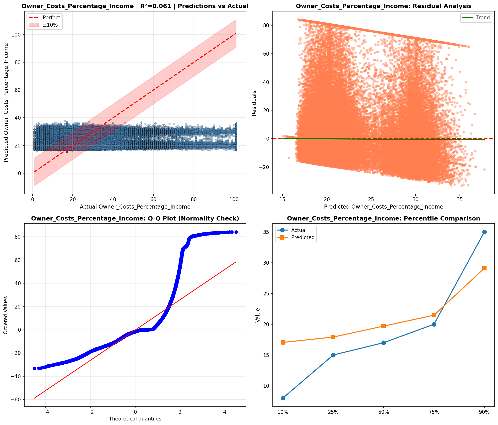

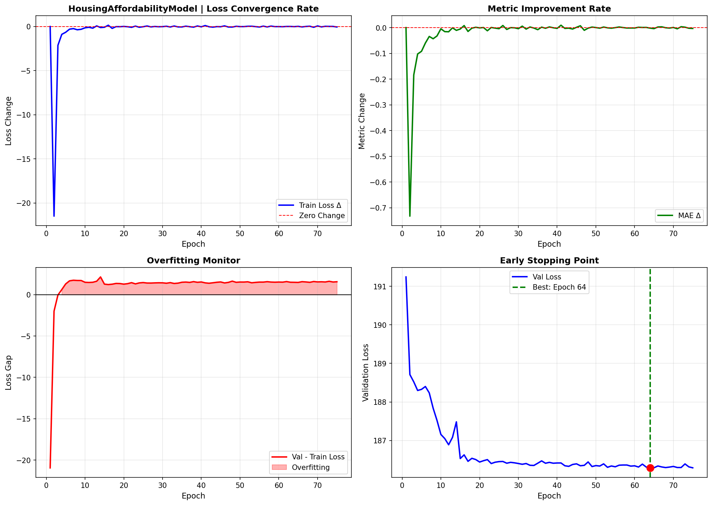

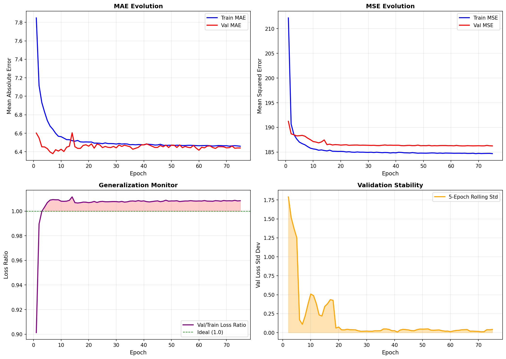

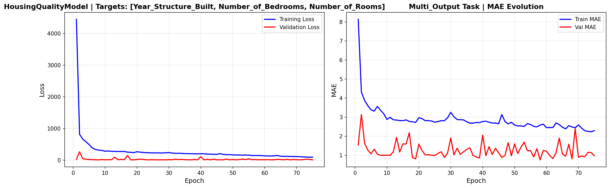

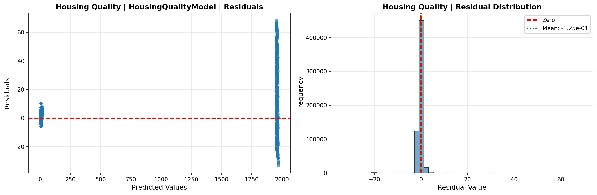

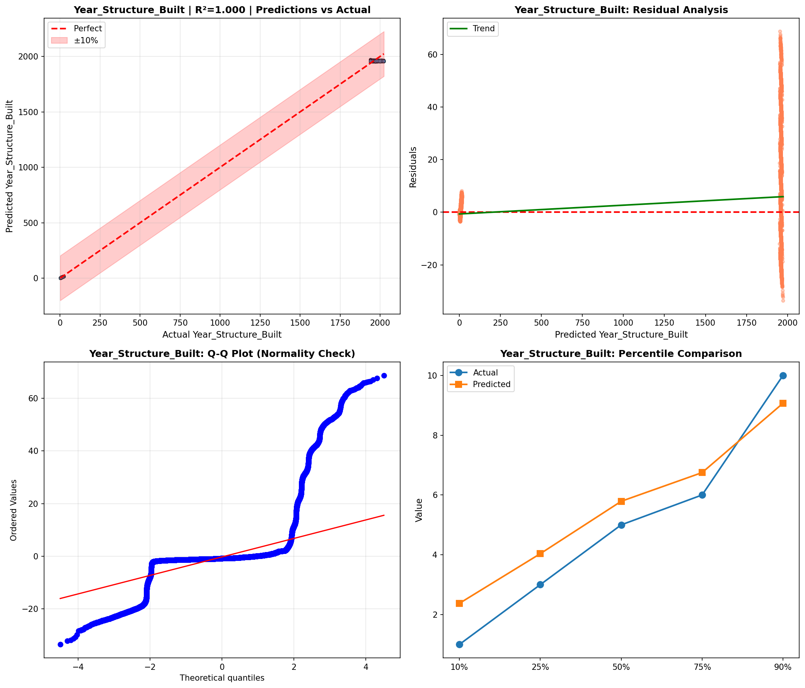

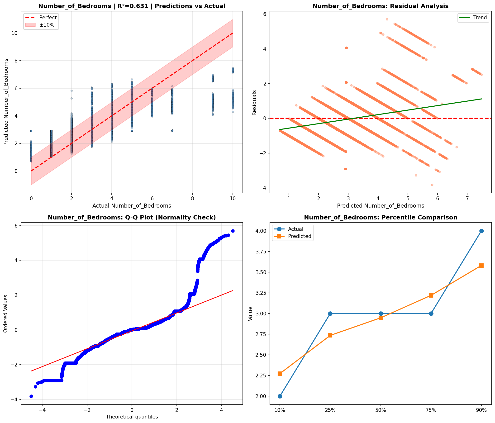

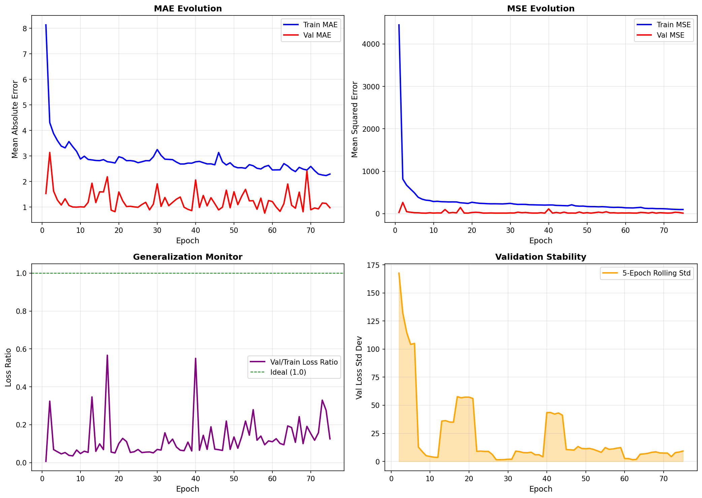

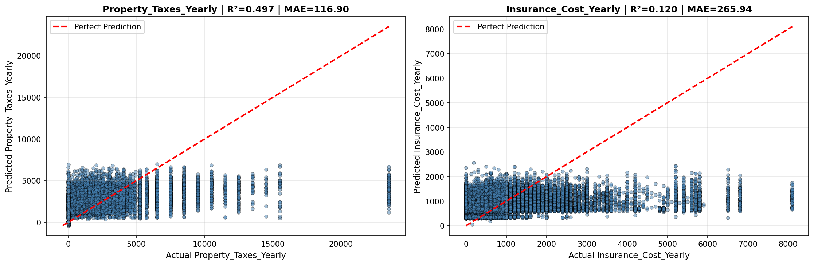

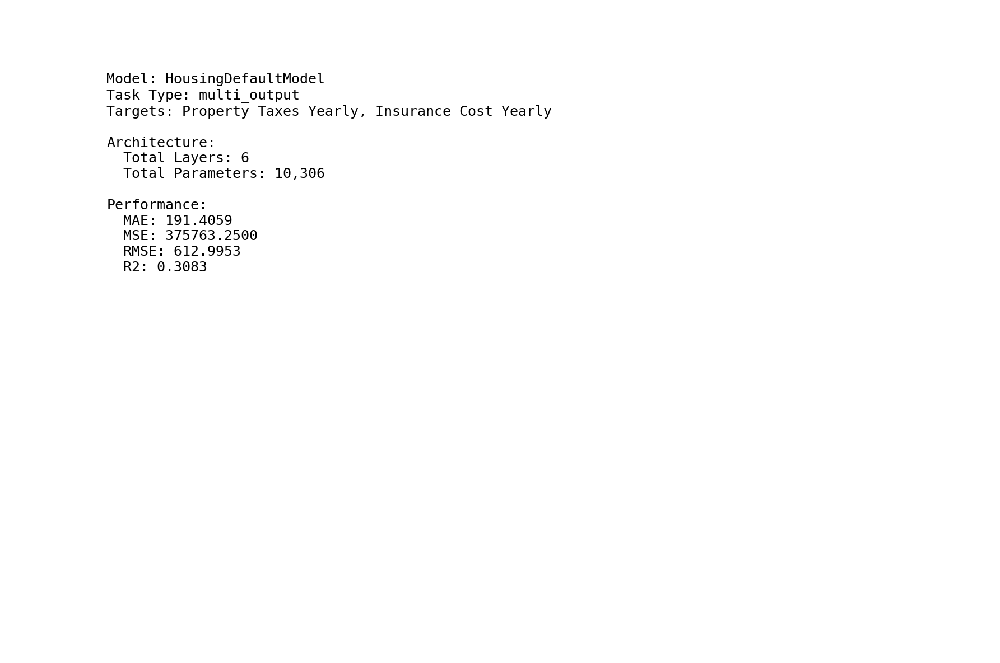

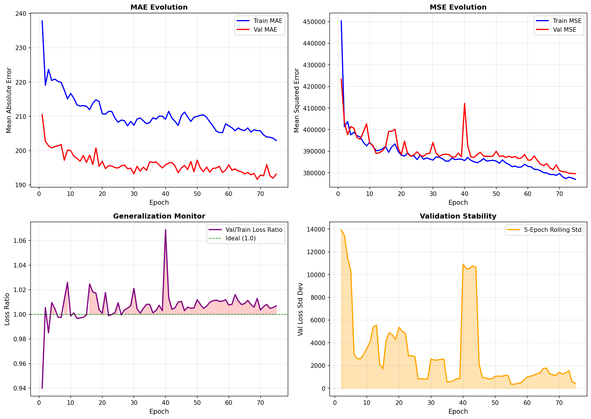

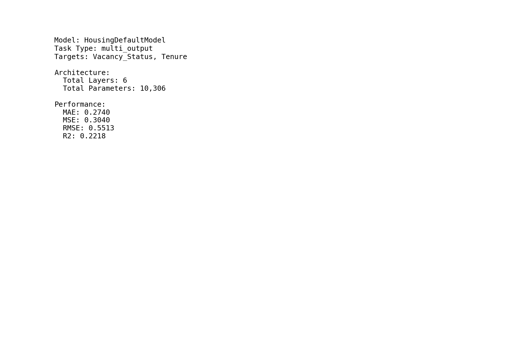

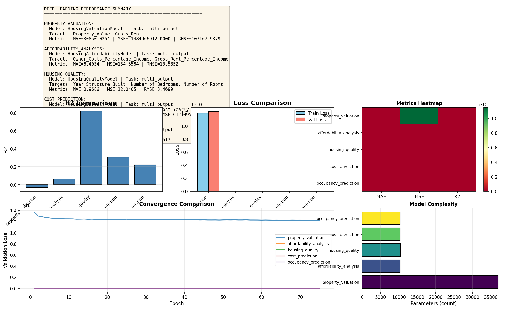

