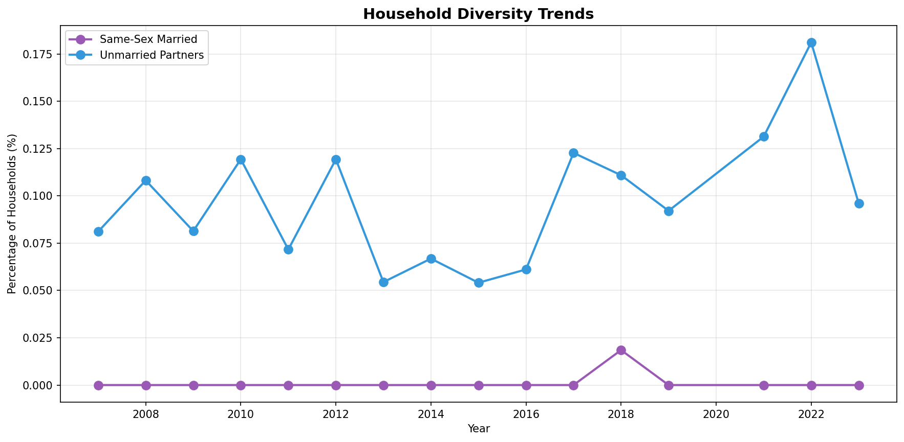
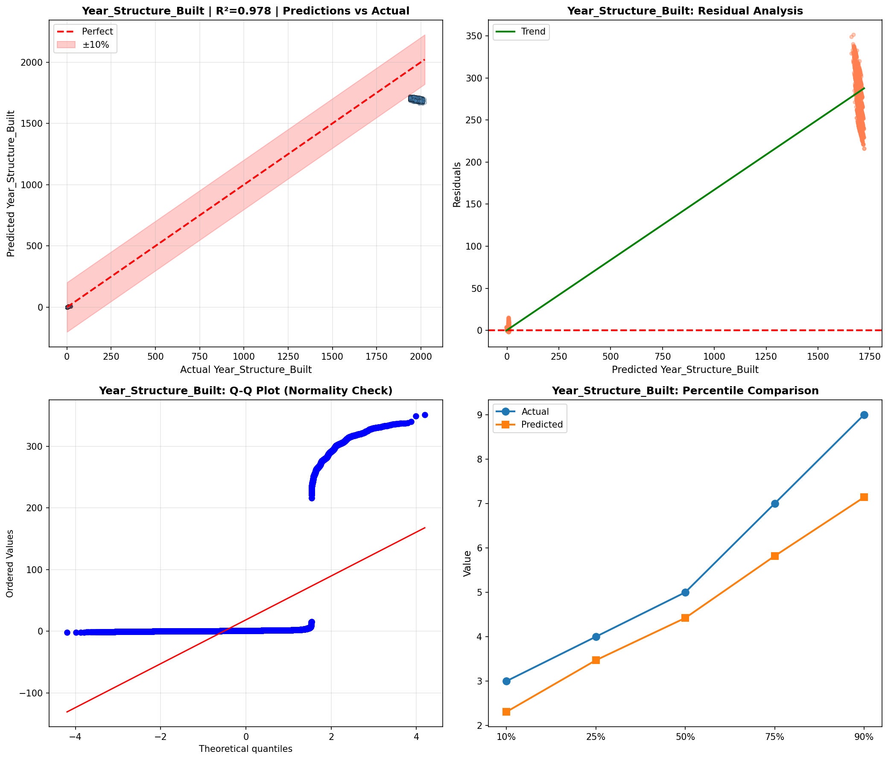
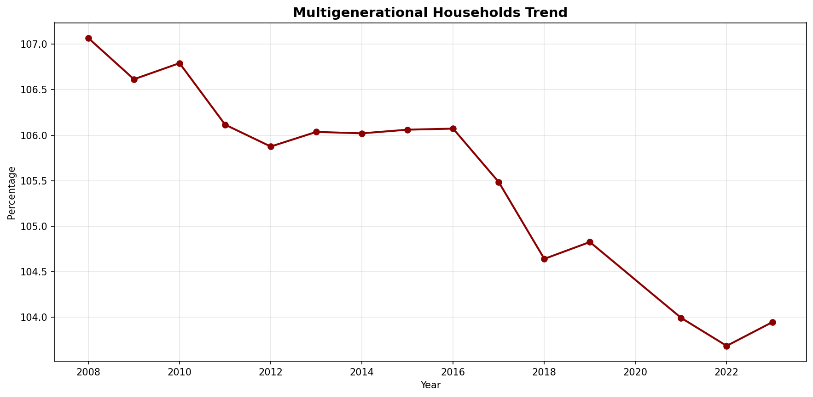
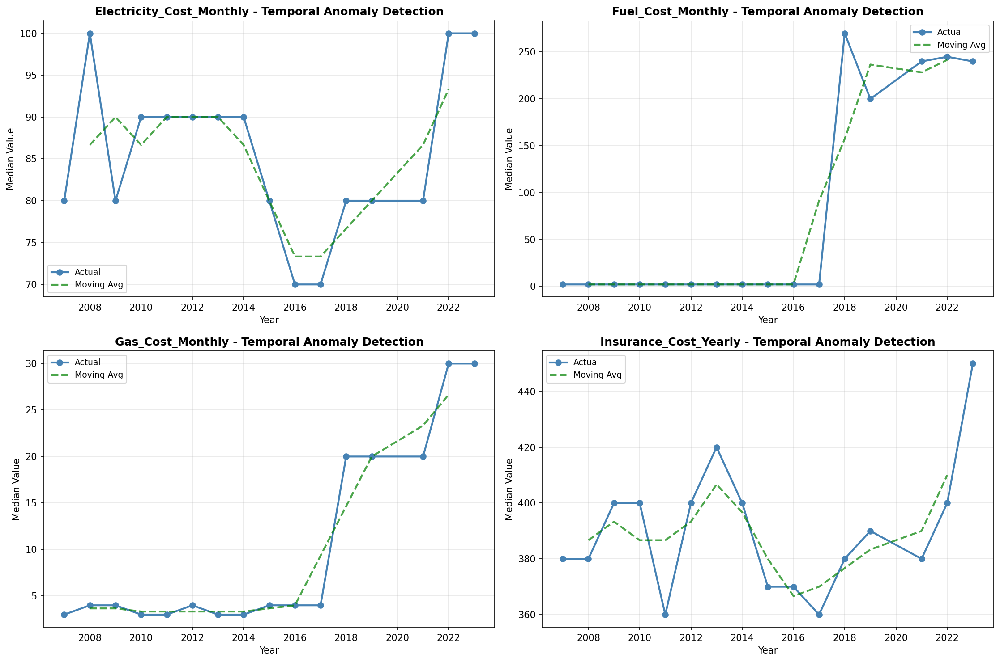
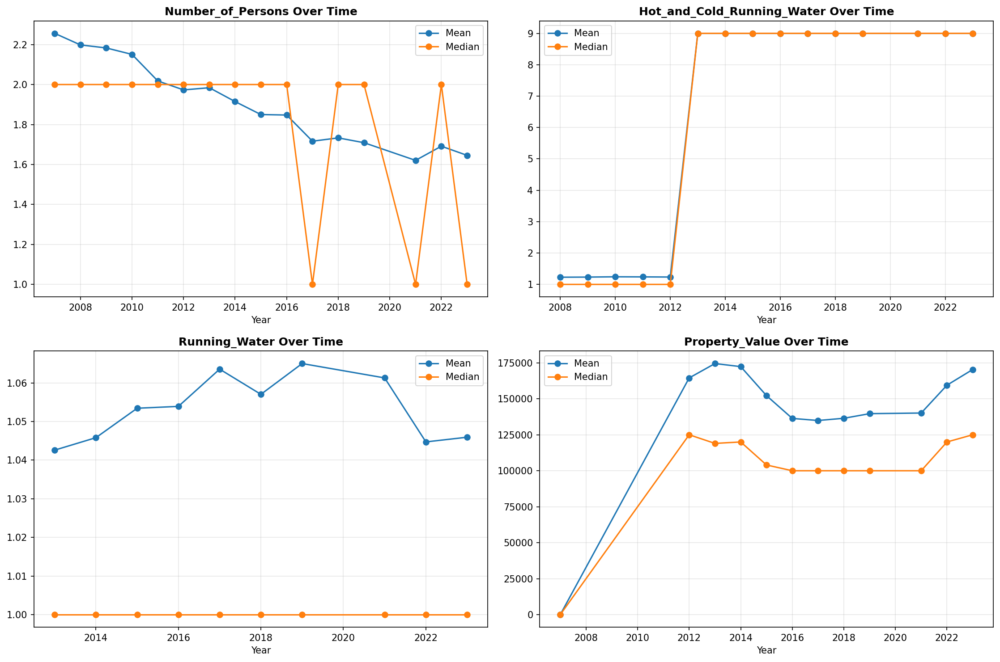
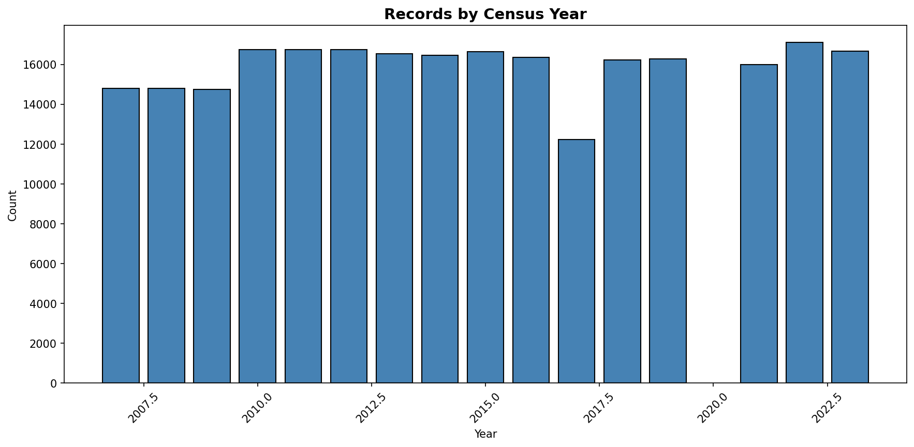
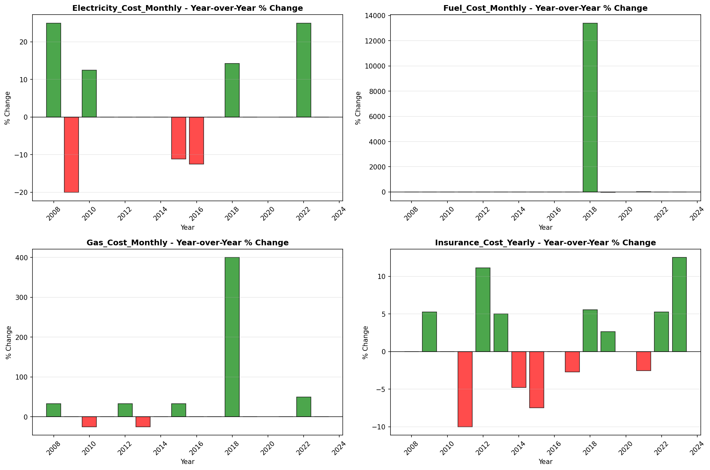

# Temporal Analysis

> Analysis of data patterns and trends over time, including year-over-year changes and growth rate calculations.

## Year Distribution

### Summary

- **Total Years**: 16

- **Year Range**: 2007 - 2023

- **Total Records**: 255,030

- **Average Records/Year**: 15,939

### Records by Year

| Year | Records | % of Total | Deviation from Avg |
| :--- | :--- | :--- | :--- |
| 2007 | 14,786 | 5.8% | -7.2% |
| 2008 | 14,788 | 5.8% | -7.2% |
| 2009 | 14,739 | 5.8% | -7.5% |
| 2010 | 16,753 | 6.6% | +5.1% |
| 2011 | 16,742 | 6.6% | +5.0% |
| 2012 | 16,754 | 6.6% | +5.1% |
| 2013 | 16,532 | 6.5% | +3.7% |
| 2014 | 16,455 | 6.5% | +3.2% |
| 2015 | 16,633 | 6.5% | +4.4% |
| 2016 | 16,360 | 6.4% | +2.6% |
| 2017 | 12,218 | 4.8% | -23.3% |
| 2018 | 16,224 | 6.4% | +1.8% |
| 2019 | 16,279 | 6.4% | +2.1% |
| 2021 | 15,988 | 6.3% | +0.3% |
| 2022 | 17,112 | 6.7% | +7.4% |
| 2023 | 16,667 | 6.5% | +4.6% |

> *Sample size increased by 12.7% from 2007 to 2023.*

## Sample Size Consistency

- **Standard Deviation**: 1,207 records

- **Coefficient of Variation**: 7.6 %

- **Consistency Rating**: highly consistent

> *Sample sizes are stable across years.*

## Temporal Trends

### Trend Summary

| Direction | Count | Percentage |
| :--- | :--- | :--- |
| Increasing | 0 | 0.0% |
| Decreasing | 0 | 0.0% |
| Stable/Other | 250 | 100.0% |

## Growth Rates

### Growth Rate Summary

- **Average Growth Rate**: 1,272.15 %

- **Variables with Positive Growth**: 1

- **Variables with Negative Growth**: 0

### Top Growth Rates

| Variable | Growth Rate | Direction |
| :--- | :--- | :--- |
| sample_growth | 1272.15% | Increasing |

## Visualizations

