# Statistical Analysis

> Comprehensive descriptive statistics including central tendency, dispersion, distribution characteristics, and weighted statistics using ACS sample weights.

## Summary Statistics

- **Variables Analyzed**: 41

### Income_Adjustment_Factor

| Statistic | Unweighted | Weighted (ACS) |
| :--- | :--- | :--- |
| Mean | 1,014,793.70 | 1,014,656.45 |
| Median | 1,010,207.00 | 1,014,656.45 |
| Std Deviation | 11,473.66 | — |
| Minimum | 1,001,264.00 | — |
| Maximum | 1,042,311.00 | — |
| Count | 177,222 | — |

> *Distribution is highly right-skewed (skewness: 1.31), light-tailed/platykurtic (kurtosis: 0.70).*

- **Coefficient of Variation**: 1.1 % (low variability)

### Property_Value

| Statistic | Unweighted | Weighted (ACS) |
| :--- | :--- | :--- |
| Mean | 139,516.28 | 139,571.52 |
| Median | 100,000.00 | 102,084.50 |
| Std Deviation | 261,645.71 | — |
| Minimum | 1.00 | — |
| Maximum | 3,920,000.00 | — |
| Count | 105,783 | — |

> *Distribution is highly right-skewed (skewness: 9.61), heavy-tailed/leptokurtic (kurtosis: 109.39).*

- **Coefficient of Variation**: 187.5 % (very high variability)

### Electricity_Cost_Monthly

| Statistic | Unweighted | Weighted (ACS) |
| :--- | :--- | :--- |
| Mean | 114.83 | 114.61 |
| Median | 90.00 | 86.88 |
| Std Deviation | 116.25 | — |
| Minimum | 1.00 | — |
| Maximum | 2,300.00 | — |
| Count | 193,053 | — |

> *Distribution is highly right-skewed (skewness: 8.29), heavy-tailed/leptokurtic (kurtosis: 139.03).*

- **Coefficient of Variation**: 101.2 % (very high variability)

### Fuel_Cost_Monthly

| Statistic | Unweighted | Weighted (ACS) |
| :--- | :--- | :--- |
| Mean | 13.26 | 148.91 |
| Median | 2.00 | 74.50 |
| Std Deviation | 119.99 | — |
| Minimum | 1.00 | — |
| Maximum | 5,800.00 | — |
| Count | 135,903 | — |

> *Distribution is highly right-skewed (skewness: 22.39), heavy-tailed/leptokurtic (kurtosis: 728.97).*

- **Coefficient of Variation**: 905.2 % (very high variability)

### Gas_Cost_Monthly

| Statistic | Unweighted | Weighted (ACS) |
| :--- | :--- | :--- |
| Mean | 24.07 | 24.14 |
| Median | 10.00 | 10.25 |
| Std Deviation | 38.20 | — |
| Minimum | 1.00 | — |
| Maximum | 590.00 | — |
| Count | 166,878 | — |

> *Distribution is highly right-skewed (skewness: 5.34), heavy-tailed/leptokurtic (kurtosis: 56.54).*

- **Coefficient of Variation**: 158.7 % (very high variability)

### Insurance_Cost_Yearly

| Statistic | Unweighted | Weighted (ACS) |
| :--- | :--- | :--- |
| Mean | 579.26 | 571.35 |
| Median | 400.00 | 385.62 |
| Std Deviation | 607.87 | — |
| Minimum | 4.00 | — |
| Maximum | 4,200.00 | — |
| Count | 43,599 | — |

> *Distribution is highly right-skewed (skewness: 2.71), heavy-tailed/leptokurtic (kurtosis: 9.16).*

- **Coefficient of Variation**: 104.9 % (very high variability)

### Water_Cost_Yearly

| Statistic | Unweighted | Weighted (ACS) |
| :--- | :--- | :--- |
| Mean | 472.69 | 487.81 |
| Median | 360.00 | 378.75 |
| Std Deviation | 460.26 | — |
| Minimum | 1.00 | — |
| Maximum | 3,900.00 | — |
| Count | 190,550 | — |

> *Distribution is highly right-skewed (skewness: 2.62), heavy-tailed/leptokurtic (kurtosis: 10.96).*

- **Coefficient of Variation**: 97.4 % (high variability)

### Mobile_Home_Costs_Monthly

| Statistic | Unweighted | Weighted (ACS) |
| :--- | :--- | :--- |
| Mean | 2,331.77 | N/A |
| Median | 390.00 | N/A |
| Std Deviation | 3,745.88 | — |
| Minimum | 4.00 | — |
| Maximum | 10,400.00 | — |
| Count | 43 | — |

> *Distribution is highly right-skewed (skewness: 1.29), light-tailed/platykurtic (kurtosis: -0.18).*

- **Coefficient of Variation**: 160.6 % (very high variability)

### First_Mortgage_Payment_Monthly

| Statistic | Unweighted | Weighted (ACS) |
| :--- | :--- | :--- |
| Mean | 521.97 | 686.49 |
| Median | 470.00 | 546.75 |
| Std Deviation | 560.51 | — |
| Minimum | 4.00 | — |
| Maximum | 6,300.00 | — |
| Count | 72,308 | — |

> *Distribution is highly right-skewed (skewness: 2.38), heavy-tailed/leptokurtic (kurtosis: 10.40).*

- **Coefficient of Variation**: 107.4 % (very high variability)

### First_Mortgage_Includes_Taxes

| Statistic | Unweighted | Weighted (ACS) |
| :--- | :--- | :--- |
| Mean | 1.39 | 1.38 |
| Median | 1.00 | 1.00 |
| Std Deviation | 0.49 | — |
| Minimum | 1.00 | — |
| Maximum | 2.00 | — |
| Count | 50,335 | — |

> *Distribution is approximately symmetric (skewness: 0.45), light-tailed/platykurtic (kurtosis: -1.80).*

- **Coefficient of Variation**: 35.1 % (moderate variability)

### Second_Mortgage_Payment_Monthly

| Statistic | Unweighted | Weighted (ACS) |
| :--- | :--- | :--- |
| Mean | 502.20 | 504.93 |
| Median | 390.00 | 387.50 |
| Std Deviation | 437.28 | — |
| Minimum | 4.00 | — |
| Maximum | 5,000.00 | — |
| Count | 2,229 | — |

> *Distribution is highly right-skewed (skewness: 2.95), heavy-tailed/leptokurtic (kurtosis: 13.97).*

- **Coefficient of Variation**: 87.1 % (high variability)

### Property_Taxes_Yearly

| Statistic | Unweighted | Weighted (ACS) |
| :--- | :--- | :--- |
| Mean | 22.37 | 98.60 |
| Median | 1.00 | 48.83 |
| Std Deviation | 269.33 | — |
| Minimum | 1.00 | — |
| Maximum | 7,500.00 | — |
| Count | 98,979 | — |

> *Distribution is highly right-skewed (skewness: 23.06), heavy-tailed/leptokurtic (kurtosis: 608.40).*

- **Coefficient of Variation**: 1,204.0 % (very high variability)

### Meals_Included_in_Rent

| Statistic | Unweighted | Weighted (ACS) |
| :--- | :--- | :--- |
| Mean | 1.99 | 1.99 |
| Median | 2.00 | 2.00 |
| Std Deviation | 0.09 | — |
| Minimum | 1.00 | — |
| Maximum | 2.00 | — |
| Count | 39,487 | — |

> *Distribution is highly left-skewed (skewness: -10.87), heavy-tailed/leptokurtic (kurtosis: 116.13).*

- **Coefficient of Variation**: 4.5 % (low variability)

### Rent_Amount_Monthly

| Statistic | Unweighted | Weighted (ACS) |
| :--- | :--- | :--- |
| Mean | 391.06 | 398.50 |
| Median | 350.00 | 355.62 |
| Std Deviation | 312.67 | — |
| Minimum | 4.00 | — |
| Maximum | 2,600.00 | — |
| Count | 39,487 | — |

> *Distribution is highly right-skewed (skewness: 2.45), heavy-tailed/leptokurtic (kurtosis: 10.82).*

- **Coefficient of Variation**: 80.0 % (high variability)

### Gross_Rent

| Statistic | Unweighted | Weighted (ACS) |
| :--- | :--- | :--- |
| Mean | 504.26 | 513.89 |
| Median | 451.00 | 460.50 |
| Std Deviation | 355.53 | — |
| Minimum | 4.00 | — |
| Maximum | 5,067.00 | — |
| Count | 34,386 | — |

> *Distribution is highly right-skewed (skewness: 2.35), heavy-tailed/leptokurtic (kurtosis: 11.19).*

- **Coefficient of Variation**: 70.5 % (high variability)

### Gross_Rent_Percentage_Income

| Statistic | Unweighted | Weighted (ACS) |
| :--- | :--- | :--- |
| Mean | 43.61 | 43.59 |
| Median | 33.00 | 32.56 |
| Std Deviation | 30.33 | — |
| Minimum | 1.00 | — |
| Maximum | 101.00 | — |
| Count | 30,687 | — |

> *Distribution is moderately right-skewed (skewness: 0.87), light-tailed/platykurtic (kurtosis: -0.59).*

- **Coefficient of Variation**: 69.5 % (high variability)

### Selected_Monthly_Owner_Costs

| Statistic | Unweighted | Weighted (ACS) |
| :--- | :--- | :--- |
| Mean | 495.66 | 517.50 |
| Median | 250.00 | 262.81 |
| Std Deviation | 580.94 | — |
| Minimum | 1.00 | — |
| Maximum | 8,822.00 | — |
| Count | 139,517 | — |

> *Distribution is highly right-skewed (skewness: 3.09), heavy-tailed/leptokurtic (kurtosis: 16.00).*

- **Coefficient of Variation**: 117.2 % (very high variability)

### Owner_Costs_Percentage_Income

| Statistic | Unweighted | Weighted (ACS) |
| :--- | :--- | :--- |
| Mean | 23.26 | 23.58 |
| Median | 15.00 | 15.62 |
| Std Deviation | 23.81 | — |
| Minimum | 1.00 | — |
| Maximum | 101.00 | — |
| Count | 134,508 | — |

> *Distribution is highly right-skewed (skewness: 1.89), heavy-tailed/leptokurtic (kurtosis: 3.18).*

- **Coefficient of Variation**: 102.4 % (very high variability)

### Family_Income

| Statistic | Unweighted | Weighted (ACS) |
| :--- | :--- | :--- |
| Mean | 37,745.53 | 37,560.63 |
| Median | 25,400.00 | 25,340.62 |
| Std Deviation | 45,322.33 | — |
| Minimum | 1.00 | — |
| Maximum | 1,357,300.00 | — |
| Count | 126,606 | — |

> *Distribution is highly right-skewed (skewness: 4.83), heavy-tailed/leptokurtic (kurtosis: 44.63).*

- **Coefficient of Variation**: 120.1 % (very high variability)

### Household_Income

| Statistic | Unweighted | Weighted (ACS) |
| :--- | :--- | :--- |
| Mean | 33,518.14 | 33,497.39 |
| Median | 21,600.00 | 21,573.75 |
| Std Deviation | 42,558.27 | — |
| Minimum | 1.00 | — |
| Maximum | 1,357,300.00 | — |
| Count | 182,807 | — |

> *Distribution is highly right-skewed (skewness: 4.99), heavy-tailed/leptokurtic (kurtosis: 47.06).*

- **Coefficient of Variation**: 127.0 % (very high variability)

### Specified_Rent_Unit

| Statistic | Unweighted | Weighted (ACS) |
| :--- | :--- | :--- |
| Mean | 0.25 | 0.26 |
| Median | 0.00 | 0.00 |
| Std Deviation | 0.43 | — |
| Minimum | 0.00 | — |
| Maximum | 1.00 | — |
| Count | 242,784 | — |

> *Distribution is highly right-skewed (skewness: 1.17), light-tailed/platykurtic (kurtosis: -0.63).*

- **Coefficient of Variation**: 174.3 % (very high variability)

### Specified_Value_Unit

| Statistic | Unweighted | Weighted (ACS) |
| :--- | :--- | :--- |
| Mean | 0.53 | 0.51 |
| Median | 1.00 | 0.44 |
| Std Deviation | 0.50 | — |
| Minimum | 0.00 | — |
| Maximum | 1.00 | — |
| Count | 242,784 | — |

> *Distribution is approximately symmetric (skewness: -0.12), light-tailed/platykurtic (kurtosis: -1.98).*

- **Coefficient of Variation**: 94.1 % (high variability)

### Flag_Family_Income

| Statistic | Unweighted | Weighted (ACS) |
| :--- | :--- | :--- |
| Mean | 0.19 | 0.17 |
| Median | 0.00 | 0.00 |
| Std Deviation | 0.39 | — |
| Minimum | 0.00 | — |
| Maximum | 1.00 | — |
| Count | 183,457 | — |

> *Distribution is highly right-skewed (skewness: 1.58), light-tailed/platykurtic (kurtosis: 0.50).*

- **Coefficient of Variation**: 206.6 % (very high variability)

### Flag_Gross_Rent

| Statistic | Unweighted | Weighted (ACS) |
| :--- | :--- | :--- |
| Mean | 0.06 | 0.08 |
| Median | 0.00 | 0.00 |
| Std Deviation | 0.23 | — |
| Minimum | 0.00 | — |
| Maximum | 1.00 | — |
| Count | 112,805 | — |

> *Distribution is highly right-skewed (skewness: 3.86), heavy-tailed/leptokurtic (kurtosis: 12.89).*

- **Coefficient of Variation**: 410.2 % (very high variability)

### Flag_Household_Income

| Statistic | Unweighted | Weighted (ACS) |
| :--- | :--- | :--- |
| Mean | 0.27 | 0.24 |
| Median | 0.00 | 0.00 |
| Std Deviation | 0.44 | — |
| Minimum | 0.00 | — |
| Maximum | 1.00 | — |
| Count | 183,457 | — |

> *Distribution is highly right-skewed (skewness: 1.04), light-tailed/platykurtic (kurtosis: -0.93).*

- **Coefficient of Variation**: 164.4 % (very high variability)

### Flag_First_Mortgage_Payment

| Statistic | Unweighted | Weighted (ACS) |
| :--- | :--- | :--- |
| Mean | 0.02 | 0.02 |
| Median | 0.00 | 0.00 |
| Std Deviation | 0.13 | — |
| Minimum | 0.00 | — |
| Maximum | 1.00 | — |
| Count | 242,784 | — |

> *Distribution is highly right-skewed (skewness: 7.14), heavy-tailed/leptokurtic (kurtosis: 48.93).*

- **Coefficient of Variation**: 727.4 % (very high variability)

### Flag_First_Mortgage_Taxes

| Statistic | Unweighted | Weighted (ACS) |
| :--- | :--- | :--- |
| Mean | 0.10 | 0.12 |
| Median | 0.00 | 0.00 |
| Std Deviation | 0.30 | — |
| Minimum | 0.00 | — |
| Maximum | 1.00 | — |
| Count | 242,784 | — |

> *Distribution is highly right-skewed (skewness: 2.62), heavy-tailed/leptokurtic (kurtosis: 4.88).*

- **Coefficient of Variation**: 296.1 % (very high variability)

### Flag_Meals_Included_Rent

| Statistic | Unweighted | Weighted (ACS) |
| :--- | :--- | :--- |
| Mean | 0.01 | 0.00 |
| Median | 0.00 | 0.00 |
| Std Deviation | 0.07 | — |
| Minimum | 0.00 | — |
| Maximum | 1.00 | — |
| Count | 242,784 | — |

> *Distribution is highly right-skewed (skewness: 13.51), heavy-tailed/leptokurtic (kurtosis: 180.62).*

- **Coefficient of Variation**: 1,358.7 % (very high variability)

### Flag_Rent_Amount

| Statistic | Unweighted | Weighted (ACS) |
| :--- | :--- | :--- |
| Mean | 0.03 | 0.03 |
| Median | 0.00 | 0.00 |
| Std Deviation | 0.16 | — |
| Minimum | 0.00 | — |
| Maximum | 1.00 | — |
| Count | 242,784 | — |

> *Distribution is highly right-skewed (skewness: 5.99), heavy-tailed/leptokurtic (kurtosis: 33.83).*

- **Coefficient of Variation**: 614.9 % (very high variability)

### Flag_Selected_Monthly_Owner_Costs

| Statistic | Unweighted | Weighted (ACS) |
| :--- | :--- | :--- |
| Mean | 0.26 | 0.27 |
| Median | 0.00 | 0.00 |
| Std Deviation | 0.44 | — |
| Minimum | 0.00 | — |
| Maximum | 1.00 | — |
| Count | 152,655 | — |

> *Distribution is highly right-skewed (skewness: 1.09), light-tailed/platykurtic (kurtosis: -0.82).*

- **Coefficient of Variation**: 168.3 % (very high variability)

### Flag_Second_Mortgage_Payment

| Statistic | Unweighted | Weighted (ACS) |
| :--- | :--- | :--- |
| Mean | 0.01 | 0.01 |
| Median | 0.00 | 0.00 |
| Std Deviation | 0.12 | — |
| Minimum | 0.00 | — |
| Maximum | 1.00 | — |
| Count | 242,784 | — |

> *Distribution is highly right-skewed (skewness: 8.08), heavy-tailed/leptokurtic (kurtosis: 63.35).*

- **Coefficient of Variation**: 820.6 % (very high variability)

### Flag_Property_Taxes

| Statistic | Unweighted | Weighted (ACS) |
| :--- | :--- | :--- |
| Mean | 0.07 | 0.06 |
| Median | 0.00 | 0.00 |
| Std Deviation | 0.25 | — |
| Minimum | 0.00 | — |
| Maximum | 1.00 | — |
| Count | 227,177 | — |

> *Distribution is highly right-skewed (skewness: 3.43), heavy-tailed/leptokurtic (kurtosis: 9.77).*

- **Coefficient of Variation**: 370.1 % (very high variability)

### Flag_Property_Value

| Statistic | Unweighted | Weighted (ACS) |
| :--- | :--- | :--- |
| Mean | 0.17 | 0.17 |
| Median | 0.00 | 0.00 |
| Std Deviation | 0.37 | — |
| Minimum | 0.00 | — |
| Maximum | 1.00 | — |
| Count | 242,784 | — |

> *Distribution is highly right-skewed (skewness: 1.80), light-tailed/platykurtic (kurtosis: 1.24).*

- **Coefficient of Variation**: 224.4 % (very high variability)

### Flag_Water_Cost

| Statistic | Unweighted | Weighted (ACS) |
| :--- | :--- | :--- |
| Mean | 0.06 | 0.05 |
| Median | 0.00 | 0.00 |
| Std Deviation | 0.23 | — |
| Minimum | 0.00 | — |
| Maximum | 1.00 | — |
| Count | 15,607 | — |

> *Distribution is highly right-skewed (skewness: 3.78), heavy-tailed/leptokurtic (kurtosis: 12.33).*

- **Coefficient of Variation**: 403.3 % (very high variability)

### Annual_Rent_to_Value_Ratio

### Total_Monthly_Utility_Cost

| Statistic | Unweighted | Weighted (ACS) |
| :--- | :--- | :--- |
| Mean | 134.97 | 132.86 |
| Median | 110.00 | 106.81 |
| Std Deviation | 122.89 | — |
| Minimum | 2.00 | — |
| Maximum | 2,890.00 | — |
| Count | 194,007 | — |

> *Distribution is highly right-skewed (skewness: 7.62), heavy-tailed/leptokurtic (kurtosis: 123.27).*

- **Coefficient of Variation**: 91.1 % (high variability)

### Property_Tax_Rate

| Statistic | Unweighted | Weighted (ACS) |
| :--- | :--- | :--- |
| Mean | 3.42 | 2.62 |
| Median | 0.00 | 1.00 |
| Std Deviation | 20.40 | — |
| Minimum | 0.00 | — |
| Maximum | 516.67 | — |
| Count | 61,627 | — |

> *Distribution is highly right-skewed (skewness: 13.29), heavy-tailed/leptokurtic (kurtosis: 225.21).*

- **Coefficient of Variation**: 597.5 % (very high variability)

#### Weighted Statistics by Year

| Year | Weighted Mean | Weighted Median |
| :--- | :--- | :--- |
| 2007 | 20.48 | 7.69 |
| 2012 | 0.00 | 0.00 |
| 2013 | 0.01 | 0.00 |
| 2014 | 0.01 | 0.00 |
| 2015 | 0.00 | 0.00 |
| 2016 | 0.00 | 0.00 |
| 2017 | 0.00 | 0.00 |
| 2023 | 0.48 | 0.28 |

### Structure_Age

| Statistic | Unweighted | Weighted (ACS) |
| :--- | :--- | :--- |
| Mean | 1,873.26 | 1,877.66 |
| Median | 2,019.00 | 1,878.43 |
| Std Deviation | 514.73 | — |
| Minimum | 1.00 | — |
| Maximum | 2,023.00 | — |
| Count | 211,529 | — |

> *Distribution is highly left-skewed (skewness: -3.26), heavy-tailed/leptokurtic (kurtosis: 8.64).*

- **Coefficient of Variation**: 27.5 % (moderate variability)

### Structure_Age_Score

| Statistic | Unweighted | Weighted (ACS) |
| :--- | :--- | :--- |
| Mean | 0.04 | 0.04 |
| Median | 0.00 | 0.03 |
| Std Deviation | 0.14 | — |
| Minimum | 0.00 | — |
| Maximum | 0.99 | — |
| Count | 211,529 | — |

> *Distribution is highly right-skewed (skewness: 3.92), heavy-tailed/leptokurtic (kurtosis: 14.73).*

- **Coefficient of Variation**: 378.7 % (very high variability)

### Working_Age_Persons

| Statistic | Unweighted | Weighted (ACS) |
| :--- | :--- | :--- |
| Mean | 1.60 | 1.69 |
| Median | 1.00 | 1.62 |
| Std Deviation | 1.32 | — |
| Minimum | 0.00 | — |
| Maximum | 13.00 | — |
| Count | 194,985 | — |

> *Distribution is moderately right-skewed (skewness: 0.80), light-tailed/platykurtic (kurtosis: 1.10).*

- **Coefficient of Variation**: 82.2 % (high variability)

### Income_to_FPL_Ratio

| Statistic | Unweighted | Weighted (ACS) |
| :--- | :--- | :--- |
| Mean | 1.43 | 1.42 |
| Median | 0.95 | 0.94 |
| Std Deviation | 1.91 | — |
| Minimum | -0.43 | — |
| Maximum | 52.90 | — |
| Count | 194,985 | — |

> *Distribution is highly right-skewed (skewness: 5.52), heavy-tailed/leptokurtic (kurtosis: 56.27).*

- **Coefficient of Variation**: 132.9 % (very high variability)

## Distribution Analysis

### Skewed Distributions

> Variables with skewness > |0.5| indicate non-normal distributions. Consider log transformations for highly skewed variables in modeling.

| Variable | Skewness | Direction | Severity |
| :--- | :--- | :--- | :--- |
| Property_Taxes_Yearly | 23.061 | Right-skewed | High |
| Fuel_Cost_Monthly | 22.391 | Right-skewed | High |
| Flag_Meals_Included_Rent | 13.514 | Right-skewed | High |
| Property_Tax_Rate | 13.286 | Right-skewed | High |
| Meals_Included_in_Rent | -10.869 | Left-skewed | High |
| Property_Value | 9.610 | Right-skewed | High |
| Electricity_Cost_Monthly | 8.286 | Right-skewed | High |
| Flag_Second_Mortgage_Payment | 8.084 | Right-skewed | High |
| Total_Monthly_Utility_Cost | 7.616 | Right-skewed | High |
| Flag_First_Mortgage_Payment | 7.137 | Right-skewed | High |
| Flag_Rent_Amount | 5.986 | Right-skewed | High |
| Income_to_FPL_Ratio | 5.522 | Right-skewed | High |
| Gas_Cost_Monthly | 5.339 | Right-skewed | High |
| Household_Income | 4.986 | Right-skewed | High |
| Family_Income | 4.827 | Right-skewed | High |
| Structure_Age_Score | 3.920 | Right-skewed | High |
| Flag_Gross_Rent | 3.858 | Right-skewed | High |
| Flag_Water_Cost | 3.785 | Right-skewed | High |
| Flag_Property_Taxes | 3.431 | Right-skewed | High |
| Structure_Age | -3.261 | Left-skewed | High |

- **Total Skewed Variables**: 38

- **Right-skewed**: 36

- **Left-skewed**: 2

## Variance Analysis

### Coefficient of Variation Ranking

> CV (Coefficient of Variation) = (Std Dev / Mean) × 100%. Higher CV indicates greater relative variability.

| Variable | CV (%) | Std Dev | Mean | Variability |
| :--- | :--- | :--- | :--- | :--- |
| Flag_Meals_Included_Rent | 1358.7% | 0.07 | 0.01 | Very High |
| Property_Taxes_Yearly | 1204.0% | 269.33 | 22.37 | Very High |
| Fuel_Cost_Monthly | 905.2% | 119.99 | 13.26 | Very High |
| Flag_Second_Mortgage_Payment | 820.6% | 0.12 | 0.01 | Very High |
| Flag_First_Mortgage_Payment | 727.4% | 0.13 | 0.02 | Very High |
| Flag_Rent_Amount | 614.9% | 0.16 | 0.03 | Very High |
| Property_Tax_Rate | 597.5% | 20.40 | 3.42 | Very High |
| Flag_Gross_Rent | 410.2% | 0.23 | 0.06 | Very High |
| Flag_Water_Cost | 403.3% | 0.23 | 0.06 | Very High |
| Structure_Age_Score | 378.7% | 0.14 | 0.04 | Very High |
| Flag_Property_Taxes | 370.1% | 0.25 | 0.07 | Very High |
| Flag_First_Mortgage_Taxes | 296.1% | 0.30 | 0.10 | Very High |
| Flag_Property_Value | 224.4% | 0.37 | 0.17 | Very High |
| Flag_Family_Income | 206.6% | 0.39 | 0.19 | Very High |
| Property_Value | 187.5% | 261,645.71 | 139,516.28 | Very High |
| Specified_Rent_Unit | 174.3% | 0.43 | 0.25 | Very High |
| Flag_Selected_Monthly_Owner_Costs | 168.3% | 0.44 | 0.26 | Very High |
| Flag_Household_Income | 164.4% | 0.44 | 0.27 | Very High |
| Mobile_Home_Costs_Monthly | 160.6% | 3,745.88 | 2,331.77 | Very High |
| Gas_Cost_Monthly | 158.7% | 38.20 | 24.07 | Very High |

- **Average CV**: 279.6 %

- **High Variance Variables (CV > 50%)**: 36

## Visualizations

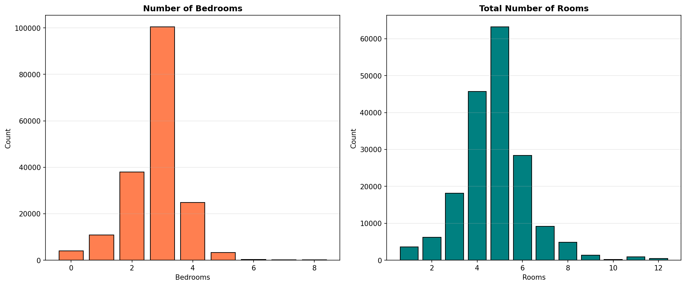

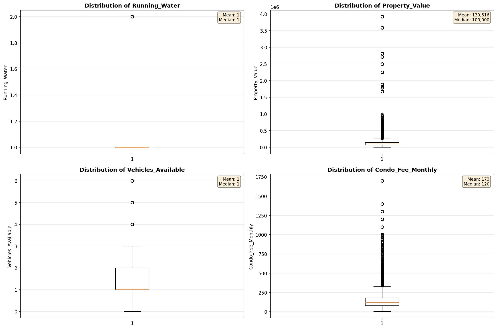

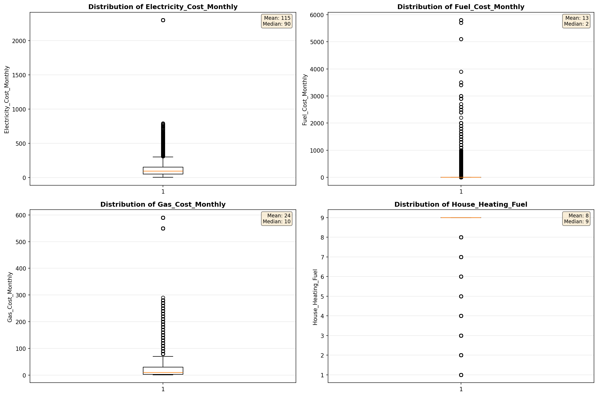

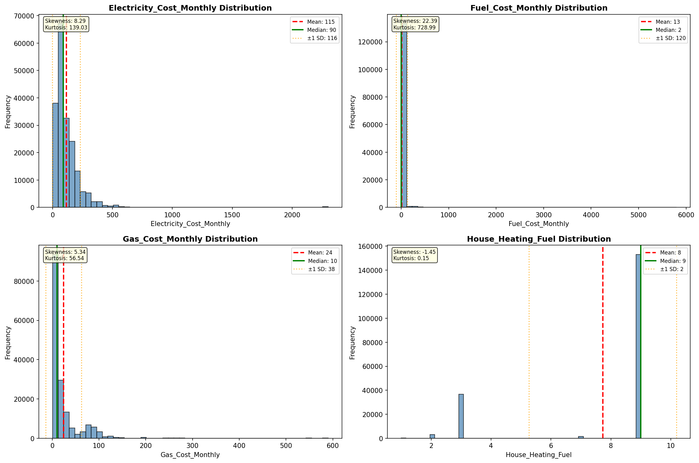

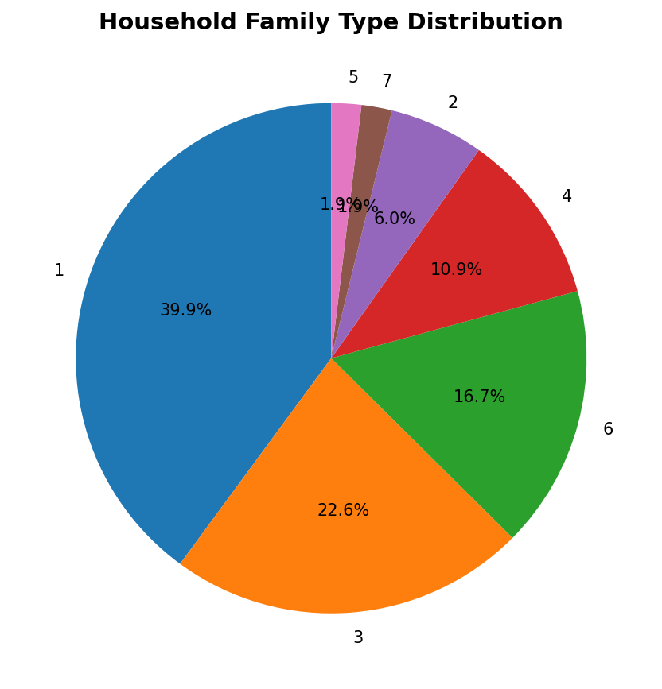

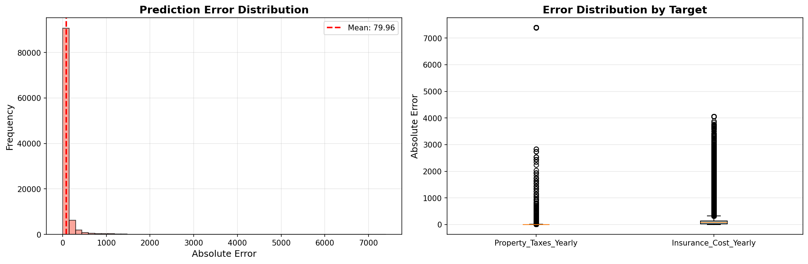

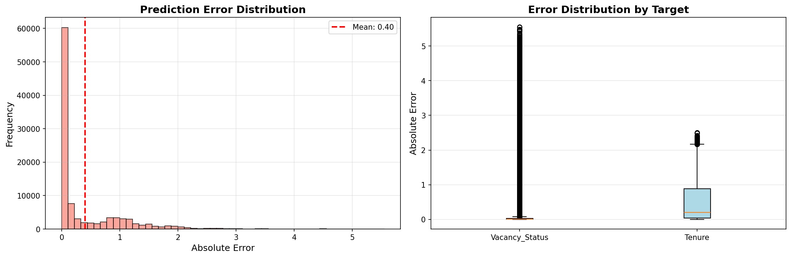

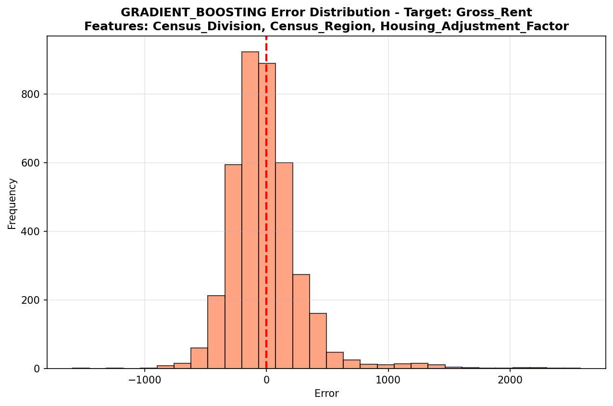

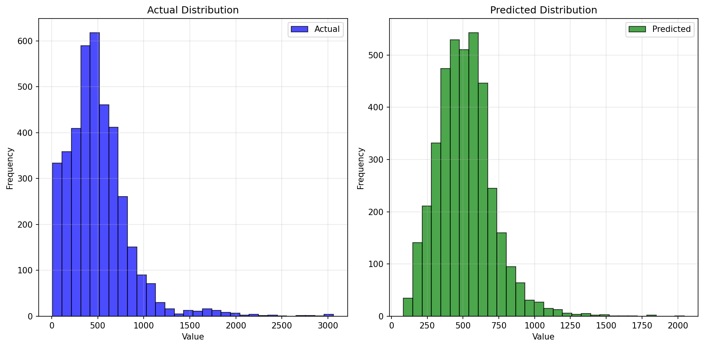

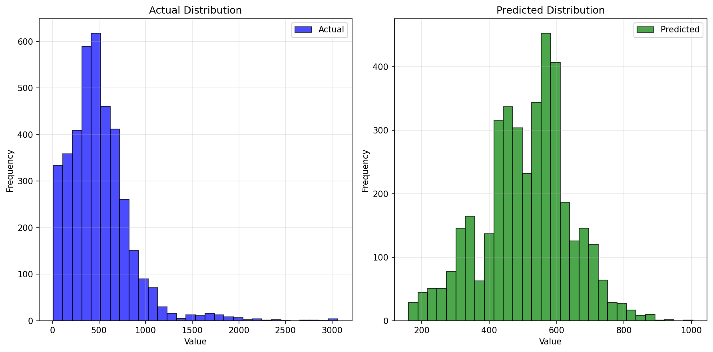

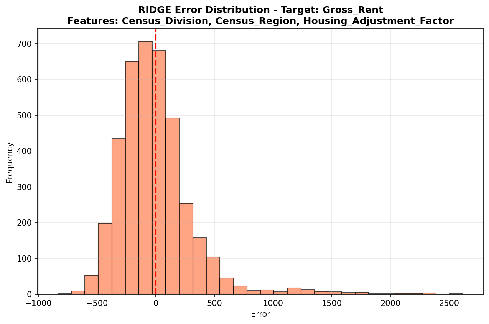

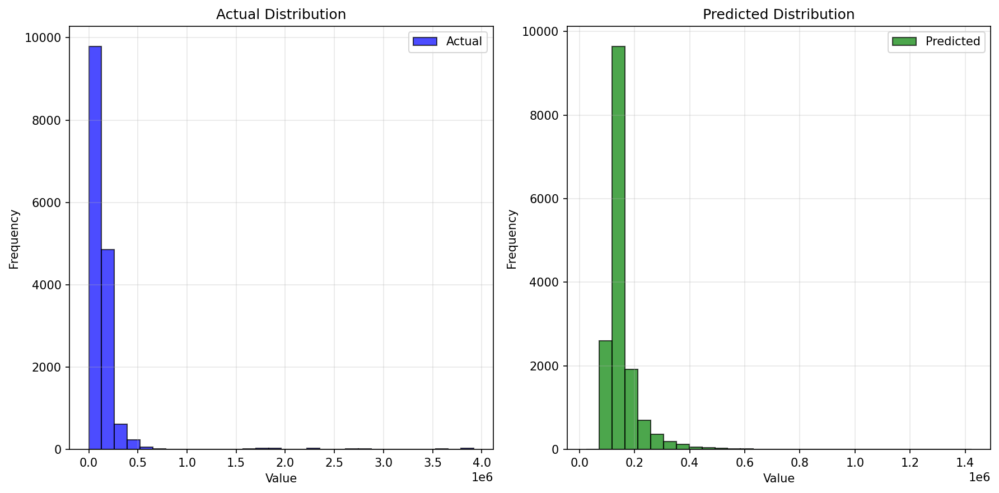

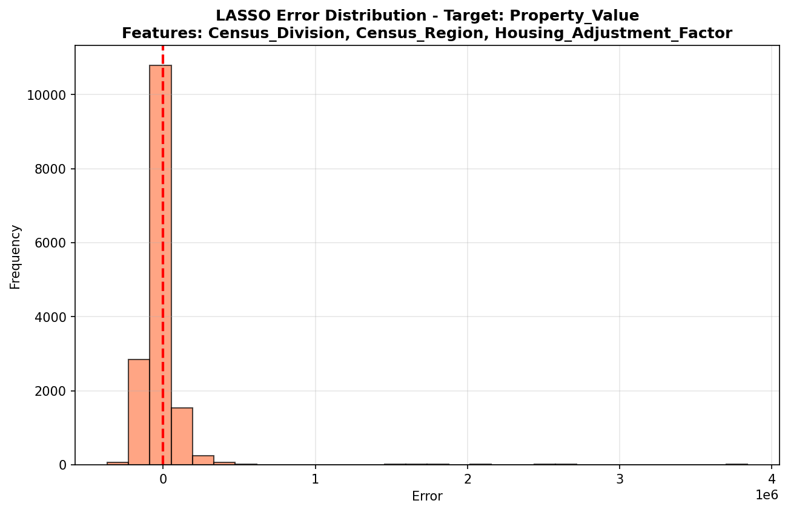

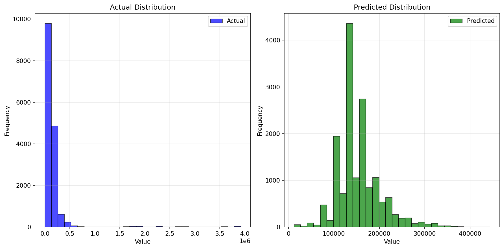

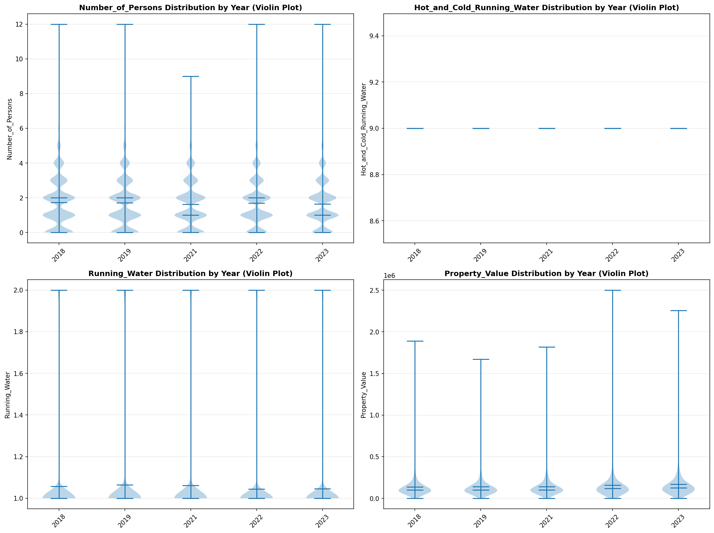

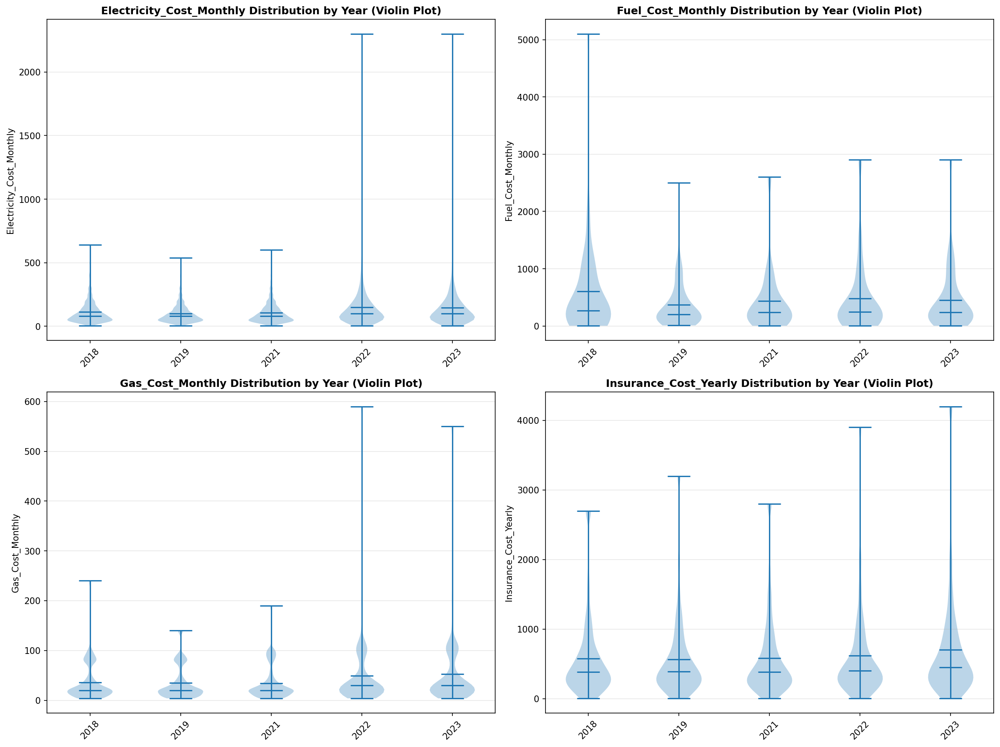

