# Statistical Analysis

> Comprehensive descriptive statistics including central tendency, dispersion, distribution characteristics, and weighted statistics using ACS sample weights.

## Summary Statistics

- **Variables Analyzed**: 30

### Income_Adjustment_Factor

| Statistic | Unweighted | Weighted (ACS) |
| :--- | :--- | :--- |
| Mean | 1,014,531.68 | 1,014,834.00 |
| Median | 1,010,207.00 | 1,014,834.00 |
| Std Deviation | 10,732.92 | — |
| Minimum | 1,001,264.00 | — |
| Maximum | 1,042,311.00 | — |
| Count | 350,902 | — |

> *Distribution is highly right-skewed (skewness: 1.41), light-tailed/platykurtic (kurtosis: 1.27).*

- **Coefficient of Variation**: 1.1 % (low variability)

### Age

| Statistic | Unweighted | Weighted (ACS) |
| :--- | :--- | :--- |
| Mean | 43.50 | 40.17 |
| Median | 45.00 | 39.56 |
| Std Deviation | 24.01 | — |
| Minimum | 0.00 | — |
| Maximum | 96.00 | — |
| Count | 485,402 | — |

> *Distribution is approximately symmetric (skewness: -0.02), light-tailed/platykurtic (kurtosis: -1.07).*

- **Coefficient of Variation**: 55.2 % (high variability)

### Interest_Dividend_Rental_Income

| Statistic | Unweighted | Weighted (ACS) |
| :--- | :--- | :--- |
| Mean | 20,951.13 | 19,601.13 |
| Median | 5,200.00 | 5,106.25 |
| Std Deviation | 58,297.46 | — |
| Minimum | 1.00 | — |
| Maximum | 488,000.00 | — |
| Count | 10,271 | — |

> *Distribution is highly right-skewed (skewness: 4.94), heavy-tailed/leptokurtic (kurtosis: 26.56).*

- **Coefficient of Variation**: 278.3 % (very high variability)

### Other_Income

| Statistic | Unweighted | Weighted (ACS) |
| :--- | :--- | :--- |
| Mean | 7,582.66 | 7,327.98 |
| Median | 3,700.00 | 3,843.75 |
| Std Deviation | 10,085.80 | — |
| Minimum | 4.00 | — |
| Maximum | 62,000.00 | — |
| Count | 29,864 | — |

> *Distribution is highly right-skewed (skewness: 2.54), heavy-tailed/leptokurtic (kurtosis: 6.64).*

- **Coefficient of Variation**: 133.0 % (very high variability)

### Public_Assistance_Income

| Statistic | Unweighted | Weighted (ACS) |
| :--- | :--- | :--- |
| Mean | 1,981.10 | 1,920.04 |
| Median | 1,400.00 | 1,341.25 |
| Std Deviation | 1,961.10 | — |
| Minimum | 10.00 | — |
| Maximum | 30,000.00 | — |
| Count | 15,553 | — |

> *Distribution is highly right-skewed (skewness: 4.54), heavy-tailed/leptokurtic (kurtosis: 40.89).*

- **Coefficient of Variation**: 99.0 % (high variability)

### Retirement_Income

| Statistic | Unweighted | Weighted (ACS) |
| :--- | :--- | :--- |
| Mean | 14,054.72 | 13,606.62 |
| Median | 10,100.00 | 9,787.50 |
| Std Deviation | 15,526.90 | — |
| Minimum | 4.00 | — |
| Maximum | 140,000.00 | — |
| Count | 40,917 | — |

> *Distribution is highly right-skewed (skewness: 3.63), heavy-tailed/leptokurtic (kurtosis: 18.69).*

- **Coefficient of Variation**: 110.5 % (very high variability)

### Self_Employment_Income

| Statistic | Unweighted | Weighted (ACS) |
| :--- | :--- | :--- |
| Mean | 20,838.10 | 19,990.47 |
| Median | 10,000.00 | 9,587.50 |
| Std Deviation | 35,029.57 | — |
| Minimum | 1.00 | — |
| Maximum | 216,000.00 | — |
| Count | 18,569 | — |

> *Distribution is highly right-skewed (skewness: 3.60), heavy-tailed/leptokurtic (kurtosis: 13.93).*

- **Coefficient of Variation**: 168.1 % (very high variability)

### Supplemental_Security_Income

| Statistic | Unweighted | Weighted (ACS) |
| :--- | :--- | :--- |
| Mean | 8,439.77 | 8,156.64 |
| Median | 7,300.00 | 7,250.00 |
| Std Deviation | 5,354.41 | — |
| Minimum | 1,000.00 | — |
| Maximum | 30,000.00 | — |
| Count | 1,491 | — |

> *Distribution is highly right-skewed (skewness: 1.15), light-tailed/platykurtic (kurtosis: 1.41).*

- **Coefficient of Variation**: 63.4 % (high variability)

### Social_Security_Income

| Statistic | Unweighted | Weighted (ACS) |
| :--- | :--- | :--- |
| Mean | 8,924.44 | 8,790.97 |
| Median | 8,200.00 | 8,175.00 |
| Std Deviation | 5,262.34 | — |
| Minimum | 4.00 | — |
| Maximum | 50,000.00 | — |
| Count | 130,067 | — |

> *Distribution is highly right-skewed (skewness: 1.25), light-tailed/platykurtic (kurtosis: 2.86).*

- **Coefficient of Variation**: 59.0 % (high variability)

### Wage_Income

| Statistic | Unweighted | Weighted (ACS) |
| :--- | :--- | :--- |
| Mean | 24,989.31 | 24,163.84 |
| Median | 17,500.00 | 16,818.75 |
| Std Deviation | 29,336.56 | — |
| Minimum | 4.00 | — |
| Maximum | 284,000.00 | — |
| Count | 144,220 | — |

> *Distribution is highly right-skewed (skewness: 4.11), heavy-tailed/leptokurtic (kurtosis: 23.07).*

- **Coefficient of Variation**: 117.4 % (very high variability)

### Hours_Worked_Per_Week

| Statistic | Unweighted | Weighted (ACS) |
| :--- | :--- | :--- |
| Mean | 35.57 | 35.56 |
| Median | 40.00 | 40.00 |
| Std Deviation | 11.52 | — |
| Minimum | 1.00 | — |
| Maximum | 99.00 | — |
| Count | 160,400 | — |

> *Distribution is approximately symmetric (skewness: -0.12), heavy-tailed/leptokurtic (kurtosis: 3.02).*

- **Coefficient of Variation**: 32.4 % (moderate variability)

### Presence_And_Age_Own_Children

| Statistic | Unweighted | Weighted (ACS) |
| :--- | :--- | :--- |
| Mean | 3.57 | 3.52 |
| Median | 4.00 | 4.00 |
| Std Deviation | 0.88 | — |
| Minimum | 1.00 | — |
| Maximum | 4.00 | — |
| Count | 216,306 | — |

> *Distribution is highly left-skewed (skewness: -1.74), light-tailed/platykurtic (kurtosis: 1.52).*

- **Coefficient of Variation**: 24.6 % (low variability)

### Total_Person_Earnings

| Statistic | Unweighted | Weighted (ACS) |
| :--- | :--- | :--- |
| Mean | 24,926.98 | 24,039.75 |
| Median | 16,800.00 | 16,256.25 |
| Std Deviation | 30,834.86 | — |
| Minimum | 1.00 | — |
| Maximum | 500,000.00 | — |
| Count | 160,082 | — |

> *Distribution is highly right-skewed (skewness: 4.21), heavy-tailed/leptokurtic (kurtosis: 24.70).*

- **Coefficient of Variation**: 123.7 % (very high variability)

### Total_Person_Income

| Statistic | Unweighted | Weighted (ACS) |
| :--- | :--- | :--- |
| Mean | 19,756.01 | 19,442.72 |
| Median | 12,400.00 | 12,612.50 |
| Std Deviation | 28,400.06 | — |
| Minimum | 1.00 | — |
| Maximum | 805,600.00 | — |
| Count | 314,355 | — |

> *Distribution is highly right-skewed (skewness: 6.33), heavy-tailed/leptokurtic (kurtosis: 67.43).*

- **Coefficient of Variation**: 143.8 % (very high variability)

### Poverty_Status

| Statistic | Unweighted | Weighted (ACS) |
| :--- | :--- | :--- |
| Mean | 155.07 | 152.03 |
| Median | 119.00 | 116.19 |
| Std Deviation | 135.34 | — |
| Minimum | 0.00 | — |
| Maximum | 501.00 | — |
| Count | 475,948 | — |

> *Distribution is highly right-skewed (skewness: 1.10), light-tailed/platykurtic (kurtosis: 0.50).*

- **Coefficient of Variation**: 87.3 % (high variability)

### Flag_Age

| Statistic | Unweighted | Weighted (ACS) |
| :--- | :--- | :--- |
| Mean | 0.01 | 0.02 |
| Median | 0.00 | 0.00 |
| Std Deviation | 0.12 | — |
| Minimum | 0.00 | — |
| Maximum | 1.00 | — |
| Count | 485,402 | — |

> *Distribution is highly right-skewed (skewness: 8.38), heavy-tailed/leptokurtic (kurtosis: 68.25).*

- **Coefficient of Variation**: 849.9 % (very high variability)

### Flag_Interest_Dividend_Income

| Statistic | Unweighted | Weighted (ACS) |
| :--- | :--- | :--- |
| Mean | 0.09 | 0.06 |
| Median | 0.00 | 0.00 |
| Std Deviation | 0.29 | — |
| Minimum | 0.00 | — |
| Maximum | 1.00 | — |
| Count | 485,402 | — |

> *Distribution is highly right-skewed (skewness: 2.88), heavy-tailed/leptokurtic (kurtosis: 6.27).*

- **Coefficient of Variation**: 318.9 % (very high variability)

### Flag_Other_Income

| Statistic | Unweighted | Weighted (ACS) |
| :--- | :--- | :--- |
| Mean | 0.09 | 0.06 |
| Median | 0.00 | 0.00 |
| Std Deviation | 0.28 | — |
| Minimum | 0.00 | — |
| Maximum | 1.00 | — |
| Count | 485,402 | — |

> *Distribution is highly right-skewed (skewness: 2.89), heavy-tailed/leptokurtic (kurtosis: 6.33).*

- **Coefficient of Variation**: 319.8 % (very high variability)

### Flag_Retirement_Income

| Statistic | Unweighted | Weighted (ACS) |
| :--- | :--- | :--- |
| Mean | 0.09 | 0.06 |
| Median | 0.00 | 0.00 |
| Std Deviation | 0.28 | — |
| Minimum | 0.00 | — |
| Maximum | 1.00 | — |
| Count | 485,402 | — |

> *Distribution is highly right-skewed (skewness: 2.89), heavy-tailed/leptokurtic (kurtosis: 6.34).*

- **Coefficient of Variation**: 320.0 % (very high variability)

### Flag_Self_Employment_Income

| Statistic | Unweighted | Weighted (ACS) |
| :--- | :--- | :--- |
| Mean | 0.08 | 0.06 |
| Median | 0.00 | 0.00 |
| Std Deviation | 0.27 | — |
| Minimum | 0.00 | — |
| Maximum | 1.00 | — |
| Count | 485,402 | — |

> *Distribution is highly right-skewed (skewness: 3.18), heavy-tailed/leptokurtic (kurtosis: 8.09).*

- **Coefficient of Variation**: 346.5 % (very high variability)

### Flag_Social_Security_Income

| Statistic | Unweighted | Weighted (ACS) |
| :--- | :--- | :--- |
| Mean | 0.10 | 0.08 |
| Median | 0.00 | 0.00 |
| Std Deviation | 0.31 | — |
| Minimum | 0.00 | — |
| Maximum | 1.00 | — |
| Count | 485,402 | — |

> *Distribution is highly right-skewed (skewness: 2.59), heavy-tailed/leptokurtic (kurtosis: 4.72).*

- **Coefficient of Variation**: 293.3 % (very high variability)

### Flag_Supplemental_Security_Income

| Statistic | Unweighted | Weighted (ACS) |
| :--- | :--- | :--- |
| Mean | 0.08 | 0.06 |
| Median | 0.00 | 0.00 |
| Std Deviation | 0.27 | — |
| Minimum | 0.00 | — |
| Maximum | 1.00 | — |
| Count | 485,402 | — |

> *Distribution is highly right-skewed (skewness: 3.05), heavy-tailed/leptokurtic (kurtosis: 7.31).*

- **Coefficient of Variation**: 335.0 % (very high variability)

### Flag_Wage_Income

| Statistic | Unweighted | Weighted (ACS) |
| :--- | :--- | :--- |
| Mean | 0.13 | 0.12 |
| Median | 0.00 | 0.00 |
| Std Deviation | 0.33 | — |
| Minimum | 0.00 | — |
| Maximum | 1.00 | — |
| Count | 485,402 | — |

> *Distribution is highly right-skewed (skewness: 2.25), heavy-tailed/leptokurtic (kurtosis: 3.08).*

- **Coefficient of Variation**: 263.4 % (very high variability)

### Flag_Hours_Worked

| Statistic | Unweighted | Weighted (ACS) |
| :--- | :--- | :--- |
| Mean | 0.03 | 0.03 |
| Median | 0.00 | 0.00 |
| Std Deviation | 0.18 | — |
| Minimum | 0.00 | — |
| Maximum | 1.00 | — |
| Count | 485,402 | — |

> *Distribution is highly right-skewed (skewness: 5.29), heavy-tailed/leptokurtic (kurtosis: 26.00).*

- **Coefficient of Variation**: 547.4 % (very high variability)

### Income_Per_Hour

| Statistic | Unweighted | Weighted (ACS) |
| :--- | :--- | :--- |
| Mean | 15.01 | 14.09 |
| Median | 9.62 | 9.18 |
| Std Deviation | 39.25 | — |
| Minimum | 0.00 | — |
| Maximum | 9,265.38 | — |
| Count | 160,182 | — |

> *Distribution is highly right-skewed (skewness: 106.03), heavy-tailed/leptokurtic (kurtosis: 21339.34).*

- **Coefficient of Variation**: 261.4 % (very high variability)

### Income_Per_Week_Worked

| Statistic | Unweighted | Weighted (ACS) |
| :--- | :--- | :--- |
| Mean | 20,013.25 | 19,503.09 |
| Median | 13,600.00 | 13,374.11 |
| Std Deviation | 29,573.74 | — |
| Minimum | 0.08 | — |
| Maximum | 684,000.00 | — |
| Count | 131,684 | — |

> *Distribution is highly right-skewed (skewness: 4.74), heavy-tailed/leptokurtic (kurtosis: 38.21).*

- **Coefficient of Variation**: 147.8 % (very high variability)

### Total_Annual_Hours

| Statistic | Unweighted | Weighted (ACS) |
| :--- | :--- | :--- |
| Mean | 321.19 | 307.74 |
| Median | 40.00 | 353.85 |
| Std Deviation | 672.73 | — |
| Minimum | 1.00 | — |
| Maximum | 5,148.00 | — |
| Count | 131,827 | — |

> *Distribution is highly right-skewed (skewness: 2.41), heavy-tailed/leptokurtic (kurtosis: 4.88).*

- **Coefficient of Variation**: 209.5 % (very high variability)

### In_Poverty

| Statistic | Unweighted | Weighted (ACS) |
| :--- | :--- | :--- |
| Mean | 0.58 | 0.57 |
| Median | 1.00 | 0.94 |
| Std Deviation | 0.49 | — |
| Minimum | 0.00 | — |
| Maximum | 1.00 | — |
| Count | 485,402 | — |

> *Distribution is approximately symmetric (skewness: -0.31), light-tailed/platykurtic (kurtosis: -1.90).*

- **Coefficient of Variation**: 85.6 % (high variability)

### Poverty_Gap

| Statistic | Unweighted | Weighted (ACS) |
| :--- | :--- | :--- |
| Mean | 0.46 | 0.48 |
| Median | 0.44 | 0.46 |
| Std Deviation | 0.41 | — |
| Minimum | 0.00 | — |
| Maximum | 2.33 | — |
| Count | 413,537 | — |

> *Distribution is approximately symmetric (skewness: 0.13), light-tailed/platykurtic (kurtosis: -1.65).*

- **Coefficient of Variation**: 89.3 % (high variability)

### Poverty_Severity

| Statistic | Unweighted | Weighted (ACS) |
| :--- | :--- | :--- |
| Mean | 0.39 | 0.40 |
| Median | 0.19 | 0.22 |
| Std Deviation | 0.42 | — |
| Minimum | 0.00 | — |
| Maximum | 5.44 | — |
| Count | 413,537 | — |

> *Distribution is moderately right-skewed (skewness: 0.52), light-tailed/platykurtic (kurtosis: -1.40).*

- **Coefficient of Variation**: 108.2 % (very high variability)

## Distribution Analysis

### Skewed Distributions

> Variables with skewness > |0.5| indicate non-normal distributions. Consider log transformations for highly skewed variables in modeling.

| Variable | Skewness | Direction | Severity |
| :--- | :--- | :--- | :--- |
| Income_Per_Hour | 106.029 | Right-skewed | High |
| Flag_Age | 8.381 | Right-skewed | High |
| Total_Person_Income | 6.331 | Right-skewed | High |
| Flag_Hours_Worked | 5.291 | Right-skewed | High |
| Interest_Dividend_Rental_Income | 4.944 | Right-skewed | High |
| Income_Per_Week_Worked | 4.741 | Right-skewed | High |
| Public_Assistance_Income | 4.544 | Right-skewed | High |
| Total_Person_Earnings | 4.214 | Right-skewed | High |
| Wage_Income | 4.111 | Right-skewed | High |
| Retirement_Income | 3.633 | Right-skewed | High |
| Self_Employment_Income | 3.603 | Right-skewed | High |
| Flag_Self_Employment_Income | 3.176 | Right-skewed | High |
| Flag_Supplemental_Security_Income | 3.052 | Right-skewed | High |
| Flag_Retirement_Income | 2.888 | Right-skewed | High |
| Flag_Other_Income | 2.886 | Right-skewed | High |
| Flag_Interest_Dividend_Income | 2.875 | Right-skewed | High |
| Flag_Social_Security_Income | 2.592 | Right-skewed | High |
| Other_Income | 2.542 | Right-skewed | High |
| Total_Annual_Hours | 2.414 | Right-skewed | High |
| Flag_Wage_Income | 2.255 | Right-skewed | High |

- **Total Skewed Variables**: 26

- **Right-skewed**: 25

- **Left-skewed**: 1

## Variance Analysis

### Coefficient of Variation Ranking

> CV (Coefficient of Variation) = (Std Dev / Mean) × 100%. Higher CV indicates greater relative variability.

| Variable | CV (%) | Std Dev | Mean | Variability |
| :--- | :--- | :--- | :--- | :--- |
| Flag_Age | 849.9% | 0.12 | 0.01 | Very High |
| Flag_Hours_Worked | 547.4% | 0.18 | 0.03 | Very High |
| Flag_Self_Employment_Income | 346.5% | 0.27 | 0.08 | Very High |
| Flag_Supplemental_Security_Income | 335.0% | 0.27 | 0.08 | Very High |
| Flag_Retirement_Income | 320.0% | 0.28 | 0.09 | Very High |
| Flag_Other_Income | 319.8% | 0.28 | 0.09 | Very High |
| Flag_Interest_Dividend_Income | 318.9% | 0.29 | 0.09 | Very High |
| Flag_Social_Security_Income | 293.3% | 0.31 | 0.10 | Very High |
| Interest_Dividend_Rental_Income | 278.3% | 58,297.46 | 20,951.13 | Very High |
| Flag_Wage_Income | 263.4% | 0.33 | 0.13 | Very High |
| Income_Per_Hour | 261.4% | 39.25 | 15.01 | Very High |
| Total_Annual_Hours | 209.5% | 672.73 | 321.19 | Very High |
| Self_Employment_Income | 168.1% | 35,029.57 | 20,838.10 | Very High |
| Income_Per_Week_Worked | 147.8% | 29,573.74 | 20,013.25 | Very High |
| Total_Person_Income | 143.8% | 28,400.06 | 19,756.01 | Very High |
| Other_Income | 133.0% | 10,085.80 | 7,582.66 | Very High |
| Total_Person_Earnings | 123.7% | 30,834.86 | 24,926.98 | Very High |
| Wage_Income | 117.4% | 29,336.56 | 24,989.31 | Very High |
| Retirement_Income | 110.5% | 15,526.90 | 14,054.72 | Very High |
| Poverty_Severity | 108.2% | 0.42 | 0.39 | Very High |

- **Average CV**: 199.8 %

- **High Variance Variables (CV > 50%)**: 27

## Visualizations

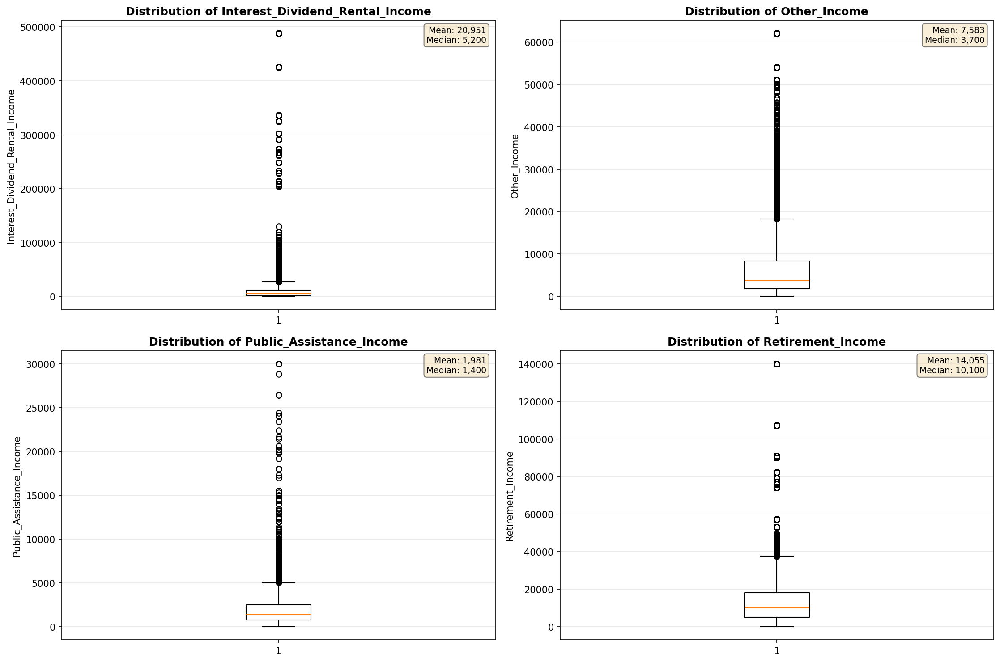

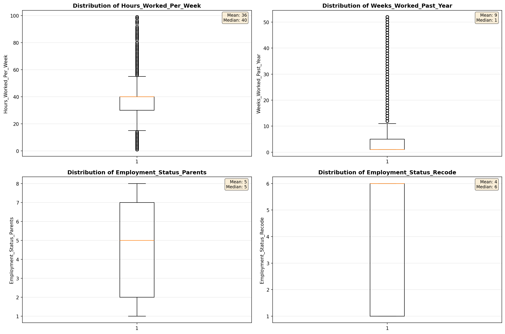

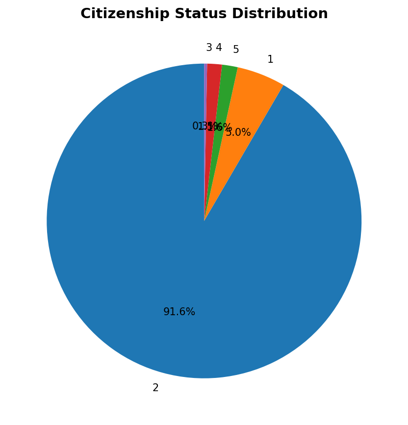

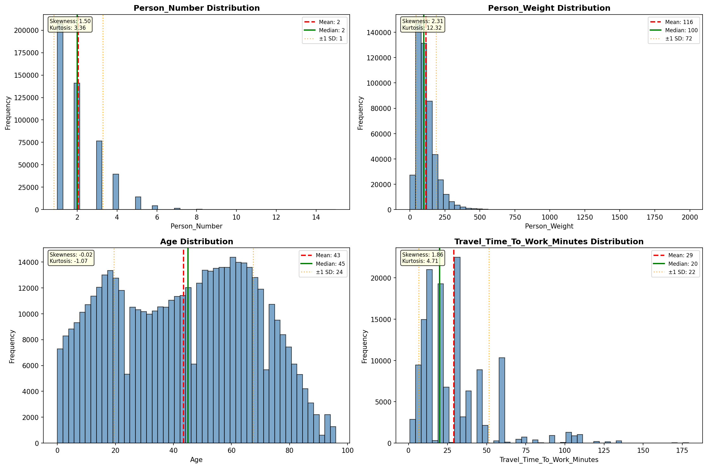

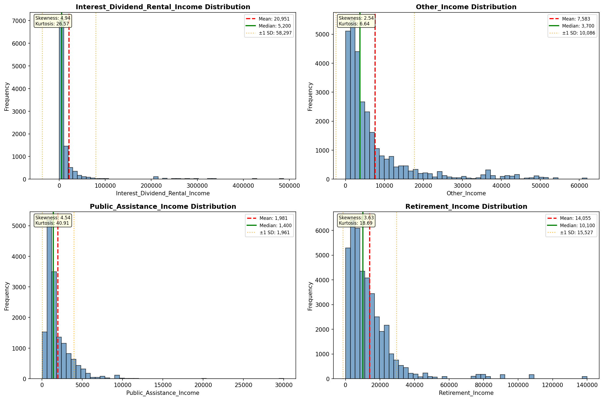

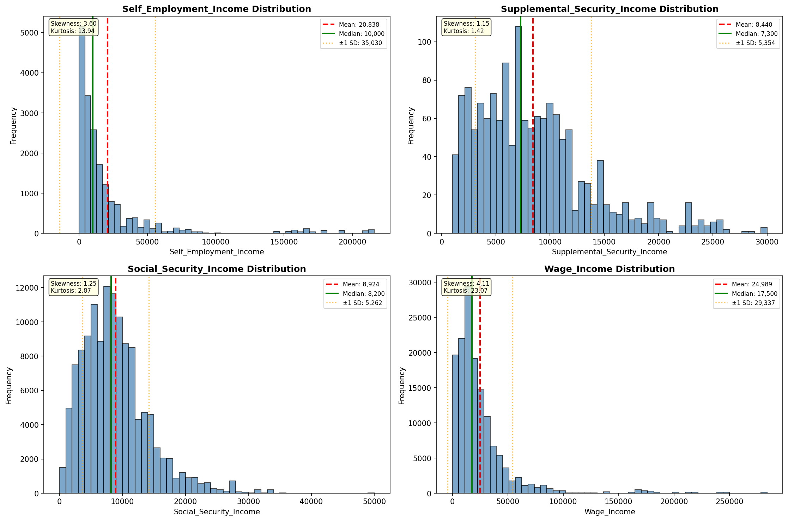

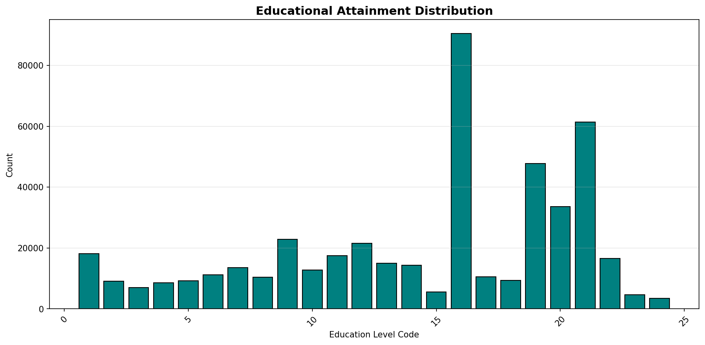

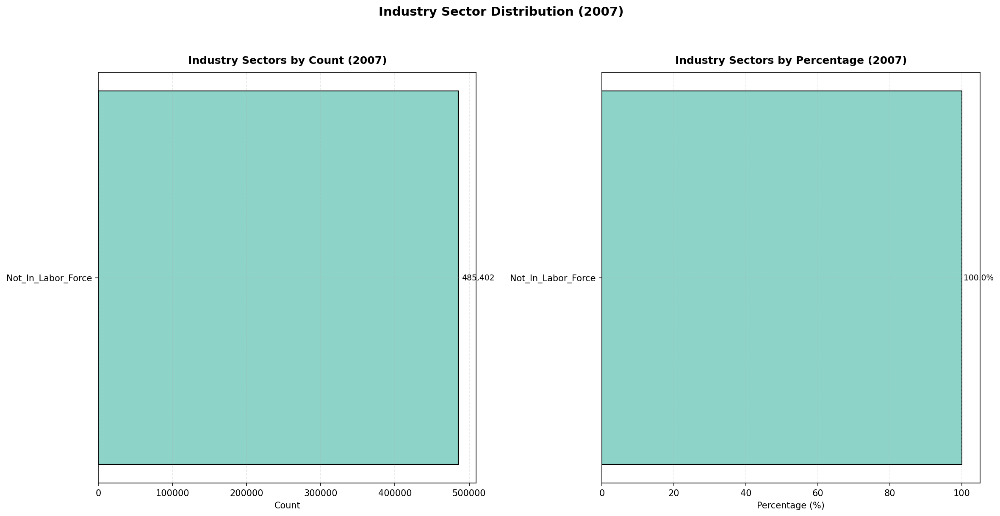

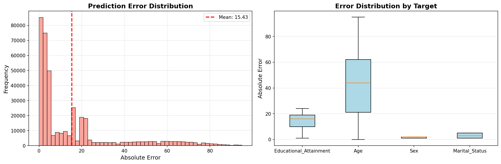

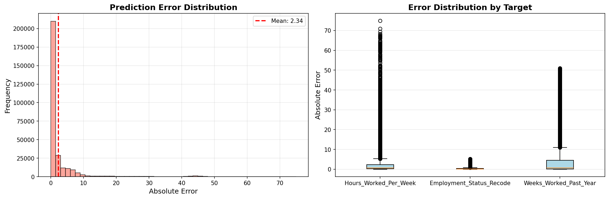

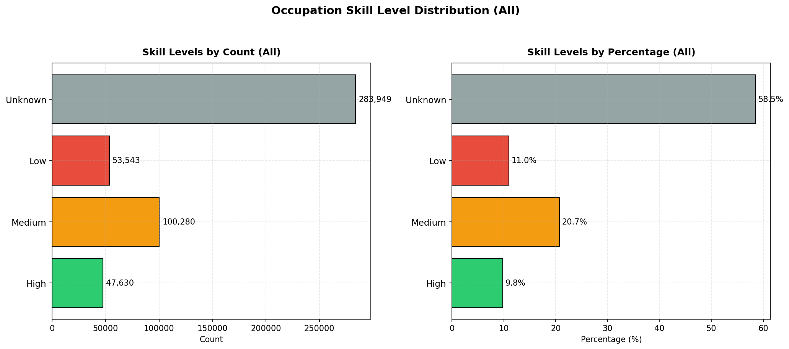

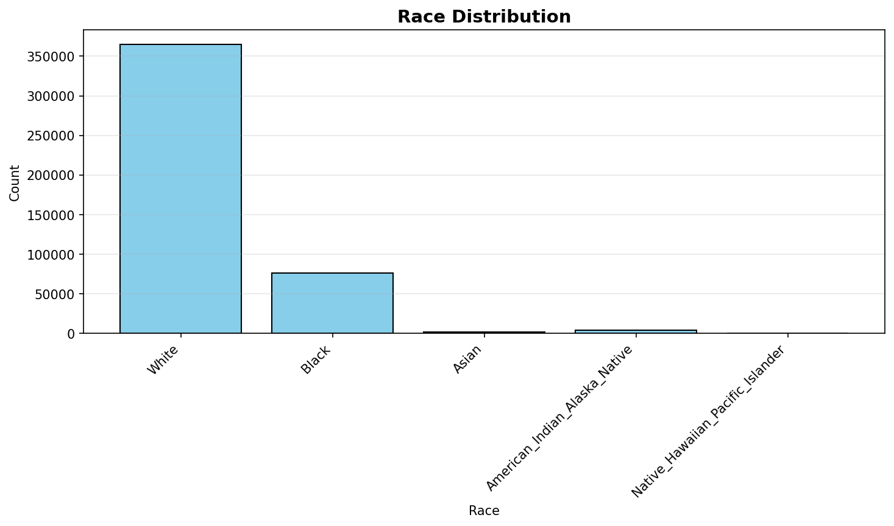

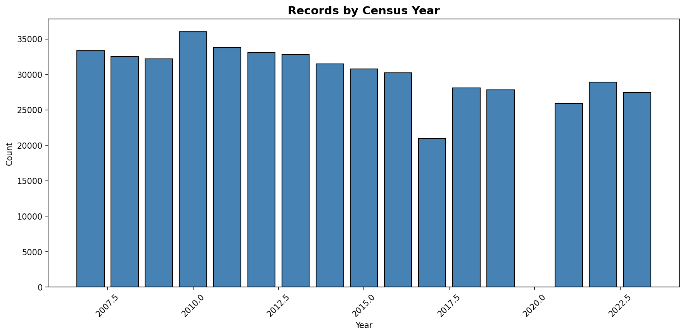
