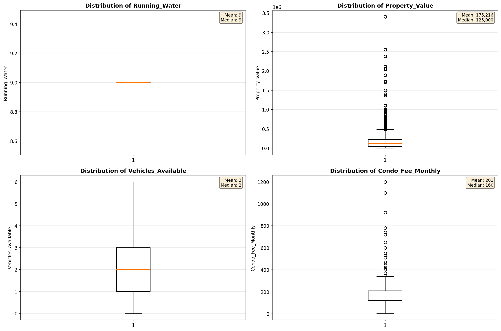

# Outlier Detection

> Statistical outlier detection using IQR (Interquartile Range) method. Outliers are values falling outside Q1 - 1.5×IQR or Q3 + 1.5×IQR bounds.

## Detection Methodology

| Parameter | Value | Description |
| :--- | :--- | :--- |
| Method | IQR | Outlier detection algorithm |
| Lower Bound | Q1 - 1.5 × IQR | Values below are outliers |
| Upper Bound | Q3 + 1.5 × IQR | Values above are outliers |
| IQR Definition | Q3 - Q1 | Interquartile Range |

> **Note**: The IQR method is robust to extreme values and works well for approximately symmetric distributions.

## Outlier Summary

_No outlier summary available._
## High Outlier Rate Variables

> Variables with outlier rate > 5% may indicate data quality issues, non-normal distributions, or genuinely extreme values.

- **('Flag_Selected_Monthly_Owner_Costs', 23.641714271582956)**: 0 outliers (0.00%)

- **('Specified_Rent_Unit', 22.554841242577417)**: 0 outliers (0.00%)

- **('Flag_Family_Income', 18.364240540250833)**: 0 outliers (0.00%)

- **('Property_Tax_Rate', 18.074876751110462)**: 0 outliers (0.00%)

- **('Fuel_Cost_Monthly', 17.82377198935115)**: 0 outliers (0.00%)

- **('Flag_Property_Taxes', 10.23385652586116)**: 0 outliers (0.00%)

- **('Gross_Rent_Percentage_Income', 9.772707925427769)**: 0 outliers (0.00%)

- **('Structure_Age', 9.617451309413827)**: 0 outliers (0.00%)

- **('Income_Adjustment_Factor', 9.54683898584129)**: 0 outliers (0.00%)

- **('Property_Taxes_Yearly', 9.189934052954493)**: 0 outliers (0.00%)

- **('Structure_Age_Score', 7.867795395840796)**: 0 outliers (0.00%)

- **('Flag_Property_Value', 7.544453714154847)**: 0 outliers (0.00%)

- **('Flag_Water_Cost', 7.189072609633357)**: 0 outliers (0.00%)

- **('Owner_Costs_Percentage_Income', 6.797106374714764)**: 0 outliers (0.00%)

- **('Flag_Gross_Rent', 6.500033505327347)**: 0 outliers (0.00%)

> *Consider investigating these variables for data entry errors, applying transformations, or using robust statistical methods.*

## Visualizations

