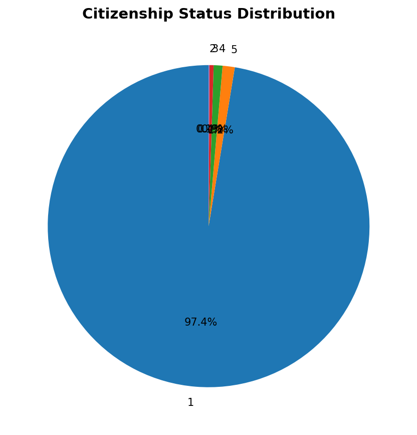
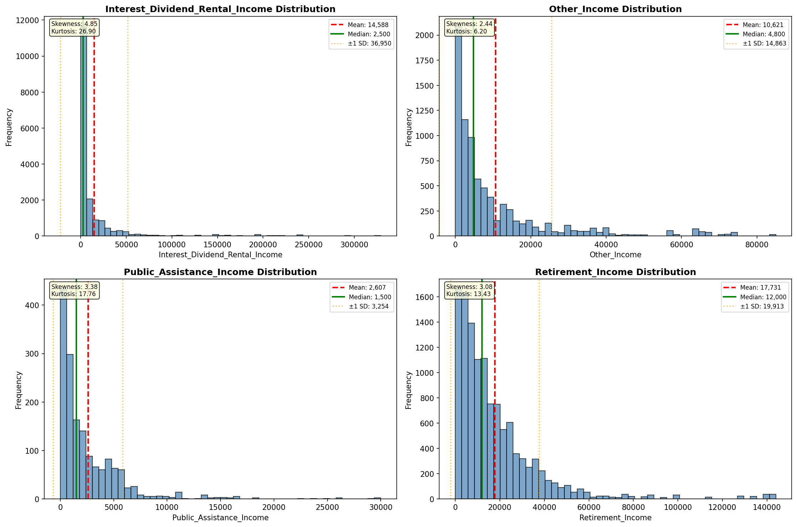
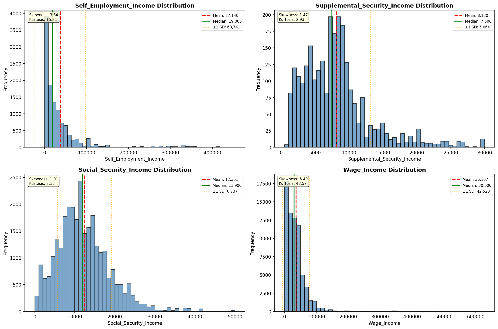
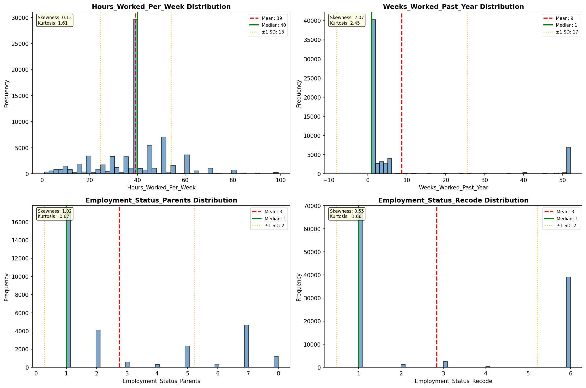
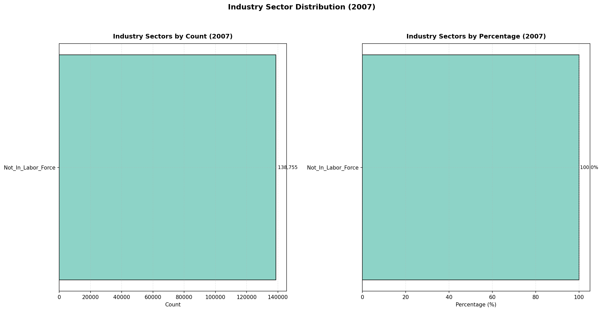
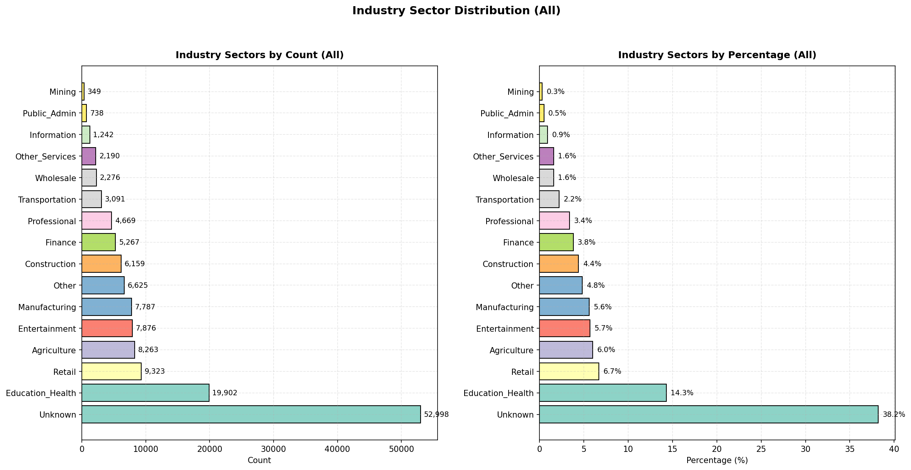
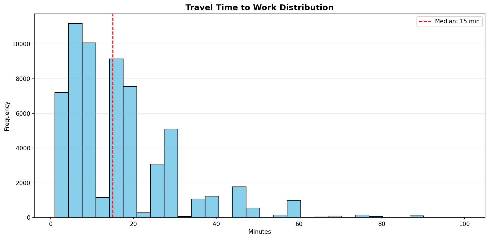
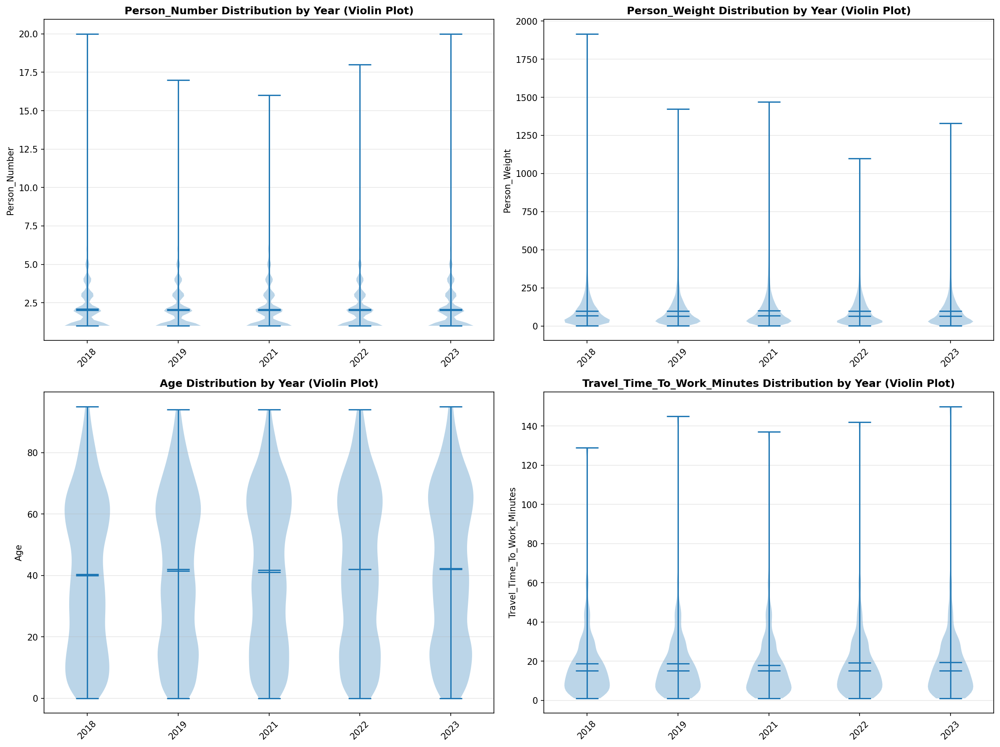
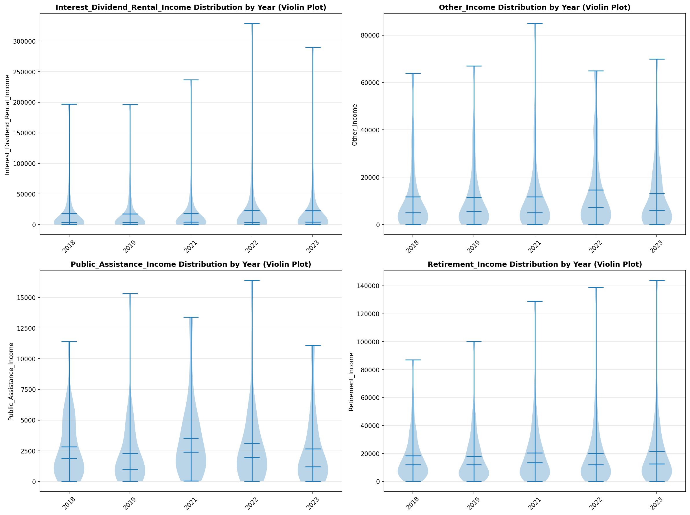
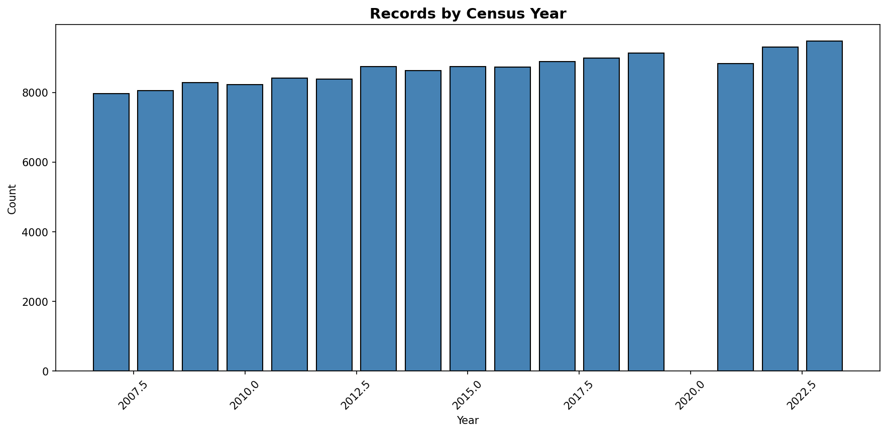

# Statistical Analysis

> Comprehensive descriptive statistics including central tendency, dispersion, distribution characteristics, and weighted statistics using ACS sample weights.

## Summary Statistics

- **Variables Analyzed**: 30

### Income_Adjustment_Factor

| Statistic | Unweighted | Weighted (ACS) |
| :--- | :--- | :--- |
| Mean | 1,015,005.99 | 1,014,834.00 |
| Median | 1,011,189.00 | 1,014,834.00 |
| Std Deviation | 10,946.86 | — |
| Minimum | 1,001,264.00 | — |
| Maximum | 1,042,311.00 | — |
| Count | 105,772 | — |

> *Distribution is highly right-skewed (skewness: 1.33), light-tailed/platykurtic (kurtosis: 0.95).*

- **Coefficient of Variation**: 1.1 % (low variability)

### Age

| Statistic | Unweighted | Weighted (ACS) |
| :--- | :--- | :--- |
| Mean | 40.81 | 38.13 |
| Median | 41.00 | 36.81 |
| Std Deviation | 24.69 | — |
| Minimum | 0.00 | — |
| Maximum | 95.00 | — |
| Count | 138,755 | — |

> *Distribution is approximately symmetric (skewness: 0.09), light-tailed/platykurtic (kurtosis: -1.08).*

- **Coefficient of Variation**: 60.5 % (high variability)

### Interest_Dividend_Rental_Income

| Statistic | Unweighted | Weighted (ACS) |
| :--- | :--- | :--- |
| Mean | 14,587.93 | 14,722.81 |
| Median | 2,500.00 | 2,643.75 |
| Std Deviation | 36,949.98 | — |
| Minimum | 1.00 | — |
| Maximum | 329,000.00 | — |
| Count | 17,680 | — |

> *Distribution is highly right-skewed (skewness: 4.85), heavy-tailed/leptokurtic (kurtosis: 26.90).*

- **Coefficient of Variation**: 253.3 % (very high variability)

### Other_Income

| Statistic | Unweighted | Weighted (ACS) |
| :--- | :--- | :--- |
| Mean | 10,620.96 | 10,147.72 |
| Median | 4,800.00 | 4,943.75 |
| Std Deviation | 14,862.69 | — |
| Minimum | 4.00 | — |
| Maximum | 85,000.00 | — |
| Count | 8,010 | — |

> *Distribution is highly right-skewed (skewness: 2.44), heavy-tailed/leptokurtic (kurtosis: 6.19).*

- **Coefficient of Variation**: 139.9 % (very high variability)

### Public_Assistance_Income

| Statistic | Unweighted | Weighted (ACS) |
| :--- | :--- | :--- |
| Mean | 2,607.09 | 2,426.31 |
| Median | 1,500.00 | 1,395.00 |
| Std Deviation | 3,254.43 | — |
| Minimum | 10.00 | — |
| Maximum | 30,000.00 | — |
| Count | 1,582 | — |

> *Distribution is highly right-skewed (skewness: 3.38), heavy-tailed/leptokurtic (kurtosis: 17.70).*

- **Coefficient of Variation**: 124.8 % (very high variability)

### Retirement_Income

| Statistic | Unweighted | Weighted (ACS) |
| :--- | :--- | :--- |
| Mean | 17,730.77 | 18,317.25 |
| Median | 12,000.00 | 12,512.50 |
| Std Deviation | 19,912.62 | — |
| Minimum | 4.00 | — |
| Maximum | 144,000.00 | — |
| Count | 12,060 | — |

> *Distribution is highly right-skewed (skewness: 3.08), heavy-tailed/leptokurtic (kurtosis: 13.42).*

- **Coefficient of Variation**: 112.3 % (very high variability)

### Self_Employment_Income

| Statistic | Unweighted | Weighted (ACS) |
| :--- | :--- | :--- |
| Mean | 37,140.43 | 36,393.50 |
| Median | 19,000.00 | 17,150.00 |
| Std Deviation | 60,741.29 | — |
| Minimum | 1.00 | — |
| Maximum | 454,000.00 | — |
| Count | 11,599 | — |

> *Distribution is highly right-skewed (skewness: 3.64), heavy-tailed/leptokurtic (kurtosis: 15.20).*

- **Coefficient of Variation**: 163.5 % (very high variability)

### Supplemental_Security_Income

| Statistic | Unweighted | Weighted (ACS) |
| :--- | :--- | :--- |
| Mean | 8,120.38 | 8,023.37 |
| Median | 7,500.00 | 7,806.25 |
| Std Deviation | 5,064.13 | — |
| Minimum | 500.00 | — |
| Maximum | 30,000.00 | — |
| Count | 2,620 | — |

> *Distribution is highly right-skewed (skewness: 1.47), light-tailed/platykurtic (kurtosis: 2.92).*

- **Coefficient of Variation**: 62.4 % (high variability)

### Social_Security_Income

| Statistic | Unweighted | Weighted (ACS) |
| :--- | :--- | :--- |
| Mean | 12,351.10 | 12,448.71 |
| Median | 11,900.00 | 11,912.50 |
| Std Deviation | 6,737.04 | — |
| Minimum | 4.00 | — |
| Maximum | 50,000.00 | — |
| Count | 28,754 | — |

> *Distribution is highly right-skewed (skewness: 1.01), light-tailed/platykurtic (kurtosis: 2.18).*

- **Coefficient of Variation**: 54.5 % (high variability)

### Wage_Income

| Statistic | Unweighted | Weighted (ACS) |
| :--- | :--- | :--- |
| Mean | 36,167.41 | 37,248.52 |
| Median | 30,000.00 | 29,412.50 |
| Std Deviation | 42,528.39 | — |
| Minimum | 4.00 | — |
| Maximum | 628,000.00 | — |
| Count | 69,626 | — |

> *Distribution is highly right-skewed (skewness: 5.49), heavy-tailed/leptokurtic (kurtosis: 48.57).*

- **Coefficient of Variation**: 117.6 % (very high variability)

### Hours_Worked_Per_Week

| Statistic | Unweighted | Weighted (ACS) |
| :--- | :--- | :--- |
| Mean | 39.28 | 39.07 |
| Median | 40.00 | 40.00 |
| Std Deviation | 14.74 | — |
| Minimum | 1.00 | — |
| Maximum | 99.00 | — |
| Count | 77,179 | — |

> *Distribution is approximately symmetric (skewness: 0.13), light-tailed/platykurtic (kurtosis: 1.61).*

- **Coefficient of Variation**: 37.5 % (moderate variability)

### Presence_And_Age_Own_Children

| Statistic | Unweighted | Weighted (ACS) |
| :--- | :--- | :--- |
| Mean | 3.48 | 3.44 |
| Median | 4.00 | 4.00 |
| Std Deviation | 0.95 | — |
| Minimum | 1.00 | — |
| Maximum | 4.00 | — |
| Count | 52,053 | — |

> *Distribution is highly left-skewed (skewness: -1.51), light-tailed/platykurtic (kurtosis: 0.76).*

- **Coefficient of Variation**: 27.2 % (moderate variability)

### Total_Person_Earnings

| Statistic | Unweighted | Weighted (ACS) |
| :--- | :--- | :--- |
| Mean | 38,310.49 | 38,945.40 |
| Median | 30,000.00 | 29,618.75 |
| Std Deviation | 48,003.36 | — |
| Minimum | 1.00 | — |
| Maximum | 765,000.00 | — |
| Count | 76,917 | — |

> *Distribution is highly right-skewed (skewness: 5.27), heavy-tailed/leptokurtic (kurtosis: 42.41).*

- **Coefficient of Variation**: 125.3 % (very high variability)

### Total_Person_Income

| Statistic | Unweighted | Weighted (ACS) |
| :--- | :--- | :--- |
| Mean | 37,600.43 | 38,495.76 |
| Median | 27,000.00 | 28,280.62 |
| Std Deviation | 47,661.73 | — |
| Minimum | 1.00 | — |
| Maximum | 816,800.00 | — |
| Count | 103,264 | — |

> *Distribution is highly right-skewed (skewness: 5.21), heavy-tailed/leptokurtic (kurtosis: 41.94).*

- **Coefficient of Variation**: 126.8 % (very high variability)

### Poverty_Status

| Statistic | Unweighted | Weighted (ACS) |
| :--- | :--- | :--- |
| Mean | 302.89 | 300.50 |
| Median | 304.00 | 301.12 |
| Std Deviation | 156.58 | — |
| Minimum | 0.00 | — |
| Maximum | 501.00 | — |
| Count | 131,651 | — |

> *Distribution is approximately symmetric (skewness: -0.17), light-tailed/platykurtic (kurtosis: -1.23).*

- **Coefficient of Variation**: 51.7 % (high variability)

### Flag_Age

| Statistic | Unweighted | Weighted (ACS) |
| :--- | :--- | :--- |
| Mean | 0.01 | 0.01 |
| Median | 0.00 | 0.00 |
| Std Deviation | 0.10 | — |
| Minimum | 0.00 | — |
| Maximum | 1.00 | — |
| Count | 138,755 | — |

> *Distribution is highly right-skewed (skewness: 9.78), heavy-tailed/leptokurtic (kurtosis: 93.70).*

- **Coefficient of Variation**: 988.4 % (very high variability)

### Flag_Interest_Dividend_Income

| Statistic | Unweighted | Weighted (ACS) |
| :--- | :--- | :--- |
| Mean | 0.10 | 0.09 |
| Median | 0.00 | 0.00 |
| Std Deviation | 0.30 | — |
| Minimum | 0.00 | — |
| Maximum | 1.00 | — |
| Count | 138,755 | — |

> *Distribution is highly right-skewed (skewness: 2.62), heavy-tailed/leptokurtic (kurtosis: 4.85).*

- **Coefficient of Variation**: 295.6 % (very high variability)

### Flag_Other_Income

| Statistic | Unweighted | Weighted (ACS) |
| :--- | :--- | :--- |
| Mean | 0.08 | 0.08 |
| Median | 0.00 | 0.00 |
| Std Deviation | 0.27 | — |
| Minimum | 0.00 | — |
| Maximum | 1.00 | — |
| Count | 138,755 | — |

> *Distribution is highly right-skewed (skewness: 3.07), heavy-tailed/leptokurtic (kurtosis: 7.45).*

- **Coefficient of Variation**: 337.1 % (very high variability)

### Flag_Retirement_Income

| Statistic | Unweighted | Weighted (ACS) |
| :--- | :--- | :--- |
| Mean | 0.08 | 0.08 |
| Median | 0.00 | 0.00 |
| Std Deviation | 0.28 | — |
| Minimum | 0.00 | — |
| Maximum | 1.00 | — |
| Count | 138,755 | — |

> *Distribution is highly right-skewed (skewness: 2.99), heavy-tailed/leptokurtic (kurtosis: 6.95).*

- **Coefficient of Variation**: 329.4 % (very high variability)

### Flag_Self_Employment_Income

| Statistic | Unweighted | Weighted (ACS) |
| :--- | :--- | :--- |
| Mean | 0.07 | 0.06 |
| Median | 0.00 | 0.00 |
| Std Deviation | 0.25 | — |
| Minimum | 0.00 | — |
| Maximum | 1.00 | — |
| Count | 138,755 | — |

> *Distribution is highly right-skewed (skewness: 3.41), heavy-tailed/leptokurtic (kurtosis: 9.61).*

- **Coefficient of Variation**: 368.0 % (very high variability)

### Flag_Social_Security_Income

| Statistic | Unweighted | Weighted (ACS) |
| :--- | :--- | :--- |
| Mean | 0.10 | 0.09 |
| Median | 0.00 | 0.00 |
| Std Deviation | 0.30 | — |
| Minimum | 0.00 | — |
| Maximum | 1.00 | — |
| Count | 138,755 | — |

> *Distribution is highly right-skewed (skewness: 2.73), heavy-tailed/leptokurtic (kurtosis: 5.44).*

- **Coefficient of Variation**: 305.5 % (very high variability)

### Flag_Supplemental_Security_Income

| Statistic | Unweighted | Weighted (ACS) |
| :--- | :--- | :--- |
| Mean | 0.08 | 0.07 |
| Median | 0.00 | 0.00 |
| Std Deviation | 0.27 | — |
| Minimum | 0.00 | — |
| Maximum | 1.00 | — |
| Count | 138,755 | — |

> *Distribution is highly right-skewed (skewness: 3.18), heavy-tailed/leptokurtic (kurtosis: 8.11).*

- **Coefficient of Variation**: 346.9 % (very high variability)

### Flag_Wage_Income

| Statistic | Unweighted | Weighted (ACS) |
| :--- | :--- | :--- |
| Mean | 0.11 | 0.11 |
| Median | 0.00 | 0.00 |
| Std Deviation | 0.31 | — |
| Minimum | 0.00 | — |
| Maximum | 1.00 | — |
| Count | 138,755 | — |

> *Distribution is highly right-skewed (skewness: 2.47), heavy-tailed/leptokurtic (kurtosis: 4.12).*

- **Coefficient of Variation**: 282.8 % (very high variability)

### Flag_Hours_Worked

| Statistic | Unweighted | Weighted (ACS) |
| :--- | :--- | :--- |
| Mean | 0.05 | 0.05 |
| Median | 0.00 | 0.00 |
| Std Deviation | 0.21 | — |
| Minimum | 0.00 | — |
| Maximum | 1.00 | — |
| Count | 138,755 | — |

> *Distribution is highly right-skewed (skewness: 4.22), heavy-tailed/leptokurtic (kurtosis: 15.78).*

- **Coefficient of Variation**: 444.1 % (very high variability)

### Income_Per_Hour

| Statistic | Unweighted | Weighted (ACS) |
| :--- | :--- | :--- |
| Mean | 22.47 | 22.10 |
| Median | 15.38 | 15.65 |
| Std Deviation | 44.48 | — |
| Minimum | 0.00 | — |
| Maximum | 3,250.00 | — |
| Count | 77,048 | — |

> *Distribution is highly right-skewed (skewness: 24.92), heavy-tailed/leptokurtic (kurtosis: 1172.67).*

- **Coefficient of Variation**: 197.9 % (very high variability)

### Income_Per_Week_Worked

| Statistic | Unweighted | Weighted (ACS) |
| :--- | :--- | :--- |
| Mean | 30,378.10 | 30,534.10 |
| Median | 21,000.00 | 23,011.69 |
| Std Deviation | 44,487.81 | — |
| Minimum | 0.08 | — |
| Maximum | 765,000.00 | — |
| Count | 62,262 | — |

> *Distribution is highly right-skewed (skewness: 4.88), heavy-tailed/leptokurtic (kurtosis: 37.41).*

- **Coefficient of Variation**: 146.4 % (very high variability)

### Total_Annual_Hours

| Statistic | Unweighted | Weighted (ACS) |
| :--- | :--- | :--- |
| Mean | 346.37 | 334.85 |
| Median | 48.00 | 354.92 |
| Std Deviation | 743.92 | — |
| Minimum | 1.00 | — |
| Maximum | 5,148.00 | — |
| Count | 62,370 | — |

> *Distribution is highly right-skewed (skewness: 2.62), heavy-tailed/leptokurtic (kurtosis: 6.25).*

- **Coefficient of Variation**: 214.8 % (very high variability)

### In_Poverty

| Statistic | Unweighted | Weighted (ACS) |
| :--- | :--- | :--- |
| Mean | 0.28 | 0.27 |
| Median | 0.00 | 0.00 |
| Std Deviation | 0.45 | — |
| Minimum | 0.00 | — |
| Maximum | 1.00 | — |
| Count | 138,755 | — |

> *Distribution is moderately right-skewed (skewness: 0.96), light-tailed/platykurtic (kurtosis: -1.09).*

- **Coefficient of Variation**: 158.6 % (very high variability)

### Poverty_Gap

| Statistic | Unweighted | Weighted (ACS) |
| :--- | :--- | :--- |
| Mean | 0.22 | 0.22 |
| Median | 0.00 | 0.00 |
| Std Deviation | 0.36 | — |
| Minimum | 0.00 | — |
| Maximum | 2.33 | — |
| Count | 111,898 | — |

> *Distribution is highly right-skewed (skewness: 1.31), light-tailed/platykurtic (kurtosis: 0.17).*

- **Coefficient of Variation**: 161.2 % (very high variability)

### Poverty_Severity

| Statistic | Unweighted | Weighted (ACS) |
| :--- | :--- | :--- |
| Mean | 0.17 | 0.17 |
| Median | 0.00 | 0.00 |
| Std Deviation | 0.33 | — |
| Minimum | 0.00 | — |
| Maximum | 5.44 | — |
| Count | 111,898 | — |

> *Distribution is highly right-skewed (skewness: 1.96), heavy-tailed/leptokurtic (kurtosis: 4.16).*

- **Coefficient of Variation**: 190.5 % (very high variability)

## Distribution Analysis

### Skewed Distributions

> Variables with skewness > |0.5| indicate non-normal distributions. Consider log transformations for highly skewed variables in modeling.

| Variable | Skewness | Direction | Severity |
| :--- | :--- | :--- | :--- |
| Income_Per_Hour | 24.920 | Right-skewed | High |
| Flag_Age | 9.783 | Right-skewed | High |
| Wage_Income | 5.490 | Right-skewed | High |
| Total_Person_Earnings | 5.272 | Right-skewed | High |
| Total_Person_Income | 5.207 | Right-skewed | High |
| Income_Per_Week_Worked | 4.883 | Right-skewed | High |
| Interest_Dividend_Rental_Income | 4.848 | Right-skewed | High |
| Flag_Hours_Worked | 4.216 | Right-skewed | High |
| Self_Employment_Income | 3.636 | Right-skewed | High |
| Flag_Self_Employment_Income | 3.408 | Right-skewed | High |
| Public_Assistance_Income | 3.377 | Right-skewed | High |
| Flag_Supplemental_Security_Income | 3.180 | Right-skewed | High |
| Retirement_Income | 3.076 | Right-skewed | High |
| Flag_Other_Income | 3.075 | Right-skewed | High |
| Flag_Retirement_Income | 2.991 | Right-skewed | High |
| Flag_Social_Security_Income | 2.728 | Right-skewed | High |
| Total_Annual_Hours | 2.623 | Right-skewed | High |
| Flag_Interest_Dividend_Income | 2.617 | Right-skewed | High |
| Flag_Wage_Income | 2.474 | Right-skewed | High |
| Other_Income | 2.443 | Right-skewed | High |

- **Total Skewed Variables**: 27

- **Right-skewed**: 26

- **Left-skewed**: 1

## Variance Analysis

### Coefficient of Variation Ranking

> CV (Coefficient of Variation) = (Std Dev / Mean) × 100%. Higher CV indicates greater relative variability.

| Variable | CV (%) | Std Dev | Mean | Variability |
| :--- | :--- | :--- | :--- | :--- |
| Flag_Age | 988.4% | 0.10 | 0.01 | Very High |
| Flag_Hours_Worked | 444.1% | 0.21 | 0.05 | Very High |
| Flag_Self_Employment_Income | 368.0% | 0.25 | 0.07 | Very High |
| Flag_Supplemental_Security_Income | 346.9% | 0.27 | 0.08 | Very High |
| Flag_Other_Income | 337.1% | 0.27 | 0.08 | Very High |
| Flag_Retirement_Income | 329.4% | 0.28 | 0.08 | Very High |
| Flag_Social_Security_Income | 305.5% | 0.30 | 0.10 | Very High |
| Flag_Interest_Dividend_Income | 295.6% | 0.30 | 0.10 | Very High |
| Flag_Wage_Income | 282.8% | 0.31 | 0.11 | Very High |
| Interest_Dividend_Rental_Income | 253.3% | 36,949.98 | 14,587.93 | Very High |
| Total_Annual_Hours | 214.8% | 743.92 | 346.37 | Very High |
| Income_Per_Hour | 197.9% | 44.48 | 22.47 | Very High |
| Poverty_Severity | 190.5% | 0.33 | 0.17 | Very High |
| Self_Employment_Income | 163.5% | 60,741.29 | 37,140.43 | Very High |
| Poverty_Gap | 161.2% | 0.36 | 0.22 | Very High |
| In_Poverty | 158.6% | 0.45 | 0.28 | Very High |
| Income_Per_Week_Worked | 146.4% | 44,487.81 | 30,378.10 | Very High |
| Other_Income | 139.9% | 14,862.69 | 10,620.96 | Very High |
| Total_Person_Income | 126.8% | 47,661.73 | 37,600.43 | Very High |
| Total_Person_Earnings | 125.3% | 48,003.36 | 38,310.49 | Very High |

- **Average CV**: 207.5 %

- **High Variance Variables (CV > 50%)**: 27

## Visualizations

