# Deep Learning Models

> Neural network analysis using TensorFlow/Keras for complex pattern recognition and multi-output prediction tasks.

## Deep Learning Summary

- **Total Tasks**: 3

- **Tasks**: Income Prediction, Employment Analysis, Demographic Profile

### Aggregate Statistics

| Metric | Value |
| :--- | :--- |
| Total Parameters | 57,930 |
| Average Validation Loss | 425529491.0456 |
| Number of Tasks | 3 |

## Task: Income Prediction

### Model Configuration

| Property | Value |
| :--- | :--- |
| Model Type | PopulationIncomeModel |
| Task Type | Multi_Output |
| Target Variables | Total_Person_Income, Wage_Income, Total_Person_Earnings |
| Number of Targets | 3 |
| Input Features | 10 |

### Network Architecture

| Component | Value | Notes |
| :--- | :--- | :--- |
| Total Layers | 7 | Including input and output |
| Total Parameters | 37,123 | Trainable weights |
| Parameters per Layer | 5,303 | Average |

### Performance Metrics

| Metric | Value | Assessment |
| :--- | :--- | :--- |
| Training Loss | 1273279488.0000 | Final epoch |
| Validation Loss | 1276587776.0000 | Final epoch |
| Loss Gap | 3308288.0000 | HIGH overfitting risk |

> *Model may be overfitting significantly*

#### Test Set Metrics

| Metric | Value | Description |
| :--- | :--- | :--- |
| MAE | 17323.6172 | Mean Absolute Error (lower is better) |
| MSE | 1331583488.0000 | Mean Squared Error (lower is better) |
| RMSE | 36490.8686 | Root Mean Squared Error (lower is better) |
| R2 | 0.1544 | R-squared (higher is better) |

### Training Analysis

| Training Statistic | Value |
| :--- | :--- |
| Epochs Trained | 75 |
| Initial Training Loss | 2080891136.0000 |
| Final Training Loss | 1273279488.0000 |
| Loss Improvement | 38.8% |
| Initial Validation Loss | 1944772224.0000 |
| Final Validation Loss | 1276587776.0000 |
| Validation Improvement | 34.4% |

#### Convergence Assessment

- **Status**: Fully converged (< 1% change in last 10 epochs)

- **Last 10 epochs change**: 0.47%

## Task: Employment Analysis

### Model Configuration

| Property | Value |
| :--- | :--- |
| Model Type | PopulationEmploymentModel |
| Task Type | Multi_Output |
| Target Variables | Hours_Worked_Per_Week, Employment_Status_Recode, Weeks_Worked_Past_Year |
| Number of Targets | 3 |
| Input Features | 10 |

### Network Architecture

| Component | Value | Notes |
| :--- | :--- | :--- |
| Total Layers | 6 | Including input and output |
| Total Parameters | 10,371 | Trainable weights |
| Parameters per Layer | 1,728 | Average |

### Performance Metrics

| Metric | Value | Assessment |
| :--- | :--- | :--- |
| Training Loss | 79.8832 | Final epoch |
| Validation Loss | 77.2574 | Final epoch |
| Loss Gap | -2.6258 | NONE overfitting risk |

> *Good generalization*

#### Test Set Metrics

| Metric | Value | Description |
| :--- | :--- | :--- |
| MAE | 4.0388 | Mean Absolute Error (lower is better) |
| MSE | 78.4473 | Mean Squared Error (lower is better) |
| RMSE | 8.8570 | Root Mean Squared Error (lower is better) |
| R2 | 0.3018 | R-squared (higher is better) |

### Training Analysis

| Training Statistic | Value |
| :--- | :--- |
| Epochs Trained | 75 |
| Initial Training Loss | 185.5845 |
| Final Training Loss | 79.8832 |
| Loss Improvement | 57.0% |
| Initial Validation Loss | 94.1894 |
| Final Validation Loss | 77.2574 |
| Validation Improvement | 18.0% |

#### Convergence Assessment

- **Status**: Fully converged (< 1% change in last 10 epochs)

- **Last 10 epochs change**: 0.18%

## Task: Demographic Profile

### Model Configuration

| Property | Value |
| :--- | :--- |
| Model Type | PopulationDemographicModel |
| Task Type | Multi_Output |
| Target Variables | Educational_Attainment, Age, Sex, Marital_Status |
| Number of Targets | 4 |
| Input Features | 10 |

### Network Architecture

| Component | Value | Notes |
| :--- | :--- | :--- |
| Total Layers | 7 | Including input and output |
| Total Parameters | 10,436 | Trainable weights |
| Parameters per Layer | 1,490 | Average |

### Performance Metrics

| Metric | Value | Assessment |
| :--- | :--- | :--- |
| Training Loss | 617.5171 | Final epoch |
| Validation Loss | 619.8794 | Final epoch |
| Loss Gap | 2.3623 | HIGH overfitting risk |

> *Model may be overfitting significantly*

#### Test Set Metrics

| Metric | Value | Description |
| :--- | :--- | :--- |
| MAE | 14.8869 | Mean Absolute Error (lower is better) |
| MSE | 619.6888 | Mean Squared Error (lower is better) |
| RMSE | 24.8936 | Root Mean Squared Error (lower is better) |
| R2 | -5.3151 | R-squared (higher is better) |

### Training Analysis

| Training Statistic | Value |
| :--- | :--- |
| Epochs Trained | 75 |
| Initial Training Loss | 618.4454 |
| Final Training Loss | 617.5171 |
| Loss Improvement | 0.2% |
| Initial Validation Loss | 620.1760 |
| Final Validation Loss | 619.8794 |
| Validation Improvement | 0.0% |

#### Convergence Assessment

- **Status**: Fully converged (< 1% change in last 10 epochs)

- **Last 10 epochs change**: 0.00%

## Cross-Task Comparison

| Task | Model Type | Parameters | Train Loss | Val Loss | Gap |
| :--- | :--- | :--- | :--- | :--- | :--- |
| Income Prediction | PopulationIncomeModel | 37,123 | 1273279488.0000 | 1276587776.0000 | 3308288.0000 |
| Employment Analysis | PopulationEmploymentModel | 10,371 | 79.8832 | 77.2574 | -2.6258 |
| Demographic Profile | PopulationDemographicModel | 10,436 | 617.5171 | 619.8794 | 2.3623 |

## Visualizations

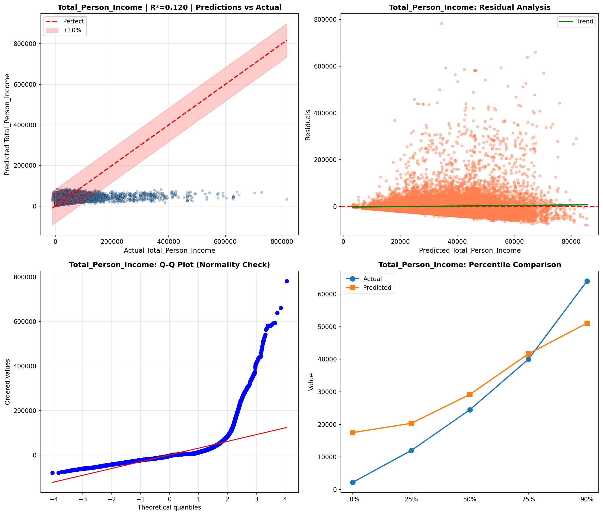

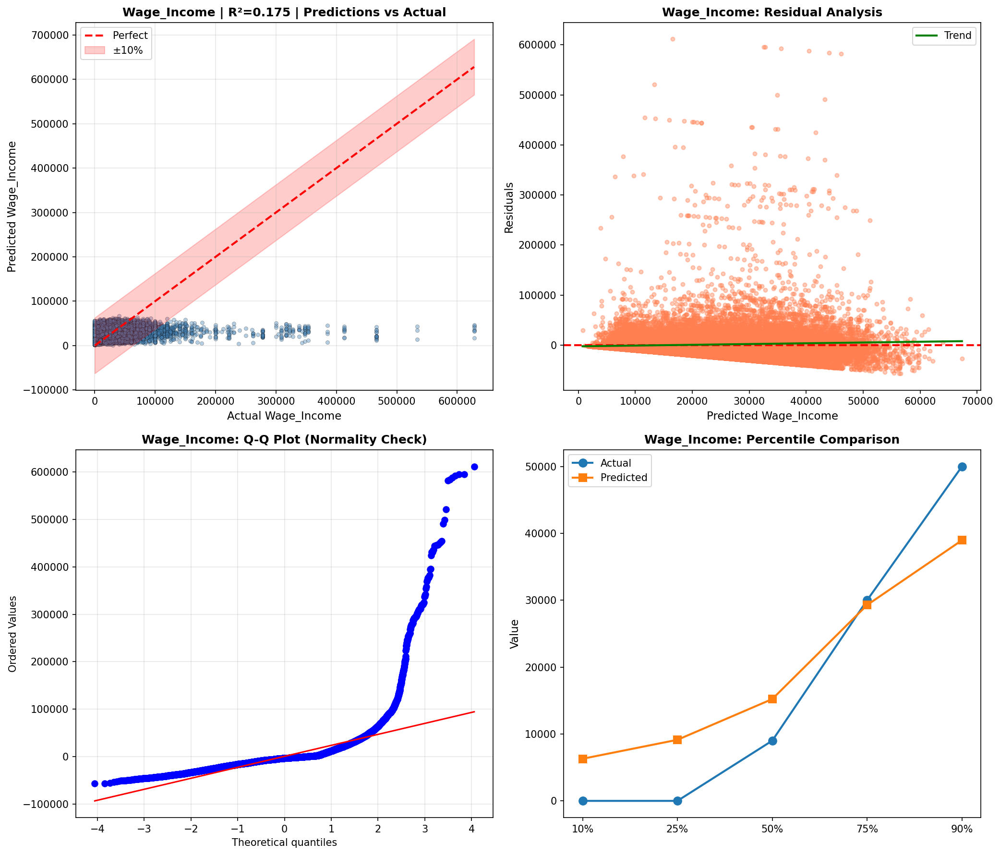

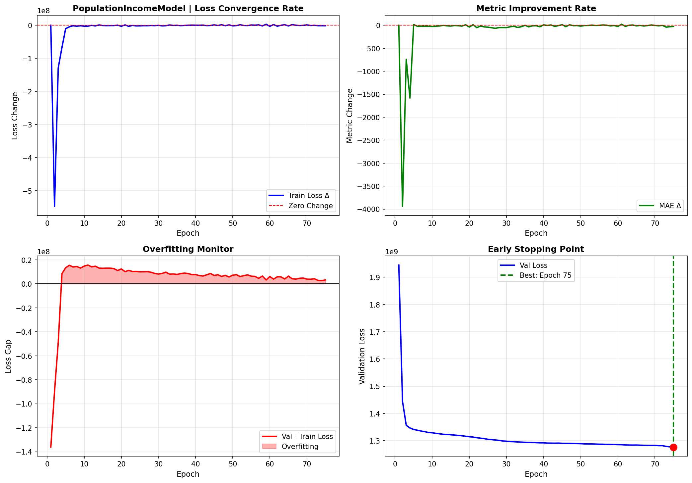

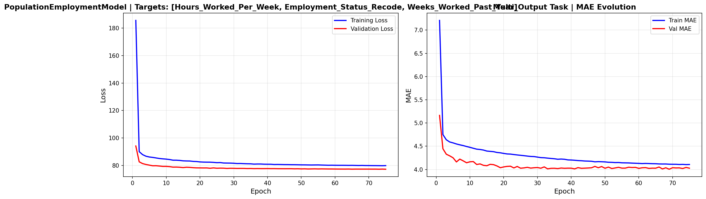

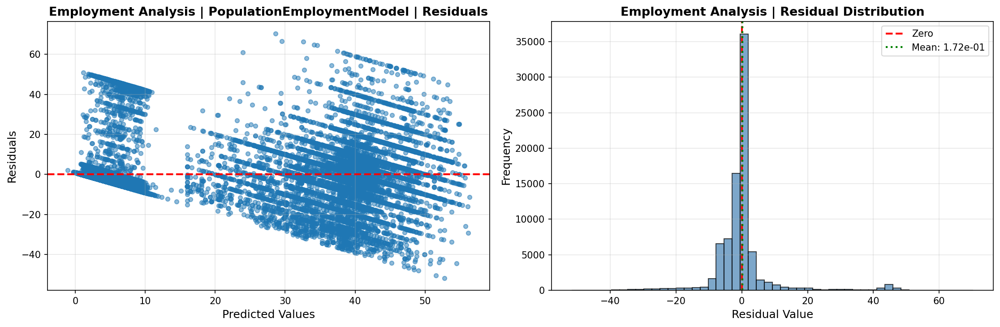

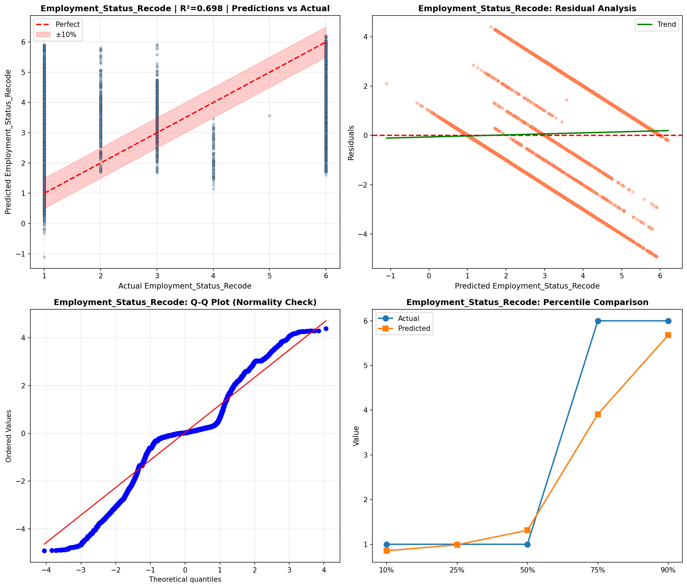

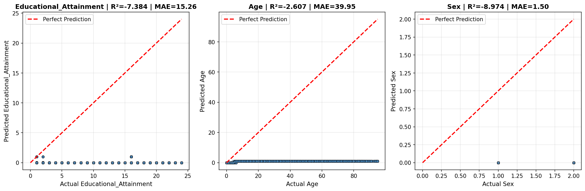

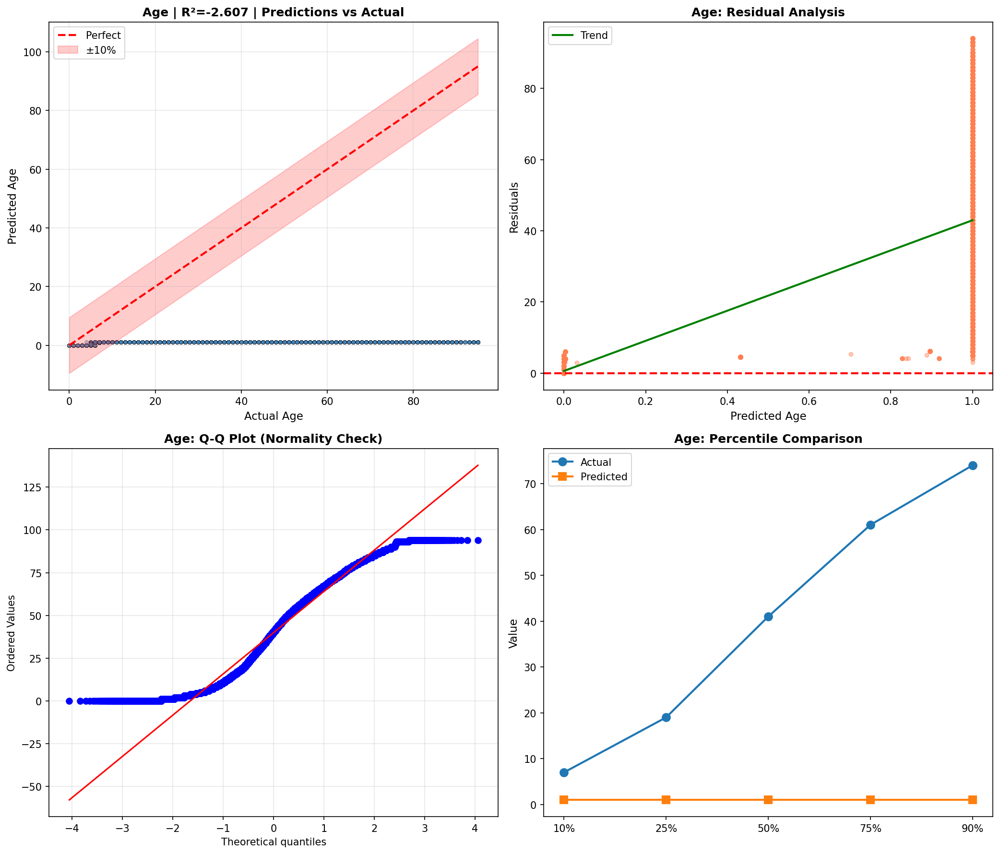

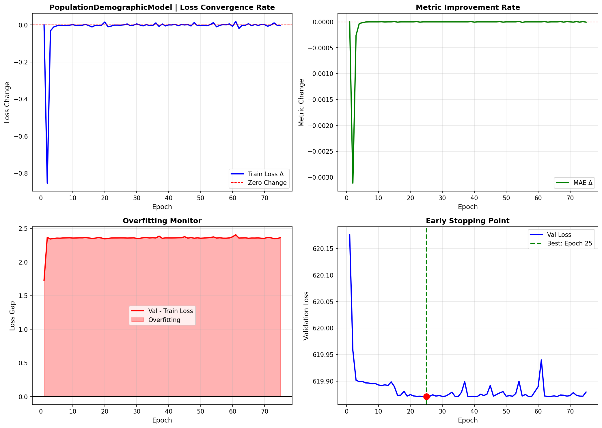

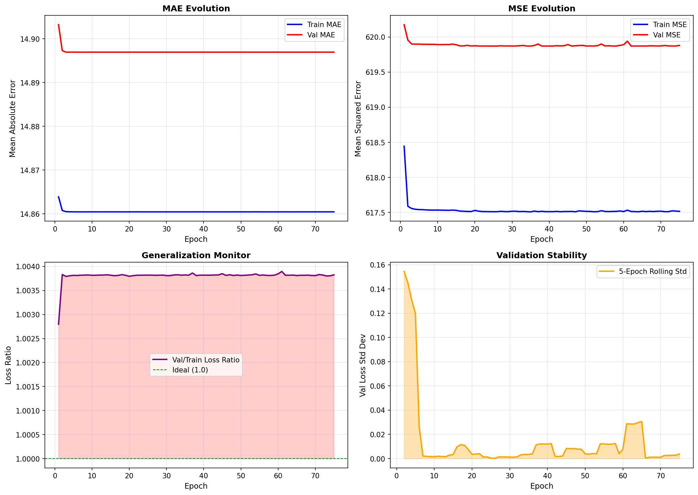

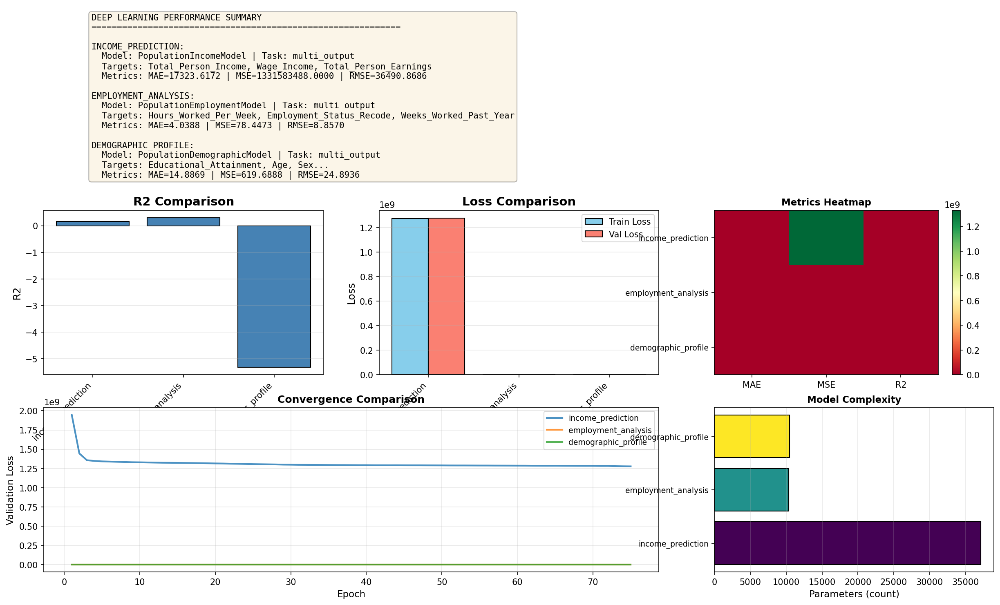

