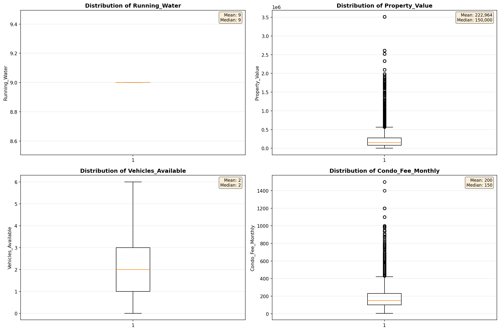
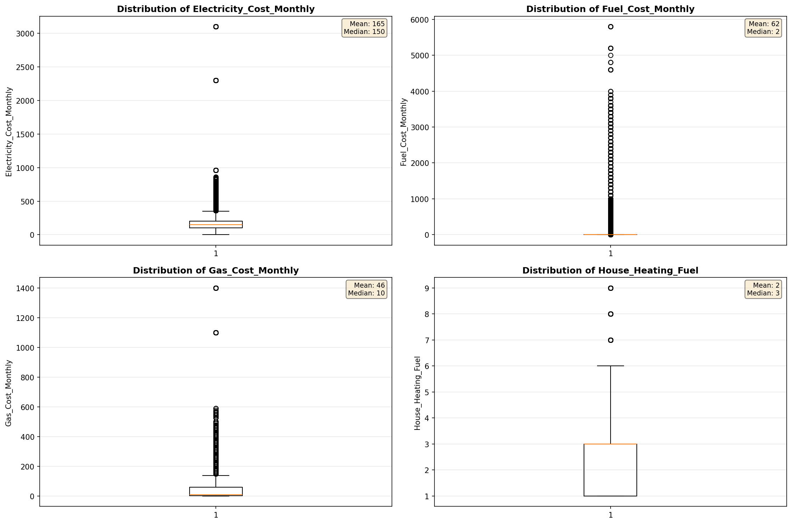
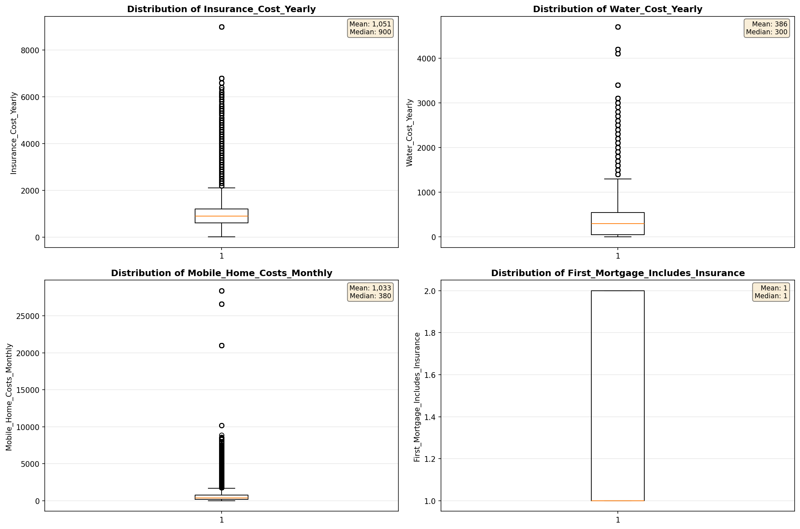
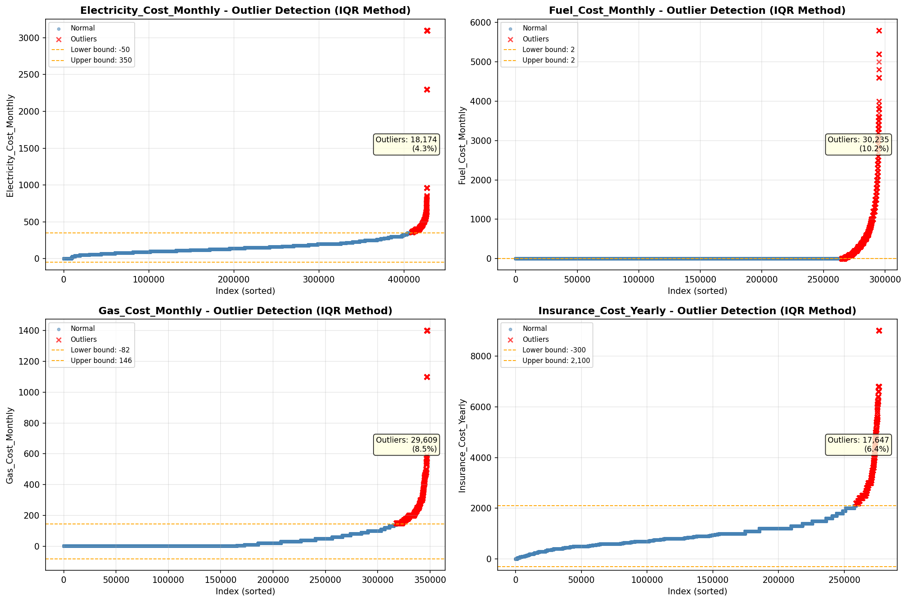
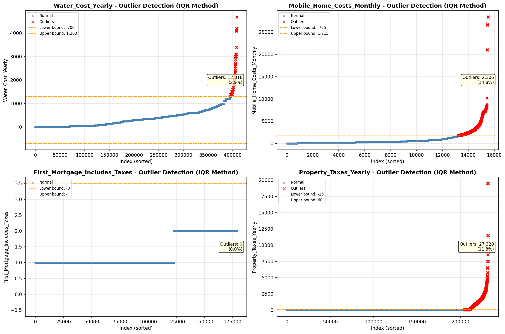

# Outlier Detection

> Statistical outlier detection using IQR (Interquartile Range) method. Outliers are values falling outside Q1 - 1.5×IQR or Q3 + 1.5×IQR bounds.

## Detection Methodology

| Parameter | Value | Description |
| :--- | :--- | :--- |
| Method | IQR | Outlier detection algorithm |
| Lower Bound | Q1 - 1.5 × IQR | Values below are outliers |
| Upper Bound | Q3 + 1.5 × IQR | Values above are outliers |
| IQR Definition | Q3 - Q1 | Interquartile Range |

> **Note**: The IQR method is robust to extreme values and works well for approximately symmetric distributions.

## Outlier Summary

_No outlier summary available._
## High Outlier Rate Variables

> Variables with outlier rate > 5% may indicate data quality issues, non-normal distributions, or genuinely extreme values.

- **('Flag_Selected_Monthly_Owner_Costs', 24.38384089985448)**: 0 outliers (0.00%)

- **('Flag_Family_Income', 20.8668363591412)**: 0 outliers (0.00%)

- **('Property_Tax_Rate', 17.614871207931998)**: 0 outliers (0.00%)

- **('Mobile_Home_Costs_Monthly', 14.843900869005472)**: 0 outliers (0.00%)

- **('Property_Taxes_Yearly', 11.774846995948625)**: 0 outliers (0.00%)

- **('Flag_Property_Taxes', 10.281480868133182)**: 0 outliers (0.00%)

- **('Fuel_Cost_Monthly', 10.240751654574892)**: 0 outliers (0.00%)

- **('Structure_Age', 9.962438087136714)**: 0 outliers (0.00%)

- **('Gross_Rent_Percentage_Income', 9.712611005469409)**: 0 outliers (0.00%)

- **('Income_Adjustment_Factor', 9.633272360322694)**: 0 outliers (0.00%)

- **('Flag_Water_Cost', 9.354071477749265)**: 0 outliers (0.00%)

- **('Gas_Cost_Monthly', 8.5264397672068)**: 0 outliers (0.00%)

- **('Flag_Gross_Rent', 8.072935845394722)**: 0 outliers (0.00%)

- **('Flag_Property_Value', 7.9050663558490415)**: 0 outliers (0.00%)

- **('Structure_Age_Score', 7.901602130569067)**: 0 outliers (0.00%)

> *Consider investigating these variables for data entry errors, applying transformations, or using robust statistical methods.*

## Visualizations

