# Statistical Analysis

> Comprehensive descriptive statistics including central tendency, dispersion, distribution characteristics, and weighted statistics using ACS sample weights.

## Summary Statistics

- **Variables Analyzed**: 41

### Income_Adjustment_Factor

| Statistic | Unweighted | Weighted (ACS) |
| :--- | :--- | :--- |
| Mean | 1,015,111.57 | 1,014,656.45 |
| Median | 1,010,207.00 | 1,014,656.45 |
| Std Deviation | 11,512.57 | — |
| Minimum | 1,001,264.00 | — |
| Maximum | 1,042,311.00 | — |
| Count | 1,328,907 | — |

> *Distribution is highly right-skewed (skewness: 1.28), light-tailed/platykurtic (kurtosis: 0.60).*

- **Coefficient of Variation**: 1.1 % (low variability)

### Property_Value

| Statistic | Unweighted | Weighted (ACS) |
| :--- | :--- | :--- |
| Mean | 237,353.66 | 226,824.73 |
| Median | 160,000.00 | 168,251.17 |
| Std Deviation | 338,070.70 | — |
| Minimum | 1.00 | — |
| Maximum | 3,874,000.00 | — |
| Count | 837,447 | — |

> *Distribution is highly right-skewed (skewness: 5.73), heavy-tailed/leptokurtic (kurtosis: 46.31).*

- **Coefficient of Variation**: 142.4 % (very high variability)

### Electricity_Cost_Monthly

| Statistic | Unweighted | Weighted (ACS) |
| :--- | :--- | :--- |
| Mean | 174.32 | 170.61 |
| Median | 150.00 | 149.38 |
| Std Deviation | 127.51 | — |
| Minimum | 1.00 | — |
| Maximum | 2,400.00 | — |
| Count | 1,529,856 | — |

> *Distribution is highly right-skewed (skewness: 5.20), heavy-tailed/leptokurtic (kurtosis: 73.66).*

- **Coefficient of Variation**: 73.1 % (high variability)

### Fuel_Cost_Monthly

| Statistic | Unweighted | Weighted (ACS) |
| :--- | :--- | :--- |
| Mean | 31.20 | 147.10 |
| Median | 2.00 | 74.50 |
| Std Deviation | 200.55 | — |
| Minimum | 1.00 | — |
| Maximum | 5,800.00 | — |
| Count | 1,038,017 | — |

> *Distribution is highly right-skewed (skewness: 11.88), heavy-tailed/leptokurtic (kurtosis: 182.47).*

- **Coefficient of Variation**: 642.8 % (very high variability)

### Gas_Cost_Monthly

| Statistic | Unweighted | Weighted (ACS) |
| :--- | :--- | :--- |
| Mean | 42.25 | 43.20 |
| Median | 30.00 | 18.88 |
| Std Deviation | 66.71 | — |
| Minimum | 1.00 | — |
| Maximum | 1,000.00 | — |
| Count | 1,286,427 | — |

> *Distribution is highly right-skewed (skewness: 6.07), heavy-tailed/leptokurtic (kurtosis: 66.48).*

- **Coefficient of Variation**: 157.9 % (very high variability)

### Insurance_Cost_Yearly

| Statistic | Unweighted | Weighted (ACS) |
| :--- | :--- | :--- |
| Mean | 1,519.10 | 1,472.63 |
| Median | 1,200.00 | 1,268.75 |
| Std Deviation | 1,178.27 | — |
| Minimum | 4.00 | — |
| Maximum | 10,000.00 | — |
| Count | 898,478 | — |

> *Distribution is highly right-skewed (skewness: 2.48), heavy-tailed/leptokurtic (kurtosis: 9.64).*

- **Coefficient of Variation**: 77.6 % (high variability)

### Water_Cost_Yearly

| Statistic | Unweighted | Weighted (ACS) |
| :--- | :--- | :--- |
| Mean | 569.96 | 566.34 |
| Median | 480.00 | 473.75 |
| Std Deviation | 606.04 | — |
| Minimum | 1.00 | — |
| Maximum | 5,200.00 | — |
| Count | 1,462,895 | — |

> *Distribution is highly right-skewed (skewness: 2.03), heavy-tailed/leptokurtic (kurtosis: 7.46).*

- **Coefficient of Variation**: 106.3 % (very high variability)

### Mobile_Home_Costs_Monthly

| Statistic | Unweighted | Weighted (ACS) |
| :--- | :--- | :--- |
| Mean | 1,789.03 | 1,889.05 |
| Median | 750.00 | 793.75 |
| Std Deviation | 3,318.01 | — |
| Minimum | 4.00 | — |
| Maximum | 37,800.00 | — |
| Count | 44,808 | — |

> *Distribution is highly right-skewed (skewness: 6.62), heavy-tailed/leptokurtic (kurtosis: 61.62).*

- **Coefficient of Variation**: 185.5 % (very high variability)

### First_Mortgage_Payment_Monthly

| Statistic | Unweighted | Weighted (ACS) |
| :--- | :--- | :--- |
| Mean | 1,011.86 | 1,119.57 |
| Median | 880.00 | 919.25 |
| Std Deviation | 898.05 | — |
| Minimum | 4.00 | — |
| Maximum | 6,400.00 | — |
| Count | 716,249 | — |

> *Distribution is highly right-skewed (skewness: 1.69), heavy-tailed/leptokurtic (kurtosis: 5.04).*

- **Coefficient of Variation**: 88.8 % (high variability)

### First_Mortgage_Includes_Taxes

| Statistic | Unweighted | Weighted (ACS) |
| :--- | :--- | :--- |
| Mean | 1.36 | 1.33 |
| Median | 1.00 | 1.00 |
| Std Deviation | 0.48 | — |
| Minimum | 1.00 | — |
| Maximum | 2.00 | — |
| Count | 584,393 | — |

> *Distribution is moderately right-skewed (skewness: 0.59), light-tailed/platykurtic (kurtosis: -1.65).*

- **Coefficient of Variation**: 35.3 % (moderate variability)

### Second_Mortgage_Payment_Monthly

| Statistic | Unweighted | Weighted (ACS) |
| :--- | :--- | :--- |
| Mean | 468.21 | 483.53 |
| Median | 320.00 | 347.50 |
| Std Deviation | 480.31 | — |
| Minimum | 4.00 | — |
| Maximum | 4,300.00 | — |
| Count | 48,629 | — |

> *Distribution is highly right-skewed (skewness: 3.42), heavy-tailed/leptokurtic (kurtosis: 15.97).*

- **Coefficient of Variation**: 102.6 % (very high variability)

### Property_Taxes_Yearly

| Statistic | Unweighted | Weighted (ACS) |
| :--- | :--- | :--- |
| Mean | 558.84 | 489.22 |
| Median | 37.00 | 369.33 |
| Std Deviation | 2,363.57 | — |
| Minimum | 1.00 | — |
| Maximum | 37,500.00 | — |
| Count | 786,627 | — |

> *Distribution is highly right-skewed (skewness: 7.98), heavy-tailed/leptokurtic (kurtosis: 91.43).*

- **Coefficient of Variation**: 422.9 % (very high variability)

### Meals_Included_in_Rent

| Statistic | Unweighted | Weighted (ACS) |
| :--- | :--- | :--- |
| Mean | 1.98 | 1.98 |
| Median | 2.00 | 2.00 |
| Std Deviation | 0.14 | — |
| Minimum | 1.00 | — |
| Maximum | 2.00 | — |
| Count | 472,289 | — |

> *Distribution is highly left-skewed (skewness: -6.93), heavy-tailed/leptokurtic (kurtosis: 46.08).*

- **Coefficient of Variation**: 7.0 % (low variability)

### Rent_Amount_Monthly

| Statistic | Unweighted | Weighted (ACS) |
| :--- | :--- | :--- |
| Mean | 871.95 | 874.89 |
| Median | 750.00 | 795.00 |
| Std Deviation | 532.54 | — |
| Minimum | 4.00 | — |
| Maximum | 4,600.00 | — |
| Count | 472,289 | — |

> *Distribution is highly right-skewed (skewness: 1.98), heavy-tailed/leptokurtic (kurtosis: 7.13).*

- **Coefficient of Variation**: 61.1 % (high variability)

### Gross_Rent

| Statistic | Unweighted | Weighted (ACS) |
| :--- | :--- | :--- |
| Mean | 1,041.54 | 1,039.66 |
| Median | 930.00 | 958.50 |
| Std Deviation | 561.12 | — |
| Minimum | 4.00 | — |
| Maximum | 8,167.00 | — |
| Count | 436,201 | — |

> *Distribution is highly right-skewed (skewness: 1.80), heavy-tailed/leptokurtic (kurtosis: 6.31).*

- **Coefficient of Variation**: 53.9 % (high variability)

### Gross_Rent_Percentage_Income

| Statistic | Unweighted | Weighted (ACS) |
| :--- | :--- | :--- |
| Mean | 37.93 | 38.06 |
| Median | 29.00 | 29.31 |
| Std Deviation | 26.58 | — |
| Minimum | 1.00 | — |
| Maximum | 101.00 | — |
| Count | 426,884 | — |

> *Distribution is highly right-skewed (skewness: 1.22), light-tailed/platykurtic (kurtosis: 0.48).*

- **Coefficient of Variation**: 70.1 % (high variability)

### Selected_Monthly_Owner_Costs

| Statistic | Unweighted | Weighted (ACS) |
| :--- | :--- | :--- |
| Mean | 1,238.92 | 1,282.04 |
| Median | 969.00 | 1,065.50 |
| Std Deviation | 1,053.23 | — |
| Minimum | 1.00 | — |
| Maximum | 15,950.00 | — |
| Count | 1,078,964 | — |

> *Distribution is highly right-skewed (skewness: 2.41), heavy-tailed/leptokurtic (kurtosis: 9.98).*

- **Coefficient of Variation**: 85.0 % (high variability)

### Owner_Costs_Percentage_Income

| Statistic | Unweighted | Weighted (ACS) |
| :--- | :--- | :--- |
| Mean | 22.50 | 23.39 |
| Median | 17.00 | 17.62 |
| Std Deviation | 20.30 | — |
| Minimum | 1.00 | — |
| Maximum | 101.00 | — |
| Count | 1,070,640 | — |

> *Distribution is highly right-skewed (skewness: 2.23), heavy-tailed/leptokurtic (kurtosis: 5.33).*

- **Coefficient of Variation**: 90.2 % (high variability)

### Family_Income

| Statistic | Unweighted | Weighted (ACS) |
| :--- | :--- | :--- |
| Mean | 96,736.07 | 91,119.04 |
| Median | 70,000.00 | 67,312.50 |
| Std Deviation | 99,730.19 | — |
| Minimum | 1.00 | — |
| Maximum | 1,984,900.00 | — |
| Count | 1,068,167 | — |

> *Distribution is highly right-skewed (skewness: 3.47), heavy-tailed/leptokurtic (kurtosis: 19.81).*

- **Coefficient of Variation**: 103.1 % (very high variability)

### Household_Income

| Statistic | Unweighted | Weighted (ACS) |
| :--- | :--- | :--- |
| Mean | 84,057.63 | 79,866.80 |
| Median | 59,000.00 | 56,926.25 |
| Std Deviation | 92,593.44 | — |
| Minimum | 1.00 | — |
| Maximum | 1,984,900.00 | — |
| Count | 1,528,892 | — |

> *Distribution is highly right-skewed (skewness: 3.66), heavy-tailed/leptokurtic (kurtosis: 22.32).*

- **Coefficient of Variation**: 110.2 % (very high variability)

### Specified_Rent_Unit

| Statistic | Unweighted | Weighted (ACS) |
| :--- | :--- | :--- |
| Mean | 0.30 | 0.37 |
| Median | 0.00 | 0.00 |
| Std Deviation | 0.46 | — |
| Minimum | 0.00 | — |
| Maximum | 1.00 | — |
| Count | 1,692,192 | — |

> *Distribution is moderately right-skewed (skewness: 0.90), light-tailed/platykurtic (kurtosis: -1.20).*

- **Coefficient of Variation**: 154.3 % (very high variability)

### Specified_Value_Unit

| Statistic | Unweighted | Weighted (ACS) |
| :--- | :--- | :--- |
| Mean | 0.56 | 0.50 |
| Median | 1.00 | 0.31 |
| Std Deviation | 0.50 | — |
| Minimum | 0.00 | — |
| Maximum | 1.00 | — |
| Count | 1,692,192 | — |

> *Distribution is approximately symmetric (skewness: -0.24), light-tailed/platykurtic (kurtosis: -1.94).*

- **Coefficient of Variation**: 88.8 % (high variability)

### Flag_Family_Income

| Statistic | Unweighted | Weighted (ACS) |
| :--- | :--- | :--- |
| Mean | 0.22 | 0.22 |
| Median | 0.00 | 0.00 |
| Std Deviation | 0.41 | — |
| Minimum | 0.00 | — |
| Maximum | 1.00 | — |
| Count | 1,304,678 | — |

> *Distribution is highly right-skewed (skewness: 1.34), light-tailed/platykurtic (kurtosis: -0.19).*

- **Coefficient of Variation**: 187.7 % (very high variability)

### Flag_Gross_Rent

| Statistic | Unweighted | Weighted (ACS) |
| :--- | :--- | :--- |
| Mean | 0.07 | 0.10 |
| Median | 0.00 | 0.00 |
| Std Deviation | 0.25 | — |
| Minimum | 0.00 | — |
| Maximum | 1.00 | — |
| Count | 875,881 | — |

> *Distribution is highly right-skewed (skewness: 3.51), heavy-tailed/leptokurtic (kurtosis: 10.31).*

- **Coefficient of Variation**: 377.3 % (very high variability)

### Flag_Household_Income

| Statistic | Unweighted | Weighted (ACS) |
| :--- | :--- | :--- |
| Mean | 0.31 | 0.30 |
| Median | 0.00 | 0.00 |
| Std Deviation | 0.46 | — |
| Minimum | 0.00 | — |
| Maximum | 1.00 | — |
| Count | 1,304,678 | — |

> *Distribution is moderately right-skewed (skewness: 0.84), light-tailed/platykurtic (kurtosis: -1.29).*

- **Coefficient of Variation**: 150.5 % (very high variability)

### Flag_First_Mortgage_Payment

| Statistic | Unweighted | Weighted (ACS) |
| :--- | :--- | :--- |
| Mean | 0.03 | 0.03 |
| Median | 0.00 | 0.00 |
| Std Deviation | 0.17 | — |
| Minimum | 0.00 | — |
| Maximum | 1.00 | — |
| Count | 1,692,192 | — |

> *Distribution is highly right-skewed (skewness: 5.44), heavy-tailed/leptokurtic (kurtosis: 27.65).*

- **Coefficient of Variation**: 562.3 % (very high variability)

### Flag_First_Mortgage_Taxes

| Statistic | Unweighted | Weighted (ACS) |
| :--- | :--- | :--- |
| Mean | 0.03 | 0.03 |
| Median | 0.00 | 0.00 |
| Std Deviation | 0.16 | — |
| Minimum | 0.00 | — |
| Maximum | 1.00 | — |
| Count | 1,692,192 | — |

> *Distribution is highly right-skewed (skewness: 5.82), heavy-tailed/leptokurtic (kurtosis: 31.93).*

- **Coefficient of Variation**: 599.2 % (very high variability)

### Flag_Meals_Included_Rent

| Statistic | Unweighted | Weighted (ACS) |
| :--- | :--- | :--- |
| Mean | 0.01 | 0.01 |
| Median | 0.00 | 0.00 |
| Std Deviation | 0.08 | — |
| Minimum | 0.00 | — |
| Maximum | 1.00 | — |
| Count | 1,692,192 | — |

> *Distribution is highly right-skewed (skewness: 11.74), heavy-tailed/leptokurtic (kurtosis: 135.87).*

- **Coefficient of Variation**: 1,182.6 % (very high variability)

### Flag_Rent_Amount

| Statistic | Unweighted | Weighted (ACS) |
| :--- | :--- | :--- |
| Mean | 0.02 | 0.03 |
| Median | 0.00 | 0.00 |
| Std Deviation | 0.14 | — |
| Minimum | 0.00 | — |
| Maximum | 1.00 | — |
| Count | 1,692,192 | — |

> *Distribution is highly right-skewed (skewness: 6.90), heavy-tailed/leptokurtic (kurtosis: 45.57).*

- **Coefficient of Variation**: 703.9 % (very high variability)

### Flag_Selected_Monthly_Owner_Costs

| Statistic | Unweighted | Weighted (ACS) |
| :--- | :--- | :--- |
| Mean | 0.20 | 0.20 |
| Median | 0.00 | 0.00 |
| Std Deviation | 0.40 | — |
| Minimum | 0.00 | — |
| Maximum | 1.00 | — |
| Count | 1,098,481 | — |

> *Distribution is highly right-skewed (skewness: 1.53), light-tailed/platykurtic (kurtosis: 0.33).*

- **Coefficient of Variation**: 202.2 % (very high variability)

### Flag_Second_Mortgage_Payment

| Statistic | Unweighted | Weighted (ACS) |
| :--- | :--- | :--- |
| Mean | 0.02 | 0.03 |
| Median | 0.00 | 0.00 |
| Std Deviation | 0.15 | — |
| Minimum | 0.00 | — |
| Maximum | 1.00 | — |
| Count | 1,692,192 | — |

> *Distribution is highly right-skewed (skewness: 6.30), heavy-tailed/leptokurtic (kurtosis: 37.69).*

- **Coefficient of Variation**: 645.5 % (very high variability)

### Flag_Property_Taxes

| Statistic | Unweighted | Weighted (ACS) |
| :--- | :--- | :--- |
| Mean | 0.10 | 0.10 |
| Median | 0.00 | 0.00 |
| Std Deviation | 0.30 | — |
| Minimum | 0.00 | — |
| Maximum | 1.00 | — |
| Count | 1,569,490 | — |

> *Distribution is highly right-skewed (skewness: 2.69), heavy-tailed/leptokurtic (kurtosis: 5.21).*

- **Coefficient of Variation**: 301.7 % (very high variability)

### Flag_Property_Value

| Statistic | Unweighted | Weighted (ACS) |
| :--- | :--- | :--- |
| Mean | 0.08 | 0.07 |
| Median | 0.00 | 0.00 |
| Std Deviation | 0.26 | — |
| Minimum | 0.00 | — |
| Maximum | 1.00 | — |
| Count | 1,692,192 | — |

> *Distribution is highly right-skewed (skewness: 3.21), heavy-tailed/leptokurtic (kurtosis: 8.30).*

- **Coefficient of Variation**: 349.6 % (very high variability)

### Flag_Water_Cost

| Statistic | Unweighted | Weighted (ACS) |
| :--- | :--- | :--- |
| Mean | 0.07 | 0.08 |
| Median | 0.00 | 0.00 |
| Std Deviation | 0.26 | — |
| Minimum | 0.00 | — |
| Maximum | 1.00 | — |
| Count | 122,702 | — |

> *Distribution is highly right-skewed (skewness: 3.26), heavy-tailed/leptokurtic (kurtosis: 8.62).*

- **Coefficient of Variation**: 354.1 % (very high variability)

### Annual_Rent_to_Value_Ratio

### Total_Monthly_Utility_Cost

| Statistic | Unweighted | Weighted (ACS) |
| :--- | :--- | :--- |
| Mean | 209.45 | 202.11 |
| Median | 182.00 | 176.62 |
| Std Deviation | 148.86 | — |
| Minimum | 2.00 | — |
| Maximum | 3,400.00 | — |
| Count | 1,532,735 | — |

> *Distribution is highly right-skewed (skewness: 5.21), heavy-tailed/leptokurtic (kurtosis: 72.56).*

- **Coefficient of Variation**: 71.1 % (high variability)

### Property_Tax_Rate

| Statistic | Unweighted | Weighted (ACS) |
| :--- | :--- | :--- |
| Mean | 27.77 | 30.24 |
| Median | 0.03 | 31.46 |
| Std Deviation | 83.44 | — |
| Minimum | 0.00 | — |
| Maximum | 1,300.00 | — |
| Count | 532,966 | — |

> *Distribution is highly right-skewed (skewness: 3.20), heavy-tailed/leptokurtic (kurtosis: 11.00).*

- **Coefficient of Variation**: 300.5 % (very high variability)

#### Weighted Statistics by Year

| Year | Weighted Mean | Weighted Median |
| :--- | :--- | :--- |
| 2007 | 240.06 | 250.00 |
| 2012 | 0.03 | 0.03 |
| 2013 | 0.04 | 0.03 |
| 2014 | 0.05 | 0.03 |
| 2015 | 0.03 | 0.02 |
| 2016 | 0.03 | 0.02 |
| 2017 | 0.03 | 0.02 |
| 2023 | 1.66 | 1.50 |

### Structure_Age

| Statistic | Unweighted | Weighted (ACS) |
| :--- | :--- | :--- |
| Mean | 1,852.31 | 1,876.21 |
| Median | 2,018.00 | 1,876.36 |
| Std Deviation | 547.58 | — |
| Minimum | 1.00 | — |
| Maximum | 2,023.00 | — |
| Count | 1,466,151 | — |

> *Distribution is highly left-skewed (skewness: -3.01), heavy-tailed/leptokurtic (kurtosis: 7.05).*

- **Coefficient of Variation**: 29.6 % (moderate variability)

### Structure_Age_Score

| Statistic | Unweighted | Weighted (ACS) |
| :--- | :--- | :--- |
| Mean | 0.05 | 0.04 |
| Median | 0.00 | 0.05 |
| Std Deviation | 0.18 | — |
| Minimum | 0.00 | — |
| Maximum | 0.99 | — |
| Count | 1,466,151 | — |

> *Distribution is highly right-skewed (skewness: 3.61), heavy-tailed/leptokurtic (kurtosis: 11.96).*

- **Coefficient of Variation**: 355.7 % (very high variability)

### Working_Age_Persons

| Statistic | Unweighted | Weighted (ACS) |
| :--- | :--- | :--- |
| Mean | 1.83 | 1.97 |
| Median | 2.00 | 2.00 |
| Std Deviation | 1.42 | — |
| Minimum | 0.00 | — |
| Maximum | 20.00 | — |
| Count | 1,548,335 | — |

> *Distribution is moderately right-skewed (skewness: 0.94), light-tailed/platykurtic (kurtosis: 2.10).*

- **Coefficient of Variation**: 77.6 % (high variability)

### Income_to_FPL_Ratio

| Statistic | Unweighted | Weighted (ACS) |
| :--- | :--- | :--- |
| Mean | 3.75 | 3.52 |
| Median | 2.65 | 2.54 |
| Std Deviation | 4.18 | — |
| Minimum | -1.17 | — |
| Maximum | 99.39 | — |
| Count | 1,548,335 | — |

> *Distribution is highly right-skewed (skewness: 3.97), heavy-tailed/leptokurtic (kurtosis: 26.49).*

- **Coefficient of Variation**: 111.5 % (very high variability)

## Distribution Analysis

### Skewed Distributions

> Variables with skewness > |0.5| indicate non-normal distributions. Consider log transformations for highly skewed variables in modeling.

| Variable | Skewness | Direction | Severity |
| :--- | :--- | :--- | :--- |
| Fuel_Cost_Monthly | 11.876 | Right-skewed | High |
| Flag_Meals_Included_Rent | 11.742 | Right-skewed | High |
| Property_Taxes_Yearly | 7.981 | Right-skewed | High |
| Meals_Included_in_Rent | -6.934 | Left-skewed | High |
| Flag_Rent_Amount | 6.897 | Right-skewed | High |
| Mobile_Home_Costs_Monthly | 6.620 | Right-skewed | High |
| Flag_Second_Mortgage_Payment | 6.300 | Right-skewed | High |
| Gas_Cost_Monthly | 6.074 | Right-skewed | High |
| Flag_First_Mortgage_Taxes | 5.825 | Right-skewed | High |
| Property_Value | 5.728 | Right-skewed | High |
| Flag_First_Mortgage_Payment | 5.445 | Right-skewed | High |
| Total_Monthly_Utility_Cost | 5.210 | Right-skewed | High |
| Electricity_Cost_Monthly | 5.202 | Right-skewed | High |
| Income_to_FPL_Ratio | 3.966 | Right-skewed | High |
| Household_Income | 3.665 | Right-skewed | High |
| Structure_Age_Score | 3.609 | Right-skewed | High |
| Flag_Gross_Rent | 3.508 | Right-skewed | High |
| Family_Income | 3.474 | Right-skewed | High |
| Second_Mortgage_Payment_Monthly | 3.424 | Right-skewed | High |
| Flag_Water_Cost | 3.259 | Right-skewed | High |

- **Total Skewed Variables**: 39

- **Right-skewed**: 37

- **Left-skewed**: 2

## Variance Analysis

### Coefficient of Variation Ranking

> CV (Coefficient of Variation) = (Std Dev / Mean) × 100%. Higher CV indicates greater relative variability.

| Variable | CV (%) | Std Dev | Mean | Variability |
| :--- | :--- | :--- | :--- | :--- |
| Flag_Meals_Included_Rent | 1182.6% | 0.08 | 0.01 | Very High |
| Flag_Rent_Amount | 703.9% | 0.14 | 0.02 | Very High |
| Flag_Second_Mortgage_Payment | 645.5% | 0.15 | 0.02 | Very High |
| Fuel_Cost_Monthly | 642.8% | 200.55 | 31.20 | Very High |
| Flag_First_Mortgage_Taxes | 599.2% | 0.16 | 0.03 | Very High |
| Flag_First_Mortgage_Payment | 562.3% | 0.17 | 0.03 | Very High |
| Property_Taxes_Yearly | 422.9% | 2,363.57 | 558.84 | Very High |
| Flag_Gross_Rent | 377.3% | 0.25 | 0.07 | Very High |
| Structure_Age_Score | 355.7% | 0.18 | 0.05 | Very High |
| Flag_Water_Cost | 354.1% | 0.26 | 0.07 | Very High |
| Flag_Property_Value | 349.6% | 0.26 | 0.08 | Very High |
| Flag_Property_Taxes | 301.7% | 0.30 | 0.10 | Very High |
| Property_Tax_Rate | 300.5% | 83.44 | 27.77 | Very High |
| Flag_Selected_Monthly_Owner_Costs | 202.2% | 0.40 | 0.20 | Very High |
| Flag_Family_Income | 187.7% | 0.41 | 0.22 | Very High |
| Mobile_Home_Costs_Monthly | 185.5% | 3,318.01 | 1,789.03 | Very High |
| Gas_Cost_Monthly | 157.9% | 66.71 | 42.25 | Very High |
| Specified_Rent_Unit | 154.3% | 0.46 | 0.30 | Very High |
| Flag_Household_Income | 150.5% | 0.46 | 0.31 | Very High |
| Property_Value | 142.4% | 338,070.70 | 237,353.66 | Very High |

- **Average CV**: 235.6 %

- **High Variance Variables (CV > 50%)**: 36

## Visualizations

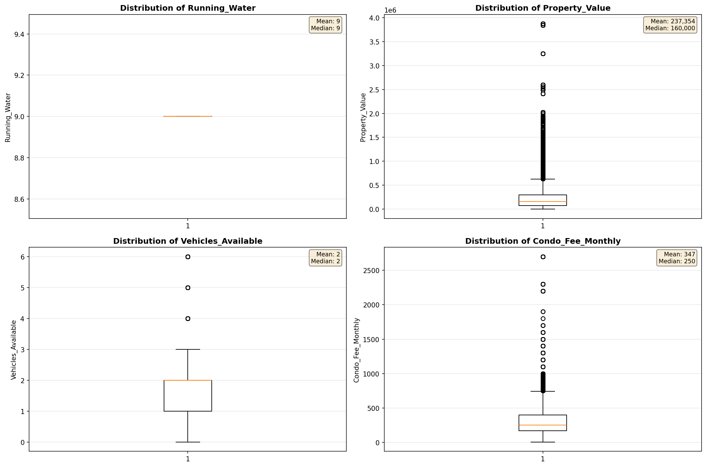

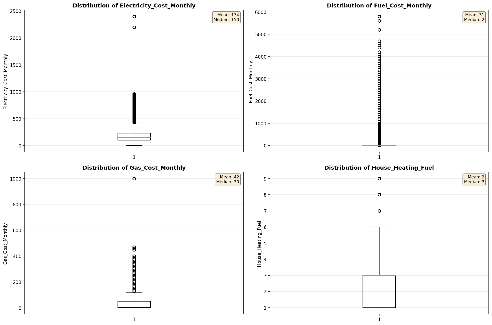

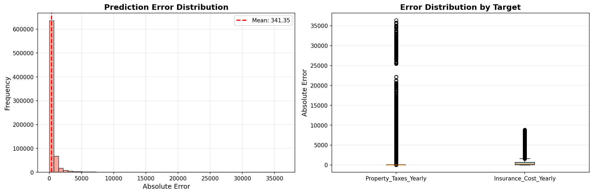

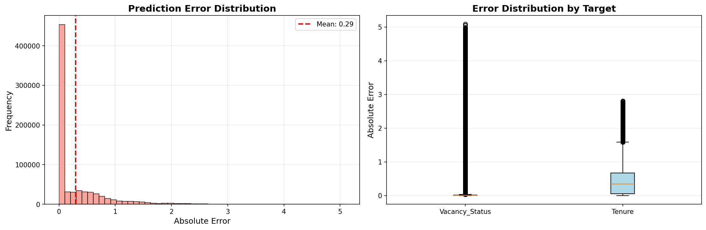

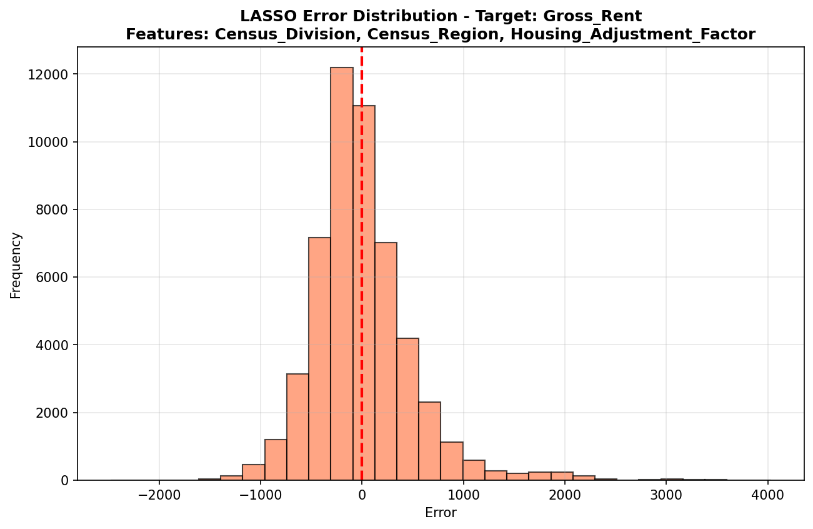

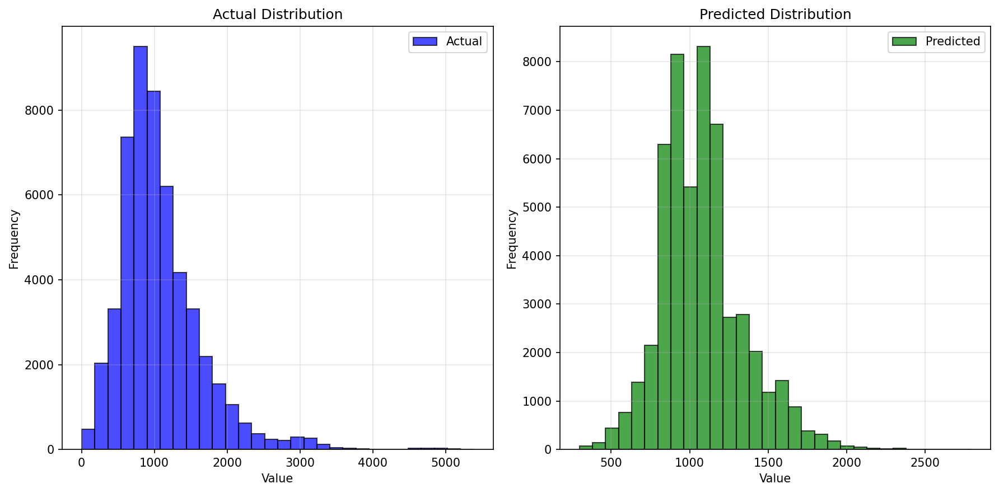

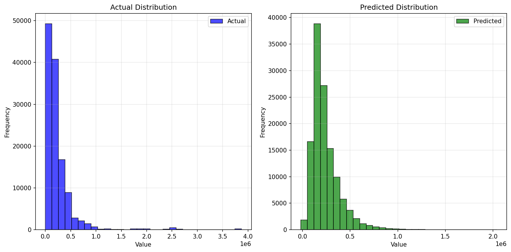

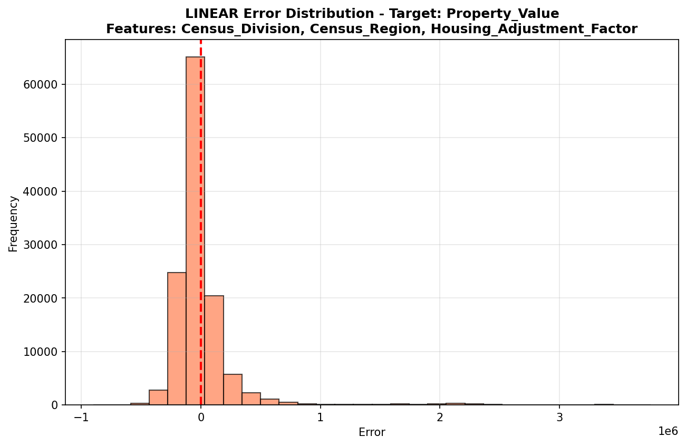

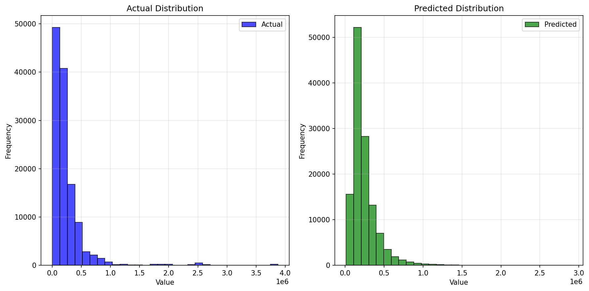

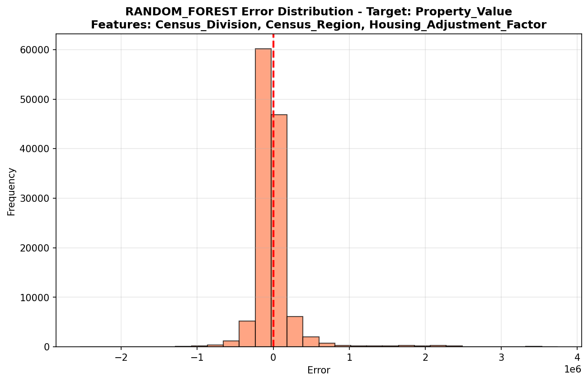

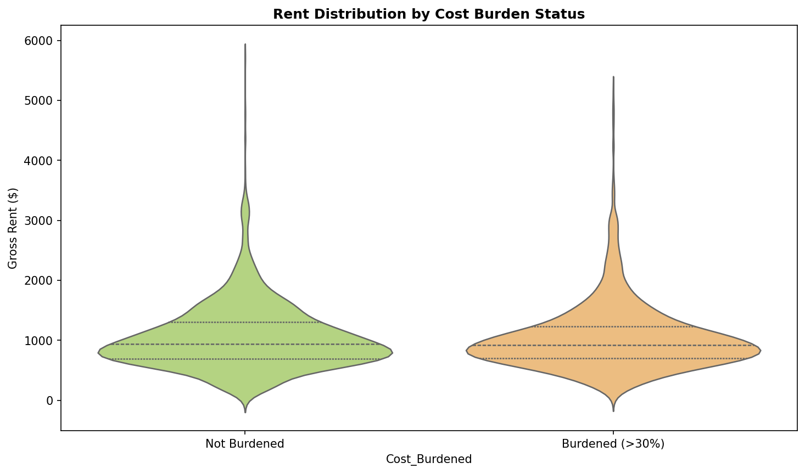

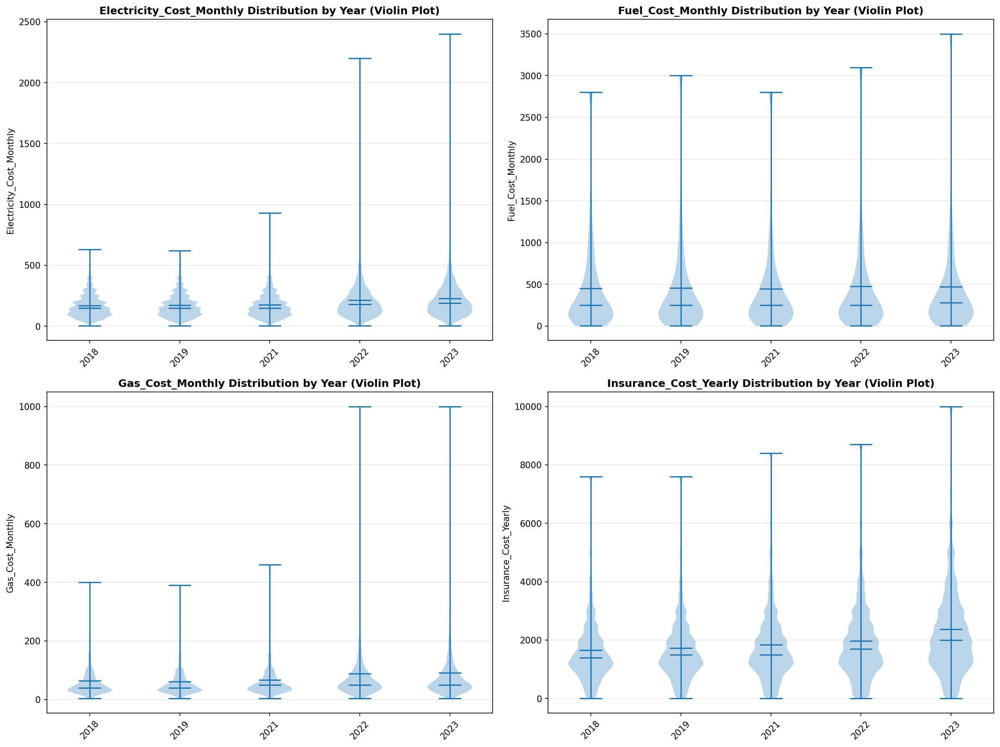

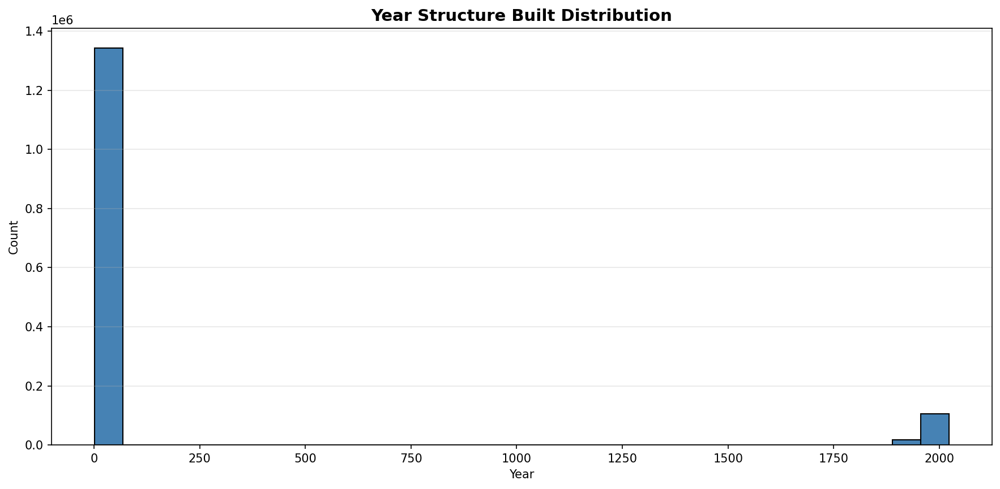

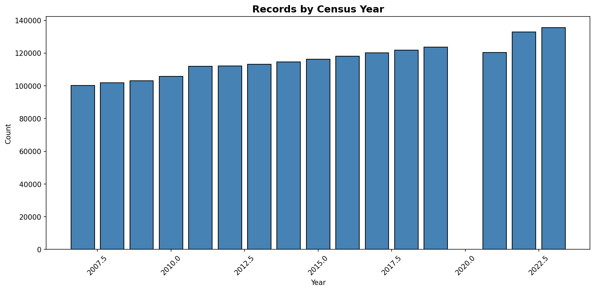
