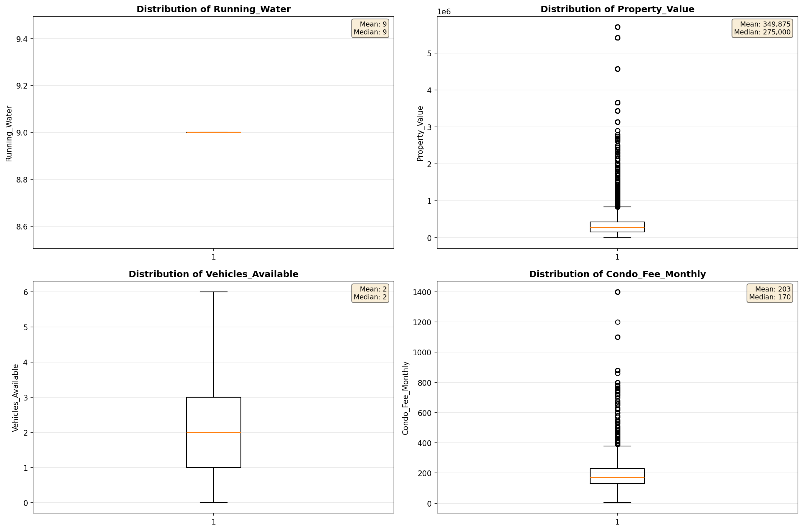
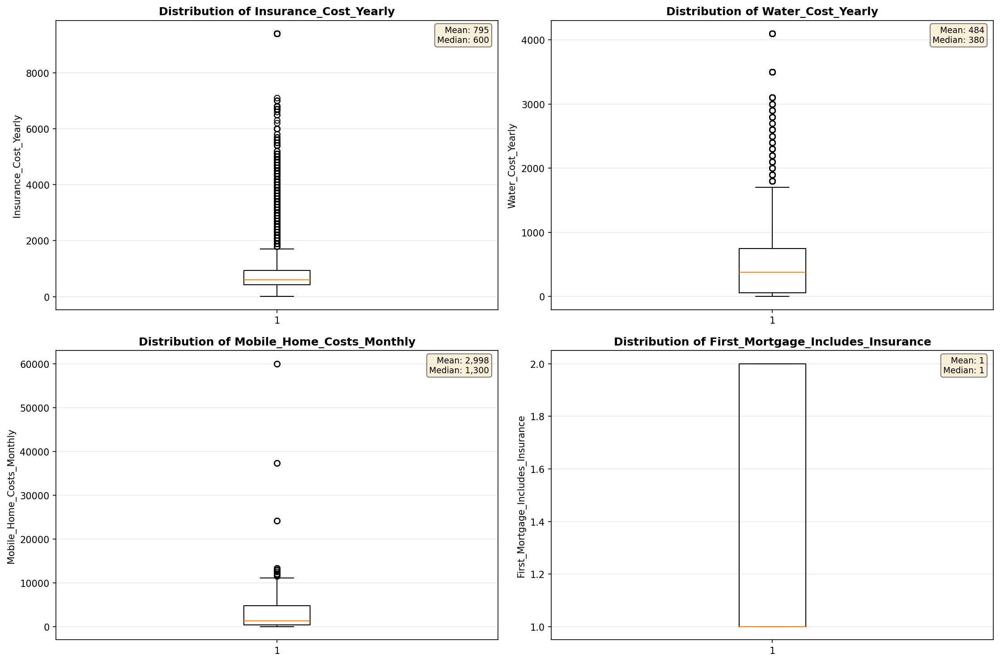
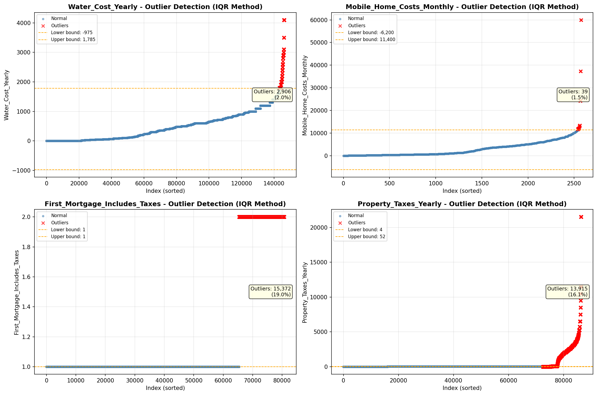

# Outlier Detection

> Statistical outlier detection using IQR (Interquartile Range) method. Outliers are values falling outside Q1 - 1.5×IQR or Q3 + 1.5×IQR bounds.

## Detection Methodology

| Parameter | Value | Description |
| :--- | :--- | :--- |
| Method | IQR | Outlier detection algorithm |
| Lower Bound | Q1 - 1.5 × IQR | Values below are outliers |
| Upper Bound | Q3 + 1.5 × IQR | Values above are outliers |
| IQR Definition | Q3 - Q1 | Interquartile Range |

> **Note**: The IQR method is robust to extreme values and works well for approximately symmetric distributions.

## Outlier Summary

_No outlier summary available._
## High Outlier Rate Variables

> Variables with outlier rate > 5% may indicate data quality issues, non-normal distributions, or genuinely extreme values.

- **('Specified_Rent_Unit', 22.544650772449497)**: 0 outliers (0.00%)

- **('Flag_Selected_Monthly_Owner_Costs', 20.23882823272311)**: 0 outliers (0.00%)

- **('Flag_Family_Income', 20.19716827923786)**: 0 outliers (0.00%)

- **('First_Mortgage_Includes_Taxes', 19.04195622282508)**: 0 outliers (0.00%)

- **('Property_Taxes_Yearly', 16.102901183849653)**: 0 outliers (0.00%)

- **('Property_Tax_Rate', 13.675577985405443)**: 0 outliers (0.00%)

- **('Structure_Age', 11.46043086089427)**: 0 outliers (0.00%)

- **('Income_Adjustment_Factor', 10.318315890341225)**: 0 outliers (0.00%)

- **('Fuel_Cost_Monthly', 10.164446114274154)**: 0 outliers (0.00%)

- **('Gross_Rent_Percentage_Income', 9.310854776693287)**: 0 outliers (0.00%)

- **('Flag_Property_Taxes', 9.048941672253616)**: 0 outliers (0.00%)

- **('Flag_Water_Cost', 8.993405894971001)**: 0 outliers (0.00%)

- **('Structure_Age_Score', 8.679971312718946)**: 0 outliers (0.00%)

- **('Insurance_Cost_Yearly', 6.7457523066645)**: 0 outliers (0.00%)

- **('Owner_Costs_Percentage_Income', 6.485127775450356)**: 0 outliers (0.00%)

> *Consider investigating these variables for data entry errors, applying transformations, or using robust statistical methods.*

## Visualizations

