# Correlation Analysis

> Analysis of linear relationships between variables. Correlation coefficients range from -1 (perfect negative) to +1 (perfect positive). Values near 0 indicate weak/no relationship.

## Correlation Summary

| Category | Count | Description |
| :--- | :--- | :--- |
| Very Strong (|r| ≥ 0.8) | 1 | Nearly deterministic relationship |
| Strong (0.6 ≤ |r| < 0.8) | 0 | Strong linear relationship |
| Moderate (0.4 ≤ |r| < 0.6) | 0 | Moderate linear relationship |
| Positive Correlations | 1 | Variables move together |
| Negative Correlations | 0 | Variables move inversely |

- **Total Significant Correlations**: 1

## Strong Correlations

> Strong correlations (|r| ≥ 0.6) indicate significant linear relationships that may be important for modeling and interpretation.

| Variable 1 | Variable 2 | Correlation | Strength | Direction |
| :--- | :--- | :--- | :--- | :--- |
| Total_Person_Income | Wage_Income | 0.911 | Very Strong | Positive |

## Weighted Correlations (ACS Sample Weights)

> Correlations computed using ACS sample weights to account for survey design. These provide population-representative estimates.

| Variable Pair | Weighted Corr | Years | Consistency |
| :--- | :--- | :--- | :--- |
| Total_Person_Income ↔ Wage_Income | 0.914 | 16 | Very Stable |
| Wage_Income ↔ Hours_Worked_Per_Week | 0.415 | 16 | Very Stable |
| Total_Person_Income ↔ Hours_Worked_Per_Week | 0.324 | 16 | Very Stable |
| Age ↔ Wage_Income | 0.250 | 16 | Very Stable |
| Age ↔ Total_Person_Income | 0.137 | 16 | Very Stable |
| Age ↔ Hours_Worked_Per_Week | 0.104 | 16 | Very Stable |

## Correlation Interpretation Guide

| Range | Interpretation | Implications |
| :--- | :--- | :--- |
| 0.8 to 1.0 | Very Strong Positive | Variables strongly increase together |
| 0.6 to 0.8 | Strong Positive | Clear positive relationship |
| 0.4 to 0.6 | Moderate Positive | Noticeable positive trend |
| 0.2 to 0.4 | Weak Positive | Slight positive tendency |
| -0.2 to 0.2 | Negligible | No meaningful linear relationship |
| -0.4 to -0.2 | Weak Negative | Slight negative tendency |
| -0.6 to -0.4 | Moderate Negative | Noticeable negative trend |
| -0.8 to -0.6 | Strong Negative | Clear negative relationship |
| -1.0 to -0.8 | Very Strong Negative | Variables strongly move inversely |

> **Note**: Correlation does not imply causation. Strong correlations may be due to confounding variables, spurious relationships, or shared underlying factors.

## Visualizations

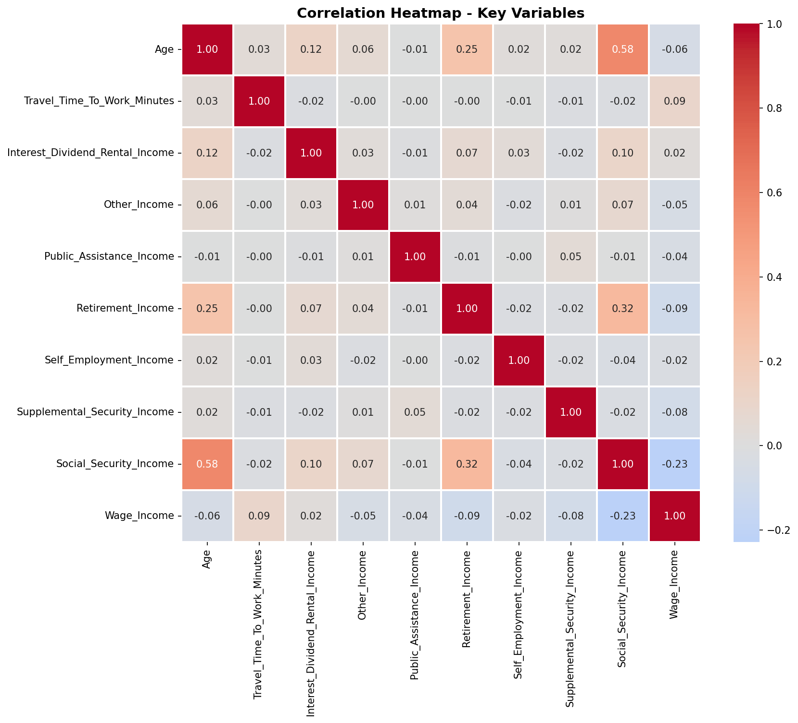

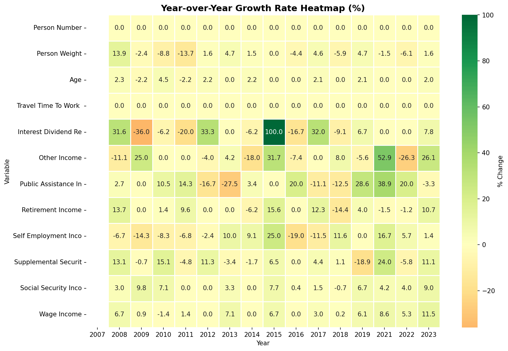

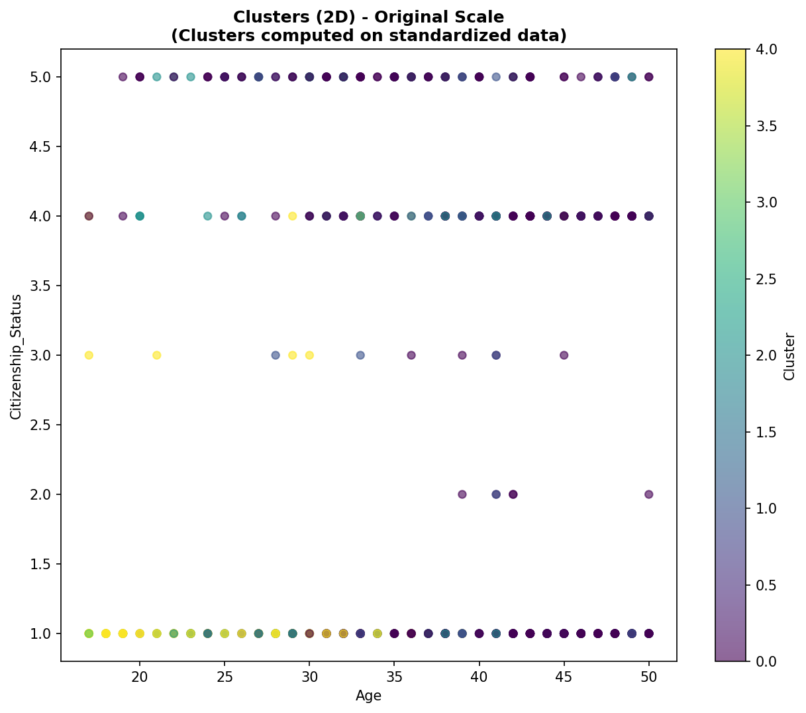

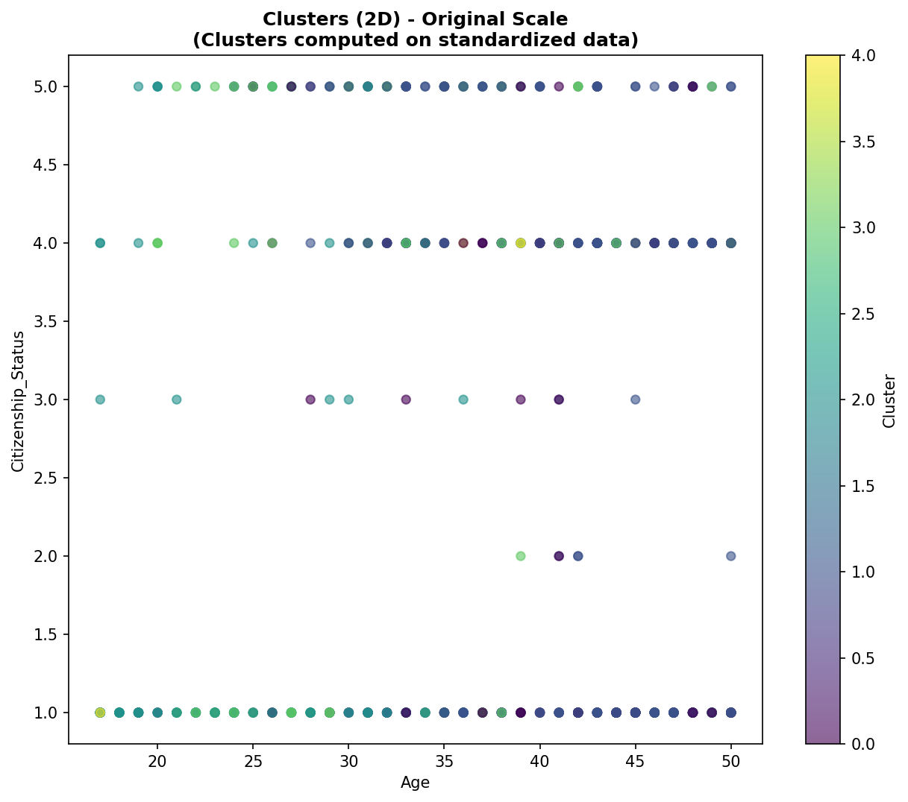

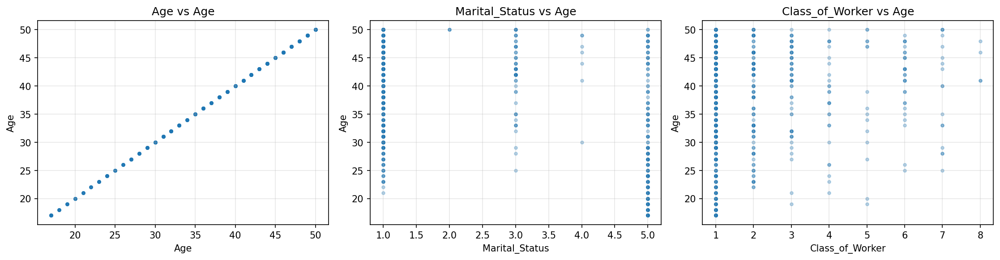

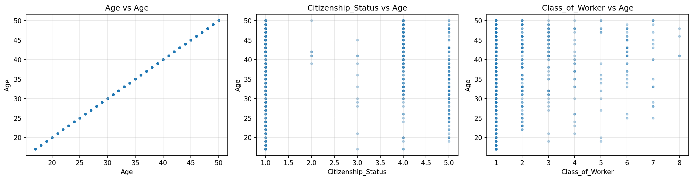

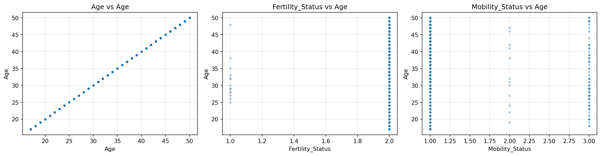

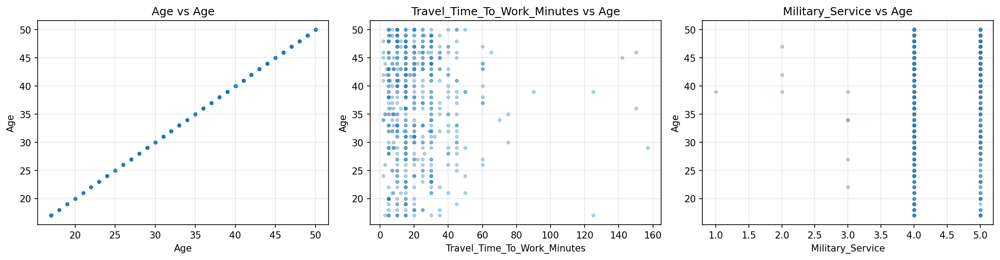

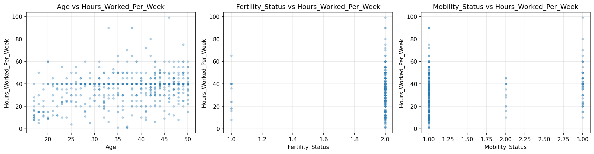

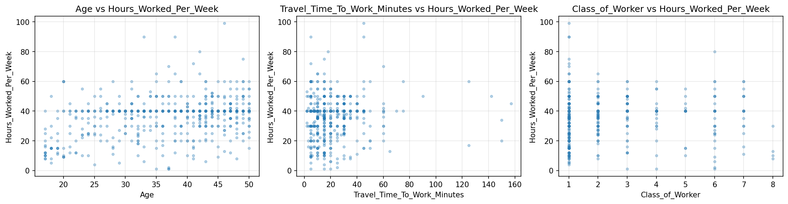

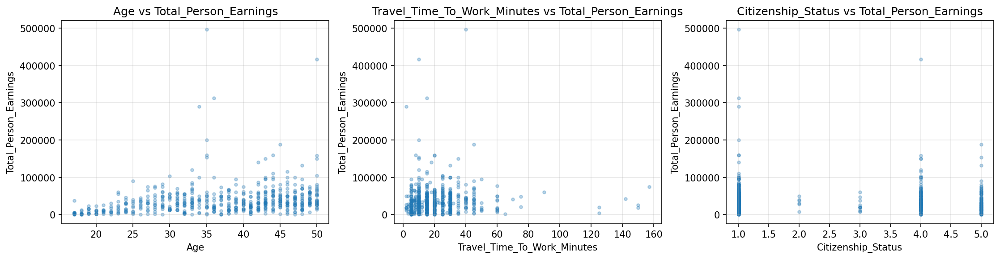

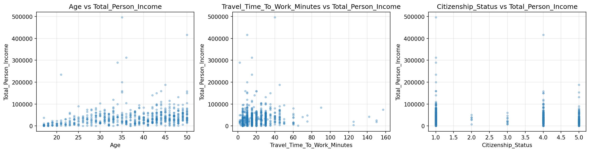

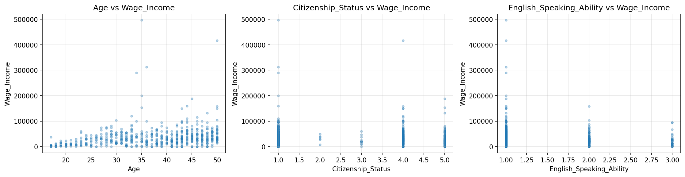

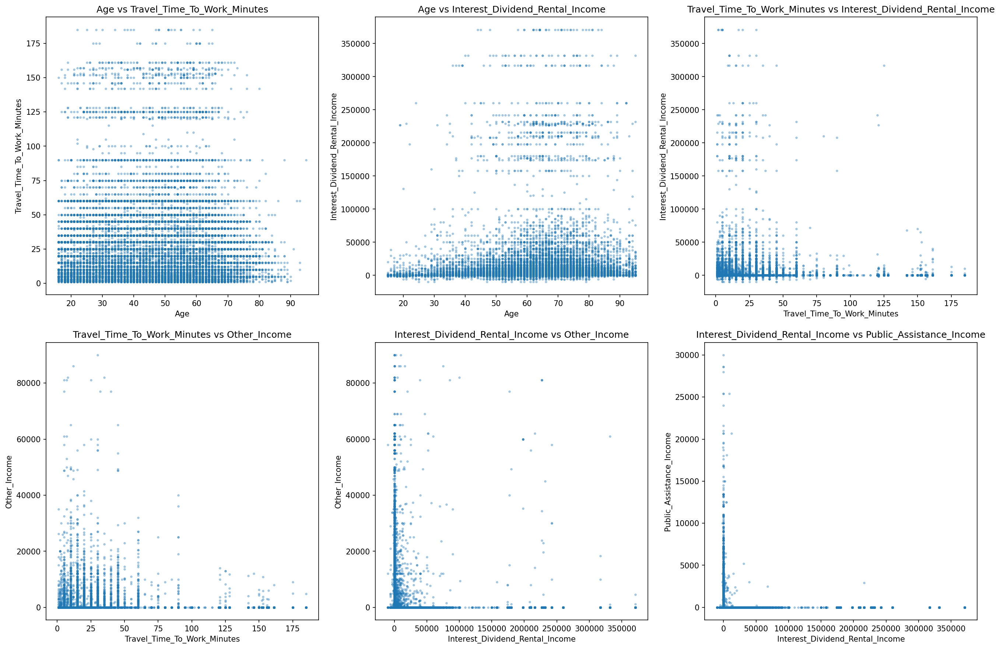

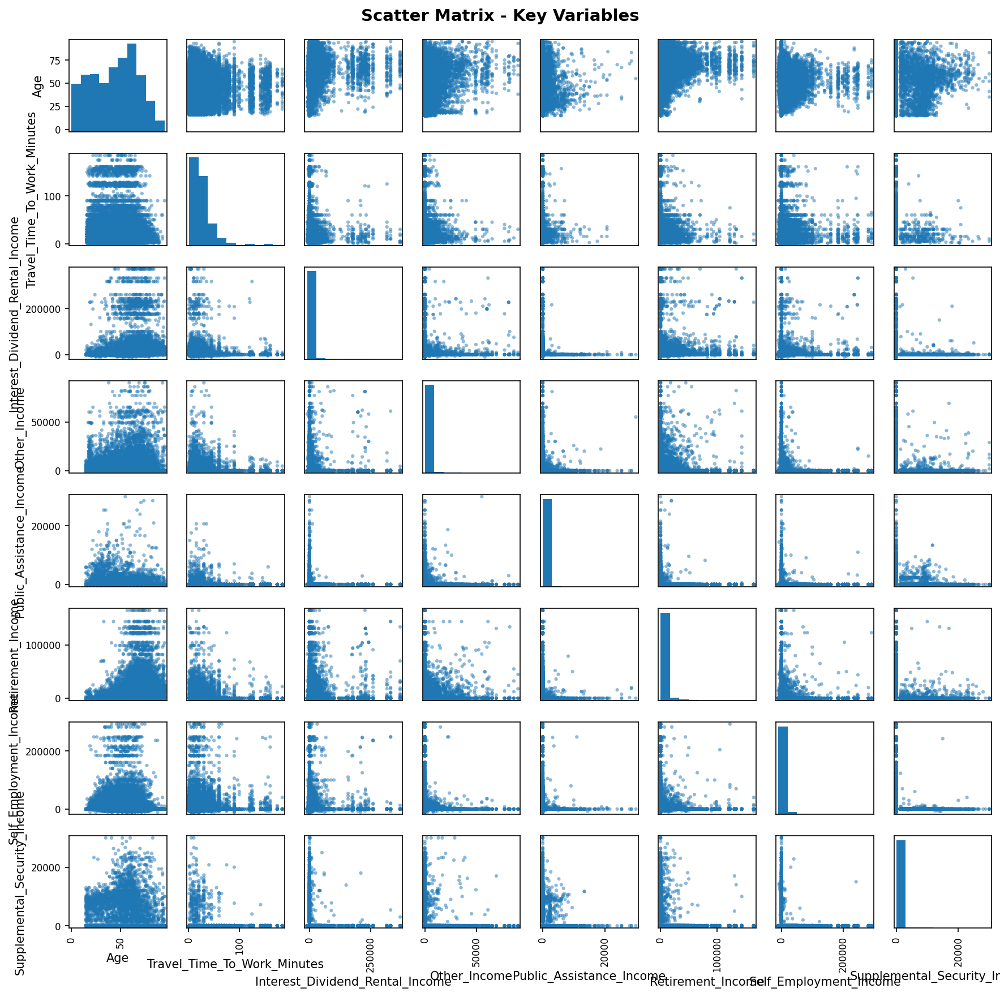
