# Statistical Analysis

> Comprehensive descriptive statistics including central tendency, dispersion, distribution characteristics, and weighted statistics using ACS sample weights.

## Summary Statistics

- **Variables Analyzed**: 41

### Income_Adjustment_Factor

| Statistic | Unweighted | Weighted (ACS) |
| :--- | :--- | :--- |
| Mean | 1,014,945.71 | 1,014,656.45 |
| Median | 1,010,207.00 | 1,014,656.45 |
| Std Deviation | 11,430.13 | — |
| Minimum | 1,001,264.00 | — |
| Maximum | 1,042,311.00 | — |
| Count | 438,129 | — |

> *Distribution is highly right-skewed (skewness: 1.30), light-tailed/platykurtic (kurtosis: 0.66).*

- **Coefficient of Variation**: 1.1 % (low variability)

### Property_Value

| Statistic | Unweighted | Weighted (ACS) |
| :--- | :--- | :--- |
| Mean | 344,812.76 | 331,678.82 |
| Median | 250,000.00 | 254,584.92 |
| Std Deviation | 380,472.11 | — |
| Minimum | 1.00 | — |
| Maximum | 4,755,000.00 | — |
| Count | 289,345 | — |

> *Distribution is highly right-skewed (skewness: 4.50), heavy-tailed/leptokurtic (kurtosis: 34.17).*

- **Coefficient of Variation**: 110.3 % (very high variability)

### Electricity_Cost_Monthly

| Statistic | Unweighted | Weighted (ACS) |
| :--- | :--- | :--- |
| Mean | 152.33 | 151.37 |
| Median | 130.00 | 132.50 |
| Std Deviation | 117.48 | — |
| Minimum | 1.00 | — |
| Maximum | 2,700.00 | — |
| Count | 514,340 | — |

> *Distribution is highly right-skewed (skewness: 8.03), heavy-tailed/leptokurtic (kurtosis: 152.61).*

- **Coefficient of Variation**: 77.1 % (high variability)

### Fuel_Cost_Monthly

| Statistic | Unweighted | Weighted (ACS) |
| :--- | :--- | :--- |
| Mean | 167.20 | 350.35 |
| Median | 2.00 | 186.38 |
| Std Deviation | 526.41 | — |
| Minimum | 1.00 | — |
| Maximum | 6,100.00 | — |
| Count | 365,621 | — |

> *Distribution is highly right-skewed (skewness: 4.63), heavy-tailed/leptokurtic (kurtosis: 26.54).*

- **Coefficient of Variation**: 314.8 % (very high variability)

### Gas_Cost_Monthly

| Statistic | Unweighted | Weighted (ACS) |
| :--- | :--- | :--- |
| Mean | 58.47 | 63.51 |
| Median | 20.00 | 24.56 |
| Std Deviation | 93.20 | — |
| Minimum | 1.00 | — |
| Maximum | 1,400.00 | — |
| Count | 430,827 | — |

> *Distribution is highly right-skewed (skewness: 4.86), heavy-tailed/leptokurtic (kurtosis: 49.72).*

- **Coefficient of Variation**: 159.4 % (very high variability)

### Insurance_Cost_Yearly

| Statistic | Unweighted | Weighted (ACS) |
| :--- | :--- | :--- |
| Mean | 1,010.66 | 990.47 |
| Median | 800.00 | 798.75 |
| Std Deviation | 865.23 | — |
| Minimum | 4.00 | — |
| Maximum | 9,400.00 | — |
| Count | 345,448 | — |

> *Distribution is highly right-skewed (skewness: 3.44), heavy-tailed/leptokurtic (kurtosis: 18.43).*

- **Coefficient of Variation**: 85.6 % (high variability)

### Water_Cost_Yearly

| Statistic | Unweighted | Weighted (ACS) |
| :--- | :--- | :--- |
| Mean | 449.18 | 460.52 |
| Median | 300.00 | 311.88 |
| Std Deviation | 525.12 | — |
| Minimum | 1.00 | — |
| Maximum | 4,500.00 | — |
| Count | 467,265 | — |

> *Distribution is highly right-skewed (skewness: 2.05), heavy-tailed/leptokurtic (kurtosis: 7.07).*

- **Coefficient of Variation**: 116.9 % (very high variability)

### Mobile_Home_Costs_Monthly

| Statistic | Unweighted | Weighted (ACS) |
| :--- | :--- | :--- |
| Mean | 1,315.43 | 1,422.16 |
| Median | 400.00 | 422.50 |
| Std Deviation | 2,291.85 | — |
| Minimum | 4.00 | — |
| Maximum | 24,700.00 | — |
| Count | 12,521 | — |

> *Distribution is highly right-skewed (skewness: 4.07), heavy-tailed/leptokurtic (kurtosis: 26.26).*

- **Coefficient of Variation**: 174.2 % (very high variability)

### First_Mortgage_Payment_Monthly

| Statistic | Unweighted | Weighted (ACS) |
| :--- | :--- | :--- |
| Mean | 1,369.39 | 1,434.80 |
| Median | 1,200.00 | 1,156.75 |
| Std Deviation | 1,099.66 | — |
| Minimum | 4.00 | — |
| Maximum | 7,200.00 | — |
| Count | 290,587 | — |

> *Distribution is highly right-skewed (skewness: 1.36), heavy-tailed/leptokurtic (kurtosis: 3.11).*

- **Coefficient of Variation**: 80.3 % (high variability)

### First_Mortgage_Includes_Taxes

| Statistic | Unweighted | Weighted (ACS) |
| :--- | :--- | :--- |
| Mean | 1.20 | 1.19 |
| Median | 1.00 | 1.00 |
| Std Deviation | 0.40 | — |
| Minimum | 1.00 | — |
| Maximum | 2.00 | — |
| Count | 253,904 | — |

> *Distribution is highly right-skewed (skewness: 1.51), light-tailed/platykurtic (kurtosis: 0.27).*

- **Coefficient of Variation**: 33.3 % (moderate variability)

### Second_Mortgage_Payment_Monthly

| Statistic | Unweighted | Weighted (ACS) |
| :--- | :--- | :--- |
| Mean | 467.34 | 461.65 |
| Median | 330.00 | 330.00 |
| Std Deviation | 469.91 | — |
| Minimum | 4.00 | — |
| Maximum | 4,400.00 | — |
| Count | 54,491 | — |

> *Distribution is highly right-skewed (skewness: 3.00), heavy-tailed/leptokurtic (kurtosis: 12.88).*

- **Coefficient of Variation**: 100.6 % (very high variability)

### Property_Taxes_Yearly

| Statistic | Unweighted | Weighted (ACS) |
| :--- | :--- | :--- |
| Mean | 385.09 | 350.00 |
| Median | 32.00 | 240.08 |
| Std Deviation | 1,648.86 | — |
| Minimum | 1.00 | — |
| Maximum | 27,500.00 | — |
| Count | 277,744 | — |

> *Distribution is highly right-skewed (skewness: 7.92), heavy-tailed/leptokurtic (kurtosis: 88.32).*

- **Coefficient of Variation**: 428.2 % (very high variability)

### Meals_Included_in_Rent

| Statistic | Unweighted | Weighted (ACS) |
| :--- | :--- | :--- |
| Mean | 1.98 | 1.98 |
| Median | 2.00 | 2.00 |
| Std Deviation | 0.15 | — |
| Minimum | 1.00 | — |
| Maximum | 2.00 | — |
| Count | 142,745 | — |

> *Distribution is highly left-skewed (skewness: -6.34), heavy-tailed/leptokurtic (kurtosis: 38.15).*

- **Coefficient of Variation**: 7.6 % (low variability)

### Rent_Amount_Monthly

| Statistic | Unweighted | Weighted (ACS) |
| :--- | :--- | :--- |
| Mean | 1,105.17 | 1,100.56 |
| Median | 950.00 | 982.50 |
| Std Deviation | 717.96 | — |
| Minimum | 4.00 | — |
| Maximum | 5,500.00 | — |
| Count | 142,745 | — |

> *Distribution is highly right-skewed (skewness: 1.54), heavy-tailed/leptokurtic (kurtosis: 4.37).*

- **Coefficient of Variation**: 65.0 % (high variability)

### Gross_Rent

| Statistic | Unweighted | Weighted (ACS) |
| :--- | :--- | :--- |
| Mean | 1,270.84 | 1,262.41 |
| Median | 1,120.00 | 1,151.62 |
| Std Deviation | 738.49 | — |
| Minimum | 4.00 | — |
| Maximum | 8,270.00 | — |
| Count | 135,324 | — |

> *Distribution is highly right-skewed (skewness: 1.47), heavy-tailed/leptokurtic (kurtosis: 4.15).*

- **Coefficient of Variation**: 58.1 % (high variability)

### Gross_Rent_Percentage_Income

| Statistic | Unweighted | Weighted (ACS) |
| :--- | :--- | :--- |
| Mean | 37.85 | 38.17 |
| Median | 29.00 | 29.00 |
| Std Deviation | 26.61 | — |
| Minimum | 1.00 | — |
| Maximum | 101.00 | — |
| Count | 132,939 | — |

> *Distribution is highly right-skewed (skewness: 1.25), light-tailed/platykurtic (kurtosis: 0.54).*

- **Coefficient of Variation**: 70.3 % (high variability)

### Selected_Monthly_Owner_Costs

| Statistic | Unweighted | Weighted (ACS) |
| :--- | :--- | :--- |
| Mean | 1,549.41 | 1,561.56 |
| Median | 1,270.00 | 1,312.25 |
| Std Deviation | 1,222.02 | — |
| Minimum | 1.00 | — |
| Maximum | 15,990.00 | — |
| Count | 377,088 | — |

> *Distribution is highly right-skewed (skewness: 1.69), heavy-tailed/leptokurtic (kurtosis: 4.64).*

- **Coefficient of Variation**: 78.9 % (high variability)

### Owner_Costs_Percentage_Income

| Statistic | Unweighted | Weighted (ACS) |
| :--- | :--- | :--- |
| Mean | 23.35 | 23.95 |
| Median | 18.00 | 18.69 |
| Std Deviation | 20.09 | — |
| Minimum | 1.00 | — |
| Maximum | 101.00 | — |
| Count | 374,978 | — |

> *Distribution is highly right-skewed (skewness: 2.15), heavy-tailed/leptokurtic (kurtosis: 5.14).*

- **Coefficient of Variation**: 86.1 % (high variability)

### Family_Income

| Statistic | Unweighted | Weighted (ACS) |
| :--- | :--- | :--- |
| Mean | 116,077.23 | 109,575.43 |
| Median | 87,000.00 | 83,338.75 |
| Std Deviation | 109,155.66 | — |
| Minimum | 1.00 | — |
| Maximum | 3,537,500.00 | — |
| Count | 347,897 | — |

> *Distribution is highly right-skewed (skewness: 3.03), heavy-tailed/leptokurtic (kurtosis: 17.00).*

- **Coefficient of Variation**: 94.0 % (high variability)

### Household_Income

| Statistic | Unweighted | Weighted (ACS) |
| :--- | :--- | :--- |
| Mean | 99,011.50 | 94,160.06 |
| Median | 71,000.00 | 68,868.75 |
| Std Deviation | 101,149.03 | — |
| Minimum | 1.00 | — |
| Maximum | 3,563,100.00 | — |
| Count | 516,588 | — |

> *Distribution is highly right-skewed (skewness: 3.20), heavy-tailed/leptokurtic (kurtosis: 18.98).*

- **Coefficient of Variation**: 102.2 % (very high variability)

### Specified_Rent_Unit

| Statistic | Unweighted | Weighted (ACS) |
| :--- | :--- | :--- |
| Mean | 0.27 | 0.32 |
| Median | 0.00 | 0.00 |
| Std Deviation | 0.44 | — |
| Minimum | 0.00 | — |
| Maximum | 1.00 | — |
| Count | 555,546 | — |

> *Distribution is highly right-skewed (skewness: 1.04), light-tailed/platykurtic (kurtosis: -0.91).*

- **Coefficient of Variation**: 164.9 % (very high variability)

### Specified_Value_Unit

| Statistic | Unweighted | Weighted (ACS) |
| :--- | :--- | :--- |
| Mean | 0.60 | 0.53 |
| Median | 1.00 | 1.00 |
| Std Deviation | 0.49 | — |
| Minimum | 0.00 | — |
| Maximum | 1.00 | — |
| Count | 555,546 | — |

> *Distribution is approximately symmetric (skewness: -0.39), light-tailed/platykurtic (kurtosis: -1.85).*

- **Coefficient of Variation**: 82.3 % (high variability)

### Flag_Family_Income

| Statistic | Unweighted | Weighted (ACS) |
| :--- | :--- | :--- |
| Mean | 0.20 | 0.20 |
| Median | 0.00 | 0.00 |
| Std Deviation | 0.40 | — |
| Minimum | 0.00 | — |
| Maximum | 1.00 | — |
| Count | 422,745 | — |

> *Distribution is highly right-skewed (skewness: 1.51), light-tailed/platykurtic (kurtosis: 0.29).*

- **Coefficient of Variation**: 201.0 % (very high variability)

### Flag_Gross_Rent

| Statistic | Unweighted | Weighted (ACS) |
| :--- | :--- | :--- |
| Mean | 0.07 | 0.12 |
| Median | 0.00 | 0.00 |
| Std Deviation | 0.26 | — |
| Minimum | 0.00 | — |
| Maximum | 1.00 | — |
| Count | 274,830 | — |

> *Distribution is highly right-skewed (skewness: 3.27), heavy-tailed/leptokurtic (kurtosis: 8.72).*

- **Coefficient of Variation**: 355.5 % (very high variability)

### Flag_Household_Income

| Statistic | Unweighted | Weighted (ACS) |
| :--- | :--- | :--- |
| Mean | 0.29 | 0.30 |
| Median | 0.00 | 0.00 |
| Std Deviation | 0.45 | — |
| Minimum | 0.00 | — |
| Maximum | 1.00 | — |
| Count | 422,745 | — |

> *Distribution is moderately right-skewed (skewness: 0.92), light-tailed/platykurtic (kurtosis: -1.16).*

- **Coefficient of Variation**: 155.8 % (very high variability)

### Flag_First_Mortgage_Payment

| Statistic | Unweighted | Weighted (ACS) |
| :--- | :--- | :--- |
| Mean | 0.04 | 0.04 |
| Median | 0.00 | 0.00 |
| Std Deviation | 0.19 | — |
| Minimum | 0.00 | — |
| Maximum | 1.00 | — |
| Count | 555,546 | — |

> *Distribution is highly right-skewed (skewness: 4.77), heavy-tailed/leptokurtic (kurtosis: 20.75).*

- **Coefficient of Variation**: 497.1 % (very high variability)

### Flag_First_Mortgage_Taxes

| Statistic | Unweighted | Weighted (ACS) |
| :--- | :--- | :--- |
| Mean | 0.03 | 0.03 |
| Median | 0.00 | 0.00 |
| Std Deviation | 0.18 | — |
| Minimum | 0.00 | — |
| Maximum | 1.00 | — |
| Count | 555,546 | — |

> *Distribution is highly right-skewed (skewness: 5.14), heavy-tailed/leptokurtic (kurtosis: 24.37).*

- **Coefficient of Variation**: 532.3 % (very high variability)

### Flag_Meals_Included_Rent

| Statistic | Unweighted | Weighted (ACS) |
| :--- | :--- | :--- |
| Mean | 0.01 | 0.01 |
| Median | 0.00 | 0.00 |
| Std Deviation | 0.08 | — |
| Minimum | 0.00 | — |
| Maximum | 1.00 | — |
| Count | 555,546 | — |

> *Distribution is highly right-skewed (skewness: 12.40), heavy-tailed/leptokurtic (kurtosis: 151.76).*

- **Coefficient of Variation**: 1,248.0 % (very high variability)

### Flag_Rent_Amount

| Statistic | Unweighted | Weighted (ACS) |
| :--- | :--- | :--- |
| Mean | 0.02 | 0.03 |
| Median | 0.00 | 0.00 |
| Std Deviation | 0.14 | — |
| Minimum | 0.00 | — |
| Maximum | 1.00 | — |
| Count | 555,546 | — |

> *Distribution is highly right-skewed (skewness: 6.75), heavy-tailed/leptokurtic (kurtosis: 43.51).*

- **Coefficient of Variation**: 689.1 % (very high variability)

### Flag_Selected_Monthly_Owner_Costs

| Statistic | Unweighted | Weighted (ACS) |
| :--- | :--- | :--- |
| Mean | 0.22 | 0.22 |
| Median | 0.00 | 0.00 |
| Std Deviation | 0.41 | — |
| Minimum | 0.00 | — |
| Maximum | 1.00 | — |
| Count | 361,284 | — |

> *Distribution is highly right-skewed (skewness: 1.36), light-tailed/platykurtic (kurtosis: -0.16).*

- **Coefficient of Variation**: 188.6 % (very high variability)

### Flag_Second_Mortgage_Payment

| Statistic | Unweighted | Weighted (ACS) |
| :--- | :--- | :--- |
| Mean | 0.04 | 0.04 |
| Median | 0.00 | 0.00 |
| Std Deviation | 0.18 | — |
| Minimum | 0.00 | — |
| Maximum | 1.00 | — |
| Count | 555,546 | — |

> *Distribution is highly right-skewed (skewness: 5.03), heavy-tailed/leptokurtic (kurtosis: 23.32).*

- **Coefficient of Variation**: 522.3 % (very high variability)

### Flag_Property_Taxes

| Statistic | Unweighted | Weighted (ACS) |
| :--- | :--- | :--- |
| Mean | 0.11 | 0.12 |
| Median | 0.00 | 0.00 |
| Std Deviation | 0.32 | — |
| Minimum | 0.00 | — |
| Maximum | 1.00 | — |
| Count | 518,369 | — |

> *Distribution is highly right-skewed (skewness: 2.46), heavy-tailed/leptokurtic (kurtosis: 4.07).*

- **Coefficient of Variation**: 281.8 % (very high variability)

### Flag_Property_Value

| Statistic | Unweighted | Weighted (ACS) |
| :--- | :--- | :--- |
| Mean | 0.06 | 0.06 |
| Median | 0.00 | 0.00 |
| Std Deviation | 0.24 | — |
| Minimum | 0.00 | — |
| Maximum | 1.00 | — |
| Count | 555,546 | — |

> *Distribution is highly right-skewed (skewness: 3.69), heavy-tailed/leptokurtic (kurtosis: 11.62).*

- **Coefficient of Variation**: 394.4 % (very high variability)

### Flag_Water_Cost

| Statistic | Unweighted | Weighted (ACS) |
| :--- | :--- | :--- |
| Mean | 0.07 | 0.08 |
| Median | 0.00 | 0.00 |
| Std Deviation | 0.26 | — |
| Minimum | 0.00 | — |
| Maximum | 1.00 | — |
| Count | 37,177 | — |

> *Distribution is highly right-skewed (skewness: 3.25), heavy-tailed/leptokurtic (kurtosis: 8.54).*

- **Coefficient of Variation**: 352.9 % (very high variability)

### Annual_Rent_to_Value_Ratio

### Total_Monthly_Utility_Cost

| Statistic | Unweighted | Weighted (ACS) |
| :--- | :--- | :--- |
| Mean | 200.97 | 197.03 |
| Median | 173.00 | 171.31 |
| Std Deviation | 153.25 | — |
| Minimum | 2.00 | — |
| Maximum | 4,100.00 | — |
| Count | 515,216 | — |

> *Distribution is highly right-skewed (skewness: 6.49), heavy-tailed/leptokurtic (kurtosis: 108.02).*

- **Coefficient of Variation**: 76.3 % (high variability)

### Property_Tax_Rate

| Statistic | Unweighted | Weighted (ACS) |
| :--- | :--- | :--- |
| Mean | 21.04 | 21.53 |
| Median | 0.01 | 20.24 |
| Std Deviation | 61.87 | — |
| Minimum | 0.00 | — |
| Maximum | 1,000.00 | — |
| Count | 186,719 | — |

> *Distribution is highly right-skewed (skewness: 3.18), heavy-tailed/leptokurtic (kurtosis: 10.66).*

- **Coefficient of Variation**: 294.1 % (very high variability)

#### Weighted Statistics by Year

| Year | Weighted Mean | Weighted Median |
| :--- | :--- | :--- |
| 2007 | 171.13 | 161.11 |
| 2012 | 0.02 | 0.01 |
| 2013 | 0.05 | 0.01 |
| 2014 | 0.05 | 0.01 |
| 2015 | 0.02 | 0.01 |
| 2016 | 0.02 | 0.01 |
| 2017 | 0.02 | 0.01 |
| 2023 | 0.94 | 0.76 |

### Structure_Age

| Statistic | Unweighted | Weighted (ACS) |
| :--- | :--- | :--- |
| Mean | 1,866.25 | 1,877.26 |
| Median | 2,018.00 | 1,877.21 |
| Std Deviation | 525.94 | — |
| Minimum | 1.00 | — |
| Maximum | 2,023.00 | — |
| Count | 482,168 | — |

> *Distribution is highly left-skewed (skewness: -3.17), heavy-tailed/leptokurtic (kurtosis: 8.06).*

- **Coefficient of Variation**: 28.2 % (moderate variability)

### Structure_Age_Score

| Statistic | Unweighted | Weighted (ACS) |
| :--- | :--- | :--- |
| Mean | 0.04 | 0.04 |
| Median | 0.00 | 0.04 |
| Std Deviation | 0.16 | — |
| Minimum | 0.00 | — |
| Maximum | 0.99 | — |
| Count | 482,168 | — |

> *Distribution is highly right-skewed (skewness: 3.94), heavy-tailed/leptokurtic (kurtosis: 14.83).*

- **Coefficient of Variation**: 378.3 % (very high variability)

### Working_Age_Persons

| Statistic | Unweighted | Weighted (ACS) |
| :--- | :--- | :--- |
| Mean | 1.72 | 1.80 |
| Median | 2.00 | 2.00 |
| Std Deviation | 1.33 | — |
| Minimum | 0.00 | — |
| Maximum | 18.00 | — |
| Count | 521,588 | — |

> *Distribution is moderately right-skewed (skewness: 0.84), light-tailed/platykurtic (kurtosis: 1.83).*

- **Coefficient of Variation**: 77.3 % (high variability)

### Income_to_FPL_Ratio

| Statistic | Unweighted | Weighted (ACS) |
| :--- | :--- | :--- |
| Mean | 4.48 | 4.24 |
| Median | 3.30 | 3.16 |
| Std Deviation | 4.50 | — |
| Minimum | -1.37 | — |
| Maximum | 81.14 | — |
| Count | 521,588 | — |

> *Distribution is highly right-skewed (skewness: 3.36), heavy-tailed/leptokurtic (kurtosis: 19.47).*

- **Coefficient of Variation**: 100.4 % (very high variability)

## Distribution Analysis

### Skewed Distributions

> Variables with skewness > |0.5| indicate non-normal distributions. Consider log transformations for highly skewed variables in modeling.

| Variable | Skewness | Direction | Severity |
| :--- | :--- | :--- | :--- |
| Flag_Meals_Included_Rent | 12.400 | Right-skewed | High |
| Electricity_Cost_Monthly | 8.027 | Right-skewed | High |
| Property_Taxes_Yearly | 7.917 | Right-skewed | High |
| Flag_Rent_Amount | 6.746 | Right-skewed | High |
| Total_Monthly_Utility_Cost | 6.489 | Right-skewed | High |
| Meals_Included_in_Rent | -6.336 | Left-skewed | High |
| Flag_First_Mortgage_Taxes | 5.135 | Right-skewed | High |
| Flag_Second_Mortgage_Payment | 5.032 | Right-skewed | High |
| Gas_Cost_Monthly | 4.858 | Right-skewed | High |
| Flag_First_Mortgage_Payment | 4.770 | Right-skewed | High |
| Fuel_Cost_Monthly | 4.633 | Right-skewed | High |
| Property_Value | 4.497 | Right-skewed | High |
| Mobile_Home_Costs_Monthly | 4.065 | Right-skewed | High |
| Structure_Age_Score | 3.944 | Right-skewed | High |
| Flag_Property_Value | 3.691 | Right-skewed | High |
| Insurance_Cost_Yearly | 3.435 | Right-skewed | High |
| Income_to_FPL_Ratio | 3.356 | Right-skewed | High |
| Flag_Gross_Rent | 3.274 | Right-skewed | High |
| Flag_Water_Cost | 3.246 | Right-skewed | High |
| Household_Income | 3.200 | Right-skewed | High |

- **Total Skewed Variables**: 39

- **Right-skewed**: 37

- **Left-skewed**: 2

## Variance Analysis

### Coefficient of Variation Ranking

> CV (Coefficient of Variation) = (Std Dev / Mean) × 100%. Higher CV indicates greater relative variability.

| Variable | CV (%) | Std Dev | Mean | Variability |
| :--- | :--- | :--- | :--- | :--- |
| Flag_Meals_Included_Rent | 1248.0% | 0.08 | 0.01 | Very High |
| Flag_Rent_Amount | 689.1% | 0.14 | 0.02 | Very High |
| Flag_First_Mortgage_Taxes | 532.3% | 0.18 | 0.03 | Very High |
| Flag_Second_Mortgage_Payment | 522.3% | 0.18 | 0.04 | Very High |
| Flag_First_Mortgage_Payment | 497.1% | 0.19 | 0.04 | Very High |
| Property_Taxes_Yearly | 428.2% | 1,648.86 | 385.09 | Very High |
| Flag_Property_Value | 394.4% | 0.24 | 0.06 | Very High |
| Structure_Age_Score | 378.3% | 0.16 | 0.04 | Very High |
| Flag_Gross_Rent | 355.5% | 0.26 | 0.07 | Very High |
| Flag_Water_Cost | 352.9% | 0.26 | 0.07 | Very High |
| Fuel_Cost_Monthly | 314.8% | 526.41 | 167.20 | Very High |
| Property_Tax_Rate | 294.1% | 61.87 | 21.04 | Very High |
| Flag_Property_Taxes | 281.8% | 0.32 | 0.11 | Very High |
| Flag_Family_Income | 201.0% | 0.40 | 0.20 | Very High |
| Flag_Selected_Monthly_Owner_Costs | 188.6% | 0.41 | 0.22 | Very High |
| Mobile_Home_Costs_Monthly | 174.2% | 2,291.85 | 1,315.43 | Very High |
| Specified_Rent_Unit | 164.9% | 0.44 | 0.27 | Very High |
| Gas_Cost_Monthly | 159.4% | 93.20 | 58.47 | Very High |
| Flag_Household_Income | 155.8% | 0.45 | 0.29 | Very High |
| Water_Cost_Yearly | 116.9% | 525.12 | 449.18 | Very High |

- **Average CV**: 221.6 %

- **High Variance Variables (CV > 50%)**: 36

## Visualizations

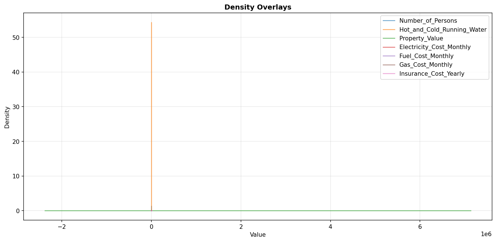

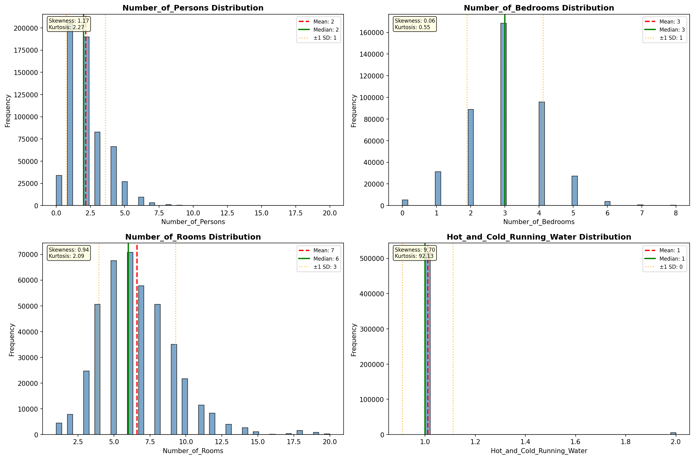

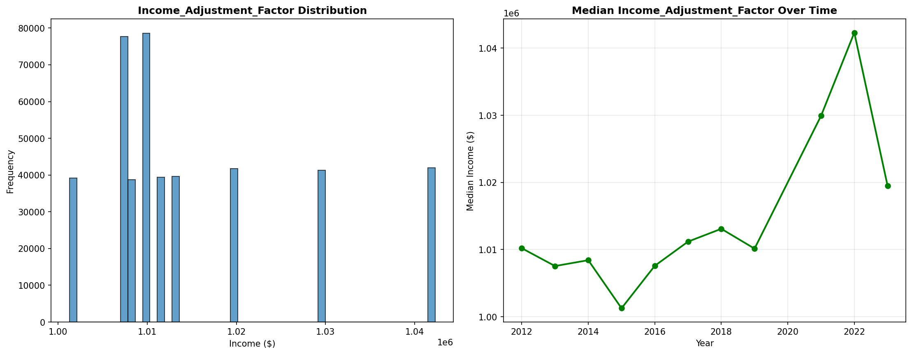

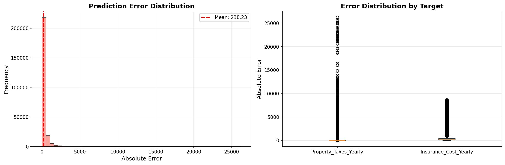

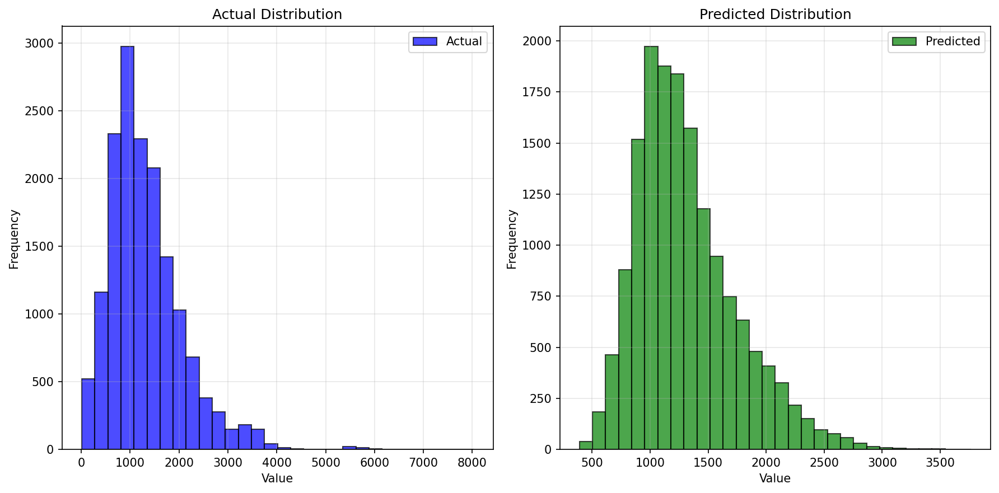

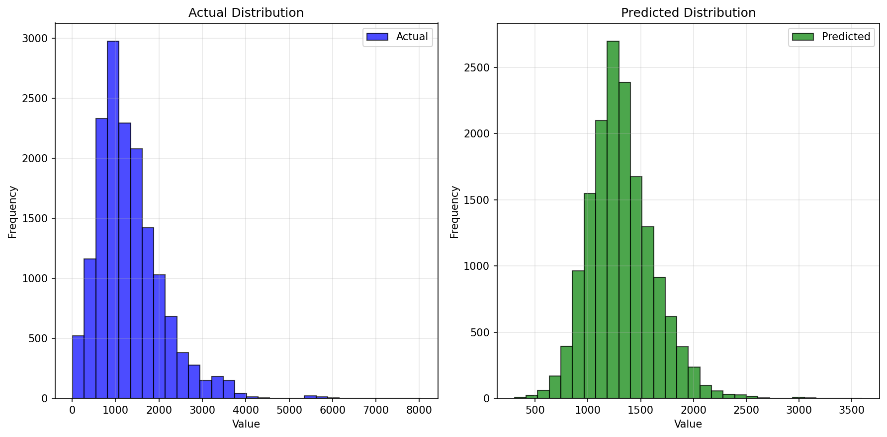

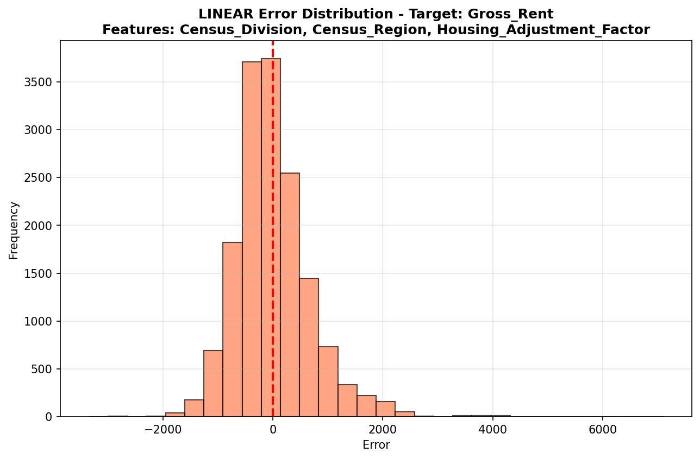

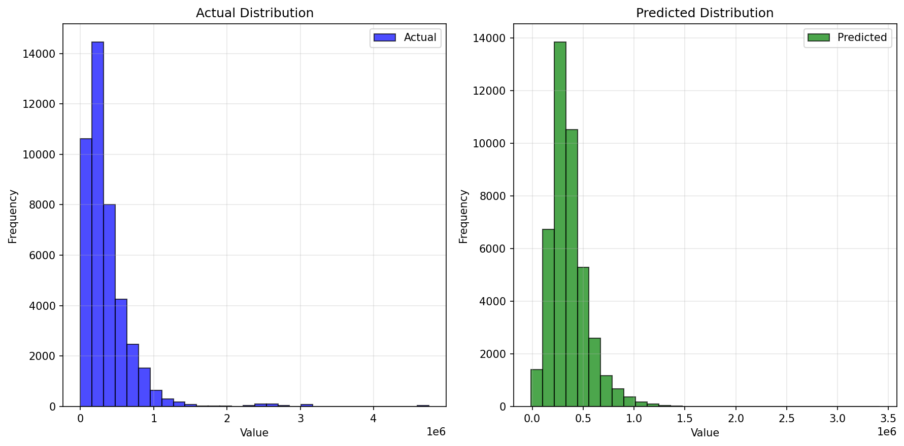

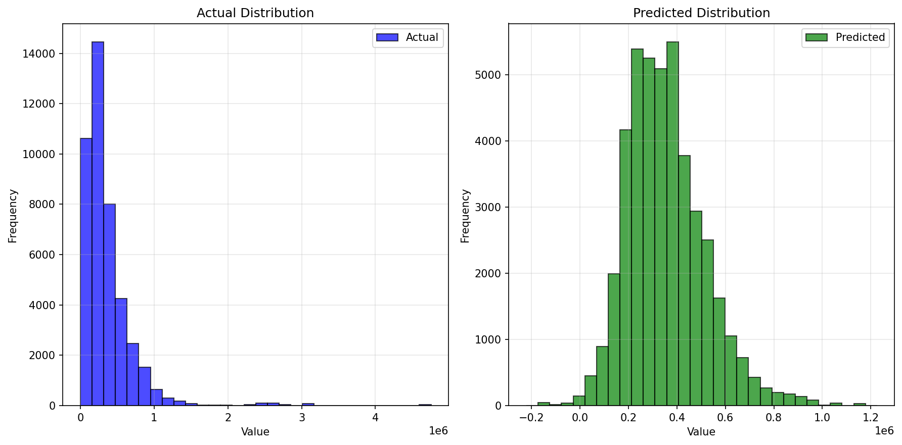

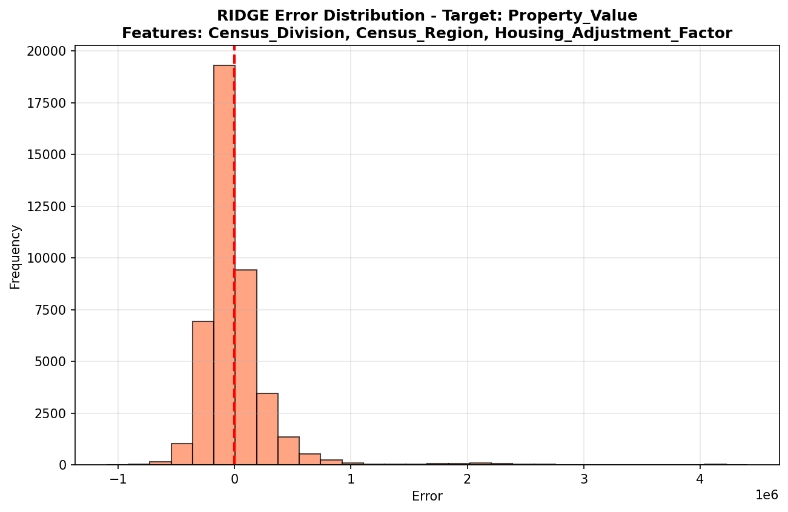

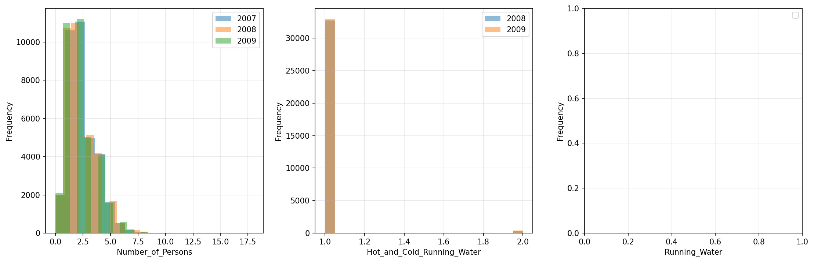

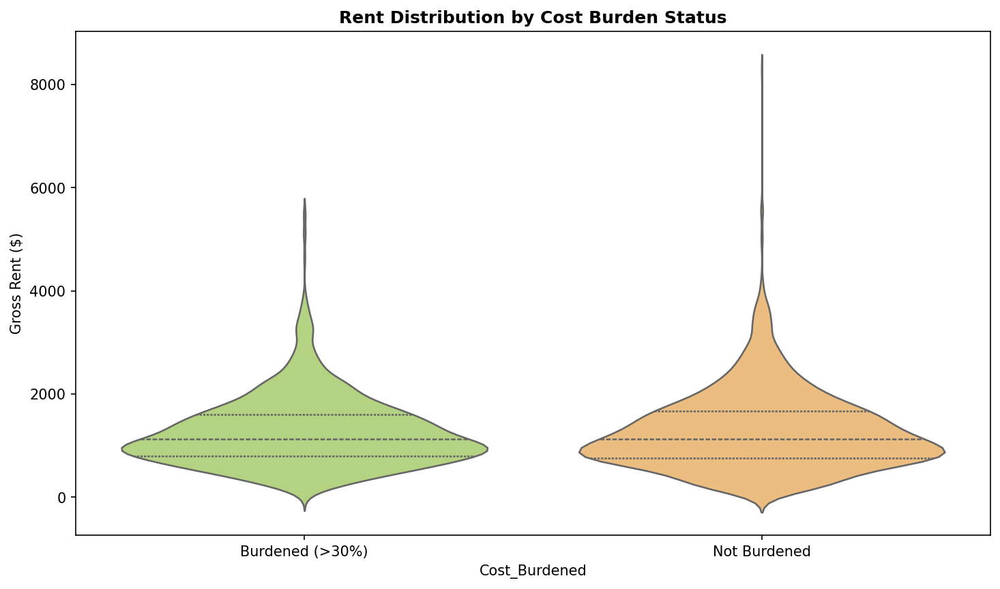

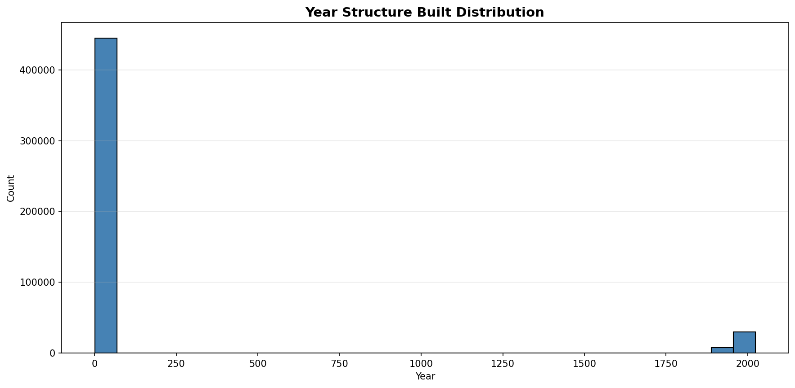

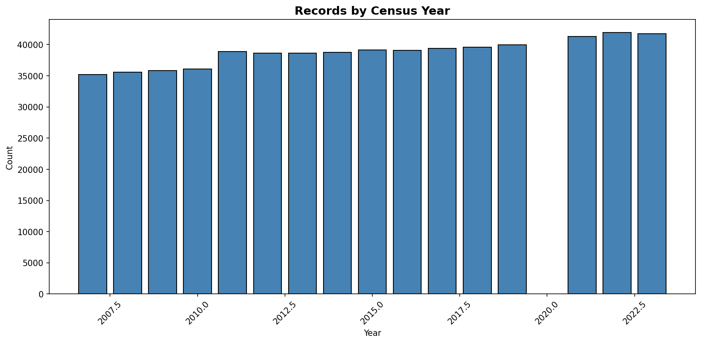
