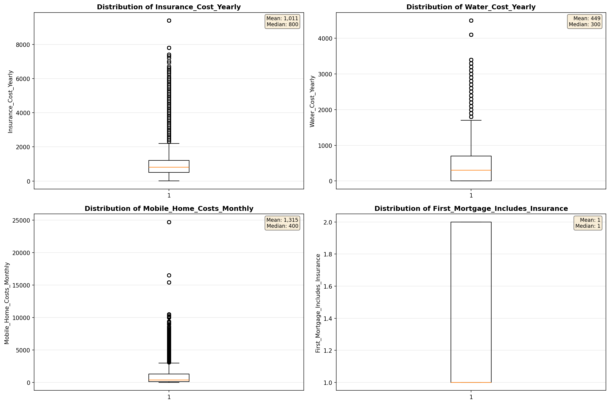
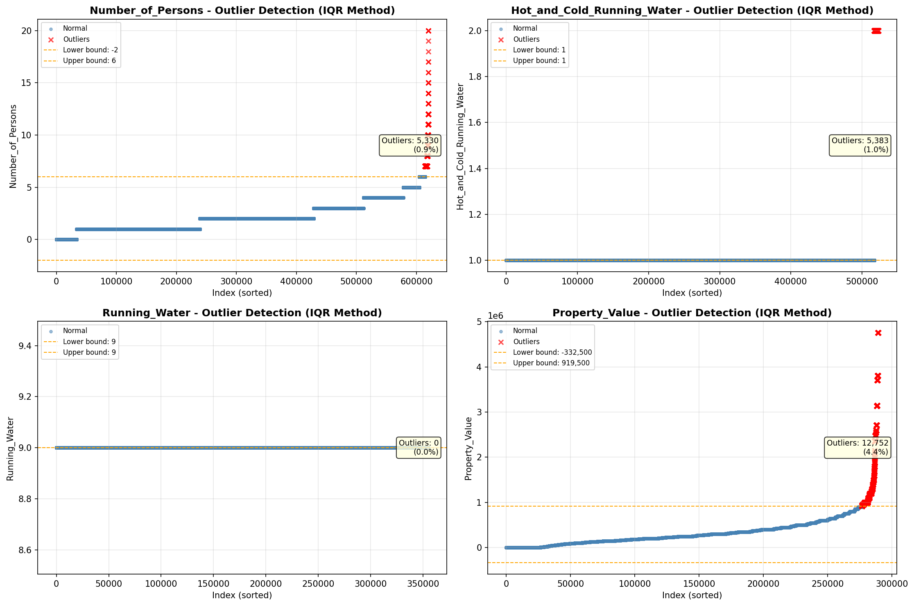
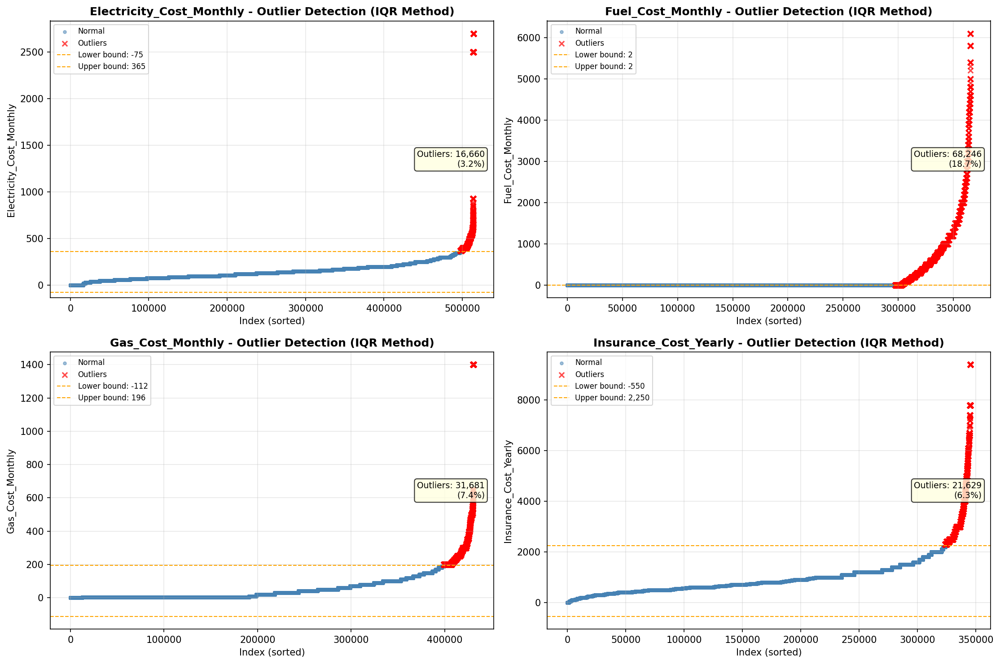
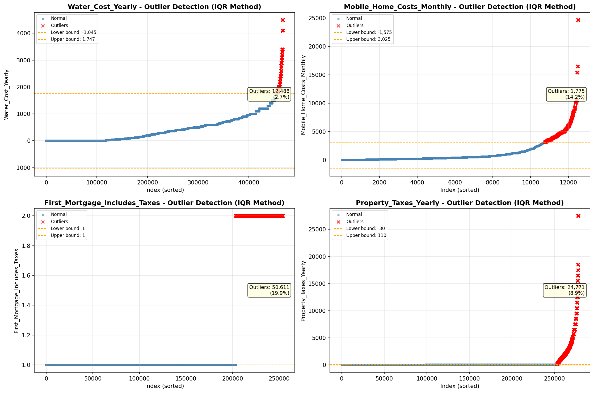

# Outlier Detection

> Statistical outlier detection using IQR (Interquartile Range) method. Outliers are values falling outside Q1 - 1.5×IQR or Q3 + 1.5×IQR bounds.

## Detection Methodology

| Parameter | Value | Description |
| :--- | :--- | :--- |
| Method | IQR | Outlier detection algorithm |
| Lower Bound | Q1 - 1.5 × IQR | Values below are outliers |
| Upper Bound | Q3 + 1.5 × IQR | Values above are outliers |
| IQR Definition | Q3 - Q1 | Interquartile Range |

> **Note**: The IQR method is robust to extreme values and works well for approximately symmetric distributions.

## Outlier Summary

_No outlier summary available._
## High Outlier Rate Variables

> Variables with outlier rate > 5% may indicate data quality issues, non-normal distributions, or genuinely extreme values.

- **('Flag_Selected_Monthly_Owner_Costs', 21.94810730616357)**: 0 outliers (0.00%)

- **('First_Mortgage_Includes_Taxes', 19.933124330455605)**: 0 outliers (0.00%)

- **('Flag_Family_Income', 19.845769908573725)**: 0 outliers (0.00%)

- **('Property_Tax_Rate', 18.898451684081426)**: 0 outliers (0.00%)

- **('Fuel_Cost_Monthly', 18.66577685636219)**: 0 outliers (0.00%)

- **('Mobile_Home_Costs_Monthly', 14.176184010861753)**: 0 outliers (0.00%)

- **('Flag_Property_Taxes', 11.184696615731264)**: 0 outliers (0.00%)

- **('Gross_Rent_Percentage_Income', 9.986535177788308)**: 0 outliers (0.00%)

- **('Income_Adjustment_Factor', 9.574120863946463)**: 0 outliers (0.00%)

- **('Structure_Age', 9.440692870534752)**: 0 outliers (0.00%)

- **('Property_Taxes_Yearly', 8.918644507172072)**: 0 outliers (0.00%)

- **('Working_Age_Persons', 8.763430140263964)**: 0 outliers (0.00%)

- **('Structure_Age_Score', 7.710383102984853)**: 0 outliers (0.00%)

- **('Flag_Water_Cost', 7.432014417516205)**: 0 outliers (0.00%)

- **('Gas_Cost_Monthly', 7.353531696017194)**: 0 outliers (0.00%)

> *Consider investigating these variables for data entry errors, applying transformations, or using robust statistical methods.*

## Visualizations

