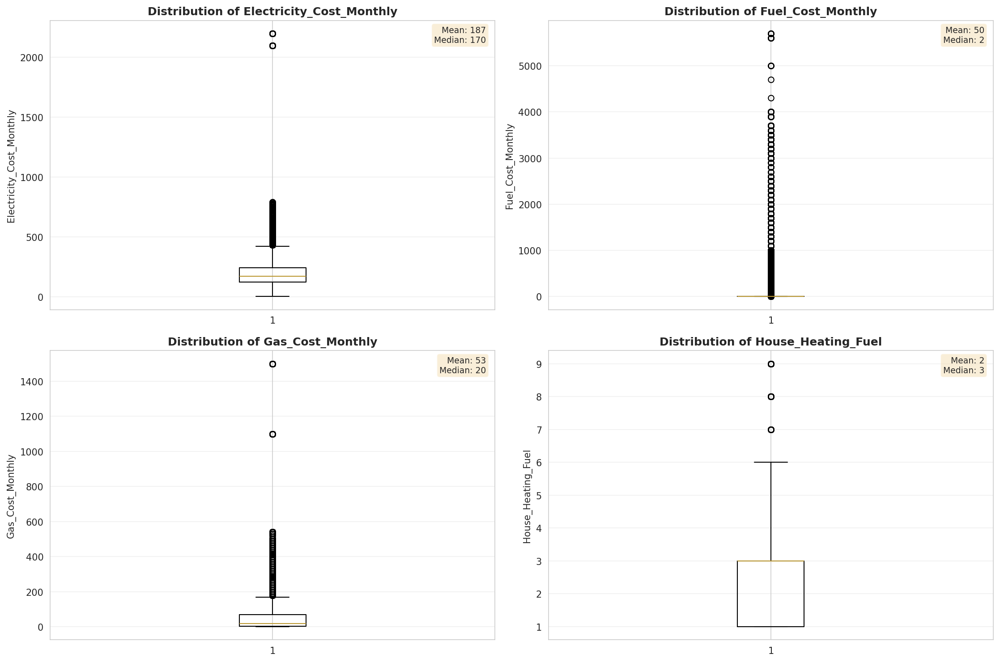
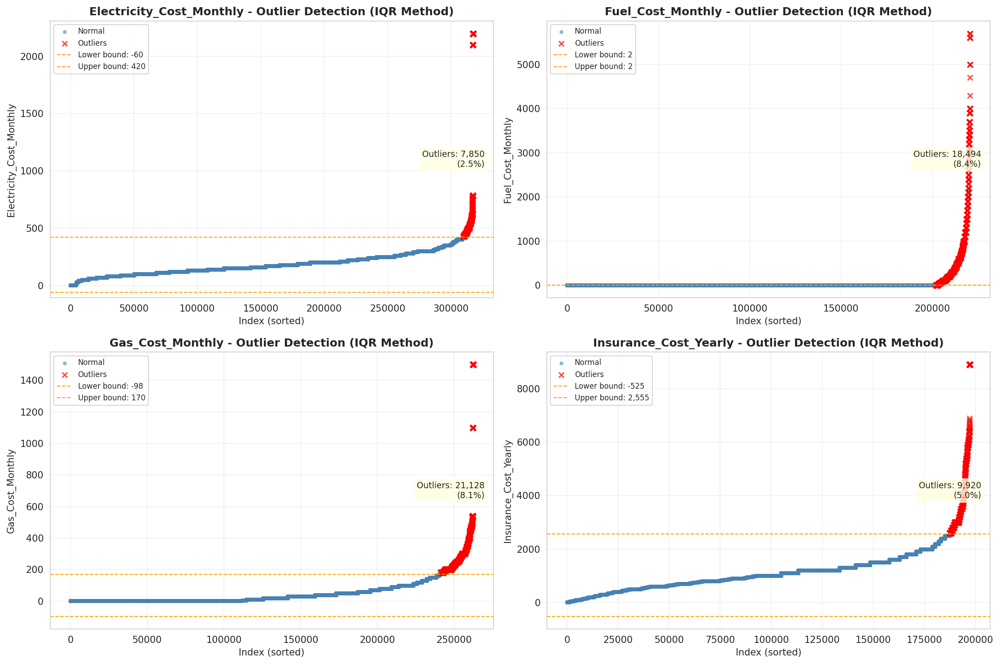

# Outlier Detection

> Statistical outlier detection using IQR (Interquartile Range) method. Outliers are values falling outside Q1 - 1.5×IQR or Q3 + 1.5×IQR bounds.

## Detection Methodology

| Parameter | Value | Description |
| :--- | :--- | :--- |
| Method | IQR | Outlier detection algorithm |
| Lower Bound | Q1 - 1.5 × IQR | Values below are outliers |
| Upper Bound | Q3 + 1.5 × IQR | Values above are outliers |
| IQR Definition | Q3 - Q1 | Interquartile Range |

> **Note**: The IQR method is robust to extreme values and works well for approximately symmetric distributions.

## Outlier Summary

_No outlier summary available._
## High Outlier Rate Variables

> Variables with outlier rate > 5% may indicate data quality issues, non-normal distributions, or genuinely extreme values.

- **('Specified_Rent_Unit', 24.25698064270369)**: 0 outliers (0.00%)

- **('Property_Tax_Rate', 22.418247775138973)**: 0 outliers (0.00%)

- **('Flag_Family_Income', 21.49627723680027)**: 0 outliers (0.00%)

- **('Mobile_Home_Costs_Monthly', 16.73453744071288)**: 0 outliers (0.00%)

- **('Flag_Property_Taxes', 10.91532926840241)**: 0 outliers (0.00%)

- **('Gross_Rent_Percentage_Income', 9.789740748301304)**: 0 outliers (0.00%)

- **('Income_Adjustment_Factor', 9.594098609629535)**: 0 outliers (0.00%)

- **('Structure_Age', 9.335566362845825)**: 0 outliers (0.00%)

- **('Flag_Property_Value', 9.228817191049316)**: 0 outliers (0.00%)

- **('Property_Taxes_Yearly', 9.083276788076043)**: 0 outliers (0.00%)

- **('Fuel_Cost_Monthly', 8.389888945343689)**: 0 outliers (0.00%)

- **('Flag_Water_Cost', 8.156088467079062)**: 0 outliers (0.00%)

- **('Gas_Cost_Monthly', 8.052749933300301)**: 0 outliers (0.00%)

- **('Owner_Costs_Percentage_Income', 7.647313323945096)**: 0 outliers (0.00%)

- **('Structure_Age_Score', 7.601533060646075)**: 0 outliers (0.00%)

> *Consider investigating these variables for data entry errors, applying transformations, or using robust statistical methods.*

## Visualizations

