# Deep Learning Models

> Neural network analysis using TensorFlow/Keras for complex pattern recognition and multi-output prediction tasks.

## Deep Learning Summary

- **Total Tasks**: 5

- **Tasks**: Property Valuation, Affordability Analysis, Housing Quality, Cost Prediction, Occupancy Prediction

### Aggregate Statistics

| Metric | Value |
| :--- | :--- |
| Total Parameters | 78,283 |
| Average Validation Loss | 2119576177.9225 |
| Number of Tasks | 5 |

## Task: Property Valuation

### Model Configuration

| Property | Value |
| :--- | :--- |
| Model Type | HousingValuationModel |
| Task Type | Multi_Output |
| Target Variables | Property_Value, Gross_Rent |
| Number of Targets | 2 |
| Input Features | 10 |

### Network Architecture

| Component | Value | Notes |
| :--- | :--- | :--- |
| Total Layers | 7 | Including input and output |
| Total Parameters | 36,994 | Trainable weights |
| Parameters per Layer | 5,284 | Average |

### Performance Metrics

| Metric | Value | Assessment |
| :--- | :--- | :--- |
| Training Loss | 10905644032.0000 | Final epoch |
| Validation Loss | 10597607424.0000 | Final epoch |
| Loss Gap | -308036608.0000 | NONE overfitting risk |

> *Good generalization*

#### Test Set Metrics

| Metric | Value | Description |
| :--- | :--- | :--- |
| MAE | 27738.3691 | Mean Absolute Error (lower is better) |
| MSE | 10960420864.0000 | Mean Squared Error (lower is better) |
| RMSE | 104692.0287 | Root Mean Squared Error (lower is better) |
| R2 | -0.1735 | R-squared (higher is better) |

### Training Analysis

| Training Statistic | Value |
| :--- | :--- |
| Epochs Trained | 75 |
| Initial Training Loss | 19420868608.0000 |
| Final Training Loss | 10905644032.0000 |
| Loss Improvement | 43.8% |
| Initial Validation Loss | 12516040704.0000 |
| Final Validation Loss | 10597607424.0000 |
| Validation Improvement | 15.3% |

#### Convergence Assessment

- **Status**: Fully converged (< 1% change in last 10 epochs)

- **Last 10 epochs change**: 0.41%

## Task: Affordability Analysis

### Model Configuration

| Property | Value |
| :--- | :--- |
| Model Type | HousingAffordabilityModel |
| Task Type | Multi_Output |
| Target Variables | Owner_Costs_Percentage_Income, Gross_Rent_Percentage_Income |
| Number of Targets | 2 |
| Input Features | 10 |

### Network Architecture

| Component | Value | Notes |
| :--- | :--- | :--- |
| Total Layers | 6 | Including input and output |
| Total Parameters | 10,306 | Trainable weights |
| Parameters per Layer | 1,717 | Average |

### Performance Metrics

| Metric | Value | Assessment |
| :--- | :--- | :--- |
| Training Loss | 194.6988 | Final epoch |
| Validation Loss | 195.2556 | Final epoch |
| Loss Gap | 0.5568 | HIGH overfitting risk |

> *Model may be overfitting significantly*

#### Test Set Metrics

| Metric | Value | Description |
| :--- | :--- | :--- |
| MAE | 6.5762 | Mean Absolute Error (lower is better) |
| MSE | 194.0172 | Mean Squared Error (lower is better) |
| RMSE | 13.9290 | Root Mean Squared Error (lower is better) |
| R2 | 0.0505 | R-squared (higher is better) |

### Training Analysis

| Training Statistic | Value |
| :--- | :--- |
| Epochs Trained | 75 |
| Initial Training Loss | 241.8705 |
| Final Training Loss | 194.6988 |
| Loss Improvement | 19.5% |
| Initial Validation Loss | 202.1417 |
| Final Validation Loss | 195.2556 |
| Validation Improvement | 3.4% |

#### Convergence Assessment

- **Status**: Fully converged (< 1% change in last 10 epochs)

- **Last 10 epochs change**: 0.05%

## Task: Housing Quality

### Model Configuration

| Property | Value |
| :--- | :--- |
| Model Type | HousingQualityModel |
| Task Type | Multi_Output |
| Target Variables | Year_Structure_Built, Number_of_Bedrooms, Number_of_Rooms |
| Number of Targets | 3 |
| Input Features | 10 |

### Network Architecture

| Component | Value | Notes |
| :--- | :--- | :--- |
| Total Layers | 6 | Including input and output |
| Total Parameters | 10,371 | Trainable weights |
| Parameters per Layer | 1,728 | Average |

### Performance Metrics

| Metric | Value | Assessment |
| :--- | :--- | :--- |
| Training Loss | 206.7318 | Final epoch |
| Validation Loss | 10.9165 | Final epoch |
| Loss Gap | -195.8153 | NONE overfitting risk |

> *Good generalization*

#### Test Set Metrics

| Metric | Value | Description |
| :--- | :--- | :--- |
| MAE | 1.1230 | Mean Absolute Error (lower is better) |
| MSE | 11.0710 | Mean Squared Error (lower is better) |
| RMSE | 3.3273 | Root Mean Squared Error (lower is better) |
| R2 | 0.8763 | R-squared (higher is better) |

### Training Analysis

| Training Statistic | Value |
| :--- | :--- |
| Epochs Trained | 75 |
| Initial Training Loss | 11325.0830 |
| Final Training Loss | 206.7318 |
| Loss Improvement | 98.2% |
| Initial Validation Loss | 46.3393 |
| Final Validation Loss | 10.9165 |
| Validation Improvement | 76.4% |

#### Convergence Assessment

- **Status**: Still improving (> 5% change)

- **Last 10 epochs change**: 7.57%

## Task: Cost Prediction

### Model Configuration

| Property | Value |
| :--- | :--- |
| Model Type | HousingDefaultModel |
| Task Type | Multi_Output |
| Target Variables | Property_Taxes_Yearly, Insurance_Cost_Yearly |
| Number of Targets | 2 |
| Input Features | 10 |

### Network Architecture

| Component | Value | Notes |
| :--- | :--- | :--- |
| Total Layers | 6 | Including input and output |
| Total Parameters | 10,306 | Trainable weights |
| Parameters per Layer | 1,717 | Average |

### Performance Metrics

| Metric | Value | Assessment |
| :--- | :--- | :--- |
| Training Loss | 266127.2500 | Final epoch |
| Validation Loss | 273259.0312 | Final epoch |
| Loss Gap | 7131.7812 | HIGH overfitting risk |

> *Model may be overfitting significantly*

#### Test Set Metrics

| Metric | Value | Description |
| :--- | :--- | :--- |
| MAE | 208.6537 | Mean Absolute Error (lower is better) |
| MSE | 267810.2500 | Mean Squared Error (lower is better) |
| RMSE | 517.5039 | Root Mean Squared Error (lower is better) |
| R2 | 0.1789 | R-squared (higher is better) |

### Training Analysis

| Training Statistic | Value |
| :--- | :--- |
| Epochs Trained | 75 |
| Initial Training Loss | 391543.5625 |
| Final Training Loss | 266127.2500 |
| Loss Improvement | 32.0% |
| Initial Validation Loss | 285387.0000 |
| Final Validation Loss | 273259.0312 |
| Validation Improvement | 4.2% |

#### Convergence Assessment

- **Status**: Fully converged (< 1% change in last 10 epochs)

- **Last 10 epochs change**: 0.12%

## Task: Occupancy Prediction

### Model Configuration

| Property | Value |
| :--- | :--- |
| Model Type | HousingDefaultModel |
| Task Type | Multi_Output |
| Target Variables | Vacancy_Status, Tenure |
| Number of Targets | 2 |
| Input Features | 10 |

### Network Architecture

| Component | Value | Notes |
| :--- | :--- | :--- |
| Total Layers | 6 | Including input and output |
| Total Parameters | 10,306 | Trainable weights |
| Parameters per Layer | 1,717 | Average |

### Performance Metrics

| Metric | Value | Assessment |
| :--- | :--- | :--- |
| Training Loss | 0.4202 | Final epoch |
| Validation Loss | 0.4094 | Final epoch |
| Loss Gap | -0.0108 | NONE overfitting risk |

> *Good generalization*

#### Test Set Metrics

| Metric | Value | Description |
| :--- | :--- | :--- |
| MAE | 0.3224 | Mean Absolute Error (lower is better) |
| MSE | 0.4126 | Mean Squared Error (lower is better) |
| RMSE | 0.6424 | Root Mean Squared Error (lower is better) |
| R2 | 0.2260 | R-squared (higher is better) |

### Training Analysis

| Training Statistic | Value |
| :--- | :--- |
| Epochs Trained | 75 |
| Initial Training Loss | 0.9059 |
| Final Training Loss | 0.4202 |
| Loss Improvement | 53.6% |
| Initial Validation Loss | 0.4781 |
| Final Validation Loss | 0.4094 |
| Validation Improvement | 14.4% |

#### Convergence Assessment

- **Status**: Fully converged (< 1% change in last 10 epochs)

- **Last 10 epochs change**: 0.17%

## Cross-Task Comparison

| Task | Model Type | Parameters | Train Loss | Val Loss | Gap |
| :--- | :--- | :--- | :--- | :--- | :--- |
| Property Valuation | HousingValuationModel | 36,994 | 10905644032.0000 | 10597607424.0000 | -308036608.0000 |
| Affordability Analysis | HousingAffordabilityModel | 10,306 | 194.6988 | 195.2556 | 0.5568 |
| Housing Quality | HousingQualityModel | 10,371 | 206.7318 | 10.9165 | -195.8153 |
| Cost Prediction | HousingDefaultModel | 10,306 | 266127.2500 | 273259.0312 | 7131.7812 |
| Occupancy Prediction | HousingDefaultModel | 10,306 | 0.4202 | 0.4094 | -0.0108 |

## Visualizations

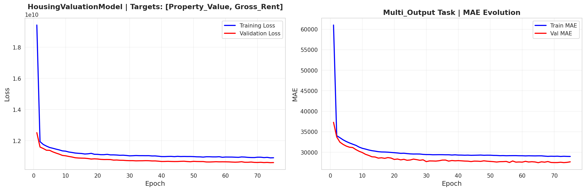

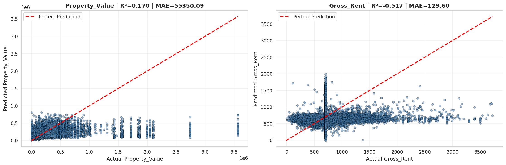

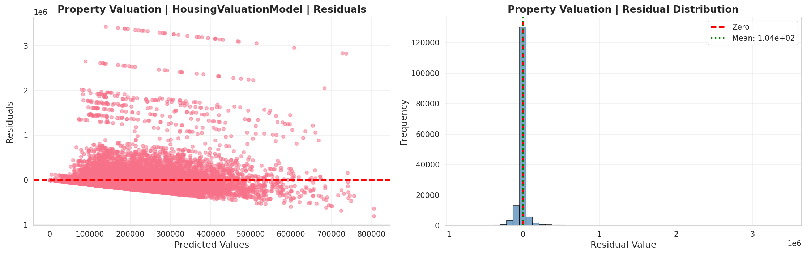

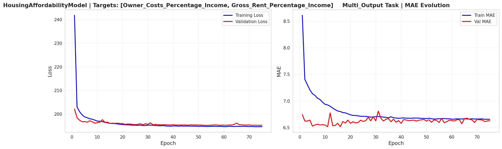

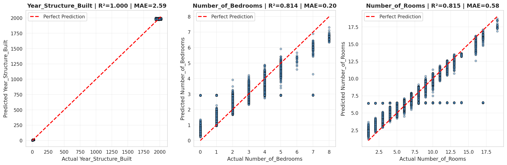

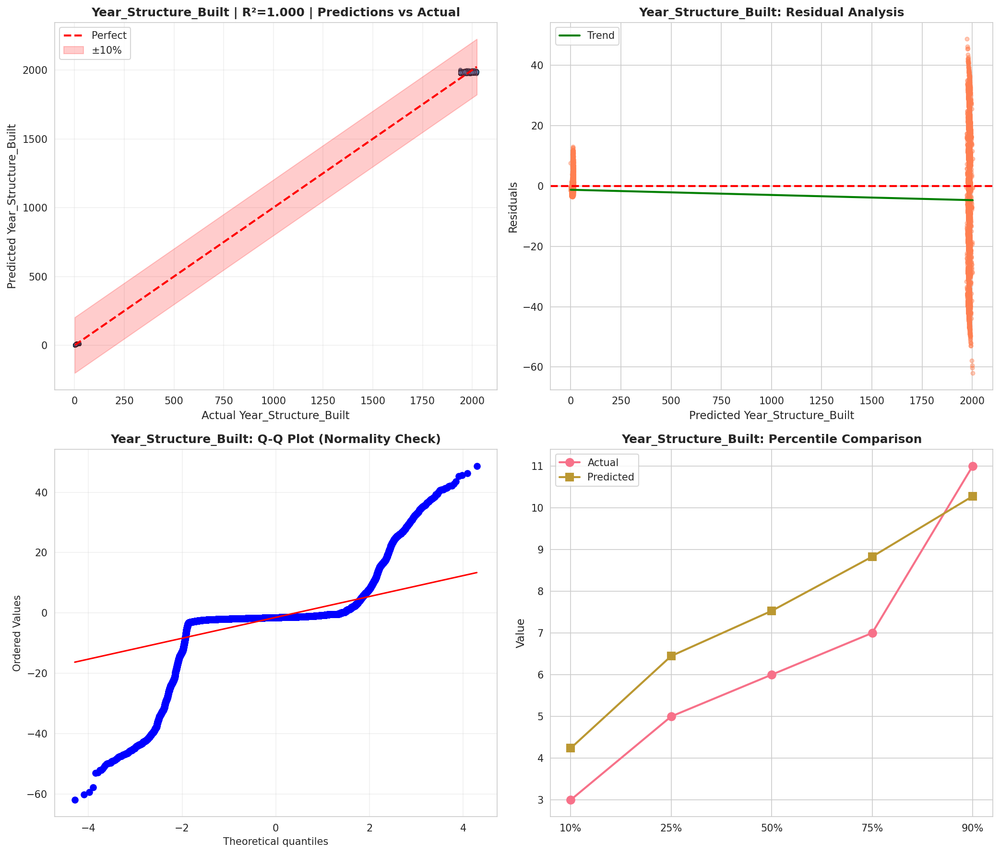

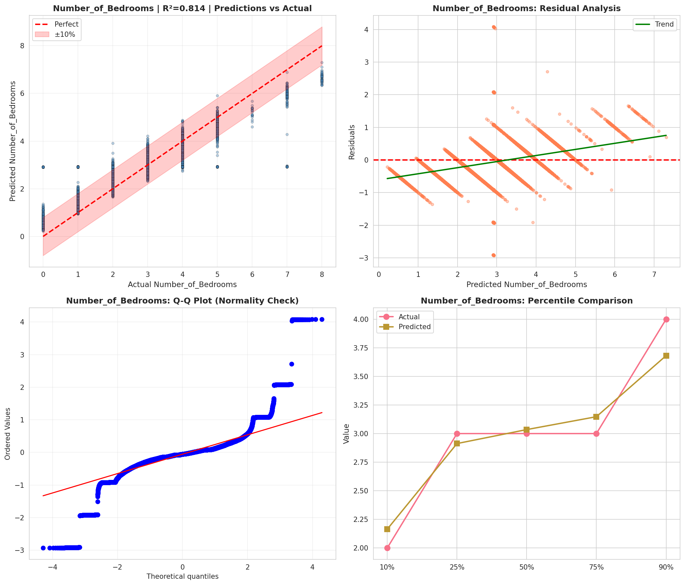

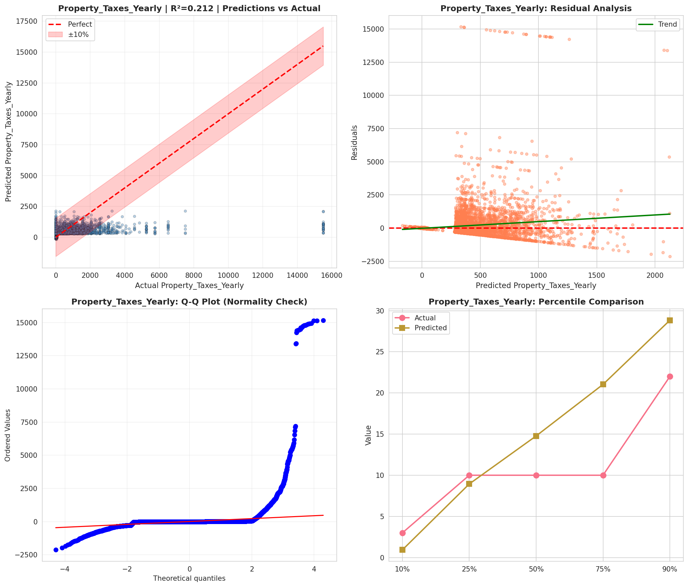

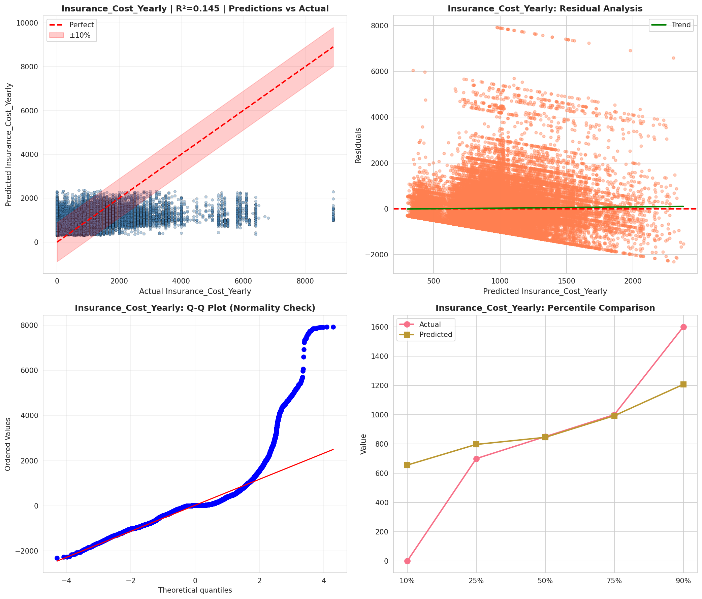

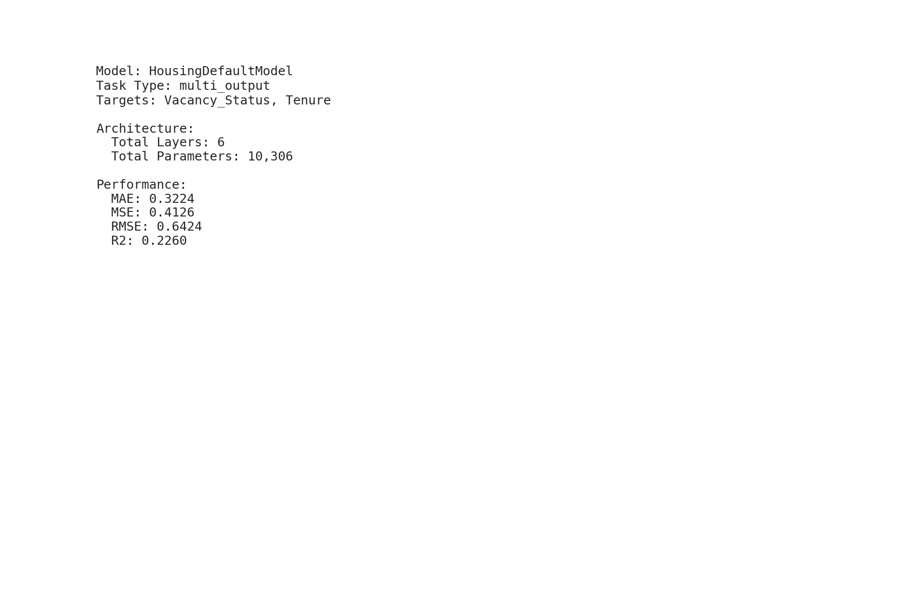

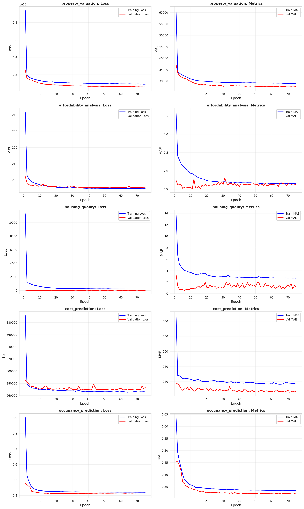

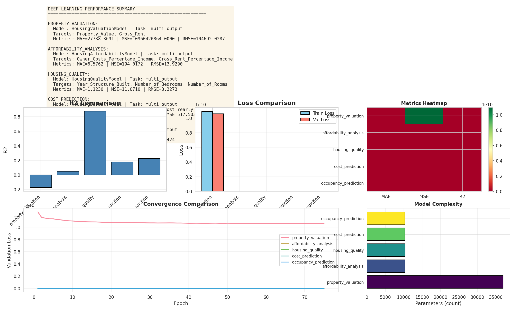

