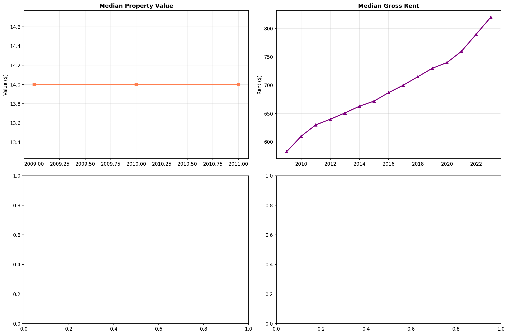
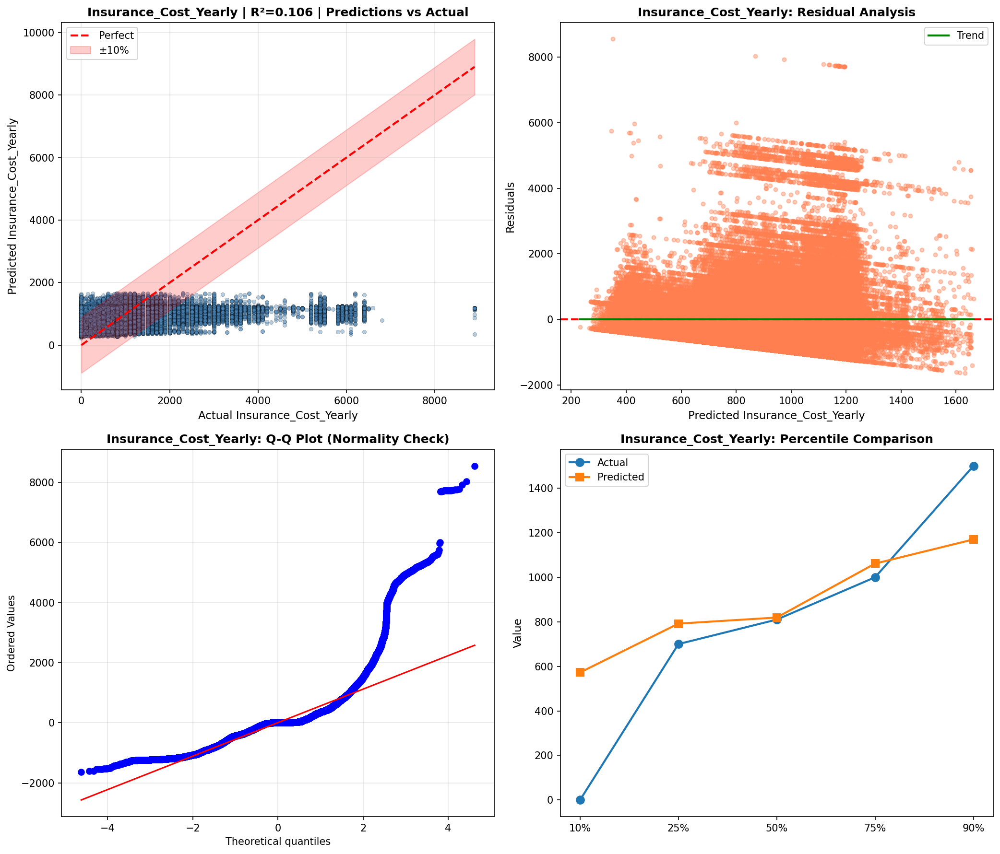
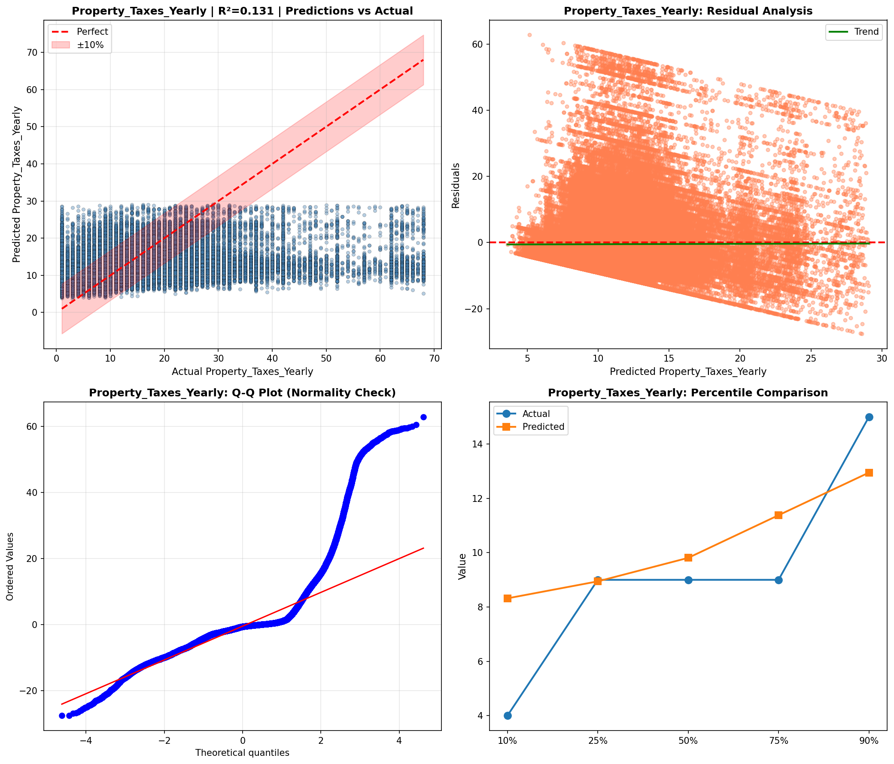
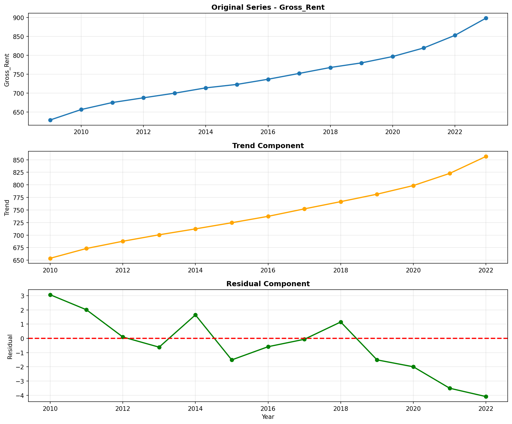
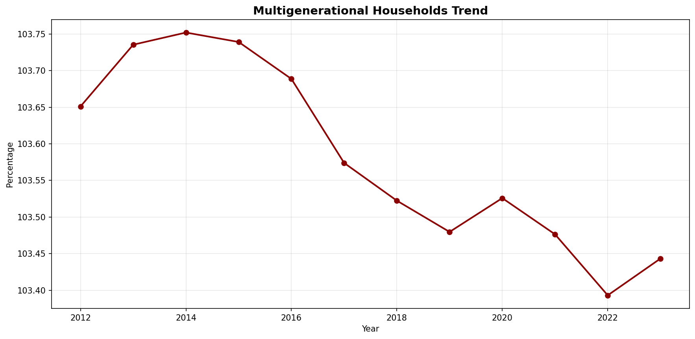
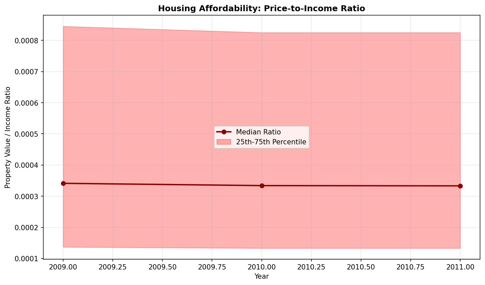
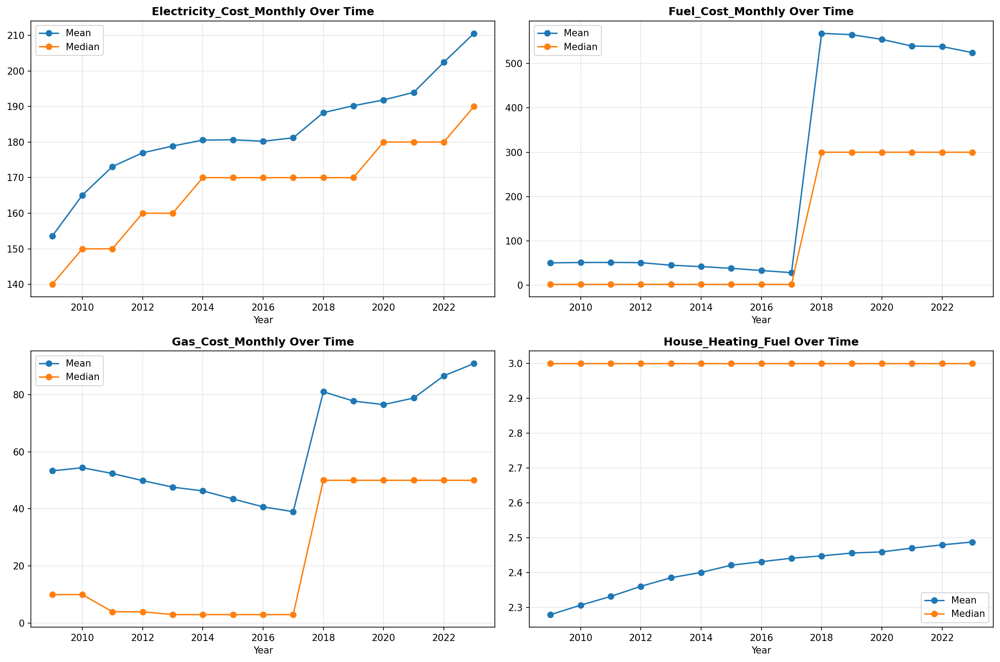
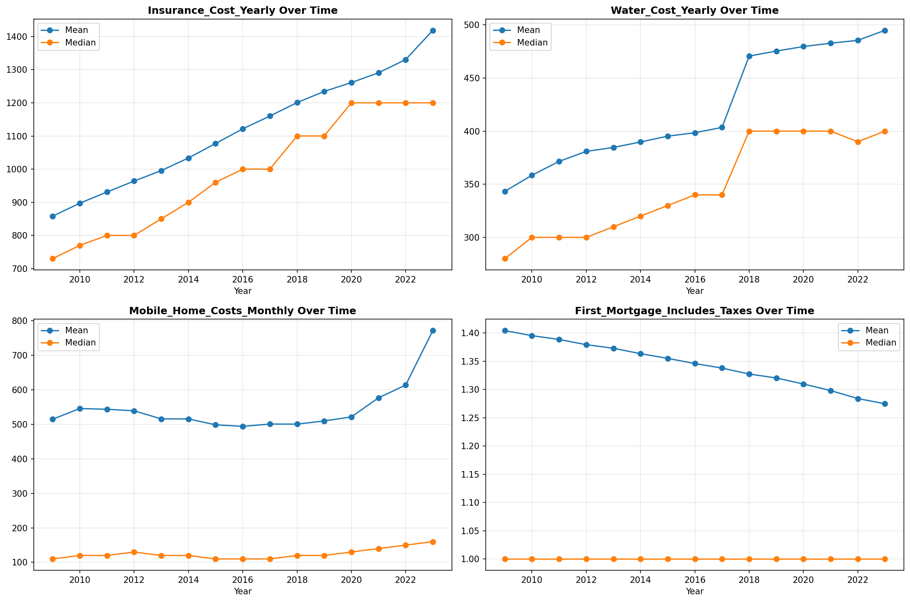
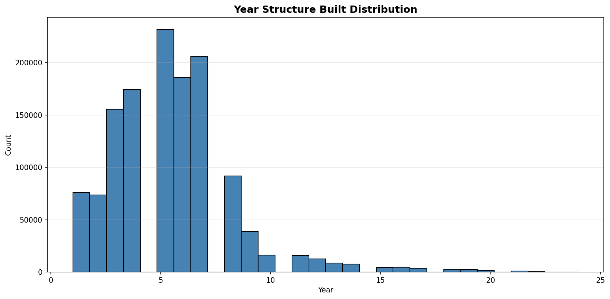
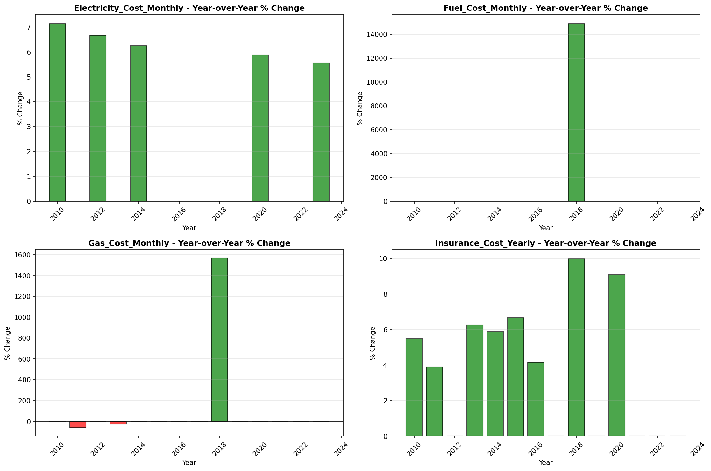

# Temporal Analysis

> Analysis of data patterns and trends over time, including year-over-year changes and growth rate calculations.

## Year Distribution

### Summary

- **Total Years**: 15

- **Year Range**: 2009 - 2023

- **Total Records**: 1,801,316

- **Average Records/Year**: 120,088

### Records by Year

| Year | Records | % of Total | Deviation from Avg |
| :--- | :--- | :--- | :--- |
| 2009 | 111,480 | 6.2% | -7.2% |
| 2010 | 113,561 | 6.3% | -5.4% |
| 2011 | 115,556 | 6.4% | -3.8% |
| 2012 | 117,065 | 6.5% | -2.5% |
| 2013 | 118,492 | 6.6% | -1.3% |
| 2014 | 119,713 | 6.6% | -0.3% |
| 2015 | 121,305 | 6.7% | +1.0% |
| 2016 | 121,670 | 6.8% | +1.3% |
| 2017 | 122,542 | 6.8% | +2.0% |
| 2018 | 123,364 | 6.8% | +2.7% |
| 2019 | 124,327 | 6.9% | +3.5% |
| 2020 | 120,798 | 6.7% | +0.6% |
| 2021 | 121,998 | 6.8% | +1.6% |
| 2022 | 123,586 | 6.9% | +2.9% |
| 2023 | 125,859 | 7.0% | +4.8% |

> *Sample size increased by 12.9% from 2009 to 2023.*

## Sample Size Consistency

- **Standard Deviation**: 3,979 records

- **Coefficient of Variation**: 3.3 %

- **Consistency Rating**: highly consistent

> *Sample sizes are stable across years.*

## Temporal Trends

### Trend Summary

| Direction | Count | Percentage |
| :--- | :--- | :--- |
| Increasing | 0 | 0.0% |
| Decreasing | 0 | 0.0% |
| Stable/Other | 228 | 100.0% |

## Growth Rates

### Growth Rate Summary

- **Average Growth Rate**: 1,289.83 %

- **Variables with Positive Growth**: 1

- **Variables with Negative Growth**: 0

### Top Growth Rates

| Variable | Growth Rate | Direction |
| :--- | :--- | :--- |
| sample_growth | 1289.83% | Increasing |

## Visualizations

